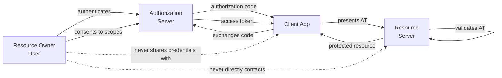

⚡ TL;DR - OAuth 2.0 (RFC 6749, October 2012) was designed
to solve a specific problem: third-party applications
needed a way to act on behalf of users without users
sharing their passwords. The "password anti-pattern"
was endemic on the early web (apps asking for Gmail/
Facebook passwords to access contacts). OAuth introduces
the authorization server as a trusted intermediary: the
user delegates specific permissions (scope) to a client,
and the AS issues a scoped access token. The three key
design decisions that shaped OAuth: (1) tokens not
credentials (AT replaces password at RS); (2) the client
never sees the user's password (AS owns authentication);
(3) scope limits damage (a compromised AT affects only
its granted scopes). The intentional design gap: RFC 6749
defines a framework, not a protocol - many security-critical
details were left for implementations to define, which
created the vulnerability landscape OAuth Security Topics
(RFC 9700) later addresses.

---

### 🔥 The Problem This Solves

**THE PASSWORD ANTI-PATTERN:**

Before OAuth, third-party applications that needed access
to user data at another service (e.g., a travel app
needing to read your Gmail calendar) asked users to provide
their Gmail username and password. The app would then
impersonate the user entirely - with full account access,
forever, until the user changed their password. There was
no way to grant limited access, no expiry, no revocation
without a password change. OAuth was invented to solve
this specifically: give the third-party app only what it
needs (scope), only for as long as needed, and without
exposing the user's credential.

---

### 📘 Textbook Definition

RFC 6749 (OAuth 2.0, October 2012) defines the OAuth
authorization framework - a protocol for delegated
authorization between a resource owner (user), a client
(third-party app), an authorization server (issues tokens),
and a resource server (holds protected data).

**Core design decisions and their rationale:**

**Decision 1: Separate Authentication from Authorization**
The AS handles authentication (who are you?).
The RS handles authorization enforcement (what can you do?).
Rationale: clients NEVER see the user's credentials.
The AS is the only component that authenticates the user.
This prevents the password anti-pattern permanently.

**Decision 2: Access Tokens, Not Credentials**
The RS receives an access token (opaque string or JWT),
not the user's credentials.
Rationale: tokens can be scoped (limited permissions),
time-bounded (TTL), and revoked without changing the
user's password. A stolen AT has a limited blast radius.

**Decision 3: Scope as the Delegation Mechanism**
The client requests specific scopes. The user consents
to specific scopes. The AT carries only those scopes.
Rationale: principle of least privilege at the API level.
A calendar-reading app gets `calendar:read`, not full
account access.

**Decision 4: Multiple Grant Types for Different Contexts**
RFC 6749 defines four grant types for different client
environments:
- Authorization Code: server-side web apps (most secure)
- Implicit: browser-only apps (deprecated in OAuth 2.1)
- Resource Owner Password Credentials: legacy migration only
- Client Credentials: machine-to-machine

Rationale: no single flow fits all contexts. A mobile app
cannot keep a client_secret secure. A server-side app can.
A background job has no user to redirect.

**Intentional design gaps (what RFC 6749 left undefined):**
- Token format (JWT vs opaque - left to implementations)
- Token validation at RS (left to implementations)
- Client authentication methods beyond basic
- Redirect URI validation specifics
- State parameter format
- Scope syntax

This flexibility was intentional (allow diverse deployments)
but created security implementation variance. OAuth Security
Topics (RFC 9700) and OAuth 2.1 later codified the secure
baseline.

---

### ⏱️ Understand It in 30 Seconds

**Why the authorization code flow is designed the way it is:**

```
PROBLEM: How does the client get a token without:
  (a) seeing the user's password
  (b) the token being exposed in the browser URL/history

SOLUTION: Two-step indirection

  Step 1: Authorization Code (short-lived, single-use)
    - Lives in the URL (visible)
    - Can only be exchanged once
    - Useless without the client secret
    - Short TTL (120 seconds)

  Step 2: Token Exchange (back-channel)
    - POST to /token endpoint (server-side, not in URL)
    - Requires client authentication (secret or PKCE)
    - Receives AT + RT (not in URL, not in browser history)

WHY NOT just return the AT in the URL?
  → AT would be in browser history, server logs, referer headers
  → The implicit flow DID return AT in URL - hence it's deprecated

WHY not return AT in the callback at all?
  → The authorization code step decouples browser (user agent)
    from token delivery
  → Even if the callback URL is intercepted, code alone
    is useless without the client secret (or PKCE verifier)
  → This is the core security property of the code flow
```

---

### ⚙️ How It Works (Mechanism)

```
┌──────────────────────────────────────────────────────────┐
│  RFC 6749 DESIGN: THE FOUR ROLES                         │
├──────────────────────────────────────────────────────────┤
│                                                           │
│  RESOURCE OWNER (User)                                   │
│   - Owns the protected resource                          │
│   - Grants permission via consent                        │
│   - NEVER shares credentials with the client             │
│                                                           │
│  CLIENT (Third-party App)                                │
│   - Requests access on behalf of user                    │
│   - Receives access token (not user credentials)         │
│   - Presents AT to RS for resource access                │
│                                                           │
│  AUTHORIZATION SERVER (AS)                               │
│   - Authenticates the resource owner                     │
│   - Issues access tokens and refresh tokens              │
│   - Manages consent and scope                            │
│   - The only component that sees the user's credentials  │
│                                                           │
│  RESOURCE SERVER (RS)                                    │
│   - Holds the protected resources                        │
│   - Validates the access token                           │
│   - Enforces scope restrictions                          │
│   - Never sees user credentials                          │
│                                                           │
│  KEY DESIGN INSIGHT:                                     │
│  The client and RS never communicate with each other     │
│  about the user's identity - only through tokens.        │
│  The AS is the trust anchor.                             │
└──────────────────────────────────────────────────────────┘
```



---

### 💻 Code Example

**Example 1 - The design rationale illustrated in scope enforcement:**

```python
# BAD: Pre-OAuth password delegation pattern.
# App has full account access, forever.
# This is the EXACT anti-pattern OAuth was designed to prevent.

class EmailClientPreOAuth:
    def __init__(self, gmail_username: str, gmail_password: str):
        # BAD: App stores and uses user's actual credentials
        # Full account access. No scope. No expiry. No revocation.
        self.username = gmail_username
        self.password = gmail_password

    def read_contacts(self):
        # Logs in as the user with their password
        # Full account access including email, drive, etc.
        return gmail_api_login(self.username, self.password).contacts
```

```python
# GOOD: OAuth design - token, not password; scope, not full access.
# The client NEVER has the user's password.
# The token is scoped to only what's needed.
# WHY: Each design element maps to a specific security property.

class EmailClientOAuth:
    def __init__(self, access_token: str, scopes: list[str]):
        # GOOD: App receives a scoped, time-limited token.
        # The token was issued by the AS after the user consented
        # to specific scopes. The user's password was never shared.
        self.access_token = access_token
        self.granted_scopes = scopes

    def read_contacts(self):
        # The RS (Google) validates the AT and scope.
        # If scope doesn't include 'contacts:read', the RS returns 403.
        # The token can be revoked (user withdraws consent in Google).
        # The token expires automatically (TTL).
        # A compromised AT only grants what was scoped.
        return google_contacts_api(
            access_token=self.access_token,
            required_scope="contacts:read",  # The AS-enforced limit
        )

# OAuth scope enforcement at the RS:
def contacts_api_endpoint(request):
    token_claims = validate_token(request.headers['Authorization'])
    scope = token_claims.get('scope', '')
    if 'contacts:read' not in scope.split():
        return 403, "Insufficient scope"
    # RFC 6749 design principle: scope is the authorization limit.
    # The RS enforces scope, not role or user identity alone.
    return 200, get_contacts(token_claims['sub'])
```

**Example 2 - The two-step code flow (design rationale):**

```python
# WHY the code flow has two steps:
# Step 1 proves user consent (in browser).
# Step 2 delivers the token securely (back-channel).

# Step 1: Authorization Code in callback URL (visible but safe)
# code is single-use, 120s TTL, useless without client secret.
# Even if intercepted (URL leaks), attacker can't use code alone.
def handle_callback(code: str, state: str) -> None:
    # code is in the URL - visible in browser history, server logs
    # Design decision: code is intentionally safe to expose briefly
    # because it requires client authentication to exchange
    validate_state(state)
    exchange_code_for_tokens(code)

# Step 2: Token Exchange via back-channel (never in URL)
def exchange_code_for_tokens(code: str) -> dict:
    # POST to AS - server-to-server, not in browser URL
    # This is why AT is never in browser history
    response = requests.post(AS_TOKEN_ENDPOINT, data={
        "grant_type": "authorization_code",
        "code": code,
        "redirect_uri": REDIRECT_URI,
        "client_id": CLIENT_ID,
        "client_secret": CLIENT_SECRET,  # Or PKCE verifier
    })
    return response.json()
    # AT returned in JSON body (not URL)
    # Secure delivery: HTTPS, server-to-server
    # Design goal achieved: AT never in browser URL/history
```

---

### ⚖️ Comparison Table

| Pre-OAuth | OAuth 2.0 | What Changed |
|---|---|---|
| User shares password | User authenticates at AS | Client never sees password |
| Full account access | Scoped AT (e.g., contacts:read) | Least privilege |
| No expiry | Token TTL (minutes to hours) | Compromise window limited |
| No revocation | Revoke AT or RT at AS | Instant revocation possible |
| App stores credentials | App stores client credentials | Separate identity model |

---

### ⚠️ Common Misconceptions

| Misconception | Reality |
|---|---|
| OAuth is an authentication protocol | RFC 6749 OAuth is an authorization protocol. It defines how to delegate resource access, not how to verify identity. OAuth tells you "this token allows reading contacts" but not "this token was issued to alice@example.com". OIDC (OpenID Connect) adds the identity layer on top of OAuth: the ID token carries the user's identity claims. Many developers use "OAuth" to mean both OAuth + OIDC, but the distinction matters. |
| RFC 6749 defines a complete, secure OAuth implementation | RFC 6749 defines the framework but deliberately left many security-critical details unspecified (redirect URI validation, token format, state usage). This flexibility enabled diverse implementations but also created security inconsistencies. OAuth Security Topics (RFC 9700) and OAuth 2.1 (currently in draft) fill these gaps with mandatory security requirements. A production-safe OAuth implementation requires following RFC 9700 in addition to RFC 6749. |
| The Implicit Flow is just a simplification of the Code Flow | The Implicit Flow (returning AT directly in the redirect URL fragment) was designed for browser-based applications that couldn't keep a client secret. In practice it introduced a significant security regression: the AT is in the URL, visible to scripts on the page, and in browser history. The security assumption (AT in fragment = less visible than URL) proved incorrect in practice. OAuth 2.1 removes the Implicit Flow entirely. Modern browser-based apps use the Code Flow with PKCE. |

---

### 🚨 Failure Modes & Diagnosis

**Scope Creep: Client Requests Overly Broad Scopes**

**Symptom:**
A security audit reveals that 80% of clients have
requested the broadest available scopes (`*:admin`) even
though they only need narrow read access. An AS compromise
or stolen AT from any of these clients grants admin access.

**Diagnostic:**

```python
# Audit: which clients have been granted which scopes?
# AS admin API (Keycloak example):

import requests

def audit_client_scopes(as_admin_url: str, realm: str, token: str):
    resp = requests.get(
        f"{as_admin_url}/admin/realms/{realm}/clients",
        headers={"Authorization": f"Bearer {token}"},
        params={"max": 200},
    )
    clients = resp.json()
    risky_clients = []
    for client in clients:
        scopes = client.get('defaultClientScopes', [])
        if any('admin' in s or '*' in s for s in scopes):
            risky_clients.append({
                'client_id': client['clientId'],
                'scopes': scopes,
            })
    return risky_clients
```

**Fix:**
1. Implement scope governance: require justification for
   any scope broader than read access.
2. Apply scope minimization review: audit each client's
   scopes against its actual API usage (RS logs show
   which scopes are actually used per client).
3. Set short AT lifetimes for admin-scoped tokens.
4. Implement scope approval workflow in AS client registration.

---

### 🔗 Related Keywords

**Prerequisites:**
- `Authorization Code Flow` - the primary grant type
- `OAuth 2.0 Scopes` - the delegation mechanism

**Builds On:**
- `OAuth 2.1 Consolidation and Simplification`
- `Formal Security Analysis of OAuth 2.0`

---

### 📌 Quick Reference Card

```
┌──────────────────────────────────────────────────────────┐
│ WHY OAUTH    │ Solve password delegation anti-pattern    │
│ WAS BUILT    │ Third-party apps needed limited access    │
│              │ without receiving user passwords          │
├──────────────┼───────────────────────────────────────────┤
│ FOUR ROLES   │ Resource Owner, Client, AS, RS            │
│              │ Client never sees user credentials        │
├──────────────┼───────────────────────────────────────────┤
│ KEY          │ Token not credential, scope not full      │
│ PROPERTIES   │ access, AS owns authentication            │
├──────────────┼───────────────────────────────────────────┤
│ CODE FLOW    │ Step 1: code in URL (safe, short-lived)   │
│ RATIONALE    │ Step 2: AT via back-channel (not in URL)  │
├──────────────┼───────────────────────────────────────────┤
│ RFC GAP      │ RFC 6749 = framework, not full protocol   │
│              │ Security gaps filled by RFC 9700+OAuth 2.1│
├──────────────┼───────────────────────────────────────────┤
│ ONE-LINER    │ "OAuth replaces passwords with scoped     │
│              │  tokens. AS is the trust anchor."         │
└──────────────────────────────────────────────────────────┘
```

**If you remember only 3 things:**

1. OAuth was built to solve the password anti-pattern:
   third-party apps asking for your password to access
   your data. The solution: user authenticates at AS
   (never shares password with client), AS issues a scoped
   AT, client presents AT to RS. Client never sees the
   user's password.

2. The two-step authorization code flow is designed so
   the access token is never in the browser URL. The code
   (step 1, in URL) is safe to expose briefly because it
   requires client authentication to exchange. The AT
   (step 2, in JSON body via server-side POST) never
   appears in browser history or server access logs.

3. RFC 6749 is a framework with intentional flexibility.
   Many security-critical details were left to implementations.
   Production-safe OAuth requires following RFC 9700
   (OAuth Security BCP) and OAuth 2.1 in addition to
   RFC 6749. "We implement RFC 6749" is not sufficient.
