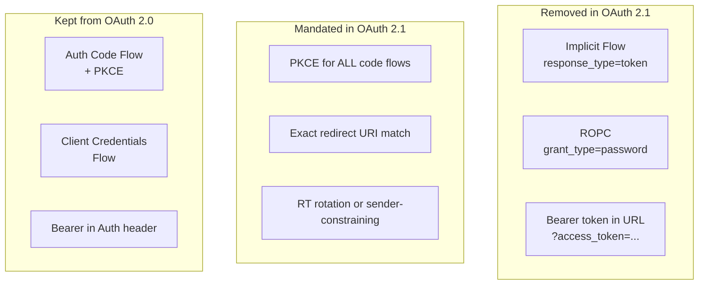

⚡ TL;DR - OAuth 2.1 (IETF draft, stable as of 2024)
consolidates 10+ years of OAuth security learnings into
a single specification by: (1) removing deprecated flows
(Implicit Flow removed entirely; ROPC strongly discouraged);
(2) mandating PKCE for ALL authorization code flows (not
just public clients); (3) mandating exact-match redirect
URI validation; (4) prohibiting bearer tokens in URI query
parameters; (5) making refresh token rotation best practice;
(6) requiring sender-constraining for refresh tokens via
rotation. OAuth 2.1 is backwards-compatible with properly
implemented OAuth 2.0 (if you followed the security BCP).
Implementors who followed RFC 6749 without the security
BCP (RFC 9700) will need to remove implicit flow support
and add PKCE to all code flows.

---

### 🔥 The Problem This Solves

**TEN YEARS OF SECURITY DEBT IN ONE SPEC:**

OAuth 2.0 (RFC 6749, 2012) was a framework with
intentional flexibility. Over the next decade, the IETF
OAuth Working Group published a series of security
guidance documents, threat model analyses, and best
practice RFCs that identified what the original spec left
unsafe: Implicit Flow was shown to be insecure and was
deprecated, PKCE was shown to be required for all code
flows (not just mobile), redirect URI validation was
shown to require exact matching, and bearer tokens in
URLs were shown to appear in server logs and referer
headers. OAuth 2.1 consolidates these learnings: an
implementor following OAuth 2.1 doesn't need to read
10 separate security guidance documents to build a
secure implementation. One spec = the secure baseline.

---

### 📘 Textbook Definition

OAuth 2.1 is a consolidation and simplification of OAuth
2.0 that incorporates security best practices accumulated
since RFC 6749 (2012). It is defined in IETF draft
`draft-ietf-oauth-v2-1`.

**What OAuth 2.1 removes (vs RFC 6749):**

1. **Implicit Flow (response_type=token):**
   Removed. Access tokens were returned in the URL fragment,
   visible to scripts, browser history, and referer headers.
   Use authorization code flow with PKCE for browser apps.

2. **Resource Owner Password Credentials (ROPC):**
   Removed. Grants the client direct access to the user's
   credentials - reintroduces the password anti-pattern.
   Legacy migration only. Migrate to code flow.

3. **Bearer tokens in URI query parameters:**
   Prohibited. `GET /api?access_token=<AT>` was commonly
   used for convenience but logged the AT in server access
   logs. Use Authorization header only.

**What OAuth 2.1 mandates (vs RFC 6749):**

1. **PKCE for ALL authorization code flows:**
   RFC 6749 only mentioned PKCE for public clients.
   OAuth 2.1 requires PKCE for ALL clients (including
   confidential web server clients). PKCE prevents
   authorization code interception regardless of client type.

2. **Exact-match redirect URI validation:**
   RFC 6749 allowed partial matching (prefix, pattern).
   OAuth 2.1 requires exact string match. Eliminates
   open redirect and code hijacking via URI manipulation.

3. **Refresh token rotation or sender-constraining:**
   RTs must either be rotated on each use (single-use RT)
   or sender-constrained (bound to client certificate or DPoP key).
   Prevents RT theft and replay.

**What OAuth 2.1 keeps from OAuth 2.0:**
- Authorization Code Flow (primary, now always + PKCE)
- Client Credentials Flow (S2S, unchanged)
- Token/endpoint structure (backwards compatible)
- Token types (Bearer, now with sender-constraining preferred)

---

### ⏱️ Understand It in 30 Seconds

**OAuth 2.0 vs OAuth 2.1 at a glance:**

```
REMOVED IN 2.1:
  Implicit Flow: response_type=token
    → Use: authorization_code + PKCE
  ROPC: grant_type=password
    → Use: authorization_code flow
  Bearer token in URL: ?access_token=xyz
    → Use: Authorization: Bearer xyz

MANDATED IN 2.1 (were optional/unclear in 2.0):
  PKCE: required for ALL code flows, not just public clients
  Redirect URI: exact string match (not prefix/pattern)
  RT handling: rotate or sender-constrain

BACKWARDS COMPATIBLE IF:
  You were already: using code flow + PKCE, exact redirect
  URI match, Authorization header only → no changes needed.

BREAKING IF:
  You were using: Implicit flow → must migrate to code+PKCE
  ROPC → migrate to code flow (may require UX changes)
  URI prefix matching → may break existing client registrations
  Bearer AT in URL → update clients to use Authorization header
```

---

### ⚙️ How It Works (Mechanism)

```
┌──────────────────────────────────────────────────────────┐
│  OAUTH 2.1 SECURITY IMPROVEMENT MAP                       │
├──────────────────────────────────────────────────────────┤
│                                                           │
│  2.0 WEAKNESS        2.1 FIX         SECURITY PROPERTY   │
│─────────────────────────────────────────────────────────  │
│                                                           │
│  Implicit Flow       Removed         AT never in URL      │
│  (AT in fragment)                    Never in browser     │
│                                      history/referer      │
│                                                           │
│  PKCE optional       PKCE required   Code interception    │
│  for confidential    for ALL         attacks impossible   │
│  clients             clients         even for server apps │
│                                                           │
│  Redirect URI        Exact match     Open redirect and    │
│  prefix/pattern      only            code hijack attacks  │
│  allowed                             eliminated           │
│                                                           │
│  RT reuse allowed    Rotate or       Stolen RT unusable   │
│  without expiry      sender-bind     after one use        │
│                                                           │
│  Bearer AT in URL    Prohibited      AT not in server     │
│  (?access_token=)                    access logs          │
│                                                           │
│  ROPC accepted       Removed         User credentials     │
│                                      not exposed to client│
└──────────────────────────────────────────────────────────┘
```



---

### 💻 Code Example

**Example 1 - BAD then GOOD: Implicit flow migration:**

```python
# BAD: SPA using implicit flow (OAuth 2.0, deprecated)
# Removed in OAuth 2.1.
# AT is in the URL fragment - visible to scripts on the page.

# WRONG: This should not be done in new implementations.
# Still seen in legacy SPAs, especially those built 2012-2018.

# Client-side JavaScript (WRONG):
# const params = new URLSearchParams(window.location.hash.slice(1))
# const accessToken = params.get('access_token')
# // AT is in window.location.hash - accessible to any JS on page
# // AT is in browser history
# // AT may appear in referer headers to other sites
```

```python
# GOOD: SPA using authorization code flow with PKCE
# OAuth 2.1 compliant. AT never in URL.
# WHY: Code is safe to expose briefly (requires PKCE verifier
#   to exchange). AT is delivered only in JSON body via
#   back-channel token exchange. Never in URL.

import secrets, hashlib, base64

def generate_pkce_pair() -> tuple[str, str]:
    """
    Generate PKCE code_verifier and code_challenge.
    Per RFC 7636: S256 method (only method in OAuth 2.1).
    """
    verifier = base64.urlsafe_b64encode(
        secrets.token_bytes(32)
    ).rstrip(b'=').decode()

    challenge = base64.urlsafe_b64encode(
        hashlib.sha256(verifier.encode()).digest()
    ).rstrip(b'=').decode()

    return verifier, challenge

# OAuth 2.1 compliant authorization request:
verifier, challenge = generate_pkce_pair()
# Store verifier securely (session/cookie, NOT localStorage)
session['pkce_verifier'] = verifier

# Build authorization URL (response_type=code, NOT token)
auth_params = {
    "response_type": "code",  # NEVER "token" (implicit)
    "client_id": CLIENT_ID,
    "redirect_uri": REDIRECT_URI,  # Must be exact match
    "scope": "read:data",
    "state": secrets.token_urlsafe(32),
    "code_challenge": challenge,
    "code_challenge_method": "S256",
}

# Token exchange: code + PKCE verifier (back-channel)
# AT returned in JSON body, NEVER in URL
def exchange_code_oauth21(code: str, verifier: str) -> dict:
    resp = requests.post(AS_TOKEN_ENDPOINT, data={
        "grant_type": "authorization_code",
        "code": code,
        "redirect_uri": REDIRECT_URI,
        "client_id": CLIENT_ID,
        "code_verifier": verifier,  # PKCE verifier (not secret)
        # Confidential clients also include client_secret
        # Public clients: PKCE is the proof of identity
    })
    # AT in resp.json()['access_token']
    # NOT in the URL. NOT in browser history.
    return resp.json()
```

**Example 2 - OAuth 2.1 redirect URI exact-match enforcement:**

```python
# AS-side: exact redirect URI matching (OAuth 2.1 requirement)
# No prefix matching, no regex, no wildcard.

def validate_redirect_uri_oauth21(
    registered_uris: list[str],
    requested_uri: str,
) -> bool:
    """
    OAuth 2.1 §4.1.1: redirect_uri MUST exactly match
    a registered URI. No prefix or pattern matching.
    Case-sensitive string comparison.
    """
    # Normalize trailing slashes for comparison
    # (optional: be strict if registered URIs are normalized)
    normalized_request = requested_uri.rstrip('/')

    for registered in registered_uris:
        normalized_registered = registered.rstrip('/')
        if normalized_request == normalized_registered:
            return True

    # WRONG pre-2.1 pattern (DO NOT USE):
    # if any(requested_uri.startswith(r) for r in registered_uris)
    # The above allows: registered "https://app.com/callback"
    # to match "https://app.com/callback.attacker.com" (prefix match)

    return False
```

---

### ⚖️ Comparison Table

| Feature | OAuth 2.0 (RFC 6749) | OAuth 2.1 |
|---|---|---|
| **Implicit Flow** | Defined | Removed |
| **ROPC** | Defined | Removed |
| **PKCE** | Optional (mobile only) | Required for all code flows |
| **Redirect URI match** | Implementation-defined | Exact match required |
| **Bearer in URL** | Allowed (RFC 6750) | Prohibited |
| **RT rotation** | Optional | Required or sender-constrained |

---

### ⚠️ Common Misconceptions

| Misconception | Reality |
|---|---|
| OAuth 2.1 is a new protocol that breaks OAuth 2.0 compatibility | OAuth 2.1 is backwards compatible with properly implemented OAuth 2.0. If your implementation was already following the security BCP (RFC 9700): using PKCE, exact redirect URI matching, Authorization header for bearer tokens, and not using Implicit or ROPC flows - then your implementation is already OAuth 2.1 compliant. The breaking changes only affect implementations that were using the deprecated or insecure patterns from RFC 6749. |
| The Implicit Flow is just deprecated, not dangerous | The Implicit Flow is removed in OAuth 2.1 because it is genuinely dangerous in modern browser environments. The access token in the URL fragment is accessible to JavaScript on the page (including third-party scripts from CDNs). It appears in browser history. It can leak in HTTP Referer headers when the page navigates. These are not theoretical risks - they are actual attack vectors that were exploited. PKCE-based code flow provides the same browser-app capability without these risks. |
| PKCE is only needed for mobile apps (as RFC 6749 implied) | RFC 6749 introduced PKCE specifically for mobile/native apps that couldn't keep a client_secret confidential. OAuth 2.1 extends PKCE to ALL code flows because: even confidential server-side clients are vulnerable to authorization code interception if the code is stolen before exchange. PKCE adds a second proof (the verifier) that must be presented with the code, making the stolen code useless without the verifier. This protection is valuable regardless of client type. |

---

### 🚨 Failure Modes & Diagnosis

**Migrating Implicit Flow Clients to Code+PKCE**

**Symptom:**
After announcing OAuth 2.1 compliance, you need to migrate
20 legacy SPA applications from implicit flow to code+PKCE.
Some apps are single-page apps maintained by other teams.
The AS needs to deprecate `response_type=token`.

**Diagnostic:**

```python
# Audit: which clients are using implicit flow?
# AS admin API - check active response_type usage:
# Filter token issuance logs by grant_type="implicit"
# or check client registrations for response_types=["token"]

# Keycloak admin API example:
def find_implicit_flow_clients(as_admin_url, realm, admin_token):
    resp = requests.get(
        f"{as_admin_url}/admin/realms/{realm}/clients",
        headers={"Authorization": f"Bearer {admin_token}"},
        params={"max": 500},
    )
    implicit_clients = [
        c for c in resp.json()
        if "token" in c.get("responseTypes", [])
        or c.get("implicitFlowEnabled", False)
    ]
    return implicit_clients
```

**Migration approach:**
1. Enable both code+PKCE and implicit on AS (parallel support).
2. Migrate each SPA to PKCE code flow (client-side changes only).
3. Test each migrated SPA thoroughly.
4. After all SPAs migrated: disable implicit flow on AS.
5. Monitor for any remaining implicit flow usage in AS logs.

---

### 🔗 Related Keywords

**Prerequisites:**
- `OAuth 2.0 RFC 6749 Design Rationale` - what 2.1 builds on
- `PKCE (RFC 7636)` - now required for all code flows

**Builds On:**
- `Formal Security Analysis of OAuth 2.0`
- `Delegated Authorization as a Universal Pattern`

---

### 📌 Quick Reference Card

```
┌──────────────────────────────────────────────────────────┐
│ REMOVED      │ Implicit Flow, ROPC, Bearer in URL query  │
├──────────────┼───────────────────────────────────────────┤
│ MANDATED     │ PKCE for ALL code flows (not just mobile) │
│              │ Exact redirect URI match                  │
│              │ RT rotation or sender-constraining        │
├──────────────┼───────────────────────────────────────────┤
│ COMPAT       │ Backwards compatible IF you were already  │
│              │ following security BCP (RFC 9700)         │
├──────────────┼───────────────────────────────────────────┤
│ IMPLICIT     │ Migrate to: code + PKCE + S256            │
│ MIGRATION    │ AT in JSON body, not URL                  │
├──────────────┼───────────────────────────────────────────┤
│ ONE-LINER    │ "OAuth 2.1 = 2.0 minus the insecure       │
│              │  parts, plus PKCE everywhere."            │
└──────────────────────────────────────────────────────────┘
```

**If you remember only 3 things:**

1. OAuth 2.1 removes three things: Implicit Flow, ROPC,
   and bearer tokens in URL query parameters. Replace
   all three with authorization code + PKCE using
   the Authorization header. These are the only breaking
   changes for most implementations.

2. PKCE is now required for ALL authorization code flows,
   not just public clients. Even server-side confidential
   clients that have a client_secret must include PKCE.
   This prevents code interception attacks regardless
   of client type.

3. If your OAuth 2.0 implementation was already following
   RFC 9700 (OAuth Security BCP), you are likely already
   OAuth 2.1 compliant. OAuth 2.1 is primarily a clean-up
   and consolidation spec, not a protocol redesign.
