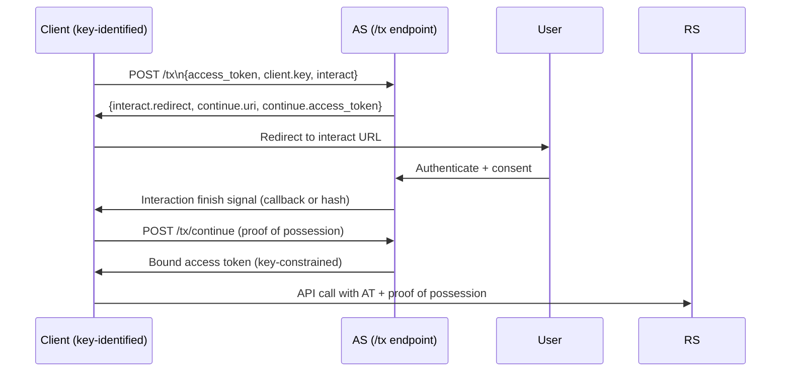

⚡ TL;DR - GNAP (RFC 9635, 2024) is the next-generation
authorization protocol designed to address fundamental
limitations of OAuth 2.0: (1) OAuth uses GET redirects
and form parameters - GNAP uses JSON POST to a single
Transaction Endpoint; (2) OAuth requires the client to
be an OIDC/OAuth client registered statically - GNAP
supports dynamic clients with rotating keys; (3) OAuth
access tokens are bearer-only by default - GNAP tokens
are sender-constrained by design (crypto key bound in
every request); (4) GNAP supports split-flow interactions
where the interaction happens on a different device than
the one making the API call (CIBA-like but more general).
GNAP is not backwards-compatible with OAuth 2.0. Current
adoption is early-stage (2024). OAuth 2.0/2.1 remains
the practical production choice for the near-term.

---

### 🔥 The Problem This Solves

**OAUTH 2.0 CARRIES 2012-ERA DESIGN CONSTRAINTS:**

OAuth 2.0 was designed in 2012 when form POST and redirect
flows were the dominant web architecture. Its design
reflects those constraints: GET-based redirects, query
parameters, form-encoded POST bodies, client_id/secret
as the primary client identity model. By 2020, these
constraints were limiting: mobile devices need different
interaction models, IoT devices can't do browser redirects,
service mesh needs automatic key rotation, and bearer
tokens remain a security compromise. GNAP is a redesign
that eliminates these constraints by centering the protocol
on JSON API calls, crypto-bound tokens by default, and
a flexible interaction model that decouples where the
access request happens from where the user interaction
happens.

---

### 📘 Textbook Definition

GNAP (Grant Negotiation and Authorization Protocol,
RFC 9635) is an HTTP/JSON-based protocol for delegated
authorization. It defines a single Transaction Endpoint
(`/tx`) at the Authorization Server that handles all
aspects of grant negotiation.

**Core GNAP concepts:**

**Single Transaction Endpoint (`/tx`)**
All GNAP interactions start with a JSON POST to `/tx`.
There is no separate `/authorize`, `/token`, `/introspect`.
The client describes its request (what access it wants,
what key it holds, how interaction should happen) in one
JSON document.

**Key-bound client identity**
Instead of client_id + client_secret, clients identify
themselves by a cryptographic key (public key JWK or
reference). The key is rotatable per grant. This supports
ephemeral clients (no static registration required) and
automatic key rotation.

**Sender-constrained tokens by default**
Every GNAP access token is bound to the client's key.
The client must present a proof of possession on every
API call. Bearer tokens (no binding) are possible but
not the default.

**Flexible interaction model**
GNAP decouples the access request (which device/app)
from the user interaction (which device/channel):
- Same device interaction (browser redirect - like OAuth)
- Different device interaction (scan a QR code on phone
  to authorize a TV app)
- No interaction (headless, like OAuth client credentials)
- User code (like Device Authorization Flow)
The AS instructs the client how to handle interaction,
rather than the client initiating a specific flow.

**Continuation request**
After user interaction, the client CONTINUES the same
transaction by re-calling `/tx` with the continuation token
(not a new auth code exchange). The transaction continues
where it left off.

---

### ⏱️ Understand It in 30 Seconds

**OAuth 2.0 vs GNAP side by side:**

```
OAUTH 2.0 FLOW:
  1. Client: GET /authorize?response_type=code&client_id=...
             &redirect_uri=...&scope=...&state=...&code_challenge=...
  2. User: authenticates, consents (browser redirect)
  3. AS: redirect to client with code in URL
  4. Client: POST /token (form-encoded body)
             code=...&client_id=...&client_secret=...
  5. AS: returns access token (JSON body)
  Issues: form-encoded, GET with params, multi-endpoint,
          redirect-centric, bearer token by default

GNAP FLOW:
  1. Client: POST /tx (JSON body)
     {
       "access_token": {"access": [{"type": "read_data"}]},
       "client": {"key": {"jwk": {...client pub key...}}},
       "interact": {"start": ["redirect"]}
     }
  2. AS: returns interaction instructions
     {
       "interact": {"redirect": "https://as.example/interact/abc"},
       "continue": {"uri": "/tx/abc123", "access_token": {...}}
     }
  3. User: interacts at the AS-provided URL
  4. Client: POST /tx/abc123 (continue the transaction)
     (presents proof of possession of its key)
  5. AS: returns bound access token

  Differences:
  - JSON everywhere (not form-encoded)
  - Single endpoint (/tx not /authorize + /token)
  - Token is key-bound (sender-constrained by default)
  - Client is identified by key, not client_id
```

---

### ⚙️ How It Works (Mechanism)

```
┌──────────────────────────────────────────────────────────┐
│  GNAP TRANSACTION FLOW                                    │
├──────────────────────────────────────────────────────────┤
│                                                           │
│  CLIENT              AS (/tx)         USER               │
│     │                  │               │                 │
│     │─ POST /tx ───────►│               │                 │
│     │  {access_token:  │               │                 │
│     │   access: [...],  │               │                 │
│     │   client: {key},  │               │                 │
│     │   interact: {...}}│               │                 │
│     │                  │               │                 │
│     │◄─ {interact_url, ─│               │                 │
│     │    continue: {    │               │                 │
│     │     uri: /tx/abc, │               │                 │
│     │     access_token  │               │                 │
│     │    }}             │               │                 │
│     │                  │               │                 │
│     │── redirect user ──────────────►  │                 │
│     │   to interact_url │               │                 │
│     │                  │◄─ auth+consent─│                 │
│     │                  │               │                 │
│     │◄─────────────────── finish signal │                 │
│     │  (callback or polling)           │                 │
│     │                  │               │                 │
│     │─ POST /tx/abc ───►│               │                 │
│     │  (continuation:  │               │                 │
│     │   proof of key   │               │                 │
│     │   possession)    │               │                 │
│     │◄─ bound AT ───────│               │                 │
│     │  {access_token:   │               │                 │
│     │   {value: ...,    │               │                 │
│     │    key: {bound}}} │               │                 │
└──────────────────────────────────────────────────────────┘
```



---

### 💻 Code Example

**Example 1 - GNAP initial grant request structure:**

```python
# GNAP initial grant request (RFC 9635)
# Compare to OAuth 2.0 GET /authorize redirect

import json, requests

# Client's ephemeral key pair (no static registration needed)
# In production: loaded from HSM or secret store
CLIENT_PUBLIC_KEY = {
    "kty": "EC",
    "crv": "P-256",
    "kid": "client-key-2024",
    "x": "base64url-encoded-x...",
    "y": "base64url-encoded-y...",
    # No 'd' (private key component - kept secret)
}

def create_gnap_grant_request(
    as_transaction_endpoint: str,
    resource_type: str,
    interaction_mode: str = "redirect",
    callback_uri: str | None = None,
) -> dict:
    """
    Initiate a GNAP grant request.
    POST to the AS /tx endpoint with JSON body.
    No form encoding. No redirect parameter in URL.
    Client identified by key, not client_id.
    """
    request_body = {
        # What access is being requested
        "access_token": {
            "access": [
                {"type": resource_type}
            ]
        },
        # Client identity: cryptographic key (not client_id+secret)
        "client": {
            "key": {
                "jwk": CLIENT_PUBLIC_KEY,
                "proof": "httpsig",  # How client proves key possession
            }
        },
        # How user interaction should happen
        "interact": {
            "start": [interaction_mode],  # "redirect", "user_code"
        },
    }

    if callback_uri:
        # Client provides callback for when interaction finishes
        request_body["interact"]["finish"] = {
            "method": "redirect",
            "uri": callback_uri,
            # Nonce for anti-CSRF in callback
            "nonce": "random-nonce-123",
        }

    # GNAP uses POST with JSON body (not GET with query params)
    resp = requests.post(
        as_transaction_endpoint,
        json=request_body,
        # Client also signs the request with its private key
        # (HTTP message signatures per RFC 9421)
        headers={
            "Content-Type": "application/json",
            "Signature": "<http-signature-using-client-key>",
            "Signature-Input": "<signature-input-header>",
        },
        timeout=10,
    )
    resp.raise_for_status()
    return resp.json()

# Response from AS:
# {
#   "interact": {
#     "redirect": "https://as.example.com/interact/xyz",
#     "finish": "hash-for-callback-validation"
#   },
#   "continue": {
#     "access_token": {"value": "continue-token-abc"},
#     "uri": "https://as.example.com/tx/xyz",
#     "wait": 5  # Seconds to wait before polling
#   }
# }

# CRITICAL DIFFERENCE FROM OAUTH:
# The AS tells the client WHERE to send the user and HOW to continue.
# In OAuth: client constructs the redirect URL itself.
# In GNAP: AS controls the interaction URL. More flexible.
```

---

### ⚖️ Comparison Table

| Property | OAuth 2.0 | GNAP (RFC 9635) |
|---|---|---|
| **Client identity** | client_id + secret/PKCE | Cryptographic key (JWK) |
| **Token binding** | Optional (bearer by default) | Required (key-bound by default) |
| **Protocol style** | Redirect + form POST | JSON POST to single /tx |
| **Interaction model** | Fixed flow types | AS-directed, flexible |
| **Registration** | Static required | Dynamic / ephemeral supported |
| **Production readiness** | Mature (2012) | Early adoption (2024) |

---

### ⚠️ Common Misconceptions

| Misconception | Reality |
|---|---|
| GNAP replaces OAuth 2.0 immediately | GNAP is a successor protocol, not an immediate replacement. As of 2024, GNAP is RFC 9635 but has very limited production deployment. The ecosystem (libraries, AS products, client frameworks) is nascent. OAuth 2.0/2.1 with security BCP remains the practical production choice for the foreseeable future. GNAP represents the direction of the field, not the current practice. |
| GNAP is just OAuth with a new name | GNAP is a fundamentally different protocol design. OAuth uses redirect-based flows with form-encoded parameters and static client registration. GNAP uses JSON POST to a single endpoint, cryptographic client identity, and AS-directed interaction models. They share the concept of delegated authorization, but the protocol mechanics are incompatible. You cannot use an OAuth client library to speak GNAP. |
| GNAP's key-bound tokens solve the bearer token problem forever | Key-bound tokens solve bearer token replay attacks. But if the client's private key is compromised (host compromise), the attacker can still generate valid proof-of-possession tokens. Key-bound tokens shift the attack from "steal the token" to "steal the private key" - a meaningfully harder target (especially if the key is in an HSM), but not invulnerable. Defense in depth (short token lifetimes, anomaly detection, key rotation) still applies. |

---

### 🚨 Failure Modes & Diagnosis

**GNAP Adoption Blocker: Library Maturity**

**Symptom:**
Engineering team wants to adopt GNAP for a new service.
Attempts to find production-ready GNAP client libraries
for Java and Python find only experimental implementations.
AS vendor support is limited to one or two niche products.

**Diagnosis:**
GNAP (RFC 9635 finalized October 2024) is in early
adoption. For new production services in 2024-2025:
- Use OAuth 2.1 with DPoP sender-constraining instead.
  DPoP provides key-bound tokens within the OAuth ecosystem.
- Monitor GNAP library development for your language.
- Plan for GNAP adoption in 2026+ as ecosystem matures.

**For organizations evaluating GNAP:**
The right question is not "GNAP vs OAuth" but "what
security properties do I need?" If the answer is
sender-constrained tokens: DPoP within OAuth 2.1 provides
this today. If the answer is ephemeral client identity
and AS-directed interaction: GNAP provides this when
the ecosystem matures.

---

### 🔗 Related Keywords

**Prerequisites:**
- `OAuth 2.0 RFC 6749 Design Rationale` - limitations GNAP addresses
- `OAuth 2.1 Consolidation` - current best practice baseline

**Builds On:**
- `Formal Security Analysis of OAuth 2.0`
- `Delegated Authorization as a Universal Pattern`

---

### 📌 Quick Reference Card

```
┌──────────────────────────────────────────────────────────┐
│ GNAP         │ RFC 9635 (finalized 2024)                 │
│ BASICS       │ POST /tx (JSON) for all interactions      │
│              │ Key-bound tokens by default               │
├──────────────┼───────────────────────────────────────────┤
│ VS OAUTH     │ JSON not forms; /tx not /authorize+/token │
│              │ Key identity, not client_id+secret        │
│              │ AS-directed interaction model             │
├──────────────┼───────────────────────────────────────────┤
│ TODAY (2024) │ Very limited adoption. Use OAuth 2.1+DPoP │
│              │ for sender-constraining today.            │
├──────────────┼───────────────────────────────────────────┤
│ FUTURE       │ GNAP is the protocol direction.           │
│              │ Ecosystem maturity ~2026+                 │
├──────────────┼───────────────────────────────────────────┤
│ ONE-LINER    │ "GNAP = OAuth's successor. JSON POST to   │
│              │  /tx. Keys not secrets. Not ready yet."   │
└──────────────────────────────────────────────────────────┘
```

**If you remember only 3 things:**

1. GNAP uses a single JSON `/tx` Transaction Endpoint instead
   of OAuth's multiple redirect + form-encoded endpoints.
   Clients identify themselves by cryptographic key (not
   client_id + secret). Tokens are key-bound by default.

2. GNAP's interaction model is AS-directed: the AS tells
   the client how to handle user interaction (which URL,
   which channel). This enables split-flow scenarios
   (authorize on phone, API call on TV) that OAuth handles
   awkwardly through separate extensions (CIBA, Device Flow).

3. As of 2024, GNAP is RFC 9635 but has very limited
   production library support. Use OAuth 2.1 + DPoP for
   sender-constraining today. Evaluate GNAP adoption
   as the ecosystem matures over 2025-2026.
