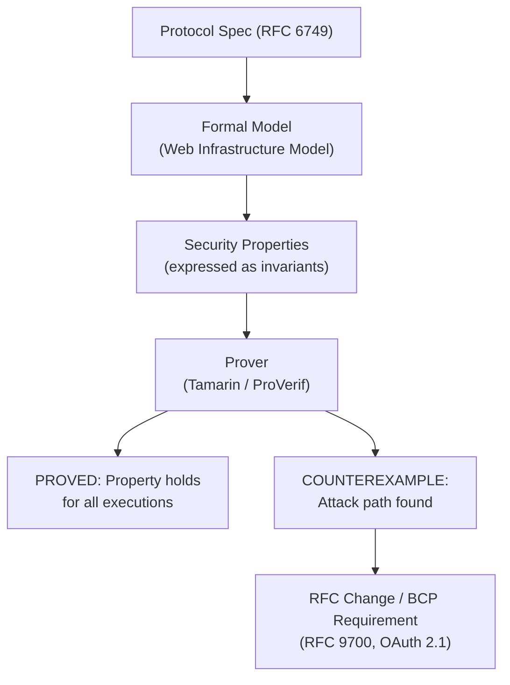

⚡ TL;DR - Formal security analysis of OAuth 2.0 uses
mathematical verification tools (Tamarin Prover,
ProVerif, applied pi-calculus) to prove security
properties hold for ALL possible protocol executions,
not just the ones developers tested. Key finding: the
OAuth 2.0 security issues that led to RFC 9700 (Security
BCP) and OAuth 2.1 were discovered or confirmed through
formal analysis - not just penetration testing. The
BCP paper by Lodderstedt et al. and the FAPI formal
analysis by Fett et al. drove concrete RFC changes:
PKCE became mandatory for all flows, exact redirect URI
matching became required, Mix-Up was identified as a
full attack class. Understanding formal analysis teaches
engineers WHY these requirements exist, not just what
they are.

---

### 🔥 The Problem This Solves

**TESTING CAN ONLY PROVE PRESENCE OF BUGS, NOT ABSENCE:**

Penetration testing and code review find vulnerabilities
that attackers thought of and testers thought of. Formal
analysis finds vulnerabilities that exist in all possible
execution paths - including execution orders that no
human tester considered. OAuth 2.0 is a complex protocol
with multiple parties (client, AS, RS, browser, user)
and multiple possible execution orderings. Formal analysis
models all orderings simultaneously and checks whether
security properties hold under any ordering. This is how
the Mix-Up attack was discovered: an attacker can interleave
responses from multiple AS instances in ways that no
normal test would exercise, but the formal model explores
all interleavings and detects the violation. RFC 9700
and OAuth 2.1 are the direct product of this work.

---

### 📘 Textbook Definition

Formal security analysis applies formal methods (symbolic
proofs, model checking, theorem proving) to verify security
properties of cryptographic protocols. For OAuth/OIDC,
the key work includes:

**Key formal analysis papers:**

1. **"OAuth 2.0 Security Best Current Practice"**
   Lodderstedt et al., regularly updated, became RFC 9700.
   Systematic threat model analysis of OAuth 2.0 flows.
   Identified attack classes and countermeasures that became
   normative requirements.

2. **"An Extensive Formal Security Analysis of the OpenID
   Financial-grade API" (Fett, Hosseyni, Kutner, 2019)**
   Used web infrastructure model (WIM) to formally analyze
   FAPI and OpenID Connect under a Dolev-Yao-style attacker.
   Found 2 new vulnerabilities in FAPI and 1 in standard
   OpenID Connect. Results drove FAPI 2.0 design.

3. **"SoK: Single Sign-On Security - An Evaluation of OpenID
   Connect" (Fett, Kusters, Schmitz)**
   Formal analysis of OIDC using Web Infrastructure Model.
   Found IdP Mix-Up and PKCE-bypass vulnerabilities.

**Formal analysis concepts:**

**Attacker model:**
Formal analysis defines precisely what the attacker CAN do:
- Web attacker: can control any HTTP server, read any HTTP
  response to a server they control, inject scripts into
  pages they control. Cannot read HTTPS traffic of other
  origins (same-origin policy holds).
- Network attacker: web attacker + can intercept and modify
  any network traffic (HTTPS breaks down - relevant for
  HTTP-only deployments or broken TLS).

**Security properties verified:**
- Token non-injectionability: an AT issued for resource A
  cannot be used for resource B.
- Authentication: the client and RS can verify the identity
  of the entity that authorized the token.
- Confidentiality: the attacker cannot learn the AT.
- PKCE integrity: the authorization code cannot be
  redeemed by anyone other than the client that requested it.

**What formal analysis found for OAuth:**
- Mix-Up attacks: possible when multiple AS instances are
  registered. Requires AS issuer binding in tokens (iss
  parameter). Now required by RFC 9700.
- PKCE bypass: possible for confidential clients not using
  PKCE. Led to PKCE being required for ALL clients in 2.1.
- Redirect URI manipulation: prefix-match allowed code
  hijacking. Led to exact-match being required.

---

### ⏱️ Understand It in 30 Seconds

**Formal analysis: the mental model:**

```
NORMAL TESTING APPROACH:
  - Define test cases (happy path + known edge cases)
  - Run them
  - Fix what breaks
  - Limitation: only covers execution sequences you thought of

FORMAL ANALYSIS APPROACH:
  - Model protocol as state machine (all possible states)
  - Define attacker capabilities (what they can do to messages)
  - Express security property as invariant (must ALWAYS hold)
  - Tool proves invariant holds for ALL reachable states
    OR finds a counterexample (an attack)

WHAT IT FOUND FOR OAUTH:
  Attack: Mix-Up (AS Mix-Up Attack)
    Precondition: client is registered with AS-A and AS-A-evil.
    Execution order no tester would manually try:
      1. Client starts auth at AS-A
      2. Attacker redirects client to AS-A-evil instead
      3. AS-A-evil redirects back with a code for AS-A-evil
      4. Client (confused) sends code to AS-A token endpoint
      5. AS-A tries to validate code - belongs to AS-A-evil
      6. Client receives AS-A token but code was AS-A-evil's
    Fix: include 'iss' parameter in authorization response.
         Client verifies 'iss' matches AS it sent to.
    RFC 9700 requirement: §4.4 AS issuer binding.

RESULT: every MUST in RFC 9700 maps to a formal
  analysis finding or a known exploitation.
```

---

### ⚙️ How It Works (Mechanism)

```
┌──────────────────────────────────────────────────────────┐
│  FORMAL ANALYSIS PIPELINE FOR OAUTH                       │
├──────────────────────────────────────────────────────────┤
│                                                           │
│  PROTOCOL SPEC (RFC 6749, OIDC Core)                      │
│       │                                                   │
│       ▼                                                   │
│  FORMAL MODEL (e.g., Web Infrastructure Model)           │
│  - Browser model (same-origin, cookies, postMessage)     │
│  - Network model (HTTPS, redirects)                      │
│  - Attacker model (web attacker capabilities)            │
│       │                                                   │
│       ▼                                                   │
│  SECURITY PROPERTIES (expressed in logic)                │
│  - "For all executions, AT is only revealed to           │
│     authorized client" (confidentiality)                 │
│  - "AT issued at AS-A cannot authenticate at AS-B"       │
│     (token binding)                                      │
│       │                                                   │
│       ▼                                                   │
│  PROVER (Tamarin, ProVerif, model checker)               │
│  - Exhaustively explores all protocol states             │
│  - Finds counterexample (attack path) if property fails  │
│       │                                                   │
│       ├─►  PROVED: property holds for all executions     │
│       └─►  COUNTEREXAMPLE: attack execution found        │
│                │                                          │
│                ▼                                          │
│            RFC CHANGE / BCP REQUIREMENT                   │
└──────────────────────────────────────────────────────────┘
```



---

### 💻 Code Example

**Example 1 - Mix-Up attack scenario and the fix:**

```python
# SCENARIO: Client registered with two Authorization Servers
# AS-LEGIT: https://legit.example.com
# AS-EVIL:  https://evil-as.example.com (attacker-controlled)
#
# The Mix-Up Attack (found through formal analysis):
# Client intends to authenticate with AS-LEGIT
# Attacker redirects client to AS-EVIL's /authorize instead
# AS-EVIL returns code and state for AS-EVIL to the callback
# Client (without iss check) exchanges code at AS-LEGIT/token
# Result: AS-LEGIT sees an unknown code and rejects OR
#         AS-EVIL's code is used at AS-LEGIT (cross-AS injection)

# BAD: No 'iss' parameter validation (pre-RFC 9700)
# Client stores the AS it sent to in state, but doesn't
# validate 'iss' in the authorization response.

def handle_oauth_callback_bad(request_params: dict) -> str:
    state = request_params.get("state")
    code = request_params.get("code")
    # NO: iss is ignored.
    # Attacker can redirect to AS-EVIL's authorize endpoint.
    # AS-EVIL returns code bound to AS-EVIL.
    # Client happily sends to AS-LEGIT/token -> Mix-Up.

    # Retrieve which AS we sent to from state
    session_data = get_session_by_state(state)
    token_endpoint = session_data["token_endpoint"]

    resp = requests.post(token_endpoint, data={
        "grant_type": "authorization_code",
        "code": code,
        # No verification that code came from the right AS
        "client_id": CLIENT_ID,
        "code_verifier": session_data["pkce_verifier"],
    })
    return resp.json()
```

```python
# GOOD: Validate 'iss' in authorization response (RFC 9700 §4.4)
# AS includes 'iss' in authorization response.
# Client checks 'iss' matches the AS it sent to.

def handle_oauth_callback_good(request_params: dict) -> str:
    state = request_params.get("state")
    code = request_params.get("code")
    iss = request_params.get("iss")  # RFC 9700: AS sends iss

    session_data = get_session_by_state(state)
    expected_issuer = session_data["as_issuer"]
    token_endpoint = session_data["token_endpoint"]

    # CRITICAL: Validate iss before using code
    # This is the fix for Mix-Up attack.
    # If iss doesn't match: attacker redirected the flow.
    if not iss:
        raise ValueError("Missing 'iss' in authorization response.")
    if iss != expected_issuer:
        raise ValueError(
            f"iss mismatch: expected {expected_issuer}, got {iss}. "
            "Possible Mix-Up attack - abort."
        )

    resp = requests.post(token_endpoint, data={
        "grant_type": "authorization_code",
        "code": code,
        "client_id": CLIENT_ID,
        "code_verifier": session_data["pkce_verifier"],
    })
    return resp.json()
    # WHY: Formal analysis proved that without iss binding,
    # there is a reachable attack state where codes are
    # exchanged at the wrong AS. Adding iss validation
    # makes the attack state unreachable.
```

---

### ⚖️ Comparison Table

| Method | Coverage | Attack Types Found | Effort |
|---|---|---|---|
| **Pen testing** | Tested scenarios only | Known attacks + variants | Medium |
| **Code review** | Implementation only | Logic errors, injection | High |
| **Formal analysis** | All execution paths | Novel protocol attacks | Very high |
| **Fuzzing** | Message format edge cases | Parsing/format bugs | Medium |

---

### ⚠️ Common Misconceptions

| Misconception | Reality |
|---|---|
| Formal analysis is only for academic research, not practical engineering | The IETF OAuth Security BCP (RFC 9700) and OAuth 2.1 are directly informed by formal analysis findings. Every normative requirement (MUST) in RFC 9700 traces to either a known exploitation or a formally analyzed attack. Engineers don't need to understand pi-calculus to benefit - they need to understand WHAT the formal analysis found and WHY the resulting requirements are non-negotiable. |
| If an implementation passes pen testing, it's secure | Pen testing finds attacks that humans think of. Formal analysis finds all attacks. The Mix-Up attack was not "obvious" - it requires a specific execution ordering across multiple AS instances that no normal test case would exercise. Formal analysis explored the state space and found it. The attack was real (demonstrated with working PoC), not theoretical. |
| Formal proofs guarantee absolute security | Formal proofs verify properties under a defined attacker model. If the attacker model is incomplete (e.g., doesn't model physical compromise of the AS host), the proof doesn't apply to that attack. HTTPS-level formal proofs don't cover side-channel attacks. The proof is only as strong as the model. The correct reading is: "within this threat model, this property holds for all executions." Not: "unhackable." |

---

### 🚨 Failure Modes & Diagnosis

**Multi-AS client missing Mix-Up protection**

**Symptom:**
Application supports SSO with multiple identity providers
(Google, Microsoft, Okta) via OAuth/OIDC. After deploying,
a security researcher submits a bug report describing
a Mix-Up variant: when the user navigates to a
specially crafted URL, their authorization code is sent
to the wrong provider's token endpoint.

**Diagnostic:**

```python
# Check: does your callback handler validate 'iss'?
def audit_callback_handler(callback_code: str) -> dict:
    """
    Audit checklist for Mix-Up protection:
    1. Does the authorization response include 'iss'?
    2. Does the client validate 'iss' against expected AS?
    3. Does state encode the expected AS issuer?
    """
    issues = []

    # 1: Does state map to a specific AS?
    # GOOD: state_map[state] = {"issuer": "https://accounts.google.com"}
    # BAD: state is random but not tied to specific AS

    # 2: Is 'iss' validated in callback?
    # grep your callback handler for 'iss' validation

    # 3: RFC 9700 §4.4 compliance:
    # AS MUST include 'iss' in authorization response (if supported)
    # Client MUST validate 'iss' matches the expected AS

    return {
        "rfc9700_s4_4_compliant": False,  # Update after audit
        "issues": issues,
    }
```

**Fix:**
1. Store the expected AS issuer in the state parameter.
2. On callback: validate that `iss` matches the expected AS.
3. If `iss` is missing or wrong: abort, log security event.
4. For OIDC: additionally validate `iss` in the ID token.

---

### 🔗 Related Keywords

**Prerequisites:**
- `OAuth 2.0 RFC 6749 Design Rationale`
- `OAuth 2.1 Consolidation`

**Builds On:**
- `Delegated Authorization as a Universal Pattern`
- `Specification-Driven Security Engineering`

---

### 📌 Quick Reference Card

```
┌──────────────────────────────────────────────────────────┐
│ FORMAL        │ Mathematical proof that security property │
│ ANALYSIS      │ holds for ALL protocol executions         │
├───────────────┼───────────────────────────────────────────┤
│ KEY PAPERS    │ Lodderstedt et al. -> RFC 9700 (Sec BCP)  │
│               │ Fett et al. -> FAPI 2.0 design            │
│               │ Fett, Kusters, Schmitz -> OIDC Mix-Up     │
├───────────────┼───────────────────────────────────────────┤
│ MIX-UP FIX    │ Validate 'iss' in authorization response  │
│               │ Must match the AS you sent the user to    │
├───────────────┼───────────────────────────────────────────┤
│ PKCE WHY      │ Formal proof: code interception possible   │
│               │ for ALL clients, not just public ones     │
├───────────────┼───────────────────────────────────────────┤
│ ONE-LINER     │ "RFC 9700 requirements are non-negotiable │
│               │  because formal analysis proved the       │
│               │  attacks exist for all executions."       │
└──────────────────────────────────────────────────────────┘
```

**If you remember only 3 things:**

1. Formal analysis proved the Mix-Up attack exists in any
   multi-AS OAuth deployment without issuer binding. The
   fix (RFC 9700 §4.4) is to validate the `iss` parameter
   in the authorization response against the AS you sent
   the user to. This is not a nice-to-have - it closes
   a provably exploitable attack path.

2. Formal analysis proved PKCE is necessary for ALL
   authorization code flows, not just mobile/public clients.
   Even server-side confidential clients are vulnerable
   to code interception without PKCE. This is why OAuth 2.1
   made PKCE mandatory for all flows.

3. The RFC 9700 (OAuth Security BCP) normative requirements
   are grounded in formal analysis and known exploitations
   - not arbitrary preferences. Every MUST in RFC 9700
   closes a specific, formally verified attack path. This
   is why compliance with RFC 9700 is non-negotiable
   for production OAuth implementations.
