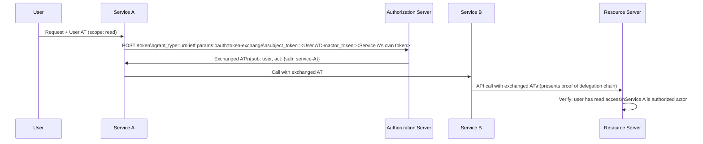

⚡ TL;DR - Delegated authorization is a universal pattern:
a principal P1 grants another principal P2 the ability
to act on P1's behalf, within a bounded scope, for a
bounded time, and subject to revocation by P1. OAuth 2.0
is one implementation of this pattern (user delegates
to client app). RFC 8693 Token Exchange extends delegation
to service-to-service chains (Service A delegates to
Service B, acting on user's behalf). GNAP generalizes
it further. The universal pattern has three invariants:
(1) the delegation never exceeds the delegator's own
authority (no privilege escalation); (2) the delegation
is bounded in time and scope; (3) the delegator retains
revocation rights. Systems that violate any invariant
create security vulnerabilities that are architecturally
fundamental, not implementation bugs.

---

### 🔥 The Problem This Solves

**AUTHORIZATION IS FUNDAMENTALLY ABOUT DELEGATION:**

Engineers often think of OAuth as "the OAuth protocol"
rather than as an implementation of a universal pattern.
This leads to two common mistakes: (1) reinventing
delegation in ad-hoc ways for scenarios OAuth doesn't
directly cover (service mesh, internal APIs, IoT), and
(2) implementing delegation incorrectly because the
engineer doesn't understand the invariants that make
delegation safe. Understanding delegation as a pattern
allows engineers to evaluate any authorization system
by asking: does this satisfy the three invariants?
Does it prevent privilege escalation? Is it time-bounded?
Is it revocable? And it provides a framework for
recognizing that OAuth, Token Exchange, SAML assertions,
Kerberos tickets, and IAM role assumption are all the
same pattern with different implementation mechanics.

---

### 📘 Textbook Definition

**Delegation (formal definition):**
A delegation is a triple (delegator P1, delegate P2, grant G)
where G is a set of permissions that P2 is authorized to
exercise in P1's name, subject to:
- Bound by P1's authority: G is a subset of P1's permissions
- Temporal bound: G has an expiry after which P2 cannot act
- Revocable: P1 can cancel G before expiry

**Delegation implementations by technology:**

| Technology | Delegator | Delegate | Grant |
|---|---|---|---|
| OAuth 2.0 AT | User | Client app | access_token (scope) |
| OAuth Token Exchange (RFC 8693) | Service A | Service B | exchanged token (act claim) |
| AWS IAM AssumeRole | Principal | AWS service | temporary credentials |
| Kerberos S4U2Proxy | Service A | Service B | forwarded TGT |
| SAML assertion delegation | IdP | Service | assertion with subject |
| GNAP | User | Client (key-bound) | bound token (access) |

**Delegation chain integrity (RFC 8693 `act` claim):**

When P1 delegates to P2, and P2 delegates to P3
(P3 is acting on P1's behalf via P2):
- P3's token must carry proof of the delegation chain
- RFC 8693: the `act` (actor) claim records who is
  acting on whose behalf:

```json
{
  "sub": "user-1234",
  "act": {
    "sub": "service-B",
    "act": {
      "sub": "service-A"
    }
  }
}
```

Reading: service-A is acting as service-B acting as user-1234.
The chain is auditable. The RS can verify the whole chain.

**Privilege escalation invariant (CRITICAL):**

The grant G CANNOT exceed P1's own authority.
OAuth: a user cannot grant an app more than the user
themselves can do. An app cannot manufacture a token
with admin scope if the user is not an admin.
Violation pattern: AS issues tokens based on client
request scope without checking user's actual permissions.

---

### ⏱️ Understand It in 30 Seconds

**The delegation pattern in one diagram:**

```
P1 (Delegator)                P2 (Delegate)
    │                             │
    │   GRANT G (bounded:         │
    │   scope + time + revoke)    │
    │ ─────────────────────────►  │
    │                             │
    │                             │    P2 acts on P1's behalf
    │                             │ ──────────────────────►  RS
    │                             │    presenting token G
    │                             │
    │   P1 can revoke G early     │
    │ ─────────────────────────►  │
    │   (token revocation,        │
    │    RT revocation)           │

THREE INVARIANTS (ALL must hold):
  1. G ⊆ P1's own authority     (no privilege escalation)
  2. G has expiry               (temporal bound)
  3. P1 can revoke G            (revocability)

VIOLATION PATTERNS:
  Invariant 1 violated: scope escalation
    Client requests scope user doesn't have.
    AS issues token with admin scope for non-admin user.
    Fix: AS validates requested scope against user's actual
         entitlements before issuing token.

  Invariant 2 violated: eternal tokens
    AT with no expiry (or 10-year expiry).
    Fix: short AT lifetime (15-60 min), RT rotation.

  Invariant 3 violated: no revocation path
    Stateless JWTs with no introspection.
    Revoked user can still call APIs until AT expires.
    Fix: short AT lifetime or RT introspection.
```

---

### ⚙️ How It Works (Mechanism)

```
┌──────────────────────────────────────────────────────────┐
│  DELEGATION CHAIN IN MICROSERVICES (TOKEN EXCHANGE)       │
├──────────────────────────────────────────────────────────┤
│                                                           │
│  USER ──(AT)──► SERVICE A                                 │
│                    │                                      │
│                    │  Token Exchange (RFC 8693)           │
│                    │  POST /token                         │
│                    │  grant_type=token-exchange            │
│                    │  subject_token=<user AT>             │
│                    │  requested_token_type=access_token   │
│                    │  actor_token=<service-A's own token> │
│                    │                                      │
│                    ├──────────────────► AS                │
│                    │                    │                 │
│                    │◄── exchanged AT ───┘                 │
│                    │    {sub: user,                       │
│                    │     act: {sub: service-A}}            │
│                    │                                      │
│                    ▼                                      │
│              SERVICE B                                    │
│                    │                                      │
│                    │  Presents exchanged AT               │
│                    │  RS sees: acting as user             │
│                    │  via service-A (auditable)           │
│                    ▼                                      │
│              RESOURCE SERVER                              │
│                    │  Verifies: sub=user has access       │
│                    │           act chain is valid         │
└──────────────────────────────────────────────────────────┘
```



---

### 💻 Code Example

**Example 1 - Token Exchange for service-to-service delegation:**

```python
# RFC 8693 Token Exchange: Service A calling Service B
# on behalf of User
# BAD: Service A uses ITS OWN token to call Service B,
# losing the user context entirely.

def call_service_b_bad(service_b_url: str, resource_id: str) -> dict:
    # Service A authenticates to Service B using its own
    # client credentials token.
    # Service B has NO IDEA this is happening on behalf of
    # a user. No delegation chain. No audit trail.
    service_a_token = get_client_credentials_token("service-a")
    resp = requests.get(
        f"{service_b_url}/resource/{resource_id}",
        headers={"Authorization": f"Bearer {service_a_token}"},
    )
    return resp.json()
```

```python
# GOOD: Token Exchange - Service A exchanges User's AT
# for a delegated AT (service acts on user's behalf)

def exchange_token_for_delegation(
    as_token_endpoint: str,
    user_at: str,           # User's access token (subject)
    service_a_token: str,   # Service A's own token (actor)
    target_service: str,    # Resource indicator for Service B
) -> str:
    """
    RFC 8693 Token Exchange.
    Returns an AT with both user context (sub) and
    service delegation context (act).
    Service B can verify the full delegation chain.
    """
    resp = requests.post(
        as_token_endpoint,
        data={
            "grant_type":
                "urn:ietf:params:oauth:grant-type:token-exchange",
            "subject_token": user_at,
            "subject_token_type":
                "urn:ietf:params:oauth:token-type:access_token",
            "actor_token": service_a_token,
            "actor_token_type":
                "urn:ietf:params:oauth:token-type:access_token",
            "requested_token_type":
                "urn:ietf:params:oauth:token-type:access_token",
            "resource": target_service,
        },
        auth=(SERVICE_A_CLIENT_ID, SERVICE_A_CLIENT_SECRET),
    )
    resp.raise_for_status()
    return resp.json()["access_token"]
    # Resulting token payload:
    # {
    #   "sub": "user-1234",         <- user is the subject
    #   "act": {"sub": "service-a"},  <- service-a is acting
    #   "scope": "read:data",
    #   "exp": ...,
    # }

# Service B validates:
def validate_delegated_token(token_payload: dict) -> bool:
    # 1. sub (user) has the required permission
    # 2. act.sub (service-a) is an authorized service
    # 3. Delegation scope does not exceed user's authority
    user_id = token_payload["sub"]
    actor_service = token_payload.get("act", {}).get("sub")

    if not actor_service:
        # No delegation chain - must be direct user call
        # (acceptable if user is allowed to call directly)
        pass

    # Verify delegation invariant: scope <= user's own authority
    token_scope = token_payload.get("scope", "").split()
    user_permissions = get_user_permissions(user_id)

    for scope_item in token_scope:
        if scope_item not in user_permissions:
            raise AuthorizationError(
                f"Delegation scope exceeds user authority: {scope_item}"
            )

    return True
```

---

### ⚖️ Comparison Table

| Pattern | Principal (P1) | Delegate (P2) | Grant Mechanism |
|---|---|---|---|
| **OAuth AT** | User | Client app | access_token |
| **RFC 8693** | User via Service A | Service B | exchanged token + act |
| **AWS AssumeRole** | IAM principal | AWS service | temp credentials |
| **Kerberos S4U2Proxy** | Service A | Service B | forwarded TGT |
| **GNAP** | User | Key-bound client | bound token |

---

### ⚠️ Common Misconceptions

| Misconception | Reality |
|---|---|
| Service-to-service calls don't need user context if the services trust each other | Internal trust creates audit blind spots and violates least-privilege. If Service A calls Service B on behalf of a user, Service B should know (1) which user, (2) what Service A is authorized to do on their behalf, and (3) what scope applies. Without this, a compromised Service A can call Service B with no user context and no scope restrictions. RFC 8693 Token Exchange provides exactly this - preserving user context and delegation chain across service boundaries. |
| "User delegates to client" is the only form of delegation relevant to OAuth engineers | Token Exchange (RFC 8693) is the delegation pattern for microservices. It allows Service A to call Service B on behalf of User while preserving the user's identity and scope limits in the token. Without Token Exchange, services either (1) use a service-account token (losing user context entirely) or (2) pass the user's AT directly (violating least-privilege and token audience constraints). RFC 8693 is already production-deployed in Keycloak, Okta, and Azure AD. |
| Privilege escalation through delegation is prevented by AS validation alone | The AS can only prevent delegation that exceeds the user's AS-known permissions. If the AS has stale permission data (user was downgraded from admin yesterday but cache hasn't expired), the AS may issue a token that exceeds current authority. Defense in depth: (1) short-lived caches for user permissions at AS, (2) RS re-validates critical permissions in real time, (3) token scope granularity matches the operation granularity. |

---

### 🚨 Failure Modes & Diagnosis

**Delegation chain broken: service using wrong token type**

**Symptom:**
Audit log review shows Service B is being called with
Service A's client credentials token (not a user-context
token). Operations that should be logged as "user X via
Service A" are appearing as "Service A" with no user
attribution. Compliance audit fails.

**Diagnosis:**

```python
# Audit: check what token type services are presenting

def audit_service_token_usage(
    service_name: str,
    as_introspection_endpoint: str,
    sample_tokens: list[str],
) -> dict:
    """
    Introspect sample tokens to identify delegation pattern.
    Check whether user context is preserved.
    """
    findings = []
    for token in sample_tokens:
        resp = requests.post(
            as_introspection_endpoint,
            data={"token": token},
            auth=(INTROSPECT_CLIENT_ID, INTROSPECT_SECRET),
        )
        data = resp.json()

        has_user_context = bool(data.get("sub"))
        has_delegation_chain = bool(data.get("act"))

        if not has_user_context:
            findings.append({
                "issue": "service_credentials_only",
                "detail": f"{service_name} is calling without user context",
                "fix": "Implement RFC 8693 Token Exchange",
            })
        elif not has_delegation_chain and data.get("sub"):
            # Direct user token forwarding (also wrong)
            findings.append({
                "issue": "direct_token_forwarding",
                "detail": "User token forwarded without act chain",
                "fix": "Use Token Exchange, don't forward user's AT directly",
            })

    return {"service": service_name, "findings": findings}
```

---

### 🔗 Related Keywords

**Prerequisites:**
- `OAuth 2.0 RFC 6749 Design Rationale`
- `Token Exchange (RFC 8693)`

**Builds On:**
- `GNAP (Grant Negotiation and Authorization Protocol)`
- `Trust Boundary Thinking in Authorization Design`

---

### 📌 Quick Reference Card

```
┌──────────────────────────────────────────────────────────┐
│ DELEGATION    │ P1 grants P2 to act on P1's behalf        │
│ INVARIANTS    │ 1. Scope <= P1's authority (no escalation)│
│               │ 2. Temporal bound (expiry)                │
│               │ 3. Revocable by P1                        │
├───────────────┼───────────────────────────────────────────┤
│ OAUTH 2.0     │ User delegates to client app via AT       │
│ RFC 8693      │ Service A delegates to Service B via      │
│               │ Token Exchange + act claim                │
├───────────────┼───────────────────────────────────────────┤
│ TOKEN EXCH    │ grant_type=urn:ietf:params:oauth:...      │
│               │ :token-exchange                           │
│               │ subject_token=<user AT>                   │
│               │ actor_token=<service own token>           │
├───────────────┼───────────────────────────────────────────┤
│ act CLAIM     │ {sub: user, act: {sub: service-a}}        │
│               │ = service-a acting as user                │
├───────────────┼───────────────────────────────────────────┤
│ ONE-LINER     │ "Delegation = bounded authority transfer. │
│               │  scope <= delegator's own authority.      │
│               │  RFC 8693 = delegation for microservices."│
└──────────────────────────────────────────────────────────┘
```

**If you remember only 3 things:**

1. Delegation has three universal invariants: scope cannot
   exceed the delegator's authority (no privilege escalation),
   the delegation must be time-bounded, and the delegator
   must be able to revoke it. Systems that violate any
   invariant have structural security vulnerabilities -
   not implementation bugs.

2. RFC 8693 Token Exchange is how microservices maintain
   delegation chains. Service A calls the AS's token endpoint
   with the user's AT (subject) and its own AT (actor),
   receiving an exchanged token with the `act` claim recording
   the delegation chain (sub: user, act: {sub: service-A}).
   Service B can audit who acted on whose behalf.

3. Passing the user's access token directly from Service A
   to Service B is wrong: it violates audience binding (the
   token was issued for Service A, not Service B), loses
   the delegation chain, and may grant Service B more access
   than intended. Always use Token Exchange to create
   a properly scoped, properly attributed delegated token.
