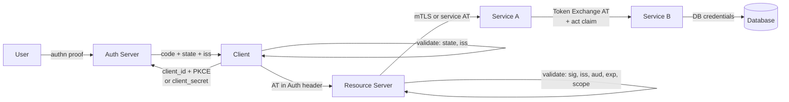

⚡ TL;DR - A trust boundary is any point in a system
where one component must verify claims made by another
rather than accepting them implicitly. Trust boundary
thinking is the practice of identifying ALL trust
boundaries in an authorization architecture and mapping
the verification mechanism required at each. In OAuth:
(1) Client-to-AS boundary: client authenticates with
credentials/PKCE; (2) AS-to-RS boundary: RS validates
the token signature, issuer, audience, and expiry;
(3) User-to-AS boundary: AS authenticates the user;
(4) AS-to-Client boundary: client validates the
authorization response (state, iss) before using any
data from it. Missing verification at any trust boundary
creates an exploitable vulnerability. Zero Trust
Architecture (ZTA) extends this: every service-to-service
boundary is a trust boundary, even within "internal" networks.

---

### 🔥 The Problem This Solves

**"INTERNAL NETWORK = TRUSTED" IS THE MOST DANGEROUS ASSUMPTION:**

The most common authorization design mistake is treating
network location as a trust proxy: "if the request came
from inside our VPC, we trust it." This assumption is
wrong in two ways. First, it means that when any internal
service is compromised, the attacker can make arbitrary
calls to all other internal services without authentication.
Second, it means that SSRF vulnerabilities (server-side
request forgery) in any service become a path to access
all internal APIs. Trust boundary thinking provides the
methodology to replace network-location trust with
explicit verification at every boundary: every service,
regardless of where it runs, must present a verifiable
credential (JWT, mTLS certificate) to every other service
it calls. The credential must be validated before the
request is processed.

---

### 📘 Textbook Definition

A **trust boundary** is a point in a system where the
receiving component cannot assume that the data or
claims presented by the sending component are correct
without verification.

**Trust boundary types in OAuth/OIDC systems:**

**1. Client-to-AS Trust Boundary**
Client sends authorization requests and token requests to AS.
- What client must prove: its identity (client_secret,
  client assertion JWT, or PKCE for public clients)
- What AS must verify: client is registered, redirect_uri
  matches exactly, scope is permitted for this client
- Violation pattern: AS doesn't authenticate client at
  token endpoint. Any caller can exchange codes.

**2. AS-to-RS Trust Boundary**
RS receives access tokens presented by clients.
- What client must prove: possession of a valid AT
- What RS must verify: token signature (AS's key),
  iss (expected AS), aud (this RS's identifier), exp
  (not expired), scope (required scope present)
- Violation pattern: RS trusts token without verifying
  aud. Tokens for one RS are accepted by another.
  (Cross-service token injection attack).

**3. User-to-AS Trust Boundary**
AS receives authentication assertions from user.
- What user must prove: identity (password, MFA, SSO)
- What AS must verify: all authentication factors
- Violation pattern: phishing attack bypasses AS
  authentication (not an OAuth issue, but a trust
  boundary issue upstream of OAuth).

**4. AS-to-Client Trust Boundary (often missed)**
Client receives authorization responses (redirect with
code, iss, state) from what appears to be the AS.
- What the callback must prove: it came from the expected AS
- What client must verify: state (anti-CSRF), iss parameter
  (anti-Mix-Up), nonce in ID token (anti-replay)
- Violation pattern: Client doesn't validate iss.
  Attacker redirected the user to a different AS.
  Mix-Up attack succeeds.

**5. Service-to-Service Trust Boundary (Zero Trust)**
Internal services calling other internal services.
- What calling service must prove: its identity + user context
  (via AT or client credentials + Token Exchange)
- What receiving service must verify: AT signature, audience,
  scope, and (if user context) delegation chain (act claim)
- Violation pattern: internal services accept calls without
  JWT validation because "it's internal."

---

### ⏱️ Understand It in 30 Seconds

**Trust boundary identification methodology:**

```
STEP 1: DRAW THE SYSTEM COMPONENTS
  User, Client App, Authorization Server,
  Resource Server 1, Resource Server 2,
  Internal Service A, Internal Service B, Database

STEP 2: DRAW EVERY COMMUNICATION PATH
  User -> Client: browser
  Client -> AS: OAuth authorize + token
  Client -> RS-1: API call with AT
  RS-1 -> Service A: internal call
  Service A -> Service B: internal call
  Service B -> Database: query

STEP 3: LABEL EACH PATH: "trust boundary?" Y/N
  User -> Client: Y (client cannot trust browser input)
  Client -> AS: Y (AS authenticates client)
  AS -> Client: Y (client validates response)    <- OFTEN MISSED
  Client -> RS-1: Y (RS validates AT)
  RS-1 -> Service A: Y (ZTA: Service A validates RS-1's identity)
  Service A -> Service B: Y (ZTA: Service B validates Service A)
  Service B -> Database: Y (DB validates Service B's credentials)

STEP 4: FOR EACH BOUNDARY, MAP THE MECHANISM:
  Client -> AS: client_secret / PKCE
  AS -> Client: state validation, iss validation
  Client -> RS-1: AT (JWT) with signature + aud + exp
  RS-1 -> Service A: mTLS certificate or service AT
  Service A -> Service B: Token Exchange (RFC 8693) AT
  Service B -> Database: DB user credentials (per service)

STEP 5: FOR EACH MECHANISM, VERIFY THE VALIDATION CODE EXISTS:
  Code review: does the AT validation actually check aud?
  Does the callback handler actually check iss?
  Does Service A's call to Service B actually include a token?
```

---

### ⚙️ How It Works (Mechanism)

```
┌──────────────────────────────────────────────────────────┐
│  OAUTH TRUST BOUNDARY MAP                                 │
├──────────────────────────────────────────────────────────┤
│                                                           │
│  USER ──[authn: user proves identity]──► AS              │
│                           │                              │
│             [AS validates: client_id, redirect_uri,       │
│              client credentials / PKCE]                   │
│                           ▲                              │
│  CLIENT ──[auth request]──┘                              │
│       │                                                  │
│       │  [callback: CLIENT validates state + iss]        │
│       │         <- TRUST BOUNDARY (AS→Client)            │
│       │                                                  │
│       │──[AT in Authorization header]──► RS              │
│                           │                              │
│           [RS validates: signature, iss, aud, exp, scope] │
│                           │                              │
│           [RS→ServiceA: service presents mTLS/AT]        │
│                           │                              │
│           [ServiceA→ServiceB: Token Exchange AT + act]   │
│                           │                              │
│           [ServiceB→DB: DB credentials per service]      │
│                                                          │
│  Each arrow is a trust boundary.                         │
│  Each boundary has a verification mechanism.             │
│  Missing verification = exploitable vulnerability.       │
└──────────────────────────────────────────────────────────┘
```



---

### 💻 Code Example

**Example 1 - Resource Server token validation checklist:**

```python
# Every trust boundary at the RS must be verified.
# COMMON MISTAKE: only checking signature and exp.
# Omitting 'aud' check allows token injection attacks.

from typing import Any
import jwt   # PyJWT

def validate_access_token_at_rs(
    token: str,
    expected_issuer: str,       # e.g. "https://as.example.com"
    expected_audience: str,     # This RS's identifier
    required_scopes: list[str],
    as_jwks_uri: str,
) -> dict[str, Any]:
    """
    Full trust boundary validation at Resource Server.
    All checks are mandatory. Skipping any creates
    a specific, exploitable vulnerability.
    """
    # 1. Fetch JWKS (cache in production with TTL)
    from functools import lru_cache
    import requests

    @lru_cache(maxsize=1)
    def get_as_public_keys():
        return jwt.PyJWKClient(as_jwks_uri)

    jwks_client = get_as_public_keys()

    # 2. Verify signature (proves AT came from AS)
    # Catches: forged tokens, tampered tokens
    signing_key = jwks_client.get_signing_key_from_jwt(token)

    payload = jwt.decode(
        token,
        key=signing_key,
        algorithms=["RS256", "ES256"],

        # 3. Verify iss (proves AT is from THIS AS, not another)
        # Catches: tokens from compromised AS, cross-tenant attacks
        issuer=expected_issuer,

        # 4. Verify aud (proves AT was issued FOR THIS RS)
        # Catches: token injection - AT intended for RS-A
        #          used at RS-B. WITHOUT aud check: attacker
        #          obtains a low-privilege AT for RS-A and
        #          replays it at RS-B. RS-B would accept it.
        audience=expected_audience,

        # 5. Verify exp (standard, but worth noting)
        # PyJWT verifies exp automatically when included above
        options={"require": ["sub", "iat", "exp", "aud", "iss"]},
    )

    # 6. Verify scope (proves AT grants the required permission)
    # Catches: AT has insufficient scope for this operation
    token_scopes = payload.get("scope", "").split()
    missing_scopes = [
        s for s in required_scopes if s not in token_scopes
    ]
    if missing_scopes:
        raise PermissionError(
            f"Token missing required scopes: {missing_scopes}"
        )

    # 7. (Optional) Check jti for replay if short-lived is not enough
    # Check token has not been revoked (introspection or blocklist)
    # Only needed if AT lifetime > acceptable window

    return payload
```

---

### ⚖️ Comparison Table

| Trust Boundary | Mechanism | Common Omission | Attack If Omitted |
|---|---|---|---|
| **Client -> AS** | PKCE / client_secret | Unauthenticated token endpoint | Code injection |
| **AS -> Client** | state + iss validation | iss check missing | Mix-Up attack |
| **Client -> RS** | AT in Authorization header | Bearer in URL | AT in server logs |
| **RS validates AT** | sig + iss + aud + exp + scope | aud check missing | Token injection across RSes |
| **Service -> Service** | mTLS or service AT | No auth (internal trust) | SSRF lateral movement |

---

### ⚠️ Common Misconceptions

| Misconception | Reality |
|---|---|
| The internal network is a trust boundary - services behind the VPC are trusted | Internal network location is NOT a trust guarantee. Once any internal service is compromised, it can call all other internal services that accept network-location trust. The correct model (Zero Trust Architecture, NIST SP 800-207) treats every service boundary as a trust boundary requiring explicit credential verification. In OAuth terms: every service must validate an AT or mTLS certificate, even for internal calls. |
| If the AS validates the client and the user, the RS doesn't need to validate the token thoroughly | The AS's validation and the RS's validation are independent trust boundaries with different purposes. The AS validates that the client and user are legitimate and issues a token. The RS validates that the TOKEN it is receiving is (1) from the expected AS (iss), (2) intended for this RS (aud), (3) not expired (exp), and (4) has the required scope. A valid AT from the AS is not sufficient at the RS without these checks - especially the aud check, which prevents cross-service token injection. |
| JWT validation is just signature verification | Signature verification proves the token was issued by the holder of the AS's private key. It does NOT prove the token was intended for you (aud), is not expired (exp), has the right scope, or came from the right AS (iss). All five checks (sig, iss, aud, exp, scope) are required for a complete trust boundary verification at the RS. Libraries that "validate JWTs" often perform only the signature check by default. Always explicitly configure iss, aud, and exp validation. |

---

### 🚨 Failure Modes & Diagnosis

**Missing audience validation enables cross-service token injection**

**Symptom:**
Security audit finds that Service B accepts access tokens
that were issued for Service A. A user with only read
access to Service A can call Service B (which has no
RS-side authorization for that user) using their
Service A token.

**Diagnostic:**

```python
def audit_jwt_validation_code(source_code_path: str) -> list[dict]:
    """
    Static audit: check if JWT validation includes aud check.
    Common libraries where aud is NOT checked by default:
    - python-jose: aud must be passed explicitly
    - PyJWT: aud must be passed explicitly
    - java-jwt: aud must be added to verifier chain
    - nimbus-jose-jwt: aud must be checked manually or via JWTClaimsVerifier
    """
    import re, os
    issues = []

    jwt_decode_pattern = re.compile(
        r'jwt\.decode|verifyToken|parseJwt|JWTVerifier'
    )
    aud_pattern = re.compile(r'audience|aud')

    for root, _dirs, files in os.walk(source_code_path):
        for fname in files:
            if not fname.endswith(('.py', '.java', '.ts')):
                continue
            fpath = os.path.join(root, fname)
            with open(fpath) as f:
                content = f.read()
            if jwt_decode_pattern.search(content):
                if not aud_pattern.search(content):
                    issues.append({
                        "file": fpath,
                        "issue": "JWT decode without aud validation",
                        "risk": "Cross-service token injection",
                        "fix": "Pass expected_audience to jwt.decode()",
                    })

    return issues
```

---

### 🔗 Related Keywords

**Prerequisites:**
- `Audience Binding and Token Injection Prevention`
- `Resource Indicators (RFC 8707)`
- `Delegated Authorization as a Universal Pattern`

**Builds On:**
- `Specification-Driven Security Engineering`

---

### 📌 Quick Reference Card

```
┌──────────────────────────────────────────────────────────┐
│ TRUST         │ Point where verification must occur      │
│ BOUNDARY      │ (cannot implicitly trust the sender)     │
├───────────────┼───────────────────────────────────────────┤
│ OAUTH BOUNDARIES (ALL must have verification)            │
│  Client->AS   │ Client auth: client_secret / PKCE        │
│  AS->Client   │ state + iss validation in callback       │
│  Client->RS   │ AT in Authorization header (not URL)     │
│  RS validates │ sig + iss + aud + exp + scope (all 5)    │
│  Svc->Svc     │ mTLS cert or service AT + act chain      │
├───────────────┼───────────────────────────────────────────┤
│ ZTA RULE      │ Internal network is NOT a trust boundary  │
│               │ elimination. Every svc-to-svc call needs │
│               │ explicit credential verification.        │
├───────────────┼───────────────────────────────────────────┤
│ ONE-LINER     │ "Map every arrow. Label each with: what  │
│               │  proof? What validation? Missing one =   │
│               │  exploitable vulnerability."             │
└──────────────────────────────────────────────────────────┘
```

**If you remember only 3 things:**

1. A trust boundary is any communication path where the
   receiving component must verify claims rather than
   assume them. In OAuth there are five: Client-AS,
   AS-Client (callback), Client-RS (AT presentation),
   RS token validation, and Service-to-Service. Missing
   verification at any one boundary creates a specific,
   exploitable vulnerability.

2. The RS token validation must check ALL five properties:
   signature (proves AS issued it), iss (proves it's from
   the right AS), aud (proves it was intended for this RS),
   exp (proves it's not expired), scope (proves it has
   the required permission). Libraries often only check
   signature by default. Always explicitly configure
   aud and iss validation.

3. Zero Trust Architecture (NIST SP 800-207) requires
   every service-to-service communication to be verified
   with an explicit credential (mTLS or JWT), regardless
   of whether the services are on the same internal network.
   "Internal = trusted" is the assumption that makes a
   single compromised service a gateway to all services.
