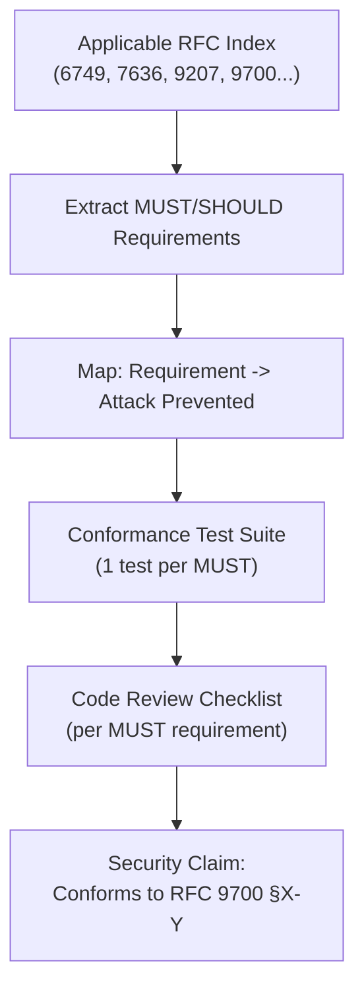

⚡ TL;DR - Specification-driven security engineering is
the practice of using published protocol specifications
(RFCs, IETF drafts) as the primary security design tool:
(1) extract normative requirements (MUST, SHOULD, MUST NOT)
from specs; (2) map each requirement to an attack that
the requirement prevents (WHY does this MUST exist?);
(3) write conformance tests directly from normative
requirements; (4) treat a "SHOULD" as a "MUST" unless
you have a documented technical reason not to - for OAuth
especially. The anti-pattern is "we implement OAuth"
without specifying WHICH RFCs and WHICH normative
requirements. RFC 9700 (OAuth Security BCP) provides a
complete map: attack -> countermeasure -> normative
requirement. Engineering teams that skip this end up
reinventing the same vulnerabilities that the IETF
Working Group already discovered and formally analyzed.

---

### 🔥 The Problem This Solves

**"WE FOLLOW OAUTH" IS NOT A SECURITY CLAIM:**

OAuth 2.0 (RFC 6749) is a framework, not a security
guarantee. RFC 6749 alone defines the protocol mechanics
but leaves many security-critical decisions unspecified
("implementation-defined"). Between 2012 and 2024, the
IETF OAuth Working Group published RFC 7523, RFC 7636,
RFC 8693, RFC 8705, RFC 8707, RFC 9207, RFC 9449, and
RFC 9700 - each closing specific attack paths. An
implementation that claims "RFC 6749 compliance" without
implementing these supplementary RFCs has a known set
of vulnerabilities that are publicly documented and
actively exploited. Specification-driven security
engineering means: enumerate the RFCs you implement,
map each normative requirement to its security rationale,
and test conformance to normative requirements - not just
"does the happy path work?"

---

### 📘 Textbook Definition

**Specification-driven security engineering (SdSE):**
A methodology for building secure systems by treating
protocol specifications as primary security requirements
rather than as implementation guides.

**RFC normative language (RFC 2119):**

| Keyword | Meaning | Security implication |
|---|---|---|
| MUST | Absolute requirement | Non-compliance = known vulnerability |
| MUST NOT | Absolute prohibition | Violation = known vulnerability |
| SHOULD | Recommended | Non-compliance requires documented justification; for security specs, treat as MUST unless you have strong technical reason |
| SHOULD NOT | Not recommended | Same as SHOULD |
| MAY | Optional | Allowed but not required |

**RFC 9700 structure (OAuth Security BCP) - the canonical example:**
RFC 9700 is structured as: attack class -> description ->
countermeasure. Each section:
1. Describes an attack
2. Explains how it works
3. States a normative requirement (MUST/SHOULD) to prevent it

This structure makes RFC 9700 directly mappable to:
- Security requirements (extract the MUST statements)
- Test cases (test each MUST directly)
- Code review checklist (verify each MUST is implemented)

**Key OAuth RFC index for SdSE:**

| RFC | Title | Security Relevance |
|---|---|---|
| RFC 6749 | OAuth 2.0 Framework | Core flow mechanics |
| RFC 6750 | Bearer Token Usage | AT transport security |
| RFC 7009 | Token Revocation | Revocation endpoint |
| RFC 7519 | JWT | AT format + claims |
| RFC 7636 | PKCE | Code interception prevention |
| RFC 8693 | Token Exchange | Service delegation chains |
| RFC 8705 | mTLS sender-constraining | Stolen token prevention |
| RFC 8707 | Resource Indicators | Audience binding |
| RFC 9207 | AS Issuer Identification | Mix-Up attack prevention |
| RFC 9449 | DPoP | Key-bound tokens |
| RFC 9700 | Security BCP | Attack -> countermeasure map |

---

### ⏱️ Understand It in 30 Seconds

**The SdSE methodology applied to OAuth:**

```
STEP 1: ENUMERATE APPLICABLE RFCS
  "We implement: RFC 6749 + RFC 7636 + RFC 8707 +
   RFC 9207 + RFC 9700 (sections 2-4). DPoP (RFC 9449)
   in scope for Q3."

STEP 2: EXTRACT ALL MUST REQUIREMENTS FROM EACH RFC
  RFC 9207 §2: "Authorization servers MUST include the
  'iss' response parameter in the authorization response."
  => Requirement: AS must add iss to auth response.

  RFC 9700 §4.4: "Clients MUST validate the 'iss'
  authorization response parameter to prevent Mix-Up attacks."
  => Requirement: Client callback must validate iss.

STEP 3: MAP EACH MUST TO ITS SECURITY RATIONALE
  RFC 9207 iss requirement -> prevents Mix-Up attack
  RFC 7636 PKCE requirement -> prevents code interception
  RFC 6750 §2.3 prohibition -> prevents AT in server logs
  RFC 8707 resource parameter -> prevents cross-RS token injection

STEP 4: WRITE CONFORMANCE TESTS FROM MUST REQUIREMENTS
  test: "callback without iss is rejected"
  test: "callback with iss != expected AS is rejected"
  test: "AT in URL query param is rejected by RS"
  test: "token without aud matching this RS is rejected"
  test: "expired token (exp in past) is rejected"

STEP 5: SECURITY REVIEW = MUST COVERAGE CHECK
  For each MUST: is there a test? Is the test passing?
  For each SHOULD: is there a documented reason if not implemented?
```

---

### ⚙️ How It Works (Mechanism)

```
┌──────────────────────────────────────────────────────────┐
│  SPECIFICATION-DRIVEN SECURITY ENGINEERING PIPELINE       │
├──────────────────────────────────────────────────────────┤
│                                                           │
│  RFC INDEX (enumerate applicable RFCs)                    │
│       │                                                   │
│       ▼                                                   │
│  REQUIREMENTS EXTRACTION                                  │
│  - MUST requirements -> mandatory implementation          │
│  - MUST NOT requirements -> mandatory prohibitions        │
│  - SHOULD requirements -> default mandatory               │
│    (document exceptions with security justification)      │
│       │                                                   │
│       ▼                                                   │
│  RATIONALE MAPPING                                        │
│  Requirement -> Attack it prevents -> Severity           │
│  (RFC 9700 provides this mapping for OAuth)              │
│       │                                                   │
│       ▼                                                   │
│  CONFORMANCE TEST SUITE                                    │
│  One test per MUST requirement (not per feature)         │
│  Tests verify the requirement is enforced,               │
│  not just that happy path works                          │
│       │                                                   │
│       ▼                                                   │
│  CODE REVIEW CHECKLIST                                    │
│  - Does AS include 'iss' in auth response? (RFC 9207)    │
│  - Does client validate 'iss'? (RFC 9700 §4.4)           │
│  - Does RS validate 'aud'? (RFC 7519 + RFC 8707)         │
│  - Does code exchange use PKCE? (RFC 7636)               │
│       │                                                   │
│       ▼                                                   │
│  SECURITY CLAIM: "Conforms to RFC 9700 §2-4 + ..."       │
│  (Specific, auditable, not "we implement OAuth")         │
└──────────────────────────────────────────────────────────┘
```



---

### 💻 Code Example

**Example 1 - Conformance test suite from RFC requirements:**

```python
# Conformance tests derived directly from RFC normative language.
# Each test maps to a specific RFC MUST requirement.
# NOT happy-path tests - these test that violations are rejected.

import pytest
import requests

AS_BASE = "https://as.test.local"
RS_BASE = "https://rs.test.local"
CLIENT_ID = "test-client"

class TestRFC9207Compliance:
    """
    RFC 9207: OAuth 2.0 Authorization Server Issuer Identification
    """

    def test_as_includes_iss_in_auth_response(
        self, initiate_auth_flow
    ):
        """
        RFC 9207 §2: AS MUST include iss in auth response.
        Test: the redirect callback URL contains iss parameter.
        """
        callback_url = initiate_auth_flow()
        # Parse the callback URL query params
        from urllib.parse import urlparse, parse_qs
        params = parse_qs(urlparse(callback_url).query)
        assert "iss" in params, (
            "RFC 9207 §2: iss MUST be present in auth response"
        )
        assert params["iss"][0] == AS_BASE

    def test_client_rejects_callback_without_iss(
        self, client_callback_handler
    ):
        """
        RFC 9700 §4.4: Client MUST validate iss parameter.
        Test: callback without iss is rejected.
        """
        with pytest.raises(ValueError, match="Missing 'iss'"):
            client_callback_handler(
                code="valid-code-abc",
                state="valid-state-xyz",
                iss=None,  # Missing iss
            )

    def test_client_rejects_callback_with_wrong_iss(
        self, client_callback_handler
    ):
        """
        RFC 9700 §4.4: Client MUST reject responses from
        unexpected issuers. This is the Mix-Up attack vector.
        """
        with pytest.raises(ValueError, match="iss mismatch"):
            client_callback_handler(
                code="valid-code-abc",
                state="valid-state-xyz",
                iss="https://evil-as.attacker.com",  # Wrong AS
            )


class TestRFC7636Compliance:
    """RFC 7636 (and OAuth 2.1): PKCE compliance"""

    def test_as_rejects_code_exchange_without_code_verifier(self):
        """
        RFC 7636 §4.6 (OAuth 2.1): AS MUST reject token
        request if code was issued with PKCE and no verifier
        is presented.
        """
        # Obtain code with PKCE
        code = obtain_code_with_pkce(CLIENT_ID)
        # Try to exchange WITHOUT presenting code_verifier
        resp = requests.post(f"{AS_BASE}/token", data={
            "grant_type": "authorization_code",
            "code": code,
            "redirect_uri": "https://client.test.local/callback",
            "client_id": CLIENT_ID,
            # Deliberately omitting code_verifier
        })
        assert resp.status_code == 400
        assert resp.json()["error"] == "invalid_grant", (
            "RFC 7636 §4.6: AS MUST reject code exchange "
            "without code_verifier when PKCE was used"
        )


class TestRFC6750Compliance:
    """RFC 6750: Bearer Token Usage"""

    def test_rs_rejects_bearer_token_in_query_param(self):
        """
        RFC 6750 §2.3 (OAuth 2.1): Token in query string
        MUST NOT be used (and RS SHOULD reject it).
        This test verifies RS rejects AT in URL.
        """
        valid_token = get_valid_access_token()
        # Present AT in query string (prohibited)
        resp = requests.get(
            f"{RS_BASE}/resource?access_token={valid_token}",
        )
        assert resp.status_code == 401, (
            "RFC 6750 §2.3 / OAuth 2.1: RS MUST reject "
            "bearer token in query parameter"
        )
```

---

### ⚖️ Comparison Table

| Approach | Security Claim | Testability | Gap Risk |
|---|---|---|---|
| "We implement OAuth" | Vague, unauditable | None | High |
| "RFC 6749 compliant" | Base framework only | Low | High (missing BCP) |
| "RFC 6749 + RFC 9700 §2-4" | Specific, auditable | Per-MUST tests | Low |
| "RFC 9700 conformance suite passing" | Highest specificity | Full conformance | Lowest |

---

### ⚠️ Common Misconceptions

| Misconception | Reality |
|---|---|
| SHOULD requirements in RFCs are optional enhancements, not security requirements | RFC 2119 defines SHOULD as "there may exist valid reasons in particular circumstances to ignore a particular item, but the full implications must be understood and carefully weighed before choosing a different course." For OAuth security RFCs, nearly every SHOULD requirement corresponds to a known attack mitigation. Treating SHOULD as truly optional (no documented justification) is a security gap. The correct posture: treat SHOULD as MUST unless you have a specific documented technical reason why it does not apply. |
| Reading the RFC Security Considerations section is optional if you understand the core protocol | The Security Considerations section in OAuth RFCs (RFC 6749 §10, RFC 7519 §8, RFC 9700 in its entirety) is where the security requirements live. The core sections describe the protocol mechanics. The security requirements are in the Security Considerations section. This is exactly where most implementations fail: the team reads §4 (protocol flow) and skips §10 (security considerations). Specification-driven security engineering treats the Security Considerations section as the primary security requirements document. |
| Conformance to RFC 9700 is overkill for internal applications | Internal applications are frequently the highest-value targets because they have access to the most sensitive data and are often less carefully secured. An internal authorization server that doesn't implement RFC 9700 requirements is a weaker link in the security chain. "Internal" does not reduce the attack surface - it just means the attacker first needs to reach the internal network (SSRF, phishing, insider threat - all realistic). RFC 9700 requirements apply regardless of where the system is deployed. |

---

### 🚨 Failure Modes & Diagnosis

**Team implements "OAuth" without RFC tracking, vulnerabilities discovered in audit**

**Symptom:**
Security audit of an OAuth implementation (built 18 months
ago by a team that "read the RFC 6749 spec") finds:
- No iss validation in callback (Mix-Up vulnerability)
- No audience check in RS token validation (token injection)
- Implicit flow still enabled (no one deprecated it)
- PKCE not required for server-side clients

None of these are exotic vulnerabilities. All are in RFC 9700.

**Diagnosis:**

```python
# Rapid RFC 9700 compliance gap scan
# For each key requirement, check if the code implements it

RFC_9700_CHECKS = [
    {
        "section": "§2.1",
        "requirement": "PKCE required for auth code flow",
        "grep_pattern": r"code_challenge|pkce|code_verifier",
        "file_pattern": "**/*auth*.py",
    },
    {
        "section": "§4.4",
        "requirement": "iss parameter validation in callback",
        "grep_pattern": r"iss.*==|validate.*iss|iss.*expected",
        "file_pattern": "**/*callback*.py",
    },
    {
        "section": "§4.1",
        "requirement": "aud validation in token validation",
        "grep_pattern": r"audience|aud.*==|expected.*aud",
        "file_pattern": "**/*token*.py",
    },
    {
        "section": "§2.3",
        "requirement": "state parameter anti-CSRF",
        "grep_pattern": r"state.*verify|check.*state|validate.*state",
        "file_pattern": "**/*auth*.py",
    },
]
```

**Remediation priority:**
1. aud validation at RS (exploitable now with any valid AT)
2. iss validation in callback (Mix-Up attack mitigation)
3. PKCE for all code flows (code interception mitigation)
4. Disable Implicit flow (if still enabled)

---

### 🔗 Related Keywords

**Prerequisites:**
- `OAuth 2.0 RFC 6749 Design Rationale`
- `OAuth 2.1 Consolidation`
- `Formal Security Analysis of OAuth 2.0`
- `Trust Boundary Thinking in Authorization Design`

---

### 📌 Quick Reference Card

```
┌──────────────────────────────────────────────────────────┐
│ RFC NORMATIVE │ MUST = mandatory. SHOULD = mandatory     │
│ LANGUAGE      │ unless documented technical exception.   │
│               │ MAY = optional. Skip at known risk.      │
├───────────────┼───────────────────────────────────────────┤
│ RFC 9700      │ OAuth Security BCP. Structure:           │
│ STRUCTURE     │ Attack -> How -> MUST countermeasure     │
│               │ Read this before any OAuth security work.│
├───────────────┼───────────────────────────────────────────┤
│ SDSЕ STEPS    │ 1. Enumerate RFCs you implement          │
│               │ 2. Extract MUST requirements             │
│               │ 3. Map MUST -> attack prevented          │
│               │ 4. One conformance test per MUST         │
│               │ 5. Security claim = specific RFC §§      │
├───────────────┼───────────────────────────────────────────┤
│ ANTI-PATTERN  │ "We implement OAuth" (no RFC version,    │
│               │  no section list, no conformance tests)  │
├───────────────┼───────────────────────────────────────────┤
│ ONE-LINER     │ "Name the RFCs. List the MUSTs. Write    │
│               │  one test per MUST. Then you implement   │
│               │  OAuth - not before."                    │
└──────────────────────────────────────────────────────────┘
```

**If you remember only 3 things:**

1. "We implement OAuth" is not a security claim. The correct
   claim is specific: "We conform to RFC 9700 §2-4, RFC 7636,
   RFC 9207, and RFC 6750." Enumerate the RFCs. Enumerate
   the sections. This is auditable and testable. Vague
   claims cannot be tested and will not catch gaps.

2. RFC 9700 (OAuth Security BCP) is structured as attack ->
   countermeasure -> normative requirement. Read it as your
   security requirements document. Each MUST in RFC 9700
   closes a specific, formally verified or known-exploited
   attack path. The entire document should be converted to
   a conformance test suite.

3. SHOULD in OAuth RFCs means "treat as MUST unless you have
   a documented technical exception." For OAuth security
   specifications especially, nearly every SHOULD prevents
   a real attack. The correct posture is: implement ALL
   SHOULD requirements by default, and document in your
   security design any SHOULD you chose not to implement,
   with the specific technical reason and accepted risk.
