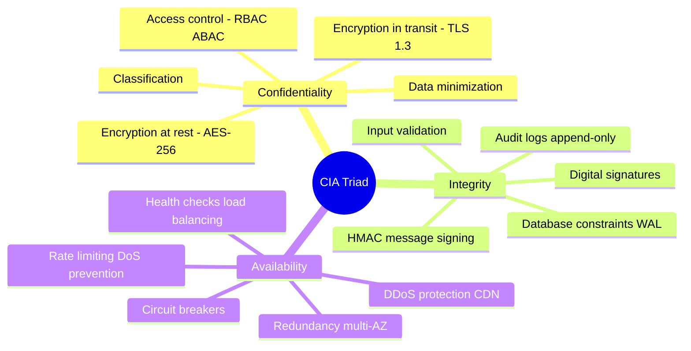

⚡ TL;DR - The CIA Triad is the three-property framework
that defines what security protects: Confidentiality
(only authorized parties can READ data), Integrity (only
authorized parties can MODIFY data, and modifications are
detectable), and Availability (authorized parties can
access the system when needed). Every security control,
vulnerability, and attack can be analyzed through this
lens. SQL injection violates all three: it reads data
(C), modifies data (I), and can crash the system (A).
Ransomware primarily attacks Availability (encrypts data,
demands ransom to restore access). A man-in-the-middle
attack violates Confidentiality and Integrity. DDoS attacks
Availability only. When designing security controls:
identify which CIA property is threatened, then choose
controls that protect that specific property.

---

| #002 | Category: Security | Difficulty: ★☆☆ |
|:---|:---|:---|
| **Depends on:** | The Security Problem in Software Engineering | |
| **Used by:** | Attacker Mindset, OWASP Top 10, Defense in Depth | |
| **Related:** | Security Problem, Attacker Mindset, OWASP, Cost of Breach, Defense in Depth, STRIDE | |

---

### 🔥 The Problem This Solves

**WORLD WITHOUT IT:**
A security engineer receives a threat report: "Possible
unauthorized access to the orders database." Without a
framework: "unauthorized access" could mean reading orders,
modifying orders, or deleting them. The engineer does not
know where to start the investigation or which controls
to check. With the CIA Triad: the engineer immediately
asks three questions: (1) Was confidentiality breached
(data read by unauthorized party)? (2) Was integrity
breached (data modified or deleted)? (3) Was availability
impacted (system unavailable)? Each question maps to
specific logs to check, specific controls to verify.
The CIA Triad provides a structured vocabulary for
analyzing both attacks and defenses.

---

### 📘 Textbook Definition

**Confidentiality:** Data is accessible ONLY to authorized
parties. Protection mechanisms: encryption (AES-256 at
rest, TLS 1.3 in transit), access control (RBAC, ABAC),
data classification (know what is sensitive), data
minimization (collect only what is needed).

**Integrity:** Data is modified ONLY by authorized parties,
and unauthorized modifications are detectable. Protection
mechanisms: cryptographic hashing (HMAC for message
integrity), digital signatures (tamper-evident audit logs),
database constraints (foreign keys, check constraints),
write access control (who can write, not just read).
Integrity includes both: preventing unauthorized modification
AND detecting that unauthorized modification has occurred.

**Availability:** Authorized parties can access the system
when needed. Protection mechanisms: redundancy (multiple
instances, geographic replication), rate limiting (prevent
DoS), circuit breakers (prevent cascading failures), DDoS
mitigation (CDN, traffic scrubbing). Availability conflicts
with Confidentiality: a system with perfect availability
and no access control is maximally insecure. Security
design requires trading off these properties.

**The DAD Triad (what attackers do):**
- Disclosure: attacks on Confidentiality (data breaches)
- Alteration: attacks on Integrity (data tampering)
- Destruction/Denial: attacks on Availability (DoS/ransomware)

---

### ⏱️ Understand It in 30 Seconds

**One line:**
CIA Triad = Confidentiality (only authorized reads) +
Integrity (only authorized writes, tamper-detectable) +
Availability (accessible when needed). Every attack violates
one or more of these three properties.

**One analogy:**
> A bank safe: Confidentiality = only you can see inside
> (vault door, access code). Integrity = no one has
> secretly swapped your $100 bills for counterfeits
> (serial numbers, tamper-evident seals). Availability =
> you can access your money when the bank is open (business
> hours, no bank run). Security design is choosing which
> of these to prioritize (they trade off against each other).

---

### 🔩 First Principles Explanation

**Why CIA properties trade off against each other:**

```
CONFIDENTIALITY vs AVAILABILITY:
  Maximum confidentiality: encrypt everything, require
    multi-factor auth, limit access to small list.
  Cost: slower access (encryption overhead), auth failures
    block legitimate users, complex key management.
  Maximum availability: no authentication, no encryption,
    served from all edge nodes.
  Cost: anyone can read anything.
  REAL-WORLD BALANCE: HTTPS (encryption preserves C,
    CDN caching preserves A, cert validation reduces key mgmt).

INTEGRITY vs AVAILABILITY:
  Maximum integrity: every write requires cryptographic
    signature verification, audit log entry, and quorum
    of approvers.
  Cost: writes become very slow, consensus increases latency.
  Maximum availability: allow all writes immediately.
  Cost: malicious writes are undetected.
  REAL-WORLD BALANCE: WAL (Write-Ahead Log) in databases
    ensures integrity (every write recorded durably before
    committed) with minimal availability impact.

CONFIDENTIALITY vs INTEGRITY:
  These rarely trade off directly - they complement each other.
  Both require access control (only authorized parties can
    read OR write). Encryption protects both properties in
    transit (TLS) and at rest (database encryption).
  They compete for engineering resources/complexity, not
    for the same security properties.
```

---

### 🧪 Thought Experiment

**SCENARIO: Classify these real attacks against CIA Triad**

```
ATTACK 1: SQL Injection on a user database
  WHERE clause bypassed: SELECT * FROM users WHERE '1'='1'
  Returns ALL users' data to attacker.
  CIA impact:
    C: VIOLATED (unauthorized read of all users)
    I: potentially (attacker could also UPDATE/DELETE)
    A: potentially (attacker could DROP TABLE users)
  Primary property: Confidentiality (data breach)

ATTACK 2: Ransomware (WannaCry style)
  Encrypts all files on affected machines.
  Demands Bitcoin payment for decryption key.
  CIA impact:
    C: not violated (attacker reads but does not share)
    I: VIOLATED (files modified - encrypted)
    A: VIOLATED PRIMARY (files are inaccessible)
  Primary property: Availability (system inoperable)

ATTACK 3: DNS hijacking
  Attacker poisons DNS cache, redirects traffic to
  malicious server that serves the same-looking website.
  CIA impact:
    C: VIOLATED (credentials submitted to attacker server)
    I: VIOLATED (attacker can alter page content served)
    A: not violated (site appears to work normally)
  Primary property: Confidentiality + Integrity (MITM)

ATTACK 4: Log tampering
  Attacker who gained access deletes audit log entries
  to cover their tracks.
  CIA impact:
    C: not violated (log content is not sensitive per se)
    I: VIOLATED PRIMARY (logs are now inaccurate/incomplete)
    A: not directly violated
  Primary property: Integrity (tamper evidence destroyed)

LESSON: Most attacks violate multiple CIA properties.
But classifying the PRIMARY property helps:
  - Prioritize which controls to check first
  - Identify which defenses would have prevented the attack
  - Communicate impact to non-technical stakeholders
    (C = data breach, I = corruption/fraud, A = downtime)
```

---

### 🧠 Mental Model / Analogy

> CIA Triad maps directly to the three properties of a
> trustworthy message (from cryptography):
> - Confidentiality = encrypted (only intended recipient can read)
> - Integrity = HMAC (tampering is detectable)
> - Availability = delivered (the message arrives reliably)
> This is exactly why TLS provides all three: encryption (C),
> HMAC on every record (I), and TCP reliability (A).
> The CIA Triad is the specification; TLS is one implementation.

---

### 📶 Gradual Depth - Five Levels

**Level 1 - What it is (anyone can understand):**
CIA stands for three things security protects:
Confidentiality (keep secrets secret), Integrity (keep data
accurate and unmodified), Availability (keep systems running).
A data breach hurts Confidentiality. Ransomware hurts
Availability. Data corruption hurts Integrity.

**Level 2 - How to use it (junior developer):**
When implementing a feature, ask: "Which CIA properties
could be violated?" API that returns user data: Confidentiality
(add authentication + authorization). Form that updates
user profile: Integrity (validate input, prevent mass
assignment). Service that other services depend on:
Availability (add circuit breakers, health checks).

**Level 3 - How it works (mid-level engineer):**
CIA Triad maps to specific technical controls:
C: TLS (in transit), AES-256 (at rest), RBAC (access control).
I: HMAC (message integrity), digital signatures (non-repudiation),
  transactions + constraints (database integrity).
A: Replication (no single point of failure), rate limiting
  (prevent DoS), CDN (geographic distribution).
Threat modeling (STRIDE) maps to CIA: S+T violates I,
R violates I+A, I violates C, D violates C+I, D violates A, E violates all.

**Level 4 - Why it was designed this way (senior/staff):**
The CIA Triad originates from military security models
(Bell-LaPadula for Confidentiality, Biba for Integrity)
developed in the 1970s. It was formalized for civilian
computer security by NIST. The simplicity is deliberate:
complex security frameworks with dozens of properties are
harder to apply consistently. Three properties that cover
all attack categories make threat analysis tractable.
The limitation: CIA Triad does not capture Privacy (a
weaker form of Confidentiality that allows some disclosure
for legitimate purposes), Authenticity (verifying origin,
not just access), or Non-repudiation (proving who did what).
These properties are addressed by extensions (CIA + AAA,
or the Parkerian Hexad with 6 properties).

**Level 5 - Mastery (distinguished engineer):**
At organizational scale, CIA properties must be explicitly
prioritized for each system and data type. A payment
processing system might prioritize: I (data correctness
above all - no corrupt transactions), C (card data must
never be disclosed), A (downtime is lost revenue but
preferable to fraud). A real-time trading system might
prioritize: A (being down costs more than fraud), I
(trade execution correctness), C (less critical than the
other two for most trade data). Explicitly documenting
CIA priorities per system enables: (1) risk acceptance
decisions ("we accept reduced A to achieve strong C"),
(2) vendor selection (choose vendors who share your priorities),
(3) incident response triage (which system's I failure
is most urgent to address?).

---

### ⚙️ How It Works (Mechanism)

**CIA controls mapping in a typical web application:**

```
┌─────────────────────────────────────────────────────────┐
│                    WEB APPLICATION                      │
│                                                         │
│  CONFIDENTIALITY CONTROLS                               │
│  ├── TLS 1.3: data encrypted in transit                 │
│  ├── AES-256-GCM: sensitive columns encrypted at rest   │
│  ├── JWT auth + RBAC: only authorized reads             │
│  └── Data masking: logs exclude sensitive fields        │
│                                                         │
│  INTEGRITY CONTROLS                                     │
│  ├── HMAC: API request signing prevents tampering       │
│  ├── DB constraints: NOT NULL, FK, CHECK prevent        │
│  │   invalid data from entering                         │
│  ├── WAL: database writes are durable before commit     │
│  ├── Audit log: append-only, HMAC-chained entries       │
│  └── Input validation: rejects malformed data at entry  │
│                                                         │
│  AVAILABILITY CONTROLS                                  │
│  ├── Load balancer: distributes across N instances      │
│  ├── Health checks: removes unhealthy instances         │
│  ├── Rate limiting: prevents DoS via request flooding   │
│  ├── Circuit breaker: prevents cascading failure        │
│  ├── DDoS protection (CDN/Shield): absorbs flood        │
│  └── Multi-AZ: survives AZ failure                      │
└─────────────────────────────────────────────────────────┘
```



---

### 💻 Code Example

**BAD: No Integrity protection on a critical API**

```python
# BAD: Webhook receiver with no integrity verification.
# Any HTTP client can POST to this endpoint and trigger
# order processing with fake data.
# Attacker can: POST {"order_id": "999", "status": "paid"}
# and mark unpaid orders as paid.
@app.post("/webhooks/payment")
async def receive_payment_webhook(payload: dict):
    order_id = payload["order_id"]
    status = payload["status"]
    if status == "paid":
        await mark_order_paid(order_id)  # FRAUD possible
    return {"ok": True}

# GOOD: HMAC signature verification for Integrity.
# Only the payment provider (who knows the secret) can
# send a valid signature. Tampering → invalid signature.
import hmac, hashlib

WEBHOOK_SECRET = os.environ["PAYMENT_WEBHOOK_SECRET"]

@app.post("/webhooks/payment")
async def receive_payment_webhook(
    request: Request,
    payload: dict,
    x_signature: str = Header()  # "sha256=abc123..."
):
    # Verify INTEGRITY: payload was not tampered in transit.
    body = await request.body()
    expected_sig = "sha256=" + hmac.new(
        WEBHOOK_SECRET.encode(),
        body,
        hashlib.sha256
    ).hexdigest()

    if not hmac.compare_digest(x_signature, expected_sig):
        # Tampered payload: reject
        raise HTTPException(status_code=401,
                            detail="Invalid signature")

    order_id = payload["order_id"]
    status = payload["status"]
    if status == "paid":
        await mark_order_paid(order_id)  # Safe: verified origin
    return {"ok": True}
```

---

### ⚖️ Comparison Table

| Attack Type | Confidentiality | Integrity | Availability | Example |
|:---|:---|:---|:---|:---|
| **Data breach** | VIOLATED | No | No | SQL injection dumps user table |
| **Ransomware** | No | VIOLATED | VIOLATED | WannaCry encrypts all files |
| **DDoS** | No | No | VIOLATED | Flood of traffic overwhelms server |
| **MITM** | VIOLATED | VIOLATED | No | Attacker intercepts and alters traffic |
| **Log tampering** | No | VIOLATED | No | Attacker deletes audit entries |
| **Credential theft** | VIOLATED | No | No | Phishing steals passwords |
| **SQL injection** | VIOLATED | VIOLATED | VIOLATED | Full database compromise |

---

### ⚠️ Common Misconceptions

| Misconception | Reality |
|:---|:---|
| Availability is less important than Confidentiality and Integrity | For many systems (payment processing, healthcare, emergency services), Availability is the most critical property. A hospital whose patient records are unavailable during surgery causes more immediate harm than a data breach. Ransomware attacks (which primarily attack Availability) have caused hospitals to divert patients to other facilities, contributing to patient deaths. Availability is not a secondary concern - it must be explicitly prioritized per system. |
| Encryption solves Confidentiality completely | Encryption protects data in transit (TLS) and at rest (AES). But: if the access control is wrong (any authenticated user can read any data), encryption does not help (the attacker just authenticates and requests the data normally). Encryption is one layer of Confidentiality protection. The complete solution requires encryption + access control + data classification + data minimization. |
| CIA Triad covers all security properties | CIA Triad does not cover: Authenticity (is this message actually from who it claims?), Non-repudiation (can you prove who sent a message?), Privacy (a weaker form of Confidentiality for personal data). These are addressed by extensions. The Parkerian Hexad adds: Possession (physical control of data medium), Authenticity, Utility (data in a usable form). CIA Triad is sufficient for most discussions but inadequate for compliance frameworks (ISO 27001, NIST CSF) which require more nuanced property definitions. |

---

### 🚨 Failure Modes & Diagnosis

**Failure: Confidentiality breach through access control gap**

**Symptom:** Customer service representative (CSR) has access
to order details. Later discovered CSR accessed 10,000
customer records for accounts they never handled. No
functional error - access was technically allowed.

**Root Cause:** RBAC policy was too broad: "CSR" role had
access to ALL customer records, not just assigned accounts.
Confidentiality violated by overly permissive access control.

**Diagnosis:**
```sql
-- Audit query: which user accessed records outside their scope
SELECT csr_user_id, customer_id, accessed_at
FROM access_audit_log
WHERE csr_user_id NOT IN (
  SELECT csr_user_id FROM case_assignments
  WHERE customer_id = access_audit_log.customer_id
)
AND accessed_at > '2024-01-01'
ORDER BY csr_user_id, accessed_at;
```

**Fix:** Implement attribute-based access control (ABAC):
CSR can only access records for assigned accounts.
Add access logging with anomaly detection:
alert when one CSR accesses > 100 records/day.

---

### 🔗 Related Keywords

**Prerequisites (understand these first):**
- `The Security Problem in Software Engineering` - context for why CIA matters

**Builds On This (learn these next):**
- `What Attackers Actually Do` - how attacks map to CIA properties
- `OWASP Top 10 Overview` - most common CIA violations in web apps
- `Defense in Depth` - how to protect all three properties simultaneously

---

### 📌 Quick Reference Card

```
┌──────────────────────────────────────────────────────────┐
│ C - Confidentiality │ Only authorized parties CAN READ   │
│                     │ Controls: TLS, AES, RBAC, masking  │
├─────────────────────┼───────────────────────────────────┤
│ I - Integrity       │ Only auth parties CAN WRITE        │
│                     │ + tampering is DETECTABLE          │
│                     │ Controls: HMAC, sigs, constraints  │
├─────────────────────┼───────────────────────────────────┤
│ A - Availability    │ System accessible when needed      │
│                     │ Controls: replication, rate limit  │
├─────────────────────┼───────────────────────────────────┤
│ ATTACK → CIA        │ Breach→C | Ransomware→A | Corrupt→I│
├─────────────────────┼───────────────────────────────────┤
│ ONE-LINER           │ "C=read, I=write+detect, A=up"     │
└──────────────────────────────────────────────────────────┘
```

---

### 💎 Transferable Wisdom

**Reusable Engineering Principle:**
"Every system has three security properties to protect,
and they trade off against each other." This applies to
distributed systems design: Consistency (Integrity) vs
Availability vs Partition Tolerance (CAP Theorem) is a
parallel triad for distributed systems. Choosing strong
Consistency (I) requires sacrificing Availability (A) during
partitions. Database designers face the same trilemma
as security engineers. The CIA Triad provides the same
mental framework: enumerate properties, identify trade-offs,
make explicit decisions.

---

### 💡 The Surprising Truth

The "I" in CIA (Integrity) is the least understood and
most underprotected property in practice. Most teams
focus on Confidentiality (encrypt everything) and
Availability (uptime SLAs). But Integrity failures are
often the most expensive: a financial system with
Integrity violation (undetected transaction corruption)
can lose more money per day of undetected corruption
than a data breach loses in total. Worse: Integrity
violations are often invisible (data looks correct but
is subtly wrong) while Confidentiality and Availability
failures are immediately visible. The engineering defense:
HMAC on all inter-service messages, audit logs that are
cryptographically chained (each entry includes a hash of
the previous entry - modification of any entry is detectable
by checking the chain), and periodic integrity verification
(checksum databases against backups to detect silent corruption).

---

### ✅ Mastery Checklist

**You've mastered this when you can:**
1. **CLASSIFY** any attack against the CIA Triad: which
   property is primarily violated, which secondarily?
2. **MAP** CIA properties to specific technical controls
   (C→TLS+RBAC, I→HMAC+constraints, A→replication+rate limit).
3. **IDENTIFY** a missing Integrity control in code
   (webhook receiver without HMAC verification).
4. **EXPLAIN** why CIA properties trade off (Confidentiality
   vs Availability) with a real-world example (healthcare
   must prioritize A over C for life-critical records).

---

### 🎯 Interview Deep-Dive

**Q: What is the CIA Triad and how does it apply to API
security design?**

*Why they ask:* Tests security fundamentals beyond surface
knowledge.

*Strong answer includes:*
- Definition: C=only authorized reads, I=only authorized
  writes + tamper detection, A=accessible when needed.
- Applied to API: Confidentiality = authentication (who
  are you?) + authorization (what can you access?) + TLS
  (encrypted in transit). Integrity = input validation
  (only valid data enters), HMAC on webhooks (verify
  origin), database constraints (prevent corrupt data),
  idempotency keys (prevent duplicate processing = logical
  integrity). Availability = rate limiting (prevent DoS),
  circuit breakers (prevent cascade), health checks.
- Trade-offs: strong Confidentiality (every request
  re-authenticated with crypto) adds latency, trading
  against Availability (higher latency = lower throughput).
  JWT tokens trade I (token may become invalid mid-session)
  for A (stateless, scales horizontally). Every API design
  decision implicitly trades CIA properties.