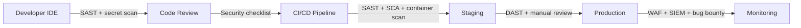

⚡ TL;DR - Security vulnerabilities are introduced in code.
The security team cannot write secure code for every
developer - they can set standards, provide tooling, and
conduct audits. But the developer who writes the SQL query
without parameterization, the developer who skips the
authorization check, the developer who hardcodes the API
key - they create the vulnerability that causes the breach.
This is not an accusation but an engineering reality: the
people closest to the code are the only ones who can
prevent code-level vulnerabilities. "Security is everyone's
responsibility" is not a feel-good slogan - it is a
structural fact of how vulnerabilities are created and
how they must be prevented. The organization's job: make
security easy (provide secure defaults, libraries, tooling)
and make insecurity visible (SAST in CI/CD, code review
checklists, automated dependency scanning).

---

| #006 | Category: Security | Difficulty: ★☆☆ |
|:---|:---|:---|
| **Depends on:** | The Security Problem, Cost of a Security Breach | |
| **Used by:** | Defense in Depth, Secure Coding First Principles, Security Mindset | |
| **Related:** | Security Problem, Breach Cost, Defense in Depth, Secure Coding, Security Champions | |

---

### 🔥 The Problem This Solves

**WORLD WITHOUT SHARED RESPONSIBILITY:**
Organization has a dedicated security team of 5 people.
200 developers ship code daily. Security team reviews
code "when they have time" - which means after launch,
for critical features only. 95% of code ships with no
security review. Result: SQL injection found by a customer
who reports it on Twitter. The security team is not at
fault (they cannot review 200 developers' work with 5
people). The developer who wrote the unparameterized query
is not malicious - they just did not think about it. The
organization failed: it did not make security knowledge
accessible, did not provide secure defaults, did not put
SAST in CI/CD, and did not include security in the
"definition of done" for any ticket. Security failed
because it was delegated to a team too small to catch
every issue.

---

### 📘 Textbook Definition

**Developer Security Responsibility:** The principle that
security is an integral part of every developer's role,
not a separate discipline handled by specialists. In
practice: developers are expected to understand common
vulnerabilities (OWASP Top 10 at minimum), use secure
patterns (parameterized queries, not string concatenation
for SQL), identify security-relevant code during development
and review, and escalate uncertain cases to security team.

**Why developers are the most important security control:**
- Security vulnerabilities ARE code vulnerabilities.
  They are written by developers (intentionally or not).
  They can ONLY be eliminated by developers.
- Security team role: define standards, provide tooling,
  conduct audits, handle incidents. NOT: review every line
  of code (impossible at scale).
- Security team leverage: 5 security engineers × 200
  developers = each security engineer's knowledge must
  multiply across 40 developers. The only way to scale:
  teach developers to write secure code.

**The DevSecOps shift:**
Traditional: Dev → QA → Ops → Security Review (linear, late)
DevSecOps: Security integrated into every phase:
  - Dev: security training, secure frameworks, SAST in IDE
  - Code Review: security checklist, security-aware reviewers
  - CI/CD: automated SAST, DAST, dependency scanning
  - Staging: automated pen test (DAST), manual review
  - Production: runtime protection (RASP, WAF), monitoring

---

### ⏱️ Understand It in 30 Seconds

**One line:**
Security vulnerabilities are written in code - only
developers can prevent them - the security team scales
through developer education and automated tooling, not
manual code review of everything.

**One analogy:**
> A city cannot have a building inspector in every room
> of every building. Instead: building code (standards),
> licensed contractors (trained developers), inspection
> at key milestones (security review of critical features),
> and fire alarms (runtime monitoring). Developers are
> the licensed contractors: responsible for knowing and
> applying the code, not waiting for an inspector to
> catch every violation.

---

### 🔩 First Principles Explanation

**The math of security team scale:**

```
SECURITY TEAM SIZE: 5 engineers
DEVELOPMENT TEAM: 200 developers
DAILY COMMITS: ~100 pull requests/day (average 2 files changed)
FILES REVIEWED/DAY: ~200 files

IF SECURITY TEAM REVIEWS EVERYTHING:
  Security review time per PR: 30 minutes
  PRs reviewed per security engineer/day: 16 (8-hour day)
  Total PRs reviewable: 5 engineers × 16 = 80 PRs/day
  PRs submitted: 100/day
  Gap: 20 PRs/day unreviewed = 7,300/year unreviewed
  = 7,300 × 2 files = 14,600 files with no security review

CONCLUSION: Even if the security team did NOTHING but code
review, they could not keep up with 200 developers.

THE ONLY VIABLE MODEL: Developer-led security
  - Every developer learns security basics (8-hour training)
  - SAST runs automatically on every PR (zero human time)
  - Security team reviews: threat models + critical features
    + findings from SAST + penetration test results
  - Code review: every developer checks for OWASP issues
    during normal code review (5-10 minutes per PR)

This model SCALES: adding 10 more developers adds 10 more
security reviewers (at basic level) + SAST catches them too.
The pure specialist model: adding 10 developers just
makes the problem worse.
```

---

### 🧪 Thought Experiment

**SCENARIO: The same vulnerability found at four different stages**

```
VULNERABILITY: SQL injection in search endpoint
  Code: db.execute("SELECT * FROM products WHERE name='"
        + search_term + "'")
  Fix: db.execute("SELECT * FROM products WHERE name=?",
       [search_term])

STAGE 1: Developer writes the code.
  If developer KNOWS about SQL injection:
    - Does not write the vulnerable code.
    - Uses the ORM or parameterized query.
    - Cost: 0 (writes correct code first time)
    REQUIRES: Developer security education

STAGE 2: SAST in IDE (SonarLint, Semgrep)
  IDE underlines the string concatenation in SQL context.
  Developer fixes it before committing.
  Cost: 5 minutes.
  REQUIRES: SAST configured in developer's IDE or pre-commit

STAGE 3: SAST in CI/CD
  PR fails automated check: "SQL injection: string
  concatenation in database query at search.py:47"
  Developer goes back, fixes, re-commits.
  Cost: 30 minutes (context switch, fix, re-push, re-review)
  REQUIRES: SAST in CI/CD pipeline with blocking policy

STAGE 4: Code review (human reviewer)
  Security-aware reviewer: "This looks like unparameterized
  SQL. Can you use a parameterized query instead?"
  Cost: 1 hour (review comment, discussion, fix, re-review)
  REQUIRES: Security-aware developers doing code review

STAGE 5: Penetration test (pre-release)
  Pen tester: "Found SQL injection at /api/search"
  Cost: Fix (2h) + regression test (2h) + re-test (1h)
  + pen tester time (1h to document and verify) = ~6h
  REQUIRES: Pen test budget and schedule

STAGE 6: Bug bounty (post-release)
  Security researcher: "$5,000 bounty claim for SQL injection"
  Cost: Fix ($500 dev time) + bounty ($5,000) + deploy ($200)
  + verify ($300) + possible credential reset + monitoring
  Total: ~$6,000+
  REQUIRES: Bug bounty program

STAGE 7: Attacker exploits (post-breach)
  Attacker dumps entire product database.
  Cost: $500k+ (forensics, notification, legal, remediation)
  REQUIRES: nothing - happens automatically when not caught

LESSON: The same vulnerability costs 0x at Stage 1 and
500,000x+ at Stage 7. Developer education is the cheapest
and most effective security control ever invented.
```

---

### 🧠 Mental Model / Analogy

> Security is like quality: you cannot inspect quality into
> a product - you must build it in. Quality inspection
> (QA testing) finds defects after they are created. But
> defect prevention (developer training, code review, TDD)
> means defects are never created. Security is the same:
> a penetration test (security inspection) finds
> vulnerabilities after they exist. Security education
> and tooling (security prevention) means vulnerabilities
> are never written. Both quality and security ultimately
> require the person creating the work to care about the
> property - not just the inspector at the end.

---

### 📶 Gradual Depth - Five Levels

**Level 1 - What it is (anyone can understand):**
Security problems start when someone writes code that has
a mistake an attacker can exploit. Only the programmer
writing the code can catch it early and cheaply. The
security team helps - but they cannot watch every line
of code every developer writes. So every developer needs
to learn enough security to catch their own mistakes.

**Level 2 - How to use it (junior developer):**
Learn the OWASP Top 10 well enough to recognize when you
are writing code that might have those issues. Install
SonarLint or Semgrep in your IDE - it flags security issues
as you type. Add a security mini-checklist to your
code review process: "Does this feature have auth checks?
Is user input validated? Is there anything sensitive in the
logs? Are all dependencies up to date?"

**Level 3 - How it works (mid-level engineer):**
Developer security integrates into existing processes:
Definition of Done: includes security review for features
touching user data or authentication. Code Review Checklist:
includes OWASP-based security questions. CI/CD: SAST and
dependency scanning gates block merging vulnerable code.
Threat Model: added to sprint 0 of each significant feature.
These do not create new processes - they embed security
into existing engineering processes.

**Level 4 - Why it was designed this way (senior/staff):**
The Security Champions model (developed at Spotify/Netflix
and now widespread): embed one security-focused developer
per team who acts as a liaison to the security team.
Champions receive deeper security training, help with
threat models, review security-sensitive code before the
security team does, and multiply security knowledge in the
team. This addresses the scale problem: instead of 5
security engineers reviewing everything, 20 security
champions (one per engineering team) provide first-level
security review and escalate to security engineers for
complex cases. The leverage ratio changes from 1:40
(security to developer) to 1:10 (champion to developer).

**Level 5 - Mastery (distinguished engineer):**
At organizational scale, developer security responsibility
requires: (1) Clear ownership (RACI: developer responsible
for implementation security, security team accountable for
standards and tooling), (2) Measurable outcomes (SAST
finding rate, time-to-fix critical findings, % of new
features with threat models), (3) Incentive alignment
(security metrics in engineering performance reviews, not
just feature velocity), (4) Feedback loops (developer sees
the SAST results before the security team does, enabling
immediate correction). The failure mode at scale: security
becomes a bureaucratic gate (submit to security team, wait
3 weeks for review) rather than an embedded quality bar
(SAST blocks the merge, developer fixes in minutes). Gates
slow teams and create adversarial culture. Embedded tooling
enables developer agency and makes security fast.

---

### ⚙️ How It Works (Mechanism)

**DevSecOps: Security integrated at each pipeline stage:**

```
┌─────────────────────────────────────────────────────────┐
│                    DEVELOPER LAPTOP                     │
│  IDE Plugin (SonarLint, Semgrep): real-time SAST        │
│  Pre-commit hook: secrets detection (git-secrets, gitleaks)│
└─────────────────────────────────────────────────────────┘
         ↓ git push
┌─────────────────────────────────────────────────────────┐
│                    CODE REVIEW                          │
│  Security checklist in PR template                      │
│  Security champion reviews auth/crypto/injection risks  │
└─────────────────────────────────────────────────────────┘
         ↓ merge to branch
┌─────────────────────────────────────────────────────────┐
│                    CI/CD PIPELINE                       │
│  SAST: Semgrep/SonarQube/CodeQL (blocking)              │
│  SCA: Snyk/Dependabot (block on critical CVE)           │
│  Secret scan: GitGuardian/gitleaks (blocking)           │
│  Container scan: Trivy (block on critical CVE)          │
└─────────────────────────────────────────────────────────┘
         ↓ deploy to staging
┌─────────────────────────────────────────────────────────┐
│                    STAGING                              │
│  DAST: OWASP ZAP automated scan                         │
│  Manual security review: for new major features         │
│  Penetration test: quarterly or per major release       │
└─────────────────────────────────────────────────────────┘
         ↓ deploy to production
┌─────────────────────────────────────────────────────────┐
│                    PRODUCTION                           │
│  WAF: blocks known attack patterns                      │
│  RASP: runtime application self-protection (optional)   │
│  SIEM: anomaly detection, security alerting             │
│  Bug bounty: community finds what automation misses     │
└─────────────────────────────────────────────────────────┘
```



---

### 💻 Code Example

**BAD: No security context in code review (what happens without it)**

```python
# PR: "Add user export feature"
# Code review focuses on: does it work, is it clean code?
# Security question never asked: "Should any user be able
# to export ANY other user's data?"

@app.get("/export/user/{user_id}")
async def export_user_data(user_id: int, token: str = Header()):
    user = validate_token(token)  # Authentication: OK
    # Missing: does 'user' have permission to export 'user_id'?
    data = db.get_all_user_data(user_id)
    return StreamingResponse(csv_generator(data))
    # Vulnerability: any authenticated user can export
    # any other user's complete data profile. IDOR.

# GOOD: Security checklist embedded in PR template
# PR template includes:
# - [ ] Does every API endpoint check authorization
#       (not just authentication)?
# - [ ] Is user input validated for type, length, format?
# - [ ] Does this feature log sensitive data anywhere?
# - [ ] Are all error responses sanitized?
# - [ ] Does this endpoint need rate limiting?

@app.get("/export/user/{user_id}")
async def export_user_data(user_id: int, token: str = Header()):
    user = validate_token(token)  # Authentication
    # Authorization: only self-export or admin
    if user.id != user_id and not user.is_admin:
        raise HTTPException(status_code=403,
            detail="Can only export your own data")
    # Rate limit: prevent bulk export fishing
    await rate_limit(f"export:{user.id}", max=3, window=3600)
    data = db.get_all_user_data(user_id)
    # Audit log: who exported what
    audit_log.record(user.id, "export", user_id)
    return StreamingResponse(csv_generator(data))
```

---

### ⚖️ Comparison Table

| Model | Security Team Role | Developer Role | Coverage | Speed |
|:---|:---|:---|:---|:---|
| **Security gate** (traditional) | Reviews everything | "Not my problem" | Low (security team bottleneck) | Slow (queue) |
| **Security team only** | Owns all security | No responsibility | Very low (can't scale) | Very slow |
| **Developer-led + tools** | Sets standards, reviews critical | Owns implementation security | High (SAST catches most, devs catch rest) | Fast (automated) |
| **DevSecOps (embedded)** | Tooling + training + champions | Security as definition of done | Highest | Fast + continuous |

---

### ⚠️ Common Misconceptions

| Misconception | Reality |
|:---|:---|
| Security engineers can review all code | A 5-person security team reviewing 200 developers' code would take 40 hours per developer just to review daily output. It is mathematically impossible. Security teams exist to: set standards, provide tooling, review critical systems, handle incidents, and train developers. Not to review every PR. |
| Making security "the developer's responsibility" is blaming developers when breaches happen | Developer responsibility ≠ developer blame. The organization is responsible for: giving developers security training, providing secure frameworks and libraries, deploying SAST in CI/CD, and including security in the definition of done. If the organization does none of those things and blames the developer who wrote an insecure query: that is unfair and will not improve security. Developer responsibility requires organizational support to be meaningful. |

---

### 🚨 Failure Modes & Diagnosis

**Failure: Security as an afterthought in a new feature**

**Symptoms:**
- Feature shipped without threat model
- No authorization check on new API endpoint
- Bug bounty submission within 2 weeks of launch
- Security team scrambles for emergency patch

**Root cause diagnostic:**
```
CHECKLIST: Did security fail at each phase?

Phase 1 (Design): Was a threat model done?
  [ ] No → Process failure: no security in design phase

Phase 2 (Development): Did SAST flag issues?
  [ ] SAST not in CI/CD → Tooling failure
  [ ] SAST ran but was not blocking → Policy failure

Phase 3 (Code Review): Was there a security checklist?
  [ ] No checklist → Process failure
  [ ] Checklist skipped → Culture failure

Phase 4 (Testing): Was DAST/manual test done?
  [ ] No test env security scan → Process failure
  [ ] No time/budget → Prioritization failure

FIX: Address the EARLIEST failing phase.
  The root cause is always the earliest phase where
  security was absent. Fixing only the latest failure
  point leaves all earlier failures unaddressed.
```

---

### 🔗 Related Keywords

**Prerequisites:**
- `The Security Problem` - why everyone must care
- `Cost of a Security Breach` - why it matters economically

**Builds on this:**
- `Defense in Depth` - the strategy shared responsibility enables
- `Secure Coding First Principles` - what developers must know
- `Security Champions Program` - scaling developer responsibility

---

### 📌 Quick Reference Card

```
┌──────────────────────────────────────────────────────────┐
│ SCALE PROBLEM│ 5 security engineers ÷ 200 developers     │
│              │ = 1 security review per 40 developers     │
│              │ → ONLY developer-led security scales      │
├──────────────┼───────────────────────────────────────────┤
│ DEVSECOPS    │ IDE → Code Review → CI/CD → Staging       │
│ STAGES       │ → Production (security at each stage)     │
├──────────────┼───────────────────────────────────────────┤
│ TOOLS        │ SAST: Semgrep, SonarQube, CodeQL          │
│              │ SCA: Snyk, Dependabot                     │
│              │ Secrets: gitleaks, GitGuardian            │
├──────────────┼───────────────────────────────────────────┤
│ ONE-LINER    │ "Security vulns are written in code.      │
│              │  Only developers can prevent them.        │
│              │  Tools make it fast. Culture makes it     │
│              │  happen. Blame is not a strategy."        │
└──────────────────────────────────────────────────────────┘
```

---

### 💎 Transferable Wisdom

**Reusable Engineering Principle:**
"Quality attributes must be embedded in the development
process - not inspected in at the end." This applies to
all -ilities: performance (load test late = scramble to fix
architecture), reliability (add circuit breakers after
the outage), observability (add logging after the bug is
unfindable in production). The pattern is universal: any
quality attribute that is treated as an afterthought will
be poorly implemented and expensive to remediate. The
solution is always the same: embed the quality attribute
into the definition of done, provide tooling that makes
the quality attribute easy to achieve, and measure
compliance continuously.

---

### 💡 The Surprising Truth

The 2021 NIST study "Costs and Benefits of Cybersecurity
Training" found: developer security training has the
highest ROI of any security control, including firewalls,
SIEM, and penetration testing. The reason: a trained
developer does not write vulnerable code - so the
vulnerability never exists to be detected, exploited,
or remediated. A firewall blocks external access to a
vulnerability but does not eliminate it. Training eliminates
the vulnerability at creation. The study estimated $5,400
ROI per $100 invested in developer security training
(54x ROI). No other security control approaches this ratio.
The implication: if you have one dollar to spend on security,
spend it on developer education before any technical control.

---

### ✅ Mastery Checklist

**You've mastered this when you can:**
1. **EXPLAIN** why a 5-person security team cannot review
   200 developers' code and what the alternative model is
   (DevSecOps: SAST automation + developer security education).
2. **DESCRIBE** what security controls belong at each stage
   (IDE/pre-commit, code review, CI/CD, staging, production).
3. **BUILD** a minimal security checklist for code review
   based on the 5 most common vulnerability categories for
   your tech stack.
4. **ARTICULATE** the difference between developer responsibility
   (write secure code, catch issues in review) and organizational
   responsibility (provide training, tooling, secure defaults).

---

### 🎯 Interview Deep-Dive

**Q: How would you improve security across a 200-person
engineering organization that currently has a 5-person
security team and no automated security tooling?**

*Why they ask:* Tests organizational thinking and knowledge
of DevSecOps practices. Also tests whether candidate can
prioritize effectively.

*Strong answer includes:*
- Phase 1 (Week 1-4, low effort, high impact): Deploy SAST
  in CI/CD. Semgrep with OWASP ruleset: free, runs on every
  PR, zero developer friction. Blocks critical findings
  (SQLi, hardcoded secrets, unvalidated redirect). This
  alone catches 30-40% of common vulnerabilities automatically.
- Phase 2 (Month 2-3): Dependency scanning (Snyk or Dependabot
  free tier): alerts on CVEs in dependencies. Security PR
  template: 5 security questions added to existing PR checklist.
- Phase 3 (Month 3-6): Security champions: one developer per
  team (20 total) receives 2 days of security training.
  Champions conduct first-level security review, reduce
  security team load by 50%.
- Phase 4 (Ongoing): Quarterly pen test, bug bounty program,
  security metrics in engineering leadership reporting.
- Key insight: don't start with expensive pen tests or
  consulting. Start with automation (SAST) that provides
  immediate, continuous value with zero ongoing maintenance.