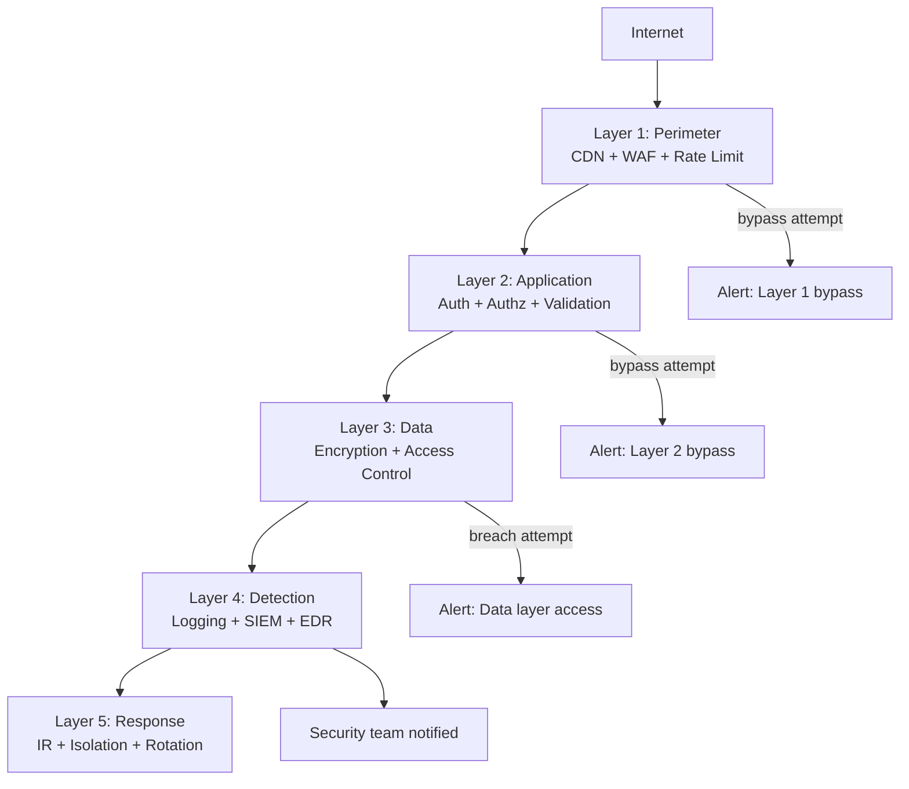

⚡ TL;DR - Defense in Depth is the security architecture
principle that multiple independent layers of security
controls should protect any sensitive asset. No single
control is assumed to be perfect. If one layer fails
(the firewall has a misconfiguration, the WAF does not
catch a novel XSS variant, the developer forgot an auth
check), another independent layer catches the attacker
(EDR detects anomalous process, SIEM alerts on unusual
data access, network segmentation prevents lateral movement).
The principle comes from military strategy (castle walls +
moat + guards + keep + treasury each independently protected).
In software: perimeter controls (firewall, WAF) + application
controls (auth, input validation) + data controls (encryption,
access control) + detection (logging, SIEM) + response
(IR playbooks, automated isolation) = multiple independent
chances to stop an attacker before they reach the objective.

---

| #007 | Category: Security | Difficulty: ★☆☆ |
|:---|:---|:---|
| **Depends on:** | Security Problem, CIA Triad, Developer Responsibility | |
| **Used by:** | STRIDE Threat Modeling, Security at Scale, Platform Security Engineering | |
| **Related:** | Security Problem, CIA Triad, Attacker Mindset, Developer Responsibility, Zero Trust | |

---

### 🔥 The Problem This Solves

**WORLD WITHOUT IT (Single-layer security):**
Organization invests heavily in a network perimeter firewall.
"We have a firewall - we're secure." A phishing email
bypasses the firewall (email is allowed through, by design).
Attacker has code execution on an internal machine.
No internal controls: no network segmentation (can reach
any system), no endpoint detection (no EDR deployed),
no access control on internal services (trust anything
inside the perimeter), no logging (no visibility).
Attacker goes from phishing email to database dump in 4 hours.
Single-layer security: when the one layer fails (and all
layers eventually fail), the attacker faces zero resistance.

**WITH DEFENSE IN DEPTH:**
Same phishing email lands. User clicks. EDR detects
PowerShell downloading a PE file (anomalous, alerting).
Even if EDR doesn't catch it: the malware cannot reach
internal services (network segmentation). Even if it
does: internal services require authentication (zero trust,
not "trust the internal network"). Even if it authenticates:
data is encrypted at rest (no plaintext to exfiltrate).
Even if it gets the data: DLP detects large data transfer
(alerting). Even if that's missed: honeytokens in the
database fire when accessed (final alarm). 6 independent
chances to detect and stop the attacker.

---

### 📘 Textbook Definition

**Defense in Depth:** A security architecture principle
where multiple, independent security controls are layered
to protect an asset. Independence is the key property:
if controls share a failure mode, they are not truly
independent (both can be bypassed with the same technique).

**The Five Layers in a Web Application Context:**

**Layer 1 - Perimeter Controls:**
Firewall (restrict inbound/outbound traffic), WAF (block
known attack patterns), DDoS protection (absorb floods),
CDN (geographic distribution, hides origin IP).
Bypass methods: phishing (bypasses firewall via email),
novel attack patterns (bypass WAF), HTTPS tunneling.

**Layer 2 - Application Controls:**
Authentication (who are you?), authorization (what can you
do?), input validation (is this input safe?), rate limiting
(prevent DoS and brute force), CSRF protection, security
headers (CSP, HSTS, X-Frame-Options).
Bypass methods: credential theft (bypasses authentication),
logic flaws (bypasses authorization checks), novel injection
patterns (bypass input validation).

**Layer 3 - Data Controls:**
Encryption at rest (database encryption, key management),
encryption in transit (TLS), data classification (know
what is sensitive), data minimization (collect only needed
data), access control on data layer (row-level security).
Bypass methods: key theft (bypasses encryption), privileged
access abuse (legitimate key access).

**Layer 4 - Detection Controls:**
Logging (structured, centralized), SIEM (anomaly detection,
correlation), EDR (endpoint behavior detection), DLP (data
loss prevention), honeypots/honeytokens (canary-style
detection triggers).
Bypass methods: log deletion (if logs not immutable), slow
exfiltration (below volume thresholds), using legitimate
channels (look like normal traffic).

**Layer 5 - Response Controls:**
IR playbooks (predefined responses), automated isolation
(quarantine compromised hosts), credential rotation
(revoke compromised credentials), forensic capability
(understand what happened).
Bypass: none - response capability does not prevent the
initial breach but limits its scope.

---

### ⏱️ Understand It in 30 Seconds

**One line:**
No single security control is perfect - Defense in Depth
layers multiple independent controls so that defeating one
still leaves multiple others to detect and stop the attacker.

**One analogy:**
> A medieval castle: outer wall (firewall), moat (network
> segmentation), portcullis (authentication), inner wall
> (data access control), keep (encryption), soldiers
> (monitoring), dungeon (honeytrap). An attacker who
> breaches the outer wall still faces the moat. One who
> swims the moat still faces the portcullis. Each layer
> is independently designed and independently maintained.
> A siege succeeds only when ALL layers fail - and each
> failure buys time for defenders to respond.

---

### 🔩 First Principles Explanation

**The mathematics of layered defense:**

```
PROBABILITY MATH: Why layers multiply security

Single layer with 90% effectiveness:
  Probability attacker succeeds = 10%

Two independent layers each 90% effective:
  Layer 1 fails: 10% of attackers pass
  Layer 2 fails: 10% of those who passed Layer 1
  Total probability: 10% × 10% = 1%

Three independent layers each 90% effective:
  Probability: 10% × 10% × 10% = 0.1%

REAL WORLD APPLICATION:
  WAF effectiveness: 85% (catches most known patterns)
  Input validation effectiveness: 80%
  SQL parameterization: 99.9% (nearly eliminates SQLi)
  
  Combined against SQL injection:
  = (1-0.85) × (1-0.80) × (1-0.999)
  = 0.15 × 0.20 × 0.001
  = 0.000030 = 0.003% probability of successful SQLi

CRITICAL ASSUMPTION: Layers must be INDEPENDENT.
  If two controls share a vulnerability, they are
  not independent and do not multiply.
  BAD: WAF + "WAF-based input validation" in app code.
    Both bypassed by the same WAF bypass technique.
  GOOD: WAF (network-level) + parameterized queries (code-level).
    Bypassing the WAF does not bypass parameterized queries.
    Two completely different failure modes.
```

---

### 🧪 Thought Experiment

**SCENARIO: Design Defense in Depth for a sensitive API endpoint**

```
ENDPOINT: POST /api/transactions (process payment)
DATA AT RISK: financial transactions, card data, user balances

LAYER 1 - PERIMETER:
  WAF rule: block known injection patterns in request body
  Rate limiter: max 10 transactions/minute per user
  DDoS protection: absorb traffic floods
  Bypass risk: WAF evasion, distributed rate limit bypass

LAYER 2 - APPLICATION:
  Authentication: JWT with short expiry (1 hour)
  Authorization: verify authenticated user == transaction owner
  Input validation: amount > 0, currency valid enum, account exists
  Idempotency: duplicate request detection (replay prevention)
  Bypass risk: stolen JWT (15 min exposure window max), logic bugs

LAYER 3 - DATA:
  Database: card data stored as tokens (PCI tokenization)
    Never raw PAN in application database
  Transaction records: immutable (append-only ledger)
  Balance: double-entry accounting (debit + credit both recorded)
  Bypass risk: application-layer access (legitimate API access)

LAYER 4 - DETECTION:
  Every transaction logged with: user_id, amount, timestamp,
    source IP, session_id
  Anomaly detection: transaction velocity > threshold → alert
  Honeytokens: fake high-value accounts - any access = immediate alert
  Bypass risk: slow velocity below threshold

LAYER 5 - RESPONSE:
  Automated: transaction > $10,000 → step-up auth (MFA required)
  Automated: unusual velocity → temporary suspend + notify user
  Manual: IR playbook for financial fraud: freeze, investigate,
    reverse fraudulent transactions, notify regulatory body

WHAT THE ATTACKER MUST DEFEAT TO STEAL $1:
  Layer 1: bypass WAF (hard) + bypass rate limiter (hard)
  Layer 2: get valid JWT (hard, 1hr expiry) + bypass authz (hard)
  Layer 3: raw card data not available (tokenized) - exfiltrate useless
  Layer 4: avoid logging anomaly (very hard for meaningful theft)
  Layer 5: defeat automated response (would freeze account)

CONCLUSION: Multiple independent controls make financial
fraud extremely difficult. An attacker who bypasses one
layer faces 4 more independent obstacles.
```

---

### 🧠 Mental Model / Analogy

> Defense in Depth is like an onion - multiple concentric
> layers, each independently capable of stopping an attack.
> But there is a better analogy: Swiss cheese.
> Each slice of Swiss cheese has holes (vulnerabilities
> in each control). Alone, an attacker can find a hole
> and pass through. Stack multiple slices: for an attacker
> to pass through all of them, the holes must align.
> The more slices (layers), and the more randomly the
> holes are positioned (independent controls with different
> failure modes), the lower the probability that all holes
> align for any attacker's path.
> This is the "Swiss Cheese Model" from aviation safety -
> applied to security, it explains why multiple
> independently-designed controls are more effective than
> one perfect control.

---

### 📶 Gradual Depth - Five Levels

**Level 1 - What it is (anyone can understand):**
Don't put all your security eggs in one basket. Use multiple
different security measures so that if one fails, the others
still protect you. A bank has a vault door AND guards AND
alarms AND cameras AND silent triggers - not just a very
strong vault door.

**Level 2 - How to use it (junior developer):**
At the application layer: use authentication (who you are)
AND authorization (what you can access) AND input validation
(is the data safe) AND output encoding (is what we display
safe). Each is independent. If the authentication is bypassed
(token theft), authorization still checks if the user is
allowed to access the specific resource.

**Level 3 - How it works (mid-level engineer):**
Map your security controls to layers: perimeter (WAF, firewall),
application (auth, authz, validation), data (encryption, access
control), detection (logging, SIEM, alerting), response
(IR playbooks, automated quarantine). Identify gaps: where
does a single control failure lead directly to a breach?
Fill gaps with additional controls in different layers.

**Level 4 - Why it was designed this way (senior/staff):**
Defense in Depth acknowledges that perfect controls are
impossible. Every control has bypass techniques. The history
of security is: control is developed, bypass is discovered,
control is updated, new bypass is found. This arms race
never ends. Defense in Depth: even if a specific bypass
is found for one control, it does not lead to a breach -
the attacker faces additional controls with different
bypass requirements. Makes the attacker's job exponentially
harder while accepting the impossibility of perfect controls.

**Level 5 - Mastery (distinguished engineer):**
Defense in Depth at platform scale requires: (1) Control
independence (shared infrastructure means shared failure
modes - if all auth goes through one identity provider,
that provider is a single point of failure), (2) Control
diversity (same vendor for WAF + EDR + SIEM means same
vendor bug affects all three), (3) Control coverage mapping
(MITRE ATT&CK coverage: which techniques does each control
detect/prevent?), (4) Blast radius minimization (when one
control fails, how much can the attacker reach?). Blast
radius reduction (network segmentation, least privilege,
data minimization) is the most undervalued layer: it limits
the damage when all other controls fail, which they
eventually will.

---

### ⚙️ How It Works (Mechanism)

**Defense in Depth architecture for a cloud-native application:**

```
INTERNET
    |
    v
┌──────────────────────────────────────────────────────────┐
│ LAYER 1: PERIMETER                                       │
│  CDN (Cloudflare/CloudFront): DDoS absorption, WAF       │
│  WAF rules: OWASP Core Ruleset, custom rules             │
│  Rate limiting: per-IP, per-user, per-endpoint           │
└──────────────────────────────────────────────────────────┘
    |
    v
┌──────────────────────────────────────────────────────────┐
│ LAYER 2: APPLICATION (API Gateway + Services)            │
│  Auth: JWT validation, token expiry, scope checking      │
│  Authz: RBAC/ABAC check on every endpoint                │
│  Input validation: schema validation on all requests     │
│  Rate limiting: per-user at app layer (independent of L1)│
│  Security headers: CSP, HSTS, X-Frame-Options            │
└──────────────────────────────────────────────────────────┘
    |
    v
┌──────────────────────────────────────────────────────────┐
│ LAYER 3: DATA                                            │
│  Database encryption: AES-256 at rest                    │
│  Row-level security: users can only query their rows     │
│  Secrets management: Vault/SSM (no credentials in code)  │
│  Data minimization: collect only required fields         │
│  Tokenization: PII/PAN replaced with tokens              │
└──────────────────────────────────────────────────────────┘
    |
    v
┌──────────────────────────────────────────────────────────┐
│ LAYER 4: DETECTION                                       │
│  Centralized logging: all requests + events to SIEM      │
│  Anomaly detection: unusual access patterns              │
│  EDR: endpoint behavior monitoring                       │
│  Honeytokens: fake credentials in logs, fake records     │
│  DLP: large data transfers flagged                       │
└──────────────────────────────────────────────────────────┘
    |
    v
┌──────────────────────────────────────────────────────────┐
│ LAYER 5: RESPONSE                                        │
│  IR playbooks: documented response procedures            │
│  Automated isolation: quarantine compromised hosts       │
│  Credential rotation: emergency rotation procedures      │
│  Forensics: log preservation, evidence collection        │
└──────────────────────────────────────────────────────────┘
```



---

### 💻 Code Example

**Demonstrating independent layers catching the same attack:**

```python
# SQL INJECTION ATTEMPT: attacker sends
# search_term = "' OR '1'='1'; DROP TABLE users; --"

# LAYER 1 - WAF (external, network-level):
# WAF detects SQL keywords in parameter: blocks request.
# (Happens before request reaches application code)

# LAYER 2A - Application input validation:
# (Independent of WAF - catches what WAF misses)
def validate_search_term(term: str) -> str:
    # Length limit: SQL injection payloads are usually long
    if len(term) > 100:
        raise ValueError("Search term too long")
    # Character allowlist for search (alphanumeric + spaces)
    if not re.match(r'^[a-zA-Z0-9\s\-]+$', term):
        raise ValueError("Invalid characters in search term")
    return term

# LAYER 2B - Parameterized query:
# (Independent of input validation - catches even if validation
#  is bypassed because parameterized queries are
#  STRUCTURALLY immune to SQL injection - the parameter
#  cannot be interpreted as SQL syntax)
def search_products(search_term: str) -> list:
    validated = validate_search_term(search_term)
    # BAD: string concatenation (NEVER do this)
    # query = f"SELECT * FROM products WHERE name LIKE '%{validated}%'"
    
    # GOOD: parameterized query (ALWAYS do this)
    # The ? placeholder is replaced with the literal value,
    # not interpreted as SQL. Even if validation is bypassed,
    # this is structurally safe.
    results = db.execute(
        "SELECT * FROM products WHERE name LIKE ?",
        [f"%{validated}%"]
    )
    return results

# LAYER 3 - Database permissions:
# (Independent of application code)
# The database user for the application has SELECT only:
# GRANT SELECT ON products TO app_user;
# Even if SQLi succeeded (bypass layers 1+2):
# Cannot DROP TABLE - no DDL permissions
# Cannot access other tables - SELECT limited to allowed tables

# LAYER 4 - Detection:
# (Independent of all prevention layers)
# Any unusual query pattern (long query, SQL keywords in values)
# logged and alerted - provides detection even if all prevention fails.
```

---

### ⚖️ Comparison Table

| Approach | When Attacker Bypasses 1 Control | Breach Probability | Cost |
|:---|:---|:---|:---|
| **Single control** | Breach occurs immediately | High (1 control = 1 failure mode) | Low initially, high per breach |
| **Defense in Depth (3 layers)** | 2 more independent controls must also fail | Probability^3 of single control | Medium (3x controls) |
| **Defense in Depth (5 layers)** | 4 more independent controls must also fail | Very low | Medium-high (5x controls) |
| **No security** | N/A (automated attack succeeds immediately) | Certain | Near-zero initially, catastrophic per breach |

---

### ⚠️ Common Misconceptions

| Misconception | Reality |
|:---|:---|
| More layers = better security regardless of independence | If all layers fail the same way, they provide no additional protection. A WAF + a second WAF is not Defense in Depth - both are bypassed by the same WAF-evasion technique. True Defense in Depth requires controls with DIFFERENT failure modes: WAF (network-level pattern match) + parameterized queries (code-level structural protection) + database permissions (data-layer access control). Each requires a completely different attack technique to bypass. |
| Defense in Depth means security is infinite layers | Practical Defense in Depth is typically 3-5 meaningful layers per attack vector. Adding a 10th layer where each layer shares similar failure modes adds almost no security but does add operational complexity (more systems to maintain, more false positives to tune, higher cognitive load for security team). Quality and independence of layers matters more than quantity. |

---

### 🚨 Failure Modes & Diagnosis

**Failure: Defense in Depth degraded over time**

**Symptom:** Security architecture diagram shows 5 layers.
Post-breach analysis: 3 of the 5 were not functioning.
WAF had not been updated in 18 months (rule set outdated).
SIEM had a broken pipeline (logs not flowing for 3 weeks).
EDR was deployed but alert thresholds were set so high it
had never fired in 6 months (misconfigured).

**Root cause:** Defense in Depth requires active maintenance.
Controls degrade, misconfigurations accumulate, thresholds
drift. A control that is deployed but not maintained is
not a functioning layer - it creates a false sense of security.

**Diagnosis commands:**
```bash
# Verify SIEM is receiving logs (check last event time per source)
# (Splunk example)
index=security sourcetype="web_access" 
| stats max(_time) as last_event by host 
| where last_event < relative_time(now(), "-1h")
| eval hours_since_event = (now() - last_event) / 3600

# Test WAF is blocking known attack patterns
# (should return 403 if WAF is functioning)
curl -s -o /dev/null -w "%{http_code}" \
  "https://api.example.com/search?q=%27%20OR%20%271%27%3D%271"
# Expected: 403 Forbidden (WAF block)
# Got: 200 OK → WAF not functioning

# Verify EDR coverage (all hosts should have agent)
# (CrowdStrike example - using Falcon API)
# Check for hosts that have not checked in recently
```

**Fix:** Defense in Depth requires operational processes:
- Monthly: verify each control is functional (automated canary tests)
- Quarterly: red team test of each layer (can we bypass WAF today?)
- Annually: full architecture review (are the layers still independent?)

---

### 🔗 Related Keywords

**Prerequisites:**
- `The Security Problem` - why defense must be layered
- `CIA Triad` - what each layer protects
- `Why Developer Security Responsibility` - application layer ownership

**Builds on this:**
- `STRIDE Threat Modeling` - identifying which layers protect which threats
- `Zero Trust Introduction` - modern Defense in Depth model
- `Platform Security Engineering` - implementing defense in depth at scale

---

### 📌 Quick Reference Card

```
┌──────────────────────────────────────────────────────────┐
│ KEY PRINCIPLE│ Multiple INDEPENDENT layers               │
│              │ Independence = different failure modes    │
├──────────────┼───────────────────────────────────────────┤
│ 5 LAYERS     │ Perimeter → Application → Data           │
│              │ → Detection → Response                   │
├──────────────┼───────────────────────────────────────────┤
│ MATH         │ 3 layers each 90% effective:              │
│              │ 0.10 × 0.10 × 0.10 = 0.1% success        │
├──────────────┼───────────────────────────────────────────┤
│ SWISS CHEESE │ Each layer has holes. Stack enough slices:│
│ MODEL        │ holes never align = attacker blocked      │
├──────────────┼───────────────────────────────────────────┤
│ ONE-LINER    │ "When one control fails (and all do),     │
│              │  make sure the next one catches it."     │
└──────────────────────────────────────────────────────────┘
```

---

### 💎 Transferable Wisdom

**Reusable Engineering Principle:**
"Independent failure modes multiply reliability." Defense
in Depth is a specific instance of a general reliability
principle: independent redundancy. In distributed systems:
a two-AZ deployment where both AZs use the same power grid
is not truly independent redundancy (they share a failure
mode). Multi-region provides true independence (different
power, network, and physical infrastructure). The same
principle for backup strategies: 3-2-1 rule (3 copies, 2
media types, 1 offsite) ensures no single failure mode
destroys all copies. Defense in Depth applies this principle
to security: controls must be truly independent to provide
multiplied protection.

---

### 💡 The Surprising Truth

Most organizations' Defense in Depth architecture looks
impressive on paper but has a hidden single point of failure:
the identity provider. If all authentication routes through
one identity provider (Okta, Azure AD, Auth0), a vulnerability
in that provider (or a compromise of its admin credentials)
bypasses every application-layer control simultaneously.
All 5 layers suddenly become 1 layer. The Okta breach of
2022 demonstrated exactly this: attackers who compromised
Okta support tooling could potentially affect all 14,000
Okta customers simultaneously - their perimeter, application,
and data controls all had one foundation. The correct Defense
in Depth response: segment the identity layer (admin systems
on a separate identity plane from user systems, privileged
access management separated from regular access), and add
compensating controls that do not rely on the identity
provider (behavioral monitoring, network segmentation,
just-in-time privileged access).

---

### ✅ Mastery Checklist

**You've mastered this when you can:**
1. **EXPLAIN** why control independence is required for
   Defense in Depth to provide multiplied protection (shared
   failure modes = same bypass technique defeats all).
2. **DESIGN** a 3-layer defense for a specific attack vector
   (e.g., SQL injection: WAF + parameterized query + DB
   read-only permissions - three independent failure modes).
3. **CALCULATE** the probability reduction when stacking
   independent controls (each 90% effective: three = 0.1%).
4. **IDENTIFY** a false Defense in Depth (two controls
   that share a failure mode) vs. true Defense in Depth.

---

### 🎯 Interview Deep-Dive

**Q: You discover that an API endpoint was accessible
without authentication for 72 hours due to a deployment
bug. What does "Defense in Depth" tell us about the blast
radius of this incident?**

*Why they ask:* Tests whether the candidate understands
Defense in Depth as a blast radius reduction strategy,
not just a prevention strategy.

*Strong answer includes:*
- Layer 1 failed: authentication control was absent (deployment bug).
- What other layers were still active?
  - Authorization: if the endpoint had row-level data controls
    (database only returns data for authenticated user_id),
    and user_id parameter was required, blast radius may be
    limited (attacker must know specific IDs).
  - Data layer: was data encrypted, tokenized, or otherwise
    protected even if accessed?
  - Detection: did SIEM alert on unusual access volume?
    Were there anomalous IP addresses accessing the endpoint
    in high volume? Logs can tell us exactly who accessed
    what during the 72 hours.
  - Response: can we identify every access during the 72h
    window from logs? Can we notify only the users whose
    data was actually accessed (not all users)?
- Defense in Depth lesson: the authentication failure was a
  real breach of Layer 2. But Layers 3, 4, and 5 still
  functioned. Layer 3 limited data exposure. Layer 4 tells
  us exactly what happened. Layer 5 enables proportionate
  notification. Compare this to zero Defense in Depth:
  authentication fails = full database dump, no visibility,
  notify everyone, regulatory maximum penalty. Defense in
  Depth converted a potential $4.45M breach into a contained,
  fully-understood, narrowly-scoped incident.