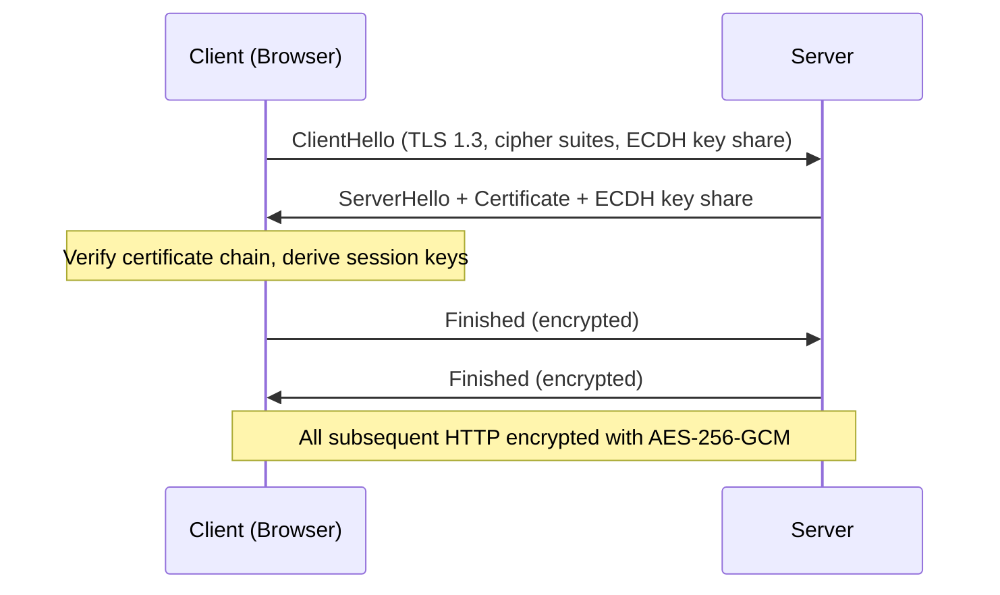

⚡ TL;DR - HTTP transmits all data in plain text. Any
network intermediary (your ISP, a coffee shop router,
a corporate firewall, a compromised network device) can
read and modify the data. HTTPS = HTTP over TLS: all data
is encrypted and authenticated. Neither intermediaries
can read it, nor can they modify it without detection.
Practical implications: without HTTPS, session cookies
are visible to network observers (session hijacking),
passwords sent on login forms are in plain text (credential
theft), page content can be modified in transit (malicious
script injection). In 2024: HTTPS is the baseline, not
an optional enhancement. Chrome marks HTTP sites as "Not
Secure." Let's Encrypt provides free TLS certificates.
There is no legitimate reason for any production web
application to serve traffic over HTTP.

---

| #014 | Category: Security | Difficulty: ★☆☆ |
|:---|:---|:---|
| **Depends on:** | Security Problem, CIA Triad, Hashing vs Encryption vs Encoding | |
| **Used by:** | TLS Basics, Cookie Security, HTTPS Local Dev | |
| **Related:** | CIA Triad, TLS Basics, Session Security, HSTS, TLS Config | |

---

### 🔥 The Problem This Solves

**WORLD WITHOUT IT (Plain HTTP):**
User opens laptop at a coffee shop WiFi. Logs into a site
over HTTP. The WiFi access point (or anyone with a laptop
and Wireshark) can capture the TCP stream. They see:
```
POST http://app.example.com/login HTTP/1.1
Host: app.example.com
Content-Type: application/x-www-form-urlencoded

username=alice@company.com&password=MyPassword123
```
Plain text. Complete. Readable. This is not theoretical:
tools like Wireshark, Ettercap, and Bettercap make passive
network sniffing accessible to anyone. Firesheep (2010)
was a Firefox extension that automated session cookie
theft on unencrypted networks - it required zero technical
knowledge and affected anyone on the same WiFi as the user.
HTTPS prevents this entire attack class.

---

### 📘 Textbook Definition

**HTTP (Hypertext Transfer Protocol):** Application-layer
protocol for web communication. Plain text. No encryption.
No integrity protection. No authentication of server identity.

**HTTPS (HTTP Secure):** HTTP transmitted over a TLS
(Transport Layer Security) connection. Provides:
- **Confidentiality:** Data encrypted, network intermediaries
  cannot read it. TLS uses symmetric encryption (AES-256-GCM)
  after initial key exchange.
- **Integrity:** Data cannot be modified in transit without
  detection. TLS MAC (Message Authentication Code) on every
  record - tampering is detected.
- **Authenticity:** Server proves its identity via a certificate
  signed by a trusted Certificate Authority (CA). Client
  verifies certificate: was it signed by a CA my browser trusts?
  Does the domain in the certificate match the URL I requested?

**What HTTPS does NOT provide:**
- Application-level security (IDOR, XSS, SQLi are not prevented)
- Protection of data at rest (encrypted in transit only)
- Protection against a compromised server
- Protection against the server itself reading your data

**TLS handshake summary (TLS 1.3):**
Client sends: supported cipher suites, key share.
Server sends: chosen cipher suite, certificate, key share.
Client verifies certificate. Both derive session keys from
key shares (ECDH). Subsequent communication encrypted with
session keys (AES-256-GCM or ChaCha20-Poly1305).

---

### ⏱️ Understand It in 30 Seconds

**One line:**
HTTP = plain text over the network (anyone between you and
the server reads everything). HTTPS = encrypted tunnel
(only you and the server can read the content, and the
server is verified via certificate).

**One analogy:**
> HTTP is writing a postcard: the postal service, every
> sorting facility, and anyone who handles it can read
> your message. HTTPS is a sealed, tamper-evident envelope:
> only the addressed recipient can open it, and any
> tampering makes the seal break. The certificate is
> like verifying that the address on the envelope matches
> the actual person's home - ensuring the envelope goes
> to the right person, not an impersonator.

---

### 🔩 First Principles Explanation

**What a network observer can do with HTTP:**

```
NETWORK OBSERVER POSITION: On the same WiFi network,
or as an ISP, or as a router in the path.

PASSIVE OBSERVATION (reading HTTP traffic):
  - See every URL requested: GET /api/user/profile?id=123
  - See all request headers: Cookie: session=abc123
  - See all request bodies: POST /login {username: alice, password: ...}
  - See all response bodies: full HTML, JSON, file downloads
  
  IMPACT:
  - Steal session cookies → session hijacking → account takeover
  - Read sensitive data in responses (medical records, financial data)
  - Map the user's activity (which pages they visited, when)

ACTIVE MODIFICATION (man-in-the-middle on HTTP):
  Observer intercepts and modifies in transit:
  - Inject JavaScript into HTML responses:
    Response body: <html>... → <html><script>evil()</script>...
    Browser executes the injected script.
  - Redirect login forms to attacker's server:
    POST /login → rewrite to → POST /attacker-server/capture
    Credentials captured, then forwarded to real server.
  - Replace file downloads with malware:
    Response: software.exe (legitimate) → replaced with malware.exe
  - Modify financial transaction data:
    Transfer $100 to account A → modified to → $100 to account B

WITH HTTPS:
  Observer can see: which IP you connected to, how much data.
  Observer cannot see: any URL paths, headers, content.
  Observer cannot modify: any data (MAC detects tampering).
  TLS 1.3 even encrypts the server certificate in the handshake
    (ECH - Encrypted Client Hello in progress): hides server name.
```

---

### 🧪 Thought Experiment

**SCENARIO: What Firesheep demonstrated in 2010**

```
CONTEXT: 2010. Major social networks (Facebook, Twitter) used HTTPS
for login ONLY. After login: session cookie used over HTTP.

FIRESHEEP (Firefox extension by Eric Butler):
  1. Plugged into WiFi packet capture APIs
  2. Passively listened to all HTTP traffic on WiFi network
  3. Extracted session cookies from HTTP requests
  4. Displayed a list of logged-in users visible on the network
  5. Click a user → use their session cookie to log into their account

REQUIRED TECHNICAL SKILL: Literally zero. Click install extension.
  Click on name in sidebar. Done. You are now that person's account.

AFFECTED: Any Facebook/Twitter user on the same WiFi (hotel, cafe, airport)
  AS LONG AS they used HTTP (which was most of their session).

IMPACT: Demonstrated that HTTP session cookies are completely
  exposed on shared networks. Major public attention.

INDUSTRY RESPONSE: Facebook and Twitter moved to HTTPS everywhere
  within 6 months of Firesheep release. The industry shift to
  "HTTPS by default" accelerated dramatically.
  Google announced HTTPS as a ranking signal in 2014.
  Chrome marked HTTP as "Not Secure" starting in 2017.
  Let's Encrypt launched in 2016: free certificates.
  In 2024: ~95% of web traffic is HTTPS (Chrome transparency report).

LESSON: Security through complexity (session tokens are random)
  is insufficient when the transport exposes them to anyone
  on the network. HTTPS is not optional for anything with
  authentication state.
```

---

### 🧠 Mental Model / Analogy

> HTTP is like sending letters on a glass conveyor belt
> through a public building. Everyone in the building can
> read every letter. They can also reach in and change
> the contents. You might not know your letter was changed.
> HTTPS is an opaque armored tube: only you and the recipient
> can see the contents, and any attempt to modify the
> contents is immediately detectable by the recipient.
> The certificate is the lock combination that only the
> true recipient possesses - ensuring the tube opens only
> at the right destination.

---

### 📶 Gradual Depth - Five Levels

**Level 1 - What it is (anyone can understand):**
HTTP sends your information in the clear - like whispering
your password in a crowded room. HTTPS encrypts everything
so only you and the website can read it. The padlock in
your browser means HTTPS is active. Never enter passwords
on sites without the padlock.

**Level 2 - How to use it (junior developer):**
All production applications must use HTTPS. Use Let's Encrypt
for free certificates. Configure HSTS header to tell browsers
to always use HTTPS. Redirect all HTTP to HTTPS. Use `Secure`
flag on all cookies (only sent over HTTPS). These four
steps are the complete HTTPS configuration baseline.

**Level 3 - How it works (mid-level engineer):**
TLS handshake establishes: (1) server identity (certificate
verification), (2) session keys (ECDH key exchange - both
parties derive the same symmetric key without transmitting
it), (3) cipher suite (algorithm agreement). After handshake:
AES-256-GCM encryption with per-record authentication tag.
Certificate chain: server cert → intermediate CA cert → root
CA (trusted by browser). Browser validates: cert not expired,
domain matches, chain leads to trusted root, cert not in
revocation list (OCSP/CRL).

**Level 4 - Why it was designed this way (senior/staff):**
The key exchange problem: how do two parties (who have never
met before) agree on a shared secret over a public channel?
This was the fundamental obstacle to secure internet communication.
Diffie-Hellman (1976) solved it: both parties exchange public
values, each computes the same shared secret, but an observer
cannot compute the secret from the public values alone.
TLS uses ECDH (Elliptic Curve Diffie-Hellman): smaller keys,
faster computation than classic DH. The certificate system
(PKI) addresses: "how do I know the server is who it claims?"
CAs vouch for server identity (similar to a notary). Browser
vendors maintain trusted CA lists. It's an imperfect system
(CAs have been compromised: DigiNotar 2011) but functional
at internet scale.

**Level 5 - Mastery (distinguished engineer):**
TLS 1.3 (2018) made significant changes from 1.2: eliminated
weak cipher suites (RC4, MD5, SHA-1, RSA key exchange),
reduced handshake from 2 round trips to 1 (0-RTT for
resumption), forward secrecy mandatory (ephemeral key exchange
means past sessions cannot be decrypted even if long-term
key is later compromised), server certificate encrypted in
handshake (privacy improvement). Migration from 1.2 to 1.3:
older server configurations (supporting 1.0/1.1/1.2 for
compatibility) are vulnerable to downgrade attacks (BEAST,
POODLE). Minimum baseline (2024): TLS 1.2 only (disable 1.0/1.1),
prefer TLS 1.3 where supported. Certificate Transparency (CT):
all public certificates must be logged in public CT logs.
Allows monitoring for unauthorized certificate issuance for
your domain.

---

### ⚙️ How It Works (Mechanism)

**TLS 1.3 Handshake (simplified):**

```
CLIENT                          SERVER
  |                                |
  |--- ClientHello --------------->|
  |    TLS 1.3                     |
  |    Cipher suites: AES-256-GCM, |
  |    ChaCha20-Poly1305           |
  |    Key share: ECDH public key  |
  |                                |
  |<-- ServerHello ----------------|
  |    Chosen cipher: AES-256-GCM  |
  |    Key share: ECDH public key  |
  |    Certificate (encrypted)     |
  |    Server signature            |
  |                                |
  |    CLIENT DERIVES SESSION KEYS  |
  |    (from ClientHello + ServerHello)
  |    ECDH: both sides compute    |
  |    same shared secret          |
  |                                |
  |<-- {Encrypted: Certificate}---|
  |<-- {Encrypted: Finished} ------|
  |                                |
  | CLIENT VERIFIES:               |
  |   - cert chain trusted         |
  |   - domain matches cert        |
  |   - cert not expired           |
  |   - cert in CT logs            |
  |                                |
  |--- {Encrypted: Finished} ----->|
  |                                |
  |=== ENCRYPTED APPLICATION DATA =|
  | All HTTP content now encrypted |
  | with AES-256-GCM               |
  | Each record has auth tag       |
  | (tamper detection)             |

Total: 1 round trip (TLS 1.2 required 2 round trips)
```



---

### 💻 Code Example

**HTTPS configuration for a production web server:**

```nginx
# Nginx HTTPS configuration (best practices 2024)

server {
    listen 443 ssl http2;
    server_name api.example.com;

    # Certificate files (Let's Encrypt or commercial CA)
    ssl_certificate /etc/letsencrypt/live/api.example.com/fullchain.pem;
    ssl_certificate_key /etc/letsencrypt/live/api.example.com/privkey.pem;

    # TLS versions: Only 1.2 and 1.3 (disable 1.0 and 1.1)
    ssl_protocols TLSv1.2 TLSv1.3;

    # Cipher suites: Strong only (no RC4, DES, MD5)
    ssl_ciphers 'ECDHE-ECDSA-AES128-GCM-SHA256:ECDHE-RSA-AES128-GCM-SHA256:ECDHE-ECDSA-AES256-GCM-SHA384:ECDHE-RSA-AES256-GCM-SHA384:ECDHE-ECDSA-CHACHA20-POLY1305:ECDHE-RSA-CHACHA20-POLY1305:DHE-RSA-AES128-GCM-SHA256';
    ssl_prefer_server_ciphers off;  # Let client pick from strong list

    # Session caching: improve performance
    ssl_session_cache shared:SSL:10m;
    ssl_session_timeout 1d;
    ssl_session_tickets off;  # Disable for perfect forward secrecy

    # OCSP Stapling: cache cert validity, faster verification
    ssl_stapling on;
    ssl_stapling_verify on;

    # Security headers (defense-in-depth)
    add_header Strict-Transport-Security
        "max-age=63072000; includeSubDomains; preload" always;
    add_header X-Frame-Options DENY;
    add_header X-Content-Type-Options nosniff;
    add_header Referrer-Policy "strict-origin-when-cross-origin";

    location / {
        proxy_pass http://backend:8080;
    }
}

# HTTP → HTTPS redirect (all HTTP requests)
server {
    listen 80;
    server_name api.example.com;
    return 301 https://$host$request_uri;
}
```

```python
# Python: Enforce HTTPS-only cookies + HSTS in Flask
from flask import Flask

app = Flask(__name__)
app.config.update(
    SESSION_COOKIE_SECURE=True,     # Cookies only over HTTPS
    SESSION_COOKIE_HTTPONLY=True,   # Cookies not accessible to JS
    SESSION_COOKIE_SAMESITE='Lax',  # CSRF mitigation
    PREFERRED_URL_SCHEME='https'    # url_for() generates https:// URLs
)

@app.after_request
def add_security_headers(response):
    # HSTS: Tell browser to only use HTTPS for 2 years
    response.headers['Strict-Transport-Security'] = (
        'max-age=63072000; includeSubDomains; preload'
    )
    return response
```

---

### ⚖️ Comparison Table

| Property | HTTP | HTTPS |
|:---|:---|:---|
| **Confidentiality** | None (plain text to everyone on network) | Yes (AES-256-GCM encryption) |
| **Integrity** | None (can be modified in transit) | Yes (GCM authentication tag detects tampering) |
| **Server authenticity** | None (any server can impersonate) | Yes (certificate + CA chain verification) |
| **Cookie security** | Exposed to network observers | Protected (only Secure-flagged cookies over HTTPS) |
| **SEO impact** | Google ranks lower | Google ranks higher |
| **Browser indicator** | "Not Secure" warning | Padlock (no warning) |
| **Performance** | Slightly faster (no handshake) | Negligible difference (ECDH handshake <1ms, AES hardware acceleration) |

---

### ⚠️ Common Misconceptions

| Misconception | Reality |
|:---|:---|
| HTTPS means the site is safe to use | HTTPS means the connection is encrypted and the server's identity was verified by a CA. It says NOTHING about whether the site itself is malicious. Phishing sites use HTTPS (Let's Encrypt issues free certs to anyone, including phishing sites). The padlock means "this communication is private" - not "this site is trustworthy." Attackers routinely use HTTPS for their phishing sites to display the padlock and increase victim trust. |
| Our internal API doesn't need HTTPS because it's inside the firewall | Internal networks are not inherently trusted. Lateral movement (attacker on internal network), compromised internal hosts, malicious insiders, and insider-threat scenarios all involve attackers on the internal network. Without HTTPS on internal services: any compromised internal host can eavesdrop on all internal API traffic. Zero trust architecture specifically rejects "inside the firewall = trusted." Every service-to-service communication should use TLS, even internally. |

---

### 🚨 Failure Modes & Diagnosis

**Failure: Mixed content (HTTPS page loading HTTP resources)**

**Symptom:** Browser console warning:
`Mixed Content: The page at 'https://...' was loaded over HTTPS,
but requested an insecure resource 'http://...'. This request
has been blocked; the content must be served over HTTPS.`

**Root cause:** The HTTPS page references an HTTP URL for a
resource (image, script, CSS, API call). Browser blocks it
(active mixed content: scripts, iframes) or warns (passive:
images).

**Diagnosis and fix:**
```bash
# Find mixed content URLs in HTML/CSS/JS
grep -rn "http://" ./public/ ./templates/ ./src/
# Exclude: http://localhost, intentional example URLs

# Fix: Change to https:// or protocol-relative //
# HTTP: 
# Fixed: 
# Or:      (inherits scheme)

# HSTS prevents future regression:
# Once HSTS is set, browser only uses HTTPS for all requests to the domain
# Mixed content becomes impossible for resources on the same domain
```

**Failure: Expired certificate**

```bash
# Check certificate expiry
echo | openssl s_client -servername api.example.com \
  -connect api.example.com:443 2>/dev/null \
  | openssl x509 -noout -dates
# notBefore=Jan 1 00:00:00 2024 GMT
# notAfter=Apr 1 00:00:00 2024 GMT ← expired!

# Automate certificate renewal (Let's Encrypt with certbot):
# Add to cron: 0 3 * * * certbot renew --quiet
# Or use ACME clients that auto-renew (Caddy, Traefik)
```

---

### 🔗 Related Keywords

**Prerequisites:**
- `CIA Triad` - what HTTPS provides (C, I, Authenticity)
- `Hashing vs Encryption vs Encoding` - AES-256-GCM

**Builds on this:**
- `TLS Basics` - TLS protocol deep dive
- `TLS Configuration Best Practices` - cipher suites, versions
- `HSTS` - browser-level enforcement of HTTPS
- `Certificate Transparency Logs` - CA oversight

---

### 📌 Quick Reference Card

```
┌──────────────────────────────────────────────────────────┐
│ HTTP         │ Plain text. Readable by any network hop.  │
│ HTTPS        │ Encrypted (AES-256-GCM). Authenticated.   │
│              │ Tamper-detected. Server verified.         │
├──────────────┼───────────────────────────────────────────┤
│ SETUP        │ TLS cert: Let's Encrypt (free, auto-renew)│
│              │ Redirect HTTP → HTTPS (301)               │
│              │ HSTS header (tell browser HTTPS-only)     │
│              │ Secure flag on all cookies                │
├──────────────┼───────────────────────────────────────────┤
│ TLS 1.3      │ 1 RTT handshake, mandatory forward secrecy│
│              │ Stronger cipher suites only               │
├──────────────┼───────────────────────────────────────────┤
│ ONE-LINER    │ "HTTP = postcard. HTTPS = sealed armored  │
│              │  envelope with authenticated recipient.   │
│              │  All production traffic needs HTTPS."     │
└──────────────────────────────────────────────────────────┘
```

---

### 💎 Transferable Wisdom

**Reusable Engineering Principle:**
"Encrypt in transit everywhere, not just for sensitive operations."
A common mistake: HTTPS only on login/payment, HTTP elsewhere.
The problem: HTTP pages reveal session cookies (used to
authenticate to HTTPS endpoints). Full-session HTTPS (HTTP
Strict Transport Security) is required - any HTTP exposure
undermines HTTPS security for authenticated operations.
The same principle: end-to-end encryption in messaging apps
(Signal, WhatsApp) covers all messages, not just "sensitive"
ones. Selective encryption is often defeated by the unencrypted
portions leaking context or authentication material.

---

### 💡 The Surprising Truth

The padlock icon in browsers was introduced to indicate HTTPS
and was intended to signal "safe connection." It backfired.
Studies consistently show users interpret the padlock as
"safe website" not "encrypted connection." Phishing sites
with HTTPS and padlock icons have significantly higher
victim success rates because victims see the padlock and
lower their guard. Google Chrome (2023) removed the padlock
icon as the HTTPS indicator, replacing it with a generic
"connection info" icon, precisely because the padlock was
misleading users into trusting phishing sites. The lesson:
security indicators that are misinterpreted by users can
reduce security by creating false confidence. Effective
security UX requires precise communication about what
a security indicator actually means.

---

### ✅ Mastery Checklist

**You've mastered this when you can:**
1. **EXPLAIN** what an attacker can see and do with HTTP
   traffic (read cookies, read credentials, inject scripts).
2. **DESCRIBE** what HTTPS provides: confidentiality (encryption),
   integrity (authentication tag), authenticity (certificate).
3. **CONFIGURE** basic HTTPS: certificate, HTTP redirect,
   HSTS header, Secure cookie flag.
4. **EXPLAIN** why HTTPS padlock ≠ safe website (encrypted
   connection to potentially malicious server).

---

### 🎯 Interview Deep-Dive

**Q: What does HTTPS actually protect against, and what
are its limitations?**

*Why they ask:* Tests nuanced security knowledge. Candidates
who say "HTTPS means secure" need depth training.

*Strong answer includes:*
- Protects: eavesdropping on network (confidentiality),
  modification in transit (integrity), impersonating the
  server (server authenticity via certificate).
- Specific protection: session cookie theft on WiFi, credential
  interception, content injection (MITM).
- Does NOT protect: server vulnerabilities (SQLi, XSS exist
  behind HTTPS), data at rest (stored in DB unencrypted),
  compromised server (HTTPS to a hacked server = hacker
  reads everything), malicious server (phishing site with HTTPS).
- Practical: HTTPS without HSTS can be downgraded to HTTP
  on first visit (HSTS preload prevents this). Certificate
  pinning adds server authenticity enforcement in mobile apps.
- Forward secrecy: TLS 1.3 with ECDHE means past sessions
  cannot be decrypted if long-term private key is later stolen.
  TLS 1.2 without ECDHE: past sessions could be decrypted
  retroactively (nation-state capture-now-decrypt-later).
