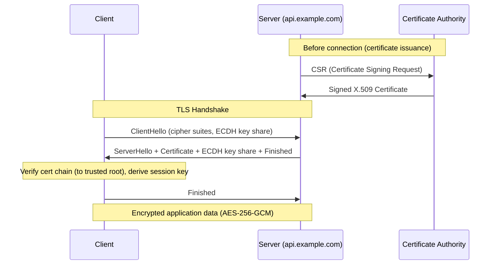

⚡ TL;DR - TLS (Transport Layer Security) is the cryptographic
protocol that provides HTTPS. It solves three problems: (1)
encryption (no eavesdropping), (2) integrity (no tampering),
(3) server authentication (no impersonation). The TLS
handshake establishes a shared session key using asymmetric
cryptography (ECDH key exchange), then encrypts the actual
application data with fast symmetric encryption (AES-256-GCM).
The server presents an X.509 certificate signed by a trusted
Certificate Authority (CA) to prove its identity. Key concepts:
Certificate chain (leaf → intermediate CA → root CA), forward
secrecy (ephemeral ECDH keys mean past sessions stay private
even if long-term key is compromised), TLS 1.3 (one round
trip handshake, mandatory forward secrecy, eliminated weak
cipher suites). TLS 1.0 and 1.1 are deprecated (insecure).
TLS 1.2 is current minimum. TLS 1.3 is the standard.

---

| #015 | Category: Security | Difficulty: ★★☆ |
|:---|:---|:---|
| **Depends on:** | Security Problem, Hashing vs Encryption vs Encoding, HTTP vs HTTPS | |
| **Used by:** | TLS Config Best Practices, Certificate Pinning, TLS Protocol Attacks | |
| **Related:** | HTTP vs HTTPS, TLS Config, TLS Protocol Attacks, Certificate Transparency | |

---

### 🔥 The Problem This Solves

**PROBLEM 1: Key exchange over an untrusted channel**
If Alice and Bob want to communicate securely, they need to
agree on an encryption key. But they're communicating over
a network that Eve can observe. How do they agree on a key
without Eve learning it?

**PROBLEM 2: Server identity verification**
You connect to bank.com. How do you know you're actually
talking to bank.com and not to an attacker who intercepted
your connection? The IP address alone proves nothing - DNS
can be poisoned, network traffic can be redirected.

**PROBLEM 3: Performance**
Asymmetric cryptography (RSA, ECDH) is 1000x slower than
symmetric cryptography (AES). You cannot use asymmetric
encryption for bulk data. How do you get the security
properties of asymmetric cryptography with the speed of
symmetric?

TLS solves all three: asymmetric for key exchange and
authentication (handshake), symmetric for bulk data encryption
(record protocol), certificates for identity verification.

---

### 📘 Textbook Definition

**TLS (Transport Layer Security):** A cryptographic protocol
that provides secure communication over a computer network.
Successor to SSL (Secure Sockets Layer - deprecated).

**Current versions:**
- TLS 1.0 (1999): deprecated by RFC 8996. Vulnerable to BEAST, POODLE.
- TLS 1.1 (2006): deprecated by RFC 8996. Vulnerable to BEAST.
- TLS 1.2 (2008): current minimum requirement. Secure with correct config.
- TLS 1.3 (2018): recommended. Significant security and performance improvements.

**Core components:**

**Handshake Protocol:** Establishes the session. Negotiates
protocol version, cipher suite, authenticates the server
(and optionally client), performs key exchange.

**Record Protocol:** Transmits application data. Divides
data into records, encrypts with session key, adds authentication
tag (AEAD - Authenticated Encryption with Associated Data).

**X.509 Certificate:** Binds a public key to an identity.
Fields: subject (domain name), issuer (Certificate Authority),
public key, validity period, digital signature (CA's signature
over the certificate data). Chain: leaf cert → intermediate
CA cert → root CA (trusted by browser/OS).

**Forward Secrecy:** Property where session keys are not
derivable from the long-term private key. ECDHE (Ephemeral
Elliptic Curve Diffie-Hellman): generates new key pair for
each session. If the server's long-term private key is
later stolen: past recorded sessions remain private.

---

### ⏱️ Understand It in 30 Seconds

**One line:**
TLS secures the connection: handshake proves the server is
who it claims (certificate), establishes a secret key
(ECDH), then encrypts all subsequent communication (AES)
so only the intended parties can read it.

**One analogy:**
> TLS handshake = two people meeting at a coffee shop.
> First: each shows verified photo ID (certificate).
> Then: they whisper a shared secret code to each other
> such that even someone recording the conversation from
> far away cannot deduce the code (Diffie-Hellman math).
> Then: all future communication uses that code to pass
> encrypted notes (symmetric encryption).
> The "CA" is like a government that issued the ID cards -
> you trust the ID because you trust who issued it.

---

### 🔩 First Principles Explanation

**Diffie-Hellman key exchange - the fundamental idea:**

```
THE PROBLEM: Alice and Bob want a shared secret.
Eve is watching all communication.

ANALOGY: Mixing paint colors.
  Alice publicly announces: "Let's use yellow paint as base."
  Alice mixes: yellow + her secret blue = green. Sends green.
  Bob mixes: yellow + his secret red = orange. Sends orange.
  
  Alice mixes: orange (from Bob) + her secret blue = brown
  Bob mixes: green (from Alice) + his secret red = brown
  
  Both have the same brown (shared secret).
  Eve only saw: yellow (base), green, orange.
  Eve cannot derive brown without knowing either secret color.

MATH (Diffie-Hellman):
  Public: prime p, generator g
  Alice: private a, public: g^a mod p
  Bob: private b, public: g^b mod p
  
  Shared secret: 
    Alice: (g^b)^a mod p = g^(ab) mod p
    Bob:   (g^a)^b mod p = g^(ab) mod p
  
  Eve sees g^a mod p and g^b mod p.
  Computing g^(ab) from these = discrete log problem.
  With large enough primes: computationally infeasible.

ECDH (Elliptic Curve Diffie-Hellman):
  Same principle on elliptic curves.
  Smaller key sizes, faster computation, same security.
  P-256, X25519 are standard curves used in TLS 1.3.

EPHEMERAL (ECDHE):
  New key pair generated for EACH TLS session.
  After session: ephemeral private key discarded.
  Even if server's long-term key is later stolen:
    attacker cannot decrypt past sessions (no ephemeral key).
  This is FORWARD SECRECY.
```

---

### 🧪 Thought Experiment

**SCENARIO: TLS 1.2 vs TLS 1.3 security comparison**

```
SCENARIO: Attacker records TLS sessions.
  Two years later: attacker steals server's private key.
  Can they decrypt the recorded sessions?

TLS 1.2 WITHOUT FORWARD SECRECY (RSA key exchange):
  Handshake: client generates session key, encrypts with
    server's RSA public key, sends to server.
  Server: decrypts with private key, gets session key.
  Both use session key for AES encryption.
  
  Attacker has recorded: encrypted session key + encrypted data.
  Attacker now has private key.
  CAN DECRYPT: encrypted session key → session key → all data.
  Past sessions are retroactively decryptable. NOT forward secret.

TLS 1.2 WITH FORWARD SECRECY (DHE or ECDHE key exchange):
  Handshake: ephemeral key pair generated.
  Session key derived from ephemeral keys.
  After session: ephemeral private key deleted.
  
  Attacker has recorded: ephemeral public keys + encrypted data.
  Attacker now has long-term private key.
  CANNOT DECRYPT: ephemeral private key is gone.
  Forward secrecy: past sessions protected.

TLS 1.3 (ECDHE MANDATORY):
  Forward secrecy is not optional - no cipher suite without ECDHE.
  Every TLS 1.3 session has forward secrecy by design.

PRACTICAL IMPLICATION: "Record now, decrypt later" attacks.
  Nation-state adversaries record TLS sessions today,
  hoping to decrypt them when:
  (a) they obtain the server's private key
  (b) quantum computers can break current encryption
  Forward secrecy defeats (a). Post-quantum TLS addresses (b).
  NIST standardized post-quantum key exchange algorithms in 2024.
```

---

### 🧠 Mental Model / Analogy

> The TLS certificate chain is like a chain of notarized
> references. Your friend (website) shows you a letter:
> "I vouch for this person - signed: Regional Notary."
> You don't know the Regional Notary personally. But the
> Regional Notary's letter says: "I'm authorized to vouch -
> signed: National Notary Authority." You DO have a list of
> trusted National Notary Authorities (browser's trust store).
> You trust the chain: National Authority → Regional Notary →
> Website. If any link in the chain is invalid: you reject
> the whole thing. This is certificate chain validation.
> Forward secrecy is like ensuring the safe combination
> used in a conversation is destroyed after the meeting -
> even if someone later breaks into the building and finds
> the master key, they can't recover what was discussed.

---

### 📶 Gradual Depth - Five Levels

**Level 1 - What it is (anyone can understand):**
TLS is the lock on the padlock icon in your browser.
It creates an encrypted tunnel between your computer and
the website, so no one in the middle can read your
passwords or credit card numbers. The certificate is the
website's ID card, checked by your browser to make sure
you're talking to the real website, not an imposter.

**Level 2 - How to use it (junior developer):**
Obtain a TLS certificate (Let's Encrypt, free and automatic).
Configure your web server to use TLS 1.2 minimum and TLS 1.3
preferably. Disable TLS 1.0 and 1.1. Use HTTPS for all
communication, including backend service-to-service calls.
Check your TLS configuration with SSLLabs server test
(ssllabs.com/ssltest/).

**Level 3 - How it works (mid-level engineer):**
TLS handshake (TLS 1.3): (1) Client sends ClientHello
(supported cipher suites, ECDH key share). (2) Server sends
ServerHello (chosen cipher, ECDH key share, certificate).
(3) Both derive same session key via ECDH. (4) Server sends
Finished (MAC over handshake transcript). (5) Client verifies,
sends Finished. Application data encrypted with AES-256-GCM.
Certificate: leaf cert signed by intermediate CA, intermediate
signed by root CA. Browser has root CA list (built-in trust
store). Chain validation: each cert's issuer matches next
cert's subject, signature verifiable, dates valid.

**Level 4 - Why it was designed this way (senior/staff):**
TLS 1.3 removed everything that TLS 1.2 had that caused
vulnerabilities: static RSA key exchange (no forward secrecy,
vulnerable if server key compromised), RC4 cipher (statistical
attacks), MD5/SHA-1 in cipher suites (collision vulnerabilities),
EXPORT cipher suites (legacy, used in FREAK/Logjam attacks),
renegotiation (triple handshake attack), compression (CRIME
attack). TLS 1.3 is essentially a clean-room redesign of the
TLS 1.2 handshake, keeping only the secure components and
using cleaner APIs. The result: fewer code paths = fewer
vulnerabilities. This is the "complexity is the enemy of
security" principle in practice.

**Level 5 - Mastery (distinguished engineer):**
TLS deployment at scale introduces operational challenges:
certificate lifecycle management (expiry monitoring, auto-renewal
via ACME protocol, Certificate Transparency logging), private
key protection (HSM for key storage, key rotation procedures),
TLS termination architecture (where does TLS terminate - at
load balancer, service mesh sidecar, or at application?),
mTLS (mutual TLS - both client and server present certificates)
for service-to-service authentication in zero-trust architectures.
Certificate Transparency (CT): all publicly trusted certificates
must be logged in public CT logs. Allows monitoring for
unauthorized issuance (e.g., your competitor obtaining a
certificate for your domain). Tools: crt.sh for cert monitoring,
Facebook Certificate Transparency monitoring service, Certspotter.

---

### ⚙️ How It Works (Mechanism)

**TLS 1.3 Handshake and Certificate Chain:**

```
TLS 1.3 HANDSHAKE:

ClientHello:
  - TLS version: 1.3
  - Random 32 bytes
  - Cipher suites: TLS_AES_256_GCM_SHA384, TLS_CHACHA20_POLY1305
  - Key share: ECDH public key (curve: X25519 or P-256)

ServerHello:
  - Selected cipher: TLS_AES_256_GCM_SHA384
  - Key share: Server ECDH public key (ephemeral, generated per session)
  
  ← KEY DERIVATION (both sides, from key shares):
    shared_secret = ECDH(client_private, server_public)
                  = ECDH(server_private, client_public)  [same result]
    handshake_keys derived from shared_secret + nonces
    application_keys derived from handshake_keys

  Certificate: (encrypted with handshake key)
    Subject: CN=api.example.com
    Issuer: CN=R3 (Let's Encrypt intermediate CA)
    Public Key: EC secp256r1 (long-term server key)
    Signed by: R3's private key
    
  Intermediate CA cert: (also sent)
    Subject: CN=R3
    Issuer: CN=ISRG Root X1 (Let's Encrypt root CA)
    Signed by: ISRG Root X1's private key

  CertificateVerify: server signs transcript with LONG-TERM key
    → proves server has the private key matching the certificate
  
  Finished: HMAC over entire handshake transcript
    → integrity of handshake

CLIENT CERTIFICATE VALIDATION:
  1. Chain leads to a trusted root CA? (browser trust store)
  2. Each cert's signature valid? (crypto verification)
  3. Subject of leaf cert matches requested domain?
  4. All certs in validity period (notBefore / notAfter)?
  5. Cert not revoked? (OCSP stapling or CRL)
  6. Certificate Transparency: cert logged in public CT log?

APPLICATION DATA PHASE:
  All HTTP data encrypted with AES-256-GCM (application key)
  Each record: encrypted data + 16-byte authentication tag
  Tag: any modification detectable with near-certainty
```



---

### 💻 Code Example

**Certificate chain inspection and TLS connection verification:**

```bash
# Inspect a site's TLS certificate and chain
echo | openssl s_client -connect api.example.com:443 \
  -servername api.example.com 2>/dev/null \
  | openssl x509 -noout -text

# Output includes:
# Subject: CN=api.example.com
# Issuer: CN=R3, O=Let's Encrypt
# Validity: Not Before / Not After
# Public Key: EC Public Key (256 bit)
# Signature Algorithm: sha256WithRSAEncryption

# Check full chain
echo | openssl s_client -connect api.example.com:443 \
  -servername api.example.com -showcerts 2>/dev/null \
  | grep -E "subject=|issuer="
# subject=CN=api.example.com
# issuer=CN=R3
# subject=CN=R3
# issuer=CN=ISRG Root X1
# subject=CN=ISRG Root X1  ← root (trusted by browser)

# Check TLS version and cipher suite
openssl s_client -connect api.example.com:443 \
  -tls1_3 2>/dev/null | grep -E "Protocol:|Cipher:"
# Protocol: TLSv1.3
# Cipher: TLS_AES_256_GCM_SHA384
```

```python
# Python: Make HTTPS connection with cert verification
import ssl
import urllib.request

# BAD: Disabling SSL verification (never in production)
ctx = ssl.create_default_context()
ctx.check_hostname = False      # BAD: no hostname check
ctx.verify_mode = ssl.CERT_NONE  # BAD: no cert verification
# This completely defeats TLS authentication
# Man-in-the-middle can now intercept the "encrypted" connection

# GOOD: Default SSL context (verifies cert, hostname)
# urllib.request.urlopen uses verification by default
response = urllib.request.urlopen('https://api.example.com/data')
# SSL errors if: expired cert, wrong domain, untrusted CA, etc.

# GOOD: Verify specific CA (internal services with self-signed certs)
import ssl
import httpx  # Modern Python HTTP client

ctx = ssl.create_default_context(cafile='/etc/ssl/certs/internal-ca.pem')
client = httpx.Client(ssl_context=ctx)
response = client.get('https://internal-service.company.internal/api')
# Only accepts certs signed by internal-ca.pem
# (Useful for mTLS in microservices)
```

---

### ⚖️ Comparison Table

| Property | TLS 1.2 | TLS 1.3 |
|:---|:---|:---|
| **Handshake round trips** | 2 RTT | 1 RTT (0-RTT for resumption) |
| **Forward secrecy** | Optional (depends on cipher suite) | Mandatory (ECDHE required) |
| **Cipher suites** | Many (including weak ones) | Only 5 strong suites |
| **RSA key exchange** | Supported (no forward secrecy) | Removed |
| **RC4, 3DES, MD5** | Available (if not disabled) | Removed |
| **Server cert in handshake** | Plaintext | Encrypted |
| **Deprecated** | No (still minimum baseline) | No (recommended) |

---

### ⚠️ Common Misconceptions

| Misconception | Reality |
|:---|:---|
| SSL and TLS are the same thing | SSL (SSLv2, SSLv3) is the predecessor to TLS. SSLv3 was deprecated by RFC 7568 (2015) due to the POODLE vulnerability. TLS 1.0, 1.1 are deprecated. TLS 1.2 and 1.3 are current. The term "SSL certificate" is commonly used to mean "TLS certificate" - it's just an X.509 certificate used with TLS. When people say "SSL," they almost always mean "TLS." The naming confusion persists because the industry moved from SSL to TLS gradually and kept the term "SSL" in product names and documentation. |
| Disabling SSL verification in development is fine | Disabling certificate verification (`verify=False`, `-k` in curl) in development trains developers to ignore SSL errors. When they accidentally push code with verification disabled to production: complete elimination of TLS security. SSL errors in development should be fixed correctly: add the CA cert to the trust store, use a self-signed cert for localhost, or use a tool like mkcert. Disabling verification should NEVER be in production code. It should trigger a build warning in CI. |

---

### 🚨 Failure Modes & Diagnosis

**Debugging TLS handshake failures:**

```bash
# TLS handshake failure: 
# "SSL: CERTIFICATE_VERIFY_FAILED" or "certificate verify error"

# Check 1: Is the cert expired?
echo | openssl s_client -connect host:443 2>/dev/null \
  | openssl x509 -noout -dates

# Check 2: Does the cert domain match the hostname?
echo | openssl s_client -connect host:443 \
  -servername host 2>/dev/null \
  | openssl x509 -noout -subject -ext subjectAltName

# Check 3: Is the chain complete?
# Servers must send both leaf cert AND intermediate CA certs
# Common mistake: server configured with leaf cert only
# Clients without intermediate cert cached: cannot verify chain
# Fix: configure server to send fullchain.pem (leaf + intermediate)
echo | openssl s_client -connect host:443 -showcerts 2>/dev/null \
  | grep -c "BEGIN CERTIFICATE"
# Should be 2+ (leaf + intermediate)
# If 1: chain is incomplete

# Check 4: Is TLS version / cipher negotiated?
openssl s_client -connect host:443 -tls1_3 2>&1 \
  | grep -E "Cipher|Protocol|handshake"
# "no protocols available": server doesn't support TLS 1.3
# "handshake failure": cipher suite mismatch

# Check 5: OCSP stapling status
echo | openssl s_client -connect host:443 -status 2>/dev/null \
  | grep -A 10 "OCSP"
# "OCSP Response Status: successful" = cert not revoked
# "No OCSP response sent": stapling not configured
```

---

### 🔗 Related Keywords

**Prerequisites:**
- `HTTP vs HTTPS` - what TLS enables
- `Hashing vs Encryption vs Encoding` - AES, ECDH concepts

**Builds on this:**
- `TLS Configuration Best Practices` - cipher suites, versions
- `Certificate Transparency Logs` - CT monitoring
- `TLS Protocol Attacks` - BEAST, POODLE, FREAK, Logjam
- `Certificate Pinning` - additional server verification
- `mTLS` - mutual authentication

---

### 📌 Quick Reference Card

```
┌──────────────────────────────────────────────────────────┐
│ HANDSHAKE    │ ECDH key exchange (forward secrecy),      │
│              │ certificate authentication, cipher negot. │
├──────────────┼───────────────────────────────────────────┤
│ RECORD       │ AES-256-GCM encrypts all application data │
│ PROTOCOL     │ 16-byte auth tag detects any tampering    │
├──────────────┼───────────────────────────────────────────┤
│ CERT CHAIN   │ Leaf cert → Intermediate CA → Root CA     │
│              │ Root CA trusted by browser/OS trust store │
├──────────────┼───────────────────────────────────────────┤
│ VERSIONS     │ 1.3 recommended, 1.2 minimum, 1.0/1.1    │
│              │ deprecated (disable them)                 │
├──────────────┼───────────────────────────────────────────┤
│ FORWARD SEC. │ Ephemeral ECDH: past sessions private     │
│              │ even if long-term key later stolen        │
├──────────────┼───────────────────────────────────────────┤
│ DEBUG TOOL   │ openssl s_client -connect host:443        │
│              │ ssllabs.com/ssltest for full analysis     │
└──────────────────────────────────────────────────────────┘
```

---

### 💎 Transferable Wisdom

**Reusable Engineering Principle:**
"Use asymmetric cryptography to establish trust, symmetric
for bulk data." This hybrid approach appears everywhere:
TLS (ECDH to agree on AES key), PGP/GPG (RSA-encrypted AES
session key for email), SSH (ECDH key exchange, then AES),
Signal Protocol (X3DH triple Diffie-Hellman for key
agreement, then AES-GCM for messages). Asymmetric cryptography
is mathematically elegant but slow. Symmetric is fast but
requires a pre-shared key. Combining them gives the security
properties of asymmetric with the performance of symmetric.
Understanding this pattern unlocks understanding every
modern secure communication protocol.

---

### 💡 The Surprising Truth

The TLS handshake authenticates the SERVER to the client -
but by default does NOT authenticate the CLIENT to the server.
The server has no idea who the client is during TLS setup.
Client identity (authentication) happens at the application
layer: username/password, JWT, session cookies. Mutual TLS
(mTLS) adds client-side certificates: the client also presents
a certificate, which the server validates. mTLS is the basis
for zero-trust service-to-service authentication in Kubernetes
and service meshes (Istio, Linkerd automatically issue and
rotate mTLS certs for every pod). The mental model: TLS says
"you're talking to the real bank.com" - it does not say
"you're allowed to access this bank.com account." That's
authorization, which happens after TLS is established.

---

### ✅ Mastery Checklist

**You've mastered this when you can:**
1. **EXPLAIN** TLS handshake in plain language: ECDH key exchange,
   certificate verification, symmetric encryption for data.
2. **EXPLAIN** forward secrecy: why ephemeral key exchange means
   past sessions are protected even if long-term key is stolen.
3. **DIAGNOSE** common TLS failures with openssl s_client commands.
4. **COMPARE** TLS 1.2 vs TLS 1.3 and explain why 1.3 is better.

---

### 🎯 Interview Deep-Dive

**Q: Can you explain what happens during a TLS handshake?**

*Why they ask:* Senior engineers building secure APIs or
microservices must understand TLS beyond "it encrypts stuff."
Certificate validation, cipher selection, and forward secrecy
all have operational implications.

*Strong answer includes:*
- TLS 1.3 outline: ClientHello with ECDH key share → ServerHello
  with certificate + ECDH key share → both derive session key
  (ECDH, same math both sides) → encrypted application data.
- Certificate chain: leaf cert → intermediate CA → root CA.
  Client verifies: chain to trusted root, domain matches,
  dates valid, not revoked.
- Forward secrecy: ephemeral ECDH keys, discarded after session.
  Past sessions private even if long-term key compromised.
  Why TLS 1.3 mandates it.
- Cipher suite: TLS_AES_256_GCM_SHA384 means AES-256-GCM
  for encryption + SHA-384 for HKDF key derivation. GCM =
  authenticated encryption (encryption + integrity in one).
- Operational: what breaks when cert expires (all clients
  refuse connection), why incomplete cert chain fails
  on some clients, OCSP stapling for performance.
