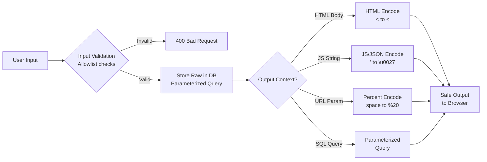

⚡ TL;DR - Input validation and output encoding are
complementary defenses against injection attacks - they
work at different stages of the pipeline and prevent
different things.

**Input validation:** Check that data conforms to expected
type, format, range, length BEFORE processing. Rejects
malformed data early. Cannot alone prevent injection
(attackers find bypasses for blacklists). Use allowlists
(positive security model): "only accept digits" vs
"reject anything containing `<script>`".

**Output encoding:** Transform data into a safe representation
for the TARGET CONTEXT before including it in output.
This is the PRIMARY defense against injection. Context
determines encoding: HTML body (escape `<>&"`), HTML
attribute (escape `"'`), JavaScript string (JSON-encode),
SQL (parameterized queries), shell command (avoid, or use
safe APIs), URL (percent-encode). Encoding on output ensures
user data is ALWAYS treated as data, never as code,
regardless of what it contains.

Mental model: validate what you accept, encode what you
emit. Both are necessary; neither alone is sufficient.

---

| #017 | Category: Security | Difficulty: ★★☆ |
|:---|:---|:---|
| **Depends on:** | Security Problem, OWASP Top 10, SQL Injection, XSS | |
| **Used by:** | XSS Prevention, CSRF Prevention, SQL Injection Prevention, Advanced XSS | |
| **Related:** | OWASP, SQL Injection, XSS, SQL Injection Prevention, XSS Prevention | |

---

### 🔥 The Problem This Solves

**A developer builds a search feature:**
```python
# Code review: what's wrong here?
query = request.args.get('q')
# Validate:
if '<' in query or '>' in query:
    return 'Invalid input', 400
# Render:
return f"<h1>Results for: {query}</h1>"
```
The blacklist check catches `<script>` - but misses:
```
q=&lt;script&gt;alert(1)&lt;/script&gt;
```
The browser decodes HTML entities BEFORE running scripts.
The check is bypassed. The page is vulnerable to XSS.

The fix is not a better blacklist. The fix is output encoding:
```python
from html import escape
return f"<h1>Results for: {escape(query)}</h1>"
# Output: <h1>Results for: &lt;script&gt;alert(1)&lt;/script&gt;</h1>
# Browser renders literal text. No script execution.
```
Output encoding does not depend on what the input contains.
It always produces safe output for the given context.

---

### 📘 Textbook Definition

**Input Validation:** Verifying that data conforms to expected
format, type, length, and business rules. Goal: reject clearly
invalid data early, reduce attack surface, improve data quality.

**Methods:**
- Allowlist (positive security): specify WHAT IS ALLOWED.
  `re.match(r'^\d{1,10}$', value)` - only digits, max 10.
  Most restrictive and effective. Only allows known-good.
- Denylist (negative security): specify WHAT IS REJECTED.
  Check for `<`, `>`, `'`, `"`, `--`, etc. Fragile:
  attackers find encoding bypasses. Only catches known-bad.

**Where it applies:** All system boundaries (HTTP endpoints,
file uploads, API inputs, database inputs, message queues).

---

**Output Encoding:** Transforming data to a safe representation
for the output context. Goal: prevent data from being
interpreted as code in the output context.

**Context-specific encoding (the OWASP XSS Prevention rules):**

| Context | Example location | Encoding |
|:---|:---|:---|
| HTML body | `<div>USER_DATA</div>` | HTML entity encode: `< → &lt;`, `> → &gt;`, `& → &amp;`, `" → &quot;` |
| HTML attribute | `<input value="USER_DATA">` | HTML attribute encode (also encode single quotes) |
| JavaScript string | `var name = 'USER_DATA'` | JavaScript escape: `\`, `'`, `"`, newlines, `/` |
| URL parameter | `/search?q=USER_DATA` | Percent-encode all non-alphanumeric |
| CSS | `color: USER_DATA` | CSS escape, or avoid user data in CSS |
| SQL | `WHERE name = USER_DATA` | Parameterized queries (not encoding) |

---

### ⏱️ Understand It in 30 Seconds

**One line:**
Validate on the way IN (check format/type/range), encode
on the way OUT (transform for target context). Together
they ensure bad data is caught early AND even if it
reaches output, it cannot be executed as code.

**One analogy:**
> A chef at a restaurant (validation): inspects every
> ingredient delivery and rejects spoiled items (validation
> at system boundary). But they also wear gloves and
> follow food safety procedures when preparing dishes
> (output encoding) - even if an ingredient passed
> inspection, preparation prevents contamination of food.
> Both checks are necessary: you don't skip prep because
> you inspected ingredients, and you don't skip inspection
> because you'll prepare safely. Defense-in-depth.

---

### 🔩 First Principles Explanation

**Why blacklists always fail and allowlists succeed:**

```
BLACKLIST APPROACH (reject known-bad):
  Attacker goal: inject: <script>alert(1)</script>
  Developer blacklist: reject inputs containing < or >
  
  BYPASS 1: HTML entity encoding
    Input: &lt;script&gt;alert(1)&lt;/script&gt;
    Browser HTML-decodes entities → <script>alert(1)</script>
    The < and > are not in the raw input string → bypasses check
  
  BYPASS 2: Case variation
    Input: <SCRIPT>alert(1)</SCRIPT>
    Blacklist checks for lowercase 'script' only
    HTML is case-insensitive → <SCRIPT> executes
  
  BYPASS 3: Alternative event handlers (no script tag needed)
    Input: 
    Blacklist: checks for 'script' keyword
    This has no 'script' → passes check
    'onerror' event handler executes JavaScript
  
  BYPASS 4: Unicode/encoding tricks
    Input: <scr\u0069pt>alert(1)</scr\u0069pt>
    (\u0069 = 'i' in Unicode escape)
    Some renderers/parsers decode before validation
  
  The fundamental problem: there are INFINITE ways to express
  JavaScript in HTML. A blacklist must anticipate all of them.
  Attackers only need to find ONE that's missed.

ALLOWLIST APPROACH (accept only known-good):
  For a username field: only allow letters, numbers, underscore.
  Pattern: ^[a-zA-Z0-9_]{3,30}$
  
  ALL bypasses fail immediately:
  &lt;script&gt; → contains '&', '<' (but actually these chars)
  → doesn't match pattern → rejected
   → contains '<', ' ' → rejected
  
  No bypass possible: the pattern defines what's allowed.
  Anything outside that set is rejected.
  Limitations: cannot be used for free-text (names, comments,
  search queries can legitimately contain HTML-like characters)
  → for free-text: OUTPUT ENCODING is the defense, not allowlisting

THE COMBINED MODEL:
  Validate: use allowlists where possible (structured data).
  Encode: always apply context-appropriate encoding on output.
  Even if validation is bypassed: encoding prevents execution.
  Even if encoding has an edge case: validation reduces attack surface.
```

---

### 🧪 Thought Experiment

**SCENARIO: Five outputs, five encoding contexts**

```
USER INPUT (submitted and stored in database):
  value = "Alice & Bob's <Company> \"Special\" Item #1"

OUTPUT CONTEXT 1: HTML body
  Template: <div>Welcome, USERNAME!</div>
  Without encoding: <div>Welcome, Alice & Bob's <Company> "Special" Item #1</div>
    → Browser: "Company" might be parsed as an HTML tag
  With HTML encoding: 
    <div>Welcome, Alice &amp; Bob&#x27;s &lt;Company&gt; &quot;Special&quot; Item #1</div>
    → Browser displays: Alice & Bob's <Company> "Special" Item #1 (correct)

OUTPUT CONTEXT 2: HTML attribute
  Template: <input value="USERNAME">
  Without encoding: <input value="Alice & Bob's <Company> "Special" Item #1">
    → The " inside value breaks the attribute → HTML injection
  With attribute encoding:
    <input value="Alice &amp; Bob&#x27;s &lt;Company&gt; &quot;Special&quot; Item #1">
    → Correct. The " in the attribute is encoded as &quot;

OUTPUT CONTEXT 3: JavaScript string
  Template: <script>var user = 'USERNAME';</script>
  Without encoding: var user = 'Alice & Bob's <Company> ...';
    → The ' inside breaks the string → JavaScript injection
  With JS encoding (JSON encode):
    var user = "Alice \u0026 Bob\u0027s \u003cCompany\u003e ...";
    → Safe. All special chars are Unicode escaped.

OUTPUT CONTEXT 4: URL parameter
  Template: https://app.com/search?user=USERNAME
  Without encoding: https://app.com/search?user=Alice & Bob's <Company>...
    → & splits query parameters → injection
  With URL encoding:
    https://app.com/search?user=Alice%20%26%20Bob%27s%20%3CCompany%3E...

OUTPUT CONTEXT 5: SQL (via parameterized query - NOT encoding)
  Code: cursor.execute("SELECT * FROM items WHERE owner = ?", (value,))
  Parameterized: value is NEVER interpreted as SQL syntax
  Attempting SQL injection: Alice'; DROP TABLE items; -- 
    → This entire string is treated as a literal value
    → No SQL injection possible regardless of input content
```

---

### 🧠 Mental Model / Analogy

> Output encoding is like universal translation with context.
> If you quote someone in a newspaper (HTML context): you
> put their words in quotation marks, escape internal quotes.
> If you quote someone in a legal document (formal context):
> you use square brackets for editorial additions.
> If you quote someone in code (JavaScript): you escape
> backslashes and quotes.
> The CONTENT is the same in each case. The ENCODING changes
> based on the TARGET MEDIUM. Not encoding = verbatim
> inclusion of content that might be interpreted as structure
> in the target medium. Output encoding is "translate the
> content to be safe in the target language."

---

### 📶 Gradual Depth - Five Levels

**Level 1 - What it is (anyone can understand):**
Validation checks that your input is what you expect
(is this a phone number? a date? an email?). Encoding
makes sure when you display user data, the browser doesn't
accidentally run it as code. Both together mean bad actors
can't trick your app into doing unexpected things.

**Level 2 - How to use it (junior developer):**
Validation: use your framework's validation (Django forms
with validators, Spring's @Valid, Express-validator).
Use allowlists not blacklists for structured data.
Output encoding: use your template engine's automatic
escaping (Jinja2 auto-escapes by default, React JSX,
Angular {{ }}). Never use `| safe` filter or `innerHTML`
with user data unless absolutely required and sanitized.

**Level 3 - How it works (mid-level engineer):**
OWASP XSS Prevention Cheat Sheet: 7 rules for encoding.
Rule 0: only insert user data in allowed contexts.
Rule 1: HTML encode before inserting in HTML body.
Rule 2: HTML attribute encode before inserting in attributes.
Rule 3: JavaScript encode before inserting in JS.
Rule 4: CSS encode (or use style API, not CSS string).
Rule 5: URL encode before inserting into href values.
Rule 6: Sanitize HTML with allowed-list parser (for rich text).
Parameterized queries for SQL - it's a separate mechanism.

**Level 4 - Why it was designed this way (senior/staff):**
The core insight from OWASP: injection attacks happen when
data and code share the same channel and the interpreter
cannot distinguish between them. Each output context has
different "code metacharacters": HTML has `<>&"'`, SQL has
`'";--`, Shell has `;&|$\``. The solution is context-aware
encoding: transform metacharacters to their escaped
equivalents BEFORE the content enters the interpreter.
This makes the user data inert in that context. Auto-escaping
template engines (Jinja2, Twig, Thymeleaf) apply this
automatically, which is why modern web frameworks have
dramatically lower XSS rates than legacy code using string
concatenation.

**Level 5 - Mastery (distinguished engineer):**
Second-order injection: data is safely encoded on first use
(stored in database) but re-used in a context without
re-encoding. Example: username stored as HTML-escaped
(`&lt;script&gt;`) in database, then used in an SQL query
(WHERE username = 'HTML-encoded-value'), then SQL escaping
is applied to the already-HTML-encoded value. On a later
display (different code path): the value is retrieved from
database as HTML-encoded, and a developer assumes "it came
from the database, it must be safe" and renders without
re-encoding. The HTML encoding is now bypassed because the
data was processed through multiple contexts. Fix: encode
at the point of output, regardless of where data came from.
Encode in the template/rendering layer, not in storage.

---

### ⚙️ How It Works (Mechanism)

**Defense pipeline: input → storage → output:**

```
DEFENSE PLACEMENT IN THE PIPELINE:

INPUT (HTTP Request)
  ┌──────────────────────────────────┐
  │ Validation Layer                 │
  │  - Type check (is this an int?)  │
  │  - Length check (max 255 chars)  │
  │  - Format check (allowlist regex)│
  │  - Business rules (age 18-120)   │
  │  Reject → 400 Bad Request        │
  └──────────────────────────────────┘
         ↓ (validated, not sanitized)
STORAGE (Database / Cache)
  ┌──────────────────────────────────┐
  │ Parameterized Queries            │
  │  (SQL injection prevention)      │
  │ Store raw data (do NOT encode for│
  │  HTML yet - don't know future use│
  └──────────────────────────────────┘
         ↓ (raw data retrieved)
OUTPUT (Template / Response)
  ┌──────────────────────────────────┐
  │ Context-Specific Encoding        │
  │  HTML: escape(<, >, &, ", ')     │
  │  JS: JSON.stringify() or \uXXXX  │
  │  URL: encodeURIComponent()       │
  │  CSS: CSS escape                 │
  │  SQL: parameterized query        │
  │ Template auto-escaping preferred │
  └──────────────────────────────────┘
         ↓ (safe output)
BROWSER
```



---

### 💻 Code Example

**Context-specific encoding in Python:**

```python
from html import escape as html_escape
import json
import urllib.parse

user_input = "<script>alert(1)</script> & 'hello' \"world\""

# BAD: inserting user data into HTML without encoding
def bad_render(name):
    return f"<div>Hello, {name}!</div>"
    # Renders: <div>Hello, <script>alert(1)</script></div>
    # Browser executes the script.

# GOOD: HTML encoding for HTML body context
def good_render_html_body(name):
    return f"<div>Hello, {html_escape(name)}!</div>"
    # Renders: <div>Hello, &lt;script&gt;alert(1)&lt;/script&gt;</div>
    # Browser displays literal text. No execution.

# GOOD: HTML attribute encoding
def good_render_attribute(value):
    # html_escape with quote=True also escapes " and '
    safe = html_escape(value, quote=True)
    return f'<input value="{safe}">'

# GOOD: JavaScript context encoding (use JSON)
def good_render_javascript(value):
    # json.dumps produces valid JSON string with all escaping
    safe_json = json.dumps(value)
    return f"<script>var userInput = {safe_json};</script>"
    # Produces: var userInput = "<script>alert(1)<\/script>..."
    # Safely embedded as a string, not executed

# GOOD: URL parameter encoding
def good_render_url(search_query):
    safe = urllib.parse.quote(search_query, safe='')
    return f"/search?q={safe}"
    # Encodes: <, >, spaces, etc. as %XX

# SQL: NOT encoding, use parameterized queries
import sqlite3
def good_query(name):
    conn = sqlite3.connect('db.sqlite3')
    # ? is a parameter placeholder - value NEVER interpreted as SQL
    cursor = conn.execute(
        "SELECT * FROM users WHERE name = ?",
        (name,)
    )
    return cursor.fetchall()
    # Even if name = "'; DROP TABLE users; --": treated as literal
```

---

### ⚖️ Comparison Table

| Defense | When Applied | What It Prevents | Fails When |
|:---|:---|:---|:---|
| **Input validation (allowlist)** | On receipt | Rejects malformed/unexpected data | User input legitimately contains special chars (free text) |
| **Input validation (denylist)** | On receipt | Catches specific known patterns | Attacker finds encoding bypass |
| **Output encoding** | Before rendering | Injection in output context | Applied in wrong context, or context not identified |
| **Parameterized queries** | Before DB execution | SQL injection | Dynamic identifiers (table/column names) need allowlisting |
| **Template auto-escaping** | Template rendering | HTML/JS XSS | Developer uses `| safe` or `innerHTML` |

---

### ⚠️ Common Misconceptions

| Misconception | Reality |
|:---|:---|
| Sanitizing input (removing HTML tags) is sufficient for XSS prevention | Input sanitization (removing `<script>`, stripping tags) is an insufficient blacklist defense. Attackers bypass via encoding (`&#60;script&#62;`), case variants (`<SCRIPT>`), event handlers (``), CSS expressions. The correct primary defense is output encoding. If rich HTML input is needed: use a parser-based allowlist sanitizer (DOMPurify) that parses HTML and keeps only explicitly allowed tags/attributes - not a string-replace approach. |
| Validation makes encoding unnecessary | Validation reduces attack surface but cannot guarantee safety in output contexts. Example: a zip code field validates `^\d{5}$` (5 digits). This passes an input of `12345`. However, if used in a SQL query without parameterization: attacker isn't limited to the zip code field. Other fields may accept legitimate data that could be injected into SQL. Encoding and parameterized queries are needed at every output point regardless of how well inputs are validated. |

---

### 🚨 Failure Modes & Diagnosis

**Finding missing encoding with static analysis:**

```bash
# Semgrep: find unencoded output in Python templates
semgrep --pattern "return f'...$X...'" --lang python ./src/
# Checks: is $X a user-controlled value without escaping?

# Django: find use of mark_safe() with user data
grep -rn "mark_safe\|format_html\|| safe" \
  ./templates/ ./views.py

# JavaScript: find innerHTML with variable data
semgrep --pattern "document.getElementById($A).innerHTML = $B" \
  --lang javascript ./static/

# Find print/echo of unsanitized user input in PHP
grep -rn "\$_GET\|\$_POST\|\$_REQUEST" \
  --include="*.php" ./src/ \
  | grep "echo\|print"
# Each line is a potential XSS: is the value encoded before echo?

# Test manually: inject a benign probe
# Enter in every text input: <b>test</b>
# If text appears BOLD: HTML rendered = potential XSS
# If text shows as literal <b>test</b>: encoded correctly
```

---

### 🔗 Related Keywords

**Prerequisites:**
- `SQL Injection` - why parameterized queries, not encoding
- `XSS` - why output encoding is the primary XSS defense

**Builds on this:**
- `SQL Injection Prevention` - parameterized queries in depth
- `XSS Prevention` - all five contexts, CSP, DOMPurify
- `Advanced XSS` - mutation XSS, bypasses, DOM clobbering

---

### 📌 Quick Reference Card

```
┌──────────────────────────────────────────────────────────┐
│ VALIDATE IN  │ Allowlist > Denylist                      │
│              │ Type + length + format + business rules    │
│              │ Reject at boundaries (400 Bad Request)    │
├──────────────┼───────────────────────────────────────────┤
│ ENCODE OUT   │ Context determines encoding:              │
│              │ HTML body: html_escape()                  │
│              │ HTML attr: html_escape(quote=True)        │
│              │ JavaScript: json.dumps() or \uXXXX        │
│              │ URL: urllib.parse.quote()                 │
│              │ SQL: parameterized queries (not encoding) │
├──────────────┼───────────────────────────────────────────┤
│ TEMPLATE     │ Use auto-escaping (Jinja2, React JSX)     │
│ SAFETY       │ Never: | safe, innerHTML, dangerouslyHTML │
│              │ Rich text: DOMPurify allowlist parser     │
├──────────────┼───────────────────────────────────────────┤
│ ONE-LINER    │ "Validate what you accept (allowlists).   │
│              │  Encode what you emit (context-specific). │
│              │  Both are required; neither alone          │
│              │  is sufficient."                          │
└──────────────────────────────────────────────────────────┘
```

---

### 💎 Transferable Wisdom

**Reusable Engineering Principle:**
"Every interpreter has metacharacters. Injection occurs when
metacharacters appear in data positions. Parameterization
or encoding neutralizes metacharacters before the interpreter
sees the data." This principle applies universally: SQL (`;`
ends a statement), HTML (`<` starts a tag), Shell (`;`, `&`,
`|` separate commands), LDAP (`(`, `)`, `*`, `\` are special),
Regular expressions (`.`, `*`, `(` have meaning), File paths
(`../` traverses directories). In every context: identify the
metacharacters, use the context-appropriate escaping/parameterization.
The abstraction: "treat user data as data, never as code,
regardless of the execution context."

---

### 💡 The Surprising Truth

Template auto-escaping in modern frameworks (Jinja2, Django
templates, React JSX, Angular) doesn't just make developers
more secure - it makes the SECURE PATH THE DEFAULT. Developers
must explicitly opt out of security (`| safe`, `dangerouslySetInnerHTML`,
`[innerHTML]`). This is a fundamental UX insight applied to
security: making the secure behavior require zero effort, and
the insecure behavior require explicit action, dramatically
reduces vulnerability rates. The OWASP Proactive Controls
framework lists "Encode and Escape Data" as one of the top
10 security controls, and notes that auto-escaping frameworks
have reduced XSS in greenfield development by over 90%.
The remaining XSS is almost entirely from explicit opt-outs
or JavaScript DOM manipulation outside the framework's rendering
path. Security defaults > security documentation.

---

### ✅ Mastery Checklist

**You've mastered this when you can:**
1. **EXPLAIN** why blacklists fail (infinite bypass variants)
   and why allowlists succeed (define what's permitted).
2. **LIST** the five HTML injection contexts and the encoding
   required for each (HTML body, attribute, JS, URL, SQL).
3. **IDENTIFY** in a code review: where is user data inserted
   into an output context? Is context-appropriate encoding applied?
4. **EXPLAIN** why SQL uses parameterization (not encoding)
   and what second-order injection is.

---

### 🎯 Interview Deep-Dive

**Q: What is the difference between input validation and
output encoding? Why do you need both?**

*Why they ask:* A common mistake is treating these as
alternatives ("just validate the input"). Tests understanding
of defense-in-depth and injection mechanics.

*Strong answer includes:*
- Validation: check format/type/length at system boundary.
  Purpose: reject clearly invalid data, reduce attack surface.
  Allowlist (safe) vs denylist (fragile, bypassable).
  Cannot prevent all injection because: legitimate free-text
  can contain special characters, encoding bypasses exist.
- Encoding: transform data for the output context.
  Context-specific: HTML (`html_escape`), JS (JSON), SQL (parameterized).
  Purpose: ensure user data is never interpreted as code
  regardless of what it contains.
  Primary defense against XSS and SQL injection.
- Why both: validation reduces surface (catches obviously wrong
  data early), encoding is the actual security control that
  prevents injection in the output context. Validation without
  encoding = "attackers who are clever with encoding bypass
  your checks." Encoding without validation = "garbage in,
  safely encoded garbage out - but may still cause bugs."
- Example: a username field. Validation: only allow `^[a-zA-Z0-9_]+$`.
  Even if attacker somehow bypasses this: HTML encoding in
  the template ensures their username cannot execute as script.
  Two independent defenses. One failing doesn't compromise both.
