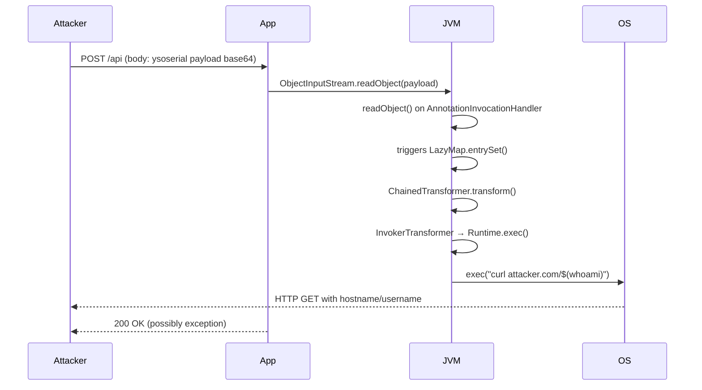

⚡ TL;DR - Insecure deserialization occurs when applications
reconstruct objects from attacker-controlled serialized data.
Java's `ObjectInputStream.readObject()` executes code during
deserialization if the classpath contains "gadget" classes that
chain into RCE when instantiated. Fix: never deserialize untrusted
data with Java native serialization. Use JSON/Protobuf instead.
If you must deserialize: use a class allowlist (deserialization
filters via `ObjectInputFilter`).

**OWASP A08 (2021):** Software and Data Integrity Failures.

---

| #062 | Category: Security | Difficulty: ★★★★ |
|:---|:---|:---|
| **Depends on:** | OWASP Top 10, Security Fundamentals, Input Validation, Security Code Review, OWASP Workshop | |
| **Used by:** | SAST, Heartbleed analysis, CORS Misconfiguration | |
| **Related:** | Java Gadget Chains, ysoserial, Log4Shell chain | |

---

### 🔥 The Problem This Solves

**WHY INSECURE DESERIALIZATION IS CRITICAL:**

```
JAVA NATIVE DESERIALIZATION: RCE FROM A BASE64 BLOB

APPLICATION CODE:
  // Reads a "session" cookie and deserializes it
  byte[] cookieData = Base64.decode(request.getCookie("session"));
  try (ObjectInputStream ois = new ObjectInputStream(
          new ByteArrayInputStream(cookieData))) {
      UserSession session = (UserSession) ois.readObject();
      // Use session...
  }

WHAT "readObject()" ACTUALLY DOES:
  It calls readObject() on every object in the stream.
  Including any object on the classpath with a readObject() method.
  Not just UserSession.
  
  The stream tells the JVM: "create these objects in this order."
  If any of those objects trigger code execution when created:
  the JVM executes that code.
  
  The attack is not about making the JVM create a UserSession.
  The attack is about what else the JVM creates along the way.

THE GADGET CHAIN CONCEPT:
  A "gadget" = a class in the classpath that executes some action
  when certain methods are called during deserialization.
  
  Individual gadgets: innocent on their own.
  Chained together: the last gadget in the chain executes arbitrary code.
  
  Classic chain (CommonsCollections 1, Apache Commons 3.1-3.2.1):
    1. InvokerTransformer - executes a method on any object
    2. ChainedTransformer - chains multiple Transformers
    3. TransformedMap / LazyMap - triggers transformation on map access
    4. AnnotationInvocationHandler - triggers map access in readObject()
    
    Chain result: InvokerTransformer calls exec() on Runtime.getRuntime()
    with attacker-controlled command string → RCE.
    
    ysoserial tool generates the serialized bytes:
    java -jar ysoserial.jar CommonsCollections1 "id" | base64
    → A base64 blob. When deserialized: runs "id" command.

SCALE OF IMPACT:
  WebLogic CVE-2015-4852: unauthenticated RCE via T3 protocol deserialization
  JBoss CVE-2015-7501: unauthenticated RCE via HTTP endpoint
  Jenkins CVE-2016-0792: unauthenticated RCE
  Any app that stored Java serialized objects in cookies/Redis/files
  and used CommonsCollections/Spring/Hibernate in the classpath.
  
  These applications didn't know they were vulnerable - the vulnerable
  gadget classes came from transitive dependencies, not direct use.
```

---

### 📘 Textbook Definition

**Serialization:** The process of converting an in-memory object
graph into a byte sequence for storage or transmission.

**Deserialization:** Reconstructing an object graph from a byte
sequence. During deserialization, constructors and `readObject()`
methods on the deserialized objects are called.

**Insecure Deserialization:** When an application deserializes
data from an untrusted source (network input, cookies, files,
message queues) without validating object types. Enables:
- **Remote Code Execution (RCE):** Via gadget chains (Java native)
- **Object injection:** PHP/Python - construct attacker-controlled
  objects with dangerous side effects
- **Data tampering:** Modify deserialized objects to escalate privileges
  (e.g., change `isAdmin: false` to `isAdmin: true` in PHP object)

**Gadget chain:** A sequence of classes in the classpath whose
methods, when called in the right order during deserialization,
eventually result in arbitrary code execution. The chain is
triggered by the deserialization process itself, not by the
application's normal logic.

**OWASP Category:** A08 (Software and Data Integrity Failures) in 2021.
Previously A08 (Insecure Deserialization) as a standalone category in 2017.

---

### ⏱️ Understand It in 30 Seconds

**One line:**
Java's `ObjectInputStream.readObject()` blindly executes code in any
object it encounters during deserialization. Attackers craft malicious
serialized blobs that chain together innocent classpath classes into
arbitrary code execution. Fix: don't use Java native serialization
for untrusted input.

**One analogy:**
> Insecure deserialization is like opening a shipping container
> and executing every instruction inside without reading them first.
>
> Normal container: "These are your boxes. Unpack them this way."
> Malicious container: "Unpack boxes A, B, C... (and box C contains
> 'call exec(rm -rf /) on arrival')."
>
> The worker (JVM) follows all instructions faithfully, including
> the dangerous ones hidden inside the nested boxes.
>
> The fix: only open containers you packed yourself (never deserialize
> untrusted data). Or: verify the packing list before opening
> (class allowlist - only unpack known safe types).

---

### 🔩 First Principles Explanation

**Prevention approaches:**

```
APPROACH 1: DON'T USE JAVA NATIVE SERIALIZATION FOR UNTRUSTED DATA
  (Most effective - eliminates the attack surface)

  BAD (Java native serialization from untrusted source):
    byte[] data = Base64.decode(request.getParameter("data"));
    ObjectInputStream ois = new ObjectInputStream(
        new ByteArrayInputStream(data)
    );
    Object obj = ois.readObject();  // Executes code in attacker's blob!
  
  GOOD: Use JSON/Protobuf/Thrift instead:
    // Jackson JSON deserialization:
    String json = request.getParameter("data");
    UserSession session = objectMapper.readValue(json, UserSession.class);
    // Jackson does not execute arbitrary code during deserialization.
    // (Polymorphic deserialization with enableDefaultTyping() is also
    //  dangerous - disable it and use explicit type info only.)
  
  WHY JSON IS SAFER:
    JSON has no concept of "call readObject() during parsing."
    The Jackson parser creates only the types you specify.
    There are no gadget chains via JSON parsing in a correctly
    configured Jackson setup.
    (Note: Jackson's enableDefaultTyping() allows type info in JSON
    which enables gadget chains via Jackson's own type resolution.
    Never use enableDefaultTyping() or @JsonTypeInfo with untrusted input.)

APPROACH 2: DESERIALIZATION FILTER (if you must use Java serialization)
  Java 9+ ObjectInputFilter (backported to JDK 8u121):
  
    ObjectInputFilter filter = ObjectInputFilter.Config.createFilter(
        "com.myapp.UserSession;com.myapp.SessionData;!*"
        // Allow UserSession, SessionData. Block everything else.
    );
    
    ObjectInputStream ois = new ObjectInputStream(inputStream);
    ois.setObjectInputFilter(filter);
    Object obj = ois.readObject();
    // Any class not in the allowlist: InvalidClassException
    
    WHY ALLOWLIST, NOT BLOCKLIST:
      ysoserial has dozens of gadget chains across different libraries.
      Blocking known gadgets: new gadget chains are discovered regularly.
      A blocklist is permanently outdated.
      An allowlist: only UserSession and SessionData can be deserialized.
      CommonsCollections, Spring, Hibernate classes: all blocked.
      No gadget chain can execute if its class is not on the allowlist.
  
  GLOBAL FILTER (JVM-level):
    -Djdk.serialFilter=com.myapp.*;!* (JVM startup flag)
    Applies to ALL deserialization in the JVM.

APPROACH 3: NOT-A-SERIALIZATION LIBRARY (safer alternatives)
  
  JSON: Jackson, Gson (no gadget chain risk in safe config)
  Protocol Buffers: Protobuf - schema-defined, no dynamic types
  Apache Avro: schema-defined, no dynamic types
  MessagePack: compact binary JSON-like format
  
  If you inherit Java serialization: migrate to one of these.
  The migration effort is lower than the ongoing risk of
  Java native deserialization for untrusted input.

PHP/PYTHON APPROACHES:
  
  PHP:
    BAD: unserialize($_COOKIE['session'])
    GOOD: json_decode($_COOKIE['session'], true)
          or use signed JWTs for session data
    
    PHP unserialize() calls __wakeup() and __destruct() on deserialized
    objects - both can be exploited for code execution. Same gadget
    chain concept as Java.
  
  Python:
    BAD: pickle.loads(data)  # pickle = arbitrary code execution
    GOOD: json.loads(data)
    
    Python's pickle protocol explicitly executes __reduce__() which
    can return arbitrary callable + args. Pickle deserialization of
    untrusted data = arbitrary code execution by design.
    Never use pickle/marshal/shelve with untrusted data.
    Use json, msgpack, or protobuf.
```

---

### 🧪 Thought Experiment

**SCENARIO: Identifying deserialization in a Spring Boot application**

```
AUDIT CHECKLIST - Finding deserialization entry points:

1. HTTP endpoints accepting serialized data:
   Content-Type: application/x-java-serialized-object
   Cookies with base64 that starts with "rO0AB" (Java serialized = 0xACED 0x0005)
   HTTP body starting with: ac ed 00 05 (hex magic bytes for Java serialization)

2. Java serialization magic bytes:
   Java serialized object starts with bytes: 0xACED 0x0005
   Base64 encoded: "rO0AB..."
   
   Grep codebase for ObjectInputStream:
     grep -r "ObjectInputStream" src/ --include="*.java"
   Any new ObjectInputStream reading external data:
     Request parameters, headers, cookies → HIGH RISK
     Internal config files → LOWER risk (if files not user-controlled)

3. Java Message Service (JMS) listeners:
   JMS messages can carry serialized objects.
   If an attacker can publish to the JMS queue → all listeners are vulnerable.
   
4. Redis/Memcache with Java serialization:
   Some Spring Session configurations store sessions as serialized Java objects.
   If Redis is accessible or the session store can be poisoned → RCE.

5. RMI, JMX, T3 (WebLogic), IIOP ports:
   These protocols use Java serialization natively.
   Exposed ports: nc -z host 1099 (RMI), host 7001 (WebLogic T3)
   → Likely serialization endpoint.

TESTING:
  Tool: ysoserial (generate payloads), URLDNS chain (safe: only DNS)
  Tool: Burp Suite Deserialization Scanner extension
  
  URLDNS chain: causes a DNS lookup (no code execution):
    java -jar ysoserial.jar URLDNS "http://attacker-collab.net"
  Send to endpoint. Check Burp Collaborator for DNS callback.
  If callback received: deserialization is happening → verify with
  CommonsCollections payload in a controlled test environment.
```

---

### 🧠 Mental Model / Analogy

> Insecure deserialization is like a CNC machine that executes
> any G-code file fed into it, including files from untrusted sources.
>
> G-code is the instruction language for CNC machines.
> A legitimate G-code file: "Move to X:10 Y:20, drill here."
> A malicious G-code file: "Move to coordinates that destroy the machine,
> then execute the 'activate emergency protocol' command."
>
> The machine doesn't know or care who wrote the G-code.
> It executes faithfully.
>
> The gadget chain is the malicious G-code sequence: innocent-looking
> individual instructions that, in combination, cause catastrophic behavior.
>
> The fix: the CNC machine only accepts G-code from trusted operators
> (allowlist) or uses a G-code validator that refuses dangerous commands
> (deserialization filter).
>
> Better yet: use a different format that doesn't support dangerous
> operations (JSON instead of Java serialization).

---

### 📶 Gradual Depth - Five Levels

**Level 1 - What it is (anyone can understand):**
Insecure deserialization means your application reads data that someone else controls and turns it back into objects without checking what objects are being created. Attackers can craft data that, when your application reads it, causes your server to execute commands. Fix: don't use Java's built-in serialization for data from users. Use JSON instead.

**Level 2 - How to use it (junior developer):**
Never use `ObjectInputStream.readObject()` with user-supplied data (request parameters, cookies, HTTP body). Never use Python's `pickle.loads()` or PHP's `unserialize()` with untrusted data. Use JSON (Jackson, Gson), Protobuf, or Avro for data interchange. If you inherit existing code that uses Java serialization: add an `ObjectInputFilter` to allow only the expected classes (`com.myapp.MyClass;!*`).

**Level 3 - How it works (mid-level engineer):**
Java gadget chains exploit the fact that `readObject()` is called on every object during deserialization. An attacker crafts a serialized stream that creates objects from libraries in the classpath (CommonsCollections, Spring, Jackson, Groovy). These objects, when their lifecycle methods are called during deserialization, chain together into a sequence that calls `Runtime.exec()` with an attacker-controlled string. The classpath libraries are not vulnerabilities in isolation - they become vulnerabilities when the deserialization machinery calls them in the right sequence. ysoserial provides pre-built serialized payloads for ~30 known chains. ObjectInputFilter (Java 9+) breaks gadget chains by refusing to instantiate non-allowlisted classes.

**Level 4 - Why it was designed this way (senior/staff):**
Java serialization was designed for RMI (Remote Method Invocation) - a trusted distributed computing protocol between JVM nodes in the same organization. The assumption: both ends trust each other. The feature allows arbitrary object graphs to be transmitted. When developers started using Java serialization for untrusted inputs (session data, REST API bodies, message queue payloads), the trust assumption broke. The critical insight: Java serialization doesn't just reconstruct data - it reconstructs code (object behavior). Reconstructing code with attacker-controlled input is fundamentally dangerous. The language feature design (calling readObject() during deserialization) makes gadget chains possible in any JVM with a rich enough classpath. Robert Seacord's 2015 blog post and the ysoserial tool brought this to wide attention; the subsequent WebLogic/JBoss/Jenkins exploits made it critical.

**Level 5 - Mastery (distinguished engineer):**
Advanced insecure deserialization: Jackson CVE-2017-7525 (polymorphic type handling via `enableDefaultTyping()`) allows gadget chains via JSON. If Jackson is configured to include type information in JSON and the attacker can supply a JSON payload with a `@class` field pointing to a gadget class, Jackson instantiates that class during JSON parsing. The fix: never use `enableDefaultTyping()` or `@JsonTypeInfo` with `use=Id.CLASS` on untrusted data. Use `@JsonSubTypes` to restrict polymorphic types. At scale: deserialization is common in message-driven architectures. If a Kafka consumer deserializes messages: a compromised Kafka broker or a producer that sends malicious messages can compromise consumers. Defense in depth: use explicit type discrimination instead of dynamic type resolution; sign serialized data (detect tampering before deserializing); network-level isolation (only trusted producers can publish to sensitive topics).

---

### ⚙️ How It Works (Mechanism)

```
GADGET CHAIN EXECUTION (simplified CommonsCollections 1):

                     readObject() called
                           │
              ┌────────────▼────────────┐
              │ AnnotationInvocationHandler│
              │  readObject() overridden  │
              │  → calls map.entrySet()   │
              └────────────┬─────────────┘
                           │
              ┌────────────▼────────────┐
              │      LazyMap             │
              │  entrySet() not cached   │
              │  → calls transform(key)  │
              └────────────┬─────────────┘
                           │
              ┌────────────▼────────────┐
              │   ChainedTransformer     │
              │  → calls each Transformer│
              │    in sequence           │
              └────────────┬─────────────┘
                           │
              ┌────────────▼────────────┐
              │  InvokerTransformer      │
              │  → calls exec() on       │
              │    Runtime.getRuntime()  │
              │  → "id" command executes │
              └──────────────────────────┘
```



---

### 💻 Code Example

**Java deserialization filter - production pattern:**

```java
import java.io.*;

// CORRECT: ObjectInputStream with class allowlist filter
public class SafeDeserializer {
    
    // Allowlist of classes that CAN be deserialized
    private static final String FILTER_PATTERN =
        "com.myapp.session.UserSession;" +
        "com.myapp.session.SessionData;" +
        "java.util.ArrayList;" +  // Only if needed
        "java.lang.String;" +     // Only if needed
        "!*";                     // Block ALL other classes
    
    public static Object safeDeserialize(byte[] data)
            throws IOException, ClassNotFoundException {
        
        try (ByteArrayInputStream bais =
                new ByteArrayInputStream(data);
             ObjectInputStream ois = new ObjectInputStream(bais)) {
            
            // Apply allowlist filter
            ObjectInputFilter filter =
                ObjectInputFilter.Config.createFilter(FILTER_PATTERN);
            ois.setObjectInputFilter(filter);
            
            return ois.readObject();
        }
    }
}

// BETTER: Don't use Java serialization at all
// Use Jackson JSON for session data:
import com.fasterxml.jackson.databind.ObjectMapper;

public class JsonSessionSerializer {
    private static final ObjectMapper mapper = new ObjectMapper();
    
    public static String serialize(UserSession session)
            throws IOException {
        return mapper.writeValueAsString(session);
    }
    
    public static UserSession deserialize(String json)
            throws IOException {
        // Jackson only creates UserSession - not arbitrary objects
        return mapper.readValue(json, UserSession.class);
    }
}
```

---

### ⚖️ Comparison Table

| Language | Dangerous Function | Attack | Safe Alternative |
|:---|:---|:---|:---|
| **Java** | `ObjectInputStream.readObject()` | Gadget chains → RCE | Jackson JSON, Protobuf; ObjectInputFilter if must use |
| **Python** | `pickle.loads()`, `marshal.loads()` | `__reduce__` → arbitrary code | `json.loads()`, msgpack |
| **PHP** | `unserialize()` | `__wakeup/__destruct` → code execution | `json_decode()` |
| **Ruby** | `Marshal.load()` | Gadget chains | JSON |
| **Node.js** | `node-serialize` | `_$$ND_FUNC$$_` RCE | JSON.parse() |

---

### ⚠️ Common Misconceptions

| Misconception | Reality |
|:---|:---|
| "We sign/encrypt the serialized data, so deserialization is safe." | Signing proves the data wasn't tampered with after signing. It does not protect against a scenario where the signing happens before an integrity check (race condition), a signing key is leaked, or the signature verification code itself has a bug. More importantly: if the data was SIGNED BY AN ATTACKER who has any way to get their payload signed (SSRF → sign endpoint, shared signing key across environments, etc.), the signature is meaningless. The fundamental problem is that Java deserialization executes code during object reconstruction. The safest approach is to eliminate the risk entirely: don't use Java native serialization for untrusted input, regardless of signing. ObjectInputFilter as a class allowlist is more reliable than signing as a defense-in-depth measure. |
| "We're using Java 11+, so we're safe from the old gadget chains." | Java 11 does not remove gadget chain vulnerabilities. It removes some default classpath libraries that contained gadgets (like some sun.* classes), but: (1) CommonsCollections, Spring, Hibernate, Jackson (with default typing) can still be present in the application's dependencies, (2) New gadget chains are discovered regularly for modern versions, (3) The fundamental vulnerability - calling readObject() on untrusted data - still exists. The fix is architectural: use safe serialization formats (JSON, Protobuf), not relying on reduced classpath or Java version. |

---

### 🚨 Failure Modes & Diagnosis

**Detecting Java deserialization vulnerabilities:**

```
IDENTIFICATION:

1. Magic bytes in HTTP traffic:
   Java serialized object: starts with bytes AC ED 00 05
   In base64: rO0AB...
   
   In Burp Suite: look for cookies or body parameters starting with "rO0AB"
   In Wireshark/packet capture: filter for AC:ED:00:05 in TCP payload

2. Grep for ObjectInputStream:
   grep -rn "ObjectInputStream" src/ --include="*.java"
   Look for: new ObjectInputStream(inputStream) where inputStream
   comes from request/response/socket/queue/file read from external

3. Dependency check for gadget libraries:
   mvn dependency:tree | grep commons-collections
   (commons-collections 3.1-3.2.1 = high-risk gadget chain source)
   
   OWASP Dependency Check:
   mvn org.owasp:dependency-check-maven:check
   Flags known vulnerable deserialization gadget versions.

4. ClassPath gadget analysis:
   Tool: gadgetinspector (GitHub: JackOfMostTrades/gadgetinspector)
   Scans your classpath for gadget chains. 
   May find project-specific gadget chains not in ysoserial.

EXPLOITATION TEST (safe: DNS only):
  java -jar ysoserial.jar URLDNS "http://[burp-collaborator-id].burpcollaborator.net"
  Send as serialized payload (base64) to suspected endpoint.
  If DNS callback received: deserialization confirmed.
  (URLDNS chain only does a DNS lookup - safe for testing, no code execution)
```

---

### 🔗 Related Keywords

**Prerequisites:**
- `OWASP Top 10` - A08 Software and Data Integrity Failures
- `Security Code Review` - identifying ObjectInputStream usage
- `Security Fundamentals` - RCE severity context

**Builds on this:**
- `SAST` - static analysis for deserialization patterns
- `Heartbleed 2014` - similar: trust violations in library code

---

### 📌 Quick Reference Card

```
┌──────────────────────────────────────────────────────────┐
│ MAGIC BYTES  │ Java: AC ED 00 05 = base64 rO0AB...       │
│              │ Python pickle: \x80\x04 or \x80\x05       │
├──────────────┼───────────────────────────────────────────┤
│ PRIMARY FIX  │ Don't use Java native serialization for   │
│              │ untrusted input. Use JSON/Protobuf.        │
│ IF MUST      │ ObjectInputFilter allowlist (!* at end)    │
├──────────────┼───────────────────────────────────────────┤
│ PYTHON       │ NEVER pickle.loads(untrusted)              │
│ PHP          │ NEVER unserialize(untrusted)               │
├──────────────┼───────────────────────────────────────────┤
│ TEST TOOL    │ ysoserial URLDNS (safe DNS-only payload)   │
│              │ gadgetinspector (classpath scan)           │
├──────────────┼───────────────────────────────────────────┤
│ OWASP        │ A08 Software and Data Integrity Failures   │
└──────────────────────────────────────────────────────────┘
```

---

### 💎 Transferable Wisdom

**Reusable Engineering Principle:**
"When you reconstruct untrusted data into typed objects,
you execute code from the untrusted source."
This is the root cause of insecure deserialization across
all languages. The pattern is not unique to Java:
- Java readObject(): calls lifecycle methods during reconstruction
- Python pickle: executes `__reduce__` during reconstruction
- PHP unserialize(): calls `__wakeup`, `__destruct` during reconstruction
- YAML (Python yaml.load): executes Python constructors for !!python/object
The abstract rule: any format that carries type information
AND executes code as part of type reconstruction is dangerous
for untrusted input.
Formats that carry type information WITHOUT executing code
during reconstruction:
- JSON (just key-value data, you specify the target type)
- Protobuf (schema-defined types, no dynamic dispatch)
- Avro (schema-defined, no type-based execution)
- MessagePack (binary JSON equivalent)
The design rule: for untrusted input, use formats that treat
data as data - not formats that treat data as instructions.
Type reconstruction = code execution = attack surface.

---

### 💡 The Surprising Truth

Apache Commons Collections was a ubiquitous Java library
(a foundational utility library) used for data structures.
The gadget chain that made it dangerous for deserialization
was not a bug in Commons Collections - every method worked
exactly as documented.
The chain was: "these existing, correct methods, called in
this sequence during deserialization, happen to execute
arbitrary code."
This was published in the ysoserial presentation at AppSecCali
2015 by Chris Frohoff and Gabriel Lawrence: "Marshalling Pickles"
(serialization puns).
After the presentation: a flood of vulnerability disclosures.
The same chain worked in WebLogic (CVE-2015-4852), JBoss
(CVE-2015-7501), Jenkins (CVE-2016-0792), Apache Groovy,
Spring Framework, and every other Java application that:
(1) had Commons Collections 3.1-3.2.1 on the classpath, AND
(2) deserialized untrusted data via ObjectInputStream.
The fix that actually worked was not patching Commons Collections
(no bug there) - it was using ObjectInputFilter to prevent
CommonsCollections classes from being deserialized at all.
The lesson: a "correct" library becomes a weapon when the
environment it operates in changes (serialization of untrusted
data) in ways its authors never anticipated.

---

### ✅ Mastery Checklist

**You've mastered this when you can:**
1. **EXPLAIN** the gadget chain concept: why CommonsCollections became
   dangerous without containing a bug, and how a chain of innocent methods
   results in `Runtime.exec()`.
2. **IDENTIFY** Java deserialization in code: `ObjectInputStream.readObject()`,
   base64 blobs starting with "rO0AB", `Content-Type: application/x-java-serialized-object`.
3. **IMPLEMENT** the safe alternatives: Jackson JSON with explicit type mapping
   for session data; `ObjectInputFilter` allowlist if native serialization is
   required for legacy systems.
4. **TEST** safely: ysoserial URLDNS chain for detecting deserialization without
   executing code; gadgetinspector for classpath analysis.

---

### 🎯 Interview Deep-Dive

**Q: What is insecure deserialization? How would you fix it in a Java application?**

*Why they ask:* Enterprise Java is common. OWASP A08 category. Tests
understanding of how language features become vulnerabilities.

*Strong answer covers:*
- Definition: `ObjectInputStream.readObject()` calls lifecycle methods
  on every class encountered during deserialization. Attackers craft
  serialized streams using classes in the application's classpath that,
  when instantiated/deserialized in sequence, result in `Runtime.exec()`.
  This is the "gadget chain."
- Why it's dangerous: the gadget classes (CommonsCollections, Spring, etc.)
  are not buggy - they work as designed. The attack exploits the
  deserialization mechanism itself.
- Signature: base64 starting with "rO0AB" = Java serialized object.
- Primary fix: don't use Java native serialization for untrusted input.
  Use Jackson JSON or Protobuf. Specify the target type explicitly.
- If you must use native serialization: ObjectInputFilter allowlist.
  `com.myapp.MyClass;!*` - allow only your expected classes.
- Python equivalent: never `pickle.loads(untrusted)` - use `json.loads()`.
- Testing: ysoserial URLDNS (DNS-only payload - safe), burp extension.
- OWASP A08 (2021). Prior to 2021: standalone A08 in 2017 list.