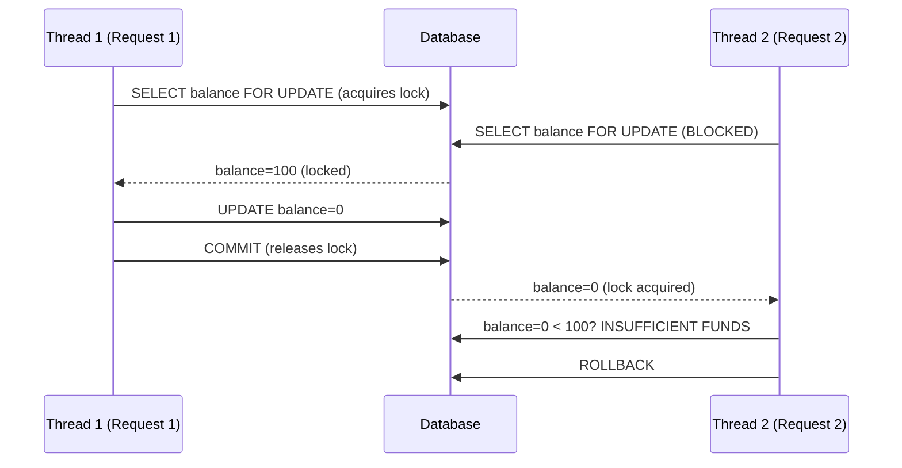

⚡ TL;DR - Race conditions in security contexts (TOCTOU - Time of
Check to Time of Use) occur when an attacker can change a condition
between when it's checked and when it's used. Classic: check wallet
balance → attacker submits duplicate withdrawal → both pass the
check before either one reduces the balance. Fix: database-level
atomic operations (SELECT FOR UPDATE), idempotency keys, or
pessimistic locking.

---

| #063 | Category: Security | Difficulty: ★★★ |
|:---|:---|:---|
| **Depends on:** | OWASP Top 10, Security Fundamentals, Input Validation, Security Code Review, Mass Assignment | |
| **Used by:** | Security Performance Testing, Security at Scale | |
| **Related:** | Concurrency, Idempotency, Database Isolation Levels | |

---

### 🔥 The Problem This Solves

**WHY RACE CONDITIONS CAUSE SECURITY VULNERABILITIES:**

```
THE CLASSIC RACE CONDITION: DOUBLE SPEND

VULNERABLE CODE:
  POST /api/transfer
  
  def transfer(user_id, amount, destination):
      # STEP 1: Check balance (READ)
      balance = db.query("SELECT balance FROM wallets WHERE user_id=?", user_id)
      
      if balance < amount:
          raise InsufficientFundsError()
      
      # GAP: time between check and use
      # If two requests run concurrently, BOTH can pass the check
      # with the same starting balance
      
      # STEP 2: Deduct (WRITE)
      db.execute("UPDATE wallets SET balance=balance-? WHERE user_id=?",
                 amount, user_id)
      db.execute("INSERT INTO transactions ...")

ATTACK:
  Attacker's wallet has $100.
  Attacker sends 50 concurrent requests: POST /api/transfer amount=100
  
  Thread 1: SELECT balance = 100 → 100 >= 100 → PASS
  Thread 2: SELECT balance = 100 → 100 >= 100 → PASS   (before Thread 1 commits)
  Thread 3: SELECT balance = 100 → 100 >= 100 → PASS
  ...
  Thread 1: UPDATE balance = balance - 100 = 0
  Thread 2: UPDATE balance = balance - 100 = -100 (!!)
  Thread 3: UPDATE balance = balance - 100 = -200 (!!)
  
  Attacker withdraws $5000 from a $100 wallet.
  (Classic double-spend. Bitcoin solved this with blockchain consensus.
   Your app needs SELECT FOR UPDATE.)

REAL EXAMPLE: Web application coupon system
  Coupon: "20% off, one use per account"
  Code checks: has_used_coupon(user_id) → No → apply discount → mark used
  Race: 10 concurrent requests, all check "used?" = No, all apply discount.
  Attacker gets 20% off on 10 orders from one coupon.

REAL EXAMPLE: Password reset token race
  Reset token is 6-digit code, valid 10 minutes.
  Check: is token valid + not expired? → Yes → allow password reset.
  Race: multiple concurrent requests with guessed tokens all processed
        before the first valid one marks it as used.
  Mitigation: atomic check-and-invalidate.
```

---

### 📘 Textbook Definition

**TOCTOU (Time of Check to Time of Use):** A class of race condition
where a state check and the corresponding action are not atomic. An
attacker modifies the state between the check and the use to bypass
the check.

**Security-relevant race conditions:**
- **Double-spend:** State (balance/limit) checked before any transaction
  reduces it; concurrent transactions pass the check with the same state.
- **Privilege escalation via race:** Check role → small gap → role elevated
  → action executed with elevated role (bypasses the check).
- **File TOCTOU:** Check if file is symlink (safe) → attacker replaces with
  symlink → code operates on symlink destination (privilege escalation).
- **Token consumption race:** Check token valid → use token (send email,
  apply discount) → mark token used; concurrent requests all pass the check.

**Atomicity:** An operation is atomic if it completes without any other
operation interleaving. Database transactions with `SELECT FOR UPDATE` are
atomic for the selected rows - no other transaction can read or modify those
rows until the transaction commits.

---

### ⏱️ Understand It in 30 Seconds

**One line:**
TOCTOU = "I checked the rules (check), then you changed
the situation before I acted on my decision (use)." The check
result is stale by the time the action happens. Fix: make
the check and action atomic (they happen together or not at all).

**One analogy:**
> TOCTOU is like a nightclub bouncer who checks IDs at the
> door and then walks away for 5 minutes before letting people in.
>
> Attacker's plan: show a valid ID → bouncer checks (Time of Check)
> → hand ID to underage friend → friend shows the same ID when
> the bouncer comes back (Time of Use) → both enter.
>
> The check (valid ID confirmed) and the use (let person in)
> are not atomic. The attacker exploits the gap.
>
> Fix: the bouncer checks and admits simultaneously.
> No gap between check and use.
> (Database SELECT FOR UPDATE = bouncer holds the door while
> checking - no gap for a swap.)

---

### 🔩 First Principles Explanation

**Database-level fixes for race conditions:**

```
FIX 1: SELECT FOR UPDATE (pessimistic locking)

  BAD (vulnerable to double-spend):
    # Two concurrent transactions can both read balance=100
    # and both pass the balance check.
    
    def transfer(conn, user_id, amount):
        row = conn.execute(
            "SELECT balance FROM wallets WHERE user_id=?",
            (user_id,)
        ).fetchone()
        
        if row['balance'] < amount:
            raise InsufficientFundsError()
        
        conn.execute(
            "UPDATE wallets SET balance=balance-? WHERE user_id=?",
            (amount, user_id)
        )
        conn.commit()
  
  GOOD (SELECT FOR UPDATE prevents concurrent reads of the row):
    def transfer(conn, user_id, amount):
        with conn.transaction():  # Begin transaction
            # FOR UPDATE: acquires a row-level lock.
            # Other transactions cannot read/write this row
            # until this transaction commits or rolls back.
            row = conn.execute(
                "SELECT balance FROM wallets "
                "WHERE user_id=? FOR UPDATE",  # Row-level lock
                (user_id,)
            ).fetchone()
            
            if row['balance'] < amount:
                raise InsufficientFundsError()
            
            conn.execute(
                "UPDATE wallets SET balance=balance-? "
                "WHERE user_id=?",
                (amount, user_id)
            )
        # Lock released on commit. Other transactions can now proceed.
  
  With SELECT FOR UPDATE:
    Thread 1: acquires lock on user_id=42 row → balance=100 → passes check → UPDATE
    Thread 2: tries SELECT FOR UPDATE → BLOCKED (waiting for lock)
    Thread 1: commits → balance now 0
    Thread 2: lock acquired → balance=0 → 0 < 100 → InsufficientFundsError ✓

FIX 2: ATOMIC CONDITIONAL UPDATE (optimistic locking)

  GOOD (single atomic SQL statement - no gap):
    def transfer(conn, user_id, amount):
        result = conn.execute(
            """
            UPDATE wallets
            SET balance = balance - ?
            WHERE user_id = ?
              AND balance >= ?   -- Condition checked atomically
            """,
            (amount, user_id, amount)
        )
        
        if result.rowcount == 0:
            raise InsufficientFundsError("Insufficient funds")
        
        conn.commit()
  
  Why this works:
    The check (balance >= amount) and the update (SET balance - amount)
    are part of the same SQL statement.
    The database executes this atomically at the row level.
    Two concurrent requests: one wins (rowcount=1), one loses (rowcount=0).
    No double-spend possible.

FIX 3: IDEMPOTENCY KEYS

  Use case: client retries (network failures) vs. race attacks.
  
  Client sends: X-Idempotency-Key: uuid-request-id
  Server: INSERT INTO processed_requests (idempotency_key, result)
          ON CONFLICT (idempotency_key) DO NOTHING
          RETURNING result;
  
  If key already exists: return cached result without re-processing.
  Race: two requests with same key → database UNIQUE constraint ensures
        exactly one INSERT succeeds → one processes, one gets cached result.
  
  Implementation pattern:
    # POST /api/transfer
    def transfer(idempotency_key, user_id, amount):
        # Atomic: insert + check for duplicate in one query
        existing = db.execute(
            """
            INSERT INTO idempotency_keys (key, user_id, created_at)
            VALUES (?, ?, NOW())
            ON CONFLICT (key) DO UPDATE SET accessed_at=NOW()
            RETURNING was_processed
            """,
            (idempotency_key, user_id)
        ).fetchone()
        
        if existing['was_processed']:
            return get_cached_result(idempotency_key)
        
        # Process transfer (only reached by first request)
        result = process_transfer(user_id, amount)
        cache_result(idempotency_key, result)
        return result
```

---

### 🧪 Thought Experiment

**SCENARIO: Race condition in coupon application**

```
FEATURE: Apply coupon code "SAVE20" (20% off, one use per account)

VULNERABLE CODE:
  POST /api/orders/checkout
  Body: {"coupon_code": "SAVE20", "cart": [...]}
  
  def checkout(user_id, coupon_code, cart):
      if coupon_code:
          # CHECK: has user already used this coupon?
          used = db.query(
              "SELECT 1 FROM coupon_uses WHERE user_id=? AND code=?",
              user_id, coupon_code
          ).fetchone()
          if used:
              raise CouponAlreadyUsedError()
          discount = calculate_discount(cart, coupon_code)  # 20% off
      
      total = calculate_total(cart, discount)
      order = create_order(user_id, total)
      
      if coupon_code:
          # USE: mark as used (after order created)
          db.execute(
              "INSERT INTO coupon_uses (user_id, code, order_id) VALUES (?,?,?)",
              user_id, coupon_code, order.id
          )
      
      return order

ATTACK:
  Send 20 concurrent POST requests with coupon_code="SAVE20".
  All 20 reach "SELECT 1 FROM coupon_uses" before any INSERT runs.
  All 20 see "no row" → all pass the check.
  All 20 create orders with 20% discount.
  All 20 insert into coupon_uses (all succeed since no UNIQUE constraint!).
  
  Attacker gets 20% off on 20 orders.

FIX 1: Unique constraint + handle conflict:
  ALTER TABLE coupon_uses ADD UNIQUE (user_id, code);
  -- Unique constraint: only one INSERT will succeed.
  -- All others will fail with ConstraintViolationError.
  
  In application:
    try:
        db.execute("INSERT INTO coupon_uses (user_id, code) VALUES (?,?)",
                   user_id, coupon_code)
    except UniqueConstraintViolation:
        raise CouponAlreadyUsedError()

FIX 2: Atomic check-and-insert:
  result = db.execute(
      "INSERT INTO coupon_uses (user_id, code, order_id) "
      "SELECT ?, ?, ? WHERE NOT EXISTS ("
      "  SELECT 1 FROM coupon_uses WHERE user_id=? AND code=?"
      ")",
      user_id, coupon_code, order_id, user_id, coupon_code
  )
  if result.rowcount == 0:
      raise CouponAlreadyUsedError()
  
  Atomic: check and insert happen in one SQL statement.
```

---

### 🧠 Mental Model / Analogy

> TOCTOU is like a vending machine that counts your money
> and then opens the slot, but the two steps are separated
> by 5 seconds.
>
> Normal: insert $1 → machine counts (check) → slot opens (use). Atomic.
> TOCTOU: insert $1 → machine counts (TIME OF CHECK) → 5 second gap →
>         you reach in during the gap → slot opens for $0 (TIME OF USE).
>
> The classic banking version:
> Balance check: $100 (Time of Check)
> Gap: processing happens...
> Withdrawal deducted: $100 - $100 = $0 (Time of Use)
> But ANOTHER request also checked at the same time and saw $100,
> so it also deducts $100: $0 - $100 = -$100.
>
> SELECT FOR UPDATE: the machine checks and opens in one locked motion.
> No gap. No other machine can check the same $1 at the same time.

---

### 📶 Gradual Depth - Five Levels

**Level 1 - What it is (anyone can understand):**
A race condition in security means two things happening at almost the same time cause a security check to be bypassed. Example: if your app checks "does this user have enough money?" and "deduct money" in two separate steps, and someone submits two withdrawal requests at the exact same time, both can pass the "enough money?" check before either one reduces the balance. Fix: make the check and the action happen in one atomic database operation.

**Level 2 - How to use it (junior developer):**
When your check and action on shared state are in separate database queries: use `SELECT FOR UPDATE` to lock the row, or use a conditional UPDATE that includes the check in the WHERE clause. Add unique constraints on tables where "only one should exist" (coupon uses, idempotency keys). Always validate business rules at the database level (CHECK constraints, UNIQUE, UPDATE WHERE balance >= amount) not just in application code.

**Level 3 - How it works (mid-level engineer):**
TOCTOU in databases: without transaction isolation, two concurrent transactions can both read the same state, both pass the check, and both write conflicting results. `SELECT FOR UPDATE` acquires a row-level exclusive lock - other transactions block on the same `SELECT FOR UPDATE` until the first transaction commits. The alternative (atomic conditional UPDATE) avoids locking by making the check part of the SQL WHERE clause - the database checks and updates atomically at the row level, returning 0 rows if the condition failed. Both approaches eliminate the TOCTOU gap; `SELECT FOR UPDATE` is more flexible (can make multiple conditional decisions), conditional UPDATE is simpler for single-condition cases.

**Level 4 - Why it was designed this way (senior/staff):**
Database isolation levels were designed explicitly to handle concurrent state modification: READ UNCOMMITTED (dirty reads, no concurrency control), READ COMMITTED (sees committed values, still allows non-repeatable reads), REPEATABLE READ (snapshot of the state at transaction start), SERIALIZABLE (transactions behave as if serial). Most ORMs default to READ COMMITTED, which is vulnerable to TOCTOU. `SELECT FOR UPDATE` implements pessimistic locking within READ COMMITTED isolation: you explicitly acquire a lock on the rows you intend to modify, preventing concurrent reads. This is more targeted than SERIALIZABLE isolation (which would serialize ALL transactions, with significant performance impact). The tradeoff: `SELECT FOR UPDATE` can cause deadlocks if two transactions try to lock each other's rows. Implement lock ordering to prevent deadlocks (always lock rows in a consistent order, e.g., lowest user_id first).

**Level 5 - Mastery (distinguished engineer):**
Advanced TOCTOU: in microservices, the check and action may span services. Service A checks balance → message sent to Service B → Service B deducts. The gap between A's check and B's deduction is potentially seconds (queue latency). An attacker who can submit requests faster than the queue processes can bypass the check repeatedly. Solution: saga pattern with compensating transactions, or centralize balance management in a single service with local transaction atomicity. Distributed two-phase commit solves atomicity across services but introduces availability trade-offs (2PC coordinator is a single point of failure). For payment systems: use optimistic concurrency control with version numbers (compare-and-swap: UPDATE wallets SET balance=new_balance, version=version+1 WHERE user_id=X AND version=expected_version; if rowcount=0: retry or fail).

---

### ⚙️ How It Works (Mechanism)

```
RACE CONDITION TIMELINE:

WITHOUT LOCKING (VULNERABLE):

  Time →
  T=0: Thread1 reads balance=100 for user_id=42
  T=0: Thread2 reads balance=100 for user_id=42
  T=1: Thread1 checks: 100 >= 100 → PASS
  T=1: Thread2 checks: 100 >= 100 → PASS
  T=2: Thread1 updates: balance = 100 - 100 = 0
  T=2: Thread2 updates: balance = 0 - 100 = -100  !
  Both transactions committed. Balance = -100. Race exploited.

WITH SELECT FOR UPDATE (SAFE):

  T=0: Thread1 acquires LOCK on row for user_id=42
  T=0: Thread2 tries to acquire LOCK → BLOCKED (waiting)
  T=1: Thread1 reads balance=100 → 100 >= 100 → PASS
  T=2: Thread1 updates: balance = 100 - 100 = 0 → COMMITS
  T=2: Thread1 releases lock
  T=2: Thread2 UNBLOCKED → acquires lock
  T=3: Thread2 reads balance=0 → 0 < 100 → FAIL (InsufficientFunds) ✓
  Balance = 0. Race prevented.
```



---

### 💻 Code Example

**Spring/Java: pessimistic locking with JPA:**

```java
import jakarta.persistence.*;
import org.springframework.stereotype.Service;
import org.springframework.transaction.annotation.Transactional;

@Service
public class TransferService {

    @PersistenceContext
    private EntityManager em;

    @Transactional  // Begin/commit transaction
    public void transfer(Long userId, BigDecimal amount) {
        // PESSIMISTIC_WRITE = SELECT FOR UPDATE
        Wallet wallet = em.find(
            Wallet.class, userId,
            LockModeType.PESSIMISTIC_WRITE  // Acquires row lock
        );
        
        if (wallet == null) {
            throw new WalletNotFoundException(userId);
        }
        
        if (wallet.getBalance().compareTo(amount) < 0) {
            throw new InsufficientFundsException(
                "Balance: " + wallet.getBalance() +
                ", requested: " + amount
            );
        }
        
        wallet.setBalance(wallet.getBalance().subtract(amount));
        // Lock released on @Transactional method completion (commit)
    }
    
    // Alternative: atomic conditional UPDATE
    @Transactional
    public void transferAtomic(Long userId, BigDecimal amount) {
        int updated = em.createQuery(
            "UPDATE Wallet w " +
            "SET w.balance = w.balance - :amount " +
            "WHERE w.userId = :userId " +
            "AND w.balance >= :amount"  // Condition checked atomically
        )
        .setParameter("amount", amount)
        .setParameter("userId", userId)
        .executeUpdate();
        
        if (updated == 0) {
            throw new InsufficientFundsException(
                "Insufficient funds or wallet not found"
            );
        }
    }
}
```

---

### ⚖️ Comparison Table

| Fix | Approach | Pros | Cons |
|:---|:---|:---|:---|
| **SELECT FOR UPDATE** | Pessimistic lock | Flexible, multiple checks | Deadlock risk if not ordered |
| **Conditional UPDATE** | Atomic SQL | Simple, no deadlock | Single condition only |
| **UNIQUE constraint** | DB-enforced uniqueness | Automatic, always enforced | Only for uniqueness scenarios |
| **Idempotency key** | Deduplication | Handles retries too | Extra table + storage |
| **Optimistic locking** | Version check | No blocking | Retry logic required |
| **Queue with single consumer** | Serialization | No concurrent execution | Throughput limited |

---

### ⚠️ Common Misconceptions

| Misconception | Reality |
|:---|:---|
| "We have transactions, so we're protected from race conditions." | Transaction isolation prevents SOME race conditions but not all. The default isolation level in most databases (READ COMMITTED) does NOT prevent the TOCTOU double-spend pattern: two transactions can both read the committed state (balance=100), both pass the check, and both commit an update. REPEATABLE READ isolation prevents non-repeatable reads but DOES allow phantom rows. SERIALIZABLE isolation prevents all concurrency anomalies but has significant performance cost. For most security-critical checks: use `SELECT FOR UPDATE` (row-level lock within READ COMMITTED) or atomic conditional UPDATEs. Don't assume "we use transactions" is equivalent to "we're protected from concurrent state modification." |
| "Race conditions are a performance/correctness issue, not a security issue." | Race conditions that affect security state (balance, permissions, token validity, rate limits, coupon usage) are security vulnerabilities with direct financial or access control impact. The double-spend pattern (race condition in a payment system) is not a rare theoretical bug - it's a well-known attack vector in fintech that has caused direct financial losses. In bug bounty programs, race conditions affecting payments, privilege escalation, or authentication bypasses are rated as HIGH or CRITICAL severity. The distinction: a race condition in a UI component is a usability bug; a race condition in a payment deduction or permission check is a security vulnerability. |

---

### 🚨 Failure Modes & Diagnosis

**Testing for security-relevant race conditions:**

```
TESTING TOOLS:

Burp Suite - Turbo Intruder (race condition testing):
  1. Intercept the target request
  2. Send to Turbo Intruder
  3. Use the "race" script template:
    def queueRequests(target, wordlists):
        engine = RequestEngine(endpoint=target.endpoint,
                               concurrentConnections=30,
                               requestsPerConnection=100,
                               pipeline=True)
        for i in range(50):
            engine.queue(target.req)
    
    def handleResponse(req, interesting):
        if '200' in req.status:
            table.add(req)
  4. Send 50 concurrent requests
  5. Check: how many succeeded? (Should be 1 for a single-use coupon)
  
  Alternatively: send all requests simultaneously with HTTP/2
  (HTTP/2 multiplexes over a single connection - reduces the gap
  introduced by TCP connection overhead, making race conditions
  easier to exploit/test).

Manual testing:
  Use curl parallel:
    for i in {1..20}; do
      curl -X POST https://api.example.com/checkout \
           -H "Authorization: Bearer token" \
           -d '{"coupon":"SAVE20","cart":["item1"]}' &
    done
    wait  # Wait for all background curl processes
  
  Check: how many orders had the discount applied?

DIAGNOSIS PATTERNS:
  Look for: separate SELECT and UPDATE on the same table in the
            same logical operation (balance check then balance update)
  Look for: SELECT then INSERT (existence check then insert)
  Look for: token validity check then token use
  
  Key question: "If two requests hit this code at the same time,
  what happens?" If the answer is "they could both pass the check
  and both complete the action": likely TOCTOU vulnerability.
```

---

### 🔗 Related Keywords

**Prerequisites:**
- `OWASP Top 10` - A04 Insecure Design (improper state management)
- `Security Fundamentals` - CIA triad, integrity
- `Security Code Review` - identifying concurrent state issues

**Builds on this:**
- `Security at Scale` - race conditions under high concurrency
- `Security Performance Testing` - race condition testing methodology

---

### 📌 Quick Reference Card

```
┌──────────────────────────────────────────────────────────┐
│ TOCTOU       │ Check and Use not atomic = gap for attack  │
├──────────────┼───────────────────────────────────────────┤
│ FIX 1        │ SELECT ... FOR UPDATE (row lock)           │
│ FIX 2        │ UPDATE WHERE condition (atomic check+write)│
│ FIX 3        │ UNIQUE constraint (db enforces uniqueness) │
│ FIX 4        │ Idempotency key (per-request unique ID)    │
├──────────────┼───────────────────────────────────────────┤
│ TEST TOOL    │ Burp Turbo Intruder (race testing)         │
│              │ HTTP/2 single-connection parallel requests │
├──────────────┼───────────────────────────────────────────┤
│ PATTERN      │ Payments, coupons, rate limits, tokens,    │
│ TARGETS      │ privilege escalation, password reset       │
└──────────────────────────────────────────────────────────┘
```

---

### 💎 Transferable Wisdom

**Reusable Engineering Principle:**
"Enforce invariants at the data layer, not just the
application layer."
Business rules enforced only in application code are
vulnerable to concurrent execution bypasses. Two instances
of application code can simultaneously conclude that a rule
is satisfied, both act, and the rule is violated.
Database-level enforcement (UNIQUE constraints, CHECK constraints,
conditional UPDATEs, SELECT FOR UPDATE) is atomic at the row level.
It cannot be bypassed by concurrent application logic.
This principle applies broadly:
- "Only one use per coupon" → UNIQUE(user_id, coupon_code) constraint.
- "Balance must not go below 0" → CHECK(balance >= 0) constraint.
- "Exactly one primary address per user" → partial UNIQUE index.
- "Idempotent operation" → UNIQUE(idempotency_key) + ON CONFLICT.
Application-layer validation: for user experience (fast feedback).
Database-layer constraint: for correctness guarantees.
You need BOTH, but only the database layer provides the invariant guarantee
under concurrency. Application-only enforcement is a security assumption
that breaks under concurrent load.

---

### 💡 The Surprising Truth

HTTP/2 made race conditions dramatically easier to exploit,
and this changed how security researchers approach TOCTOU testing.
HTTP/1.1: each concurrent request requires a separate TCP connection.
Setting up connections takes time (TCP handshake, TLS handshake).
Requests arrive at the server at slightly different times.
The "race window" is relatively large - easy to handle correctly.
HTTP/2: multiple requests can be sent on a SINGLE connection via
multiplexing. A client can queue up 50 requests and send them all
in one TCP packet (or nearly so).
The server receives all 50 requests almost simultaneously.
The race window is now microseconds, not milliseconds.
James Kettle's 2023 PortSwigger research ("Smashing the state machine:
the true potential of web race conditions") demonstrated that many
applications that appeared to be race-condition-resistant were
exploitable via HTTP/2 single-packet attack.
Burp Suite's Turbo Intruder updated to use HTTP/2 for race testing.
The lesson: if your race condition fix is "we made the window small
enough that it's hard to exploit," HTTP/2 invalidates that assumption.
The only reliable fix is atomic database operations.

---

### ✅ Mastery Checklist

**You've mastered this when you can:**
1. **EXPLAIN** the TOCTOU double-spend attack: two concurrent requests,
   both pass the balance check before either deducts, resulting in
   overdraft.
2. **IMPLEMENT** the two fixes: `SELECT FOR UPDATE` (pessimistic lock) and
   atomic conditional UPDATE (`UPDATE ... WHERE balance >= amount`).
3. **IDENTIFY** TOCTOU-vulnerable patterns in code: separate SELECT and
   then INSERT/UPDATE on the same data in the same logical operation.
4. **TEST** with Burp Turbo Intruder or parallel curl, using HTTP/2
   single-packet timing to minimize the race window.

---

### 🎯 Interview Deep-Dive

**Q: What is a TOCTOU race condition? How do you prevent double-spend
in a payment API?**

*Why they ask:* Fintech and e-commerce common. Tests concurrency
security knowledge. Tests whether candidate knows database-level fixes
vs. application-level checks.

*Strong answer covers:*
- TOCTOU: check state → gap → use state. Two requests both pass check
  with same state before either one updates it.
- Example: balance=100, two withdrawal requests of $100 each.
  Both read balance=100, both pass check, both deduct → balance=-100.
- Wrong fix: application-level locking (mutexes in app code) - doesn't
  help in multi-instance deployments; multiple pods = multiple mutexes.
- Correct fix 1: SELECT FOR UPDATE - row-level DB lock. Second
  transaction blocks until first commits; then sees new balance=0.
- Correct fix 2: conditional UPDATE - `UPDATE wallets SET balance=balance-100
  WHERE user_id=X AND balance >= 100`. Returns rowcount=0 if balance insufficient.
- Idempotency keys: for client retries - prevents duplicate processing.
- HTTP/2 single-packet attack: makes race windows microseconds, invalidating
  application-level timing assumptions. DB-level atomicity is the only reliable fix.