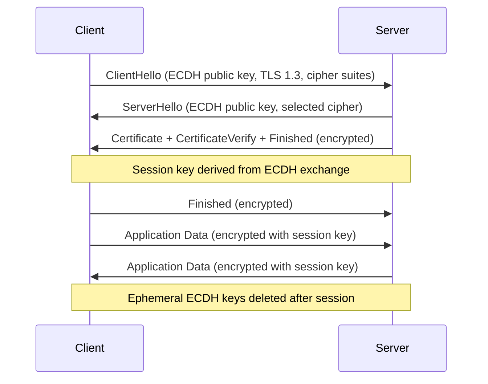

⚡ TL;DR - TLS configuration mistakes leave HTTPS connections
vulnerable despite the green padlock. Critical issues: TLS 1.0/1.1
enabled (BEAST, POODLE, DROWN attacks), weak cipher suites (RC4,
3DES, anonymous DH), certificates with SHA-1 or too-short keys,
and missing security headers (HSTS). Best practice: TLS 1.3 only
(or TLS 1.2 with strong ciphers), ECDSA certificates, HSTS with
`includeSubDomains` and `preload`, certificate rotation automation.

---

| #066 | Category: Security | Difficulty: ★★★ |
|:---|:---|:---|
| **Depends on:** | Security Fundamentals, Security Headers, OWASP Workshop, Network Fundamentals, Security Code Review | |
| **Used by:** | Certificate Pinning, TLS Migration, TLS Protocol Attacks, TLS 1.3 Design Rationale | |
| **Related:** | mTLS, PKI, Certificate Transparency, HSTS | |

---

### 🔥 The Problem This Solves

**WHY TLS MISCONFIGURATION IS COMMON:**

```
THE GREEN PADLOCK PROBLEM:
  HTTPS shows a padlock in the browser.
  But WHAT is protected and HOW depends on the TLS configuration.
  
  "We have HTTPS" is not a complete security statement.
  
  Same-looking padlock, different security levels:
  
  Configuration A (bad):
    TLS 1.0, cipher: RC4-MD5, RSA 1024-bit key
    - RC4: stream cipher, biased output, practical attacks exist
    - MD5: broken MAC (message authentication), forgeable
    - RSA 1024-bit: factorable with enough compute (broken by ~2010)
    - TLS 1.0: BEAST attack (2011), POODLE with fallback
    
  Configuration B (mediocre):
    TLS 1.2, cipher: AES128-SHA (non-ECDHE RSA)
    - Non-forward-secret: if server private key is later compromised,
      all past sessions can be decrypted from packet captures.
    - SHA-1: collision attacks demonstrated (SHAttered 2017)
    
  Configuration C (correct - 2024):
    TLS 1.3, ECDSA P-256 cert, auto-renew via Let's Encrypt/ACME
    - TLS 1.3: removed all weak ciphers, mandatory forward secrecy
    - ECDSA: faster, smaller keys (256 bits = RSA ~3072 bits security)
    - Auto-renew: no expired certificate risk (Equifax SSL inspection
      cert expired, creating a monitoring blind spot for 19 months)

THE EQUIFAX REMINDER:
  Equifax 2017: an SSL inspection device had an expired certificate.
  No one noticed because certificate monitoring was not in place.
  The device stopped inspecting traffic for 19 months.
  During those 19 months: the breach occurred.
  The attackers' traffic passed through undetected.
  
  Takeaway: certificate management = operational security.
  Expired certificates = monitoring blind spots.
  Automation (Let's Encrypt + ACME) reduces expiry risk.
```

---

### 📘 Textbook Definition

**TLS (Transport Layer Security):** A cryptographic protocol
providing authentication, confidentiality, and integrity for
network communications. Successor to SSL (deprecated).

**TLS versions and status:**
- SSL 2.0/3.0: **DEPRECATED/BROKEN** (POODLE, DROWN)
- TLS 1.0: **DEPRECATED** (RFC 8996, 2021) - BEAST attack
- TLS 1.1: **DEPRECATED** (RFC 8996, 2021)
- TLS 1.2: **Acceptable** with strong cipher suite selection
- TLS 1.3: **Current best practice** - mandatory forward secrecy,
  removes all weak algorithms, 0-RTT option

**Cipher suite:** A combination of: key exchange algorithm +
authentication algorithm + symmetric cipher + MAC algorithm.
Example: `TLS_ECDHE_RSA_WITH_AES_256_GCM_SHA384`
- ECDHE: key exchange (provides forward secrecy)
- RSA: authentication (server certificate signature)
- AES-256-GCM: symmetric cipher (AEAD - authentication + encryption)
- SHA384: HMAC/PRF algorithm

**Forward secrecy (Perfect Forward Secrecy - PFS):** Property
where session keys cannot be derived from the server's long-term
private key. Ephemeral Diffie-Hellman (DHE/ECDHE) provides PFS:
each session generates a new key pair, discarded after the session.
If the server's RSA/ECDSA private key is later stolen: past sessions
cannot be decrypted.

---

### ⏱️ Understand It in 30 Seconds

**One line:**
TLS configuration determines WHAT cryptography protects your HTTPS.
A green padlock with TLS 1.0 and RC4 is as secure as a good lock
on a paper door. Use TLS 1.3 (or TLS 1.2 with ECDHE+AES-GCM),
disable TLS 1.0/1.1/SSL, automate certificate renewal.

**One analogy:**
> TLS configuration is like choosing the type of lock on your door.
>
> TLS 1.0 + RC4: a combination lock where someone can guess the
> combination in 2 minutes (RC4 biases) or pick it in 30 seconds
> (BEAST attack). Still looks like a lock.
>
> TLS 1.3 + ECDSA + ECDHE: a high-security deadbolt. The key
> changes with every session (ECDHE = forward secrecy). Even if
> someone copies your master key later, they can't open locks
> from previous sessions.
>
> The visible padlock doesn't tell you which type of lock you have.
> An SSL Labs report (ssllabs.com/ssltest) tells you.

---

### 🔩 First Principles Explanation

**TLS 1.3 vs TLS 1.2:**

```
TLS 1.3 IMPROVEMENTS OVER TLS 1.2:

1. Removed weak algorithms:
   TLS 1.3 cipher suites:
     TLS_AES_128_GCM_SHA256
     TLS_AES_256_GCM_SHA384
     TLS_CHACHA20_POLY1305_SHA256
   All are AEAD (authenticated encryption with associated data).
   No: RC4, 3DES, CBC-mode, MD5, SHA-1 in cipher suites.
   
   TLS 1.2 allows these (depending on server config).
   TLS 1.3 refuses them entirely.

2. Forward secrecy mandatory:
   TLS 1.3: only ephemeral key exchange (ECDHE).
   TLS 1.2: allows RSA key exchange (no forward secrecy).
   If you have a TLS 1.2 server with RSA key exchange in use:
   anyone who captures traffic today + steals the private key later
   = can decrypt all captured sessions. No forward secrecy.
   TLS 1.3: impossible. Every session uses a unique ephemeral key.

3. Handshake is 1-RTT (vs. 2-RTT in TLS 1.2):
   Faster connection setup. 0-RTT mode for resumption
   (with replay attack caveats - 0-RTT is NOT for non-idempotent requests).

4. Removed features that added attack surface:
   No: session renegotiation (CRIME attack vector)
   No: compression (CRIME/BREACH attacks)
   No: RSA key exchange
   No: anonymous cipher suites (no authentication)
   
TLS 1.2 CORRECT CONFIGURATION (if TLS 1.3 not yet possible):
  Allowed cipher suites (strong ECDHE, AEAD only):
    TLS_ECDHE_ECDSA_WITH_AES_256_GCM_SHA384
    TLS_ECDHE_RSA_WITH_AES_256_GCM_SHA384
    TLS_ECDHE_ECDSA_WITH_CHACHA20_POLY1305_SHA256
    TLS_ECDHE_RSA_WITH_CHACHA20_POLY1305_SHA256
    TLS_ECDHE_ECDSA_WITH_AES_128_GCM_SHA256
    TLS_ECDHE_RSA_WITH_AES_128_GCM_SHA256
  
  Disallowed (remove from config):
    AES-CBC cipher suites (BEAST, Lucky 13 attacks)
    RC4 (statistical bias)
    3DES (SWEET32 birthday attack)
    Anonymous DH (no authentication)
    RSA key exchange (no forward secrecy)
    SHA-1 in MAC

CERTIFICATE BEST PRACTICES:
  
  Key type: ECDSA P-256 (preferred) or RSA 2048+ (minimum), RSA 4096 (strong)
  Why ECDSA: smaller key (256-bit ECDSA ≈ 3072-bit RSA), faster handshake
  
  Hash: SHA-256 or SHA-384. NOT SHA-1 (SHAttered 2017 collision).
  
  Duration: max 398 days (Apple/Google browser policy).
             Let's Encrypt: 90 days (encourages automation).
  
  Automation: use ACME protocol (Certbot, cert-manager in Kubernetes)
              Manual renewal = missed renewals = expired certs = outage.
  
  Monitor expiry: alert at 30 days, then 14 days, then 7 days remaining.
  (Equifax: no monitoring = 19-month expired cert blind spot)
```

---

### 🧪 Thought Experiment

**SCENARIO: Diagnosing a TLS misconfiguration finding**

```
SSL LABS REPORT FINDINGS (https://www.ssllabs.com/ssltest/):

Finding: Grade B (instead of A)
Reason: TLS 1.0 and 1.1 still supported

IMPACT:
  POODLE (SSL 3.0/TLS 1.0): attacker can downgrade connection to SSL 3.0
  via fallback (if SSL 3.0 also enabled), decrypt CBC ciphertext.
  BEAST (TLS 1.0): client-side attack, less relevant for 2024 but
  demonstrates TLS 1.0 design flaw with CBC mode.
  Compliance: PCI DSS 3.2+ requires TLS 1.2 minimum (TLS 1.0/1.1 prohibited).

FIX (nginx):
  ssl_protocols TLSv1.2 TLSv1.3;  # Remove TLSv1 and TLSv1.1
  
  ssl_ciphers ECDHE-ECDSA-AES128-GCM-SHA256:ECDHE-RSA-AES128-GCM-SHA256:
              ECDHE-ECDSA-AES256-GCM-SHA384:ECDHE-RSA-AES256-GCM-SHA384:
              ECDHE-ECDSA-CHACHA20-POLY1305:ECDHE-RSA-CHACHA20-POLY1305:
              DHE-RSA-AES128-GCM-SHA256:DHE-RSA-AES256-GCM-SHA384;
  
  ssl_prefer_server_ciphers off;  # For TLS 1.3: client picks cipher
  
  # HSTS: tell browsers to always use HTTPS
  add_header Strict-Transport-Security 
    "max-age=63072000; includeSubDomains; preload" always;

FIX (Apache):
  SSLProtocol all -SSLv3 -TLSv1 -TLSv1.1
  SSLCipherSuite ECDHE-ECDSA-AES128-GCM-SHA256:ECDHE-RSA-AES128-GCM-SHA256...
  SSLHonorCipherOrder off

JAVA SPRING BOOT (application.properties):
  server.ssl.protocol=TLS
  server.ssl.enabled-protocols=TLSv1.2,TLSv1.3
  server.ssl.ciphers=TLS_ECDHE_ECDSA_WITH_AES_256_GCM_SHA384,...
```

---

### 🧠 Mental Model / Analogy

> TLS cipher suites are like choosing the type of safe deposit box.
>
> AES-256-GCM: a modern, high-security box with tamper detection.
> RC4: a box with a known manufacturer defect - given enough tries,
>       someone can open it without the key.
> 3DES: an old box. Still reasonably secure but slow and limited key size.
>       Recent analysis: birthday attack at high volumes (SWEET32).
>
> Forward secrecy (ECDHE): each session gets a new, unique box key
> that's destroyed after use. If someone steals your master key:
> they can't open any past sessions (the session keys no longer exist).
>
> Without forward secrecy (RSA key exchange): all sessions use keys
> derived from your long-term master key. Steal the master key:
> decrypt every stored past session (from packet captures).
>
> Intelligence agencies (and well-resourced attackers) routinely
> store encrypted HTTPS traffic for possible future decryption
> ("harvest now, decrypt later"). Forward secrecy defeats this strategy.

---

### 📶 Gradual Depth - Five Levels

**Level 1 - What it is (anyone can understand):**
TLS is what makes HTTPS work. But not all HTTPS is equally secure. Old versions (TLS 1.0, 1.1) have known attacks. Weak cipher combinations can be cracked. The certificate itself can have a short key or weak hash. Best practice: configure your web server to use TLS 1.2+ with only strong ciphers, and automate certificate renewal so it never expires.

**Level 2 - How to use it (junior developer):**
Test your TLS config at ssllabs.com/ssltest - aim for A or A+. In nginx: set `ssl_protocols TLSv1.2 TLSv1.3` (remove TLSv1, TLSv1.1). For cipher suites: use Mozilla SSL Configuration Generator (ssl-config.mozilla.org) to get correct values for your server. Add HSTS header: `Strict-Transport-Security: max-age=63072000; includeSubDomains; preload`. Use Let's Encrypt with Certbot for free certificates with automatic renewal.

**Level 3 - How it works (mid-level engineer):**
TLS 1.3 is simpler and more secure: only 3 AEAD cipher suites (no negotiation of weak options), mandatory ephemeral key exchange (PFS), 1-RTT handshake. TLS 1.2 requires careful cipher suite selection: ECDHE for forward secrecy, GCM/ChaCha20-Poly1305 for AEAD (not CBC). Why avoid CBC in TLS 1.2: CBC mode requires careful padding, and BEAST/Lucky 13/POODLE demonstrated practical padding oracle attacks. AEAD (GCM, Poly1305) provides both encryption and authentication in one pass, eliminating padding oracle attack surface. For certificate selection: ECDSA P-256 certificates have smaller key sizes, faster signature verification, and equivalent security to RSA-3072.

**Level 4 - Why it was designed this way (senior/staff):**
TLS 1.3 (RFC 8446, 2018) was designed after a decade of TLS 1.2 attacks: BEAST (2011), CRIME (2012), BREACH (2013), POODLE (2014), FREAK (2015), LogJam (2015), DROWN (2016). Each attack exploited a feature or algorithm that was "optional" in TLS 1.2 but present in many real-world configurations. The TLS 1.3 design philosophy: remove all optional weak algorithms, rather than trying to configure them away on individual servers. 0-RTT (zero round-trip resumption) is a performance feature that allows replaying early data, which creates replay attack risk for non-idempotent requests. The spec recommends: only use 0-RTT for idempotent requests (GET, HEAD), never for POST/PUT/DELETE.

**Level 5 - Mastery (distinguished engineer):**
mTLS (mutual TLS): both client and server present certificates. Used for service-to-service authentication in microservices (Kubernetes, Istio service mesh). Both sides authenticate, preventing rogue services. Certificate pinning: the client validates that the server's certificate matches a specific known certificate or public key (not just that it's signed by any trusted CA). Defeats CA compromise attacks (DigiNotar 2011: CA compromised, rogue *.google.com cert issued). Pinning is standard in mobile apps (HPKP header was added and removed from browsers - too risky for web; still used in mobile). Certificate Transparency (CT): all publicly-trusted CAs must log certificates to public CT logs. Browsers require CT proofs in TLS handshake. Allows detection of rogue certificates issued by compromised CAs.

---

### ⚙️ How It Works (Mechanism)

```
TLS 1.3 HANDSHAKE (1-RTT):

  Client                          Server
    |                               |
    |-- ClientHello --------------→ |  (client key share, supported ciphers)
    |                               |
    |← ServerHello --------------- |  (selected cipher, server key share)
    |← {Certificate} ------------ |  (encrypted with derived key)
    |← {CertificateVerify} ------ |
    |← {Finished} --------------- |
    |                               |
    |-- {Finished} ---------------→ |
    |                               |
    |== Application Data ======== |  (encrypted)
    
  TOTAL: 1 round trip (ClientHello → ServerHello+data → Finished → App data)
  
  TLS 1.2: 2 round trips before application data
  TLS 1.3: 1 round trip
  0-RTT: 0 round trips (resumption - replay risk for non-idempotent)

FORWARD SECRECY (ECDHE KEY EXCHANGE):

  Session 1 (Mon):
    Server generates: ephemeral key pair (e1_pub, e1_priv)
    Session key derived from: e1_priv + client's ephemeral key
    Session ends: e1_priv is DELETED from memory
  
  Session 2 (Tue):
    Server generates: new ephemeral key pair (e2_pub, e2_priv)
    Different session key
  
  If server's long-term RSA private key is stolen later:
    Session 1 key: cannot be derived (e1_priv was deleted)
    Session 2 key: cannot be derived (e2_priv was deleted)
    All past sessions: safe.
    
  Without ECDHE (RSA key exchange):
    Session 1 key: derived from server's RSA private key
    If RSA private key stolen: ALL past sessions can be decrypted.
```



---

### 💻 Code Example

**nginx: production TLS 1.3 configuration:**

```nginx
# /etc/nginx/conf.d/ssl-hardening.conf
# Mozilla SSL Configuration Generator: "Modern" profile

server {
    listen 443 ssl http2;
    server_name example.com;
    
    # Certificate (use Let's Encrypt / cert-manager)
    ssl_certificate     /etc/letsencrypt/live/example.com/fullchain.pem;
    ssl_certificate_key /etc/letsencrypt/live/example.com/privkey.pem;
    
    # TLS versions: TLS 1.2 minimum, TLS 1.3 preferred
    ssl_protocols TLSv1.2 TLSv1.3;
    
    # Cipher suites: ECDHE + AEAD only (TLS 1.2)
    # TLS 1.3 cipher suites are automatically included
    ssl_ciphers ECDHE-ECDSA-AES128-GCM-SHA256:ECDHE-RSA-AES128-GCM-SHA256:ECDHE-ECDSA-AES256-GCM-SHA384:ECDHE-RSA-AES256-GCM-SHA384:ECDHE-ECDSA-CHACHA20-POLY1305:ECDHE-RSA-CHACHA20-POLY1305;
    
    # Let client choose cipher for TLS 1.3
    ssl_prefer_server_ciphers off;
    
    # OCSP stapling: server provides cert revocation status
    ssl_stapling on;
    ssl_stapling_verify on;
    ssl_trusted_certificate /etc/letsencrypt/live/example.com/chain.pem;
    resolver 1.1.1.1 valid=300s;
    resolver_timeout 5s;
    
    # Session tickets: disable for PFS (tickets derive from session key)
    # OR rotate session ticket key every hour
    ssl_session_tickets off;
    
    # DH parameters (for DHE cipher suites in TLS 1.2)
    ssl_dhparam /etc/nginx/dhparam.pem;  # openssl dhparam -out dhparam.pem 4096
    
    # Security headers
    add_header Strict-Transport-Security
        "max-age=63072000; includeSubDomains; preload" always;
    add_header X-Content-Type-Options nosniff always;
    add_header X-Frame-Options DENY always;
    
    location / {
        # ... application proxy
    }
}

# Redirect HTTP to HTTPS
server {
    listen 80;
    server_name example.com;
    return 301 https://$host$request_uri;
}
```

---

### ⚖️ Comparison Table

| Cipher Suite | Forward Secrecy | AEAD | Status |
|:---|:---|:---|:---|
| `TLS_AES_256_GCM_SHA384` (TLS 1.3) | Yes (mandatory) | Yes | Best |
| `ECDHE-RSA-AES256-GCM-SHA384` (TLS 1.2) | Yes (ECDHE) | Yes (GCM) | Good |
| `ECDHE-RSA-AES256-CBC-SHA384` (TLS 1.2) | Yes | No (CBC) | Avoid |
| `AES256-GCM-SHA384` (TLS 1.2, RSA KX) | No | Yes | Avoid |
| `AES128-SHA` (TLS 1.2) | No | No | Disable |
| `RC4-SHA` | No | No | Disabled |
| `TLS_RSA_*` (RSA key exchange) | No | Varies | Remove |

---

### ⚠️ Common Misconceptions

| Misconception | Reality |
|:---|:---|
| "We use HTTPS, so we're secure from network attacks." | HTTPS with TLS 1.0 and RC4 is not meaningfully secure against modern attackers. The padlock icon indicates the protocol is in use, not that it's configured securely. TLS 1.0 is vulnerable to BEAST and POODLE downgrade attacks. RC4 has statistical biases exploitable in practice. A properly configured TLS 1.3 connection and a misconfigured TLS 1.0/RC4 connection both show the padlock. Use SSL Labs (ssllabs.com/ssltest) to measure your actual security grade, not the presence of HTTPS. PCI DSS explicitly requires TLS 1.2 minimum - TLS 1.0/1.1 are not compliant. |
| "The certificate is 2048-bit RSA, which is strong enough forever." | 2048-bit RSA is currently considered sufficient (through ~2030 according to NIST) but is not future-proof. The recommendation is migrating to ECDSA P-256 or P-384 for new certificates. ECDSA provides equivalent security with much smaller key sizes: 256-bit ECDSA ≈ 3072-bit RSA security. Smaller keys mean faster TLS handshakes and smaller certificate size (reduces bandwidth). Additionally: the certificate hash algorithm matters. SHA-1 certificates were deprecated after the SHAttered collision attack (2017). Use SHA-256 or SHA-384 in the certificate signature. "We have a 2048-bit key" doesn't tell you about the signature hash algorithm, which is an independent security parameter. |

---

### 🚨 Failure Modes & Diagnosis

**Diagnosing TLS issues:**

```
TESTING TOOLS:

1. SSL Labs Online Test (no setup required):
   https://www.ssllabs.com/ssltest/analyze.html?d=yourserver.com
   Grades A+ to F. Shows: protocol versions, cipher suites, HSTS, certificate details.
   Target: A+ (HSTS preloaded, no weak ciphers, TLS 1.2/1.3 only)

2. nmap TLS scan:
   nmap --script ssl-enum-ciphers -p 443 yourserver.com
   Lists all supported cipher suites and TLS versions.
   Look for: TLSv1.0, TLSv1.1, RC4, 3DES, CBC suites, anonymous DH.

3. testssl.sh (command-line, local):
   docker run --rm drwetter/testssl.sh yourserver.com
   Comprehensive: checks all protocols, ciphers, vulnerabilities
   (BEAST, POODLE, HEARTBLEED, CRIME, BREACH, etc.)

4. openssl s_client (quick check):
   openssl s_client -connect yourserver.com:443 -tls1
   (Tries to connect with TLS 1.0 - should fail with "handshake failure")
   
   openssl s_client -connect yourserver.com:443 -tls1_3
   (Should succeed with TLS 1.3)
   
   openssl s_client -connect yourserver.com:443 | grep -i "cipher\|protocol"

CERTIFICATE EXPIRY MONITORING:
  echo | openssl s_client -connect yourserver.com:443 2>/dev/null |
    openssl x509 -noout -enddate
  → notAfter=Mar 15 00:00:00 2025 GMT
  
  Add to monitoring: alert 30 days before expiry.
  
  Prometheus with blackbox_exporter:
    probe_ssl_earliest_cert_expiry metric
    Alert: probe_ssl_earliest_cert_expiry - time() < 30 * 24 * 60 * 60
```

---

### 🔗 Related Keywords

**Prerequisites:**
- `Security Fundamentals` - cryptography basics, CIA triad
- `Security Headers` - HSTS, HPKP
- `Network Fundamentals` - TCP/IP, HTTP

**Builds on this:**
- `Certificate Pinning` - pinning specific certificates/keys
- `TLS 1.2 to 1.3 Migration` - migration guide
- `TLS Protocol Attacks` - historical attacks and their impact

---

### 📌 Quick Reference Card

```
┌──────────────────────────────────────────────────────────┐
│ DISABLE      │ SSL 2/3, TLS 1.0, TLS 1.1                │
│ ENABLE       │ TLS 1.2 (with ECDHE+AEAD), TLS 1.3       │
├──────────────┼───────────────────────────────────────────┤
│ BAD CIPHERS  │ RC4, 3DES, CBC, RSA key exchange           │
│ GOOD CIPHERS │ ECDHE+AES-GCM, ECDHE+ChaCha20-Poly1305   │
├──────────────┼───────────────────────────────────────────┤
│ CERT         │ ECDSA P-256 or RSA 2048+, SHA-256+        │
│ AUTO RENEW   │ Let's Encrypt + Certbot/cert-manager      │
├──────────────┼───────────────────────────────────────────┤
│ HEADERS      │ HSTS: max-age=63072000; includeSubDomains │
│              │ (add preload if ready for HSTS preload list)│
├──────────────┼───────────────────────────────────────────┤
│ TEST TOOLS   │ ssllabs.com/ssltest (grade report)        │
│              │ testssl.sh (docker, comprehensive)        │
│              │ nmap --script ssl-enum-ciphers            │
└──────────────────────────────────────────────────────────┘
```

---

### 💎 Transferable Wisdom

**Reusable Engineering Principle:**
"Default configurations are written for compatibility, not security."
TLS servers default to supporting old protocol versions and cipher suites
to maintain compatibility with old clients. This means the default
configuration is "as secure as the weakest thing you might connect to."
For a production server: you choose your security level by explicitly
configuring what you support.
This principle applies broadly:
- Database defaults: PostgreSQL defaults to MD5 password hashing (use scram-sha-256).
- HTTP server defaults: nginx serves .git directories unless explicitly blocked.
- Cloud defaults: S3 buckets defaulted to public read (changed in 2022).
- Framework defaults: Spring Boot actuator endpoints are publicly accessible by default in some versions.
The operational practice: after deploying any service,
run a security-focused review of its defaults. Assume defaults
optimize for compatibility and functionality, not security.
The Mozilla SSL Configuration Generator (ssl-config.mozilla.org)
exists precisely because the right TLS defaults require expertise
that most engineers shouldn't need to derive from first principles.
Use curated reference configurations, then verify with SSL Labs.

---

### 💡 The Surprising Truth

The Logjam attack (2015) revealed that many TLS servers and
clients were vulnerable to a Diffie-Hellman downgrade attack
because they shared the same pre-computed 512-bit DH parameters.
The attack was feasible because of a historical quirk: US export
controls in the 1990s required "export-grade" cryptography to use
only 512-bit keys. These export cipher suites were kept in TLS
implementations for backwards compatibility, 20 years later.
The FREAK attack (2015) was the same story for RSA: 512-bit
export-grade RSA, kept for 20+ years of backwards compatibility.
Both attacks: an active MITM could force the connection to use
512-bit "export grade" keys, which could be broken in real-time
by the researchers (512-bit RSA/DH factored in ~7 hours in 2015).
Two 20-year-old backwards compatibility concessions in TLS,
still exploitable in 2015. Modern servers with export ciphers
disabled were not vulnerable. But the fraction of servers that
still had export ciphers "for compatibility" created a practical
MITM attack against any client connecting through a malicious
network.
The lesson: backwards compatibility debt in security protocols
accumulates until it becomes an active vulnerability.
TLS 1.3 broke backwards compatibility deliberately - removing
export ciphers, session renegotiation, compression. The feature
removals were security improvements.

---

### ✅ Mastery Checklist

**You've mastered this when you can:**
1. **EXPLAIN** forward secrecy: why ECDHE makes past sessions undecryptable
   even if the server's long-term private key is stolen.
2. **CONFIGURE** nginx/Apache for TLS 1.3 (and TLS 1.2 with ECDHE+GCM),
   using the correct `ssl_protocols` and `ssl_ciphers` directives.
3. **TEST** a TLS configuration using SSL Labs and interpret the results:
   what findings cause grade degradation and how to fix them.
4. **EXPLAIN** TLS 1.3's improvements over TLS 1.2: fewer cipher suites,
   mandatory PFS, 1-RTT handshake, removed CBC/export options.

---

### 🎯 Interview Deep-Dive

**Q: What are TLS best practices? What is forward secrecy and why does it matter?**

*Why they ask:* HTTPS is table stakes; configuring it securely is not.
Tests whether candidate understands cryptography choices, not just
"we use HTTPS."

*Strong answer covers:*
- Protocol versions: TLS 1.2 minimum (PCI DSS requirement). TLS 1.3 preferred.
  Disable SSL 3.0, TLS 1.0, TLS 1.1 (deprecated RFC 8996, 2021).
- Cipher suites: ECDHE for forward secrecy, AES-GCM or ChaCha20-Poly1305 for AEAD.
  Remove RC4, 3DES, CBC mode, RSA key exchange, anonymous DH.
- Forward secrecy: ECDHE generates unique ephemeral keys per session, discarded after.
  Even if server's private key stolen later: past session traffic cannot be decrypted.
  Without PFS: stored packet captures can be decrypted retroactively.
- TLS 1.3: mandatory PFS (no RSA key exchange), only AEAD ciphers, 1-RTT.
  Simpler, faster, more secure.
- Certificate: ECDSA P-256 (smaller + faster than RSA 2048), SHA-256+, max 398 days.
  Auto-renew with Let's Encrypt/cert-manager (Equifax: 19-month expired cert blind spot).
- HSTS: `max-age=63072000; includeSubDomains` to prevent HTTP downgrade.
- Testing: SSL Labs Grade A+ target; testssl.sh for CI/CD.