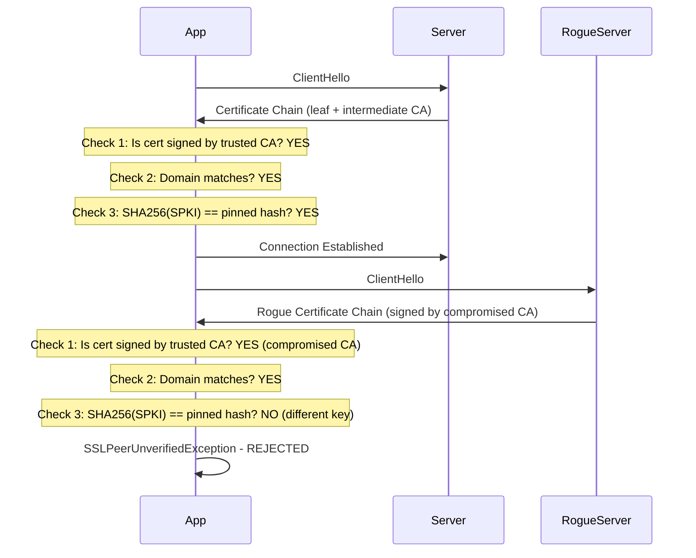

⚡ TL;DR - Certificate pinning makes a client reject TLS certificates
unless they match a specific expected certificate or public key. This
defeats CA-compromise MITM attacks (even a trusted CA issuing a
rogue cert for your domain won't be accepted). Used in mobile apps
and high-security services. Risk: if the pinned certificate expires or
is rotated without updating the pin, the app breaks. Best practice:
pin the intermediate CA's public key (not the leaf cert), and maintain
a backup pin.

---

| #067 | Category: Security | Difficulty: ★★★ |
|:---|:---|:---|
| **Depends on:** | Security Fundamentals, Security Headers, Network Fundamentals, TLS Configuration, Security Code Review | |
| **Used by:** | Certificate Transparency, TLS Protocol Attacks, TLS 1.3 Design Rationale | |
| **Related:** | TLS Configuration, PKI, HPKP (deprecated for web), CT Logs | |

---

### 🔥 The Problem This Solves

**WHY CERTIFICATE PINNING EXISTS:**

```
THE CA COMPROMISE PROBLEM:

NORMAL HTTPS TRUST MODEL:
  Browser trusts: ~150 root Certificate Authorities (CAs).
  Any CA can issue a certificate for ANY domain.
  
  If a CA is compromised:
    Attacker can get rogue certificate for "your-bank.com"
    signed by the compromised CA.
    
    Browser: "Is this cert signed by a trusted CA?" → Yes.
    Browser: "Is the domain correct?" → Yes.
    Browser: TRUSTS the connection.
    MITM succeeds.

REAL CA COMPROMISES:
  DigiNotar (2011): Iranian hackers compromised a Dutch CA.
  Issued rogue *.google.com certificate.
  Used to MITM Gmail for Iranian users (~300,000 users affected).
  Browser trust revoked → DigiNotar bankrupt within weeks.
  
  Comodo (2011): Rogue certs for google.com, yahoo.com, etc.
  
  Trust WoSign / StartCom (2016): Backdating certs, policy violations.
  Browser trust revoked.

CERTIFICATE PINNING: SPECIFIC CERTIFICATE/KEY REQUIRED
  
  Without pinning:
    Client: "Is this cert signed by ANY trusted CA?"
    If DigiNotar was trusted and issued rogue cert → MITM succeeds.
  
  With pinning:
    Client: "Is this cert's public key == the pinned public key?"
    Rogue cert from DigiNotar: different public key → REJECTED.
    MITM fails even with a valid CA signature.
  
  The rogue cert's public key ≠ your real cert's public key.
  The private key is what you control. No attacker has your private key.
  So they cannot create a cert that matches your pinned public key.

WHAT TO PIN:
  Option 1: Leaf certificate PIN (risky)
    Pin the certificate's public key hash.
    Problem: certificates expire (typically 1 year). When you
    renew: new certificate, new key → pin broken → app can't connect.
    
  Option 2: Intermediate CA PIN (recommended)
    Pin the intermediate CA's public key that signs your leaf cert.
    Your cert changes (renewal): still signed by same intermediate → pin valid.
    Risk: intermediate CA rotation requires app update. Less frequent.
    
  Option 3: Multiple pins (backup pin)
    Primary pin: your intermediate CA.
    Backup pin: another intermediate CA (from same provider or backup provider).
    If primary cert revoked or CA rotated: backup pin accepts new cert.
    Prevents "only one pin + rotation = everyone locked out" scenario.
```

---

### 📘 Textbook Definition

**Certificate Pinning:** A security technique where a client
application hardcodes or otherwise restricts the acceptable
TLS certificates or public keys for a specific connection.
Rather than accepting any certificate signed by any trusted CA,
the client accepts only certificates matching the pinned value.

**What can be pinned:**
- **Leaf certificate:** The specific certificate (DER format, fingerprint). Most restrictive, highest maintenance burden.
- **Public key:** The certificate's public key (Subject Public Key Info - SPKI hash). Key rotation without cert reissue doesn't break pins.
- **Intermediate CA:** The CA that signs the leaf certificate. All certs signed by that CA are accepted. Lower maintenance burden.

**HPKP (HTTP Public Key Pinning):** A browser mechanism via
response header (`Public-Key-Pins`) that instructed browsers
to pin a site's keys. Deprecated and removed from browsers
in 2019 due to abuse risk (one mistake could lock users out).

**Android/iOS pinning:** Done in app code (OkHttp `CertificatePinner`,
NSURLSession `pinnedCertificates`). Standard practice for
high-security mobile applications.

**Certificate Transparency (CT):** Complementary to pinning.
CAs must log all issued certificates to public CT logs.
Allows detection of rogue certs before app release.
Does not prevent MITM if pinning is not implemented.

---

### ⏱️ Understand It in 30 Seconds

**One line:**
Certificate pinning says "I only trust THIS specific public key
for connections to this server" - bypassing the entire CA trust
hierarchy. Rogue certs from compromised CAs are rejected because
they use a different private key (which you don't have).

**One analogy:**
> Normal TLS: you trust anyone whose signature was notarized
> by any notary in the world.
>
> Certificate pinning: you only trust people who carry
> YOUR specific ID card (with your exact photo and key).
>
> A fraudster can get a notarized ID with your name.
> But they can't make an ID with YOUR face (your public key).
> Even with a legitimate notary's stamp (trusted CA):
> the face doesn't match → rejected.
>
> The risk: if YOU change your ID (rotate your certificate):
> you must update the photo in the expected ID (update the pin).
> If you forget: your own legitimate ID gets rejected.
> (This is the operational risk of certificate pinning.)

---

### 🔩 First Principles Explanation

**Certificate pinning in Android (OkHttp):**

```
GENERATE PIN HASH:
  # Extract SPKI (Subject Public Key Info) fingerprint
  # from your certificate:
  
  openssl s_client -connect yourserver.com:443 < /dev/null 2>/dev/null | \
    openssl x509 -pubkey -noout | \
    openssl pkey -pubin -outform der | \
    openssl dgst -sha256 -binary | \
    base64
  
  Output: "abc123base64=="  ← This is your pin (sha256/abc123base64==)

ANDROID - OkHttp CertificatePinner:
  
  import okhttp3.CertificatePinner
  import okhttp3.OkHttpClient
  
  val certificatePinner = CertificatePinner.Builder()
      .add(
          "api.yourserver.com",
          "sha256/primaryPinHash==",   // Primary pin (intermediate CA)
          "sha256/backupPinHash=="     // Backup pin (different CA or future cert)
      )
      .build()
  
  val client = OkHttpClient.Builder()
      .certificatePinner(certificatePinner)
      .build()
  
  // If server presents a cert NOT matching any pin:
  // SSLPeerUnverifiedException thrown.
  // No fallback to system trust - connection refused.

IOS - NSURLSession with custom ServerTrustEvaluator:
  
  // Using Alamofire (popular networking library):
  import Alamofire
  
  let pinningEvaluator = PublicKeysTrustEvaluator(
      keys: [myPublicKey],
      performDefaultValidation: true,  // Also validate cert chain
      validateHost: true
  )
  
  let session = Session(serverTrustManager: ServerTrustManager(
      allHostsMustBeEvaluated: true,
      evaluators: ["api.yourserver.com": pinningEvaluator]
  ))

WEB: SSL_CERT_FILE ENVIRONMENT OR NETWORK PROXY PINNING:
  
  Server-to-server calls can pin too:
  
  Python - requests with custom cert verification:
    import requests
    
    # Pin by specifying exact CA bundle (your intermediate CA only)
    response = requests.get(
        "https://internal-api.example.com",
        verify="/path/to/pinned-ca-bundle.pem"  # Only accepts this CA
    )
  
  Java - custom TrustManager that checks public key:
    // See TrustManager implementation that compares
    // leaf certificate's public key bytes to expected hash

WHAT PINS TO USE:
  
  Scenario: yourserver.com cert is signed by:
    Root CA: DigiCert Global Root G2
    Intermediate CA: DigiCert TLS RSA SHA256 2020 CA1
    Leaf cert: yourserver.com (renewed annually)
  
  BAD: Pin the leaf cert fingerprint
    - When you renew (every year): new cert, new fingerprint
    - All deployed app versions break immediately
    - Requires emergency update to all mobile app installations
  
  GOOD: Pin the intermediate CA's SPKI
    - All certs signed by "DigiCert TLS RSA SHA256 2020 CA1" accepted
    - Your cert renews: still signed by same intermediate → pin valid
    - Intermediate CA changes: app update needed (less frequent)
  
  BACKUP PIN:
    Primary: DigiCert TLS RSA SHA256 2020 CA1 SPKI
    Backup: Let's Encrypt R3 SPKI (alternative CA if switching providers)
    If DigiCert intermediate is revoked/compromised: switch to Let's Encrypt,
    the backup pin accepts the new cert without requiring app update.
```

---

### 🧪 Thought Experiment

**SCENARIO: DigiNotar-style attack with and without pinning**

```
WITHOUT CERTIFICATE PINNING:

  Year 2011: Iranian government compromises DigiNotar CA.
  Attacker generates rogue cert for *.google.com signed by DigiNotar.
  DigiNotar was a trusted root CA in all browsers at the time.
  
  Iranian ISP deploys MITM:
    User navigates to gmail.com.
    ISP intercepts connection.
    ISP presents rogue *.google.com cert (signed by DigiNotar).
    Chrome: "Is this cert signed by a trusted CA?" YES (DigiNotar trusted).
    Chrome: "Is the domain correct?" YES (*.google.com).
    Chrome: Shows green padlock.
    ISP decrypts and re-encrypts Gmail traffic.
    ~300,000 users' Gmail data intercepted.

WITH CERTIFICATE PINNING IN GOOGLE CHROME:

  Google Chrome had hardcoded certificate pinning for google.com.
  Chrome's pin: "I only accept Google's own intermediate CA public key."
  
  ISP presents rogue cert: signed by DigiNotar (not Google's CA).
  Chrome: "Does this cert match my pinned public key?" → NO.
  Chrome: "Certificate mismatch - connection REFUSED."
  
  Chrome's certificate pinning detected the DigiNotar rogue cert
  within days of its issuance, despite DigiNotar being a trusted CA.
  This is what triggered the DigiNotar investigation and revocation.

TIMELINE OF DETECTION:
  The rogue cert was issued in July 2011.
  A Chrome user in Iran noticed a certificate warning (unusual for Chrome).
  Reported it. Google investigated. Traced to DigiNotar compromise.
  DigiNotar was removed from trusted root stores in all browsers
  within weeks. DigiNotar went bankrupt shortly after.

LESSON:
  Certificate pinning in Chrome:
    Prevented the MITM for Chrome users.
    Served as an early detection mechanism.
    Demonstrated real-world impact of CA compromise.
  
  For mobile applications: implement pinning for all
  connections to your own API endpoints.
  For browser-based apps: use HSTS preloading and
  monitor Certificate Transparency logs for rogue certs
  (CT is the modern equivalent of pinning for browsers).
```

---

### 🧠 Mental Model / Analogy

> Certificate pinning is like a bank employee who is trained to
> recognize the bank president's actual signature.
>
> Normal process: "Is this document notarized by any licensed
> notary?" → Yes → Accepted.
>
> CA compromise attack: A fraudster gets a licensed notary to
> notarize their fake document (rogue CA signs rogue cert).
> Normal process: "Notarized?" → Yes → Accepted. MITM succeeds.
>
> With pinning: "Does this match the president's ACTUAL signature
> style?" The bank employee has been specifically trained to
> recognize the real signature. The fraudster can get it notarized,
> but the specific signature doesn't match.
>
> The operational risk: if the bank president changes their
> signature style (certificate rotation), the employee needs
> retraining (app update with new pin).
> If they don't get retrained in time: the legitimate document
> gets rejected too. This is the "pin rotation disaster."

---

### 📶 Gradual Depth - Five Levels

**Level 1 - What it is (anyone can understand):**
Normally, your app accepts any HTTPS certificate from any trusted certificate authority. Certificate pinning means your app only accepts certificates from a SPECIFIC trusted certificate authority or with a SPECIFIC public key. If a hacker compromises a certificate authority and creates a fake certificate for your server, your app rejects it because it doesn't match the pinned key.

**Level 2 - How to use it (junior developer):**
In Android/OkHttp: use `CertificatePinner` with SHA-256 hashes of the intermediate CA's public key. Always include a backup pin from a second CA. Pin the intermediate CA (not the leaf certificate) to survive annual certificate renewals. Generate the pin hash with openssl: `openssl s_client -connect host:443 | openssl x509 -pubkey -noout | openssl pkey -pubin -outform der | openssl dgst -sha256 -binary | base64`.

**Level 3 - How it works (mid-level engineer):**
During TLS handshake, the server presents its certificate chain (leaf → intermediate CA → root CA). Certificate pinning intercepts this: the client extracts the SPKI (Subject Public Key Info) from one of the certificates in the chain and compares its SHA-256 hash to the stored pin. If no certificate in the chain matches any pin: connection refused. Pinning the intermediate CA works because: (1) leaf cert changes on renewal, but intermediate CA remains the same for years; (2) intermediate SPKI is stable until the CA issues new keys. If the intermediate CA is compromised: pinned apps won't connect to a rogue cert from that CA with a different key, but they would trust a rogue cert using that same intermediate CA's valid key.

**Level 4 - Why it was designed this way (senior/staff):**
The CA system has a fundamental problem: any of ~150 trusted root CAs can issue certificates for any domain. This design choice (for operational flexibility) creates a systemic vulnerability. Each CA is a point of failure for the entire PKI. Certificate Transparency (CT) is the browser ecosystem's response: all certs must be logged, so rogue issuance is detectable. HPKP was the browser's implementation of certificate pinning (headers) - it was retired because one mistake in header configuration could permanently lock users out (no recovery without deploying a new header). Certificate Transparency + Google Chrome's aggressive Certificate Transparency enforcement effectively provides a better-than-HPKP solution for web browsers. Mobile apps and high-security API clients still use explicit certificate pinning because CT cannot prevent real-time MITM (only post-hoc detection).

**Level 5 - Mastery (distinguished engineer):**
Advanced pinning: dynamic pinning (the app fetches pins from a secure endpoint over a pre-pinned connection, allowing pin rotation without app update). Used by Fastmail and similar high-security apps. Certificate Transparency as defense: subscribe to CT log monitors (crt.sh, Google CT Policy), alert on new certs issued for your domain outside your CA. This catches rogue issuance before an attacker can deploy them. Convergence (retired) and TACK were academic proposals to replace the CA system with a gossip-based trust model. The ecosystem settled on CT + pinning as the practical solution. At scale: enterprise MITM inspection (e.g., Zscaler, BlueCoat) deliberately intercepts TLS connections using a corporate root CA installed on all devices. Certificate pinning in enterprise mobile apps must account for this: either include the enterprise CA in the allowed pins, or configure a "debug" mode that bypasses pinning on managed devices.

---

### ⚙️ How It Works (Mechanism)

```
TLS HANDSHAKE WITH CERTIFICATE PINNING:

  Normal TLS:
    Server → Certificate Chain (leaf + intermediates)
    Client: 1. Validate cert chain up to trusted root
            2. Check domain matches
            3. ACCEPT

  With Certificate Pinning:
    Server → Certificate Chain (leaf + intermediates)
    Client: 1. Validate cert chain up to trusted root (same)
            2. Check domain matches (same)
            3. For each cert in chain:
               compute SHA-256 of SPKI
               compare to set of pinned hashes
            4. If ANY cert matches a pin: ACCEPT
            5. If NONE match: REJECT (SSLPeerUnverifiedException)
  
  Rogue cert (from compromised CA):
    Server → Rogue Certificate Chain (leaf + rogue intermediate)
    Client: Step 1-2: PASS (rogue cert signed by trusted CA, domain matches)
            Step 3: Rogue cert's SPKI ≠ any pinned hash
            Step 5: REJECTED.
```



---

### 💻 Code Example

**Android OkHttp pinning with backup - production pattern:**

```kotlin
import okhttp3.CertificatePinner
import okhttp3.OkHttpClient
import java.util.concurrent.TimeUnit

object HttpClientFactory {
    
    // Generate pin hashes via:
    // openssl s_client -connect api.yourserver.com:443 < /dev/null 2>/dev/null \
    //   | openssl x509 -pubkey -noout \
    //   | openssl pkey -pubin -outform der \
    //   | openssl dgst -sha256 -binary | base64
    
    // Pin the INTERMEDIATE CA (not leaf cert):
    // intermediate cert hash in the server's cert chain
    private const val PRIMARY_PIN = "sha256/AAAAAAAAAAAAAAAAAAAAAAAAAAAAAAAAAAAAAAAAAAA="
    
    // Backup pin: alternative CA or future cert SPKI
    private const val BACKUP_PIN = "sha256/BBBBBBBBBBBBBBBBBBBBBBBBBBBBBBBBBBBBBBBBBBB="
    
    fun create(): OkHttpClient {
        val certificatePinner = CertificatePinner.Builder()
            .add("api.yourserver.com", PRIMARY_PIN, BACKUP_PIN)
            .add("auth.yourserver.com", PRIMARY_PIN, BACKUP_PIN)
            .build()
        
        return OkHttpClient.Builder()
            .certificatePinner(certificatePinner)
            .connectTimeout(10, TimeUnit.SECONDS)
            .readTimeout(30, TimeUnit.SECONDS)
            // Handle pin failure gracefully:
            // If SSLPeerUnverifiedException: report to backend,
            // DO NOT silently bypass - this may be an MITM attack
            .build()
    }
}
```

---

### ⚖️ Comparison Table

| Approach | Protects Against | Risk |
|:---|:---|:---|
| **Pin leaf cert fingerprint** | Rogue certs from any CA | Breaks on annual cert renewal |
| **Pin intermediate CA SPKI** | Rogue certs from other CAs | Breaks if CA rotates intermediate |
| **Pin with backup pin** | Rogue certs + rotation | Complex management |
| **HPKP header (deprecated)** | Rogue certs in browsers | Permanent lockout risk; removed from browsers |
| **Certificate Transparency** | Rogue certs (post-issuance) | Detection only, not prevention |
| **No pinning (normal TLS)** | --- | Vulnerable to CA compromise |

---

### ⚠️ Common Misconceptions

| Misconception | Reality |
|:---|:---|
| "HPKP was removed from browsers, so certificate pinning is dead for web apps." | HPKP (the response header mechanism) was removed from Chrome 72+ (2019) and Firefox (2017) because one misconfiguration could permanently lock all users out of a site (no recovery mechanism). Certificate pinning is STILL standard for mobile applications and server-to-server TLS clients. For web browsers, the ecosystem moved to Certificate Transparency as the equivalent protection: all CAs must log certificates, browsers require CT proof in handshakes, and CT monitors can detect rogue certs. CT provides post-issuance detection; pinning provides real-time prevention. For maximum security: use both - certificate pinning in mobile apps + CT monitoring for early rogue cert detection. |
| "Certificate pinning prevents man-in-the-middle attacks completely." | Certificate pinning prevents CA-compromise MITM attacks. It does not prevent: (1) MITM by a CA that has your pinned key (if you pin an intermediate CA and that CA is compromised with the same key - extremely rare), (2) attacks on the device itself (keylogger, root access), (3) SSL stripping if the user first connects via HTTP (HSTS prevents this for web), (4) social engineering attacks that cause the user to install a rogue CA (enterprise MDM, malicious device profiles). Certificate pinning is one layer in a defense-in-depth approach, not a complete MITM prevention solution. |

---

### 🚨 Failure Modes & Diagnosis

**Certificate pinning disasters and how to avoid them:**

```
DISASTER SCENARIO: Pin rotation without backup

  Day 1: App shipped with pin = SHA256(IntermediateCA_1)
  Day 90: You switch to a different intermediate CA for cost reasons.
  Day 90+: All existing app installations refuse to connect.
           Pin hash = SHA256(IntermediateCA_1)
           New cert signed by IntermediateCA_2
           No match → SSLPeerUnverifiedException
  
  Result: 10 million active users lose access to the app.
  Emergency: ship hotfix, force-update required.
  App stores: 24-48 hours to review.
  2 days of broken app for all users.
  
  PREVENTION:
    1. Always include a backup pin
    2. Rotate pins proactively: BEFORE rotating the actual certificate,
       ship an app update that adds the new pin as a secondary pin.
    3. Wait for old app versions to age out (at least 30 days).
    4. Then actually rotate the certificate/CA.
    5. Now all active users have the new pin. No outage.

WHAT TO DO IF PIN FAILS IN PRODUCTION (app side):
  
  When SSLPeerUnverifiedException caught:
  
  1. Log the event: server name, timestamp, cert details
  2. Report to your security monitoring (potential MITM alert)
  3. Tell the user: "Secure connection failed" (do NOT silently retry
     without pinning - that defeats the purpose)
  4. If this happens in bulk: investigate MITM on specific network segments
  
  DO NOT:
    if (pinningFailed) { connectWithoutPinning(); }  // Defeats the purpose!
    Silently ignoring pin failures = no security benefit

DETECTING ROGUE CERTIFICATES VIA CT:
  Subscribe to Certificate Transparency monitoring:
  - Cert Spotter (https://sslmate.com/certspotter/)
  - crt.sh monitor (https://crt.sh)
  - Google Certificate Transparency Policy alerts
  
  Alert on: any new cert issued for *.yourserver.com outside your CA.
  Time to detection: minutes (CT logs are checked by monitors continuously).
```

---

### 🔗 Related Keywords

**Prerequisites:**
- `TLS Configuration Best Practices` - TLS fundamentals
- `Security Fundamentals` - PKI, CAs, X.509
- `Security Headers` - HSTS (complement to pinning for web)

**Builds on this:**
- `Certificate Transparency Logs` - CT as complementary protection
- `TLS Protocol Attacks` - attacks that pinning defeats
- `TLS 1.3 Design Rationale` - design choices in TLS

---

### 📌 Quick Reference Card

```
┌──────────────────────────────────────────────────────────┐
│ PIN TYPE     │ Intermediate CA SPKI (not leaf cert)      │
│ BACKUP PIN   │ Always include a second pin (different CA)│
├──────────────┼───────────────────────────────────────────┤
│ GEN PIN HASH │ openssl s_client → x509 -pubkey → dgst   │
│              │ -sha256 → base64                          │
├──────────────┼───────────────────────────────────────────┤
│ ANDROID      │ OkHttp CertificatePinner (sha256/...)     │
│ iOS          │ PublicKeysTrustEvaluator (Alamofire)      │
├──────────────┼───────────────────────────────────────────┤
│ ROTATION     │ Add new pin to app FIRST (30 days)        │
│ PROCEDURE    │ THEN rotate actual cert/CA                │
├──────────────┼───────────────────────────────────────────┤
│ HPKP STATUS  │ DEPRECATED for browsers (2019)           │
│ ALTERNATIVE  │ Certificate Transparency monitoring      │
└──────────────────────────────────────────────────────────┘
```

---

### 💎 Transferable Wisdom

**Reusable Engineering Principle:**
"Trust hierarchies have single points of failure. Pinning
short-circuits the hierarchy to the specific entity you trust."
The CA trust model is a hierarchy: you trust root CAs because
browsers pre-installed them. You trust leaf certs because root
CAs delegated trust to intermediates. Each delegation is a link
in a chain. Each link is a single point of failure.
This pattern appears in distributed systems:
- Service mesh trust: trusting any service with a cert from
  your internal CA (Istio/cert-manager) vs. trusting specific service identities.
- OAuth2: trusting any token from any issuer matching a pattern vs.
  trusting tokens from a specific, pinned issuer URL.
- Dependency security: trusting any package version that satisfies
  `^1.2.0` vs. pinning to a specific hash (npm --exact, package-lock.json).
- Container image security: trusting any image tagged `latest` vs.
  pinning to a specific digest (sha256:...).
In each case: the hierarchy offers flexibility at the cost of
expanded trust surface. Pinning reduces the trust surface to
exactly the entity you've vetted.
The operational consequence of pinning: you own the rotation
responsibility. The hierarchy managed rotation for you; pinning
means you manage it manually. This is the security-convenience
tradeoff of pinning in every context.

---

### 💡 The Surprising Truth

The DigiNotar compromise (2011) was discovered not by security
researchers or browsers, but by a regular Google user in Iran
who noticed an unusual warning in Google Chrome.
Chrome had implemented certificate pinning for Google properties
(specifically google.com). When the Iranian user's connection to
Gmail was intercepted using the rogue *.google.com certificate
signed by DigiNotar, Chrome showed a certificate warning -
because the rogue cert's public key didn't match Chrome's pinned
public key for google.com.
The user, unfamiliar with security, reported it on a public
forum as a "weird Chrome bug." A Google security engineer saw
the post, recognized it as a potential rogue certificate, and
investigated. This led to the discovery of the compromise within
days of the rogue cert being deployed in the wild.
Without Chrome's certificate pinning: the MITM would have
proceeded silently. ~300,000 Iranian Gmail users would have had
their traffic intercepted with no indication anything was wrong.
Chrome's certificate pinning was a detection mechanism as much
as a prevention mechanism. The user would have seen a green
padlock without pinning; with pinning, Chrome showed a warning
that ultimately exposed an active nation-state MITM operation.

---

### ✅ Mastery Checklist

**You've mastered this when you can:**
1. **EXPLAIN** why CA-compromise MITM attacks (DigiNotar 2011)
   succeed without pinning and fail with pinning.
2. **IMPLEMENT** Android OkHttp `CertificatePinner` with a primary pin
   and backup pin for an intermediate CA.
3. **EXECUTE** the safe rotation procedure: add new pin in app update →
   wait 30+ days → rotate the certificate.
4. **GENERATE** the SPKI SHA-256 hash from a certificate using openssl.

---

### 🎯 Interview Deep-Dive

**Q: What is certificate pinning? When should you use it and what are
the risks?**

*Why they ask:* Mobile security knowledge. DigiNotar is a classic
case study. Tests understanding of PKI trust model weaknesses.

*Strong answer covers:*
- Problem: any of ~150 trusted CAs can issue a cert for your domain.
  If one CA is compromised (DigiNotar 2011): MITM is possible despite
  valid cert signature.
- How pinning works: client hardcodes expected SPKI hash. Rogue cert from
  a different private key → hash doesn't match → rejected.
- What to pin: intermediate CA SPKI (not leaf cert - leaf changes annually).
  Always include backup pin (second CA or future cert SPKI).
- Risk: pin rotation disaster - if you rotate the cert without updating
  the pin, all active app versions are locked out. Prevention: ship new
  pin in app FIRST, wait 30 days, THEN rotate cert.
- Where used: mobile apps (OkHttp CertificatePinner, Alamofire PublicKeysTrustEvaluator),
  server-to-server high-security API calls.
- HPKP: deprecated for web browsers (2019) due to lockout risk.
- Alternative for web: Certificate Transparency monitoring (crt.sh, Cert Spotter).
- DigiNotar: Chrome's pinning for google.com was what detected the rogue cert.
  A regular user noticed the warning. Led to DigiNotar's discovery and bankruptcy.