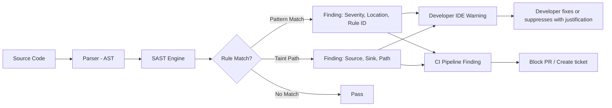

⚡ TL;DR - SAST (Static Application Security Testing) analyzes
source code without executing it, finding vulnerabilities by
pattern matching, taint analysis, and dataflow tracking. It
catches SQL injection, XSS, path traversal, insecure deserialization,
hardcoded secrets, and XXE in the developer's IDE and CI pipeline
BEFORE deployment. Key tools: Semgrep (fast, customizable rules),
Bandit (Python), SpotBugs/FindSecBugs (Java), SonarQube (multi-language).
False positive management is the main operational challenge.

---

| #068 | Category: Security | Difficulty: ★★★ |
|:---|:---|:---|
| **Depends on:** | OWASP Top 10, Input Validation, Security Code Review, OWASP Workshop, Security Testing in CI/CD | |
| **Used by:** | SAST in CI/CD, DevSecOps Pipeline Design, SSDLC | |
| **Related:** | DAST, SCA+Supply Chain Security, Security Testing in CI/CD | |

---

### 🔥 The Problem This Solves

**WHY SAST MATTERS IN THE SDLC:**

```
SECURITY FINDING COST BY PHASE:

  DESIGN (STRIDE threat model):     1x cost
  DEVELOPMENT (SAST in IDE/PR):    10x cost
  QA (DAST, pentest):             100x cost
  PRODUCTION (breach, bug bounty): 1000x cost

  Source: NIST SP 800-64, Microsoft SDL empirical data.

THE DEVELOPER FEEDBACK LOOP PROBLEM:
  Without SAST in the IDE:
    Developer writes SQL injection bug (Day 1).
    Code review (Day 2-3): reviewer may or may not notice.
    QA DAST scan (Day 5-10): finds vulnerability (maybe).
    Security team review (Day 15-20): finds it.
    Fix: developer context-switches back to code from 3 weeks ago.
    Cost: high (context loss + delay + rework).
  
  With SAST in the IDE (Semgrep VSCode extension):
    Developer writes SQL injection bug (Day 1, 10:00 AM).
    SAST highlights the line (Day 1, 10:00:05 AM).
    Developer sees the finding while context is fresh.
    Fix: 5 minutes, same coding session.
    Cost: minimal.

WHAT SAST FINDS RELIABLY:
  - SQL injection (parameterized query missing)
  - Hardcoded secrets (API keys, passwords in source code)
  - Dangerous function calls (exec(), eval(), pickle.loads())
  - Missing security headers in web framework config
  - Insecure deserialization patterns (ObjectInputStream without filter)
  - XXE (DocumentBuilderFactory without disallow-doctype-decl)
  - Path traversal (file operations with user input)
  - Weak cryptography (MD5, SHA-1 for security purposes, DES, ECB mode)
  - Overly permissive CORS
  - Missing authentication annotations on controller methods

WHAT SAST DOES NOT FIND (DAST/pentest fills these gaps):
  - Business logic vulnerabilities (app-specific logic errors)
  - Race conditions (timing-dependent, not detectable statically)
  - Vulnerabilities in third-party dependencies (SCA for this)
  - Runtime configuration errors (wrong env vars, misconfigured infra)
  - Vulnerabilities requiring authentication context (IDOR, authorization)
```

---

### 📘 Textbook Definition

**SAST (Static Application Security Testing):** The practice of
analyzing source code, bytecode, or binary without executing it
to identify security vulnerabilities. SAST tools implement:

- **Pattern matching:** Search for dangerous function calls, insecure configurations, and known vulnerable code patterns.
- **Taint analysis:** Track untrusted data (sources: request parameters, headers) through the code to dangerous sinks (SQL query, eval(), file path) without passing through sanitization functions.
- **Dataflow analysis:** Track how data moves through the program, detecting when user-controlled data reaches sensitive operations.
- **Semantic analysis:** Parse the abstract syntax tree (AST) to understand code structure, not just text patterns.

**Taint analysis flow:**

```
Source (tainted): request.getParameter("id")
  → Method call: buildQuery("SELECT * WHERE id=" + id)
  → Sink: stmt.executeQuery(query)
  
  If no sanitization between source and sink: SQL injection finding.
```

**Tools by language:**
- **Multi-language:** Semgrep, SonarQube, CodeQL
- **Java:** SpotBugs + FindSecBugs plugin, Checkmarx
- **Python:** Bandit
- **JavaScript/Node.js:** ESLint security plugins, Semgrep, NodeJsScan
- **Go:** gosec
- **.NET:** Security Code Scan, Roslyn analyzers

---

### ⏱️ Understand It in 30 Seconds

**One line:**
SAST is a code reviewer that never sleeps, running the same
security checks on every line of code automatically. It finds
patterns like "user input + string concat in SQL" (injection)
and "no parameterized query used" before the code ever runs.

**One analogy:**
> SAST is like a spell checker, but for security mistakes.
>
> Spell checker: "This word is misspelled" (highlights in real-time).
> SAST: "This function is unsafe" (highlights in real-time).
>
> Spell checker can't tell you if your MEANING is wrong
> (grammar is semantically wrong but spelled correctly).
> SAST can't tell you if your BUSINESS LOGIC is wrong
> (authorization check is missing for this specific API).
>
> But for the patterns it knows: SAST is faster and more
> consistent than any human code reviewer.

---

### 🔩 First Principles Explanation

**Semgrep: the modern SAST tool:**

```
SEMGREP FUNDAMENTALS:

Semgrep is pattern-based code analysis that works like a grep
for code STRUCTURE (not text). It understands syntax.

Basic rule structure:
  rules:
    - id: rule-id
      languages: [python, java, javascript]
      message: "What the rule found and how to fix it"
      severity: ERROR  # ERROR, WARNING, INFO
      patterns: (or 'pattern')
        - pattern: dangerous_code()
      fix: safe_replacement()

EXAMPLE RULES:

1. Python: Detect eval() with user input (code injection):
  rules:
    - id: python-eval-user-input
      languages: [python]
      message: "eval() with potentially user-controlled input"
      severity: ERROR
      pattern: eval(request.$ATTR)
      # Matches: eval(request.args['cmd']), eval(request.form['data']), etc.

2. Java: SQL injection via string concatenation:
  rules:
    - id: java-sqli-string-concat
      languages: [java]
      message: "Potential SQL injection via string concatenation"
      severity: ERROR
      pattern: |
        $STMT.executeQuery("..." + $VAR + "...")
      # Matches: stmt.executeQuery("SELECT * WHERE id=" + userId)
      # Does NOT match: stmt.executeQuery("SELECT * WHERE id=?") (safe)

3. Python: Hardcoded secrets:
  rules:
    - id: hardcoded-password
      languages: [python]
      message: "Hardcoded credential detected"
      severity: ERROR
      patterns:
        - pattern: password = "..."  # literal string
        - pattern: secret = "..."
        - pattern: api_key = "..."
      # Excludes tests/* by adding path-filter

4. Java: DocumentBuilderFactory without XXE protection:
  rules:
    - id: java-xxe-documentbuilderfactory
      languages: [java]
      message: "DocumentBuilderFactory without XXE protection"
      severity: ERROR
      patterns:
        - pattern: |
            $FACTORY = DocumentBuilderFactory.newInstance();
            ...
            $FACTORY.newDocumentBuilder()
        - pattern-not: |
            $FACTORY.setFeature("http://apache.org/xml/features/disallow-doctype-decl", true)
      # Only flags if setFeature is NOT called

RUNNING SEMGREP:
  # Install:
  pip install semgrep
  
  # Run with OWASP Top 10 rules:
  semgrep --config=auto --config=p/owasp-top-ten src/
  
  # Run with specific rule set:
  semgrep --config=p/java src/
  semgrep --config=p/python src/
  
  # Run with custom rules:
  semgrep --config=rules/custom/ src/
  
  # Output as SARIF (for GitHub Security tab):
  semgrep --config=auto --sarif > results.sarif
```

**Bandit: Python security linter:**

```
BANDIT USAGE:

# Install:
pip install bandit

# Run on project:
bandit -r src/ -l --ini .bandit

# Common findings:
# B101: assert_used (asserts disabled in optimized mode)
# B102: exec_used (exec with user input)
# B106: hardcoded_password_funcarg
# B201: flask_debug_true (debug=True in Flask)
# B301: pickle (pickle.loads - insecure deserialization)
# B303: md5/sha1 for security purposes
# B601: paramiko_calls (shell injection in ssh)
# B608: hardcoded_sql (SQL with string concat)

# .bandit configuration:
[bandit]
exclude_dirs = tests, venv
tests = B101,B102,B106,B201,B301,B303,B601,B608
```

---

### 🧪 Thought Experiment

**SCENARIO: Setting up SAST in a CI/CD pipeline**

```
GITHUB ACTIONS: SAST WITH SEMGREP + CODEQL

# .github/workflows/sast.yml
name: SAST Security Scan

on:
  push:
    branches: [main, develop]
  pull_request:
    branches: [main]

jobs:
  semgrep:
    name: Semgrep SAST
    runs-on: ubuntu-latest
    container:
      image: returntocorp/semgrep
    steps:
      - uses: actions/checkout@v4
      - run: semgrep ci --config=auto
        env:
          SEMGREP_APP_TOKEN: ${{ secrets.SEMGREP_APP_TOKEN }}
        # Fails CI on ERROR severity findings
        # Creates GitHub Security Alerts for findings

  codeql:
    name: CodeQL Analysis
    runs-on: ubuntu-latest
    strategy:
      matrix:
        language: [java, python, javascript]
    steps:
      - uses: actions/checkout@v4
      - uses: github/codeql-action/init@v3
        with:
          languages: ${{ matrix.language }}
      - uses: github/codeql-action/autobuild@v3
      - uses: github/codeql-action/analyze@v3
        with:
          category: "/language:${{ matrix.language }}"
      # Results appear in GitHub Security → Code Scanning Alerts

MANAGING FALSE POSITIVES:

  Strategy: suppress with annotations (tracked suppressions):
  
  Python (Bandit):
    data = pickle.loads(trusted_internal_data)  # nosec B301
    # nosec: tells Bandit to skip this line
    # Include the rule ID: makes suppression traceable
  
  Java (Spotbugs):
    @SuppressFBWarnings(
        value = "SQL_INJECTION_JDBC",
        justification = "Query is built from a fixed set of column names, validated against an allowlist at line 127"
    )
    public List<User> findUsers(String sortColumn) { ... }
  
  Semgrep (.semgrepignore or inline):
    # .semgrepignore:
    tests/
    migrations/
    
    # Inline:
    if (isDebugMode) {  // nosemgrep: no-direct-eval
        eval(debugExpression);
    }
  
  SUPPRESSION POLICY:
    - NEVER suppress without justification comment
    - Track suppressions in code review
    - Audit suppressions quarterly
    - Do NOT suppress at the tool level (masks all findings of that type)
    - Suppress at the specific line level (scoped)

SEVERITY THRESHOLDS:
  
  In CI/CD pipeline:
    ERROR: Fail the pipeline (SQL injection, hardcoded secrets, RCE vectors)
    WARNING: Create a ticket but don't fail (weak crypto, missing header)
    INFO: Report only (informational, style issues)
  
  Starting a new SAST program:
    Week 1: Run SAST, don't fail CI (baseline inventory)
    Week 2-4: Fix all ERROR findings
    Week 5: Enable ERROR fail-the-pipeline
    Month 2: Work through WARNING findings
    Month 3: Enable WARNING fail-the-pipeline (or at least block merge on new warnings)
```

---

### 🧠 Mental Model / Analogy

> SAST is like having a senior security engineer who has
> memorized every security vulnerability pattern look over
> your shoulder while you code.
>
> They don't run your code. They read it.
> They recognize patterns like:
> "You just concatenated user input into a SQL string.
>  I've seen 10,000 SQL injections in my career.
>  This is one of them. Use a parameterized query."
>
> They can be wrong (false positives): "That's not actually
> user input, it's a config value." You explain, they remember
> (suppression annotation).
>
> They miss things: "I don't know if this specific business logic
> check is correct. I can only verify patterns I know."
> (False negatives: business logic, novel vulnerabilities)
>
> But they're infinitely consistent and never tired. They check
> every commit, every PR, every file, with the same thoroughness.
> No human reviewer matches that consistency.

---

### 📶 Gradual Depth - Five Levels

**Level 1 - What it is (anyone can understand):**
SAST tools read your code (without running it) to find security bugs. Like a spell checker for security mistakes. They flag patterns like "user input goes directly into a database query" (SQL injection) or "password stored in code file." The earlier in development you find these, the cheaper they are to fix.

**Level 2 - How to use it (junior developer):**
Install Semgrep in your IDE (VS Code extension) and add a SAST step to your CI pipeline (`semgrep --config=auto src/`). For Python: run `bandit -r src/`. For Java: use SpotBugs + FindSecBugs plugin. Start with OWASP Top 10 rule sets. Fix all ERROR severity findings before merging PRs. Add suppression annotations with justifications where findings are false positives.

**Level 3 - How it works (mid-level engineer):**
SAST tools parse source code into an Abstract Syntax Tree (AST), then apply rules against the AST structure. Semgrep's strength: pattern syntax that looks like code, matching on syntax structure (not text). CodeQL uses a logic query language to express relationships between code elements (e.g., "find all flows from HTTP parameters to SQL query execution without passing through a sanitization function"). Taint analysis is the most powerful technique: track "tainted" (user-controlled) data from sources (request.getParameter(), request.body) through the code to sinks (execute(), eval(), open()) - if there's a path from source to sink without a sanitizer: report a finding.

**Level 4 - Why it was designed this way (senior/staff):**
SAST was first implemented in static analysis tools like Fortify (2003) and Checkmarx (2006), initially as expensive enterprise products. The key insight: security patterns (injection, dangerous function calls, weak crypto) are identifiable without executing the code. The shift to open-source SAST (Semgrep open-source, CodeQL for GitHub, Bandit) democratized SAST. The move to CI/CD integration made SAST a shift-left practice: finding vulnerabilities at PR time rather than after deployment. The remaining challenge: false positive rate. Enterprise SAST tools (Checkmarx, Fortify) historically had 30-50% false positive rates, making the tools painful to use. Semgrep's focus on precise pattern matching and curated rule sets aims to reduce false positives. The "right tool" choice depends on: language coverage, false positive rate, integration into existing workflow, and team capacity to manage findings.

**Level 5 - Mastery (distinguished engineer):**
Advanced SAST: CodeQL's data flow analysis and control flow graph (CFG) analysis can model complex code paths, including callbacks, closures, and frameworks. Writing custom CodeQL or Semgrep rules for framework-specific patterns (e.g., your internal authentication framework's bypass patterns, your company's coding standards violations) provides security coverage that generic rule sets cannot. SAST integration with JIRA/GitHub Issues for automatic vulnerability tracking. SARIF (Static Analysis Results Interchange Format): standard output format for SAST tools, integrated with GitHub Security Dashboard, Azure DevOps, and SonarQube. Security champions program: training developers to write Semgrep rules for security patterns specific to your codebase - engineers become the SAST rule authors, dramatically increasing coverage.

---

### ⚙️ How It Works (Mechanism)

```
TAINT ANALYSIS FLOW:

  Source: HTTP request parameter
    @RequestParam String userId  ← TAINTED: user-controlled input
    
  Flow:
    String query = "SELECT * FROM users WHERE id=" + userId;
    //                                               ^ TAINTED data
    
    resultSet = stmt.executeQuery(query);
    //                             ^ SINK: database execution
  
  Finding:
    Source: @RequestParam userId (line 12)
    Sink: stmt.executeQuery(query) (line 15)
    No sanitizer in path → SQL INJECTION (HIGH severity)
  
  Fixed code (sanitizer closes the taint flow):
    PreparedStatement ps = conn.prepareStatement(
        "SELECT * FROM users WHERE id=?"
    );
    ps.setInt(1, Integer.parseInt(userId));
    //        ^ sanitizer: explicit type conversion + parameterized query
    // Semgrep would NOT flag this - sink is now safe

SEMGREP RULE MATCHING:

  Code:
    String query = "SELECT * FROM " + tableName + " WHERE id=" + id;
    stmt.executeQuery(query);
  
  Semgrep pattern:
    $STMT.executeQuery("..." + $VAR)
  
  Match:
    $STMT = stmt
    $VAR = query (which contains user-controlled tableName and id)
  
  Result: MATCH - SQL injection finding reported
```



---

### 💻 Code Example

**Semgrep rule for detecting unsafe deserialization in Java:**

```yaml
# custom-rules/java-security.yml

rules:
  - id: java-insecure-deserialization
    languages: [java]
    message: |
      ObjectInputStream.readObject() on potentially untrusted data.
      This is vulnerable to Java deserialization gadget chain attacks.
      Fix: use Jackson JSON, Protobuf, or add ObjectInputFilter.
      See SEC-062 in the Technical Mastery.
    severity: ERROR
    metadata:
      cwe: CWE-502
      owasp: A08:2021
    patterns:
      - pattern: |
          $OIS = new ObjectInputStream($INPUT);
          ...
          $OIS.readObject()
      - pattern-not: |
          $OIS.setObjectInputFilter(...)
      # Only flags if setObjectInputFilter is NOT called
    
  - id: java-xxe-documentbuilderfactory
    languages: [java]
    message: |
      DocumentBuilderFactory without XXE protection.
      Set disallow-doctype-decl=true before calling newDocumentBuilder().
    severity: ERROR
    metadata:
      cwe: CWE-611
      owasp: A05:2021
    patterns:
      - pattern: |
          $DBF = DocumentBuilderFactory.newInstance();
          ...
          $DBF.newDocumentBuilder()
      - pattern-not: |
          $DBF.setFeature(
              "http://apache.org/xml/features/disallow-doctype-decl",
              true
          )

  - id: python-hardcoded-secret
    languages: [python]
    message: |
      Hardcoded secret detected. Store secrets in environment variables
      or a secrets manager (AWS Secrets Manager, Vault).
    severity: ERROR
    patterns:
      - pattern-either:
          - pattern: SECRET_KEY = "..."
          - pattern: password = "..."
          - pattern: api_key = "..."
          - pattern: AWS_SECRET_ACCESS_KEY = "..."
    paths:
      exclude:
        - "**/tests/**"
        - "**/*_test.py"
        - "**/test_*.py"
```

---

### ⚖️ Comparison Table

| Tool | Languages | Approach | Strength | Weakness |
|:---|:---|:---|:---|:---|
| **Semgrep** | 20+ | Pattern/rules | Fast, customizable, low FP | Requires rule authoring for custom patterns |
| **CodeQL** | 10+ | Data flow queries | Deep taint analysis | Slow, complex query language |
| **Bandit** | Python | Pattern matching | Simple, Python-specific | Python only, basic rules |
| **SpotBugs+FindSecBugs** | Java | Bytecode analysis | Java-specific depth | Java only, verbose output |
| **SonarQube** | 25+ | Pattern+rules | Broad language support | Higher false positive rate |
| **Checkmarx** | 35+ | Taint+data flow | Enterprise depth | Expensive, complex configuration |

---

### ⚠️ Common Misconceptions

| Misconception | Reality |
|:---|:---|
| "SAST produces too many false positives to be useful." | SAST false positive rates depend heavily on tool choice and rule configuration. Legacy enterprise tools (Fortify, Checkmarx out-of-box) historically had 30-50%+ false positive rates. Modern tools with curated rule sets (Semgrep's official rule packs) achieve 5-15% false positive rates for specific categories. The practical approach: start with a focused rule set (OWASP Top 10 rules for your language), fix all true positives first, then suppress false positives with documented justifications. The first scan on a legacy codebase will have many findings; a new codebase with SAST in CI from day one sees findings as they're introduced and addresses them immediately. |
| "SAST replaces code review for security." | SAST replaces the most CONSISTENT, MECHANICAL aspects of security code review: known patterns, dangerous function calls, missing configurations. It does not replace: understanding business context (why is this endpoint not authenticated?), complex multi-component authorization logic, business logic flaws specific to your application's model, novel vulnerability patterns not yet in rule sets. The correct mental model: SAST handles the routine pattern-checking, freeing human reviewers to focus on design-level and context-specific security concerns. SAST + human security review = better than either alone. |

---

### 🚨 Failure Modes & Diagnosis

**Common SAST integration problems:**

```
PROBLEM 1: Too many findings at first run (legacy codebase)
  
  Symptom: 500 findings on a 50k LOC codebase. Team overwhelmed.
  
  Fix:
    Phase 1: Run SAST, log all findings, don't fail CI.
    Phase 2: Triage findings by severity. Fix all ERROR in 2 weeks.
    Phase 3: Enable ERROR fail-the-pipeline.
    Phase 4: Address WARNING findings over next sprint cycle.
    Phase 5: Enable WARNING fail-the-pipeline (or block on new warnings only).
  
  DO NOT: try to fix everything in one sprint before enabling SAST.
  DO: use "only fail on new findings introduced since date X" feature
      (Semgrep diff-aware mode) while cleaning up existing findings.

PROBLEM 2: Developers suppress findings indiscriminately
  
  Symptom: Every PR adds 5 # nosec comments without justification.
  
  Fix:
    - Require justification comment alongside every suppression
    - Code review: reviewers check suppressions
    - Monitor: track suppression count per developer over time
    - Audit: monthly review of all suppression annotations
    - Policy: security team must approve suppressions on ERROR findings

PROBLEM 3: SAST scan too slow for PR feedback
  
  Symptom: SAST takes 15 minutes, developers don't wait for feedback.
  
  Fix:
    - Use diff-aware mode: only scan changed files
      semgrep --config=auto --diff-depth=1
    - Run fast rules in PR (1-2 min), deep scan nightly
    - Semgrep's incremental scan: runs in <60 seconds on most codebases
    - Separate CI jobs: fast SAST (blocks PR), slow DAST/CodeQL (informational)

PROBLEM 4: SAST not finding known vulnerabilities in codebase
  
  Symptom: pentest finds SQL injection that SAST missed.
  
  Fix:
    - Add custom Semgrep rule for the specific pattern
    - Check: did SAST scan cover that directory?
    - Check: is the finding type in the active rule set?
    - Verify: SAST configured to scan the relevant language files
    - Add regression: write a Semgrep rule specifically for that pattern
```

---

### 🔗 Related Keywords

**Prerequisites:**
- `OWASP Top 10` - what SAST finds
- `Security Testing in CI/CD` - SAST as part of the pipeline
- `Security Code Review` - SAST augments human review

**Builds on this:**
- `SAST in CI/CD` - detailed CI/CD integration
- `DevSecOps Pipeline Design` - SAST in the larger DevSecOps context
- `SSDLC` - SAST in the secure development lifecycle

---

### 📌 Quick Reference Card

```
┌──────────────────────────────────────────────────────────┐
│ BEST TOOLS   │ Semgrep (all), Bandit (Python),           │
│              │ CodeQL (deep taint), SonarQube (broad)    │
├──────────────┼───────────────────────────────────────────┤
│ FINDS        │ SQL injection, hardcoded secrets, eval,   │
│              │ XXE, deserialization, weak crypto          │
│ MISSES       │ Business logic, race conditions, IDOR     │
├──────────────┼───────────────────────────────────────────┤
│ CI COMMAND   │ semgrep --config=auto --sarif > results   │
│              │ bandit -r src/ -l                         │
├──────────────┼───────────────────────────────────────────┤
│ FALSE POS    │ Suppress with # nosec B301 + justification│
│ HANDLING     │ Never suppress without documented reason  │
├──────────────┼───────────────────────────────────────────┤
│ OWASP        │ A05 Misconfiguration, A03 Injection,      │
│              │ A02 Cryptographic Failures                │
└──────────────────────────────────────────────────────────┘
```

---

### 💎 Transferable Wisdom

**Reusable Engineering Principle:**
"Automate the consistent, scalable parts of quality assurance.
Reserve human attention for judgment-requiring parts."
SAST automates the detection of known security patterns across
an entire codebase consistently and at scale. No human code
reviewer can read every line of every commit with the same
focus and consistency.
This principle applies beyond security:
- Linting (ESLint, Checkstyle): automate consistent style checks.
  Reserve code review for design, architecture, logic concerns.
- Type checking (TypeScript, mypy): automate type safety.
  Reserve review for semantic correctness.
- Test coverage (coverage.py, JaCoCo): measure automatically.
  Reserve review for test quality and edge case coverage.
- Dependency vulnerability scanning (SCA/Snyk): automate known CVE detection.
  Reserve security effort for zero-day analysis.
The pattern: automate the "known bad patterns" detection, so human
reviewers can focus on patterns that require judgment:
"Is this business logic correct? Are there edge cases in this
permission model? Does this architectural decision create risks
that aren't captured by existing rules?"
Tools don't replace engineering judgment. They free it.

---

### 💡 The Surprising Truth

The biggest barrier to SAST adoption is not false positives
(a common excuse) but developer workflow friction.
Research by Deloitte and Cigital (now Synopsis) found that the
primary reason SAST findings go unfixed is not that developers
disagree with the findings, but that the feedback loop is too
delayed and disconnected from the development context.
A finding shown to a developer on a PR from 2 weeks ago:
low fix rate (context loss, feels like blame, unclear ownership).
The same finding shown in the developer's IDE as they type the
vulnerable code: high fix rate (immediate context, clear fix,
still in flow state).
The same research showed that SAST tools with IDE plugins
(VS Code extension for Semgrep, SonarLint for SonarQube)
had 3-5x higher fix rates than the same tools only in CI.
The insight: the "shift left" in security isn't just about
finding vulnerabilities earlier in the pipeline. It's about
giving developers feedback at the moment they're most equipped
to act on it - when they're actively writing the code.
A SAST finding in a GitHub PR comment 3 hours after commit
is 10x less actionable than the same finding highlighted in
the IDE 5 seconds after the vulnerable code is written.
The tool matters less than the workflow integration.

---

### ✅ Mastery Checklist

**You've mastered this when you can:**
1. **SET UP** a Semgrep SAST step in a GitHub Actions CI pipeline that
   fails on ERROR severity findings and uploads SARIF to GitHub Security tab.
2. **WRITE** a custom Semgrep rule that catches a specific vulnerability
   pattern (e.g., `ObjectInputStream.readObject()` without `setObjectInputFilter`).
3. **MANAGE** false positives: use inline suppression annotations with
   justifications, never suppress without documented reason.
4. **CHOOSE** between Semgrep, Bandit, CodeQL, and SonarQube for a given
   language/codebase based on depth, speed, and integration requirements.

---

### 🎯 Interview Deep-Dive

**Q: What is SAST? How would you integrate it into a CI/CD pipeline?
How do you handle false positives?**

*Why they ask:* DevSecOps knowledge. SAST is a foundational
tool in the secure development lifecycle. Tests whether candidate
knows tools and workflow, not just concepts.

*Strong answer covers:*
- SAST: analyzes source code statically (without execution) for security vulnerabilities.
  Techniques: pattern matching, taint analysis, AST-based rules.
  Finds: SQL injection, hardcoded secrets, dangerous function calls, XXE, deserialization.
  Misses: business logic, race conditions, IDOR (require DAST + human review).
- Tools: Semgrep (multi-language, fast, customizable), Bandit (Python),
  SpotBugs+FindSecBugs (Java), CodeQL (deep taint, GitHub), SonarQube (broad).
- CI/CD integration: `semgrep --config=auto --sarif > results.sarif`, uploaded
  to GitHub Security Alerts. Fail pipeline on ERROR severity.
  Diff-aware mode for fast PR feedback (only scan changed files).
- False positive handling: suppress with inline annotations (`# nosec B301`)
  with mandatory justification. Never suppress without documented reason.
  Track suppressions in code review. Monthly audit of suppressions.
- Getting started with existing codebase: run first, don't fail CI (baseline).
  Fix ERROR findings over 2 weeks. Then enable fail. Then address WARNING.
  Use diff-aware mode: new findings on every PR while cleaning up historical ones.
- IDE plugin: Semgrep VS Code extension shows findings as-you-type.
  3-5x higher fix rate than PR-only feedback (research finding).