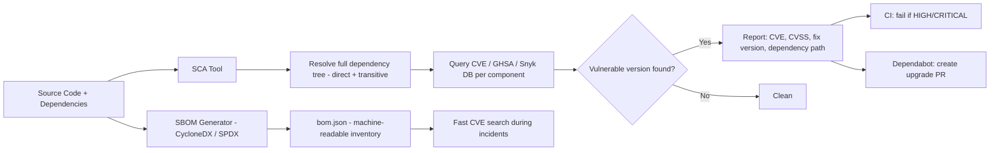

⚡ TL;DR - SCA (Software Composition Analysis) identifies known
vulnerabilities in your open-source dependencies. Supply chain
security extends this to the full build and delivery pipeline.
Tools: Snyk, GitHub Dependabot, OWASP Dependency-Check, `npm audit`.
The critical insight: most vulnerabilities come from TRANSITIVE
dependencies (Log4Shell: most apps didn't use Log4j directly - it
was a dependency of Elasticsearch, Spring Boot, or another library).
SBOM (Software Bill of Materials) is the inventory of all components.
SLSA framework provides supply chain security levels.

---

| #070 | Category: Security | Difficulty: ★★★ |
|:---|:---|:---|
| **Depends on:** | OWASP Top 10, Security Code Review, Secret Management, SAST, DAST, Security Testing in CI/CD | |
| **Used by:** | Log4Shell, SolarWinds, SAST in CI/CD, DevSecOps Pipeline Design, SLSA Framework, SSDLC | |
| **Related:** | Secrets Management, Log4Shell 2021, SolarWinds SUNBURST 2020, SLSA Framework | |

---

### 🔥 The Problem This Solves

**WHY SUPPLY CHAIN ATTACKS ARE CATASTROPHIC:**

```
SCALE OF THE DEPENDENCY PROBLEM:

  A typical modern application:
    Direct dependencies:    30-50 packages
    Transitive dependencies: 300-1,500+ packages
  
  That's 300-1,500+ software components you didn't write,
  don't deeply understand, and may have vulnerable versions.
  
  REAL EXAMPLES:

  Log4Shell (CVE-2021-44228) - December 2021:
    Vulnerability: Log4j 2.0 to 2.14.1 - JNDI lookup in log messages.
    Impact: Remote Code Execution. CVSS 10.0 (maximum).
    
    How most organizations were affected:
      Organization uses Spring Boot → Spring Boot uses Elasticsearch
      → Elasticsearch uses Log4j (transitive).
      Organization's pom.xml had NO mention of Log4j.
      Security team searched package files for Log4j: 0 results.
      They thought they were safe.
      Their app was vulnerable.
    
    Scale: 3 billion+ devices affected. Largest vulnerability since Heartbleed.
    Fixed: Log4j 2.17.1 (after multiple incomplete patches over 2 weeks).
    
    Lesson: You are responsible for ALL dependencies in your app,
    including ones you didn't add directly.
  
  SolarWinds SUNBURST - December 2020:
    Attack: Malicious code INJECTED INTO the build pipeline of
    SolarWinds Orion software updates.
    
    Attack chain:
      SolarWinds build server compromised →
      Attacker injected SUNBURST backdoor code during build →
      Signed official SolarWinds binary released →
      18,000+ organizations downloaded and installed "legitimate" update →
      Attacker had backdoor access to all 18,000+ systems.
    
    Victims: US Treasury, DHS, Pentagon, Fortune 500 companies.
    
    Lesson: Even trusted vendors' signed binaries can be compromised
    if the SUPPLY CHAIN (build + sign + distribute) is not secured.
  
  Event-stream npm package (2018):
    Attacker contacted popular npm package maintainer (event-stream, 2M downloads/week).
    Offered to help maintain the package.
    Maintainer transferred ownership.
    Attacker added malicious code targeting bitcoin wallets.
    Malicious version installed by thousands of CI pipelines.
    
    Lesson: npm package ownership transfer is a supply chain attack vector.
    Popular packages are targets for maintainer social engineering.

  Left-pad (2016) - Availability attack (not malicious, but illustrative):
    Developer unpublished 'left-pad' (11-line npm package) in protest.
    Thousands of packages depended on left-pad (transitively).
    npm, React, Babel broke globally for hours.
    
    Lesson: Dependency on tiny packages creates availability risk.
    Transitive dependencies create cascading failure potential.
```

---

### 📘 Textbook Definition

**SCA (Software Composition Analysis):** Automated scanning of an
application's dependencies against known vulnerability databases
(NVD, GitHub Advisory Database, Snyk Vulnerability DB) to identify
which specific versions of which libraries have known CVEs.

**Transitive dependency:** A package your dependency depends on.
If your app uses Express 4.18, and Express depends on qs 6.10,
and qs 6.10 has CVE-2022-24999 - that CVE affects your application
even though you never added qs to your package.json directly.

**SBOM (Software Bill of Materials):** A formal, machine-readable
list of all components (direct and transitive), their versions,
licenses, and provenance in an application. Standard formats:
SPDX (ISO standard), CycloneDX.

**SLSA (Supply-chain Levels for Software Artifacts):** A framework
defining security requirements for software build and release
pipelines. Four levels (SLSA 1-4), each adding more verification
and tamper-evidence requirements.

**CVE vs GHSA:** CVE (Common Vulnerabilities and Exposures) is the
standard identifier for publicly known vulnerabilities in the NVD
(National Vulnerability Database). GHSA (GitHub Security Advisory)
is GitHub's vulnerability database. Both are used by SCA tools;
GHSA is often updated faster for JavaScript/Python ecosystems.

---

### ⏱️ Understand It in 30 Seconds

**One line:**
SCA is inventory management for security: know every package
in your application (including transitive ones), check each
against the CVE database, and alert when a vulnerable version
is in your build.

**One analogy:**
> Supply chain security is like the 2011 Thailand floods.
>
> Hard drive manufacturers had factories in Thailand.
> When the floods hit: hard drive supply disrupted globally.
> PC manufacturers (your "application") didn't know their hard drives
> (their "dependencies") came from Thailand.
> They thought their supply chain was US/Japan-based.
> The actual source of the component (transitive supplier) was hidden.
>
> In software:
> Your app → uses Library A → Library A uses Log4j 2.12 (vulnerable).
> You don't know Log4j is in your supply chain until an SBOM or SCA
> tool makes the full dependency tree visible.
>
> SBOM = making the full supply chain visible.
> SCA = checking each supplier against a risk database.
> SLSA = verifying the supply chain wasn't tampered with.

---

### 🔩 First Principles Explanation

**SCA tools and what they check:**

```
SCA TOOL COMPARISON:

1. GitHub Dependabot (built into GitHub):
   - Scans: npm, pip, Maven, Gradle, NuGet, RubyGems, Cargo
   - Vulnerability database: GitHub Advisory Database (GHSA)
   - Features: auto-creates PRs to update vulnerable dependencies
   - Free: built into every GitHub repo (Security → Dependabot Alerts)
   - Limitation: GitHub only, no CLI for local use

2. Snyk (commercial, free tier available):
   - Languages: 10+ (best npm, Python, Go, Java support)
   - Vulnerability database: Snyk's own (often faster than NVD)
   - Features: fix suggestions, license compliance, container scanning
   - CLI: snyk test (local), snyk monitor (continuous)
   - CI integration: snyk test --severity-threshold=high (fails on high/critical)
   - Differentiator: shows which vulnerability is actually exploitable
     given your code path (reachability analysis)

3. OWASP Dependency-Check:
   - Java/Maven native, also supports Python, .NET, Node
   - Free, open-source
   - Vulnerability DB: NVD (downloads locally)
   - Output: HTML/XML/JSON report with CVSS scores
   - Limitation: higher false positive rate than Snyk;
     slower (downloads full NVD database)

4. npm audit (built into npm):
   - npm-specific
   - Free, built in
   - npm audit → shows vulnerabilities
   - npm audit fix → auto-upgrades where possible
   - npm audit --audit-level=high → exit 1 on HIGH findings (CI use)

5. pip-audit (Python):
   - pip-audit → checks installed packages against PyPI Advisory DB
   - Supports virtual environments, requirements.txt, pyproject.toml

USING SNYK IN CI/CD:

  # Install Snyk CLI
  npm install -g snyk
  
  # Authenticate (use token in CI)
  snyk auth $SNYK_TOKEN
  
  # Test project dependencies
  snyk test
  
  # Fail on HIGH or CRITICAL CVEs:
  snyk test --severity-threshold=high
  
  # Output SARIF for GitHub Security Alerts:
  snyk test --sarif-file-output=snyk.sarif
  
  # Monitor project continuously (sends to Snyk dashboard):
  snyk monitor --project-name=myapp
  
  # GitHub Actions:
  - name: Run Snyk to check for vulnerabilities
    uses: snyk/actions/node@master
    env:
      SNYK_TOKEN: ${{ secrets.SNYK_TOKEN }}
    with:
      args: --severity-threshold=high --sarif-file-output=snyk.sarif
  
  - uses: github/codeql-action/upload-sarif@v3
    with:
      sarif_file: snyk.sarif
```

---

### 🧪 Thought Experiment

**SCENARIO: Responding to Log4Shell when your team doesn't know if
they're affected:**

```
LOG4SHELL RESPONSE PLAYBOOK - Day 1 (Dec 10, 2021):

  Question: "Are we affected by Log4Shell (CVE-2021-44228)?"
  
  Wrong approach: grep package files for 'log4j'
    grep -r log4j pom.xml           # Finds DIRECT deps only
    → No results                    # "We're safe." ← WRONG
  
  Right approach: scan the full dependency tree

  Step 1: Scan for Log4j anywhere in the dependency tree:
    # Maven - list ALL transitive dependencies:
    mvn dependency:tree | grep log4j
    
    # Gradle:
    ./gradlew dependencies | grep log4j
    
    # Already have SBOM (best case):
    cat sbom.json | jq '.components[] | select(.name == "log4j-core")'
  
  Step 2: If Log4j found:
    # Check version: 2.0 to 2.14.1 = vulnerable
    # 2.15 = incomplete fix (still vulnerable in some configs)
    # 2.16 = disables JNDI by default (better but not fully fixed)
    # 2.17.1 = fully patched
    
    Immediate mitigations before patching:
      - JVM flag: -Dlog4j2.formatMsgNoLookups=true (reduces but not full fix)
      - WAF rule: block requests containing ${jndi: in any field
      - Disable JNDI lookup classes if patching takes time
    
    Fix: update log4j-core to 2.17.1+
    
    Note: update the DIRECT dependency that brings in log4j.
    If Spring Boot is the source: update Spring Boot version
    (which internally updates log4j).
    If Elasticsearch: update Elasticsearch.
    You may NOT be able to directly pin log4j-core.
  
  Step 3: Generate SBOM immediately (for future incidents):
    # Java (CycloneDX plugin):
    mvn org.cyclonedx:cyclonedx-maven-plugin:makeAggregateBom
    # Output: target/bom.xml (CycloneDX SBOM with all transitive deps)
    
    # Node.js:
    npx @cyclonedx/cyclonedx-npm --output-file bom.json
    
    # Python:
    pip install cyclonedx-bom
    cyclonedx-py environment > bom.json
  
  Lesson: SCA + SBOM tools make Log4Shell discovery take 5 minutes
  instead of days. Organizations without these tools needed 1-2 weeks
  to determine if they were affected.

DEPENDENCY PINNING AND INTEGRITY VERIFICATION:

  Problem: Even if you audit dependencies today,
  an attacker could publish a malicious version tomorrow
  that your unpinned config would install.
  
  npm lockfile (package-lock.json or yarn.lock):
    Pins exact versions AND integrity hashes (sha512).
    npm verifies the hash when installing from cache or registry.
    If the hash doesn't match: npm refuses to install.
    
    MUST commit the lockfile to git.
    NEVER .gitignore lockfiles.
  
  pip hash verification (--require-hashes):
    In requirements.txt:
    cryptography==41.0.7 \
        --hash=sha256:62901fb23f...a8b3e4e2f
    
    pip install --require-hashes -r requirements.txt
    # Fails if hash doesn't match (detects tampered package)
  
  npm package registry integrity (package integrity):
    Each npm package publish records its sha512 hash.
    npm checks the hash on every install.
    A malicious publisher CAN'T change an existing package version
    (npm's registry immutability) - they can only publish new versions.
    RISK: package ownership transfer → attacker publishes new major version.
```

---

### 🧠 Mental Model / Analogy

> SCA is like a customs inspection for your dependencies.
>
> Every time your project adds a library:
> - Direct dependencies = things you ordered (you know what they are).
> - Transitive dependencies = things the supplier added (you didn't check).
>
> A customs system that only checks what YOU ordered directly misses
> the most dangerous imports - the ones hidden inside what your
> suppliers included.
>
> SCA opens every package (direct AND transitive) and checks each
> component against a list of known dangerous items (CVE database).
>
> SBOM is the complete customs manifest: every component, version,
> origin, and license, in a machine-readable format.
>
> Without SBOM: "Are we affected by CVE-2021-44228?"
> Response time: days (manual search).
>
> With SBOM: "grep bom.json for log4j-core"
> Response time: minutes.

---

### 📶 Gradual Depth - Five Levels

**Level 1 - What it is (anyone can understand):**
SCA tools check if any of the open-source libraries you're using have known security vulnerabilities. Like checking if any of the ingredients in a recipe are on a recall list. When a CVE (security vulnerability report) is published for a library, SCA tools alert you and often automatically create a PR to upgrade to the fixed version.

**Level 2 - How to use it (junior developer):**
Enable GitHub Dependabot (free, built in): Settings → Security → Dependabot Alerts. For stronger scanning: add `snyk test --severity-threshold=high` to your CI pipeline. Commit your `package-lock.json` (npm), `Pipfile.lock` (Python), or `pom.xml`/`build.gradle` with locked versions. Run `npm audit` locally to check for vulnerabilities before committing.

**Level 3 - How it works (mid-level engineer):**
SCA tools build the complete dependency graph (direct + all transitive dependencies), then check each package+version combination against vulnerability databases (NVD/NIST, GitHub Advisory, Snyk Advisory, OSV - Open Source Vulnerabilities). When a match is found, the tool reports: CVE ID, severity (CVSS score), affected versions, fixed version, and the dependency path that introduces it (direct: `express`, or transitive: `express → qs`). Snyk's reachability analysis goes further: it checks whether the vulnerable code path is actually called from your code. A dependency with a CVE in a function you never call is less urgent than one where your code invokes the vulnerable function directly.

**Level 4 - Why it was designed this way (senior/staff):**
The software supply chain became a major attack surface as applications shifted from monolithic custom code to thin wrappers over massive dependency trees. The JavaScript npm ecosystem exemplified this: left-pad (11 lines of code, depended upon by thousands) showed that tiny utility packages created critical availability dependencies. The SolarWinds and SUNBURST attack elevated supply chain security to a national security concern: if an attacker compromises the build pipeline of a trusted vendor, every customer becomes compromised by installing the "legitimate" update. SLSA was developed by Google in response - providing verifiable build provenance (this binary was built from THIS exact source code by THIS build system) using signed attestations that can be verified by consumers. Executive Order 14028 (US, 2021) mandated SBOM for software sold to the US government, accelerating SBOM adoption across industries.

**Level 5 - Mastery (distinguished engineer):**
Advanced supply chain security: signed commits (GPG), signed tags, and in-toto attestations (verifiable provenance chain from source to artifact). SLSA Level 3 requires: isolated build environment (not your developer laptop), hermetic builds (no external network calls during build), signed build provenance. SLSA Level 4 adds: two-party review for all source changes, hermetic, reproducible builds. Reproducible builds: the build produces a bit-for-bit identical artifact from the same source input - this allows independent verification that the binary matches the source. Sigstore (Cosign/Rekor): CNCF project for transparent signing of container images and software artifacts. The Sigstore transparency log (Rekor) is an append-only public log of all signing operations - enabling audit of when and what was signed.

---

### ⚙️ How It Works (Mechanism)

```
SCA SCANNING FLOW:

  Input: pom.xml (Maven), package.json (npm), requirements.txt (pip)
  
  1. DEPENDENCY RESOLUTION:
     SCA tool resolves the FULL dependency tree:
     
     Your pom.xml:
       spring-boot 3.1.5 → spring-core 6.0.13 → ... (many transitive)
       elasticsearch 8.10 → log4j-core 2.17.1 → ... (log4j transitive)
     
     Tool builds complete tree: 300+ components with exact versions.
  
  2. VULNERABILITY LOOKUP:
     For each component@version: query vulnerability databases.
     
     NVD: log4j-core 2.17.0 → CVE-2021-45105 (HIGH, CVSS 7.5)
          log4j-core 2.14.1 → CVE-2021-44228 (CRITICAL, CVSS 10.0)
     GHSA: qs 6.5.2 → GHSA-hrpp-h998-j3pp (HIGH, prototype pollution)
  
  3. REPORT:
     - Component: log4j-core 2.17.0
     - Introduced by: elasticsearch 8.10 → log4j-core (transitive)
     - CVE: CVE-2021-45105 (DoS)
     - CVSS: 7.5 HIGH
     - Fixed in: log4j-core 2.17.1
     - Fix path: upgrade elasticsearch to 8.11+ (which uses log4j 2.17.1)

SBOM GENERATION (CycloneDX Maven plugin):

  <plugin>
    <groupId>org.cyclonedx</groupId>
    <artifactId>cyclonedx-maven-plugin</artifactId>
    <version>2.7.9</version>
    <executions>
      <execution>
        <phase>package</phase>
        <goals><goal>makeAggregateBom</goal></goals>
      </execution>
    </executions>
  </plugin>
  
  Output: target/bom.json (CycloneDX format):
  {
    "bomFormat": "CycloneDX",
    "specVersion": "1.4",
    "components": [
      {
        "type": "library",
        "name": "log4j-core",
        "version": "2.17.1",
        "purl": "pkg:maven/org.apache.logging.log4j/log4j-core@2.17.1",
        "hashes": [{"alg": "SHA-256", "content": "abc123..."}]
      },
      ...300 more components
    ]
  }
```



---

### 💻 Code Example

**Snyk in GitHub Actions + Dependabot configuration:**

```yaml
# .github/workflows/sca.yml
name: SCA - Dependency Vulnerability Scan

on:
  push:
    branches: [main]
  pull_request:
    branches: [main]
  schedule:
    - cron: '0 6 * * 1'  # Weekly Monday morning scan

jobs:
  snyk-scan:
    runs-on: ubuntu-latest
    steps:
      - uses: actions/checkout@v4
      
      - name: Run Snyk to check for vulnerabilities
        uses: snyk/actions/node@master
        continue-on-error: false  # Fail CI on findings
        env:
          SNYK_TOKEN: ${{ secrets.SNYK_TOKEN }}
        with:
          args: --severity-threshold=high --sarif-file-output=snyk.sarif
      
      - name: Upload Snyk SARIF to GitHub Security
        uses: github/codeql-action/upload-sarif@v3
        if: always()
        with:
          sarif_file: snyk.sarif

  generate-sbom:
    runs-on: ubuntu-latest
    steps:
      - uses: actions/checkout@v4
      
      - name: Generate CycloneDX SBOM
        run: |
          npx @cyclonedx/cyclonedx-npm \
            --output-format json \
            --output-file sbom.json
      
      - name: Upload SBOM as artifact
        uses: actions/upload-artifact@v4
        with:
          name: sbom
          path: sbom.json
          retention-days: 90
```

```yaml
# .github/dependabot.yml - Auto-update dependencies
version: 2
updates:
  - package-ecosystem: "npm"
    directory: "/"
    schedule:
      interval: "weekly"
      day: "monday"
    open-pull-requests-limit: 5
    # Auto-merge patch updates only (minor/major require review):
    # Configure via repository settings → branch protection

  - package-ecosystem: "maven"
    directory: "/"
    schedule:
      interval: "weekly"
    ignore:
      # Pin major versions requiring compatibility review:
      - dependency-name: "org.springframework.boot:spring-boot-starter-*"
        update-types: ["version-update:semver-major"]

  - package-ecosystem: "github-actions"
    directory: "/"
    schedule:
      interval: "weekly"
```

---

### ⚖️ Comparison Table

| Tool | Ecosystems | DB Used | Strengths | Weaknesses |
|:---|:---|:---|:---|:---|
| **GitHub Dependabot** | 10+ | GHSA | Free, auto-PRs, built-in | GitHub only, no CLI |
| **Snyk** | 10+ | Snyk + CVE | Fast, reachability analysis, fix suggestions | Commercial for advanced features |
| **OWASP Dep-Check** | Java, .NET, Node | NVD | Free, Java-native | Higher FP rate, slower (downloads NVD) |
| **npm audit** | Node.js only | npm Advisory | Built-in, no setup | Node only, basic output |
| **pip-audit** | Python only | PyPI Advisory | Built-in Python | Python only |
| **OSV-Scanner** | 10+ | OSV.dev | Free, Google-maintained, SBOM input | Newer, less mature CI integration |

---

### ⚠️ Common Misconceptions

| Misconception | Reality |
|:---|:---|
| "I don't use Log4j in my project, so Log4Shell doesn't affect me." | Log4Shell affected applications that had Log4j as a TRANSITIVE dependency - pulled in by a library the developer never explicitly chose. The correct check is to scan the FULL dependency tree (`mvn dependency:tree | grep log4j`), not just your direct dependencies. Organizations that learned this lesson hardened their SCA tooling to always scan transitive deps. |
| "I'm using the latest version of my dependencies, so I'm safe." | Latest versions sometimes introduce new vulnerabilities. More importantly: "latest" is only as current as your last update. A vulnerability disclosed yesterday in a library you last updated 6 months ago means you're running a now-vulnerable version. SCA must run continuously (in CI + weekly scheduled scans + Dependabot auto-PRs), not just at initial dependency selection. |

---

### 🚨 Failure Modes & Diagnosis

**Common SCA integration problems:**

```
PROBLEM 1: Too many low-severity findings create alert fatigue
  
  Symptom: 200 open Dependabot PRs, team ignores all of them.
  
  Fix:
    Triage strategy:
      CRITICAL/HIGH: fix within 7 days (or show exception + mitigation)
      MEDIUM: fix within 30 days
      LOW: fix in next scheduled dependency update (quarterly)
    
    Silence low-severity findings in CI:
      snyk test --severity-threshold=high  # Only report HIGH+
      npm audit --audit-level=high         # Only fail on HIGH+
    
    Consolidate Dependabot PRs:
      Use "rebase" strategy: Dependabot groups related patch updates.
      Or use Renovate bot (smarter grouping than Dependabot).

PROBLEM 2: Transitive dependency can't be updated directly
  
  Symptom: Snyk reports vulnerable log4j-core 2.12 transitively
  pulled in by elasticsearch. You can't pin log4j-core directly
  in your pom.xml (it's managed by elasticsearch).
  
  Fix:
    Option A: Upgrade the parent dependency (elasticsearch).
    Option B: Override the transitive dependency version explicitly
      (Maven: use dependencyManagement to force a specific version).
      Note: this can break things - test thoroughly.
    Option C: Exclude the vulnerable transitive dep and manually include
      the patched version.
    Option D: If no fix available: assess actual exploitability
      (is your code actually reaching the vulnerable code path?).
      Snyk reachability analysis helps here.
      If not reachable: document exception with justification + set
      a review date (90 days).

PROBLEM 3: False positives (vulnerability doesn't apply to your use case)
  
  Symptom: SCA reports a vulnerability in a library used for tests only,
  or in an optional feature you don't use.
  
  Fix:
    Snyk: snyk ignore --id=SNYK-JAVA-... --reason="Test dependency only"
    This creates a .snyk file tracking the ignore with a justification.
    Ignored vulnerabilities expire after 30 days (re-assess required).
    
    Policy: require security team sign-off for exceptions on HIGH+.
```

---

### 🔗 Related Keywords

**Prerequisites:**
- `Secrets Management` - secrets in dependencies
- `SAST` - code analysis counterpart
- `Security Testing in CI/CD` - integration context

**Builds on this:**
- `Log4Shell 2021` - the canonical transitive dependency vulnerability
- `SolarWinds SUNBURST 2020` - supply chain attack case study
- `SLSA Framework` - supply chain security levels
- `DevSecOps Pipeline Design` - SCA in the full pipeline

---

### 📌 Quick Reference Card

```
┌──────────────────────────────────────────────────────────┐
│ TOOLS        │ Snyk, GitHub Dependabot, OWASP Dep-Check  │
│ BUILT-IN     │ npm audit, pip-audit, mvn dependency:tree │
├──────────────┼───────────────────────────────────────────┤
│ CI COMMAND   │ snyk test --severity-threshold=high        │
│              │ npm audit --audit-level=high               │
├──────────────┼───────────────────────────────────────────┤
│ SBOM FORMATS │ CycloneDX (JSON/XML), SPDX (ISO standard) │
├──────────────┼───────────────────────────────────────────┤
│ TRANSITIVE   │ mvn dependency:tree | grep <pkg>           │
│ CHECK        │ npm ls <pkg>                               │
├──────────────┼───────────────────────────────────────────┤
│ OWASP        │ A06:2021 Vulnerable/Outdated Components    │
└──────────────────────────────────────────────────────────┘
```

---

### 💎 Transferable Wisdom

**Reusable Engineering Principle:**
"You are responsible for everything in your deployment artifact,
not just the code you wrote."
This principle extends beyond security to reliability:
- Security: a transitive dependency's CVE is YOUR vulnerability.
- License compliance: a transitive dependency's GPL license may
  require your entire application to be GPL (check your transitive deps).
- Build reliability: a transitive dependency's repository going offline
  (event-stream, left-pad) breaks your build.
- Legal: a transitive dependency's patent-encumbered code may
  expose your product to patent claims.
Organizations that take "full dependency ownership" seriously:
1. Generate SBOM on every release and store with the artifact.
2. Run SCA continuously (not just at initial selection).
3. Have a process for responding to new CVEs in existing deployments
   (not just new builds).
4. Pin and verify integrity of ALL dependencies (lockfiles + hash verification).
5. Have a policy for acceptable vulnerability window before forced remediation.
The discipline required to secure your software supply chain is the same
discipline required to make your build process reproducible, your license
compliance auditable, and your dependency tree understandable.
Supply chain hygiene pays multiple dividends beyond security.

---

### 💡 The Surprising Truth

Log4Shell was published on December 9, 2021 at approximately 2:15 PM
UTC via a public GitHub commit. Within 12 hours, mass exploitation
began globally.
The surprising finding from post-incident analysis: organizations
that had deployed SCA tooling with SBOM generation determined their
Log4j exposure status in 15-30 minutes (query the SBOM).
Organizations without SCA/SBOM tooling took an average of 3-5 DAYS
to determine if they were affected - and many initially said "we're not
affected" based on direct dependency search, then discovered they WERE
affected via transitive dependencies days later.
The difference in response time was entirely explained by SBOM presence.
One tool, one practice, one policy (generate SBOM on every build) was
the single factor that determined whether an organization responded in
30 minutes or 5 days to the highest-severity vulnerability in a decade.
The US Executive Order on Cybersecurity (14028, 2021) mandated SBOMs
for software sold to the federal government - specifically because of
this lesson. When the next critical zero-day hits, the organizations
that can answer "are we affected?" in 30 minutes vs 5 days will have
a fundamentally different security posture.
SBOM generation is now a build-time requirement. Not generating an
SBOM on every release is now a recognized security control gap.

---

### ✅ Mastery Checklist

**You've mastered this when you can:**
1. **EXPLAIN** why transitive dependencies (not just direct ones) are
   the primary SCA concern, using Log4Shell as the canonical example.
2. **SET UP** Snyk or OWASP Dependency-Check in a GitHub Actions
   pipeline that fails on HIGH/CRITICAL CVEs and uploads SARIF.
3. **GENERATE** a CycloneDX SBOM from a Maven or npm project and
   use it to quickly determine if a newly-disclosed CVE affects your app.
4. **DIFFERENTIATE** SCA (known CVEs in dependencies) from SLSA
   (build pipeline provenance), and explain how SolarWinds SUNBURST
   required SLSA-type controls to detect.

---

### 🎯 Interview Deep-Dive

**Q: What is SCA? How would you respond to Log4Shell across a large
microservices environment?**

*Why they ask:* Tests supply chain security knowledge. Log4Shell is
the canonical case study for every SCA question.

*Strong answer covers:*
- SCA: scans all dependencies (including transitive) against CVE databases.
  Key tools: Snyk, Dependabot, OWASP Dependency-Check, npm audit.
  Output: CVE ID, severity, dependency path, fix version.
- Log4Shell response:
  1. Query SBOM (if exists): immediate answer in minutes.
  2. If no SBOM: `mvn dependency:tree | grep log4j` for each service.
  3. Determine: which services have log4j 2.0-2.14.1 (CRITICAL),
     2.15-2.16 (partially patched), 2.17.0 (DoS only), 2.17.1 (fully patched).
  4. Immediate mitigation: JVM flag -Dlog4j2.formatMsgNoLookups=true,
     WAF rule blocking JNDI sequences.
  5. Fix: update parent dependency that introduces log4j (Spring Boot, Elasticsearch).
  6. After incident: generate SBOM on every release build going forward.
- SBOM: formal inventory (CycloneDX, SPDX). Enables 30-minute response
  vs 5-day response for future incidents.
- Supply chain (SolarWinds): attack targets the build pipeline, not app code.
  Defense: signed builds, SLSA provenance attestations, artifact signing
  (Sigstore/Cosign).
- SCA tooling in CI: Snyk test --severity-threshold=high. 
  Dependabot for auto-PRs on new CVEs. Weekly scheduled scans.
- Transitive deps: key insight - you ARE responsible for all transitive
  dependencies. "We didn't add Log4j" is not a defense.