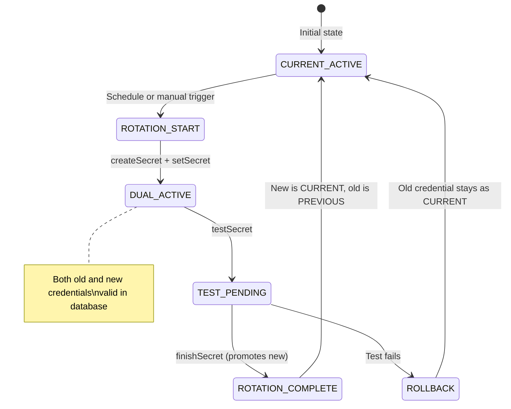

⚡ TL;DR - Secrets rotation: automatically replace credentials (DB
passwords, API keys, certificates) before they expire or are compromised,
without downtime and without human involvement. Key tools: AWS Secrets
Manager (automatic Lambda-based rotation), HashiCorp Vault (dynamic
secrets - credentials generated on demand, auto-expire). The gold
standard: dynamic secrets (Vault generates a database credential that
exists for 1 hour then is automatically revoked - no long-lived secret
to steal, no rotation needed). Static secret rotation: valid for
services where dynamic secrets aren't possible.

---

| #071 | Category: Security | Difficulty: ★★★ |
|:---|:---|:---|
| **Depends on:** | OWASP Top 10, Authentication, Secrets Management, IAM, SCA | |
| **Used by:** | AWS Security Services, DevSecOps Pipeline Design, Company Secret Rotation Strategy, SSDLC | |
| **Related:** | Secrets Management, IAM, Company Secret Rotation Strategy, AWS Security | |

---

### 🔥 The Problem This Solves

**WHY LONG-LIVED STATIC SECRETS ARE DANGEROUS:**

```
THE STATIC SECRET PROBLEM:

  Environment:
    DB_PASSWORD=SuperSecure2019!
    # Set in 2019. Never rotated. Used in 47 microservices.
    # Your team grew from 5 to 40 engineers over 4 years.
    # Who has seen this password? All 40 current + departed employees.
    # Was it committed to git accidentally? Possibly.
    # Is it in CI logs from a misconfigured echo statement? Maybe.
    # Is it in your old Confluence doc from 2019? Probably.
  
  The risk: a secret that has existed for 4 years has had
  4 years of exposure surface. Any one of these events could
  have compromised it without your knowledge.
  
  You don't know if it's been compromised. You can't know.
  That's the problem. A compromised static secret looks identical
  to a legitimate use of the credential.

THE ROTATION URGENCY:

  Without rotation:
    Attacker obtains credential (from git leak, insider threat,
    phishing, breach of a third-party system storing the key).
    Attacker has PERMANENT access.
    Detection window: months to never.
  
  With short-lived secrets (dynamic):
    Attacker obtains credential (same vectors).
    Credential expires in 1-24 hours.
    Attacker has LIMITED access window.
    Each new credential issuance creates an audit event.
    Anomalous usage patterns detectable.
  
  Emergency rotation (post-incident):
    Suspected compromise → rotate all secrets immediately →
    old credential invalidated → attacker's access revoked.
    Time to revocation: minutes (automated) vs days (manual).

ROTATION CHALLENGES (why it's hard to implement):

  1. APPLICATION DOWNTIME:
     Rotate DB password → app still using old password → auth failures.
     
     Solution: multi-phase rotation (dual-credential window).
  
  2. DISTRIBUTED SYSTEM SPREAD:
     Password used in 30 services across 3 environments.
     Manual rotation: update 30 places → error-prone, missed services.
     
     Solution: centralized secrets manager as single source of truth.
  
  3. ROTATION FREQUENCY:
     Rotate too often → operational overhead.
     Rotate too rarely → exposure window too long.
     
     Best practice: use dynamic secrets (no rotation needed)
     where possible. For static: 30-90 days max, automated.
  
  4. CERTIFICATE ROTATION:
     TLS certificates expire on a fixed date.
     Manual rotation: engineer notices expiry warning → updates cert.
     Failure mode: certificate expires at 3 AM on a holiday.
     
     Solution: ACME (Let's Encrypt) auto-renewal, cert-manager in Kubernetes.
```

---

### 📘 Textbook Definition

**Secrets rotation:** The process of replacing a credential (password,
API key, certificate, encryption key) with a new value, invalidating
the old value, and distributing the new value to all consumers -
automatically, without service disruption.

**Dynamic secrets:** Credentials generated on-demand for each
requesting service, valid only for the duration of that service's
session or a fixed TTL (e.g., 1 hour). When the TTL expires, the
credential is automatically revoked. HashiCorp Vault's database
secrets engine is the canonical example.

**Multi-phase rotation:** A rotation strategy where both old and new
credentials are valid simultaneously during a transition window.
Applications reload the new credential before the old one is revoked.
AWS Secrets Manager implements this as a 4-step Lambda function
(createSecret, setSecret, testSecret, finishSecret).

**Lease/TTL:** In Vault, every secret has a lease duration (TTL). After
the TTL expires, Vault revokes the secret. Services must renew the
lease before expiry or re-request a new credential.

**Break-glass credential:** A long-lived emergency credential for
disaster recovery when automated systems fail. Should be stored in
physical/offline secure location, usage creates an alert, usage is
audited. Rotated after any use.

---

### ⏱️ Understand It in 30 Seconds

**One line:**
Secrets rotation automatically replaces credentials on a schedule
(or on-demand after a compromise), so old credentials expire before
an attacker can use them for long.

**One analogy:**
> Secrets rotation is like hotel key cards, not house keys.
>
> Your house key: exists forever. If it's copied without your knowledge,
> the person has permanent access. You don't know when (or if) a copy
> was made. The only defense is to re-key the whole lock.
>
> Hotel key card: activated when you check in.
> Expires when you check out (TTL).
> Can be instantly deactivated from the front desk (revocation).
> Multiple cards can be active simultaneously (multi-phase rotation).
> A stolen key card from Room 301 doesn't work in Room 401.
> If the card is duplicated: it only works until checkout.
>
> Dynamic secrets are hotel key cards for your services.
> Vault: "Here's a database credential valid for 1 hour."
> After 1 hour: credential revoked automatically.
> Attacker who stole that credential: locked out after 1 hour.

---

### 🔩 First Principles Explanation

**AWS Secrets Manager automatic rotation:**

```
AWS SECRETS MANAGER - AUTOMATIC ROTATION:

  Setup: Store a database password as a Secret.
  Configure: rotation schedule (e.g., every 30 days).
  
  Rotation Lambda (automatic, AWS-managed for RDS):
  
  Phase 1 - createSecret:
    AWS generates a new password.
    Stores it as the PENDING version (AWSPENDING label).
    Old password still active (AWSCURRENT).
  
  Phase 2 - setSecret:
    Lambda calls the database with admin credentials.
    Creates/updates the DB user's password to the new value.
    Database now has BOTH old and new passwords valid.
  
  Phase 3 - testSecret:
    Lambda tests the PENDING credential.
    Connects to the database using the new password.
    Confirms the connection succeeds.
  
  Phase 4 - finishSecret:
    Promotes PENDING to CURRENT (AWSCURRENT label).
    Old password becomes AWSPREVIOUS (still valid briefly for in-flight requests).
    After configurable window: old password removed from DB.
  
  Application integration:
    Applications MUST NOT cache the secret value.
    Applications call AWS SDK on every request (or cache with 5-min TTL):
    
    # Python - AWS Secrets Manager SDK call:
    import boto3, json
    
    def get_db_password():
        client = boto3.client('secretsmanager', region_name='us-east-1')
        response = client.get_secret_value(
            SecretId='prod/myapp/db-password'
        )
        return json.loads(response['SecretString'])['password']
    
    # Or use AWS-maintained caching client
    # (reduces API calls, respects rotation):
    from aws_secretsmanager_caching import SecretCache
    cache = SecretCache()
    
    def get_db_password():
        return cache.get_secret_string('prod/myapp/db-password')
    # Cache TTL default: 1 hour. After rotation: cache refreshes automatically.
  
  TERRAFORM - AWS Secrets Manager + Rotation:
    resource "aws_secretsmanager_secret" "db_password" {
      name = "prod/myapp/db-password"
      
      rotation_rules {
        automatically_after_days = 30
      }
    }
    
    resource "aws_secretsmanager_secret_rotation" "db_rotation" {
      secret_id           = aws_secretsmanager_secret.db_password.id
      rotation_lambda_arn = aws_lambda_function.rotation.arn
      
      rotation_rules {
        automatically_after_days = 30
      }
    }
```

**HashiCorp Vault dynamic secrets (superior approach):**

```
VAULT DYNAMIC DATABASE SECRETS:

  Concept: Vault generates unique DB credentials per requesting service.
  Each credential has a TTL. Vault revokes them when TTL expires.
  No pre-existing long-lived secret. No rotation script needed.
  
  Setup:
    # Enable the database secrets engine:
    vault secrets enable database
    
    # Configure Vault to connect to PostgreSQL with admin credentials:
    vault write database/config/postgresql \
      plugin_name=postgresql-database-plugin \
      allowed_roles="app-role" \
      connection_url="postgresql://vault_admin:AdminPass@db:5432/appdb" \
      username="vault_admin" \
      password="AdminPass"
    
    # Define a role (what credentials are created + how):
    vault write database/roles/app-role \
      db_name=postgresql \
      creation_statements="CREATE ROLE \"{{name}}\" WITH LOGIN \
        PASSWORD '{{password}}' VALID UNTIL '{{expiration}}'; \
        GRANT SELECT, INSERT, UPDATE ON ALL TABLES IN SCHEMA public \
        TO \"{{name}}\";" \
      default_ttl="1h" \
      max_ttl="24h"
  
  Application requesting dynamic credential:
    # App calls Vault API (or SDK):
    vault read database/creds/app-role
    
    # Output:
    Key             Value
    ---             -----
    lease_id        database/creds/app-role/abc123 (unique per request)
    lease_duration  1h
    username        v-app-role-xK29mN (unique, generated by Vault)
    password        A1b-randompassword (random, generated by Vault)
    
    # App uses these credentials for DB connections.
    # After 1 hour: Vault calls DROP ROLE on the generated username.
    # Credential no longer exists in the database.
  
  Lease renewal (for long-running services):
    vault lease renew database/creds/app-role/abc123 -increment=2h
    # Extends lease without generating new credentials.
    # Capped by max_ttl (24h).
  
  VAULT IN KUBERNETES (Vault Agent Sidecar Injector):
    # Annotation on deployment pod spec:
    annotations:
      vault.hashicorp.com/agent-inject: "true"
      vault.hashicorp.com/role: "app-role"
      vault.hashicorp.com/agent-inject-secret-db: "database/creds/app-role"
      vault.hashicorp.com/agent-inject-template-db: |
        {{- with secret "database/creds/app-role" -}}
        DATABASE_URL=postgresql://{{ .Data.username }}:{{ .Data.password }}@db:5432/appdb
        {{- end }}
    
    # Vault Agent sidecar:
    # - Authenticates to Vault using Kubernetes service account JWT
    # - Fetches the dynamic credential
    # - Writes it to /vault/secrets/db (shared volume with app container)
    # - Renews the lease before expiry
    # - Writes new credentials when lease approaches max_ttl (rotation)
    # - Application reads /vault/secrets/db (env file format)
```

---

### 🧪 Thought Experiment

**SCENARIO: Emergency rotation after a suspected credential compromise**

```
INCIDENT: Developer reports accidental git commit of DB password.
The commit was pushed to GitHub (public repo) 45 minutes ago.

IMMEDIATE RESPONSE WITH AWS SECRETS MANAGER:

Step 1 - Assess scope immediately:
  - Which secret? Which services use it?
  - Was the commit definitely public? (GitHub: check visibility)
  - Time window: 45 minutes. Credential may have been harvested.

Step 2 - Trigger emergency rotation (not scheduled):
  # AWS Console: Secrets Manager → Secret → Rotate Now
  
  # Or AWS CLI:
  aws secretsmanager rotate-secret \
    --secret-id prod/myapp/db-password \
    --force-delete-without-recovery
  
  # Rotation completes in ~30 seconds (Lambda execution)
  # Old credential invalidated
  # New credential active

Step 3 - Verify rotation success:
  aws secretsmanager describe-secret \
    --secret-id prod/myapp/db-password \
    --query 'RotationRules.AutomaticallyAfterDays'
  
  # Check rotation status:
  aws secretsmanager get-secret-value \
    --secret-id prod/myapp/db-password \
    --version-stage AWSCURRENT

Step 4 - Verify services reconnecting:
  # Services with proper SDK integration: automatically get new secret
  # Services that cached the secret at startup: require restart
  
  # Find services that may have cached the old secret:
  # Check AWS CloudTrail: calls to GetSecretValue in the past hour
  aws cloudtrail lookup-events \
    --lookup-attributes AttributeKey=EventName,AttributeValue=GetSecretValue \
    --start-time $(date -d '1 hour ago' +%s)

Step 5 - Clean git history (parallel):
  # Remove from git history:
  git filter-branch --force --index-filter \
    "git rm --cached --ignore-unmatch path/to/secret/file" \
    HEAD
  # Or use git-filter-repo (faster, safer)
  
  # IMPORTANT: force pushing to GitHub removes the commit from the public repo.
  # But: bots may have already harvested the credential.
  # Rotation (Step 2) is more important than git cleanup.

Step 6 - Review audit logs:
  # CloudTrail: any unauthorized DB access in the past 45 minutes?
  # DB audit log: any suspicious queries from unexpected IP ranges?
  # If suspicious activity: treat as confirmed breach, escalate to IR.

LESSON: With automated rotation, Step 2 takes 1-2 minutes.
Without automation (manual rotation of a secret used in 30 services):
Step 2 takes 30-60+ minutes, with high error risk.
The rotation infrastructure pays for itself in the first incident.
```

---

### 🧠 Mental Model / Analogy

> Managing secrets without rotation is like using the same lock
> combination for your safe for 5 years, never changing it, and
> giving the combination to every employee who has ever worked there.
>
> Some employees left. Some may have written it down.
> Some may have shared it with someone outside the organization.
> You have no audit trail of who knows the combination.
> You can't tell if someone is using it without your knowledge.
>
> Secrets rotation is like changing the combination every month.
> Even if someone learned the old combination: it doesn't work anymore.
> Even if there was a leak: the window of damage is bounded.
>
> Dynamic secrets (Vault) go further: the combination is different
> FOR EVERY PERSON who opens the safe, exists only for the duration
> of their use, and is automatically destroyed when they're done.
> You can't steal a combination that changes with every use.

---

### 📶 Gradual Depth - Five Levels

**Level 1 - What it is (anyone can understand):**
Secrets rotation means periodically changing passwords and API keys so that old ones stop working. Like changing your house locks when you move in (previous tenants' keys stop working). Automated rotation does this without manual work and without service downtime.

**Level 2 - How to use it (junior developer):**
Enable GitHub Dependabot secret scanning (automatic detection of committed secrets). Store secrets in AWS Secrets Manager or Vault (not in code or env files). Use the SDK to retrieve secrets in your application. Never cache secrets at startup - retrieve on use. Enable automatic rotation in AWS Secrets Manager (30-day schedule for database passwords). For Kubernetes: use External Secrets Operator to sync Vault/Secrets Manager secrets to Kubernetes Secrets.

**Level 3 - How it works (mid-level engineer):**
AWS Secrets Manager rotation: 4-phase Lambda process (create → set → test → finish). The dual-credential window (both old and new valid simultaneously) prevents downtime. Applications must not cache secrets - they must call `GetSecretValue` each time (or use the caching SDK with a short TTL). Vault dynamic secrets: Vault calls `CREATE ROLE` in the database when a service requests credentials, sets a TTL, and calls `DROP ROLE` when the TTL expires. No long-lived password exists. Kubernetes integration via Vault Agent Sidecar: injects credentials as files that the application reads, automatically renews leases, re-injects new credentials before expiry.

**Level 4 - Why it was designed this way (senior/staff):**
Static secrets have unbounded risk exposure over time: the longer a credential exists, the higher the probability it has been seen by unauthorized parties. Rotation bounds this exposure. The challenge: rotation causes downtime if done naively (change password → old password invalid → app using old password → auth failures). The dual-credential window solves this by making both passwords valid simultaneously during the transition period. Dynamic secrets (Vault's approach) solve the problem differently: if the secret never exists for more than 1 hour, there's no meaningful "rotation" needed - the credential self-expires. This is the safer design but requires infrastructure investment (Vault cluster, lease management). AWS Secrets Manager is easier to operate but limited to static-with-scheduled-rotation. The right choice depends on the organization's maturity and operational capability.

**Level 5 - Mastery (distinguished engineer):**
Envelope encryption for secrets at rest: secrets managers don't store your secret in plaintext. AWS Secrets Manager encrypts each secret with a per-secret KMS data key (DEK), and the DEK is encrypted with a KMS key encryption key (KEK). This is envelope encryption. If the secrets manager database is exfiltrated: the secrets are encrypted with a key only accessible to the KMS service. Key rotation is separate from secret rotation. Secret versioning: AWS Secrets Manager maintains AWSCURRENT, AWSPREVIOUS, and AWSPENDING version labels - enables atomic rotation and rollback. Cross-account secret sharing: IAM resource-based policies on the secret allow cross-account access. Zero-trust secret distribution: in a ZT architecture, secrets are issued to service identities (SPIFFE SVIDs) not to static service names, and the service identity is verified on every credential issuance. Vault's AppRole/Kubernetes auth methods implement this: a service proves its identity (Kubernetes service account JWT signed by the cluster CA), then Vault issues credentials scoped to that identity.

---

### ⚙️ How It Works (Mechanism)

```
AWS SECRETS MANAGER ROTATION PHASES:

  ROTATION START:
    AWSCURRENT: password=OldPass (apps using this)
    AWSPENDING:  (not yet created)
    
  PHASE 1 - createSecret:
    AWSCURRENT: OldPass
    AWSPENDING: NewPass (generated, not yet active in DB)
    
  PHASE 2 - setSecret:
    DB: UPDATE password for app_user TO NewPass
    AWSCURRENT: OldPass (still active in DB + Secrets Manager)
    AWSPENDING: NewPass (now active in DB)
    Both passwords work in DB.
    
  PHASE 3 - testSecret:
    Lambda: connect to DB using AWSPENDING (NewPass)
    Connection SUCCESS → continue
    Connection FAILURE → abort rotation, keep AWSCURRENT
    
  PHASE 4 - finishSecret:
    AWSCURRENT: NewPass (promoted)
    AWSPREVIOUS: OldPass (kept briefly for in-flight requests)
    AWSPENDING:  (cleared)
    DB: OldPass is eventually removed (configurable window)
```



---

### 💻 Code Example

**External Secrets Operator for Kubernetes - syncing Vault/AWS to K8s Secrets:**

```yaml
# External Secrets Operator: sync AWS Secrets Manager to K8s Secret
# Install: helm install external-secrets external-secrets/external-secrets

# 1. Define the SecretStore (how to connect to AWS):
apiVersion: external-secrets.io/v1beta1
kind: SecretStore
metadata:
  name: aws-secrets-store
  namespace: default
spec:
  provider:
    aws:
      service: SecretsManager
      region: us-east-1
      auth:
        jwt:
          serviceAccountRef:
            name: external-secrets-sa  # K8s SA with IAM role (IRSA)

---
# 2. Define the ExternalSecret (what to sync):
apiVersion: external-secrets.io/v1beta1
kind: ExternalSecret
metadata:
  name: db-credentials
  namespace: default
spec:
  refreshInterval: 1h  # Re-sync from AWS every hour (picks up rotations)
  secretStoreRef:
    name: aws-secrets-store
    kind: SecretStore
  target:
    name: db-credentials  # Name of the resulting K8s Secret
    creationPolicy: Owner
  data:
    - secretKey: password  # Key in K8s Secret
      remoteRef:
        key: prod/myapp/db-password    # AWS Secrets Manager secret name
        property: password             # JSON key within the secret

# 3. Application Deployment uses the synced K8s Secret:
---
apiVersion: apps/v1
kind: Deployment
spec:
  template:
    spec:
      containers:
        - name: app
          env:
            - name: DB_PASSWORD
              valueFrom:
                secretKeyRef:
                  name: db-credentials  # K8s Secret (synced from AWS)
                  key: password
# Rotation flow:
# AWS rotates secret (every 30 days) →
# External Secrets Operator re-syncs (every 1 hour) →
# K8s Secret updated →
# Pod (if using projected volume) gets updated value without restart
# OR rollout restart triggered via secretVersionHash annotation
```

---

### ⚖️ Comparison Table

| Approach | Tool | Lifespan | Rotation | Complexity | Best For |
|:---|:---|:---|:---|:---|:---|
| **Dynamic secrets** | Vault | Minutes-hours | Auto (self-expiring) | Medium-High | DB creds, cloud IAM |
| **Auto-rotation (static)** | AWS Secrets Manager | 30-90 days | Automated | Low | RDS, external APIs |
| **Manual rotation** | Any | Months-years | Human-driven | High (error-prone) | Legacy systems only |
| **ACME (certs)** | Let's Encrypt + cert-manager | 90 days | Automated | Low | TLS certificates |
| **No rotation** | env vars, config | Forever | Never | Zero (but highest risk) | Avoid for secrets |

---

### ⚠️ Common Misconceptions

| Misconception | Reality |
|:---|:---|
| "Rotation causes downtime." | Rotation WITHOUT proper implementation causes downtime. The 4-phase rotation pattern (createSecret, setSecret, testSecret, finishSecret) maintains a dual-credential window. Both old and new credentials are valid simultaneously during the transition. Applications that retrieve secrets via the SDK (not at startup) seamlessly use the new credential after rotation. The only downtime risk: applications that cached the secret at startup and don't re-fetch. Fix: use short-TTL caching (5-15 minutes) or the AWS-provided caching client. |
| "If a secret is in a secrets manager, I don't need to rotate it." | Secrets managers secure how secrets are stored and distributed. Rotation addresses how long a secret is valid. A 5-year-old secret stored in a secrets manager is still a 5-year-old secret with 5 years of exposure surface. The secrets manager protects against storage compromise; rotation protects against exposure via logging, insider threat, or third-party breaches. Both controls are needed. The ideal: dynamic secrets (short TTL via Vault) eliminates long-lived secrets entirely, making traditional rotation unnecessary. |

---

### 🚨 Failure Modes & Diagnosis

**Common secrets rotation problems:**

```
PROBLEM 1: Application using cached secret fails after rotation
  
  Symptom: After AWS Secrets Manager rotation, some pods return
  DB auth errors. Other pods work fine.
  
  Diagnosis:
    - Pods with errors: likely fetched secret at startup, cached in memory
    - Working pods: recently restarted, fetched new secret
  
  Fix:
    Short-term: rolling restart of affected pods
    Long-term: use AWS SecretsManager caching client (default TTL: 1h)
    
    from aws_secretsmanager_caching import SecretCache
    cache = SecretCache()
    password = cache.get_secret_string('prod/db')
    # After rotation: cache refreshes within cache TTL (1h)

PROBLEM 2: Vault dynamic secret TTL too short for slow startup
  
  Symptom: Service requests Vault DB credential on start.
  By the time the connection pool is fully established (30s),
  Vault has revoked the credential (TTL was 60s during testing).
  
  Fix: Set TTL appropriate for use case.
    For long-running services: TTL 1h, use Vault Agent to auto-renew.
    For batch jobs: TTL = job duration + buffer.
    vault write database/roles/app-role default_ttl="1h" max_ttl="24h"

PROBLEM 3: Emergency rotation blocked by running transactions
  
  Symptom: After rotation, old DB credential removed.
  Long-running batch job (4-hour ETL) still using old credential.
  Batch job fails mid-run.
  
  Fix:
    Design rotation with AWSPREVIOUS kept valid for configured window.
    AWS: configure rotation to keep previous version valid for 1-2 days.
    For batch jobs: acquire new credential at start of each batch
    (not once for the entire day's run).
    Vault: set batch job TTL to exceed max expected duration.
```

---

### 🔗 Related Keywords

**Prerequisites:**
- `Secrets Management` - foundational concepts
- `IAM` - identity and access tied to secrets
- `Encryption at Rest/Transit` - secrets storage security

**Builds on this:**
- `Company Secret Rotation Strategy` - organizational scale
- `AWS Security Services` - AWS-specific rotation tooling
- `DevSecOps Pipeline Design` - rotation in the delivery pipeline

---

### 📌 Quick Reference Card

```
┌──────────────────────────────────────────────────────────┐
│ DYNAMIC SECRETS │ Vault database engine: TTL=1h, auto-revoke │
│ AUTO-ROTATION   │ AWS Secrets Manager: 30-day + Lambda        │
│ K8s INTEGRATION │ External Secrets Operator, Vault Agent      │
├─────────────────┼─────────────────────────────────────────────┤
│ ROTATION PHASES │ createSecret→setSecret→testSecret→finish    │
│ (AWS)           │ Dual-credential window prevents downtime     │
├─────────────────┼─────────────────────────────────────────────┤
│ VAULT CMD       │ vault read database/creds/<role>             │
│ EMERGENCY       │ aws secretsmanager rotate-secret --secret-id │
├─────────────────┼─────────────────────────────────────────────┤
│ AVOID           │ Cached secrets at startup (breaks rotation)  │
│                 │ Static secrets in env vars without rotation  │
└──────────────────────────────────────────────────────────┘
```

---

### 💎 Transferable Wisdom

**Reusable Engineering Principle:**
"Short-lived credentials reduce the blast radius of any single
credential compromise."
This principle applies across security and system design:
- Short-lived JWTs (15-minute access tokens): a stolen token expires quickly.
- Dynamic database credentials (1-hour Vault TTL): compromised creds auto-revoke.
- Short certificate validity (90-day Let's Encrypt): limits mis-issuance impact.
- Session cookies with short expiry: limits session hijacking duration.
The trade-off: shorter lifetimes require more frequent issuance and renewal.
The implementation solution: automate renewal (Vault lease renewal,
ACME auto-renewal, JWT refresh token pattern, OAuth token refresh).
Automation eliminates the operational overhead of short lifetimes
while preserving the security benefit.
Engineers who design systems with short-lived credentials design systems
that are naturally more resilient to compromise: even if something goes
wrong, the damage is time-bounded.
The converse: a 10-year SSL certificate issued by a compromised CA
(or a database password set and never rotated in 2015) creates
unbounded risk exposure. Time is the enemy of static secrets.

---

### 💡 The Surprising Truth

Most secret leaks are not dramatic breaches - they're quiet,
persistent, and discovered months or years after they occurred.
GitHub's secret scanning detected over 10 million secrets leaked
in public repositories in 2022 alone. Of these, the median time
from secret creation to exposure (public commit) was 2 days.
The median time to rotation after exposure: over 30 days.
The median time to DETECTION that the secret was even exposed:
over 60 days.
Most organizations that discovered they had a secret leaked in git
history did so via: (1) an external researcher report, (2) an active
breach investigation, or (3) automated scanning - never via proactive
monitoring.
The surprising insight: the organizations that respond fastest to
secret leaks are those where rotation is already automated and can
be triggered in minutes. When rotation takes 30 minutes (automated)
vs 3 days (manual update of 30 services), the organization that
automated rotation treats a secret leak as a minor operational event
rather than a multi-day incident.
The architectural investment in automated rotation pays off
primarily in the RESPONSE dimension: not just in preventing
compromise, but in the speed and confidence of response when
the inevitable leak occurs.
Rotation automation is incident response optimization.

---

### ✅ Mastery Checklist

**You've mastered this when you can:**
1. **EXPLAIN** the 4-phase AWS Secrets Manager rotation process and
   why the dual-credential window prevents downtime.
2. **CONFIGURE** Vault dynamic database secrets with a 1-hour TTL and
   explain how Vault revokes credentials automatically.
3. **DEPLOY** External Secrets Operator in Kubernetes to sync AWS
   Secrets Manager secrets to Kubernetes Secrets with 1-hour refresh.
4. **RESPOND** to an emergency secret rotation: trigger immediate rotation
   via AWS CLI, verify applications reconnect, audit for suspicious usage.

---

### 🎯 Interview Deep-Dive

**Q: How do you implement secrets rotation in a microservices environment?
What's the difference between static rotation and dynamic secrets?**

*Why they ask:* Secrets management is a common security interview topic.
Tests practical knowledge of tools and rotation mechanics.

*Strong answer covers:*
- Static rotation (AWS Secrets Manager): scheduled Lambda-based rotation
  using 4-phase pattern. Both old and new credentials valid simultaneously
  during transition window. Applications must not cache secrets at startup -
  use SDK with short-TTL cache or re-fetch on use.
- Dynamic secrets (HashiCorp Vault): Vault generates unique credentials
  per service request with a TTL. After TTL: auto-revoked. No rotation needed
  because credentials self-expire. Database secrets engine: Vault calls CREATE ROLE
  with expiration date. Best approach where operationally feasible.
- Kubernetes integration: Vault Agent Sidecar injects credentials as
  files, renews leases automatically. External Secrets Operator syncs
  AWS/Vault secrets to K8s Secrets with configurable refresh interval.
- Emergency rotation: `aws secretsmanager rotate-secret --secret-id prod/db` -
  completes in ~30 seconds. Applications auto-pick up via SDK.
- Anti-patterns: secrets at startup cached forever (breaks rotation),
  static secrets in env vars without rotation, manual rotation across
  30 services (error-prone, slow for incidents).
- Preferred: dynamic secrets where possible, auto-rotation for everything else.
  Zero long-lived static credentials as the goal.