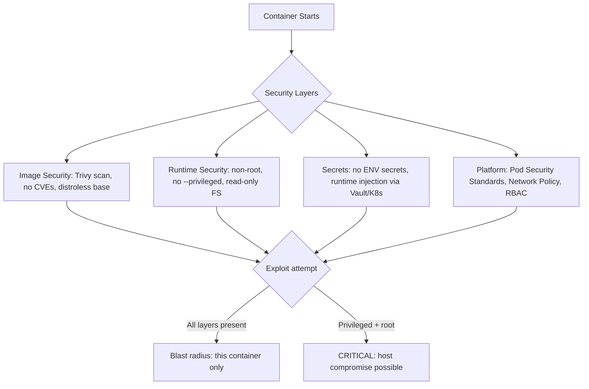

⚡ TL;DR - Container security has 4 layers: (1) the container image
(hardened base image, no CVEs, minimal packages), (2) the runtime
(non-root user, no privileged mode, read-only filesystem, seccomp
profiles, limited capabilities), (3) secrets management (never bake
secrets into images), (4) the container platform (Kubernetes RBAC,
network policies, Pod Security Standards). The single highest-impact
action: run containers as non-root. The single most common mistake:
running as root AND with privileged mode (root escape to host).

---

| #072 | Category: Security | Difficulty: ★★★ |
|:---|:---|:---|
| **Depends on:** | OWASP Top 10, Authentication, IAM, Secrets Management, SCA, Secrets Rotation | |
| **Used by:** | Kubernetes Security, SAST in CI/CD, DevSecOps Pipeline Design, Platform Security Engineering, SSDLC | |
| **Related:** | IAM, Secrets Management, SCA, AWS Security, Kubernetes Security Fundamentals | |

---

### 🔥 The Problem This Solves

**CONTAINER SECURITY IS NOT THE SAME AS VM SECURITY:**

```
CONTAINER THREAT MODEL:

  Containers share the HOST KERNEL.
  VMs have a full OS boundary between guest and host.
  
  Consequence: a container breakout = potential host compromise.
  
  CONTAINER BREAKOUT ATTACK CHAIN:
  
    1. Attacker exploits a vulnerability in your application code
       running inside a container (e.g., RCE via deserialization)
    
    2. Attacker has code execution INSIDE the container.
    
    3. If container runs as root AND --privileged:
       - Root inside container = root capability on host namespace
       - Attacker can: mount host filesystem, modify host processes,
         escape the container entirely
       - All other containers on the same host are compromised
    
    4. If container runs as non-root, no --privileged:
       - Attacker has limited privileges inside the container only
       - Cannot access host filesystem
       - Cannot modify host processes
       - Blast radius: THIS container only
  
  NON-ROOT IS NOT OPTIONAL - IT IS THE PRIMARY BLAST RADIUS CONTROL.

REAL CONTAINER VULNERABILITIES:

  CVE-2019-5736 (runc escape):
    Vulnerability in runc (container runtime used by Docker, containerd).
    Allows container to overwrite the runc binary on the host.
    Requirement: container runs as root (uid=0).
    If container runs as non-root: exploit requires privilege escalation
    first - significantly harder.
  
  Cryptomining via public image supply chain:
    Attacker publishes "nginx:latest" or "python:3.8" lookalike
    on Docker Hub (typosquatting or compromised account).
    Image contains hidden mining binary.
    Developers pull and run without verifying image digest.
    Result: host CPU/GPU sold to cryptominer.
    
    Prevention: pin to immutable digest (not just tag):
    docker pull python@sha256:abc123... (immutable)
    NOT: docker pull python:3.11 (tag can be updated)
  
  Secrets in container images:
    Developer runs: docker build with AWS_ACCESS_KEY_ID set.
    Key is baked into an image layer.
    Image pushed to public Docker Hub.
    AWS key is now publicly accessible via docker history.
    
    Prevention: NEVER set secrets as Docker build args or ENV.
    Use runtime secrets injection (Vault Agent, AWS Secrets Manager).
```

---

### 📘 Textbook Definition

**Container security:** The practices and controls that reduce the risk
of a container being used as an attack vector or as a pivot point to
compromise the host or other containers.

**Container image security:** Ensuring the base image and all packages
in the container have no known critical CVEs, the image is built from
a verified base, and no secrets are embedded.

**Container runtime security:** Ensuring the container runs with the
minimum privileges needed: non-root user, no privileged mode, limited
Linux capabilities, read-only filesystem where possible, seccomp/AppArmor
profiles.

**Privileged container:** A container with all Linux capabilities, including
CAP_SYS_ADMIN, full access to the host's devices, and disabled security
namespaces. Functionally equivalent to running a process directly on the
host. Almost never needed; when it is, use specific capabilities instead.

**Pod Security Standards (PSS):** Kubernetes built-in security profiles
(privileged, baseline, restricted) that enforce container security
constraints at the namespace level. Replaced deprecated PodSecurityPolicy
in Kubernetes 1.25+.

**seccomp (Secure Computing Mode):** Linux kernel feature that restricts
system calls a process can make. A seccomp profile for a web server allows
only the syscalls it actually needs (socket, accept, read, write, etc.),
blocking all others (ptrace, module load, reboot, etc.).

---

### ⏱️ Understand It in 30 Seconds

**One line:**
Container security controls reduce what a compromised container
can do: run as non-root (limits privilege), no privileged mode
(limits host access), minimal image (limits attack surface), scan
for CVEs (find known vulnerabilities before deployment).

**One analogy:**
> Container security is like the principle of least privilege
> applied to tenant isolation in an apartment building.
>
> All tenants share the building's infrastructure (host kernel).
> The building has fire doors and separate electrical circuits
> to contain damage from one unit to that unit only.
>
> A tenant who runs as root in privileged mode = a tenant with
> master keys to all units AND access to the electrical room.
> A fire (exploit) in their unit spreads to the entire building.
>
> A non-root, non-privileged container = a tenant with keys only
> to their own unit. A fire (exploit) in their unit is contained
> by the fire doors (Linux namespaces + capabilities).
>
> Container runtime security = the fire doors, separate circuits,
> and access controls that limit damage from any single unit.

---

### 🔩 First Principles Explanation

**Hardened Dockerfile (practical implementation):**

```
DOCKERFILE SECURITY - BEFORE AND AFTER:

BAD - Dockerfile with common security mistakes:

  FROM ubuntu:latest          # Unpinned tag, large attack surface
  
  RUN apt-get install -y \
    curl wget git vim \        # Many unneeded packages = larger attack surface
    python3
  
  COPY . /app                 # Copies .env files, .git, secrets
  WORKDIR /app
  
  ENV DB_PASSWORD=prod_pass   # Secret baked into image layer (CRITICAL)
  ENV API_KEY=sk-abc123       # Visible in docker inspect, docker history
  
  # No USER directive = runs as root

GOOD - Hardened Dockerfile:

  # Pin to specific digest OR official minimal image:
  FROM python:3.11-slim@sha256:abc123...  # Immutable reference
  
  # Or use distroless (no shell, no package manager = minimal attack surface):
  # FROM gcr.io/distroless/python3-debian11
  
  # Create non-root user:
  RUN groupadd --gid 1001 appgroup && \
      useradd --uid 1001 --gid 1001 --no-create-home appuser
  
  WORKDIR /app
  
  # Copy only what's needed (use .dockerignore to exclude .env, .git, etc.)
  COPY --chown=appuser:appgroup requirements.txt .
  RUN pip install --no-cache-dir -r requirements.txt
  
  COPY --chown=appuser:appgroup src/ ./src/
  
  # Switch to non-root BEFORE the final CMD:
  USER 1001  # Use numeric UID (more portable)
  
  # No ENV with secrets - secrets injected at runtime via Vault/Secrets Manager
  
  EXPOSE 8080  # Document the port (doesn't open it, just documents)
  
  ENTRYPOINT ["python", "src/app.py"]

.dockerignore:
  .env
  .env.*
  .git
  .gitignore
  __pycache__/
  *.pyc
  tests/
  README.md
  Makefile
  # Excludes these from COPY context - prevents accidental secret inclusion

RUNTIME SECURITY - Kubernetes Pod SecurityContext:

BAD:
  containers:
    - name: app
      image: myapp:latest     # Mutable tag
      # No securityContext = root by default in many images
      # No resource limits

GOOD:
  containers:
    - name: app
      image: myapp@sha256:abc123...  # Immutable digest
      securityContext:
        runAsNonRoot: true
        runAsUser: 1001
        runAsGroup: 1001
        readOnlyRootFilesystem: true    # Cannot write to filesystem
        allowPrivilegeEscalation: false # Cannot gain more privileges
        capabilities:
          drop:
            - ALL  # Drop ALL Linux capabilities
          add:
            - NET_BIND_SERVICE  # Only add back what's needed
                                # (bind to ports below 1024)
      resources:
        limits:
          cpu: "500m"    # CPU limit prevents DoS via CPU exhaustion
          memory: "256Mi"  # Memory limit prevents OOM cascade
        requests:
          cpu: "100m"
          memory: "128Mi"
      volumeMounts:
        - name: tmp-volume
          mountPath: /tmp  # Allow writes to /tmp only (not whole filesystem)
  
  volumes:
    - name: tmp-volume
      emptyDir: {}
```

---

### 🧪 Thought Experiment

**SCENARIO: Container image vulnerability scanning in CI/CD pipeline:**

```
IMAGE SCANNING PIPELINE (Trivy - free, fast, comprehensive):

  Tool: Trivy (Aqua Security, open-source)
  Scans: OS packages, language-specific packages (pip, npm, maven),
         secrets in image layers, misconfigurations in Dockerfile/IaC

GITHUB ACTIONS INTEGRATION:

  # .github/workflows/container-security.yml
  
  name: Container Security Scan
  
  on:
    push:
      branches: [main]
    pull_request:
      branches: [main]
  
  jobs:
    image-scan:
      runs-on: ubuntu-latest
      steps:
        - uses: actions/checkout@v4
        
        - name: Build image
          run: docker build -t myapp:${{ github.sha }} .
        
        - name: Scan image with Trivy
          uses: aquasecurity/trivy-action@master
          with:
            image-ref: 'myapp:${{ github.sha }}'
            format: 'sarif'
            output: 'trivy-results.sarif'
            severity: 'CRITICAL,HIGH'     # Only report HIGH+
            exit-code: '1'               # Fail CI on findings
            ignore-unfixed: true         # Don't fail on unfixed CVEs
        
        - name: Upload Trivy SARIF
          uses: github/codeql-action/upload-sarif@v3
          if: always()
          with:
            sarif_file: trivy-results.sarif

KUBERNETES NAMESPACE-LEVEL SECURITY:

  # Pod Security Standards: enforce restricted policy in prod namespace
  # (Kubernetes 1.25+ - replaces PodSecurityPolicy)
  
  apiVersion: v1
  kind: Namespace
  metadata:
    name: production
    labels:
      pod-security.kubernetes.io/enforce: restricted
      pod-security.kubernetes.io/audit: restricted
      pod-security.kubernetes.io/warn: restricted
  
  # "restricted" profile enforces:
  # - runAsNonRoot: true
  # - allowPrivilegeEscalation: false
  # - seccompProfile: RuntimeDefault or Localhost
  # - capabilities: drop ALL
  # - readOnlyRootFilesystem: true (recommended)
  
  # Any pod that violates these rules: admission rejected

DISTROLESS BASE IMAGES (minimal attack surface):

  FROM gcr.io/distroless/java17-debian11
  # Contains:
  # - JRE only (no JDK, no shell, no apt, no curl, no bash)
  # - No /bin/sh - cannot exec into container for debugging
  # Attack surface: near zero (nothing to exploit but the JVM)
  
  COPY target/myapp.jar /app.jar
  USER 1001
  ENTRYPOINT ["java", "-jar", "/app.jar"]
  
  # For debugging: use multi-stage build, keep debug variant separate
  # Production: distroless. Dev: standard base with debugging tools.
```

---

### 🧠 Mental Model / Analogy

> Container image security = incoming goods inspection.
> Before accepting any shipment (image), scan it for known defects
> (CVEs), verify it came from a trusted source (signed image digest),
> and check the manifest (Dockerfile) for dangerous contents.
>
> Container runtime security = warehouse safety rules.
> Once the goods are inside: minimize what each worker (container)
> can touch. Non-root = worker without master keys.
> No privileged = worker without access to the loading dock.
> Read-only filesystem = worker can look but not modify inventory.
> Resource limits = no single worker can take all the forklifts.
>
> Secrets management = the safe is not inside the shipment.
> Never bake credentials into the image (don't ship the keys inside
> the delivery). Inject them at runtime from a secure location.
>
> Image scanning (Trivy) + hardened Dockerfile + runtime SecurityContext
> + secrets at runtime = the four-layer container security model.

---

### 📶 Gradual Depth - Five Levels

**Level 1 - What it is (anyone can understand):**
Container security means making Docker/Kubernetes deployments harder to compromise. The main rules: don't run as root, don't use "privileged" mode, scan images for known vulnerabilities, and never put passwords or API keys inside container images.

**Level 2 - How to use it (junior developer):**
Add `USER 1001` to your Dockerfile (run as non-root). Use `.dockerignore` to exclude `.env` files and `.git` from the image. Add Trivy image scanning to your CI pipeline (`aquasecurity/trivy-action`). In Kubernetes: add `securityContext.runAsNonRoot: true` and `allowPrivilegeEscalation: false` to every pod spec. Never set secrets as `ENV` in Dockerfile - inject at runtime via Kubernetes Secrets or Vault.

**Level 3 - How it works (mid-level engineer):**
Linux containers use namespaces (PID, network, mount, user) to isolate processes and cgroups to limit resources. The USER directive in Dockerfile sets which UID runs the process. Linux capabilities: instead of root/not-root binary, Linux has ~40 capabilities (CAP_NET_BIND_SERVICE, CAP_SYS_ADMIN, etc.). Dropping ALL capabilities then adding back only what's needed (principle of least privilege at the capability level). seccomp profiles filter system calls - a web server only needs ~50 of Linux's 300+ system calls. Blocking the rest prevents the use of dangerous syscalls even if the container is compromised. Trivy image scanning: reads the package database from each layer's filesystem, cross-references against CVE databases (NVD, GitHub Advisory), identifies vulnerable versions.

**Level 4 - Why it was designed this way (senior/staff):**
Container security design was influenced by the realization that containers are not VMs. The shared kernel model means kernel vulnerabilities (like CVE-2019-5736 runc escape) can be exploited by a container to affect the host. The defense-in-depth approach: multiple layers of security so that compromising any one layer (application vulnerability, image CVE, or kernel exploit) doesn't immediately escalate to host or cluster compromise. The Pod Security Standards (PSS) replacing PodSecurityPolicy was a Kubernetes project decision to simplify enforcement - PSP was too complex and rarely configured correctly. PSS "restricted" profile encodes the consensus best practices. Distroless images are a Google-originated approach: remove everything from the container image except the language runtime and your application - no shell to exec into, no package manager to use for post-exploitation lateral movement, no utilities that can be weaponized.

**Level 5 - Mastery (distinguished engineer):**
Advanced container security: eBPF-based runtime security (Falco, Cilium). Falco runs in the kernel, monitors system call patterns in real-time, and alerts on anomalous behavior (container exec events, unexpected network connections, file access in /etc). This detects zero-day exploits and misconfiguration exploitation that static scanning misses. Image signing and verification: Docker Content Trust (Notary) or Sigstore/Cosign for signing container images. OPA/Gatekeeper: Kubernetes admission controller that enforces custom policies (e.g., "all images must come from approved registries, must be signed, must have no CRITICAL CVEs"). Supply chain security for container images: SLSA provenance attestations attached to container images verify that the image was built from a specific commit by a specific CI/CD pipeline, not tampered with after build.

---

### ⚙️ How It Works (Mechanism)

```
LINUX CONTAINER ISOLATION LAYERS:

  Layer 1 - Namespaces (isolation):
    PID namespace:  container processes see only each other's PIDs
    Net namespace:  container has its own network stack
    Mount namespace: container has its own filesystem view
    User namespace:  UID 0 inside = unprivileged UID on host (optional)
  
  Layer 2 - cgroups (resource limits):
    CPU limit: container cannot take more than N CPU cores
    Memory limit: container OOM-killed at N MB (not starving other containers)
  
  Layer 3 - Linux capabilities (privilege granularity):
    Default Docker capabilities include CAP_CHOWN, CAP_NET_BIND_SERVICE, etc.
    drop: ALL removes all capabilities.
    add: NET_BIND_SERVICE adds back only binding to ports <1024.
  
  Layer 4 - seccomp (system call filter):
    Default Docker seccomp profile: blocks ~44 of ~300+ syscalls.
    Custom profile: block all syscalls not needed by your app.
  
  PRIVILEGED MODE BYPASSES ALL OF THESE:
    --privileged: disables seccomp, gives all capabilities, 
    bypasses namespace restrictions.
    A privileged container is NOT isolated from the host.
```



---

### 💻 Code Example

**Complete hardened Dockerfile + Kubernetes deployment:**

```dockerfile
# ---- Build stage ----
FROM maven:3.9-eclipse-temurin-17-alpine AS build
WORKDIR /build
COPY pom.xml .
RUN mvn dependency:go-offline -q  # Cache dependencies
COPY src/ ./src/
RUN mvn package -DskipTests -q

# ---- Runtime stage (distroless - minimal attack surface) ----
FROM gcr.io/distroless/java17-debian11:nonroot
# nonroot variant: runs as user 65532 by default (no USER directive needed)

COPY --from=build /build/target/myapp.jar /app.jar
EXPOSE 8080

# No CMD override needed for distroless Java - ENTRYPOINT is java
ENTRYPOINT ["java", \
            "-Djava.security.egd=file:/dev/./urandom", \
            "-jar", "/app.jar"]
```

```yaml
# Kubernetes Deployment - hardened security context
apiVersion: apps/v1
kind: Deployment
metadata:
  name: myapp
  namespace: production  # Namespace has restricted PSS label
spec:
  replicas: 3
  selector:
    matchLabels:
      app: myapp
  template:
    metadata:
      labels:
        app: myapp
    spec:
      securityContext:      # Pod-level: applies to all containers
        runAsNonRoot: true
        seccompProfile:
          type: RuntimeDefault  # Default Docker seccomp profile
      
      containers:
        - name: myapp
          image: myapp@sha256:abc123...  # Pinned immutable digest
          ports:
            - containerPort: 8080
          
          securityContext:  # Container-level overrides
            runAsUser: 65532
            runAsGroup: 65532
            allowPrivilegeEscalation: false
            readOnlyRootFilesystem: true
            capabilities:
              drop: ["ALL"]
          
          resources:
            limits:
              cpu: "500m"
              memory: "512Mi"
            requests:
              cpu: "100m"
              memory: "256Mi"
          
          volumeMounts:
            - name: tmp
              mountPath: /tmp  # Allow writes to /tmp if needed
          
          env:
            - name: DB_PASSWORD
              valueFrom:
                secretKeyRef:
                  name: db-credentials  # K8s Secret (from External Secrets)
                  key: password
      
      volumes:
        - name: tmp
          emptyDir: {}
```

---

### ⚖️ Comparison Table

| Security Control | Impact | Complexity | When Required |
|:---|:---|:---|:---|
| **Non-root USER in Dockerfile** | High (limits privilege) | Low | Always |
| **No --privileged mode** | Critical (host isolation) | Low (default) | Never use except very specific system ops |
| **Read-only filesystem** | Medium (limits post-exploit) | Low-Med | Default for stateless apps |
| **Drop ALL capabilities** | High (limits kernel access) | Low-Med | Default, add back selectively |
| **Image CVE scanning (Trivy)** | High (finds known vulns) | Low | Always in CI |
| **Pinned image digest** | Medium (supply chain) | Low | Production |
| **Distroless base image** | High (minimal attack surface) | Medium | Production recommended |
| **seccomp profile** | Medium (syscall filter) | High | Advanced security posture |

---

### ⚠️ Common Misconceptions

| Misconception | Reality |
|:---|:---|
| "Containers are already isolated, so security doesn't matter much." | Containers share the HOST KERNEL. A container escape vulnerability (like CVE-2019-5736) can allow a root container process to compromise the host. The shared kernel model means container isolation is weaker than VM isolation. Defense-in-depth: multiple security controls (non-root, no privileged, seccomp) are needed because a single control can be bypassed by a kernel vulnerability. VM-level isolation (Kata Containers, gVisor) provides stronger isolation via a hypervisor, at higher performance cost. |
| "Docker builds are reproducible by default." | Docker builds using mutable tags (`FROM ubuntu:22.04`) are NOT reproducible. `ubuntu:22.04` is updated over time (security patches, new packages). Your image built today differs from one built next month even with identical Dockerfile. For reproducibility: pin to digest (`FROM ubuntu@sha256:abc...`). For build artifact supply chain: use SLSA provenance and sign images with Sigstore/Cosign. Without pinning: a rogue image update can introduce vulnerabilities between builds. |

---

### 🚨 Failure Modes & Diagnosis

**Common container security problems:**

```
PROBLEM 1: Application fails to start as non-root (port binding)
  
  Symptom: "Permission denied: bind: address already in use"
  on port 443 or another port below 1024.
  
  Reason: Linux requires CAP_NET_BIND_SERVICE to bind to ports <1024.
  Non-root users don't have this capability by default.
  
  Fix option A: Change application to listen on port 8443 (>1024).
  K8s Service maps 443→8443. No capability needed.
  
  Fix option B: Add the capability (specific, not ALL):
    securityContext:
      capabilities:
        drop: ["ALL"]
        add: ["NET_BIND_SERVICE"]

PROBLEM 2: Read-only filesystem breaks application
  
  Symptom: Application fails to start - permission denied writing to /tmp,
  /var/cache, or application data directory.
  
  Fix: Mount emptyDir for writable directories:
    volumeMounts:
      - name: tmp
        mountPath: /tmp
      - name: cache
        mountPath: /var/cache/myapp
    volumes:
      - name: tmp
        emptyDir: {}
      - name: cache
        emptyDir: {}
  
  Identify needed writable paths:
    strace -e trace=open,openat -p <PID>
    # Shows file opens - identify write operations

PROBLEM 3: Trivy scan fails CI on unfixable CVEs
  
  Symptom: CI fails on CVEs in base image packages that have no fix
  available yet (vulnerability disclosed, patch not yet released).
  
  Fix: Add --ignore-unfixed flag:
    trivy image --ignore-unfixed --severity CRITICAL,HIGH myapp:latest
  
  Also: consider distroless base (fewer packages = fewer CVEs to scan).
  Or: add .trivyignore with documented exception + review date:
    # .trivyignore
    CVE-2023-12345  # Unfixable; mitigated by network policy, review 2024-03-01
```

---

### 🔗 Related Keywords

**Prerequisites:**
- `IAM` - identity model for container workloads
- `Secrets Management` - runtime secrets in containers
- `SCA` - dependency CVEs in images

**Builds on this:**
- `Kubernetes Security Fundamentals` - platform-level controls
- `DevSecOps Pipeline Design` - image scanning in the pipeline
- `Platform Security Engineering` - container platform hardening

---

### 📌 Quick Reference Card

```
┌──────────────────────────────────────────────────────────┐
│ DOCKERFILE   │ USER 1001, .dockerignore, no ENV secrets  │
│              │ Pin digest not tag                         │
├──────────────┼───────────────────────────────────────────┤
│ K8s POD      │ runAsNonRoot, allowPrivilegeEscalation:    │
│              │ false, readOnlyRootFilesystem, drop ALL    │
├──────────────┼───────────────────────────────────────────┤
│ IMAGE SCAN   │ trivy image --severity CRITICAL,HIGH       │
│ CI ACTION    │ aquasecurity/trivy-action@master           │
├──────────────┼───────────────────────────────────────────┤
│ DISTROLESS   │ gcr.io/distroless/java17-debian11:nonroot  │
│              │ No shell, minimal attack surface            │
├──────────────┼───────────────────────────────────────────┤
│ NEVER        │ --privileged, root in prod, ENV secrets,  │
│              │ FROM scratch without non-root user         │
└──────────────────────────────────────────────────────────┘
```

---

### 💎 Transferable Wisdom

**Reusable Engineering Principle:**
"Minimize attack surface by minimizing what exists."
Container security applies this at multiple levels:
- Distroless image: no shell, no package manager, no utilities.
  Nothing exists to exploit. Not just hardened, but absent.
- Drop ALL capabilities: the process has no kernel access capabilities
  at all. Only add back the one capability actually needed.
- Read-only filesystem: nothing can be written or modified.
  Malware that needs to write cannot persist.
- Non-root: no administrative privileges.
  Even if the process is compromised, it can only do what any user can.
This "minimization through absence" is more robust than
"minimization through configuration." A capability that is removed
cannot be exploited. A capability that is present but restricted
can be exploited if the restriction has a flaw.
The same principle applies in system design:
- Disable unused AWS services in an account (not just restrict them).
- Delete unused IAM roles (not just remove permissions from them).
- Remove unused dependencies (not just pin their versions).
- Turn off unused network ports (not just firewall them).
Absence is stronger than restriction. Restriction has bypass conditions.
Absence does not.

---

### 💡 The Surprising Truth

The most widely deployed container security vulnerability is not
a CVE or a misconfiguration. It's running containers as root
because the Dockerfile doesn't have a `USER` instruction.

A 2023 Sysdig container security report found that 76% of all
container images run as root. Not privileged mode - just root.
Root inside a container is not root on the host (namespaces help),
but it IS: the same UID as the host root in the mount namespace,
a significant escalation advantage if any container escape
vulnerability is present, and a violation of the principle of
least privilege at the most basic level.

The fix is three characters in a Dockerfile: `USER 1001`.

But the reason most images run as root is that the application
was installed by package manager (which writes to /usr, requires root),
and nobody added the USER directive afterward. The default behavior
(root) persists because adding it requires awareness and deliberate action.

The industry is starting to address this: Kubernetes' restricted
Pod Security Standard now ENFORCES non-root. If you apply
`pod-security.kubernetes.io/enforce: restricted` to a namespace,
any pod without `runAsNonRoot: true` is rejected at admission.

Enforcing this at the platform level (Kubernetes PSS) has done more
to reduce root-running containers than years of developer education.
Policy-as-code enforcement beats documentation and guidelines.

---

### ✅ Mastery Checklist

**You've mastered this when you can:**
1. **WRITE** a hardened multi-stage Dockerfile: non-root user, distroless
   base, no ENV secrets, pinned digest, minimal packages.
2. **CONFIGURE** a Kubernetes pod SecurityContext: runAsNonRoot,
   allowPrivilegeEscalation: false, readOnlyRootFilesystem, capabilities drop ALL.
3. **INTEGRATE** Trivy image scanning in a GitHub Actions CI pipeline
   that fails on CRITICAL/HIGH CVEs with SARIF output.
4. **APPLY** Pod Security Standards at the namespace level in Kubernetes
   and troubleshoot pods that fail the restricted profile.

---

### 🎯 Interview Deep-Dive

**Q: What are the key container security controls? Why is running as
root in a container dangerous?**

*Why they ask:* Container security is table stakes for any cloud-native
engineering role. Tests practical knowledge beyond "don't use root."

*Strong answer covers:*
- Four security layers: image (CVE scanning, minimal base), runtime (non-root,
  no privileged, read-only FS, cap drop), secrets (never in ENV/image), platform
  (K8s PSS, RBAC, network policy).
- Why root is dangerous: containers share the host kernel. Root in container
  + kernel escape vulnerability (CVE-2019-5736 runc) = root on host = all
  containers on that host compromised. Non-root limits blast radius to
  the single container even if escape is possible.
- Privileged mode: disables all container isolation. Do not use.
  Use specific capabilities if needed (`add: [NET_BIND_SERVICE]`).
- Distroless: no shell, no package manager. Post-exploit tool execution
  becomes much harder. Can't `exec` into prod container for debugging.
- Image scanning: Trivy or Snyk container scanning. Pin to digest (not tag)
  for immutable, reproducible images.
- K8s: Pod Security Standards `restricted` profile enforces non-root,
  no privilege escalation, seccomp. Namespace label enforcement.
- Secrets: never in ENV or image layers. Inject at runtime via Vault Agent
  Sidecar, External Secrets Operator, or K8s Secret (from AWS Secrets Manager).