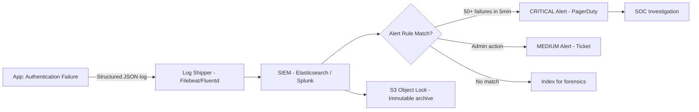

⚡ TL;DR - Security logging: capture authentication events (success,
failure, lockout), authorization decisions (granted, denied), security
configuration changes, and data access events. OWASP A09:2021 defines
this as a top 10 category specifically because inadequate logging
means you can't detect or investigate security incidents. Three key
rules: log WHO did WHAT to WHAT and WHEN (structured format), never
log sensitive data (passwords, tokens, PII in logs), and ship logs to
a centralized, tamper-evident system before the app is attacked.
Mean Time to Detect (MTTD) for breaches is 194 days globally (IBM 2023)
- most of that is inadequate security logging visibility.

---

| #073 | Category: Security | Difficulty: ★★★ |
|:---|:---|:---|
| **Depends on:** | OWASP Top 10, Authentication, Session Management, Secrets Management, IAM, OWASP Workshop | |
| **Used by:** | Insufficient Logging Anti-Pattern, IR Process, Security Observability + SIEM, DevSecOps, CSIRT Design, SIEM Architecture Design | |
| **Related:** | Session Management, Secrets Management, IR Process, Security Observability + SIEM, Insufficient Logging Anti-Pattern | |

---

### 🔥 The Problem This Solves

**THE COST OF INADEQUATE SECURITY LOGGING:**

```
IBM COST OF A DATA BREACH REPORT 2023:
  - Mean Time to Identify (MTTI): 204 days
  - Mean Time to Contain (MTTC): 73 days
  - Total MTTD + MTTC: 277 days (9.1 months)
  - Cost of breach identified in <200 days: $3.93M
  - Cost of breach identified in >200 days: $4.76M
  - The logging gap costs $830K per incident on average.

THE DETECTION PROBLEM (why 204 days to detect?):

  CASE 1: No security logs:
    Attacker authenticates with stolen credentials (correct user + pass).
    No log entry shows: unusual IP, unusual time, unusual volume of access.
    App logs: "User X logged in successfully" (same as every day).
    Detection: 0 days to years. Often detected by: user complaint,
    external researcher, or annual audit.
  
  CASE 2: Security logs exist but not monitored:
    Attacker tries 1000 passwords on admin account.
    Authentication failure log shows 1000 entries in 60 seconds.
    Log is written to the server's /var/log/app/auth.log.
    No one is watching /var/log/app/auth.log.
    Detection: never (unless someone manually reviews logs).
    OWASP A09 violation: logging exists but no monitoring/alerting.
  
  CASE 3: Security logs + SIEM alerting:
    1000 authentication failures in 60 seconds → alert fires → 
    SOC analyst investigates → IP blocked →
    Incident contained in hours, not months.

WHAT MUST BE LOGGED (OWASP A09 guidance):

  Authentication events:
    - Login success (who, from where, at what time)
    - Login failure (who attempted, from where, how many times)
    - Logout
    - Account lockout (trigger: repeated failures)
    - MFA failure, MFA bypass attempt
    - Password reset requests
    - Session timeout/expiry
  
  Authorization events:
    - Access denied (who tried to access what they shouldn't)
    - Privilege escalation events
    - Admin actions (user creation, deletion, role changes)
    - Access to sensitive data (PII, financial records, health data)
  
  Security configuration changes:
    - Firewall rule changes
    - IAM role changes (AWS CloudTrail for this)
    - Application configuration changes
    - Security policy changes
  
  Application security events:
    - Input validation failures (potential injection attack attempts)
    - Security-relevant exceptions (access denied exceptions, not NullPointerExceptions)
    - API rate limit violations
    - Suspicious patterns (user switching between accounts rapidly, unusual geo)

WHAT MUST NOT BE LOGGED:
    - Passwords (plaintext or any form)
    - Session tokens, JWTs, API keys
    - Full credit card numbers (only last 4 digits)
    - Full SSNs, passport numbers
    - Encryption keys
    These make logs a new attack surface. Log only enough to identify
    WHO (user ID, not credentials) and WHAT (the event, not the sensitive data).
```

---

### 📘 Textbook Definition

**Security logging:** The systematic recording of security-relevant
events with sufficient context (who, what, when, from where) to
enable detection, investigation, and forensic analysis of security
incidents.

**Security monitoring:** Active analysis of security logs in near-real-time
to detect anomalous patterns, alert on security events, and trigger
incident response workflows.

**SIEM (Security Information and Event Management):** A centralized
platform (Splunk, Elastic Security, AWS Security Hub, Microsoft
Sentinel) that collects logs from all sources, correlates events
across systems, applies detection rules, and generates alerts.

**Audit log:** An immutable, tamper-evident log of all security-relevant
actions. Audit logs must be: comprehensive (all relevant events), intact
(no deletions, modifications), accessible (queryable for investigations),
and protected (attackers cannot erase evidence of their activity).

**OWASP A09:2021 - Security Logging and Monitoring Failures:** One of
OWASP's top 10 web application security risks. The category covers:
insufficient logging, ineffective monitoring, no alerting on suspicious
patterns, logs only stored locally (not centralized), log injection,
sensitive data in logs.

**Log injection:** An attacker-controlled input is written to the log,
allowing: injection of fake log entries (forge an "admin logged in from
trusted IP" entry), log format manipulation, XSS in log viewers, or
injection of newlines to split entries.

---

### ⏱️ Understand It in 30 Seconds

**One line:**
Security logging captures who did what, when, and from where -
so that when a breach happens (not if), you can detect it
quickly and reconstruct the attacker's path.

**One analogy:**
> Security logging is the security camera and access card
> system for a bank, not just the vault lock.
>
> The vault lock (authentication) prevents unauthorized access.
> But when the lock is bypassed (stolen credential, duplicate key):
> the security camera records who entered, at what time, via which door.
> The access card system records every door opened.
>
> Without cameras and access logs: you discover the vault is empty
> the next morning. You know nothing about how it happened.
> With them: you know the perpetrator, entry point, timeline, and
> exactly what was taken.
>
> Security logs + SIEM = the bank's camera system.
> Without them: you're finding out about breaches from your customers
> (or the news). That's the 204-day average detection time.

---

### 🔩 First Principles Explanation

**Structured security logging in Java (SLF4J + Logback):**

```
STRUCTURED SECURITY LOG FORMAT:

  Key requirement: logs must be parseable by SIEM tools.
  Structured JSON format (not freeform text).
  
  Required fields for security events:
    timestamp   - ISO 8601 with timezone
    level       - INFO, WARN, ERROR (security events = at least WARN)
    event_type  - AUTHENTICATION, AUTHORIZATION, DATA_ACCESS, ADMIN_ACTION
    user_id     - who (not username, use opaque ID where possible)
    ip_address  - source IP (from X-Forwarded-For if behind proxy)
    action      - what was done
    resource    - what was accessed
    result      - SUCCESS or FAILURE
    reason      - why (for failures: INVALID_CREDENTIALS, ACCOUNT_LOCKED, etc.)
    request_id  - correlation ID for distributed tracing
  
  BAD - freeform security log:
    logger.warn("Login failed for user " + username + " from " + ip);
    // Bad: (1) string concat, (2) not structured, (3) SIEM can't parse reliably
    // Also: what if username contains newline? Log injection attack.
  
  GOOD - structured security log:
    logger.warn("Authentication failed",
        Map.of(
            "event_type", "AUTHENTICATION",
            "user_id", userId,          // opaque ID, not email/username
            "ip_address", getClientIP(request),  // resolved proxy headers
            "action", "LOGIN",
            "result", "FAILURE",
            "reason", "INVALID_CREDENTIALS",
            "request_id", MDC.get("requestId")
        )
    );
  
  Logback configuration (JSON output):
    <!-- logback-spring.xml -->
    <appender name="JSON_CONSOLE"
              class="ch.qos.logback.core.ConsoleAppender">
      <encoder class="net.logstash.logback.encoder.LogstashEncoder">
        <!-- Includes all MDC fields + structured key-value pairs -->
      </encoder>
    </appender>
    
    <!-- Security events appender: separate file, higher retention -->
    <appender name="SECURITY_AUDIT"
              class="ch.qos.logback.core.rolling.RollingFileAppender">
      <file>/var/log/app/security-audit.log</file>
      <encoder class="net.logstash.logback.encoder.LogstashEncoder"/>
      <rollingPolicy ...>
        <maxHistory>365</maxHistory> <!-- 1 year retention for audit logs -->
      </rollingPolicy>
    </appender>

PREVENTING LOG INJECTION:

  Problem: User inputs can contain newlines, log delimiters, or control chars.
  
  Attack: username = "admin\nEVENT: SUCCESSFUL_ADMIN_LOGIN user=admin"
  Unprotected log: "LOGIN_FAILED user=admin\nEVENT: SUCCESSFUL_ADMIN_LOGIN user=admin"
  
  Log reads as if an admin login succeeded (fake entry injected).
  
  Fix: sanitize user-controlled data before logging:
    // Encode newlines, carriage returns, and control characters:
    String safeValue = value
        .replace("\\n", "\\\\n")  // escape actual newlines
        .replace("\\r", "\\\\r")  // escape carriage returns
        .replaceAll("[\\x00-\\x1F\\x7F]", "?");  // replace control chars
    
    // Better: use structured logging framework (log key=value not freeform)
    // JSON encoding handles this automatically:
    // {"user": "admin\nEVENT: FAKE"} → stored as escaped JSON string
    // SIEM sees the user field as a string value, not as additional log lines

CLIENT IP EXTRACTION (behind proxy/load balancer):

  @Component
  public class SecurityLoggingUtil {
      
      // Order matters: X-Forwarded-For is the client IP if behind load balancer
      private static final List<String> IP_HEADERS = List.of(
          "X-Forwarded-For",
          "X-Real-IP",
          "Proxy-Client-IP",
          "WL-Proxy-Client-IP"
      );
      
      public String getClientIP(HttpServletRequest request) {
          for (String header : IP_HEADERS) {
              String ip = request.getHeader(header);
              if (ip != null && !ip.isEmpty() && !"unknown".equalsIgnoreCase(ip)) {
                  // X-Forwarded-For may contain: "203.0.113.1, 10.0.0.1"
                  // (original client + proxy chain)
                  return ip.split(",")[0].trim();  // Take first (original client)
              }
          }
          return request.getRemoteAddr();
      }
  }
  
  // IMPORTANT: Only trust X-Forwarded-For if the load balancer
  // STRIPS and RE-ADDS the header (not just appends).
  // Otherwise: client can spoof X-Forwarded-For header.
  // AWS ALB/NLB: strips and re-adds X-Forwarded-For - trustworthy.
  // Custom proxy: verify its behavior.
```

---

### 🧪 Thought Experiment

**SCENARIO: Detecting brute-force attack via centralized security logs:**

```
CENTRALIZED LOG ARCHITECTURE:

  Application → CloudWatch Logs / Filebeat → Elasticsearch (SIEM) →
  Kibana Dashboard + Alert Rules

DETECTION RULE - Brute Force Attack:

  Rule logic (Elasticsearch/SIEM alert):
    Query: event_type="AUTHENTICATION" AND result="FAILURE"
    Timeframe: 5 minutes
    Threshold: count > 50 per ip_address
    → Alert: "Brute force detected from IP X"

  Kibana/Elasticsearch KQL:
    event_type: "AUTHENTICATION" AND result: "FAILURE"
    AND @timestamp:[now-5m TO now]
    Aggregate by: ip_address
    Condition: count > 50

  Alert action:
    → PagerDuty / Slack alert to SOC
    → Auto-block IP in WAF (if integrated with rule engine)
    → Create incident ticket

ACCOUNT TAKEOVER DETECTION:

  Rule: Successful login from DIFFERENT geo in short window:
    
    Query: event_type="AUTHENTICATION" AND result="SUCCESS"
    Join on user_id: 
      Previous login: ip_address=203.0.113.1 (US), time=10:00
      Current login:  ip_address=185.0.1.1 (Russia), time=10:05
      Delta: 5 minutes
    → Impossible travel detected
    → Alert + Force re-authentication

AUDIT LOG INTEGRITY:

  Problem: Attacker who gains access to the server
  can delete or modify local log files to cover tracks.
  
  Solution: ship logs to centralized external system
  BEFORE the attacker can delete them.
  
  Architecture:
    App server → Fluentd/Filebeat (ship in real-time) →
    AWS CloudWatch Logs / Elasticsearch →
    S3 with Object Lock (WORM - Write Once Read Many)
  
  Once in CloudWatch Logs or S3 Object Lock: cannot be deleted
  (even by root) for the configured retention period.
  This is immutable audit log storage.

COMPLIANCE RETENTION REQUIREMENTS:
  - PCI-DSS: 12 months (90 days immediately accessible)
  - SOC 2: 1 year
  - GDPR: only as long as necessary (then purge PII)
  - HIPAA: 6 years
  - General security: minimum 1 year recommended
```

---

### 🧠 Mental Model / Analogy

> Security logging is a two-part system: the flight recorder
> (black box) AND the air traffic control radar.
>
> Black box (audit log): records everything that happened.
> Even if the plane crashes (breach), you can recover and
> reconstruct exactly what occurred. Immutable.
> But: the black box tells you what happened AFTER the crash.
>
> Air traffic radar (SIEM monitoring): watches events in real-time.
> Detects anomalies: "this plane is deviating from its flight plan."
> Enables intervention: "redirect/abort before the crash."
>
> You need both:
> - Logs alone: 204-day detection time (retrospective analysis only).
> - Monitoring alone without logs: alert fires, but no forensic data
>   to understand what happened or scope the incident.
> - Logs + SIEM monitoring: detection in hours, forensic data for response.
>
> The flight recorder stores the data.
> Air traffic control uses the data to detect and prevent.

---

### 📶 Gradual Depth - Five Levels

**Level 1 - What it is (anyone can understand):**
Security logging means your application keeps detailed records of security-relevant events: who logged in, who was denied access, who changed settings, who accessed sensitive data. These logs enable two things: real-time detection (alerting when something suspicious happens) and post-incident forensics (reconstructing what happened after a breach).

**Level 2 - How to use it (junior developer):**
Log authentication events (success AND failure), authorization denials, admin actions, and data access events. Use structured JSON format (not freeform text) so SIEM tools can parse it. NEVER log passwords, tokens, or PII. Ship logs to a centralized system (CloudWatch Logs, Splunk, Elasticsearch) immediately - don't rely only on local log files. Add correlation IDs (request IDs) to link related events across services.

**Level 3 - How it works (mid-level engineer):**
Use a centralized logging pipeline: application → log shipper (Fluentd/Filebeat) → SIEM (Elasticsearch/Splunk/CloudWatch). Log enrichment: add user ID, IP, request ID, geographic location. Set up SIEM detection rules: brute force (50+ auth failures/5min from same IP), impossible travel (same account from two countries within 30 min), privilege escalation (admin actions by non-admin users). Alert routing: high-severity to PagerDuty, low-severity to Slack. Immutable log storage: AWS CloudWatch Logs + S3 Object Lock (WORM) prevents log tampering by attackers.

**Level 4 - Why it was designed this way (senior/staff):**
OWASP added Security Logging and Monitoring Failures as A09 specifically because the average breach goes undetected for 204 days - and inadequate logging is the primary reason. The Equifax 2017 breach: the HTTPS inspection tool that would have detected the intrusion had expired certificates for 19 months, creating a blind spot. The attackers were inside for 76 days. With proper monitoring: the unusual volume of database access queries would have triggered alerts within hours. Security logging is not just an audit requirement - it's the detection mechanism. Without it, security controls are purely preventative (block breaches before they happen), with no detective capability. Defense-in-depth requires both prevention AND detection.

**Level 5 - Mastery (distinguished engineer):**
Advanced security observability: UEBA (User and Entity Behavior Analytics) uses machine learning to establish behavioral baselines for each user and entity, then alerts on statistical deviations. A user who always downloads 100 documents/day downloading 10,000 documents in one session: anomalous, even if each individual download is authorized. UEBA catches insider threats and compromised accounts that rule-based systems miss. Log data quality: the value of SIEM is entirely dependent on log quality. Missing events (application errors that prevent logging, log shipper failures, sampling) create blind spots. Chaos engineering for logging: periodically introduce test security events and verify they appear in the SIEM as expected. Security observability SLOs: define "we will detect X category of threat within Y minutes" and measure against it. Zero Trust logging: in ZT architectures, every access decision is logged (not just denials), creating comprehensive behavioral visibility.

---

### ⚙️ How It Works (Mechanism)

```
SECURITY LOGGING PIPELINE:

  Application           Log Shipper     SIEM/Central          Immutable Storage
  ─────────────         ───────────     ──────────────        ─────────────────
  auth event            Filebeat        Elasticsearch         S3 Object Lock
  JSON log →    ───→   (ship to) ──→   (index + search)  →   (WORM archive)
  /var/log/             real-time       + Kibana alerts       90-day min
  app/security.log      delivery        + PagerDuty           regulatory
  
  LOCAL LOG:                            CENTRALIZED:          IMMUTABLE:
  - Writable by app                     - Aggregated          - Cannot delete
  - Deletable by attacker               - Searchable          - Tamper-evident
  - Single server blind spot            - Alertable           - Compliance

ALERT ESCALATION:
  Log event → SIEM rule match → Severity?
    CRITICAL (active breach indicator) → PagerDuty (15min SLA)
    HIGH (suspicious activity)         → Slack + ticket
    MEDIUM (policy violation)          → Ticket, reviewed daily
    LOW (informational)                → Dashboard, reviewed weekly
```



---

### 💻 Code Example

**Spring Boot security event logging filter:**

```java
// SecurityAuditFilter.java
@Component
@Order(Ordered.HIGHEST_PRECEDENCE)
public class SecurityAuditFilter extends OncePerRequestFilter {
    
    private static final Logger log = LoggerFactory.getLogger("security.audit");
    
    @Override
    protected void doFilterInternal(
            HttpServletRequest request,
            HttpServletResponse response,
            FilterChain chain) throws IOException, ServletException {
        
        String requestId = UUID.randomUUID().toString();
        MDC.put("requestId", requestId);  // Correlation ID
        
        long startTime = System.currentTimeMillis();
        try {
            chain.doFilter(request, response);
        } finally {
            int status = response.getStatus();
            
            // Log all 401/403 responses as security events:
            if (status == 401 || status == 403) {
                String eventType = status == 401
                    ? "AUTHENTICATION_FAILURE"
                    : "AUTHORIZATION_FAILURE";
                
                log.warn("Security event",
                    StructuredArguments.entries(Map.of(
                        "event_type", eventType,
                        "http_status", status,
                        "method", request.getMethod(),
                        "path", request.getRequestURI(),
                        "ip_address", getClientIP(request),
                        "user_agent", sanitize(
                            request.getHeader("User-Agent")
                        ),
                        "request_id", requestId,
                        "duration_ms", System.currentTimeMillis() - startTime
                    ))
                );
            }
            
            MDC.clear();
        }
    }
    
    // Sanitize user-controlled data before logging:
    private String sanitize(String value) {
        if (value == null) return null;
        // Remove newlines (log injection prevention):
        return value.replace("\\n", "\\\\n")
                    .replace("\\r", "\\\\r")
                    .replaceAll("[\\x00-\\x1F\\x7F]", "?")
                    .substring(0, Math.min(value.length(), 256));  // Limit length
    }
}
```

---

### ⚖️ Comparison Table

| Aspect | OWASP A09 Compliant | Non-Compliant |
|:---|:---|:---|
| **Log format** | Structured JSON, machine-parseable | Freeform text, inconsistent format |
| **Storage** | Centralized SIEM + immutable archive | Local log files only |
| **Coverage** | Auth, authz, admin, data access | Application errors only |
| **Sensitive data** | Never logged (tokens, passwords, PII) | Credentials in debug logs |
| **Monitoring** | SIEM rules, real-time alerts | No monitoring - manual review |
| **Retention** | 1 year+ per compliance requirement | Rotated after 7 days |
| **Log injection** | Sanitized before logging | Raw user input in logs |

---

### ⚠️ Common Misconceptions

| Misconception | Reality |
|:---|:---|
| "We're logging everything, so we're covered." | Logging without monitoring is a filing cabinet no one reads. OWASP A09 specifically calls out "ineffective monitoring and alerting" as distinct from logging. The IBM 204-day average detection time is high despite most organizations having some logging - because no one is watching the logs in real-time. The requirement is: logs exist AND are shipped to a centralized SIEM AND have alerting rules configured AND alerts are routed to someone who will act on them. Logging without the monitoring/alerting chain provides forensic value after a breach is discovered by other means, but does nothing to reduce MTTD. |
| "Debug logging captures everything I need for security." | Debug logging captures application behavior for development. Security logging captures security-relevant events for compliance and threat detection. Debug logs often INCLUDE security liabilities: credentials in request parameters, tokens in debug output, PII in query strings. The OWASP requirement is specific: log authentication events, authorization denials, and security-relevant configuration changes - not application debug info. Debug and security logging have opposing requirements: debug logging should be verbose and include context for debugging; security logging should be precise, structured, and should EXCLUDE sensitive data. Use separate log destinations (appenders) with different retention and access controls. |

---

### 🚨 Failure Modes & Diagnosis

**Common security logging problems:**

```
PROBLEM 1: Authentication events not logged
  
  Symptom: Brute-force attack runs for days. No alerts.
  SIEM query for auth failures returns 0 results.
  
  Diagnosis:
    - Is the auth library logging failures?
    - Spring Security: configure AuthenticationFailureHandler
    - Verify log level is not filtering security logs
    - Check if application is behind API gateway that handles auth
      (the gateway may need to log, not the application)
  
  Fix: Add SecurityAuditFilter that logs all 401/403 responses.

PROBLEM 2: Sensitive data found in security logs
  
  Symptom: SIEM search reveals password= fields in logs.
  Security audit finds: "Login failed for user john@example.com
  with password=hunter2"
  
  Fix:
    1. Sanitize logging calls: never include password fields.
    2. Add log scanning in CI: grep for password|token|secret in log output.
    3. Configure HTTP server to not log request bodies.
    4. Mask: use [REDACTED] or *** for sensitive field values.
    5. Retroactively purge the sensitive data from the SIEM (GDPR compliance).

PROBLEM 3: Log shipper drops events under load
  
  Symptom: During incident investigation, SIEM shows gaps in log coverage
  during the attack window (attackers often cause high load).
  
  Fix:
    Use log buffer (Kafka between app and SIEM):
      App → Filebeat → Kafka → Logstash → Elasticsearch
      Kafka provides durable buffering: events not dropped under load.
    Set Filebeat backpressure: block application if log shipper can't keep up
    (better to slow app than to drop security events).
    Monitor: track log ingestion rate in SIEM. Alert on rate drops.
```

---

### 🔗 Related Keywords

**Prerequisites:**
- `Session Management` - session events to log
- `IAM` - authorization events to log
- `OWASP Top 10 A09` - the specific requirement

**Builds on this:**
- `Security Observability + SIEM` - SIEM architecture
- `IR Process` - using logs in incident response
- `SIEM Architecture Design` - detailed SIEM design
- `Insufficient Logging Anti-Pattern` - what failure looks like

---

### 📌 Quick Reference Card

```
┌──────────────────────────────────────────────────────────┐
│ OWASP A09     │ Security Logging and Monitoring Failures  │
├───────────────┼───────────────────────────────────────────┤
│ LOG WHAT      │ Auth success/fail, authz deny, admin acts │
│               │ Data access, config changes               │
│ NEVER LOG     │ Passwords, tokens, PII, card numbers      │
├───────────────┼───────────────────────────────────────────┤
│ FORMAT        │ Structured JSON, event_type, user_id,     │
│               │ ip_address, result, timestamp, request_id │
├───────────────┼───────────────────────────────────────────┤
│ PIPELINE      │ App → Filebeat → Elasticsearch → S3 WORM │
├───────────────┼───────────────────────────────────────────┤
│ ALERTS        │ Brute force: 50+ failures/5min/IP         │
│               │ Impossible travel, privilege escalation   │
├───────────────┼───────────────────────────────────────────┤
│ RETENTION     │ Minimum 1 year, S3 Object Lock for WORM   │
└──────────────────────────────────────────────────────────┘
```

---

### 💎 Transferable Wisdom

**Reusable Engineering Principle:**
"Observability determines the speed of response to failure."
In reliability engineering (SRE): good observability means fast
MTTD (Mean Time to Detect) and MTTR (Mean Time to Resolve) for
production incidents. Poor observability means debugging in the dark.
In security: good observability (logging + SIEM) means fast MTTD
for breaches. The IBM data is clear: organizations with advanced
security observability detect breaches in days; those without detect
in months.
The principle transfers: whether the failure is a service outage
or a security breach, the system that records what happened with
sufficient context to understand WHY it happened will be resolved
faster than the system where you're guessing.
The design implication: security logging is not bolted on at the end -
it's an architectural requirement designed alongside the authentication,
authorization, and data access systems. Every authentication decision,
authorization decision, and sensitive data access should have an
associated log event by design.
When you design the authentication flow: also design what gets logged
when it succeeds and fails, what goes to the SIEM, and what triggers
an alert. Security observability is a first-class design concern,
not a JIRA ticket created by the compliance team in Sprint 47.

---

### 💡 The Surprising Truth

The Equifax 2017 breach (145.5 million records, $1.4 billion in losses)
was in progress for 76 days before detection. The Apache Struts
vulnerability (CVE-2017-5638) was exploited on May 13, 2017.
The breach was discovered on July 29, 2017.

The reason for the 76-day detection window was not that Equifax had
no monitoring. Equifax had a HTTPS traffic inspection tool that would
have revealed the malicious traffic patterns if it had been working.
The tool had been using an expired TLS certificate for 19 months
- since January 2016. During those 19 months, TLS inspection was
effectively disabled, creating a complete blind spot.

An expired certificate in a SECURITY MONITORING tool created
a 19-month blind spot that allowed a 76-day breach to go undetected.

The lesson: security monitoring infrastructure must itself be monitored.
Certificate expiry on security tools, log shipper failures, SIEM
rule failures, and monitoring gaps are themselves security vulnerabilities.

In the post-breach review, Equifax implemented automated certificate
management and monitoring health checks for all security tools.

The meta-lesson: "We have monitoring" is not the same as
"Our monitoring is working." Monitoring must be continuously
verified through synthetic test events (inject a known security event,
verify it appears in the SIEM as expected).

---

### ✅ Mastery Checklist

**You've mastered this when you can:**
1. **ENUMERATE** what security events must be logged (auth, authz, admin,
   data access) and what MUST NOT be logged (passwords, tokens, PII).
2. **DESIGN** a structured security log event (required fields, JSON format,
   log injection prevention, sanitization).
3. **CONFIGURE** a SIEM alerting rule for brute-force detection and
   explain the log pipeline from application to immutable storage.
4. **DIAGNOSE** the Equifax breach in terms of OWASP A09: what logging
   and monitoring failures occurred, and what controls would have detected it sooner.

---

### 🎯 Interview Deep-Dive

**Q: What is OWASP A09? What should be logged in a web application,
and what should not be? How do you detect a brute-force attack?**

*Why they ask:* Security observability is critical for SecOps/DevSecOps
roles. Tests whether candidate knows specifics, not just "log everything."

*Strong answer covers:*
- OWASP A09 (Security Logging and Monitoring Failures): inadequate logging
  means breaches go undetected for 204 days average (IBM 2023 data).
- What to log: authentication events (success, failure, lockout),
  authorization denials, admin actions, data access to sensitive records,
  security configuration changes.
- What NOT to log: passwords, tokens, JWTs, API keys, full card numbers,
  SSNs, PII. These make logs a new attack surface.
- Log format: structured JSON. Fields: event_type, user_id, ip_address,
  action, resource, result, reason, request_id, timestamp.
- Centralized logging: app → Filebeat → Elasticsearch/Splunk → S3 Object Lock
  (immutable). Local logs only = attackers can delete evidence.
- Brute-force detection SIEM rule: 50+ auth failures in 5 minutes from same IP
  → alert + auto-block in WAF.
- Log injection prevention: sanitize user-controlled data before logging
  (escape newlines, limit length). Use structured logging (JSON handles escaping).
- Retention: 1 year minimum. S3 Object Lock for WORM compliance.
- Example: Equifax 76-day breach detection delay due to expired TLS inspection
  cert (monitoring tool blind spot). Security monitoring must itself be monitored.