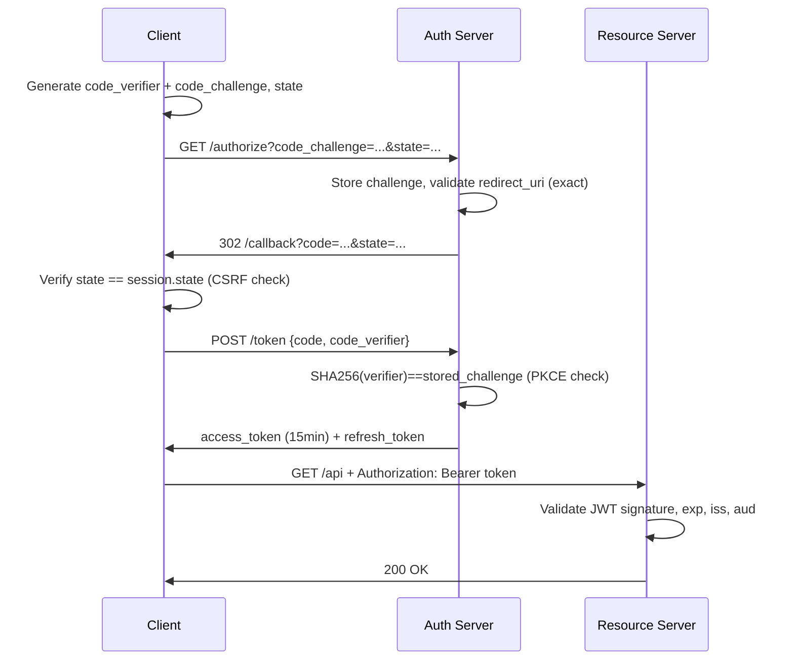

⚡ TL;DR - RFC 9700 (OAuth 2.0 Security Best Practices) is the
definitive security guidance for OAuth 2.0 deployments. Key mandates:
(1) Authorization Code + PKCE for ALL clients (including public clients
that previously used Implicit flow - now deprecated), (2) NEVER use
Implicit flow or Password grant, (3) validate redirect_uri strictly
(exact match, not prefix/substring), (4) use state parameter with
anti-CSRF random value, (5) short-lived access tokens (15-30 min),
(6) binding refresh tokens to clients. The most common implementation
error: open redirect via loose redirect_uri validation.

---

| #074 | Category: Security | Difficulty: ★★★★ |
|:---|:---|:---|
| **Depends on:** | OWASP Top 10, Authentication, OAuth 2.0, OIDC, Session Management, CORS, Secrets Management, JWT Security | |
| **Used by:** | OAuth vs SAML Decision, Advanced JWT Attacks, OAuth Implicit Flow Deprecation, DevSecOps, SSDLC | |
| **Related:** | OAuth 2.0, OIDC, Session Management, CORS, JWT Security Anti-Patterns, OAuth Implicit Flow Deprecation | |

---

### 🔥 The Problem This Solves

**OAUTH 2.0 SECURITY FAILURES IN THE WILD:**

```
COMMON OAUTH SECURITY MISTAKES AND THEIR CONSEQUENCES:

1. OPEN REDIRECT via loose redirect_uri validation:
   
   Attack:
     Authorization request:
     /authorize?response_type=code&client_id=app&
     redirect_uri=https://legit.com.attacker.com/callback
     
     If authorization server validates: "starts with https://legit.com"
     → PASS (because "https://legit.com.attacker.com" starts with that)
     
     User authenticates → auth code sent to attacker's domain.
     Attacker exchanges code for access token.
     
   RFC 9700 requirement: EXACT URI match only.
   No wildcards. No prefix matching. No open redirects.

2. AUTHORIZATION CODE INTERCEPTION (without PKCE):
   
   Attack scenario (native mobile app):
     Mobile app registers custom scheme: myapp://callback
     Another malicious app on the device also registers: myapp://callback
     (No uniqueness enforcement for custom URI schemes on mobile).
     
     Authorization code arrives → OS asks which app to handle → 
     malicious app intercepts the code.
     Malicious app exchanges code for access token.
   
   PKCE (Proof Key for Code Exchange) prevents this:
     Legitimate app generates: code_verifier (random 43-128 chars)
     Sends with auth request: code_challenge = SHA256(code_verifier)
     When exchanging code: provides code_verifier
     Auth server verifies: SHA256(provided_verifier) == stored_challenge
     Attacker has code but not code_verifier → exchange fails.

3. CSRF against the OAuth callback:
   
   Attack:
     Attacker starts auth flow on their own account.
     Captures their own authorization code URL.
     Sends the URL to victim (in email/message).
     Victim (already logged in) clicks the URL.
     Victim's account linked to attacker's identity.
     Attacker now has access to victim's account.
   
   State parameter prevents this:
     Auth request includes: state=random_csrf_token
     On callback: verify state == original token from user's session.
     Attacker's state token is different from victim's session state.
     Victim's browser rejects the callback (state mismatch).

4. ACCESS TOKEN LEAKAGE via browser history/logs:
   
   Implicit flow: access token in URL fragment.
   URL fragment appears in:
   - Browser history
   - Referer headers sent to third-party resources on the page
   - Server access logs (if the fragment is logged)
   - JavaScript frameworks that log URLs
   
   RFC 9700: NEVER use Implicit flow. Use Authorization Code + PKCE.
   Access token is never in the URL.

5. TOKEN INJECTION via TOKEN BINDING issues:
   
   Authorization code is issued for a specific client.
   If stolen (before redemption): can be redeemed by attacker.
   PKCE binds the code to the PKCE verifier (attacker doesn't have it).
   Redirect URI validation also helps: code only valid for registered URI.
```

---

### 📘 Textbook Definition

**RFC 9700 (OAuth 2.0 Security Best Practices):** Published January 2025,
this RFC updates and supersedes the security guidance in RFC 6749 (OAuth
2.0) and the previous BCP 212 (OAuth 2.0 Security Best Current Practices).
It mandates specific security controls for all OAuth 2.0 deployments.

**PKCE (Proof Key for Code Exchange, RFC 7636):** An extension to
Authorization Code flow that prevents authorization code interception.
The client generates a secret (code_verifier), sends its hash in the
auth request (code_challenge), then proves knowledge of the secret when
exchanging the code. Makes the code useless without the verifier.

**Authorization Code flow:** The secure flow for all clients. The
authorization server returns an auth code (short-lived, single-use) via
redirect. The client exchanges the code for tokens via a back-channel
(server-to-server) POST request. Access tokens never appear in URLs.

**Implicit flow (DEPRECATED):** Former "browser-based" flow where the
access token was returned directly in the URL fragment. Deprecated by
RFC 9700 due to token leakage via browser history and referrer headers.

**state parameter:** An opaque random value sent with the auth request
and verified on the callback. Prevents CSRF attacks against the OAuth
callback. Must be unpredictable (cryptographically random) and bound
to the user's session.

**Token endpoint authentication:** Confidential clients authenticate to
the token endpoint using client_secret_basic (HTTP Basic), client_secret_post
(POST body), or preferably private_key_jwt (asymmetric signing). Public
clients (SPAs, mobile apps) cannot have secrets; use PKCE instead.

---

### ⏱️ Understand It in 30 Seconds

**One line:**
RFC 9700 mandates: use Authorization Code + PKCE for everything
(including browser apps), validate redirect URIs exactly, use
state for CSRF protection, and retire Implicit flow and Password grant.

**One analogy:**
> OAuth without PKCE is like a valet parking system where you give
> the valet a ticket, and anyone who intercepts the ticket can
> pick up your car.
>
> PKCE adds: the ticket is paired with a secret only you know.
> Even if someone intercepts the ticket (authorization code):
> they can't present it at the pickup window without your secret
> (code_verifier). The token exchange fails.
>
> PKCE makes authorization codes single-use AND bound to the
> requester - interception becomes useless.
>
> The state parameter is the parking lot security guard who
> checks that the person picking up the car matches who dropped it off.
> CSRF: someone tricks you into picking up a different car.
> State verification: "Is this the car you dropped off? Here's your
> claim ticket - does it match?"

---

### 🔩 First Principles Explanation

**Authorization Code + PKCE flow (RFC 9700 compliant):**

```
STEP-BY-STEP: AUTHORIZATION CODE + PKCE

Step 1: CLIENT GENERATES PKCE VALUES
  
  code_verifier = secure_random_string(length=64)
  # e.g., "dBjftJeZ4CVP-mB92K27uhbUJU1p1r_wW1gFWFOEjXk"
  # Length: 43-128 characters, URL-safe base64
  
  code_challenge = base64url(SHA256(code_verifier))
  # SHA256 of the verifier, then base64url-encoded
  
  state = secure_random_string(length=32)
  # Anti-CSRF token - store in session
  session.set("oauth_state", state)

Step 2: AUTHORIZATION REQUEST (client → auth server)
  
  GET /authorize?
    response_type=code
    &client_id=my-spa-app
    &redirect_uri=https://app.example.com/callback    # Exact, pre-registered URI
    &scope=openid profile email
    &state=STATE_VALUE                                # Anti-CSRF token
    &code_challenge=CODE_CHALLENGE_VALUE              # PKCE: SHA256 hash
    &code_challenge_method=S256                       # PKCE: always S256 (not plain)

Step 3: USER AUTHENTICATES at auth server

Step 4: AUTHORIZATION SERVER sends callback:
  
  GET https://app.example.com/callback?
    code=AUTHORIZATION_CODE    # Short-lived: 30-60 seconds max
    &state=STATE_VALUE

Step 5: CLIENT validates state, then exchanges code

  // CRITICAL: verify state before doing anything else
  if (request.params.state !== session.get("oauth_state")) {
      throw new CsrfException("State mismatch - CSRF attack");
  }
  session.remove("oauth_state");  // Use once, then discard
  
  // Token exchange (back-channel: server-to-server):
  POST /token
  Content-Type: application/x-www-form-urlencoded
  
  grant_type=authorization_code
  &code=AUTHORIZATION_CODE
  &redirect_uri=https://app.example.com/callback    # Must match exactly
  &client_id=my-spa-app
  &code_verifier=CODE_VERIFIER_VALUE                # PKCE: proves possession

Step 6: AUTH SERVER validates PKCE:
  
  Stored at step 2: code_challenge = SHA256(code_verifier)
  Now receives: code_verifier
  Verifies: SHA256(received_verifier) == stored_code_challenge
  
  If match: issue access token + refresh token
  If no match: reject (attacker intercepted code but doesn't have verifier)

Step 7: AUTH SERVER responds:
  
  {
    "access_token": "eyJhbGci...",   # JWT or opaque token
    "token_type": "Bearer",
    "expires_in": 900,               # 15 minutes (RFC 9700: short-lived)
    "refresh_token": "...",          # For long-lived sessions
    "scope": "openid profile email"
  }
```

**RFC 9700 Critical Security Requirements:**

```
RFC 9700 REQUIREMENTS SUMMARY:

1. DEPRECATED GRANT TYPES (MUST NOT USE):
   
   Implicit (response_type=token): DEPRECATED - RFC 9700 §2.1.2
     Reason: tokens in URL fragments → browser history, referrer leakage
   
   Resource Owner Password Credentials (ROPC):
     DEPRECATED - RFC 9700 §2.4
     Reason: requires app to handle user password (violates delegation model)
     Acceptable only: migration scenarios, strong justification

2. REDIRECT URI VALIDATION:
   
   MUST: exact string comparison
   MUST NOT: partial matching, prefix matching, wildcard, regex patterns
   
   BAD:
     Registered: https://app.example.com
     Accepts: https://app.example.com.attacker.com (prefix match)
     Accepts: https://app.example.com/anything (path is not registered)
   
   GOOD:
     Registered: https://app.example.com/oauth/callback
     Accepts ONLY: https://app.example.com/oauth/callback (exact)
   
   Multiple redirect URIs allowed:
     Register each explicitly (https://app.example.com/callback,
     https://staging.example.com/callback, etc.)

3. TOKEN LIFETIME:
   
   Access tokens: SHORT (15-30 minutes recommended)
   Reason: minimize window if token is compromised
   
   Refresh tokens: LONGER but rotated
   Refresh token rotation (sender-constrained):
     Each use of a refresh token issues a NEW refresh token.
     Old refresh token is immediately invalidated.
     If old token is used again → detect replay → revoke ALL tokens.

4. PKCE: MANDATORY for all public clients (SPAs, mobile apps)
   code_challenge_method=S256 ONLY (not 'plain')

5. CLIENT AUTHENTICATION:
   Confidential clients (server-side apps with secrets):
     Prefer: private_key_jwt (asymmetric) over client_secret_basic
     Reason: asymmetric auth uses key that never leaves the client
   
   Public clients: CANNOT have secrets. Use PKCE.

6. NONCE for OIDC (OpenID Connect):
   Include nonce in the auth request.
   Auth server includes nonce in the ID token.
   Client verifies: nonce in token matches sent nonce.
   Prevents ID token replay attacks.
```

---

### 🧪 Thought Experiment

**SCENARIO: Implementing OAuth 2.0 in a React SPA - RFC 9700 compliant:**

```
REACT SPA OAUTH IMPLEMENTATION (RFC 9700 compliant):

// Using oidc-client-ts library (handles PKCE, state, nonce automatically)
import { UserManager, WebStorageStateStore } from 'oidc-client-ts';

const userManager = new UserManager({
    authority: 'https://auth.example.com',
    client_id: 'react-spa',  // Public client
    redirect_uri: 'https://app.example.com/callback',
    post_logout_redirect_uri: 'https://app.example.com',
    response_type: 'code',           // Authorization Code (not token)
    scope: 'openid profile email api',
    
    // PKCE is automatically handled by oidc-client-ts
    // State is automatically generated and verified
    
    // Store user state in memory (not localStorage) for SPA best practice:
    userStore: new WebStorageStateStore({ store: window.sessionStorage }),
    
    // Token validation:
    // - ID token signature verified against JWKS endpoint
    // - nonce verified (replay protection)
    // - iss, aud, exp claims validated
    
    automaticSilentRenew: true,  // Renew before access token expires
    silentRequestTimeoutInSeconds: 10,
    
    // RFC 9700: restrict what can be passed in token requests
    filterProtocolClaims: true,
    loadUserInfo: false,  // Use ID token claims instead of userinfo endpoint
});

// Login: triggers Auth Code + PKCE flow automatically
export async function login() {
    await userManager.signinRedirect();
}

// Callback handler:
export async function handleCallback() {
    const user = await userManager.signinRedirectCallback();
    // oidc-client-ts: verifies state (anti-CSRF), nonce (anti-replay),
    // signature, expiry, issuer, audience - all automatically
    return user;
}

// Get access token for API calls:
export async function getAccessToken() {
    const user = await userManager.getUser();
    if (!user || user.expired) {
        await login();  // Trigger re-auth
        return null;
    }
    return user.access_token;
}

// API call with access token:
export async function callApi(endpoint) {
    const token = await getAccessToken();
    const response = await fetch(endpoint, {
        headers: {
            'Authorization': `Bearer ${token}`,
        },
    });
    return response.json();
}

// Where to store tokens in SPA?
// RFC 9700 recommendation:
//   Memory (JavaScript variable): best security (no XSS persistence)
//     Downside: lost on page refresh
//   sessionStorage: survives page refresh, cleared on tab close
//     XSS risk: any script can access sessionStorage
//   localStorage: persists across sessions
//     XSS risk: any script can access - NOT recommended for tokens
//   HttpOnly cookie: cannot be accessed by JavaScript
//     CSRF risk: mitigated by SameSite=Strict or CSRF tokens
//
// Best practice for SPAs: use BFF (Backend For Frontend) pattern:
//   SPA → BFF (server) → Auth Server
//   BFF holds tokens server-side in session.
//   SPA uses HttpOnly session cookie.
//   No tokens in JavaScript at all.
//   XSS cannot steal tokens (they're not accessible to JS).
```

---

### 🧠 Mental Model / Analogy

> Authorization Code + PKCE is a three-part key exchange:
>
> 1. Before going to the locksmith (auth server): you create a
>    mathematical secret (code_verifier) and a puzzle based on it
>    (code_challenge = SHA256(code_verifier)).
>
> 2. At the locksmith: you register the puzzle. The locksmith gives
>    you a claim ticket (authorization code) that's linked to the puzzle.
>
> 3. To pick up the key (access token): you present the claim ticket
>    AND solve the puzzle (provide code_verifier). The locksmith
>    verifies: SHA256(your_verifier) == registered_puzzle. Match = key.
>
> Someone who steals your claim ticket (authorization code interception)
> cannot solve the puzzle without code_verifier. The claim ticket is useless.
>
> PKCE proves you are who generated the original request.
> No theft of the authorization code can be leveraged without
> the code_verifier that never left your device.

---

### 📶 Gradual Depth - Five Levels

**Level 1 - What it is (anyone can understand):**
RFC 9700 is the latest security guide for OAuth 2.0. It says: always use Authorization Code flow with PKCE (a security add-on), never use the older Implicit flow (tokens in the URL are dangerous), validate callback URLs exactly, and use short-lived tokens. Following these rules prevents the most common OAuth attacks.

**Level 2 - How to use it (junior developer):**
Use a well-maintained OAuth library (oidc-client-ts for SPAs, Spring Security OAuth for Java). Libraries handle PKCE, state, and nonce automatically. Never implement OAuth from scratch. Configure: redirect URIs (exact match only), access token expiry (15-30 min), refresh token rotation. For SPAs: consider BFF pattern to keep tokens server-side.

**Level 3 - How it works (mid-level engineer):**
PKCE: client generates code_verifier (random), sends code_challenge=SHA256(code_verifier) in the auth request. Authorization server stores the challenge. When client exchanges code for token: sends code_verifier. Server verifies SHA256(verifier)==challenge. Prevents code interception (attacker has code but not verifier). State: random token sent with auth request, bound to session, verified on callback. Prevents CSRF where attacker tricks user into completing attacker's auth flow. Redirect URI exact match: prevents open redirect attacks where auth code is sent to attacker's domain.

**Level 4 - Why it was designed this way (senior/staff):**
OAuth 2.0 (RFC 6749, 2012) was designed for a web landscape before SPAs and mobile apps were dominant. The Implicit flow was designed for browser-based apps that couldn't keep server-side secrets. But it returned tokens in URL fragments, which leaked via browser history and referrer headers. PKCE (RFC 7636, 2015) was originally designed for native mobile apps (where custom URI scheme interception was a known attack), but the RFC 9700 generalization requires PKCE for ALL clients - including confidential server-side clients (defense-in-depth). The BCP 212 → RFC 9700 progression reflects the industry learning curve: each update incorporates new attacks discovered by researchers. The rate of OAuth security research (Aaron Parecki, Torsten Lodderstedt's work) has informed each iteration.

**Level 5 - Mastery (distinguished engineer):**
Advanced OAuth security: Demonstrating Proof-of-Possession (DPoP, RFC 9449) binds tokens to a specific client's cryptographic key. Even if an access token is stolen, it cannot be used by a different client (the API validates the DPoP signature). This addresses the fundamental weakness of Bearer tokens (possession = authorization). Token introspection (RFC 7662) allows resource servers to validate opaque tokens with the authorization server in real-time. Combined with token binding and DPoP: the token is tied to the requesting client's key, validated on each use. mTLS sender-constrained tokens: the access token is bound to the client's TLS certificate - the resource server validates that the token was presented by the certificate's holder. PAR (Pushed Authorization Requests, RFC 9126): the client sends auth request parameters directly to the AS (not via URL) before redirecting the user, preventing parameter tampering.

---

### ⚙️ How It Works (Mechanism)

```
RFC 9700 COMPLIANT FLOW (Security Controls Highlighted):

Client                Auth Server            Resource Server
──────                ───────────            ───────────────
Generate:
  code_verifier       
  code_challenge =
    SHA256(verifier)
  state = random      
  [Store in session]

GET /authorize?
  code_challenge=...
  state=...           ─────────────────→
                      Store: {
                        client_id,
                        code_challenge,
                        state,
                        redirect_uri  ← EXACT MATCH REQUIRED
                      }
                      Authenticate user
  ←─────────────────  302 /callback?code=...&state=...

Verify: state ==
  session.state
  [CSRF protection]

POST /token
  code=...
  code_verifier=...   ─────────────────→
                      Verify: SHA256(verifier)
                        == stored_challenge
                        [PKCE: code binding]
  ←─────────────────  access_token (15min TTL)
                      refresh_token (rotated)

GET /api/resource
  Authorization:
  Bearer access_token ──────────────────────────→
                                                 Validate JWT:
                                                   signature, exp,
                                                   iss, aud
                      ←──────────────────────────  200 OK + data
```



---

### 💻 Code Example

**Spring Boot Authorization Server configuration (RFC 9700 compliant):**

```java
// SecurityConfig.java - Spring Authorization Server
@Configuration
@EnableWebSecurity
public class SecurityConfig {

    @Bean
    @Order(1)
    public SecurityFilterChain authorizationServerSecurityFilterChain(
            HttpSecurity http) throws Exception {
        
        OAuth2AuthorizationServerConfiguration.applyDefaultSecurity(http);
        
        http.getConfigurer(OAuth2AuthorizationServerConfigurer.class)
            .oidc(Customizer.withDefaults());  // Enable OIDC
        
        return http.build();
    }
    
    @Bean
    public RegisteredClientRepository registeredClientRepository() {
        RegisteredClient spa = RegisteredClient
            .withId(UUID.randomUUID().toString())
            .clientId("react-spa")
            // Public client - no client secret
            .clientAuthenticationMethod(
                ClientAuthenticationMethod.NONE  // PKCE-only
            )
            // RFC 9700: only authorization_code (no implicit)
            .authorizationGrantType(AuthorizationGrantType.AUTHORIZATION_CODE)
            .authorizationGrantType(AuthorizationGrantType.REFRESH_TOKEN)
            // Exact redirect URI - no wildcards:
            .redirectUri("https://app.example.com/oauth/callback")
            .scope(OidcScopes.OPENID)
            .scope(OidcScopes.PROFILE)
            .scope("api:read")
            .clientSettings(ClientSettings.builder()
                // RFC 9700: require PKCE for all public clients
                .requireProofKey(true)
                // Require explicit user consent:
                .requireAuthorizationConsent(true)
                .build()
            )
            .tokenSettings(TokenSettings.builder()
                // RFC 9700: short-lived access tokens (15 min):
                .accessTokenTimeToLive(Duration.ofMinutes(15))
                // Refresh tokens: rotate on each use:
                .refreshTokenTimeToLive(Duration.ofDays(30))
                .reuseRefreshTokens(false)  // false = rotate on use
                .build()
            )
            .build();
        
        return new InMemoryRegisteredClientRepository(spa);
    }
}
```

---

### ⚖️ Comparison Table

| Grant Type | Status | Use Case | Security Risk |
|:---|:---|:---|:---|
| **Authorization Code + PKCE** | REQUIRED | All clients | Lowest (no token in URL, PKCE prevents interception) |
| **Client Credentials** | Allowed | Machine-to-machine (no user) | Medium (client secret must be secured) |
| **Implicit** | DEPRECATED (RFC 9700) | SPAs (old approach) | High (token in URL fragment) |
| **Password (ROPC)** | DEPRECATED | Legacy only | Very High (app handles user password) |
| **Device Code** | Allowed | Devices without browser | Low (code polling, no redirect) |

---

### ⚠️ Common Misconceptions

| Misconception | Reality |
|:---|:---|
| "PKCE is only for mobile apps." | RFC 7636 originally targeted mobile apps, but RFC 9700 requires PKCE for ALL public clients including SPAs. Crucially, RFC 9700 recommends PKCE even for confidential clients (server-side apps with client secrets). The reason: defense-in-depth. Even if the client secret is secure, PKCE adds an additional layer against authorization code interception. If your authorization server supports PKCE (all modern ones do), there's no reason not to use it for every client type. |
| "The state parameter is optional if I'm already using PKCE." | RFC 9700 requires BOTH state AND PKCE because they protect against different attacks. PKCE prevents authorization code interception attacks. State prevents CSRF attacks where an attacker tricks the user's browser into completing the attacker's authentication flow. These are orthogonal protections. The attack PKCE prevents: attacker intercepts code and exchanges it. The attack state prevents: attacker triggers the callback in the victim's browser to link victim's account to attacker's identity. Both controls are mandatory in RFC 9700. |

---

### 🚨 Failure Modes & Diagnosis

**Common OAuth security implementation errors:**

```
PROBLEM 1: Open redirect via loose redirect_uri validation
  
  Symptom: Authorization server accepts redirect URIs that were
  not explicitly registered (prefix match, path wildcard, etc.).
  
  Test:
    Registered URI: https://app.example.com/callback
    Test: /authorize?redirect_uri=https://app.example.com/callback/../../evil
    Test: /authorize?redirect_uri=https://app.example.com.evil.com/callback
    If auth server redirects to these: VULNERABLE.
  
  Fix: EXACT URI comparison in authorization server registration.
  Register each environment separately (prod, staging, localhost).

PROBLEM 2: Missing state validation allows CSRF
  
  Symptom: OAuth callback processed without verifying state.
  
  Test: initiate auth flow from another browser/device (different session).
  Copy the callback URL (with code+state from flow A).
  Paste in victim's browser (has a different session state).
  If accepted without state mismatch error: VULNERABLE.
  
  Fix:
    Generate: state = SecureRandom.generateUrlSafeToken(32)
    Store: session.set("oauth_state", state)
    Verify on callback: if (params.state !== session.get("oauth_state"))
                          throw new SecurityException("CSRF detected")

PROBLEM 3: Tokens stored in localStorage (XSS vulnerability)
  
  Symptom: SPA stores access_token in localStorage.
  Any XSS vulnerability allows: localStorage.getItem('access_token')
  and token exfiltration.
  
  Fix:
    Option A: Store in memory (JS variable) - lost on page refresh
    Option B: Store in sessionStorage - slightly better than localStorage
    Option C: BFF pattern - tokens never in browser JS at all
    
    BFF (Backend For Frontend) is the RFC 9700 recommendation for SPAs:
      - SPA calls BFF (same-origin server)
      - BFF holds tokens in server-side session
      - SPA uses HttpOnly, SameSite=Strict session cookie
      - Tokens inaccessible to JavaScript (XSS cannot steal them)
```

---

### 🔗 Related Keywords

**Prerequisites:**
- `OAuth 2.0` - base protocol
- `OIDC` - OpenID Connect extension
- `JWT Security Anti-Patterns` - token security

**Builds on this:**
- `Advanced JWT Attacks` - token attack techniques
- `OAuth vs SAML Decision` - when to use which
- `OAuth Implicit Flow Deprecation` - deprecation context

---

### 📌 Quick Reference Card

```
┌──────────────────────────────────────────────────────────┐
│ USE           │ Auth Code + PKCE (code_challenge_method=  │
│               │ S256). ALL clients, including SPAs.       │
│ NEVER USE     │ Implicit flow, Password (ROPC) grant      │
├───────────────┼───────────────────────────────────────────┤
│ REDIRECT URI  │ Exact match only. No wildcards.           │
│ STATE PARAM   │ Cryptographically random, session-bound.  │
│               │ Verify on EVERY callback.                 │
├───────────────┼───────────────────────────────────────────┤
│ TOKEN TTL     │ Access: 15-30 min. Refresh: 30 days,      │
│               │ rotate on use (reuseRefreshTokens=false)  │
├───────────────┼───────────────────────────────────────────┤
│ SPA STORAGE   │ BFF pattern (best). sessionStorage (ok).  │
│               │ localStorage: NOT recommended for tokens. │
├───────────────┼───────────────────────────────────────────┤
│ RFC           │ RFC 9700 (2025), RFC 7636 (PKCE), RFC 6749│
└──────────────────────────────────────────────────────────┘
```

---

### 💎 Transferable Wisdom

**Reusable Engineering Principle:**
"Cryptographically bind each step of a multi-step protocol to
prevent interception attacks."
PKCE demonstrates this: the authorization code can be intercepted in
transit (URL redirect, mobile OS custom scheme hijacking). Without
binding, the code can be replayed. PKCE binds the code to a verifier
known only to the originating client. Interception becomes valueless.
This same principle applies across protocols:
- TLS 1.3: ephemeral Diffie-Hellman ensures session keys are tied
  to the specific connection. A recorded session cannot be decrypted
  even if the server's long-term key is later compromised (PFS).
- SRP (Secure Remote Password): binds the authentication exchange
  to both parties' inputs, preventing passive eavesdropping from
  yielding the password.
- Cookie SameSite binding: binds cookies to same-site requests,
  preventing CSRF where cookies are sent from cross-site origins.
- WebAuthn challenge binding: the challenge is bound to the origin
  and the specific authentication ceremony. Replay of an assertion
  to a different server fails.
The pattern: if a token/credential travels over a potentially untrusted
channel, bind it to something the legitimate requester knows but an
interceptor cannot learn. Interception becomes insufficient.
Design questions: "What can be intercepted here? Can we make
interception worthless by binding the value to something only we know?"

---

### 💡 The Surprising Truth

RFC 9700 was published in January 2025 after 5+ years of work,
replacing BCP 212. The most surprising requirement in RFC 9700:
PKCE is now recommended for ALL clients, including confidential
clients (server-side apps with client secrets).

The reasoning: defense-in-depth. Even if a client secret is secure,
an attacker who compromises the authorization endpoint, intercepts
network traffic at the redirect, or exploits a server-side open redirect
can capture the authorization code. Without PKCE, the captured code can
be exchanged using the stolen or brute-forced client secret. With PKCE,
the code is worthless without the code_verifier that only the legitimate
client holds.

The implication: even Spring Boot server-side apps making OAuth flows
should use PKCE. Most authorization servers (Auth0, Okta, AWS Cognito,
Keycloak) support PKCE for all client types. There's no downside to
using it, and it adds a meaningful security layer.

The meta-lesson from the evolution of OAuth security guidance:
security protocols improve through formal research and real-world
attacks. The OAuth 2.0 ecosystem has produced some of the most
rigorous applied cryptography research in web security. Each RFC
update represents lessons learned from deployed systems and attacks.
Following the latest RFC is not bureaucratic compliance - it's applying
accumulated security wisdom from years of real-world OAuth deployments.

---

### ✅ Mastery Checklist

**You've mastered this when you can:**
1. **EXPLAIN** why Implicit flow is deprecated and how Authorization Code
   + PKCE prevents authorization code interception.
2. **IMPLEMENT** the state parameter correctly: generate cryptographically
   random value, bind to session, verify on callback, and explain what
   CSRF attack it prevents.
3. **CONFIGURE** redirect URI validation to use exact match only and
   explain the open redirect attack that prefix matching enables.
4. **DESCRIBE** the BFF (Backend For Frontend) pattern and why it's the
   RFC 9700 recommendation for SPA token storage.

---

### 🎯 Interview Deep-Dive

**Q: What are the key OAuth 2.0 security considerations? What
attacks does PKCE prevent? Why is Implicit flow deprecated?**

*Why they ask:* OAuth is ubiquitous. Most implementations have
security flaws. Tests depth of knowledge beyond "use OAuth for SSO."

*Strong answer covers:*
- PKCE: prevents authorization code interception.
  code_verifier: random secret generated by client.
  code_challenge: SHA256(verifier) sent in auth request.
  Exchange: client provides verifier; server verifies SHA256(verifier)==challenge.
  Attacker who intercepts code cannot exchange it without the verifier.
  RFC 9700: required for ALL public clients (SPAs, mobile). Also recommended for confidential.
- Implicit flow deprecated: returned access token in URL fragment.
  URL in: browser history, referrer headers, server access logs.
  RFC 9700 alternative: Authorization Code + PKCE (token never in URL).
- State parameter: cryptographically random, session-bound.
  Prevents CSRF: attacker initiates auth in their context, tricks victim into
  completing it (linking victim's account to attacker's identity).
  State mismatch on victim's callback: prevents the attack.
- Redirect URI: exact match only. Open redirect via prefix matching:
  registered "https://app.com" → attacker uses "https://app.com.evil.com" → code sent to attacker.
- Token lifetimes: access tokens short (15 min). Refresh token rotation
  (reuseRefreshTokens=false) - each use issues new refresh token, invalidates old.
  Refresh token replay detection: if old token used after rotation → revoke all.
- SPA storage: BFF pattern (server holds tokens, SPA uses HttpOnly cookie).
  Prevents XSS token theft (tokens not accessible to JavaScript).