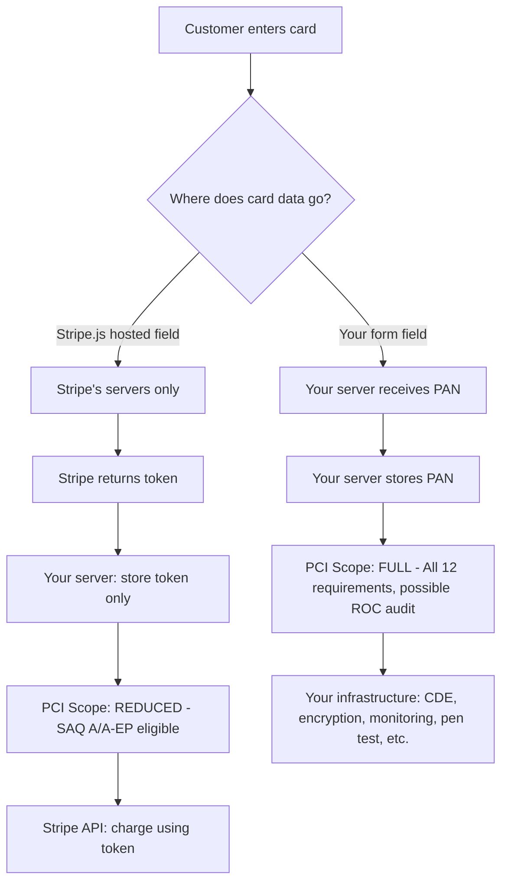

⚡ TL;DR - PCI-DSS (Payment Card Industry Data Security Standard)
is the security framework mandatory for any organization that stores,
processes, or transmits cardholder data. Current version: PCI-DSS 4.0.
The primary engineering goal: reduce the scope of PCI-DSS compliance
by minimizing WHERE cardholder data exists (tokenization + vault).
Key controls: encrypt card data at rest and transit, network
segmentation (CDE - Cardholder Data Environment), strong access controls,
vulnerability management, monitoring, and annual assessment.
Best implementation: never store PANs - use Stripe/Braintree tokenization.

---

| #075 | Category: Security | Difficulty: ★★★ |
|:---|:---|:---|
| **Depends on:** | OWASP Top 10, Authentication, Session Management, Secrets Management, IAM, OWASP Workshop, TLS Configuration, Secrets Rotation, Security Logging | |
| **Used by:** | ISO 27001, DevSecOps Pipeline Design, Security Governance + Policy, SSDLC | |
| **Related:** | Session Management, Secrets Management, IAM, TLS Configuration, Security Logging, GDPR, ISO 27001 | |

---

### 🔥 The Problem This Solves

**WHY PCI-DSS EXISTS AND WHAT IT COSTS TO FAIL:**

```
THE PAYMENT CARD FRAUD LANDSCAPE:

  Global card fraud losses: ~$30 billion annually (Nilson Report 2022).
  
  Before PCI-DSS (pre-2004):
    Retailers stored PANs (Primary Account Numbers - card numbers)
    in plaintext databases.
    TJX 2007 breach: 45.7 million card numbers stolen (pre-PCI era storage).
    Heartland 2008: 130 million cards (early PCI non-compliance).
    
  PCI-DSS created by the major card brands (Visa, Mastercard, Amex,
  Discover, JCB) in 2004, now managed by the PCI Security Standards Council.
  Version 4.0 published March 2022. Deadline for full compliance: March 2025.

WHAT HAPPENS WHEN YOU FAIL PCI-DSS:

  After a breach involving cardholder data:
    Merchant/Service Provider fines: $5,000 to $100,000 per MONTH
    of non-compliance (assessed by card brands, not PCI SSC directly).
    
  Additional costs post-breach:
    Card reissuance: card brands charge ~$5-$15 per card reissued.
    TJX total breach cost: $256 million.
    Heartland breach: $140 million + reputation damage.
    Target 2013 (CDE environment not properly segmented):
      67 million customers affected, $202 million total costs.
  
  Beyond fines: loss of card acceptance privilege.
  The ultimate penalty: your merchant account can be TERMINATED.
  You can no longer accept Visa/Mastercard. Business-ending consequence.

SCOPE REDUCTION - THE MOST IMPORTANT ENGINEERING DECISION:

  PCI-DSS applicability is determined by SCOPE:
  Any system that STORES, PROCESSES, or TRANSMITS cardholder data
  must comply with ALL PCI-DSS requirements.
  
  Scope = everything that touches card data.
  More scope = more compliance burden.
  
  Engineering goal: MINIMIZE scope.
  
  Maximum scope (wrong):
    Your application handles the full payment flow.
    Card number entered into YOUR form.
    Transmitted to YOUR server.
    YOUR server sends to payment processor.
    Card number in YOUR database (even temporarily).
    → EVERYTHING in your infrastructure is in scope.
  
  Minimum scope (right - using tokenization):
    Card number entered into STRIPE's JavaScript widget (hosted field).
    Card number NEVER touches your server.
    Stripe returns a payment_intent_id (token).
    Your server stores only the token (not the card number).
    Your server calls Stripe API with the token to charge.
    → YOUR scope: just the checkout page and server API (reduced).
    → YOUR scope may qualify as SAQ A (simplest self-assessment).
    → STRIPE is the PCI-DSS level 1 service provider (they handle compliance).
```

---

### 📘 Textbook Definition

**PCI-DSS (Payment Card Industry Data Security Standard):** A set of
12 requirements (organized in 6 goals) that any organization handling
cardholder data must meet to be allowed to accept payment cards. Mandated
by the card brands (Visa, Mastercard, etc.) via merchant agreements.

**Cardholder Data:** Primary Account Number (PAN - the card number),
plus cardholder name, service code, and expiration date. The PAN is the
most sensitive element; its presence determines PCI scope.

**Sensitive Authentication Data (SAD):** Full magnetic stripe data, CVV2/CVC2
verification codes, and PINs. MUST NEVER be stored after authorization,
even encrypted. No exceptions.

**CDE (Cardholder Data Environment):** The systems and network segments
where cardholder data is stored, processed, or transmitted, plus any
systems connected to these. PCI controls apply to everything in the CDE.

**Tokenization:** Replacing the PAN with a non-sensitive surrogate value
(token) that has no exploitable value outside the specific system.
If your database of tokens is stolen, the attacker gets nothing useful.
Tokens cannot be reverse-engineered to recover the PAN.

**SAQ (Self-Assessment Questionnaire):** For smaller merchants: a shorter
compliance assessment instead of a full QSA (Qualified Security Assessor)
audit. SAQ types depend on how card data is handled: SAQ A (fully
outsourced, never touch card data) is simplest; SAQ D is the most complex.

**QSA (Qualified Security Assessor):** Third-party assessor certified by
PCI SSC to conduct formal compliance audits (ROC - Report on Compliance)
for larger merchants and service providers.

---

### ⏱️ Understand It in 30 Seconds

**One line:**
PCI-DSS is the mandatory security standard for handling payment cards.
The engineering strategy: don't store card numbers (use tokenization
via Stripe/Braintree), minimize the CDE scope, and implement the 12
requirement domains for whatever scope remains.

**One analogy:**
> PCI-DSS is like nuclear material handling regulations.
>
> If you work with radioactive material: strict containment rules,
> limited access, comprehensive logging, regular inspections.
>
> If you DON'T work with radioactive material: most rules don't apply.
>
> Tokenization is like: handling a harmless representation of the
> material instead of the material itself.
> You work with the representation (token).
> The actual radioactive material (PAN) is in the specialized facility
> (Stripe's vault). They're subject to the strict rules. You're not.
>
> Scope reduction = minimizing YOUR exposure to the material.
> Minimizing scope = minimizing compliance burden + minimizing breach risk.

---

### 🔩 First Principles Explanation

**The 12 PCI-DSS Requirements (v4.0):**

```
PCI-DSS 4.0 - 12 REQUIREMENTS IN 6 GOALS:

Goal 1: BUILD AND MAINTAIN A SECURE NETWORK AND SYSTEMS
  Req 1: Install and maintain network security controls
    - Firewall rules documented and reviewed quarterly
    - Network segmentation: CDE isolated from other networks
    - No direct internet access to CDE
    Engineering: separate VPC/VLAN for CDE
                 WAF in front of any internet-facing CDE component
  
  Req 2: Apply secure configurations to all system components
    - Change vendor-supplied defaults (passwords, settings)
    - Disable unnecessary services, protocols, ports
    Engineering: Hardened AMIs for CDE instances
                 Automated config compliance (AWS Config, Chef InSpec)

Goal 2: PROTECT ACCOUNT DATA
  Req 3: Protect stored account data
    - DO NOT STORE SAD (CVV2, magnetic stripe, PINs) at all
    - PAN must be unreadable (encryption, tokenization, truncation)
    - Retain card data only as long as needed
    - Purge data that no longer needs to be retained
    Engineering: AES-256 for PAN storage at rest
                 Tokenization preferred (token replaces PAN entirely)
                 Column-level encryption in database
  
  Req 4: Protect cardholder data with strong cryptography during transmission
    - TLS 1.2+ (TLS 1.3 preferred) for all PAN transmission
    - No card data over email, chat, or public networks without encryption
    Engineering: TLS 1.2 minimum (TLS 1.0/1.1 explicitly prohibited)
                 Certificate management and monitoring

Goal 3: MAINTAIN A VULNERABILITY MANAGEMENT PROGRAM
  Req 5: Protect all systems and networks from malicious software
    - Anti-malware on all systems susceptible to malware
    - Targeted malware analysis for non-traditionally-targeted systems
  
  Req 6: Develop and maintain secure systems and software
    - Address vulnerabilities via patches
    - Protect web-facing applications from known attacks
    - Follow secure coding practices (OWASP, secure SDLC)
    - Penetration testing annually + after significant changes
    Engineering: SCA (Snyk/Dependabot), SAST, DAST in CI/CD pipeline
                 WAF for web-facing CDE components
                 Penetration test scope: CDE and connected systems

Goal 4: IMPLEMENT STRONG ACCESS CONTROL MEASURES
  Req 7: Restrict access to system components and cardholder data by business need to know
    - Role-based access to cardholder data
    - All access explicitly authorized (default deny)
    Engineering: IAM with least-privilege, explicit allow-lists
  
  Req 8: Identify users and authenticate access to system components
    - Unique ID for each user (no shared accounts)
    - MFA for all access into the CDE
    - Strong passwords (8+ chars, complexity) - superseded by MFA requirement
    Engineering: MFA enforced via IAM policies, no root account usage
  
  Req 9: Restrict physical access to cardholder data
    - Physical access controls to areas housing cardholder data
    - Visitor management
    (Less relevant for cloud environments - covered by cloud provider's PCI compliance)

Goal 5: MONITOR AND TEST NETWORKS
  Req 10: Log and monitor all access to system components and cardholder data
    - Audit log: every read of PAN, admin actions, log access, auth events
    - Log retention: 12 months (3 months immediately accessible)
    - Automated log monitoring and alerting
    Engineering: CloudTrail, VPC Flow Logs, application audit logs
                 SIEM with 12-month retention
                 Alert on failed access attempts, privilege escalation
  
  Req 11: Test security of systems and networks regularly
    - Internal/external vulnerability scans quarterly (ASV for external)
    - Penetration testing annually
    - IDS/IPS deployed on CDE networks
    - Change-detection mechanism (file integrity monitoring)

Goal 6: MAINTAIN AN INFORMATION SECURITY POLICY
  Req 12: Support information security with organizational policies and programs
    - Written security policy, reviewed annually
    - Security awareness training
    - Incident response plan (IR plan) tested annually
    - Risk assessment process
```

---

### 🧪 Thought Experiment

**SCENARIO: Designing a payment system that minimizes PCI scope:**

```
PAYMENT SYSTEM ARCHITECTURE - SCOPE MINIMIZATION:

BAD (maximum PCI scope):
  ┌─────────────────────────────────────┐
  │            YOUR ENVIRONMENT         │
  │  Customer  → Your Form              │
  │               → Your Server        │
  │               → Your DB (stores PAN)│
  │               → Payment Processor  │
  └─────────────────────────────────────┘
  Everything is in scope. Req 1-12 apply to ALL systems.

GOOD (tokenization - scope minimization):
  ┌───────────────────────┐   ┌───────────────────────┐
  │   YOUR ENVIRONMENT    │   │   STRIPE ENVIRONMENT   │
  │                       │   │   (Level 1 PCI DSS)    │
  │  Customer → Stripe.js │→  │ Stripe vault (PAN)     │
  │               (token) │←  │                        │
  │  Your Server          │   │                        │
  │    - stores token only│   │ Stripe → Issuing Bank  │
  │    - no PAN           │   └───────────────────────┘
  │  Your DB              │
  │    - token, amount    │
  │    - no PAN stored    │
  └───────────────────────┘
  Your scope: REDUCED (checkout page + server using Stripe API).
  Potential SAQ A if fully outsourced to Stripe.

STRIPE HOSTED FIELDS IMPLEMENTATION:

  <!-- Checkout page: Stripe.js intercepts card input -->
  <script src="https://js.stripe.com/v3/"></script>
  <script>
    const stripe = Stripe('pk_live_...'); // Publishable key only
    const elements = stripe.elements();
    const cardElement = elements.create('card');  // Stripe-hosted iframe
    cardElement.mount('#card-element');  // Card data captured by Stripe, not you
    
    // On submit:
    const {paymentIntent, error} = await stripe.confirmCardPayment(
      clientSecret,       // From your server (no PAN involved)
      { payment_method: { card: cardElement } }  // cardElement = Stripe token
    );
  </script>
  <!-- Your JavaScript never sees the card number -->
  <!-- Stripe's iframe is cross-origin: cannot be read by your JS -->
  <!-- Card data: directly to Stripe's servers. Never touches yours. -->

  // Your server: create PaymentIntent (no PAN needed):
  const paymentIntent = await stripe.paymentIntents.create({
    amount: 2000,                          // $20.00 in cents
    currency: 'usd',
    customer: stripeCustomerId,            // Stripe's customer token
    payment_method: stripePaymentMethodId, // Stripe's token (not PAN)
  });
  
  // Store in YOUR database: order_id, stripe_payment_intent_id, amount, status
  // Never store: PAN, CVV, expiry date

SCOPE DETERMINATION TABLE:
  
  Approach              | Your PCI Scope | SAQ Type
  ──────────────────────┼────────────────┼──────────
  Fully hosted checkout │ Minimal        │ SAQ A
  (Stripe Payment Links)│                │
  ──────────────────────┼────────────────┼──────────
  Stripe.js iframe      │ Low (checkout  │ SAQ A-EP
  (hosted fields)       │ page only)     │
  ──────────────────────┼────────────────┼──────────
  Your form → your      │ HIGH (entire   │ SAQ D or
  server → processor    │ environment)   │ ROC (QSA)
```

---

### 🧠 Mental Model / Analogy

> PCI-DSS scope is like nuclear material handling.
>
> Handle radioactive material (PAN): strict regulations apply.
> Use a representative sample (token): regulations mostly don't apply.
> Fully outsource the handling (Stripe): someone else bears the burden.
>
> The 12 PCI requirements are the radiation containment protocol:
> secure containment (encryption), limited access (access controls),
> monitoring (audit logs), regular testing (vulnerability scans, pen tests).
>
> Your engineering goal: DON'T TOUCH THE RADIOACTIVE MATERIAL.
> Use tokens. Let Stripe (Level 1 PCI DSS service provider) handle the PAN.
>
> If you MUST handle it (custom payment processing):
> Build the containment vessel properly.
> The 12 requirements are the engineering specification.
> Non-compliance = the vessel leaks. Fines = the cleanup cost.

---

### 📶 Gradual Depth - Five Levels

**Level 1 - What it is (anyone can understand):**
PCI-DSS is the law of the land for anyone handling payment card numbers. If your software processes credit card payments, you must follow these security rules or face fines and loss of the ability to accept cards. The easiest way to comply: use a service like Stripe or Braintree so you never actually see or store the card number yourself.

**Level 2 - How to use it (junior developer):**
Use Stripe.js or Braintree.js hosted fields so card data goes directly to the payment processor (never to your servers). Store only the token returned by the processor. Never log card numbers, even in debug output. Use TLS 1.2+ everywhere. PCI compliance scope is determined by your auditor/QSA - consult them before building payment flows.

**Level 3 - How it works (mid-level engineer):**
PCI-DSS scope includes all systems that store, process, or transmit cardholder data, plus all systems connected to them. Tokenization removes PANs from your environment, dramatically reducing scope. For what remains in scope: encrypt PAN at rest (AES-256), encrypt in transit (TLS 1.2+), implement strong access controls (MFA, least privilege), maintain audit logs (12 months, 3 months accessible), quarterly vulnerability scans, annual penetration tests, and a formal incident response plan. SAQ A qualification requires: no direct handling of cardholder data (fully outsourced to PCI-DSS compliant processors).

**Level 4 - Why it was designed this way (senior/staff):**
PCI-DSS is contractually mandated by the card brands (not government law, with some exceptions like in specific states/countries). Merchants accepting Visa/Mastercard agree to PCI compliance in their merchant agreements. Non-compliance is enforced via fines and, ultimately, merchant account termination. The scope-based approach was designed to focus compliance effort where card data actually exists. V4.0 (2022) updated requirements to address: customized approach (flexibility in HOW to meet requirements), targeted risk analysis (risk-driven controls), and stronger authentication requirements (MFA). The "12 requirements" structure has remained consistent since V1.0 (2004) - providing stability that allows organizations to build compliance programs.

**Level 5 - Mastery (distinguished engineer):**
Advanced PCI architecture: network segmentation techniques to minimize CDE scope - physical network isolation, micro-segmentation via software-defined networking, or cloud-based segmentation (separate AWS account for CDE). Compensating controls: if a specific PCI requirement cannot be met as stated, provide compensating controls that achieve the same security objective through alternative means (requires QSA approval). P2PE (Point-to-Point Encryption): encrypt card data at the point of capture (card terminal), decrypt only at the payment processor. Even the merchant's servers receive only ciphertext. Reduces merchant scope to SAQ P2PE (simplest possible). Hardware Security Modules (HSMs) for PAN encryption key management: HSMs provide tamper-resistant key storage and cryptographic operations for PAN encryption. Key management is a major PCI compliance area: key custodians, split knowledge, dual control, key rotation.

---

### ⚙️ How It Works (Mechanism)

```
PCI-DSS NETWORK SEGMENTATION:

  Internet
    ↓
  [WAF]
    ↓
  DMZ (Web Tier)
    - No cardholder data
    - Receives tokenized payment intents only
    ↓ (firewall: only allow specific ports to CDE)
  ──────────────────────── [SEGMENTATION BOUNDARY]
  CDE (Cardholder Data Environment)
    - Payment processing servers (minimal)
    - Encrypted PAN storage (or no PAN storage with tokenization)
    - Restricted network access
    - Enhanced monitoring and logging
    ↓ (dedicated network path)
  Payment Processor Network (Visa/Mastercard)
  
  CONNECTED SYSTEMS (also in scope):
    - Authentication servers providing access to CDE
    - Log management servers receiving CDE logs
    - Key management servers
  
  Out of scope:
    - Application servers that only receive tokens
    - Analytics databases with no PAN
    - CDN, email, marketing systems

PAN DATA FLOW (what must be encrypted):

  Card Swipe/Enter
    → Point-to-Point Encryption (P2PE) or
      Stripe.js intercept
    → PAN NEVER in plaintext at merchant
    → Token stored at merchant
    → Payment processor handles PAN
```



---

### 💻 Code Example

**Server-side PaymentIntent creation + Stripe webhook handling:**

```java
// StripePaymentService.java
@Service
public class StripePaymentService {
    
    // Stripe secret key from Secrets Manager (never hardcoded)
    @Value("${stripe.secret-key}")  // Loaded from AWS Secrets Manager
    private String stripeSecretKey;
    
    public CreatePaymentIntentResponse createPaymentIntent(
            long amountCents, String currency, String customerId) {
        
        Stripe.apiKey = stripeSecretKey;
        
        try {
            PaymentIntentCreateParams params = PaymentIntentCreateParams.builder()
                .setAmount(amountCents)     // Amount in cents
                .setCurrency(currency)       // "usd"
                .setCustomer(customerId)     // Stripe customer ID (not PAN)
                .setAutomaticPaymentMethods(
                    PaymentIntentCreateParams.AutomaticPaymentMethods.builder()
                        .setEnabled(true)
                        .build()
                )
                .build();
            
            PaymentIntent paymentIntent = PaymentIntent.create(params);
            
            // Return client_secret to frontend for Stripe.js confirmation
            // client_secret is scoped to this PaymentIntent only
            // It is NOT the card number or sensitive payment data
            return new CreatePaymentIntentResponse(paymentIntent.getClientSecret());
            
        } catch (StripeException e) {
            // Log without PAN (there is no PAN - Stripe handles that):
            log.error("Stripe PaymentIntent creation failed",
                Map.of("amount", amountCents, "currency", currency,
                       "error", e.getCode()));
            throw new PaymentProcessingException("Payment service unavailable");
        }
    }
    
    // Webhook handler: Stripe confirms payment completion
    // Requires webhook signature verification (HMAC-SHA256)
    @PostMapping("/stripe/webhook")
    public ResponseEntity<String> handleStripeWebhook(
            @RequestBody String payload,
            @RequestHeader("Stripe-Signature") String sigHeader) {
        
        String webhookSecret = stripeWebhookSecret;  // From Secrets Manager
        
        Event event;
        try {
            // CRITICAL: verify webhook signature to prevent spoofed events:
            event = Webhook.constructEvent(payload, sigHeader, webhookSecret);
        } catch (SignatureVerificationException e) {
            log.warn("Stripe webhook signature verification failed",
                Map.of("error", e.getMessage()));
            return ResponseEntity.badRequest().body("Invalid signature");
        }
        
        if ("payment_intent.succeeded".equals(event.getType())) {
            PaymentIntent pi = (PaymentIntent) event.getDataObjectDeserializer()
                .getObject().get();
            // Update order status in YOUR database:
            // Store: payment_intent_id, amount, status - no PAN
            orderService.confirmPayment(pi.getId(), pi.getAmount());
        }
        
        return ResponseEntity.ok("received");
    }
}
```

---

### ⚖️ Comparison Table

| Aspect | SAQ A | SAQ A-EP | SAQ D | ROC (Full Audit) |
|:---|:---|:---|:---|:---|
| **Card data handling** | Fully outsourced | Outsourced, page in your control | Self-managed | Self-managed, large merchant |
| **Who qualifies** | Stripe Payment Links | Stripe.js hosted fields | Merchant handles card server-side | Level 1 merchant (6M+ transactions) |
| **Questions** | ~13 | ~191 | ~320 | Full QSA audit |
| **Annual requirement** | Annual attestation | Annual attestation | Annual + scans | Annual ROC by QSA |
| **Your PCI burden** | Minimal | Low | High | Very High |

---

### ⚠️ Common Misconceptions

| Misconception | Reality |
|:---|:---|
| "We use HTTPS, so we're PCI compliant." | HTTPS (TLS) addresses only Requirement 4 (encrypt in transit). PCI-DSS has 12 requirements covering: network security, access controls, vulnerability management, logging, physical security, policies, and more. TLS is necessary but far from sufficient. A complete PCI program addresses all 12 requirement domains. |
| "Our QSA/auditor handles PCI compliance for us." | The QSA assesses compliance. Your ENGINEERING TEAM builds and operates the compliant systems. Compliance is an engineering practice, not an audit checkbox. The QSA tells you what the standard requires; your team implements the controls (network segmentation, encryption, access controls, logging, patching). Many organizations fail compliance because they treated it as an annual audit event rather than a continuous engineering practice. |

---

### 🚨 Failure Modes & Diagnosis

**Common PCI compliance failures:**

```
PROBLEM 1: Cardholder data found in logs
  
  Symptom: PCI assessment discovers PAN in application logs.
  Application was logging full request body (including card fields).
  
  Fix:
    - Mask PAN in logs: show only last 4 digits
    - Never log CVV2 (cannot be stored at ALL)
    - Scan logs with automated PAN detection pattern:
      \b(?:4[0-9]{12}(?:[0-9]{3})?|5[1-5][0-9]{14})...\b
    - Add log masking middleware before any logging framework

PROBLEM 2: Unnecessary PAN storage discovered
  
  Symptom: Audit reveals database column storing full PAN values
  "just in case" the processor needs to retry.
  
  Fix:
    - Switch to tokenization: store token, not PAN
    - If PAN must be stored: AES-256 encryption with HSM key management
    - Delete historical PAN values that are no longer needed
    - Add automated data retention enforcement (delete after 30 days)
    - PANs needed for retries: use Stripe's customer payment_method tokens

PROBLEM 3: CDE scope creep
  
  Symptom: Quarterly scans discover new systems in CDE scope
  that weren't included in the previous assessment.
  A non-CDE server was connected to CDE for log shipping.
  
  Fix:
    - Document CDE network diagram (required by Req 1)
    - Review diagram quarterly when network changes occur
    - Network segmentation enforcement via firewall rules
    - Change management: require PCI review for any connection to CDE
```

---

### 🔗 Related Keywords

**Prerequisites:**
- `Encryption at Rest and Transit` - Req 3 and Req 4
- `IAM` - Req 7 and Req 8
- `Security Logging` - Req 10

**Builds on this:**
- `ISO 27001` - related compliance framework
- `Security Governance + Policy` - compliance program design

---

### 📌 Quick Reference Card

```
┌──────────────────────────────────────────────────────────┐
│ VERSION      │ PCI-DSS 4.0 (deadline March 2025)         │
│ 12 REQS      │ 6 goals: Network, Data, Vuln Mgmt,        │
│              │ Access Control, Monitor/Test, Policy       │
├──────────────┼───────────────────────────────────────────┤
│ NEVER STORE  │ CVV2/CVC2, full magnetic stripe, PINs     │
│ SCOPE REDUCE │ Stripe.js/Braintree hosted fields         │
│              │ → SAQ A or SAQ A-EP (not full ROC)        │
├──────────────┼───────────────────────────────────────────┤
│ ENCRYPTION   │ AES-256 at rest, TLS 1.2+ in transit      │
│ ACCESS       │ MFA for all CDE access, least privilege   │
├──────────────┼───────────────────────────────────────────┤
│ TESTING      │ Quarterly ASV scans, annual pen test      │
│ LOGS         │ 12 months retention, 3 months accessible  │
└──────────────────────────────────────────────────────────┘
```

---

### 💎 Transferable Wisdom

**Reusable Engineering Principle:**
"Scope management is the most impactful security AND compliance lever."
In PCI-DSS: scope is everything. The number of systems subject to
the 12 requirements is directly proportional to the compliance cost,
implementation complexity, and breach risk exposure.
Tokenization doesn't just reduce compliance cost - it eliminates the
risk that your systems are the breach point for card data.
This principle applies beyond PCI:
- GDPR: minimize the personal data you collect and store (data minimization
  principle). Every attribute of personal data you store is a liability.
  Not storing it is better than storing it securely.
- HIPAA: the fewer places you store PHI (Protected Health Information),
  the fewer controls you need and the smaller your breach surface.
- General security: the attack surface of a system is proportional to
  its scope (lines of code, network exposure, data stored, integrations).
  Reducing scope reduces both compliance burden AND attack surface.
"The most secure data is the data you don't store."
"The most compliant system is the one outside the regulatory scope."
Build payment systems that never see card numbers.
Build healthcare systems that hold PHI only where necessary.
Build analytics systems that work on anonymized/aggregated data.
The principle: don't accept the liability if you don't need to hold the data.

---

### 💡 The Surprising Truth

Most software engineers assume PCI-DSS compliance is primarily a
security challenge. It is, but it's equally a SCOPE MANAGEMENT challenge.

The PCI DSS v4.0 guidance document is 360+ pages. Implementing full
compliance for a system that processes, stores, and transmits PANs
requires significant engineering effort across all 12 requirement domains.

Here's the surprising reality: a major e-commerce company using Stripe's
hosted fields and API tokens for ALL payment flows may qualify for SAQ A-EP
(~191 questions) instead of a full Report on Compliance (ROC) by a
Qualified Security Assessor (which can cost $50,000-$200,000+ annually
plus the implementation cost).

The difference between SAQ A-EP and full ROC: millions of dollars in
compliance cost over a 5-year period.

The architectural decision to use hosted fields instead of building
your own payment form is one of the highest-ROI security engineering
decisions a startup or mid-size company can make.

More importantly: Stripe is a Level 1 PCI DSS service provider. They
invest hundreds of millions of dollars in PCI compliance infrastructure.
A startup cannot match that investment. By using Stripe, you inherit
Stripe's security investment for the most sensitive part of your system.

This is a rare case where outsourcing a core system component is
simultaneously cheaper AND more secure than building it in-house.

---

### ✅ Mastery Checklist

**You've mastered this when you can:**
1. **EXPLAIN** why tokenization reduces PCI scope and what SAQ A, SAQ A-EP,
   and SAQ D represent in terms of compliance burden.
2. **IDENTIFY** what data cannot EVER be stored (SAD: CVV2, full track data,
   PINs) versus what must be protected if stored (PAN: AES-256 encryption).
3. **DESIGN** a payment flow using Stripe.js hosted fields that minimizes
   PCI scope (card data never touches your servers).
4. **MAP** the 6 PCI-DSS goals to specific engineering controls:
   network segmentation (Req 1), PAN encryption (Req 3), TLS (Req 4),
   MFA + access control (Req 7-8), audit logs (Req 10), pen testing (Req 11).

---

### 🎯 Interview Deep-Dive

**Q: What is PCI-DSS? What does it require, and how do you minimize scope?**

*Why they ask:* Fintech/payments roles require PCI knowledge.
Tests whether candidate can discuss compliance AND engineering strategy.

*Strong answer covers:*
- PCI-DSS: mandatory standard for card data handling. 12 requirements,
  4.0 current version (March 2022). Enforced by card brands via merchant agreements.
  Non-compliance: fines $5K-$100K/month + potential merchant account termination.
- 12 requirements: network security, protect stored data, encrypt in transit,
  vulnerability management, access control (MFA, least privilege), monitoring
  (12-month log retention), quarterly scans + annual pen tests, policies.
- Scope: any system that stores, processes, or TRANSMITS cardholder data.
  Plus anything connected to those systems.
- Scope minimization: use tokenization (Stripe.js hosted fields).
  Card data goes directly to Stripe - never touches your servers.
  Your server stores Stripe payment_intent_id (token), not PAN.
  Qualifies for SAQ A or SAQ A-EP instead of full ROC.
  SAQ A: ~13 questions. Full ROC (QSA): months of work + $50K+ cost.
- What can NEVER be stored: CVV2/CVC2, magnetic stripe data, PIN. No exceptions.
  PAN (if stored): must be encrypted (AES-256) or tokenized.
- Key engineering controls: TLS 1.2+ for all transmission,
  network segmentation (CDE isolated), MFA for CDE access,
  audit logs with 12-month retention, quarterly ASV scans, annual pen test.
- Stripe integration: server creates PaymentIntent (no PAN).
  Client uses Stripe.js (hosted field iframe) for card capture.
  Stripe returns client_secret. Client confirms via Stripe.js.
  Server handles webhook for payment confirmation (signature verified).