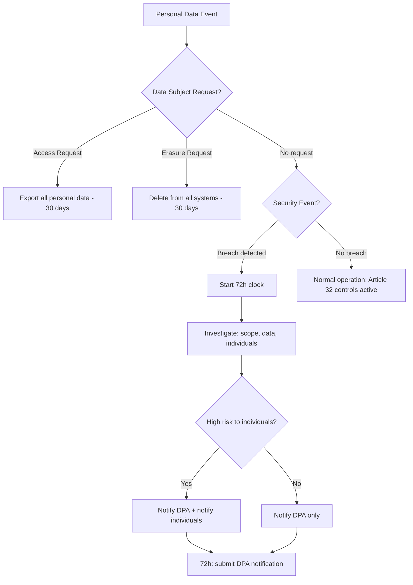

⚡ TL;DR - GDPR (General Data Protection Regulation) mandates
security measures for personal data of EU residents - regardless of
where the organization is located. Key security requirements: Article 32
(technical and organizational measures: encryption, pseudonymization,
integrity, availability, testing), and the 72-hour breach notification
rule (Article 33). The GDPR fines are existential: up to 4% of global
annual turnover or EUR 20 million (whichever is higher). Engineering
impact: data minimization (collect only what you need), right to erasure
(purge on request), consent management, and breach response procedures.

---

| #076 | Category: Security | Difficulty: ★★★ |
|:---|:---|:---|
| **Depends on:** | OWASP Top 10, Authentication, Session Management, Secrets Management, IAM, OWASP Workshop, Secrets Rotation, Security Logging | |
| **Used by:** | ISO 27001, DevSecOps Pipeline Design, Security Governance + Policy, SSDLC | |
| **Related:** | Session Management, Secrets Management, IAM, Security Logging, PCI-DSS, ISO 27001, Security Governance | |

---

### 🔥 The Problem This Solves

**WHY GDPR CHANGED ENGINEERING PRACTICES:**

```
GDPR SCALE AND ENFORCEMENT:

  Effective: May 25, 2018
  Jurisdiction: EU residents' personal data - regardless of where
  the processing organization is located.
  Fine structure:
    Tier 1 (less serious violations): up to EUR 10M or 2% global annual turnover
    Tier 2 (serious violations): up to EUR 20M or 4% global annual turnover
    → whichever is HIGHER (not lower)
  
  Notable fines:
    Meta: EUR 1.2 billion (2023) - Facebook EU-US data transfers
    Amazon: EUR 746 million (2021) - cookie consent violations
    WhatsApp: EUR 225 million (2021) - transparency violations
    Google: EUR 150 million (2022) - cookie consent
    British Airways: GBP 20 million (2020) - 2018 breach of 500K records
    Marriott: GBP 18.4 million (2020) - 2018 breach of 339M records
  
  A serious breach can cost multiple percent of global revenue.
  For a $5 billion company: 4% = $200 million potential fine.
  Plus legal costs, remediation, reputation damage, class actions.

WHAT ENGINEERS MUST IMPLEMENT (Article 32):

  Article 32(1) requires "appropriate technical and organizational measures"
  including, as appropriate:
    (a) the pseudonymisation and encryption of personal data
    (b) the ability to ensure the ongoing confidentiality, integrity,
        availability and resilience of processing systems
    (c) the ability to restore availability and access in a timely manner
    (d) a process for regularly testing, assessing and evaluating
        the effectiveness of technical and organizational measures
  
  Engineering translation:
    (a) → Encryption at rest and transit. Pseudonymization (replacing PII
           with reversible pseudonyms) and anonymization (irreversible).
    (b) → Standard security controls: access control, monitoring, patching.
           Availability requirement: backup and disaster recovery.
    (c) → RTO/RPO for systems processing personal data.
    (d) → Penetration testing, vulnerability scanning, security reviews.

72-HOUR BREACH NOTIFICATION (Article 33):

  Requirement: notify the supervisory authority (DPA - Data Protection Authority,
  e.g., ICO in UK, CNIL in France) within 72 hours of becoming aware of
  a personal data breach.
  
  "Becoming aware" starts the clock: when you have reasonable certainty
  that a breach has occurred.
  
  72 hours is NOT long:
    Day 1: Breach detected (e.g., 9 AM Friday).
    Day 1-2: Incident investigation: scope, what data affected, how many individuals.
    Day 3: 9 AM Sunday - notification must be submitted to DPA.
    
    If Friday afternoon detection: notification due Sunday afternoon.
    Including weekends. Including holidays.
  
  What the notification must include:
    - Nature of the breach (what happened)
    - Categories and approximate number of individuals concerned
    - Categories and approximate number of personal data records
    - Name and contact details of the DPO (Data Protection Officer)
    - Likely consequences of the breach
    - Measures taken or proposed to address the breach
  
  Article 34: If breach poses HIGH RISK to individuals:
    Must also notify the AFFECTED INDIVIDUALS directly (without undue delay).
    Example: health data breach, financial data breach, passwords leaked.
```

---

### 📘 Textbook Definition

**GDPR (General Data Protection Regulation):** EU regulation 2016/679,
effective May 25, 2018. Establishes rules for how personal data of EU
residents must be collected, processed, stored, and protected. Has
extraterritorial effect: applies to any organization worldwide that
processes personal data of EU residents.

**Personal data:** Any information relating to an identified or identifiable
natural person ("data subject"). Includes: names, email addresses, IP
addresses, location data, cookie identifiers, biometric data, and any
other data that can identify a person directly or indirectly.

**Special category data (sensitive personal data):** Data requiring
heightened protection: racial/ethnic origin, political opinions, religious
beliefs, trade union membership, health data, biometric data, sexual
orientation, genetic data. Requires explicit consent or legal basis for
processing.

**Data minimization (Article 5(1)(c)):** Collect only personal data that
is adequate, relevant, and limited to what is necessary for the specified
purpose. Do not collect data "just in case."

**Right to erasure ("right to be forgotten," Article 17):** Data subjects
can request deletion of their personal data. Organizations must comply
unless a legal basis for retention exists (legal obligation, legitimate
interest, etc.).

**Data Protection by Design (Article 25):** Privacy and security must be
incorporated into system design from the beginning, not retrofitted.
Includes appropriate technical measures, data minimization by design.

**DPA (Data Protection Authority):** National supervisory authority in each
EU member state (ICO in UK, CNIL in France, BfDI in Germany, etc.).
Receives breach notifications, investigates complaints, issues fines.

---

### ⏱️ Understand It in 30 Seconds

**One line:**
GDPR requires you to protect EU residents' personal data with
appropriate security, notify authorities within 72 hours of a breach,
delete data on request, and collect only what you need.
Violations: up to 4% of global revenue.

**One analogy:**
> GDPR treats personal data like borrowed property.
>
> You're a parking garage (data processor).
> Customer gives you their car (personal data) to park.
> Obligations:
> - Keep it safe (security measures)
> - Don't use it for joyrides (purpose limitation)
> - Return it when asked (right to erasure)
> - Tell them immediately if it's damaged/stolen (breach notification)
> - Don't keep the car forever (retention limits)
> - Tell them what you do with their car (transparency)
>
> GDPR fines: you LEFT the car in an unsecured lot,
> it was stolen, and you didn't tell the customer for a month.
> Fine: up to 4% of your total revenue.
>
> Engineering implementation: secure the lot, implement access controls,
> have a monitoring system that detects theft, and know who owns each car.

---

### 🔩 First Principles Explanation

**GDPR engineering requirements - practical implementation:**

```
DATA MINIMIZATION IMPLEMENTATION:

  Principle: collect only what is necessary.
  
  BAD - collecting everything:
    User registration form:
      required: email, password
      required: full name, phone, address (for "personalization")
      required: date of birth (for age verification, but never enforced)
      required: gender
      optional: marketing preferences
    
    Database stores ALL fields. Many never used.
    Each unused field = liability without benefit.
  
  GOOD - minimize at collection:
    User registration:
      required: email, password
      required: full name (needed for invoice/communication)
      optional: phone (needed ONLY if user enables SMS notifications)
      not collected: address until checkout (needed for shipping)
      not collected: date of birth (remove if not actually required)
    
    Collect address: at first purchase, not at registration.
    Database: stores only what has a defined purpose.
  
  Technical controls for data minimization:
    - Database review: every column should have a documented retention purpose
    - Data retention enforcement: automated deletion after retention period
    - Anonymization on export: analytics queries get aggregated/anonymized data

RIGHT TO ERASURE - TECHNICAL IMPLEMENTATION:

  GDPR Article 17 creates a right to have personal data deleted.
  
  Engineering challenge: data is in multiple places:
    - Primary database (user record)
    - Backup databases (point-in-time recovery backups)
    - Log files (may contain email addresses, IP addresses)
    - Analytics systems (event tracking with user IDs)
    - Search indexes (Elasticsearch with user-generated content)
    - Email marketing platform (subscriber list)
    - CDN cache (user-uploaded content)
    - Third-party services (Stripe customer, SendGrid contact)
  
  Implementation:
    1. Identify all data stores containing personal data (data inventory).
    2. Implement deletion across all stores when erasure requested.
    3. For backups: either anonymize backup before erasure request arrives,
       or maintain "erasure request log" to apply at backup restore time.
    4. Log the erasure (for compliance evidence).
    5. Notify third-party processors to also delete.
  
  Pseudonymization for analytics:
    Instead of: { "user_email": "john@example.com", "action": "purchase" }
    Use:        { "user_hash": SHA256(salt + user_id), "action": "purchase" }
    
    On erasure: delete the salt (or the mapping).
    user_hash becomes irreversible. Analytics data can be retained.
    PII is "erased" by making it irrecoverably pseudonymous.
  
  Java - GDPR erasure service:
    @Service
    @Transactional
    public class GdprErasureService {
        
        public void eraseUserData(UUID userId) {
            // 1. User account: anonymize (don't delete - referential integrity)
            userRepository.anonymize(userId,
                "DELETED_" + UUID.randomUUID(),  // Replace email
                null,                             // Null out personal fields
                null                              // Remove phone
            );
            
            // 2. User-generated content: delete or anonymize
            contentRepository.deleteByUserId(userId);
            
            // 3. Analytics: pseudonymization removes the link
            // (analytics data is already pseudonymized - no deletion needed)
            
            // 4. Third-party services:
            stripeService.deleteCustomer(stripeCustomerId);
            emailService.unsubscribeAndDelete(userEmail);
            
            // 5. Log the erasure for compliance:
            erasureLogRepository.save(
                new ErasureLog(userId, Instant.now(), "GDPR_ARTICLE_17")
            );
            
            log.info("GDPR erasure completed",
                Map.of("user_id", userId, "timestamp", Instant.now()));
        }
    }

BREACH NOTIFICATION PROCESS:

  Requirement: Article 33 - notify DPA within 72 hours of becoming aware.
  
  Prerequisites (must be in place before a breach):
    1. Security monitoring that detects breaches quickly.
    2. Incident response plan with GDPR breach notification procedure.
    3. DPO (Data Protection Officer) contact details ready.
    4. DPA notification form or API (most DPAs have online portals).
    5. Know which DPA is your lead supervisory authority.
       (For UK: ICO. For companies primarily established in Ireland: DPC.
        For German establishments: state DPAs.)
  
  72-hour timeline:
    0h: Breach detected (or reasonable grounds to believe breach occurred)
    0-24h: Initial investigation: confirm breach, assess scope
    24-48h: Determine: how many individuals, what data categories, what risk
    48-72h: Submit notification to DPA (incomplete notification acceptable
             if investigation ongoing - can supplement later)
    
    "Without undue delay and, where feasible, not later than 72 hours."
    Document why if notification exceeds 72 hours.
```

---

### 🧪 Thought Experiment

**SCENARIO: Responding to a GDPR breach (database exposed publicly for 3 hours):**

```
INCIDENT: Misconfigured S3 bucket publicly accessible for 3 hours.
Contains: CSV export of user database (email, name, country, created_date).
Contains: NO passwords, NO financial data, NO special category data.
EU users: approximately 45,000 of 200,000 total users.

GDPR RESPONSE TIMELINE:

  T+0h: Security alert fires → S3 bucket misconfiguration detected.
  T+0h: Immediately restrict S3 bucket to private.
  T+0h: Start incident log.
  
  T+1h: Determine breach scope:
    - What data was exposed? Export: email, name, country, created_date.
    - How many EU individuals? 45,000 based on country field.
    - How long exposed? AWS CloudTrail: bucket made public at T-3h.
    - Was data accessed? S3 access logs: 47 GET requests for the CSV file.
      Unknown if from bots (scanners), humans, or malicious actors.
    - Risk assessment: low-moderate (no financial/health/password data).
      BUT: email + name allows phishing. Breach is reportable.
  
  T+4h: Legal and DPO review.
    - Confirm: reportable breach under GDPR (personal data of EU residents).
    - Lead supervisory authority: ICO (UK, company primarily established in UK).
    - Decision: notify ICO within 72 hours. Notify affected individuals
      if DPA advises (low-moderate risk: DPA may not require direct notification).
  
  T+24h: Prepare ICO notification.
    - ICO Report a Breach portal (ico.org.uk/report-a-breach/)
    - Required fields: nature of breach, data categories, approx. records,
      likely consequences, DPO contact, measures taken.
    
  T+48h: Submit ICO notification (within the 72-hour window).
  
  T+72h: Internal actions:
    - Remediation: automated S3 bucket policy enforcement (AWS Config rule)
    - Monitoring: CloudTrail alert for public S3 access policies
    - Communication: prepare user notification (draft, pending DPA guidance)
  
  POST-INCIDENT:
    - ICO may: close the case, request more information, or investigate.
    - At British Airways scale (500K records): GBP 20M fine.
    - At this scale (45K records, low-risk data, prompt notification):
      likely outcome: reprimand or no enforcement action IF swift response
      and good remediation.

ENGINEERING CONTROLS THAT WOULD HAVE PREVENTED THIS:
  1. AWS Config rule: s3-bucket-public-read-prohibited (auto-remediate)
  2. SCPs (Service Control Policies): prevent any bucket from being public
  3. S3 Block Public Access: account-level setting blocking all public access
  4. CloudTrail alert: any S3 public ACL change → immediate PagerDuty alert
```

---

### 🧠 Mental Model / Analogy

> GDPR treats personal data as a regulated substance with a chain of custody.
>
> A hospital managing pharmaceuticals:
> - Document every drug received, stored, dispensed (data inventory, processing records)
> - Store in secure, temperature-controlled environment (security measures)
> - Restrict access to authorized personnel only (access controls)
> - Track every use (audit logs)
> - Dispose of properly when expired (retention and deletion)
> - Report any theft or loss to authorities within 72 hours (breach notification)
> - Never use for purposes other than treatment (purpose limitation)
>
> GDPR treats personal data with the same seriousness that healthcare
> treats drugs: it's powerful, it's regulated, and mishandling it
> harms real people.
>
> The 72-hour breach notification exists because regulators decided:
> individuals have the right to know their data was exposed quickly,
> so they can protect themselves (change passwords, monitor accounts).
> Organizations that sit on breach notifications for weeks harm people
> by delaying their ability to take protective action.

---

### 📶 Gradual Depth - Five Levels

**Level 1 - What it is (anyone can understand):**
GDPR requires companies to protect personal data of EU residents, delete it when asked, and report breaches to authorities within 72 hours. Breaking the rules costs up to 4% of global revenue. The main engineering rules: encrypt personal data, only collect what you need, delete it when asked, and have a plan to detect and report breaches quickly.

**Level 2 - How to use it (junior developer):**
Implement encryption at rest for any database with personal data. Hash or pseudonymize user IDs in analytics/logs instead of using email addresses. Build a data deletion API (`DELETE /api/users/{id}`) that removes all personal data from all systems. Test your breach detection and response procedure. Know your DPA (ICO for UK organizations) and the 72-hour reporting window.

**Level 3 - How it works (mid-level engineer):**
Article 32: "appropriate technical measures" - encryption (AES-256), pseudonymization, access controls, integrity monitoring, regular security testing. Article 33: 72-hour breach notification. Article 17: right to erasure - implement complete deletion across primary DB, backups, analytics, logs, and third-party processors. Pseudonymize analytics data (hash user_id with a secret salt) to enable analytics while supporting erasure (delete the salt = anonymize all records). Consent management: track legal basis for each data processing activity (consent, legitimate interest, contract). Maintain Records of Processing Activities (ROPA) per Article 30.

**Level 4 - Why it was designed this way (senior/staff):**
GDPR replaced the 1995 Data Protection Directive, which was inadequate for the internet age. The Regulation applies extraterritorially (any organization processing EU residents' data, anywhere in the world) to prevent regulatory arbitrage (operating from non-EU countries to avoid EU privacy rules). The 72-hour breach notification is strict because historical breaches (Equifax disclosed 76 days after detection, Yahoo hid breaches for years) demonstrated that organizations self-regulating disclosure timelines failed users. The fine structure (% of global turnover, not flat fees) ensures that fines are proportionate to company size - a fine that is a rounding error for a billion-dollar company is not a deterrent.

**Level 5 - Mastery (distinguished engineer):**
Advanced GDPR engineering: Privacy Enhancing Technologies (PETs) - differential privacy, k-anonymity for aggregate statistics that cannot identify individuals. Synthetic data for development/testing environments (replaces real PII with realistic fake data). Data Protection Impact Assessments (DPIA, Article 35) for high-risk processing. Standard Contractual Clauses (SCCs) for international data transfers - when EU personal data is transferred to third countries without "adequacy decisions." Schrems II (Court of Justice 2020) invalidated Privacy Shield; SCCs are the primary mechanism for EU-US data transfers. Binding Corporate Rules (BCRs) for multinational organizations. Technical implementation of data subject rights automation (erasure, portability, access) requires comprehensive data inventory and automated workflows - particularly challenging for systems with multiple databases, microservices architectures, and third-party data processors.

---

### ⚙️ How It Works (Mechanism)

```
GDPR ARTICLE 32 ENGINEERING CONTROLS:

  32(1)(a) Encryption + Pseudonymization:
    At rest: AES-256 for databases, S3 SSE-KMS for object storage
    In transit: TLS 1.2+ for all API communication
    Pseudonymization: replace email with SHA256(salt + user_id) in analytics
  
  32(1)(b) Confidentiality, integrity, availability, resilience:
    Confidentiality: access controls, least privilege, MFA
    Integrity: checksums, signed data, audit trails
    Availability: redundancy, backups, DR plan
    Resilience: ability to recover from attack (ransomware recovery plan)
  
  32(1)(c) Restore availability in a timely manner:
    RTO/RPO defined and tested for personal data systems
    Backup encryption and off-site storage
    Annual DR test including personal data systems
  
  32(1)(d) Regular testing and evaluation:
    Annual penetration testing
    Quarterly vulnerability scans
    Regular security code reviews
    Evidence of testing for compliance documentation
```



---

### 💻 Code Example

**GDPR-compliant user deletion endpoint (Spring Boot):**

```java
// GdprController.java
@RestController
@RequestMapping("/api/gdpr")
@PreAuthorize("hasRole('USER')")  // Only the user themselves or admin
public class GdprController {
    
    @DeleteMapping("/erasure")
    public ResponseEntity<Void> requestErasure(
            @AuthenticationPrincipal UserDetails userDetails) {
        
        UUID userId = getUserIdFromPrincipal(userDetails);
        
        // Log the erasure request (compliance audit trail):
        log.info("GDPR erasure request received",
            Map.of("user_id", userId,
                   "timestamp", Instant.now(),
                   "basis", "GDPR_ARTICLE_17"));
        
        // Process erasure asynchronously (may involve multiple systems):
        gdprErasureService.initiateErasure(userId);
        
        // Response: 202 Accepted (processing, not immediate)
        // Alternative: 204 No Content if synchronous
        return ResponseEntity.accepted().build();
    }
    
    @GetMapping("/export")
    public ResponseEntity<byte[]> requestDataExport(
            @AuthenticationPrincipal UserDetails userDetails) {
        
        UUID userId = getUserIdFromPrincipal(userDetails);
        
        // Collect all personal data for this user:
        UserDataExport export = gdprExportService.exportUserData(userId);
        
        // Return as JSON (machine-readable per GDPR Article 20 portability):
        byte[] jsonData = objectMapper.writeValueAsBytes(export);
        
        return ResponseEntity.ok()
            .header(HttpHeaders.CONTENT_DISPOSITION,
                    "attachment; filename=my-data.json")
            .contentType(MediaType.APPLICATION_JSON)
            .body(jsonData);
    }
}

// GdprErasureService.java - coordinate deletion across all systems
@Service
public class GdprErasureService {
    
    @Async("gdprErasureExecutor")
    @Transactional
    public void initiateErasure(UUID userId) {
        try {
            // 1. Capture user info before deletion (for third-party cleanup):
            User user = userRepository.findById(userId)
                .orElseThrow(() -> new UserNotFoundException(userId));
            String email = user.getEmail();
            String stripeCustomerId = user.getStripeCustomerId();
            
            // 2. Anonymize primary user record (preserve referential integrity):
            userRepository.anonymize(userId);
            // UPDATE users SET email='deleted_'+gen_random_uuid(), 
            //                  name='Deleted User',
            //                  phone=NULL, address=NULL
            // WHERE id = ?
            
            // 3. Delete user-generated content:
            postRepository.deleteAllByUserId(userId);
            commentRepository.deleteAllByUserId(userId);
            
            // 4. Third-party processors:
            stripeService.deleteCustomer(stripeCustomerId);
            // Stripe: deletes customer + payment methods. Invoices retained
            // for legal/tax compliance (legitimate interest basis).
            
            emailMarketingService.deleteContact(email);
            
            // 5. Search index:
            searchService.deleteUserContent(userId);
            
            // 6. Record the completed erasure:
            erasureLogRepository.save(
                new ErasureLog(userId, Instant.now(), ErasureStatus.COMPLETED)
            );
            
            log.info("GDPR erasure completed",
                Map.of("user_id", userId, "timestamp", Instant.now()));
                
        } catch (Exception e) {
            erasureLogRepository.save(
                new ErasureLog(userId, Instant.now(), ErasureStatus.FAILED,
                               e.getMessage())
            );
            log.error("GDPR erasure failed", Map.of("user_id", userId,
                                                     "error", e.getMessage()));
            // Alert DPO for manual intervention
        }
    }
}
```

---

### ⚖️ Comparison Table

| Aspect | GDPR | PCI-DSS | HIPAA |
|:---|:---|:---|:---|
| **Jurisdiction** | EU residents' data, worldwide | Card brand mandated, worldwide | US healthcare entities |
| **Scope** | All personal data | Cardholder data only | Protected Health Information |
| **Fines** | 4% of global turnover | $5K-$100K/month + termination | $100-$50K per violation |
| **Breach notification** | 72 hours to DPA | Varies by card brand | 60 days to HHS |
| **Key rights** | Erasure, portability, access | N/A (not individual rights) | Access, amendment |
| **Delete requirement** | Yes (right to erasure) | No | Limited |

---

### ⚠️ Common Misconceptions

| Misconception | Reality |
|:---|:---|
| "We're a US company - GDPR doesn't apply to us." | GDPR applies to any organization that processes personal data of EU residents, regardless of where the organization is located. If your website serves EU users and collects their personal data (email address, IP address, names), GDPR applies to you. The enforcement mechanism: DPAs can issue fines and injunctions against EU operations, and EU courts can order compliance. US-based companies have been fined (Meta: EUR 1.2 billion, Amazon: EUR 746 million). If your product has EU users, GDPR compliance is not optional. |
| "Encryption is a get-out-of-jail-free card for breaches." | Encryption is an important mitigating factor in breach assessment, but it does not automatically exempt you from breach notification. If an encrypted database is stolen AND the encryption key is also compromised (common in poorly designed systems), the breach is as serious as plaintext. Even with proper encryption: if the attacker stole authentication credentials and had legitimate access to decrypted data, the "encryption" is irrelevant to the breach. The ICO and other DPAs assess the ACTUAL risk to individuals, not just whether encryption was present. Encryption significantly reduces the risk that a stolen encrypted database can be used maliciously - which IS a mitigating factor in the notification assessment. |

---

### 🚨 Failure Modes & Diagnosis

**Common GDPR engineering failures:**

```
PROBLEM 1: Erasure requests not fully implemented
  
  Symptom: User requests deletion. Primary database record deleted.
  User receives marketing email a month later (email platform not purged).
  
  Fix:
    - Maintain a data inventory: list every system holding personal data.
    - Implement erasure across ALL systems (primary DB, logs, analytics,
      email platform, search index, backups via anonymization, CDN).
    - Automate: erasure request triggers a workflow across all systems.
    - Test: submit a test erasure request quarterly and verify all systems.

PROBLEM 2: Log files contain email addresses / personal data
  
  Symptom: Audit discovers application logs contain full email addresses.
  Log files retained 7 days only. GDPR requires purpose limitation -
  what is the purpose of logging full email addresses?
  
  Fix:
    - Replace email in logs with SHA256(salt+user_id) (pseudonymized)
    - Logs can still trace user actions without containing PII
    - Purge old logs containing PII (if within retention period)
    - Going forward: log user_id (opaque), not email

PROBLEM 3: Missing 72-hour breach response capability
  
  Symptom: Breach detected on a Friday afternoon.
  DPO is not reachable (vacation). Security team doesn't know which DPA
  to notify. Notification form not pre-prepared.
  
  Fix:
    - DPO (or backup) must be reachable 24/7 for breach response.
    - Identify lead supervisory authority: which DPA? (country of main establishment)
    - Pre-fill the notification form template (ICO, CNIL, etc.)
    - Run a breach notification drill annually (tabletop exercise)
    - Integrate GDPR notification into incident response runbook
```

---

### 🔗 Related Keywords

**Prerequisites:**
- `Encryption at Rest/Transit` - Article 32(a)
- `IAM` - access controls under Article 32
- `Security Logging` - Article 32 + audit evidence

**Builds on this:**
- `ISO 27001` - complementary security framework
- `Security Governance + Policy` - compliance program
- `CSIRT Design` - breach response for Article 33

---

### 📌 Quick Reference Card

```
┌──────────────────────────────────────────────────────────┐
│ FINES        │ Up to 4% global turnover or EUR 20M       │
│ BREACH NOTIF │ 72 hours to DPA (ICO/CNIL/etc.)           │
├──────────────┼───────────────────────────────────────────┤
│ ART. 32      │ Encrypt, pseudonymize, test, backup       │
│ ART. 17      │ Erasure: delete from ALL systems          │
│ ART. 20      │ Portability: export in machine-readable   │
│ ART. 25      │ Privacy by design                         │
├──────────────┼───────────────────────────────────────────┤
│ MINIMIZE     │ Collect only what's needed (Art. 5(1)(c)) │
│ DATA         │ Delete when no longer needed              │
├──────────────┼───────────────────────────────────────────┤
│ NEVER        │ Log full PII (emails, names) in app logs  │
│              │ Ignore erasure requests                   │
└──────────────────────────────────────────────────────────┘
```

---

### 💎 Transferable Wisdom

**Reusable Engineering Principle:**
"Collect only what you need. Store only what you must. Delete when done."
This principle (GDPR data minimization) is good engineering practice
regardless of legal compliance requirements.
Data you don't collect: zero breach risk for that data.
Data you don't store: zero cost to protect it, zero liability if lost.
Data you delete when done: no lingering liability.
The practical engineering checklist:
- Registration form: every field requires justification.
  "We might want this later" is not a justification.
- Database columns: every column has a documented purpose and retention period.
- Analytics: work with aggregated or pseudonymized data wherever possible.
- Logs: what personal data is actually needed for debugging?
  Usually: user_id (opaque), not email address or full name.
- Third-party integrations: what personal data does each third party receive?
  Is each integration necessary? Can you minimize what they receive?
Organizations that practice data minimization by engineering habit
have lower GDPR compliance costs, smaller breach impact, and simpler systems
to maintain. "What's the minimum data we need?" is a question that improves
both security AND system design.
The opposite of data minimization: data collection maximalism
("collect everything, figure out how to use it later"). This creates
compliance liabilities, security risks, and system complexity without
proportionate value. GDPR codifies what good engineering practice
already suggests: don't hold data you don't need.

---

### 💡 The Surprising Truth

The largest GDPR fine in history (as of 2024): Meta/Facebook EUR 1.2 billion
in May 2023 - not for a security breach, but for transferring EU users'
personal data to US servers in violation of EU-US data transfer rules
(Schrems II decision, 2020).

No data was "stolen." No breach occurred. The violation: the mechanism
used to transfer personal data to the US was found to be inadequate
by the Irish Data Protection Commission.

This highlights something counterintuitive: GDPR's biggest fines are
often not about security controls (encryption, access controls) but
about the LEGAL FRAMEWORK for data processing (legal basis, data transfers,
consent).

A perfectly secure system can still receive a billion-euro fine for
using the wrong legal mechanism to justify processing or transferring data.

The engineering implication: GDPR compliance requires both:
1. Technical controls (Article 32 security measures)
2. Legal framework (data processing purposes, legal basis, DPAs,
   SCCs for international transfers, consent management)

Engineers own #1. Legal/compliance teams own #2. But they must
collaborate: the engineering systems must implement the legal requirements
(consent collection, data portability, erasure workflows).

A well-secured system with no documented legal basis for processing
(or an improperly implemented consent mechanism) is still non-compliant.
GDPR compliance is cross-functional - not just an engineering problem.

---

### ✅ Mastery Checklist

**You've mastered this when you can:**
1. **MAP** GDPR Article 32 requirements to specific technical controls:
   encryption, pseudonymization, access control, integrity, testing.
2. **DESIGN** a complete user data erasure workflow that covers primary
   database, analytics, logs, third-party services, and backups.
3. **EXPLAIN** the 72-hour breach notification requirement: what triggers
   it, what must be included, who is notified (DPA vs individuals).
4. **IMPLEMENT** data minimization: design a data collection schema that
   collects only necessary fields with documented retention periods.

---

### 🎯 Interview Deep-Dive

**Q: What are the key GDPR security requirements for a software
application? What happens in a breach?**

*Why they ask:* Any product handling EU users' data requires GDPR knowledge.
Tests whether candidate understands both technical AND process requirements.

*Strong answer covers:*
- Article 32: encryption at rest and transit, pseudonymization, access controls,
  integrity measures, availability/resilience, regular security testing.
- Article 33 breach notification: within 72 hours of becoming aware,
  notify the relevant DPA (ICO for UK, CNIL for France, etc.).
  Must include: nature of breach, data categories, number of individuals,
  DPO contact, consequences, remediation measures.
  If HIGH RISK to individuals: also notify affected individuals directly (Art. 34).
- Article 17 right to erasure: delete on request. Engineering complexity:
  must delete from ALL data stores (primary DB, backups, logs, analytics,
  third-party processors). Pseudonymization helps: delete the mapping/salt
  to make analytics data irrecoverable.
- Data minimization: collect only what's needed. Don't log full email addresses
  (use hashed user IDs). No "collect everything" approach.
- Fines: up to 4% of global annual turnover or EUR 20M. Meta paid EUR 1.2B.
- 72-hour clock: from "becoming aware." Must have IR plan with GDPR notification
  procedure. Must know your lead DPA before a breach occurs.
- GDPR applies to all EU residents' data regardless of where your company is.
  US company with EU users = subject to GDPR.