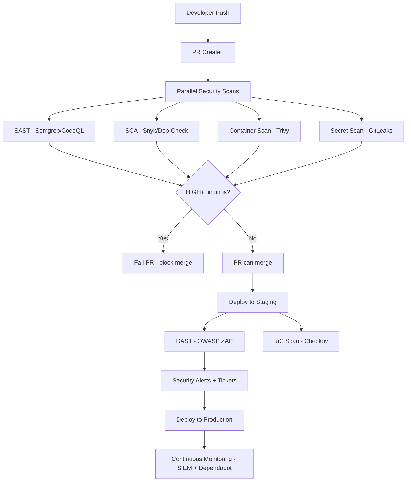

⚡ TL;DR - Security testing in CI/CD integrates multiple security
tools at different pipeline stages: pre-commit (secret scanning, linting),
PR/build (SAST, SCA/dependency scan), staging/deploy (DAST, container
scan, IaC security), and production (SIEM monitoring). The design
principle: fast tools that give immediate developer feedback (SAST: 1-3min,
secret scanning: seconds) run on every commit; slow tools (DAST: 10-30min)
run on merge to main or nightly. Each tool in its right place: don't
run DAST on every PR commit.

---

| #077 | Category: Security | Difficulty: ★★★ |
|:---|:---|:---|
| **Depends on:** | OWASP Top 10, Authentication, IAM, Secrets Management, SAST, DAST, SCA, Security Logging | |
| **Used by:** | SAST in CI/CD, DevSecOps Pipeline Design, SSDLC | |
| **Related:** | SAST, DAST, SCA, Security Logging, Pentest Methodology, SAST in CI/CD, DevSecOps Pipeline | |

---

### 🔥 The Problem This Solves

**THE COST OF FINDING SECURITY BUGS LATE:**

```
SECURITY FINDING COST BY PHASE (NIST SP 800-64, SDL data):

  Phase                    | Relative Cost | Time to Fix
  ─────────────────────────┼───────────────┼────────────
  Design/Architecture       | 1x           | Minutes (change the plan)
  Development (IDE/PR)      | 10x          | Hours (developer in context)
  QA/Test (staging)         | 100x         | Days (context switch + QA cycle)
  Production (post-deploy)  | 1000x        | Weeks (incident + fix + deploy)
  Post-breach               | 10000x       | Months (legal + remediation)

THE PIPELINE SECURITY PROBLEM:

  Without security in CI/CD:
    Developer writes vulnerable code (SQL injection, hardcoded secret).
    Code passes unit/integration tests (security not tested).
    Deploys to production.
    Vulnerability discovered in security audit 6 months later.
    Fix requires: context reconstruction, regression testing,
    hotfix deployment, communication.
    Cost: very high.
  
  With security in CI/CD (shift-left):
    Developer writes vulnerable code.
    SAST highlights it in the IDE as they type.
    (Or latest: fails the PR check 5 minutes after push.)
    Developer is still in context - fixes immediately.
    Cost: minimal.
  
  ADDITIONAL VALUE: Compliance evidence.
    PCI-DSS Req 6: "Protect web-facing applications."
    Evidence of SAST/DAST in CI/CD satisfies part of Req 6.
    Without pipeline artifacts: compliance auditors have no evidence.
    With pipeline: "Show me the last 90 days of SAST scan results."
    → Download from CI/CD system.

WHAT EACH SECURITY TOOL GOES WHERE:

  PRE-COMMIT (developer's machine, seconds):
    - Secret detection: detect-secrets, gitleaks
      "Did you accidentally include an AWS key in this commit?"
    - Linting: eslint-plugin-security, bandit quick check
      "Obvious security anti-patterns before commit."
  
  PR / BUILD STAGE (CI, 1-5 minutes):
    - SAST: Semgrep, CodeQL, Bandit
      "Find SQL injection, XSS, dangerous function calls."
    - SCA: Snyk, OWASP Dependency-Check
      "Find vulnerable dependencies (including transitive)."
    - Container image scan: Trivy
      "Find CVEs in the Docker image's package layers."
    - Secret detection: GitLeaks, GitHub secret scanning
      "Did any secret slip through the pre-commit hook?"
    These MUST be fast enough to not block developer workflow.
    Target: < 5 minutes. FAIL CI on HIGH+ findings.
  
  MERGE TO MAIN / NIGHTLY:
    - DAST: OWASP ZAP, Burp Suite
      "Attack the running application for runtime vulnerabilities."
    - IaC security: Checkov, tfsec, kics
      "Is the Terraform/CloudFormation configuration secure?"
    - License compliance: FOSSA, Snyk (license scan)
      "Are we violating any open-source licenses?"
    These may be slow (10-30 min for DAST). Run on merges,
    not every PR commit.
  
  PRODUCTION MONITORING:
    - SIEM: AWS Security Hub, Elasticsearch, Splunk
      "Alert on anomalous behavior in production."
    - Dependency monitoring: Dependabot, Snyk monitor
      "New CVE published for a dependency we're using."
    These run continuously, independent of deployment.
```

---

### 📘 Textbook Definition

**Security testing in CI/CD (DevSecOps pipeline):** The integration of
automated security tools into the build, test, and deployment pipeline
so that security vulnerabilities are detected and blocked before code
reaches production. The goal: security feedback at the speed of development.

**Shift-left security:** Moving security testing and reviews earlier
in the software development lifecycle (toward development/design),
rather than treating it as a gate at the end (production or pentest).
Earlier detection = lower cost to fix.

**Security gate:** A pipeline stage that fails the build if security
findings exceed a threshold (e.g., any CRITICAL/HIGH vulnerability
in SAST or SCA). The build cannot proceed to the next stage until
findings are addressed.

**SARIF (Static Analysis Results Interchange Format):** A JSON-based
standard output format for static analysis tools. Supported by GitHub
Security Alerts, Azure DevOps, and SonarQube. Enables displaying
security findings inline in pull requests.

**IaC security scanning:** Analyzing infrastructure-as-code (Terraform,
CloudFormation, Kubernetes YAML, Helm charts) for security misconfigurations
before deployment. Catches: publicly accessible S3 buckets, security groups
open to 0.0.0.0/0, missing encryption settings.

---

### ⏱️ Understand It in 30 Seconds

**One line:**
Security testing in CI/CD puts security checks at every stage
of the pipeline: fast checks (secrets, SAST) on every commit,
slower checks (DAST) on merges - so no vulnerable code can
reach production without being caught.

**One analogy:**
> Security testing in CI/CD is like a factory quality control system.
>
> Each station on the assembly line has quality checks:
> - Station 1 (Materials intake): check raw materials (pre-commit: secrets)
> - Station 2 (Assembly): check each component (PR: SAST, SCA)
> - Station 3 (Testing): full functional test (staging: DAST, integration)
> - Station 4 (Shipping): final verification (container scan)
> - Warehouse (Production): continuous monitoring
>
> Each check is calibrated to what can be detected at that stage.
> You don't do a full functional test on raw materials (wrong stage).
> You don't check raw materials composition at the shipping dock (too late).
>
> Similarly: SAST at the PR stage (right stage).
> DAST requires a running app - must run at staging (right stage).
> Secret detection must be pre-commit (before the secret is in git history).

---

### 🔩 First Principles Explanation

**Complete GitHub Actions security pipeline:**

```
COMPLETE GITHUB ACTIONS DEVSECOPS PIPELINE:

  ┌─────────────────────────────────────────────────────────────────┐
  │  STAGE 1: PR CHECK (every PR, must pass to merge)               │
  │  Target total time: < 10 minutes                                │
  │                                                                 │
  │  ┌──────────┐  ┌──────────┐  ┌──────────┐  ┌──────────────┐  │
  │  │  SAST    │  │   SCA    │  │ Container│  │    Secret    │  │
  │  │ Semgrep  │  │  Snyk    │  │  Trivy   │  │   GitLeaks   │  │
  │  │ CodeQL   │  │  Dep-Chk │  │  Image   │  │  + GitHub    │  │
  │  │ Bandit   │  │ npm audit│  │  Scan    │  │  Sec Scan    │  │
  │  │ 1-3 min  │  │ 2-5 min  │  │ 1-3 min  │  │  <1 min      │  │
  │  └──────────┘  └──────────┘  └──────────┘  └──────────────┘  │
  │  ALL results → GitHub Security Alerts (SARIF)                  │
  └─────────────────────────────────────────────────────────────────┘
  
  ┌─────────────────────────────────────────────────────────────────┐
  │  STAGE 2: MERGE TO MAIN / NIGHTLY                               │
  │                                                                 │
  │  ┌──────────┐  ┌──────────┐  ┌──────────┐                     │
  │  │   DAST   │  │   IaC    │  │ License  │                     │
  │  │ OWASP ZAP│  │ Checkov  │  │  Scan    │                     │
  │  │  10-30min│  │  tfsec   │  │   FOSSA  │                     │
  │  └──────────┘  └──────────┘  └──────────┘                     │
  │  Results: GitHub Security Alerts + Jira tickets                │
  └─────────────────────────────────────────────────────────────────┘
  
  ┌─────────────────────────────────────────────────────────────────┐
  │  STAGE 3: PRODUCTION MONITORING (continuous)                    │
  │                                                                 │
  │  ┌──────────────────┐  ┌─────────────────────────────────────┐ │
  │  │  Dependabot      │  │ AWS Security Hub / SIEM / Falco     │ │
  │  │  Snyk Monitor    │  │ Alerts on: new CVEs, anomalous      │ │
  │  │  (new CVE alerts)│  │ access, suspicious behavior         │ │
  │  └──────────────────┘  └─────────────────────────────────────┘ │
  └─────────────────────────────────────────────────────────────────┘
```

**IaC security scanning (Checkov for Terraform):**

```
INFRASTRUCTURE-AS-CODE SECURITY SCAN:

  Tool: Checkov (Bridgecrew/Palo Alto, open-source)
  Scans: Terraform, CloudFormation, Kubernetes YAML, Dockerfile, Helm
  
  Common findings:
  
  Terraform - S3 bucket public:
    resource "aws_s3_bucket_acl" "example" {
      acl = "public-read"     # CKV_AWS_57: S3 publicly accessible
    }
    Finding: FAILED: CKV_AWS_57 "Ensure S3 bucket has block public ACLS"
  
  Terraform - security group open to internet:
    ingress {
      cidr_blocks = ["0.0.0.0/0"]  # CKV_AWS_24: SSH from internet
      from_port = 22
      to_port = 22
    }
    Finding: FAILED: CKV_AWS_24 "Ensure SSH port is not open to internet"
  
  Kubernetes - privileged pod:
    containers:
      - securityContext:
          privileged: true      # CKV_K8S_16
    Finding: FAILED: CKV_K8S_16 "Do not admit privileged containers"
  
  GitHub Actions integration:
    - name: Run Checkov
      uses: bridgecrewio/checkov-action@master
      with:
        directory: infrastructure/
        framework: terraform
        soft_fail: false  # Fail pipeline on CRITICAL/HIGH findings
        output_format: sarif
        output_file_path: checkov.sarif
    
    - name: Upload Checkov SARIF
      uses: github/codeql-action/upload-sarif@v3
      with:
        sarif_file: checkov.sarif
```

---

### 🧪 Thought Experiment

**SCENARIO: Building a complete security pipeline for a new microservice:**

```
NEW MICROSERVICE SECURITY PIPELINE SETUP:

Day 1: Pre-commit hooks (developer environment):
  Install: npm install --save-dev @secretlint/secretlint husky
  
  package.json:
    "husky": {
      "hooks": {
        "pre-commit": "secretlint '**/*' && npm run lint-security"
      }
    }
  
  .secretlintrc.json:
    {
      "rules": [
        { "id": "@secretlint/secretlint-rule-preset-recommend" }
      ]
    }
  
  Prevents: AWS keys, GitHub tokens, private keys from being committed.

Day 1-2: PR security pipeline (GitHub Actions):
  # .github/workflows/security.yml
  name: Security Checks
  on: [pull_request]
  
  jobs:
    sast:
      uses: ./.github/workflows/semgrep.yml  # Reusable workflow
    sca:
      uses: ./.github/workflows/snyk.yml
    container-scan:
      uses: ./.github/workflows/trivy.yml
    iac-security:
      uses: ./.github/workflows/checkov.yml

Day 3: Configure security gates:
  Branch protection rules:
    Required status checks:
      - security / sast
      - security / sca  
      - security / container-scan
  
  If any required check fails: PR cannot be merged.
  This makes security a hard gate (not just informational).

Day 4: DAST on staging:
  # Triggered by deploy-to-staging job:
  # .github/workflows/dast.yml
  on:
    workflow_call:
      # Called by deployment workflow after staging deploy
  
  Run: zaproxy/action-api-scan against staging environment.
  Findings: create GitHub Security Alerts.
  Threshold: CRITICAL/HIGH findings create Jira tickets (don't block staging).
  (DAST findings in staging are informational - blocking would prevent
  security testing of the deployment itself)

Day 5: Monitor production:
  - Enable Dependabot for the repository.
  - Configure Snyk monitor: snyk monitor --project-name=my-service
  - AWS Security Hub auto-enabled for the account.
  
  Ongoing: Dependabot creates PRs for vulnerable dependencies.
  Snyk alerts on new CVEs for dependencies in use.
  AWS Security Hub alerts on security standard violations.

MEASURING PIPELINE EFFECTIVENESS:
  Track (monthly):
    - SAST findings per 1000 lines of code (trend: should decrease)
    - Mean time from finding to fix (SAST vs DAST vs monitoring)
    - Number of security vulnerabilities reaching production (goal: 0 for HIGH+)
    - False positive rate per SAST tool (if >20%: tune rules)
    - Developer suppression rate (if >30%: investigate why - tool noise?)
```

---

### 🧠 Mental Model / Analogy

> Security testing in CI/CD is like airport security layers.
>
> Check-in (pre-commit/PR):
>   ID check (secret scanning): "Do you have anything you shouldn't?"
>   SAST/SCA: "Is your code/dependency carrying known threats?"
>
> Security checkpoint (staging gate):
>   Full body scan (DAST): "Full-system security assessment."
>   IaC scan: "Is the airport configuration secure?"
>
> Boarding gate (container scan):
>   "Final check of what's going into the plane (production)."
>
> In-flight (production monitoring):
>   Behavior monitoring (SIEM): "Alert on unusual mid-flight activities."
>
> The goal: no threat reaches the plane (production).
> Each checkpoint catches what the previous missed.
> Fast, lightweight checks early. Deep, thorough checks at gates.
> Continuous monitoring throughout.

---

### 📶 Gradual Depth - Five Levels

**Level 1 - What it is (anyone can understand):**
Security testing in CI/CD means running automatic security checks every time code is committed - not just at release time or once a year. These checks find vulnerabilities before they reach production: scanning for known security bugs in the code (SAST), checking if libraries have known vulnerabilities (SCA), and attacking the running application to find runtime issues (DAST). Failed checks block deployment.

**Level 2 - How to use it (junior developer):**
Add three security check jobs to your GitHub Actions workflow: Semgrep (SAST), Snyk (SCA), and Trivy (container image). Make them required status checks for PR merge (branch protection rules). For DAST: add a ZAP scan job that runs after deploying to staging. Configure SARIF output and upload to GitHub Security tab. Add pre-commit hooks for secret detection.

**Level 3 - How it works (mid-level engineer):**
Pipeline stage design is about matching tool characteristics to pipeline stages. SAST: runs on source code, fast (1-5 min), runs on every PR. SCA: resolves dependency tree, fast (2-5 min), runs on every PR. Container scan: scans image layers, fast (1-3 min), runs on every build. DAST: requires running application, slow (10-30 min), runs on staging deployment. IaC scan: analyzes Terraform/K8s configs, fast (1-3 min), runs on every PR with infra changes. Security gate = required status check. SARIF = standard format that integrates security findings with GitHub Security Alerts, PR comments, and developer IDE.

**Level 4 - Why it was designed this way (senior/staff):**
The original security testing model was: develop everything, then have a security team review at the end. This created bottlenecks (security team couldn't review everything) and late-stage findings (expensive to fix). DevSecOps applied CI/CD principles to security: automate repeatable checks, provide fast feedback, make security a shared responsibility. The challenge: different security tools have different characteristics (speed, false positive rates, what they find), requiring different placement in the pipeline. Attempting to run everything on every commit creates pipeline bloat and developer friction. The right model: fast/low-noise tools on every commit, slower/deeper tools on merge/nightly, manual pen test for what automation misses.

**Level 5 - Mastery (distinguished engineer):**
Advanced DevSecOps: policy-as-code enforcement (OPA/Rego policies for Kubernetes admission control, automated compliance checks against CIS benchmarks). Evidence-based compliance: CI/CD pipeline automatically generates compliance artifacts (SAST reports, scan results, deployment manifests) linked to release artifacts. Regulatory compliance audits: instead of manual evidence gathering, the pipeline produces a compliance dashboard. Supply chain security: SLSA provenance attestation generated as part of the build, container images signed with Sigstore/Cosign, SBOM attached to release artifacts. Metrics: track MTTD (Mean Time to Detect) for security findings across pipeline stages, MTTR (Mean Time to Remediate), false positive rates, and findings-per-1000-lines trends. These metrics drive continuous improvement of the security pipeline.

---

### ⚙️ How It Works (Mechanism)

```
PIPELINE SECURITY CONTROL FLOW:

  Developer push
      │
      ▼
  PR Created
      │
      ├──→ Semgrep SAST ──→ SARIF ──→ GitHub Security Alerts
      │     (1-3 min)          │
      ├──→ Snyk SCA ──────────→│
      │     (2-5 min)          │
      ├──→ Trivy Container ───→│
      │     (1-3 min)          │
      ├──→ GitLeaks ──────────→│
      │     (<1 min)           │
      │                        ▼
      │           HIGH+ findings?
      │               │         │
      │               YES       NO
      │               │         │
      │               ▼         ▼
      │          Fail PR ─────→ PR can merge
      │                     (required status checks pass)
      │
      ▼  (on merge to main)
  Deploy to Staging
      │
      ├──→ OWASP ZAP DAST ──→ GitHub Security Alerts + Jira
      │     (10-30 min)
      ├──→ Checkov IaC Scan ──→ SARIF
      │     (2-5 min)
      │
      ▼  (staging tests pass)
  Deploy to Production
      │
      ▼
  Production Monitoring (continuous)
      ├──→ AWS Security Hub
      ├──→ Dependabot (new CVE alerts)
      └──→ SIEM (behavioral anomalies)
```



---

### 💻 Code Example

**Reusable GitHub Actions security workflow:**

```yaml
# .github/workflows/security-pipeline.yml
name: Security Pipeline

on:
  pull_request:
    branches: [main, develop]
  push:
    branches: [main]

permissions:
  contents: read
  security-events: write  # Required for SARIF upload

jobs:
  # ──────────────────────────────────────────────────────────────
  # STAGE 1: Fast checks - run on every PR
  # ──────────────────────────────────────────────────────────────
  sast:
    name: SAST - Semgrep
    runs-on: ubuntu-latest
    steps:
      - uses: actions/checkout@v4
      - uses: returntocorp/semgrep-action@v1
        with:
          config: >-
            p/security-audit
            p/owasp-top-ten
            p/java
          generateSarif: "1"
        env:
          SEMGREP_APP_TOKEN: ${{ secrets.SEMGREP_APP_TOKEN }}
      - uses: github/codeql-action/upload-sarif@v3
        if: always()
        with:
          sarif_file: semgrep.sarif

  sca:
    name: SCA - Dependency Scan
    runs-on: ubuntu-latest
    steps:
      - uses: actions/checkout@v4
      - uses: snyk/actions/node@master
        env:
          SNYK_TOKEN: ${{ secrets.SNYK_TOKEN }}
        with:
          args: --severity-threshold=high --sarif-file-output=snyk.sarif
      - uses: github/codeql-action/upload-sarif@v3
        if: always()
        with:
          sarif_file: snyk.sarif

  container-scan:
    name: Container Image Scan
    runs-on: ubuntu-latest
    steps:
      - uses: actions/checkout@v4
      - name: Build image
        run: docker build -t myapp:${{ github.sha }} .
      - uses: aquasecurity/trivy-action@master
        with:
          image-ref: 'myapp:${{ github.sha }}'
          format: sarif
          output: trivy.sarif
          severity: CRITICAL,HIGH
          exit-code: '1'
          ignore-unfixed: true
      - uses: github/codeql-action/upload-sarif@v3
        if: always()
        with:
          sarif_file: trivy.sarif

  iac-scan:
    name: IaC Security - Checkov
    runs-on: ubuntu-latest
    steps:
      - uses: actions/checkout@v4
      - uses: bridgecrewio/checkov-action@master
        with:
          directory: infrastructure/
          framework: terraform,kubernetes
          soft_fail: false
          output_format: sarif
          output_file_path: checkov.sarif
      - uses: github/codeql-action/upload-sarif@v3
        if: always()
        with:
          sarif_file: checkov.sarif

  # ──────────────────────────────────────────────────────────────
  # STAGE 2: DAST on staging (triggered by staging deployment)
  # ──────────────────────────────────────────────────────────────
  dast:
    name: DAST - OWASP ZAP
    runs-on: ubuntu-latest
    needs: [build-and-deploy-staging]  # Wait for staging deployment
    if: github.ref == 'refs/heads/main'  # Only on main branch merges
    steps:
      - uses: actions/checkout@v4
      - uses: zaproxy/action-api-scan@v0.7.0
        with:
          target: ${{ vars.STAGING_API_URL }}/v3/api-docs
          format: openapi
          fail_action: false   # Don't fail CI (informational on staging)
          allow_issue_writing: true
```

---

### ⚖️ Comparison Table

| Stage | Tool | Runs On | Time | Blocks Merge? |
|:---|:---|:---|:---|:---|
| **Pre-commit** | secretlint, gitleaks | Developer machine | <5 sec | Yes (local) |
| **PR/Build** | Semgrep, Snyk, Trivy | Every PR | 1-5 min each | Yes (required checks) |
| **Merge/Nightly** | OWASP ZAP, Checkov | Main/Nightly | 10-30 min | No (informational) |
| **Production** | Dependabot, SIEM | Continuous | N/A | Via alert/ticket |

---

### ⚠️ Common Misconceptions

| Misconception | Reality |
|:---|:---|
| "We can run all security tools on every PR." | Different tools have different timing characteristics and discovery capabilities. DAST requires a running application (must run after deployment to staging). Container scans need a built image. Running DAST on every PR would require spinning up a full application environment for each PR - impractical for most teams. The right model: match tool placement to what the tool requires and what the developer can act on. SAST in the IDE/PR: developer has immediate context. DAST on staging: findings are about the deployed app, addressed before production release. Forcing all tools into the PR stage creates a slow pipeline and developer friction. |
| "Security pipeline findings are the security team's job to fix." | Security findings in the CI pipeline are the DEVELOPER'S responsibility to fix, the same as failing unit tests. The security team sets the standards (which tools, which rules, what severity threshold triggers a failure) and supports developers in understanding findings. But the fix itself is the developer's work. DevSecOps: "You build it, you secure it." The security team cannot scale to fix every security finding in every PR across every microservice. The developer is the only person with the context, the codebase knowledge, and the ability to fix their own code efficiently. Security tooling surfaces findings; developers fix them. |

---

### 🚨 Failure Modes & Diagnosis

**Common security pipeline problems:**

```
PROBLEM 1: Pipeline too slow - developers bypass security checks
  
  Symptom: Security pipeline takes 20+ minutes.
  Developers push directly to main (bypassing PR branch protection).
  Or: security checks marked "allow failures" so pipeline passes.
  
  Fix:
    Audit scan times per job. Move slow jobs to nightly.
    Target: all PR security jobs complete in < 10 minutes total.
    Enable parallel execution (all security jobs run in parallel, not serial).
    Use incremental/diff-aware scanning (Semgrep --diff-depth=1):
      Only scan changed files, not entire codebase.
    Move DAST and deep CodeQL to nightly / merge-to-main.

PROBLEM 2: Too many false positives - findings ignored
  
  Symptom: SAST produces 200+ findings on a legacy codebase.
  Team adds "continue-on-error: true" to all security jobs.
  Security pipeline becomes purely cosmetic.
  
  Fix:
    Phase 1: Run without failing (inventory).
    Phase 2: Fix all CRITICAL + HIGH over 2 sprints.
    Phase 3: Enable fail on CRITICAL + HIGH only.
    Phase 4: Address MEDIUM findings over 2 months.
    Phase 5: Enable fail on MEDIUM.
    
    Tune rules: disable noisy rules with documented justification.
    Use baseline mode: fail only on NEW findings (not historical ones).
      Semgrep: --diff-depth=1 (only check changed lines)

PROBLEM 3: Security findings not reaching developers (no notifications)
  
  Symptom: SARIF uploaded to GitHub Security. Nobody looks at it.
  Findings accumulate. Pipeline "passes" (findings below threshold).
  
  Fix:
    Configure GitHub Security Alerts notifications for repo maintainers.
    Add PR comment action: security findings posted as PR comments.
    Integrate with JIRA: automatically create security tickets for HIGH+.
    Weekly security dashboard: trend of open findings per team.
    Security metric in team OKRs: "Zero HIGH+ security findings in production."
```

---

### 🔗 Related Keywords

**Prerequisites:**
- `SAST` - code analysis tool
- `DAST` - runtime testing tool
- `SCA` - dependency vulnerability scanning
- `Secrets Management` - secret scanning context

**Builds on this:**
- `SAST in CI/CD` - SAST-specific CI/CD details
- `DevSecOps Pipeline Design` - full pipeline architecture
- `SSDLC` - security in the development lifecycle

---

### 📌 Quick Reference Card

```
┌──────────────────────────────────────────────────────────┐
│ PR CHECKS    │ SAST (Semgrep), SCA (Snyk), Container     │
│ (<10 min)    │ (Trivy), Secrets (GitLeaks)               │
│              │ FAIL on HIGH+                              │
├──────────────┼───────────────────────────────────────────┤
│ MERGE/NIGHTLY│ DAST (ZAP), IaC (Checkov), License (FOSSA)│
│              │ Informational or ticket-creation           │
├──────────────┼───────────────────────────────────────────┤
│ PRODUCTION   │ Dependabot (CVE alerts), SIEM             │
│ (continuous) │ (behavioral monitoring)                    │
├──────────────┼───────────────────────────────────────────┤
│ SARIF OUTPUT │ All tools → GitHub Security Alerts tab    │
│ FORMAT       │ Inline PR comments + email alerts          │
└──────────────────────────────────────────────────────────┘
```

---

### 💎 Transferable Wisdom

**Reusable Engineering Principle:**
"Match the feedback speed to the action speed."
A SAST finding shown to a developer 5 seconds after they type it:
fixed in 2 minutes (still in context).
A SAST finding shown 3 weeks later in a PR review comment:
fixed in hours (requires context reconstruction, PR cycle).
A SAST finding shown 6 months later in a security audit:
fixed in days or weeks (regression testing, hotfix, deployment).
The principle extends beyond security:
- Type errors in IDE (milliseconds after typing): fixed immediately.
- Compile errors at build time: fixed in minutes.
- Integration test failures at CI: fixed in hours.
- Production errors discovered by users: fixed in hours-days.
The earlier the feedback, the faster and cheaper the fix.
CI/CD pipelines were designed to accelerate feedback on correctness
(unit/integration tests). Security pipelines apply the same principle
to security correctness.
The practical design rule: run checks at the EARLIEST STAGE where
they can produce actionable feedback. Checks that require a running
application cannot run at compile time. Checks on source code shouldn't
wait until deployment. Match the check to the earliest feasible stage.
Fast feedback loops are not just a developer convenience - they're the
mechanism that makes quality (security included) achievable at scale.

---

### 💡 The Surprising Truth

Most organizations that implement "DevSecOps" do so by adding security
tools to CI/CD pipelines - but the surprising research finding is that
tool placement matters as much as tool selection.

Google's research on Developer Productivity (summarized in the DORA
metrics) found that high-performing engineering teams have:
1. Very fast build/test cycles (< 10 minutes)
2. Security checks integrated into the development workflow
3. Security findings surfaced in developer-native tools (IDE, PR comments)

The critical insight: a SAST tool whose findings are only visible in
a separate security dashboard (not in the PR, not in the IDE) has 70%
lower fix rates than the same tool with IDE and PR integration.

The "shift-left" in DevSecOps is not just about TIMING (earlier in SDLC).
It's about DEVELOPER CONTEXT INTEGRATION. A finding at the right stage
in a developer-native tool (IDE plugin, PR comment) is actionable.
The same finding in a separate security portal requires the developer
to switch context, log into another system, and remember which finding
belongs to which PR.

The highest-ROI improvement in security pipeline design:
configure Semgrep + GitHub Advanced Security + PR inline comments.
Same tools. Different output location.
3-5x higher fix rates. Zero additional tool cost (GitHub GHAS is free
for public repos, included with GitHub Enterprise for private repos).

---

### ✅ Mastery Checklist

**You've mastered this when you can:**
1. **DESIGN** a security pipeline with the right tools at the right stages:
   pre-commit (secrets), PR (SAST+SCA+container), staging (DAST+IaC),
   production (SIEM+Dependabot).
2. **CONFIGURE** parallel security jobs in GitHub Actions with SARIF output
   uploaded to GitHub Security Alerts.
3. **SET UP** branch protection with required security status checks so
   HIGH+ SAST/SCA findings block PR merge.
4. **OPTIMIZE** pipeline speed: parallel execution, diff-aware scanning,
   nightly/merge placement for slow tools.

---

### 🎯 Interview Deep-Dive

**Q: How do you integrate security testing into a CI/CD pipeline?
What goes where in the pipeline?**

*Why they ask:* DevSecOps is a standard expectation for senior engineers.
Tests whether candidate can design a practical security pipeline.

*Strong answer covers:*
- Three stages: PR/build (fast, blocks merge), merge/nightly (slower, informational),
  production monitoring (continuous).
- PR stage: SAST (Semgrep/CodeQL/Bandit, 1-3 min), SCA (Snyk/Dep-Check, 2-5 min),
  container scan (Trivy, 1-3 min), secret detection (GitLeaks). Total: < 10 min.
  Required status checks: HIGH+ findings block merge.
- Merge/nightly: DAST (OWASP ZAP on staging, 10-30 min), IaC scan (Checkov).
  DAST requires running application - cannot run at PR stage.
- Production monitoring: Dependabot for new CVE alerts, SIEM for behavioral anomalies.
- SARIF format: standard output for all tools → GitHub Security Alerts (central view).
- Key principle: fast tools at PR stage (developer feedback while in context).
  Slow tools post-merge (don't block developer workflow unnecessarily).
- Getting started on legacy codebase: run without failing first (baseline).
  Fix HIGH+ over 2 sprints. Then enable fail-on-HIGH+. Phased approach.
- Security gates: GitHub branch protection + required status checks = security
  pipeline cannot be bypassed without explicit approval.