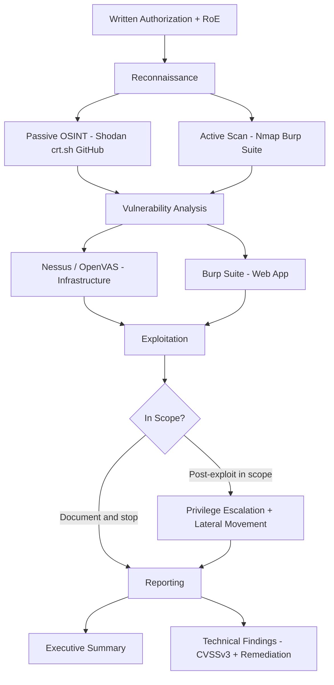

⚡ TL;DR - Penetration testing (pentest) is an authorized, simulated
attack against a system to find exploitable vulnerabilities before
malicious actors do. The standard methodology: PTES (Penetration
Testing Execution Standard) 7 phases - pre-engagement (scope + written
authorization), intelligence gathering (OSINT), threat modeling,
vulnerability analysis, exploitation, post-exploitation, reporting.
Key distinction: pentest vs vulnerability scan vs red team. A pentest
has defined scope and objective (test web app, internal network). Red
team has no defined scope (simulate a full attacker). Vulnerability
scan = automated only. Pentest = manual + automated + exploitation.

---

| #078 | Category: Security | Difficulty: ★★★ |
|:---|:---|:---|
| **Depends on:** | OWASP Top 10, Authentication, IAM, Secrets Management, DAST, Security Logging, Security Testing in CI/CD | |
| **Used by:** | Responsible Disclosure + Bug Bounty, Red/Blue/Purple Team, DevSecOps Pipeline, SSDLC | |
| **Related:** | Secrets Management, DAST, Security Logging, Security Testing in CI/CD, Responsible Disclosure, Red/Blue/Purple Team | |

---

### 🔥 The Problem This Solves

**WHY AUTOMATED TESTING IS NOT ENOUGH:**

```
THE AUTOMATION GAP IN SECURITY TESTING:

  SAST finds:
    - Known vulnerability patterns (SQL injection patterns in code)
    - Dangerous function usage (eval(), system())
    - Input validation gaps visible in source code
    - Does NOT find: authentication logic flaws, business logic bugs,
      multi-step attack chains, runtime misconfigurations
  
  DAST finds:
    - Single-request vulnerabilities (XSS, SQLi via HTTP response analysis)
    - Common misconfigurations (missing headers, open endpoints)
    - Does NOT find: multi-step attacks, chained vulnerabilities,
      application-specific logic flaws, things that require human intuition
  
  What ONLY pentest finds (examples from real breaches):
    - IDOR (Insecure Direct Object Reference): change user_id in API call
      from /api/orders/12345 to /api/orders/12346. Different user's order?
      Automated tools can find pattern - only manual testing with real
      accounts can VERIFY the actual impact.
    - Business logic flaw: negative quantity in shopping cart = negative
      total = "earn" money on purchase. Logic is correct in isolation.
      Business logic flaw that automated tools cannot detect.
    - Privilege escalation chain: API key → read S3 bucket →
      find hardcoded admin credentials → admin access.
      Each step individually looks innocuous. Combined: full compromise.
    - Second-order SQL injection: input stored safely to DB, but
      later used in another query without sanitization. Multi-step.
    - Auth bypass: Token validation passes for resource A.
      Token reuse across service B (which trusts service A's tokens).
      Multi-service trust chain vulnerability.
  
  REQUIREMENT SOURCES FOR PENETRATION TESTING:
    - PCI-DSS Requirement 11.3: Annual penetration testing required.
      (Internal network + external + app layer pentest)
    - GDPR Article 32(1)(d): "regular testing" of security measures.
    - SOC 2 CC7.1: Regular security testing.
    - ISO 27001 A.12.6.1: Management of technical vulnerabilities.
    - Business need: verify security controls actually work before attackers do.
```

---

### 📘 Textbook Definition

**Penetration test (pentest):** An authorized, simulated cyberattack
against a computer system, application, or network. Performed by security
professionals ("ethical hackers" or "pentesters") to identify vulnerabilities
that could be exploited by attackers. Unlike vulnerability scanning
(automated tool enumeration), pentesting includes manual exploitation
to confirm that vulnerabilities are actually exploitable and to determine
real-world impact.

**Rules of Engagement (RoE):** Written document defining the pentest scope,
authorized systems, test methods, prohibited actions, notification procedures,
and emergency contacts. MUST be signed by an authorized party before
testing begins. Without RoE: ethical hack = criminal activity.

**PTES (Penetration Testing Execution Standard):** An industry methodology
defining 7 phases of a penetration test. Provides a consistent framework
for what constitutes a professional penetration test.

**CVSSv3 (Common Vulnerability Scoring System v3):** Numeric score (0-10)
representing vulnerability severity. Components: Attack Vector, Attack
Complexity, Privileges Required, User Interaction, Scope, Confidentiality
Impact, Integrity Impact, Availability Impact. Score ranges:
Critical 9.0-10.0, High 7.0-8.9, Medium 4.0-6.9, Low 0.1-3.9.

**Bug bounty program:** A structured program where organizations invite
external security researchers to find vulnerabilities in their systems
in exchange for recognition and/or monetary rewards. Open-ended
vulnerability discovery, not time-boxed.

---

### ⏱️ Understand It in 30 Seconds

**One line:**
Penetration testing is an authorized, simulated attack where
a security professional tries to breach your system using the same
techniques as real attackers - to find real vulnerabilities with
real business impact before malicious actors do.

**One analogy:**
> A pentest is a fire drill combined with a building safety inspection.
>
> A fire drill tests: "Do the evacuation procedures work?
> Do employees know what to do? Are the exits actually accessible?
> Does the alarm work in every building zone?"
>
> You don't just test the smoke detector (automated scanning).
> You simulate the actual scenario (pentest), including walking
> through the exit, checking the door opens from the stairwell,
> and timing the evacuation.
>
> If the stairwell door is stuck (a vulnerability), you want to find
> that during the drill - not during the real fire.
>
> The building inspector (pentester) has written authorization
> (RoE) to enter restricted areas, test fire doors, and check
> emergency systems. Without written authorization: trespassing.

---

### 🔩 First Principles Explanation

**PTES 7-phase methodology with practical details:**

```
PTES PHASE 1: PRE-ENGAGEMENT

  Activities:
    1. Define scope:
       - In-scope: IP ranges, domains, applications, features
       - Out-of-scope: production databases, third-party services,
         payment processors (may violate THEIR policies)
    2. Rules of Engagement:
       - Testing windows: 09:00-17:00 business hours? 24/7?
       - Prohibited techniques: DoS, social engineering, physical access?
       - Emergency stop: if critical vulnerability found (e.g., active
         exploitation in production), stop and call emergency contact
       - Data handling: client data seen during test - how is it handled?
    3. Legal documentation:
       - SIGNED authorization from system OWNER (not just admin)
       - Statement of Work + NDA
       - Data handling agreement
    4. Threat model: what would an attacker actually want?
       - Data: PII, payment data, intellectual property
       - Access: admin access, privileged accounts
       - Availability: disrupt service (DoS)
       - Pivot: use this system to attack other systems
  
  CRITICAL: Testing without written authorization = Computer Fraud
  and Abuse Act (CFAA in US), Computer Misuse Act (UK), or equivalent.
  Written authorization from AUTHORIZED OWNER is non-negotiable.

PTES PHASE 2: INTELLIGENCE GATHERING (RECON)

  Passive recon (no direct interaction with target systems):
    OSINT (Open Source Intelligence):
    
    - theHarvester:
        theHarvester -d example.com -b google,bing,linkedin
        Finds: email addresses, subdomains, hosts
    
    - Shodan (search engine for internet-connected devices):
        hostname:example.com port:22
        Finds: open ports, banners, TLS certificates,
        software versions visible from internet
    
    - Certificate Transparency Logs (crt.sh):
        https://crt.sh/?q=%25.example.com
        Finds: all SSL certificates issued for *.example.com
        Including certificates for internal subdomains
        leaked via certificate issuance records.
        (developers.internal.example.com? staging.example.com?)
    
    - WHOIS / DNS:
        whois example.com
        dig TXT example.com (SPF, DMARC, verification records)
        nslookup -type=MX example.com (email servers)
    
    - LinkedIn/GitHub:
        Company employees (targeted spear phishing targets)
        GitHub: exposed secrets, internal hostnames, API endpoints
        in public repositories or commit history
    
  Active recon (direct interaction with target):
    - Nmap port scan:
        nmap -sV -sC -p- example.com
        Finds: open ports, service versions, default scripts
    
    - Web app fingerprinting:
        whatweb -v https://example.com
        Wappalyzer extension
        Finds: framework, CMS, JavaScript libraries, server software

PTES PHASE 3: THREAT MODELING
  Based on gathered intelligence, determine the most likely
  and highest-impact attack paths.
  
  Key questions:
    - What are the crown jewels? (data/systems most valuable to attacker)
    - What is the most likely attack path given what we found?
    - What is the most impactful attack we could attempt?
  
  Example threat model output:
    Attack path 1 (most likely): phishing employee → credential theft
      → VPN access → lateral movement → DB access
    Attack path 2 (most impactful): web app SQLi → admin access → full DB
    Attack path 3: exposed staging environment with production data

PTES PHASE 4: VULNERABILITY ANALYSIS
  Identify vulnerabilities in discovered attack surface.
  
  Tools:
    - Nessus / OpenVAS: infrastructure vulnerability scanner
      Finds: unpatched CVEs, weak configurations, default credentials
    - Burp Suite / OWASP ZAP: web application scanner + manual proxy
      Finds: web-specific vulnerabilities (OWASP Top 10)
    - Manual code review (if in scope): look for logic flaws
    - Version analysis: compare discovered versions to CVE database
  
  Approach: prioritize by exploitability and impact.
  Don't try to exploit everything - plan the highest-value attacks first.

PTES PHASE 5: EXPLOITATION
  Attempt to exploit discovered vulnerabilities to confirm:
    1. Vulnerability IS exploitable (not just theoretically present)
    2. What is the actual impact? (read arbitrary files? admin access?)
    3. Is it reachable from the defined threat actor's position?
  
  Tools:
    - Metasploit: framework with exploit modules for known CVEs
    - Burp Suite: manual web app exploitation (SQLi, XSS, IDOR)
    - SQLMap: automated SQL injection exploitation (in scope only)
    - Custom scripts: for application-specific logic flaws
  
  IMPORTANT: Exploitation is CONTROLLED. Do not:
    - Exfiltrate real customer data (confirm access, then stop)
    - Modify production data
    - Cause availability impacts
    - Exceed the defined scope
  Document what was accessed/achieved, then stop.

PTES PHASE 6: POST-EXPLOITATION
  (Red team only, or explicitly in scope)
  
  After initial access: simulate what a real attacker would do.
    - Privilege escalation: are there ways to gain higher privilege?
    - Lateral movement: can we move to other systems from here?
    - Persistence: what persistence mechanisms exist?
    - Data discovery: what sensitive data is accessible?
  
  Purpose: show IMPACT of initial compromise.
  "We got into web server X" is less compelling than
  "From web server X we reached the production database."
  
  This phase demonstrates the actual business risk,
  not just the existence of a vulnerability.

PTES PHASE 7: REPORTING
  The output that the client actually uses.
  
  Executive summary (for leadership):
    - Overall risk rating (Critical/High/Medium/Low)
    - Key findings in business impact terms
    - Top 3 recommended actions
    - No technical jargon
  
  Technical findings (for engineering teams):
    For each finding:
      - Title: descriptive (not just "SQL Injection")
      - CVSSv3 score and vector string
      - Description: what was found, where, how
      - Evidence: screenshots, HTTP requests/responses, proof of exploit
      - Business impact: what could an attacker do?
      - Reproduction steps: exact steps to reproduce
      - Remediation: specific fix recommendation
      - References: CWE, OWASP, CVE if applicable
    
  Findings sorted by: Critical → High → Medium → Low → Informational
```

---

### 🧪 Thought Experiment

**SCENARIO: Planning a pentest for a SaaS application:**

```
TARGET: B2B SaaS application. User roles: admin, manager, viewer.
API: REST API (Spring Boot). Frontend: React SPA.
Infrastructure: AWS (ECS containers, RDS PostgreSQL, S3 for uploads).
Regulatory context: SOC 2 audit requires annual pentest.

STEP 1: Define scope and RoE.
  In-scope:
    - *.acmecorp.com (all subdomains)
    - API: api.acmecorp.com
    - AWS account (external-facing resources only, no production DB writes)
    - IP ranges: 52.0.0.0/24 (known load balancer range)
  
  Out-of-scope:
    - AWS account console / IAM (cloud configuration review separate engagement)
    - Third-party integrations (Stripe, SendGrid)
    - DoS testing (production environment)
    - Production database modification
  
  Test accounts provided:
    - 1x admin account (admin@acmecorp-pentest.com)
    - 1x manager account
    - 1x viewer account
  (All in a dedicated test tenant, not production data)
  
  Testing window: business hours M-F (for monitoring team availability)
  Emergency contact: CISO, CTO mobile numbers on file

STEP 2: Reconnaissance.
  Passive: crt.sh → discovers dev.acmecorp.com, staging.acmecorp.com,
           admin.acmecorp.com (not in scope but noted)
  Shodan: api.acmecorp.com → TLS cert details, server: nginx/1.18.0
  GitHub search: "acmecorp" → find a public test repo with hardcoded
                 JWT secret from 2021. Secret since rotated? Verify.

STEP 3: Web App Assessment.
  Burp Suite proxy → capture all traffic from test admin account.
  
  IDOR test: GET /api/v1/organizations/{orgId}/users
  → Change orgId from own org to another org's ID
  → Returns users of OTHER organization (IDOR - Critical finding!)
  
  BOLA (Broken Object Level Authorization) across all endpoints.
  Horizontal privilege escalation: viewer can view admin-only reports?
  Vertical privilege escalation: manager can delete users via direct API call?
  
  JWT security: is the JWT secret from GitHub still valid?
  → Forge a JWT with admin role → rejected (secret was rotated - informational)
  
  File upload (S3): upload SVG file with embedded XSS → stored XSS?
  
STEP 4: Reporting.
  Critical: IDOR in organization users endpoint.
    CVSSv3: 8.5 (High - Authentication required, high data impact)
    Evidence: HTTP request + response showing cross-org data leak
    Impact: any authenticated user can enumerate all users across all orgs
    Fix: enforce organizationId from the authenticated user's JWT,
         never trust orgId from the URL parameter
  
  Medium: Nginx version disclosure (nginx/1.18.0 in headers)
    CVSSv3: 3.1 (Low)
    Evidence: Shodan fingerprint
    Fix: remove Server header (nginx: server_tokens off;)
  
  Informational: Expired JWT secret in GitHub history (rotated - no risk)
```

---

### 🧠 Mental Model / Analogy

> Penetration testing is a commissioned burglary attempt.
>
> A building owner hires a professional security consultant.
> Written contract: "Try to break into Building A. Here's your badge.
> Don't damage property. Document what you find."
>
> The consultant tests:
> - Physical security (bypass badge reader with shimming?)
> - Reception procedures (social engineering to get temp badge?)
> - Server room door (propped open? locked properly?)
> - Once inside: what can you reach? What data is accessible?
>
> Report: "I got to the server room via the propped open maintenance door.
> From there I could reach 3 servers without authentication."
>
> Without the written commission: it's a crime, not a security test.
> With the written commission (Rules of Engagement): it's a valuable
> security assessment that finds real vulnerabilities.
>
> The value: YOU know about the propped door before a real burglar does.

---

### 📶 Gradual Depth - Five Levels

**Level 1 - What it is (anyone can understand):**
Penetration testing is hiring security experts to try to hack your systems - with permission - to find security holes before real attackers do. They use the same tools and techniques as malicious hackers. The difference: they have written authorization, they document what they find, and they tell you how to fix it rather than exploit it for gain.

**Level 2 - How to use it (junior developer):**
Pentest involves a 7-phase methodology (PTES): scope/authorization, recon (OSINT, Shodan, port scanning), vulnerability analysis (Nessus, Burp Suite), exploitation (Metasploit, SQLMap, manual Burp), post-exploitation (privilege escalation, lateral movement), and reporting. Each finding gets a CVSSv3 score and remediation recommendation. Required annually for PCI-DSS. You need: signed authorization, defined scope, written RoE, and test accounts in a non-production environment.

**Level 3 - How it works (mid-level engineer):**
Reconnaisance reveals attack surface via OSINT (crt.sh for subdomains, Shodan for exposed services, GitHub for leaked secrets). Vulnerability analysis identifies weaknesses (IDOR, broken auth, injection vulnerabilities). Exploitation confirms vulnerabilities are real (not false positives) and determines actual impact. The report must show business impact, not just technical findings - executives need to understand why they should fund remediation. Pentest scope design matters: too narrow misses critical vectors; too broad (production DB writes) creates risk of accidental damage. Provide test accounts, not production credentials. Scope third-party services OUT.

**Level 4 - Why it was designed this way (senior/staff):**
Automated scanners find known patterns but miss business logic flaws, chained vulnerabilities, and application-specific authorization failures. Manual expertise is required to: synthesize reconnaissance data into attack paths, chain minor vulnerabilities into high-impact attacks, test multi-step logic flaws, and evaluate real-world exploitability. CVSSv3 scores are imperfect: they capture exploitability and impact in isolation, not in the context of the specific system (a CVSSv3 7.0 finding that requires internal network access in a network-isolated system is less critical than the score suggests). Experienced pentesters provide context: "This is rated High, but your network controls make it Low risk in practice" or vice versa.

**Level 5 - Mastery (distinguished engineer):**
Advanced pentest design: threat-model-driven scoping - rather than "test everything," identify the most likely attack paths based on your threat model (nation-state vs. opportunistic criminal vs. insider threat) and focus pentest effort there. Purple team exercises: red team attacks while blue team detects and responds - improving detection/response, not just finding vulnerabilities. Purple team generates attacker TTPs (Tactics, Techniques, Procedures) mapped to MITRE ATT&CK framework, then validates whether SIEM/EDR detects each TTP. Assumed-breach exercises: assume the attacker is already inside, test lateral movement and persistence detection. Risk acceptance: some findings may be accepted with business justification (cost to fix > cost of risk). Security ROI metrics: track mean time to remediate pentest findings, recurring finding rate (same class of vulnerability found in successive pentests = systemic problem, not one-off bug).

---

### ⚙️ How It Works (Mechanism)

```
PENETRATION TESTING WORKFLOW:

  Written RoE + Scope
       │
       ▼
  Reconnaissance
  ├── Passive: OSINT (crt.sh, Shodan, GitHub, LinkedIn)
  └── Active: Nmap, web fingerprinting
       │
       ▼
  Vulnerability Analysis
  ├── Infrastructure: Nessus/OpenVAS → CVE matching
  └── Web App: Burp Suite → OWASP Top 10 testing
       │
       ▼
  Exploitation
  ├── Confirm exploitability (is vulnerability real?)
  └── Determine impact (what can attacker access?)
       │
       ▼
  Post-Exploitation (if in scope)
  ├── Privilege escalation
  ├── Lateral movement
  └── Data discovery
       │
       ▼
  Reporting
  ├── Executive summary (business risk)
  └── Technical findings (CVSSv3, steps, fix)
```



---

### 💻 Code Example

**Common pentest finding: IDOR in a REST API:**

```
BAD - Trusting user input for authorization:

  # Endpoint: GET /api/v1/invoices/{invoiceId}
  @GetMapping("/api/v1/invoices/{invoiceId}")
  public Invoice getInvoice(@PathVariable Long invoiceId) {
      // BAD: no ownership check. Any user can access any invoice.
      return invoiceRepository.findById(invoiceId)
          .orElseThrow(() -> new NotFoundException());
  }

  Pentest finding:
    Request:  GET /api/v1/invoices/1234 (user's own invoice: 5678)
    Response: 200 OK with invoice data belonging to a different user
    
    The attacker simply tries sequential IDs to enumerate all invoices.
    This is IDOR (Insecure Direct Object Reference).
    CVSSv3: 6.5 Medium (Network, Low complexity, Low privilege, 
            No interaction, Unchanged scope, High confidentiality impact)

GOOD - Always enforce ownership:

  @GetMapping("/api/v1/invoices/{invoiceId}")
  public Invoice getInvoice(
          @PathVariable Long invoiceId,
          @AuthenticationPrincipal UserDetails user) {
      
      UUID userId = getUserId(user);
      
      // GOOD: fetch with ownership check in the query
      return invoiceRepository.findByIdAndUserId(invoiceId, userId)
          .orElseThrow(() -> new ForbiddenException());
      // Returns 403 (not 404) to not leak whether invoice exists
  }
  
  // SQL: SELECT * FROM invoices
  //      WHERE id = ? AND user_id = ?
  // Even if attacker guesses an ID, they cannot access it.

  Further defense: use non-sequential IDs.
    UUIDs or ULID: /api/v1/invoices/01H8X7Y6Z5W4V3U2T1
    Brute-force enumeration infeasible.

PENTEST VERIFICATION APPROACH:
  1. Log in as User A, get Invoice 1234 (User A's invoice)
  2. Log in as User B
  3. Attempt: GET /api/v1/invoices/1234 as User B
  4. Expected: 403 Forbidden
  5. If 200 OK: IDOR confirmed - CRITICAL finding
  
  Automated IDOR testing (Burp Suite Intruder):
    1. Identify all endpoints with numeric path parameters
    2. Use two accounts (A and B)
    3. Authenticate as A, get resource IDs for A
    4. Replace session token with B's token, replay requests
    5. Any 200 response = IDOR finding
```

---

### ⚖️ Comparison Table

| Type | Scope | Duration | Method | Output |
|:---|:---|:---|:---|:---|
| **Vulnerability Scan** | Defined assets | Hours-days | Automated only | CVE list |
| **Pentest** | Defined scope | 1-4 weeks | Automated + manual | CVSSv3 findings + exploit proof |
| **Red Team** | Open-ended | Weeks-months | Full APT simulation | Full attack narrative |
| **Bug Bounty** | Open-ended | Continuous | External researchers | Individual findings |
| **Purple Team** | Detection-focused | Days-weeks | Collaborative attack/detect | ATT&CK coverage gaps |

---

### ⚠️ Common Misconceptions

| Misconception | Reality |
|:---|:---|
| "We run automated DAST - we don't need a pentest." | DAST finds automated-detectable vulnerabilities (XSS, common SQLi, missing headers). Manual pentest finds: chained vulnerabilities, business logic flaws, IDOR (requires two accounts and semantic understanding of resources), authentication bypass via unexpected input sequences, and application-specific trust model violations. Real-world breaches are dominated by logic flaws and chained attacks that automated tools miss. DAST + pentest are complementary, not substitutable. PCI-DSS Requirement 11.3 explicitly requires penetration testing (not just scanning). |
| "Our penetration tester needs our source code to do a proper test." | Gray-box testing (tester has some information like architecture docs, non-production accounts, but not source code) often finds more practical vulnerabilities than white-box testing (full source code access). Real attackers don't have your source code. A gray-box pentest simulates a more realistic attack scenario and forces the tester to discover attack surface manually - which itself reveals gaps. White-box testing is useful for code review of specific high-risk components (auth, payment processing). For broad pentest coverage: gray-box with test accounts is standard. |

---

### 🚨 Failure Modes & Diagnosis

**Common penetration testing failures:**

```
PROBLEM 1: Out-of-scope incident during testing
  
  Symptom: Pentester finds a vulnerability in System X (in scope).
  Exploiting it gives access to System Y (NOT in scope).
  Tester is now inside a system they were not authorized to test.
  
  Fix:
    - STOP immediately. Document the access achieved but do not explore
      System Y further.
    - Notify the emergency contact (specified in RoE) immediately.
    - The client decides: expand scope to include System Y, or stop.
    - This is why emergency contacts are required in the RoE.
    - Document in report: "Out-of-scope system accessible from System X."
    - The scope definition itself becomes a finding: "Lateral movement
      to out-of-scope systems is possible."

PROBLEM 2: Pentest report has no business context (just CVSSv3 scores)
  
  Symptom: Engineering team receives pentest report.
  Findings are listed as "SQL Injection - CVSSv3 9.3 - Critical."
  No information about: which systems, what data, what business impact.
  
  Fix (what the report MUST include):
    - Specific endpoint / system affected
    - Exact steps to reproduce
    - Screenshot/HTTP request evidence
    - Business impact: "An attacker can access all customer PII
      (name, email, address) for all 50,000 users in the database."
    - Remediation: specific fix recommendation
    - Risk rating in business context: "Given that this system is
      customer-facing and handles PII, this is Critical for your business,
      not just by CVSSv3 score."
  
  CVSS alone is insufficient: a CVSSv3 7.0 vulnerability on an
  internet-facing system holding financial data is more critical
  than the same score on an internal tool with no sensitive data.

PROBLEM 3: Same findings repeat across multiple annual pentests
  
  Symptom: Third consecutive year - pentest finds IDOR in the user API.
  Previous two reports: remediation recommended. Not fixed.
  
  Diagnosis: pentest findings not integrated into the SDLC.
  Findings are written to a report, not tracked as engineering work.
  
  Fix:
    - Pentest findings → Jira/Linear tickets with P0/P1 priority.
    - Assign to engineering teams. Track closure in sprint planning.
    - Re-test findings in the next pentest explicitly.
    - Add to regression test suite: automated test for the specific IDOR.
    - Root cause: if IDOR found repeatedly, it's a systemic problem.
      Add authorization testing to developer security training.
      Add IDOR tests to the automated test suite for ALL endpoints.
    - Track: "Recurring finding rate" = findings appearing in
      consecutive pentests. Target: 0%.
```

---

### 🔗 Related Keywords

**Prerequisites:**
- `OWASP Top 10` - vulnerability taxonomy
- `DAST` - automated testing component of pentest
- `Security Testing in CI/CD` - automated pipeline complement to pentest

**Builds on this:**
- `Responsible Disclosure + Bug Bounty` - alternative/supplement to pentest
- `Red/Blue/Purple Team` - advanced pentest variants
- `DevSecOps Pipeline Design` - where pentest fits in SDLC

---

### 📌 Quick Reference Card

```
┌──────────────────────────────────────────────────────────┐
│ PTES PHASES  │ Pre-engage → Recon → Threat Model →       │
│              │ Vuln Analysis → Exploit → Post-Exploit →  │
│              │ Report                                     │
├──────────────┼───────────────────────────────────────────┤
│ RECON TOOLS  │ Shodan, crt.sh, theHarvester, Nmap        │
│ WEB APP      │ Burp Suite (manual), OWASP ZAP (auto)     │
│ INFRA        │ Nessus / OpenVAS                           │
│ EXPLOIT      │ Metasploit, SQLMap, custom scripts         │
├──────────────┼───────────────────────────────────────────┤
│ MUST HAVE    │ Signed RoE + written authorization        │
│ BEFORE START │ from system OWNER (not just admin)         │
├──────────────┼───────────────────────────────────────────┤
│ CVSS         │ Critical 9-10, High 7-8.9,                │
│ RANGES       │ Medium 4-6.9, Low 0.1-3.9                │
└──────────────────────────────────────────────────────────┘
```

---

### 💎 Transferable Wisdom

**Reusable Engineering Principle:**
"Test your assumptions, not your confidence."
Developers believe their authentication is secure because they wrote it carefully.
Architects believe the system is secure because they designed it thoughtfully.
Neither belief is evidence. Real-world exploitation requires external adversarial testing.
The principle extends beyond security:
- Chaos engineering: "We BELIEVE our system is resilient. Run chaos experiments to VERIFY."
- Load testing: "We BELIEVE the system handles 10,000 concurrent users. Load test to VERIFY."
- Security pentest: "We BELIEVE the auth system is secure. Pentest to VERIFY."
In all cases, the assumption is worth testing before a real incident tests it for you.
Penetration testing reveals the gap between DESIGN INTENT and IMPLEMENTATION REALITY.
A secure design with a single implementation bug can be fully compromised.
There is no "probably secure" - there is "tested and found secure" (under the tested conditions)
or "untested." All untested systems have unknown vulnerabilities.
The corollary for software engineering:
- Don't just unit test the happy path. Test adversarial inputs.
- Authorization tests: explicitly test that users CANNOT access resources they should not.
- Security regression tests: when a pentest finding is fixed, add a test that verifies it.
  This prevents the same vulnerability from reappearing in future changes.

---

### 💡 The Surprising Truth

The most impactful pentest finding in most web application assessments
is NOT a complex zero-day exploit or advanced technique.

Studies of pentest reports at scale consistently show that the most
critical findings are one of:
1. IDOR (Insecure Direct Object Reference): change a number in a URL
2. Broken access control: authenticated user accessing admin endpoints
3. Information disclosure: debug endpoints, verbose error messages
4. Default or weak credentials on admin panels
5. Missing authentication on internal endpoints assumed to be "internal only"

These are not exotic vulnerabilities. They're logic errors and
assumption failures that developers make under time pressure.

The uncomfortable truth: many critical findings are not "clever attacks"
but rather "the developer forgot to add an authorization check."

The engineering response to this:
Authorization testing is the highest-ROI addition to automated tests.
For every endpoint, test: "Can User A access User B's resources?
Can a Viewer access Manager endpoints? Can an authenticated user
access unauthenticated-only endpoints?"

These tests are fast to write, fast to run, and catch the most common
pentest findings before the pentester does. Security in the PR pipeline
(automated authorization tests) complements the annual pentest by
preventing the most common findings from being discovered 12 months later.

---

### ✅ Mastery Checklist

**You've mastered this when you can:**
1. **PLAN** a pentest: scope definition, RoE document, test account setup,
   emergency contacts, out-of-scope exclusions.
2. **EXPLAIN** the 7 PTES phases with the tools and activities for each.
3. **IDENTIFY** the most common web app pentest findings (IDOR, broken auth,
   information disclosure) and the authorization tests that catch them.
4. **INTEGRATE** pentest findings into engineering workflow: Jira tickets,
   regression tests, root cause analysis, recurring finding rate tracking.

---

### 🎯 Interview Deep-Dive

**Q: What is penetration testing and how does it differ from
vulnerability scanning and a red team exercise?**

*Why they ask:* Tests whether candidate understands security testing
spectrum and can articulate when each approach is appropriate.

*Strong answer covers:*
- Vulnerability scan: automated tool runs against targets, enumerates
  known CVEs, produces list. No manual exploitation. No chained attacks.
  Fast, can run continuously (Nessus, OpenVAS, Qualys).
- Pentest: defined scope + written RoE + manual + automated. Exploitation
  to confirm real-world impact. Finds: IDOR, business logic flaws, chained
  attacks, authorization failures. Time-boxed (1-4 weeks). PTES methodology.
  Required by PCI-DSS annually.
- Red team: simulates a full advanced persistent threat. No defined scope
  (full company is target). Uses social engineering, physical, cyber.
  Evaluates people, process, AND technology. Blue team doesn't know it's happening.
  Evaluates detection and response capability, not just vulnerability presence.
- For most organizations: vulnerability scans (continuous), pentest (annual),
  red team (if security team is mature enough to benefit from it).
- Key legal point: written authorization from SYSTEM OWNER is mandatory.
  Testing without RoE = criminal activity regardless of intent.
- PTES phases: pre-engagement (RoE), recon (OSINT + active), threat modeling,
  vuln analysis (Nessus + Burp), exploitation (Metasploit + manual), post-exploit
  (if in scope), reporting (CVSSv3, steps, business impact, remediation).
- Most common finding in web app pentests: IDOR (change a number in the URL).
  Prevention: authorization tests that explicitly test cross-user resource access.