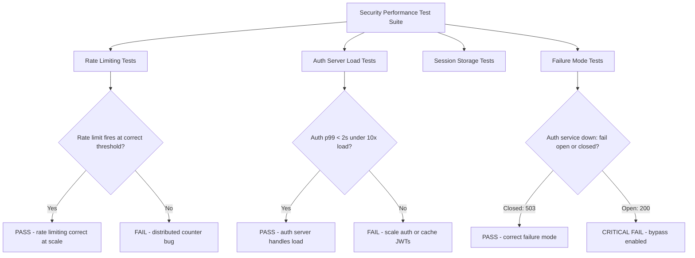

⚡ TL;DR - Security control performance testing validates that
security mechanisms hold under load: rate limiting fires at the right
threshold (not too early, not too late), auth servers handle concurrent
authentication bursts without falling over, session storage performs
under peak concurrency, and DDoS mitigations behave correctly. This
is distinct from standard load testing - the focus is not "does the
app handle load?" but "do the security controls work correctly under
load?" Rate limiting that works at 10 RPS might leak at 10,000 RPS.
Auth servers that handle 100 concurrent logins might time out at 10,000,
causing fail-open if not configured correctly.

---

| #079 | Category: Security | Difficulty: ★★★ |
|:---|:---|:---|
| **Depends on:** | OWASP Top 10, Authentication, IAM, Secrets Management, SAST, Security Logging, Security Testing in CI/CD, Pentest Methodology | |
| **Used by:** | Security at Scale, DevSecOps Pipeline Design, Security Metrics + FAIR, SSDLC | |
| **Related:** | Authentication, IAM, Secrets Management, Security Logging, Security Testing in CI/CD, Security at Scale, Security Metrics | |

---

### 🔥 The Problem This Solves

**SECURITY CONTROLS THAT FAIL UNDER LOAD:**

```
COMMON SECURITY FAILURES UNDER LOAD:

  1. RATE LIMITING BYPASS AT SCALE
  
  Problem:
    Rate limiting implemented in application code (in-memory counter).
    Works perfectly in development (single instance).
    Production: 10 instances behind a load balancer.
    Each instance has its own counter. 
    Rate limit: 100 req/minute per IP.
    
    Actual effective rate limit with 10 instances:
    Load balancer distributes requests evenly.
    → Each instance sees 10 req/minute from the attacker.
    → Each instance allows it (under 100 limit).
    → Effective rate limit: 100 req/min × 10 instances = 1000 req/min.
    → Attacker can make 10x more requests than the policy allows.
    
    Bypass: IP rate limiting in-memory → ineffective with multiple instances.
    Fix: centralized rate limiting (Redis, AWS WAF, Kong, Envoy).
  
  2. AUTH SERVER FAILURE UNDER LOAD
  
  Problem:
    Auth server (Keycloak, Auth0, custom JWT issuer) handles 50 req/sec normally.
    Product launch: traffic spikes 100x. Auth server overwhelmed.
    
    Scenario A (fail-open): auth service timeout →
      application catches exception → logs "auth service unavailable" →
      returns 500 or (worse) GRANTS ACCESS by default.
      Security control failed OPEN. Users gain access without authentication.
    
    Scenario B (fail-closed): auth service timeout →
      application returns 503 Service Unavailable.
      100% of users blocked during auth outage.
      Availability impact: real. But security is maintained.
    
    Correct design: fail CLOSED (maintain security at cost of availability).
    Scale the auth server to handle expected peak load.
    Implement auth server circuit breaker that fails closed.
  
  3. SESSION STORAGE PERFORMANCE
  
  Problem:
    Sessions stored in Redis. Redis cluster with 3 nodes.
    Peak load: 50,000 concurrent sessions.
    Redis CPU at 90% → session reads timeout → 
    requests fail with 500 → users get logged out.
    
    At lower load: no session performance issues noticed.
    At scale: session store becomes a security-relevant bottleneck.
  
  4. JWT VERIFICATION AT SCALE
  
  Problem:
    JWTs verified with RS256 (RSA public key signature).
    RSA verification: CPU-intensive (asymmetric cryptography).
    At 10,000 req/sec: JWT verification consumes 30% CPU.
    At 50,000 req/sec: JWT verification saturates CPU, latency spikes.
    
    Trade-off: HMAC-SHA256 (symmetric key) is 10x faster than RSA.
    But: symmetric key must be shared with all services.
    RSA: private key signs (auth server only), public key verifies (all services).
    
    Resolution: cache JWT verification results (if sub-second TTL acceptable).
    Or: use ECDSA (ES256) - same security as RSA-2048, 10x faster.
    (ES256 = Elliptic Curve, much faster verification than RSA)
```

---

### 📘 Textbook Definition

**Security control performance testing:** Load and stress testing
specifically focused on validating that security controls function
correctly under high traffic, concurrent requests, and degraded
conditions. Tests include: rate limiting accuracy at scale, authentication
server capacity, session management performance, cryptographic operation
throughput, and security failure modes (fail-open vs. fail-closed).

**Fail-open:** When a security control fails, it grants access by default.
Prioritizes availability over security. Incorrect default for
authentication/authorization systems (though may be acceptable for some
non-critical controls like content filtering under brief outages).

**Fail-closed:** When a security control fails, it denies access.
Prioritizes security over availability. Correct default for all
authentication and authorization systems.

**Rate limiting accuracy:** Under load, does the rate limiter enforce
the configured threshold exactly? Distributed systems may over-allow
(counters split across instances) or under-allow (global lock contention).

**Token bucket / sliding window:** Common rate limiting algorithms.
Token bucket: smooth request handling with burst allowance.
Sliding window: precise count in a rolling time window, no burst.
Fixed window: simple but allows 2x burst at window boundary.

---

### ⏱️ Understand It in 30 Seconds

**One line:**
Security control performance testing asks: "Do the rate limiter,
auth server, and session store actually enforce their security
policies when 10,000 concurrent users hit the system?"

**One analogy:**
> Testing that a bouncer works correctly is different from testing
> that the bouncer works correctly on New Year's Eve at 11:59 PM.
>
> Under normal conditions: the bouncer checks IDs, verifies the
> guest list, and denies entry to non-members.
>
> Under load (New Year's Eve): 500 people try to enter at once.
> The bouncer gets overwhelmed → starts waving people through without
> checking IDs (fail-open) → or → bouncer calls for backup and nobody
> gets in for 10 minutes (fail-closed).
>
> Security performance testing discovers which scenario happens BEFORE
> it affects real customers.
>
> Rate limiting: "Does the bouncer still check the maximum 100 visitors/hour
> rule when 1000 are in the queue?"
> Auth server load: "Can the ID scanner handle 500 scans/minute?"
> Session storage: "Can the VIP list database handle 10,000 simultaneous lookups?"

---

### 🔩 First Principles Explanation

**Security performance testing scenarios:**

```
SCENARIO 1: RATE LIMITING VALIDATION UNDER LOAD

  Correct rate limiting implementation:
  
    Distributed (Redis-backed):
    
    @Bean
    public RateLimiter rateLimiter(RedisTemplate<String, Integer> redis) {
        // Token bucket backed by Redis
        // Key: "rate_limit:{clientIp}"
        // Works correctly across ALL instances
        return new RedisRateLimiter(redis,
            replenishRate: 100,   // 100 req/sec refill rate
            burstCapacity: 200    // allows 200 burst
        );
    }
    
    Test: k6 or Gatling generating 1000 concurrent requests/sec
    from 10 virtual IPs.
    Each IP should be rate limited to 100 req/sec.
    
    Expected: requests over 100/sec for any IP return 429.
    Failure: requests over 100/sec return 200 (rate limit bypassed).

  k6 rate limit test:
  
    import http from 'k6/http';
    import { check, sleep } from 'k6';
    
    export const options = {
      scenarios: {
        rate_limit_test: {
          executor: 'constant-arrival-rate',
          rate: 200,        // 200 requests/sec total
          timeUnit: '1s',
          duration: '30s',
          preAllocatedVUs: 50,
        },
      },
    };
    
    export default function () {
      const resp = http.get('https://api.example.com/resource', {
        headers: { 'X-Forwarded-For': '10.0.0.1' }  // Single source IP
      });
      
      // After reaching rate limit, expect 429
      check(resp, {
        'rate limited after threshold': (r) =>
          r.status === 200 || r.status === 429,
        'no 500s': (r) => r.status !== 500,
      });
    }
    
    // Validate: count 200s and 429s.
    // If rate limit = 100 req/sec and test sends 200/sec,
    // approximately 100 should be 200, approximately 100 should be 429.
    // Any 200s beyond the configured limit = rate limit failure.

SCENARIO 2: AUTH SERVER CAPACITY TEST

  Test: simulate concurrent authentication (login/token issuance).
  
  Gatling scenario (Scala DSL):
  
    class AuthLoadTest extends Simulation {
      val httpProtocol = http.baseUrl("https://auth.example.com")
    
      val loginScenario = scenario("Login Load Test")
        .exec(
          http("Login")
            .post("/oauth/token")
            .formParam("grant_type", "password")
            .formParam("username", "testuser@example.com")
            .formParam("password", "test-password")
            .formParam("client_id", "test-client")
            .check(status.is(200))
            .check(jsonPath("$.access_token").exists)
        )
    
      setUp(
        loginScenario.inject(
          rampUsers(1000).during(60.seconds)  // Ramp to 1000 concurrent users
        )
      ).assertions(
        global.successfulRequests.percent.gt(99),  // 99% success required
        global.responseTime.percentile3.lt(500)    // 99th %ile < 500ms
      )
    }
  
  If auth server fails: what happens?
    Test circuit breaker behavior:
      Shut down auth server while load test runs.
      Verify: application returns 503 (fail-closed), NOT 200.
      If 200 returned with no auth check: CRITICAL security failure.

SCENARIO 3: SESSION STORAGE PERFORMANCE

  Redis session performance test:
  
  redis-benchmark -h redis.example.com -n 100000 -c 50 -q
  SET: ~100,000 ops/sec  (write session)
  GET: ~120,000 ops/sec  (read session)
  
  Application load test with concurrent sessions:
  
    50,000 concurrent users, each with an active session.
    Monitor: Redis CPU, memory, command latency (redis-cli info stats).
    Target: p99 session lookup < 2ms.
    Warning: Redis memory usage > 80% (eviction risk).
    
    redis-cli --latency-history -h redis.example.com
    // Measure real-time latency percentiles
```

---

### 🧪 Thought Experiment

**SCENARIO: Auth server rate limit + circuit breaker under DDoS:**

```
SCENARIO: Credential stuffing attack - 10,000 login attempts/minute
from distributed IP addresses (200 IPs × 50 attempts each).

SYSTEM UNDER TEST:
  - API Gateway (AWS API Gateway with WAF)
  - Auth service (Keycloak) - 2 instances, 4 vCPU each
  - Rate limiting: 10 attempts/min per IP (in AWS WAF)
  - Redis: session storage

EXPECTED BEHAVIOR:
  - WAF rate limit: 10 attempts/min per IP.
    200 IPs × 10 attempts/min = 2,000 attempts reach auth service.
    Remaining 8,000 blocked at WAF (429 response).
  
  - Auth service: receives 2,000 attempts/min (~33/sec).
    At capacity: Keycloak handles ~200 concurrent auth operations.
    33/sec should be manageable.
  
  - Redis lockout: after 5 failed attempts, account locked for 10 minutes.
    Keycloak lockout policy: 5 attempts → lock.

WHAT ACTUALLY HAPPENS (without performance testing):
  
  Bug found: Rate limiting is per IP at API Gateway level.
  But auth service has NO IP rate limiting at the service layer.
  
  Attacker bypasses WAF: direct requests to load balancer IP.
  (WAF not enforced at LB level - only at CloudFront.)
  
  Result: 10,000 attempts/minute hit auth service directly.
  Keycloak: 167 attempts/sec → CPU at 100% → response time 10+ seconds
  → connection pool exhausted → legitimate user logins fail.
  
  Auth service BECOMES a DDoS target via credential stuffing.

SECURITY PERFORMANCE TEST REVEALS:
  1. WAF bypass: direct LB access not WAF-protected
  2. Auth service rate limiting: no protection at service level
  3. Auth service scaling: not auto-scaling under auth flood

FIXES:
  1. Apply WAF to load balancer, not just CloudFront.
  2. Add rate limiting at auth service (Keycloak: bruteforce detection).
  3. Add auto-scaling for Keycloak (or Auth0 - managed service handles scale).
  4. Circuit breaker on auth service: if >80% CPU → return 503 immediately
     (fail-closed) rather than letting queue grow and eventually time out.
```

---

### 🧠 Mental Model / Analogy

> Security control performance testing is like testing whether
> a bank vault's security mechanisms work during a bank rush.
>
> Normal day: 50 customers. Teller checks ID carefully. ATM validates PIN.
> Surveillance system records transactions. Door lock works.
>
> Bank run (high load): 5,000 customers trying to withdraw at once.
> Under pressure:
> - Does the teller still check IDs? (auth under load)
> - Does the ATM still enforce the 3-try limit? (rate limiting under load)
> - Does the surveillance system record everything? (logging under load)
> - Does the vault door still close properly? (critical control under load)
>
> If the teller stops checking IDs when overloaded: serious security failure.
> If the ATM stops enforcing PIN attempt limits: brute-force enabled.
>
> Security performance testing: simulate the bank rush,
> verify that all security mechanisms still function correctly.
> Discover the failures before a real crisis reveals them.

---

### 📶 Gradual Depth - Five Levels

**Level 1 - What it is (anyone can understand):**
Security control performance testing checks whether security features (rate limiting, login protection, session management) still work correctly when thousands of users hit the system at the same time. Some security features that work for 100 users break or become ineffective at 10,000 users.

**Level 2 - How to use it (junior developer):**
Use k6 or Gatling to simulate realistic concurrent load. Test: rate limiting (send 200 req/sec from one IP where limit is 100 - verify 429s appear), auth server capacity (ramp to 1000 concurrent logins - verify success rate and response time), session storage (50,000 concurrent sessions in Redis - verify < 2ms lookup). Configure fail-closed behavior for auth services: if auth server times out, return 503 (not 200).

**Level 3 - How it works (mid-level engineer):**
Core security performance scenarios: distributed rate limiting (must be Redis-backed to work across instances, not in-memory), auth server capacity (Keycloak/Auth0 scaling, circuit breaker for auth service), session store performance (Redis cluster sizing for concurrent sessions), JWT verification throughput (RSA vs ECDSA vs HMAC performance trade-offs), WAF effectiveness under DDoS (does WAF block at sufficient scale? does it introduce latency?). Test both correctness under load (does security control enforce its policy?) AND failure behavior (does it fail closed or open?).

**Level 4 - Why it was designed this way (senior/staff):**
Security controls are often implemented for nominal-load scenarios. Distributed systems introduce races and coordination failures that only appear under scale. Rate limiting with in-memory counters: correct at 1 instance, silent bypass at 10 instances. Auth servers: linear CPU scaling with asymmetric crypto (RSA) means auth servers become CPU-bound much faster than web servers. Session storage: random access patterns under high concurrency can create hot spots in Redis (if all sessions key on same hash slot). The fail-open vs fail-closed problem: developers naturally code the happy path (auth succeeds), exception handling is often incomplete. Under load, exceptions become common and incorrect exception handling can become a security vulnerability.

**Level 5 - Mastery (distinguished engineer):**
Advanced security performance design: token pre-computation (issue JWTs at login, cache at auth server, trade off freshness for throughput). Rate limiting algorithms at scale: Redis sorted set sliding window (high precision, high Redis CPU), Redis counter fixed window (lower precision, lower CPU), approximate algorithms (Redis-based leaky bucket with atomic operations). Auth service sharding: separate auth services for different client tiers (premium customers on dedicated auth, third-party on shared). Cryptographic algorithm selection for scale: ECDH key exchange is significantly faster than RSA, ECDSA faster than RSA signing. For TLS handshake performance under load: session resumption (TLS session tickets) vs full handshake. Security observability under load: ensure logging systems (ECS, Kafka pipeline) don't become bottlenecks that cause log loss under high request rates - lost security logs = compliance violation and blind spots.

---

### ⚙️ How It Works (Mechanism)

```
SECURITY CONTROL PERFORMANCE TEST MATRIX:

  Control             | Test Type        | Pass Criteria
  ────────────────────┼──────────────────┼─────────────────────────────
  Rate limiting       | Load: 2x limit   | 429 fires at threshold (±5%)
  Auth server         | Load: 10x normal | p99 latency < 2s, 99% success
  Session storage     | Concurrency: 50K | p99 lookup < 5ms, no evictions
  JWT verification    | Throughput: 10K/s| CPU < 70%, no 5xx
  WAF rules           | Pentest replay   | Attacks blocked, legit allowed
  Circuit breaker     | Dependency fail  | Fail closed (503, not 200)
  Encryption at rest  | Key rotation     | No plaintext exposed during rotation
```



---

### 💻 Code Example

**Rate limiting validation test with k6:**

```javascript
// security-rate-limit-test.js - k6 load test
// Tests: rate limiter fires at correct threshold under distributed load
import http from 'k6/http';
import { check, sleep } from 'k6';
import { Counter, Rate } from 'k6/metrics';

// Custom metrics to track security control behavior:
const rateLimitedRequests = new Counter('rate_limited_requests');
const unexpectedSuccess = new Counter('unexpected_success_over_limit');

export const options = {
  scenarios: {
    // Simulate: 1 IP sending 200 req/sec when limit is 100 req/sec
    single_ip_flood: {
      executor: 'constant-arrival-rate',
      rate: 200,            // 200 req/sec total
      timeUnit: '1s',
      duration: '30s',
      preAllocatedVUs: 100,
    },
  },
  // Security test thresholds:
  thresholds: {
    // At least 40% should be rate limited (200 - 100 limit = 50%)
    'rate_limited_requests': ['count > 200'],
    // Zero unexpected successes (no bypass over limit)
    'unexpected_success_over_limit': ['count == 0'],
    // No 5xx responses (security control should never 500)
    'http_req_failed': ['rate < 0.01'],
  },
};

// Counter to track requests per second (approximate):
let requestCount = 0;
let windowStart = Date.now();

export default function () {
  // All requests appear to come from one source IP:
  const resp = http.get('https://api.example.com/api/v1/resource', {
    headers: {
      'X-Forwarded-For': '203.0.113.1',  // RFC 5737 test IP
      'Authorization': `Bearer ${__ENV.TEST_TOKEN}`,
    },
  });
  
  const now = Date.now();
  // Reset window counter every second:
  if (now - windowStart > 1000) {
    requestCount = 0;
    windowStart = now;
  }
  requestCount++;
  
  if (resp.status === 429) {
    rateLimitedRequests.add(1);
    
    // Verify: retry-after header present (good rate limiter practice)
    check(resp, {
      'retry-after header present': (r) =>
        r.headers['Retry-After'] !== undefined,
    });
  } else if (resp.status === 200) {
    // Track if we're getting 200s over the rate limit threshold:
    if (requestCount > 100) {
      // More than 100 requests this second from this IP = bypass!
      unexpectedSuccess.add(1);
    }
  }
  
  check(resp, {
    'no 500 errors': (r) => r.status !== 500,
    'no 503 errors': (r) => r.status !== 503,
    'valid response status': (r) =>
      r.status === 200 || r.status === 429,
  });
}
```

**Spring Boot circuit breaker for auth service (fail-closed):**

```java
// AuthenticationService.java
@Service
public class AuthenticationService {
    
    // Circuit breaker: fail CLOSED (deny access when auth is down)
    @CircuitBreaker(
        name = "authService",
        fallbackMethod = "authServiceUnavailable"
    )
    @TimeLimiter(name = "authService")
    public CompletableFuture<AuthResult> validateToken(String token) {
        return CompletableFuture.supplyAsync(() ->
            tokenValidationClient.validate(token)
        );
    }
    
    // CRITICAL: fallback must DENY, not GRANT access
    // BAD fallback (fail-open):
    // public CompletableFuture<AuthResult> authServiceUnavailable(
    //         String token, Exception ex) {
    //     // NEVER DO THIS: granting access when auth is down
    //     return CompletableFuture.completedFuture(AuthResult.ALLOWED);
    // }
    
    // GOOD fallback (fail-closed):
    public CompletableFuture<AuthResult> authServiceUnavailable(
            String token, Exception ex) {
        // Log: auth service unavailable (for monitoring)
        log.error("Auth service unavailable - denying request",
            Map.of("error", ex.getMessage(),
                   "circuit_state", "OPEN"));
        // Metrics: increment auth_service_unavailable counter
        meterRegistry.counter("auth.service.unavailable").increment();
        // Return 503 Service Unavailable (fail-closed)
        throw new ServiceUnavailableException(
            "Authentication service temporarily unavailable. " +
            "Please retry in a moment."
        );
    }
}

// application.yml - resilience4j configuration:
// resilience4j:
//   circuitbreaker:
//     instances:
//       authService:
//         slidingWindowSize: 10
//         failureRateThreshold: 50   # 50% failures → circuit open
//         waitDurationInOpenState: 30s
//         permittedNumberOfCallsInHalfOpenState: 3
//   timelimiter:
//     instances:
//       authService:
//         timeoutDuration: 2s  # Auth must respond in 2 seconds
```

---

### ⚖️ Comparison Table

| Scenario | Risk Without Testing | Test Method | Pass Criteria |
|:---|:---|:---|:---|
| **Rate limiting** | Silent bypass at scale (distributed counters) | k6 flood test at 2x limit | 429 fires at threshold ± 5% |
| **Auth server capacity** | Fail-open under DDoS | Gatling ramp to 10x load | p99 < 2s, 99% success |
| **Session store** | Performance degradation = session errors | k6 concurrent session load | p99 < 5ms |
| **JWT verification** | CPU saturation at scale | Throughput test at 10K req/s | CPU < 70% |
| **Circuit breaker** | Fail-open when dependency is down | Dependency kill test | Returns 503, never 200 |

---

### ⚠️ Common Misconceptions

| Misconception | Reality |
|:---|:---|
| "If the app passes load tests, the security controls will too." | Standard load tests measure application FUNCTIONALITY under load: response times, error rates, throughput. They typically do not specifically validate that SECURITY CONTROLS (rate limiting, auth, session management) enforce their policies correctly under load. A load test that sends 500 req/sec from the same user in the test harness may not even trigger rate limiting if the test uses different IPs. Security control performance tests are specifically designed to test security policy enforcement at the boundaries of configured thresholds. |
| "Rate limiting at the application layer is sufficient." | Application-layer rate limiting (in-memory or Redis) can be bypassed if the load balancer or CDN is not also protected. Direct requests to the origin server (bypassing CDN/WAF) may not go through the rate limiter. For meaningful protection: rate limiting at multiple layers (CDN/WAF layer for internet traffic, application layer as secondary defense). Single-layer rate limiting has a bypass vector. Defense-in-depth applies to rate limiting. |

---

### 🚨 Failure Modes & Diagnosis

**Security control performance failure diagnosis:**

```
PROBLEM 1: Rate limiting not firing at expected threshold
  
  Symptom: k6 test sends 200 req/sec from one IP where limit is 100/sec.
  Expected: ~100 x 429 responses per second.
  Actual: 0 x 429 responses. All 200 OK.
  
  Diagnosis:
    Option A: In-memory counter (not Redis). Application has 10 instances.
    Each sees 20 req/sec (load balanced). None trigger the 100/sec limit.
    Fix: Implement Redis-backed distributed rate limiter.
    
    Option B: Rate limiting keyed on wrong IP.
    X-Forwarded-For header not trusted. Rate limit keyed on load balancer IP.
    All requests appear as same IP → blocked instantly (or wrong limit).
    Fix: Extract real client IP from X-Forwarded-For (trusted headers only).
    
    Option C: Rate limiter not in the request path.
    WAF rule misconfigured, rate limit only applied to /api/v1/auth* 
    but not to /api/v1/resource (the test endpoint).
    Fix: Verify rate limiter applies to all intended paths.
  
  Tool:
    redis-cli KEYS "rate_limit:*"
    → Verify keys exist during load test (proves Redis counter is being used)
    redis-cli GET "rate_limit:203.0.113.1"
    → Should increment during flood test

PROBLEM 2: Auth service returns 200 when circuit breaker is open
  
  Symptom: Kill auth service during load test.
  Expected: application returns 503 Service Unavailable.
  Actual: application returns 200 OK with no auth check.
  
  Diagnosis:
    Exception handling in auth filter is too broad:
      try {
          validateToken(token);
      } catch (Exception e) {
          // BUG: catching too broadly, allowing request through
          log.warn("Auth check skipped: " + e.getMessage());
          // No throw - request falls through
      }
    Fix: Remove try-catch or re-throw as SecurityException.
    Circuit breaker fallback: must throw, not return ALLOWED.
  
  Test: chaos engineering (kill auth service during staging load test).
  Verify: 100% of requests return 503 when auth service is down.

PROBLEM 3: Redis session store degradation causes session errors
  
  Symptom: Users report intermittent session invalidation errors.
  Happens only during peak traffic hours.
  
  Diagnosis:
    redis-cli --latency-history -h redis.example.com
    → Latency spikes to 50ms+ during peak hours (normal: < 1ms)
    
    redis-cli info memory
    used_memory_rss_human:3.5G
    maxmemory:4G
    → Memory at 87%: Redis near maxmemory, starting to evict sessions
    
    Eviction policy: allkeys-lru (evicts least recently used keys)
    → Active sessions being evicted → users logged out
    
    Fix:
      Increase Redis memory allocation.
      Or: separate session Redis from cache Redis.
      Or: reduce session TTL (shorter sessions = fewer concurrent sessions in memory).
      Set eviction policy: noeviction for session store (fail the write instead).
      Monitor: redis_evicted_keys counter in Prometheus.
```

---

### 🔗 Related Keywords

**Prerequisites:**
- `Authentication` - auth server to test
- `Session Management` - session storage to test
- `Secrets Management` - key rotation without downtime

**Builds on this:**
- `Security at Scale` - design for high-scale security
- `DevSecOps Pipeline Design` - where security performance tests fit
- `Security Metrics + FAIR` - measuring security control effectiveness

---

### 📌 Quick Reference Card

```
┌──────────────────────────────────────────────────────────┐
│ RATE LIMITING│ Must be Redis-backed (not in-memory)      │
│ ACROSS NODES │ In-memory = bypass at 2+ instances        │
├──────────────┼───────────────────────────────────────────┤
│ AUTH FAILURE │ ALWAYS fail-closed (503, never 200)       │
│ MODE         │ Circuit breaker fallback must DENY         │
├──────────────┼───────────────────────────────────────────┤
│ SESSION      │ Monitor Redis memory (eviction = logout)  │
│ STORAGE      │ Target: p99 < 2ms, memory < 70%           │
├──────────────┼───────────────────────────────────────────┤
│ JWT PERF     │ ECDSA (ES256) >> RSA (RS256) for speed    │
│              │ Cache JWT verification for latency        │
├──────────────┼───────────────────────────────────────────┤
│ TOOLS        │ k6, Gatling for load generation           │
│              │ redis-cli --latency-history for Redis      │
└──────────────────────────────────────────────────────────┘
```

---

### 💎 Transferable Wisdom

**Reusable Engineering Principle:**
"Test at the failure boundary, not the nominal path."
Security controls that work perfectly at 10 req/sec may silently fail at 10,000 req/sec.
This pattern repeats across engineering:
- Database indexes that work for 1M rows may become non-linear at 100M rows.
- Locks that work for 10 concurrent users may cause deadlock at 1000.
- Memory limits that are fine for 100MB allocations may cause OOM at 1GB.
- Rate limiting with in-memory counters that works for 1 instance breaks at 10.
The engineering practice: always identify the "breaking boundary" for each mechanism.
For security controls: the breaking boundary is the scale at which the security
policy is no longer accurately enforced. Finding that boundary (in testing)
rather than in production is the goal.
The testing discipline: boundary tests are more valuable than nominal tests.
"Does the system work at 100 req/sec?" tells you little about production behavior.
"What happens at 50% beyond the designed limit?" tells you the failure mode.
"What happens when the auth service is 3 seconds slow?" reveals the circuit breaker behavior.
Security engineering specifically: the attacker specifically targets the boundaries.
Credential stuffing is a rate limit boundary test run by an adversary.
DDoS is a capacity boundary test run by an adversary.
If you don't know your boundaries in advance, the attacker discovers them first.
Know your breaking points before your adversaries do.

---

### 💡 The Surprising Truth

Rate limiting is one of the most commonly broken security controls -
not because it's difficult to implement, but because it's almost always
implemented incorrectly in distributed systems.

A rate limiter that works correctly for one instance fails silently when
scaled to multiple instances. The failure mode is invisible in development
(single instance). The failure mode is invisible in staging (usually 1-2 instances).
It only manifests in production under scale - which is exactly when
an attacker is most likely to be credential-stuffing or scraping.

Real-world consequence: company implements login rate limiting (10 attempts/minute).
Security team manually tested it in staging - worked correctly.
Deployed to production (8 instances). Credential stuffing attack six months later:
attacker uses 80,000 credentials/minute distributed across all 8 instances.
Each instance sees 10,000 credentials/minute / 8 = 1,250 attacks/minute per instance.
Rate limit: 10 attempts/min per IP. Attacker distributes across 1,250 IPs.
Each instance sees ~1 attempt per IP per minute - well under the limit.
Result: 100% of credential stuffing attempts bypass rate limiting entirely.

The fix was already known: Redis-backed distributed rate limit.
But it was never tested under distributed production scale.
The secure implementation existed. The security performance test did not.

The lesson: security control correctness testing at scale is not optional.
In-memory rate limiting is a single-instance pattern, not a production pattern.

---

### ✅ Mastery Checklist

**You've mastered this when you can:**
1. **IDENTIFY** the security control performance failure modes: distributed rate
   limiting counter bypass, fail-open auth circuit breaker, session eviction
   under memory pressure, JWT CPU saturation.
2. **DESIGN** a security control performance test suite: k6 rate limit boundary
   test, Gatling auth load test with circuit breaker validation, Redis session
   concurrency test.
3. **IMPLEMENT** distributed rate limiting (Redis-backed, not in-memory) and
   fail-closed circuit breakers for auth services.
4. **DIAGNOSE** security control failures under load using Redis CLI, circuit
   breaker state metrics, and application error rate dashboards.

---

### 🎯 Interview Deep-Dive

**Q: How do you test that security controls work correctly at scale?
What are common failures you look for?**

*Why they ask:* Tests knowledge of security engineering beyond just
"implement the control." Shows depth in distributed systems security.

*Strong answer covers:*
- Rate limiting: in-memory counters fail silently at multiple instances.
  Load balanced across 10 nodes: each node allows 100 req/sec → effective
  rate limit is 1000/sec. Fix: Redis-backed distributed counter.
  Test: k6 flood at 2x configured limit from one IP → verify 429s appear.
- Auth server capacity: must scale to handle peak concurrent authentication.
  Key failure mode: fail-open. If auth service times out and exception handler
  allows the request through → security bypass. Always fail-closed.
  Circuit breaker fallback must throw/return 503, never return "allowed."
  Test: kill auth service during load test, verify 100% of requests get 503.
- Session storage: Redis memory pressure causes eviction (allkeys-lru) →
  active sessions evicted → users logged out. Monitor redis_evicted_keys.
  Test: 50K concurrent sessions, verify session lookup latency stays < 5ms.
- JWT performance: RSA-2048 (RS256) CPU-intensive. At 50K req/sec, JWT
  verification can saturate CPU. Use ECDSA (ES256) for same security at 10x speed.
  Or cache JWT verification results at the service mesh layer.
- Tooling: k6 (JavaScript, scripted load generation), Gatling (Scala, good reporting).
  chaos-monkey / failure injection for circuit breaker testing.
- The meta-principle: test at the boundary (2x, 10x limit), not just nominal.
  Find breaking points before adversaries discover them in production.