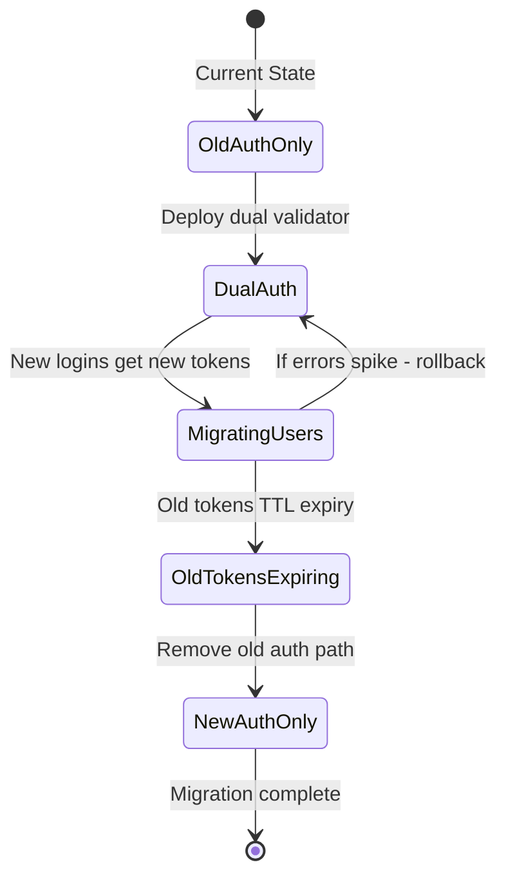

⚡ TL;DR - Migrating authentication systems (session-based to JWT,
OAuth 1.0 to OAuth 2.0, custom auth to OIDC, or upgrading JWT algorithms)
requires zero-downtime strategies: parallel auth support during transition
(accept both old and new tokens simultaneously), gradual migration per
user cohort, and a robust rollback plan. The hard problems: not breaking
existing sessions mid-flight, password hash algorithm upgrades (bcrypt
cost factor upgrade, MD5→bcrypt), token format changes, and testing that
no user is locked out during the migration. Risk: a failed auth migration
locks out all users simultaneously.

---

| #080 | Category: Security | Difficulty: ★★★ |
|:---|:---|:---|
| **Depends on:** | OWASP Top 10, Authentication, Session Management, Secrets Management, IAM, SAST, TLS Configuration, OAuth 2.0 Security, Security Testing in CI/CD | |
| **Used by:** | OAuth Implicit Flow Deprecation, DevSecOps Pipeline Design, SSDLC, OAuth + OIDC Specification Design | |
| **Related:** | Authentication, Session Management, Secrets Management, IAM, TLS Configuration, OAuth 2.0 Security, Security Testing in CI/CD | |

---

### 🔥 The Problem This Solves

**AUTH MIGRATION IS HIGH-RISK BY NATURE:**

```
WHY AUTH MIGRATIONS ARE DIFFERENT FROM NORMAL MIGRATIONS:

  In a database migration:
    Failure: some records are incorrect or missing.
    Impact: subset of users see data issues.
    Recovery: rollback migration, fix data.
  
  In a feature flag rollout:
    Failure: feature is broken for some users.
    Impact: bad UX for some users.
    Recovery: toggle feature flag off.
  
  In an AUTH migration:
    Failure: authentication stops working.
    Impact: ALL users are locked out of the application.
    Recovery: non-trivial (auth is the key to everything else).
    Severity: ALL users cannot log in. 
    This is the worst possible failure mode.
  
  Real examples of auth migration failures:
    - Password hash algorithm migration (MD5→bcrypt):
      If migration code has a bug, existing users cannot log in.
      All existing hashes may be overwritten with new format but
      incorrectly, invalidating all passwords.
    - JWT library upgrade (e.g., jjwt 0.9→1.0, breaking API change):
      Old tokens issued with deprecated signing method.
      New validation code rejects all old tokens.
      All logged-in users immediately logged out.
      All "remember me" sessions invalidated.
    - OIDC migration with new client_id:
      Old callback URLs stop working.
      Users in the middle of OAuth flow get errors.
      No redirect_uri matches → auth fails.
    - Session secret key rotation (without dual-key support):
      Old sessions signed with old key.
      New code validates with only new key.
      All existing sessions immediately invalidated.
      Mass logout event.
  
AUTH MIGRATION RISK CATEGORIES:

  Category 1: Token Format Changes
    Old: opaque session tokens (stored in DB)
    New: JWT (stateless, signed)
    Risk: users with old session tokens cannot be validated with new code
  
  Category 2: Password Hash Algorithm Changes
    Old: MD5, SHA1, bcrypt cost=10
    New: bcrypt cost=12, Argon2id
    Risk: migration fails → existing passwords unverifiable
  
  Category 3: Protocol Changes
    Old: OAuth 1.0 (HMAC-signed requests)
    New: OAuth 2.0 + OIDC
    Risk: third-party integrations using old tokens break immediately
  
  Category 4: Identity Provider Changes
    Old: custom auth server
    New: Keycloak, Auth0, Okta
    Risk: user identities (sub claim) change, breaking all linked records
  
  Category 5: JWT Algorithm Changes
    Old: HS256 (HMAC with shared secret)
    New: RS256 (RSA with key pair) or ES256 (ECDSA)
    Risk: tokens signed with old algorithm rejected by new validator
```

---

### 📘 Textbook Definition

**Authentication mechanism migration:** The process of changing the
authentication system of a live application from one implementation
to another (e.g., session-based to JWT, custom auth to OIDC, JWT
algorithm upgrade) without disrupting active users or causing
authentication failures. Requires parallel operation, gradual migration,
and careful rollback design.

**Dual authentication support:** Running both the old and new
authentication mechanisms simultaneously during the migration period.
The system accepts both old-format tokens/sessions AND new-format tokens
until all users have migrated to the new mechanism.

**Progressive migration:** Moving users to the new authentication system
in cohorts (by user segment, user ID range, or on next login) rather
than all at once. Limits blast radius of any migration failure.

**Password re-hashing:** Upgrading the password hash algorithm by:
(a) rehashing stored passwords offline (requires plaintext passwords,
not possible without user interaction), or (b) rehashing on next login
(compare against old hash, if valid, store new hash - progressive upgrade
without requiring all users to reset passwords).

**Token grace period:** Accepting old-format tokens for a defined period
after the new format is deployed. Old tokens expire naturally via their
TTL; no forced invalidation required.

---

### ⏱️ Understand It in 30 Seconds

**One line:**
Migrating authentication systems safely requires running old and new
auth simultaneously - old tokens remain valid during the transition period,
new tokens are issued to users as they log in, until all old tokens expire.

**One analogy:**
> Migrating authentication is like changing a hotel's room key system
> from physical keys to electronic keycards - while guests are in their rooms.
>
> You cannot: announce "all keys are invalid at midnight" (mass lockout).
> You cannot: hand out new keycards from a separate front desk while
> the old front desk still gives out physical keys (split service, confusing).
>
> Correct approach:
> 1. Install new electronic locks that ALSO accept old keys (dual support).
> 2. Issue electronic keycards to guests as they visit the front desk (next login).
> 3. Old keys continue to work while guests are in their rooms (grace period).
> 4. When all old keys have expired (checked out, or keys TTL), remove old locks.
>
> Rollback: keep spare physical key sets in case electronic system fails.
> Test first: try the transition in two rooms before rolling out to 500 rooms.

---

### 🔩 First Principles Explanation

**Core strategies for each migration type:**

```
STRATEGY 1: SESSION-BASED TO JWT MIGRATION

  Problem: Existing users have session tokens stored in their browsers.
  Sessions are validated against the session store (Redis/DB).
  We want to move to stateless JWT (no session store lookups).
  
  WRONG approach (big bang):
    Deploy: new code only validates JWTs. Old session tokens rejected.
    Impact: All logged-in users immediately logged out.
    All "remember me" sessions (30-day tokens) invalidated.
    Monday morning: 100% of users see login screen.
  
  CORRECT approach (parallel dual validation):
  
    Phase 1: Deploy dual validation middleware.
    
    // AuthMiddleware - accepts BOTH session tokens AND JWTs
    public Authentication authenticate(HttpRequest request) {
        String token = extractToken(request);
        
        if (token.startsWith("Bearer ")) {
            // New: JWT path
            String jwt = token.substring(7);
            return jwtValidator.validate(jwt);
        } else {
            // Old: session token path (legacy)
            return sessionStore.get(token);
        }
    }
    
    At this point: existing sessions continue to work.
    New logins: issue JWTs.
    Old sessions: continue to be valid until their natural expiration.
    
    Phase 2: New logins issue JWTs only.
    Old sessions: still validated (dual support).
    
    Phase 3: Monitor - what % of requests use session vs JWT tokens?
    (Log token_type: "session" vs "jwt" in auth middleware)
    When session token traffic < 1%: safe to remove session validation.
    
    Phase 4: Remove session token validation.
    Phase 5: Decommission session store (Redis).

STRATEGY 2: PASSWORD HASH ALGORITHM UPGRADE (bcrypt cost=10 → cost=12)

  Problem: Stored passwords use bcrypt cost=10 (too fast - Moore's Law).
  We want to upgrade to cost=12 (4x slower cracking time).
  Cannot rehash without knowing the plaintext (which we don't have).
  
  Progressive re-hashing on login:
  
    // On login attempt:
    public boolean authenticateUser(String email, String rawPassword) {
        User user = userRepository.findByEmail(email);
        
        // Check against current hash:
        if (passwordEncoder.matches(rawPassword, user.getPasswordHash())) {
            
            // Check if hash uses old cost factor:
            if (isLowCostHash(user.getPasswordHash())) {
                // Re-hash with new cost factor:
                String newHash = strongPasswordEncoder.encode(rawPassword);
                userRepository.updatePasswordHash(user.getId(), newHash);
                log.info("Password re-hashed to new cost factor",
                    Map.of("user_id", user.getId()));
            }
            return true;  // Login succeeds
        }
        return false;  // Wrong password
    }
    
    // isLowCostHash: bcrypt stores cost in hash prefix:
    // $2a$10$... (cost=10 = old, upgrade needed)
    // $2a$12$... (cost=12 = current)
    private boolean isLowCostHash(String hash) {
        return hash.startsWith("$2a$10$") || hash.startsWith("$2b$10$");
    }
    
    // Outcome:
    // Users who log in: hash upgraded on first login.
    // Users who never log in: hash stays at old cost (lower risk as they're inactive).
    // No user is locked out. No mass password reset needed.
    // Gradual migration: 80% of active users re-hashed within 30 days.

STRATEGY 3: JWT ALGORITHM MIGRATION (HS256 → RS256)

  Problem: JWTs signed with HMAC-SHA256 (shared secret between services).
  Security concern: shared secret means any service that validates can also FORGE.
  Migration: RS256 (RSA) - private key signs (auth server only), public key validates.
  
  Approach: Accept both HS256 and RS256 during transition.
  
    // JwtValidator - supports multiple algorithms:
    public Claims validateToken(String jwt) {
        // 1. Decode header to determine algorithm (without verification):
        String algorithm = getAlgorithmFromHeader(jwt);
        
        if ("RS256".equals(algorithm)) {
            // New: verify with RSA public key
            return Jwts.parserBuilder()
                .setSigningKey(rsaPublicKey)
                .build()
                .parseClaimsJws(jwt)
                .getBody();
        } else if ("HS256".equals(algorithm)) {
            // Old: verify with shared secret (legacy support)
            return Jwts.parserBuilder()
                .setSigningKey(hmacSecret.getBytes())
                .build()
                .parseClaimsJws(jwt)
                .getBody();
        }
        throw new InvalidTokenException("Unsupported algorithm: " + algorithm);
    }
    
    // Important: NEVER accept "alg: none" (JWT algorithm confusion attack).
    // Always validate the algorithm against an allowed list:
    private static final Set<String> ALLOWED_ALGORITHMS = Set.of("RS256", "HS256");
    // Remove "HS256" from ALLOWED_ALGORITHMS after migration completes.
    
    // Migration timeline:
    // Week 1: Deploy dual validator. Auth server still issues HS256.
    // Week 2: Auth server issues RS256. Dual validator active.
    // Week 3-6: HS256 tokens expire (TTL = 1h access, 30d refresh).
    //           Monitor: what % of tokens are still HS256?
    // Week 7: Disable HS256 support (remove from ALLOWED_ALGORITHMS).
    // Week 8: Delete shared HMAC secret.
```

---

### 🧪 Thought Experiment

**SCENARIO: Migrating from custom session auth to OIDC (Keycloak):**

```
CURRENT STATE:
  - Spring Boot app with custom session-based auth
  - Users stored in PostgreSQL (email, bcrypt hash, role)
  - Sessions in Redis (session_id → user_id, roles, expiry)
  - 50,000 active users. 3,000 concurrent sessions at peak.

TARGET STATE:
  - Keycloak as identity provider
  - OIDC for authentication (Spring Security OIDC client)
  - JWTs for API calls
  - Users migrated to Keycloak (with Keycloak user IDs)

KEY CHALLENGE: User identity migration.
  Current: user.id = UUID (internal database ID)
  New: user.sub = Keycloak user UUID (different value)
  
  If we link records by user.id and OIDC gives us user.sub:
  We cannot find the user's records after migration.

MIGRATION PLAN:

  Phase 1 (Month 1): Prepare (no user-visible changes)
    - Deploy Keycloak in production environment.
    - Create users in Keycloak: migrate username/email, no passwords.
    - Store keycloak_user_id alongside existing user.id:
        ALTER TABLE users ADD COLUMN keycloak_user_id VARCHAR(36);
    - Set keycloak_user_id for all existing users via admin API.
    - Test: Keycloak admin can log in. OIDC well-known endpoint works.

  Phase 2 (Month 2): Add OIDC alongside existing auth (dual auth)
    - Spring Security: configure BOTH form login AND OIDC login.
    - "Login with SSO" button appears alongside username/password form.
    - OIDC login: match sub (Keycloak user ID) to keycloak_user_id column.
    - Session creation: same session store, regardless of auth method.
    - Test: 10 volunteer users migrate to OIDC. Verify access.

  Phase 3 (Month 3): Password migration via progressive re-hash
    - On legacy login success: automatically attempt OIDC provisioning.
    - Or: email users to "Link your account to SSO" (user-driven).
    - Track: what % of users have used OIDC login at least once?
    - Goal before Phase 4: >90% of active users have OIDC linked.

  Phase 4 (Month 4): Remove legacy login (for new logins)
    - Deprecation notice: "Password login retiring [date]. Click here to migrate."
    - Users who haven't migrated: receive password reset email to set
      Keycloak password (triggers OIDC flow).
    - Keep legacy login for 30 more days (grace period).

  Phase 5 (Month 5): Remove legacy login code.
    - Remove Spring form login configuration.
    - Remove bcrypt hash columns (data minimization!).
    - Decommission password validation code paths.

ROLLBACK PLAN (critical to define before starting):
  Phase 1 rollback: drop keycloak_user_id column. No user impact.
  Phase 2 rollback: remove OIDC from Spring Security config. Form login remains.
  Phase 3 rollback: disable OIDC link prompts. Users continue with passwords.
  Phase 4 rollback: re-enable legacy login. Remove deprecation notices.
  Phase 5: no rollback (passwords deleted - committed).
    Before Phase 5: ensure ALL active users have OIDC linked.

METRICS TO MONITOR DURING MIGRATION:
  - Login success rate by auth method (legacy vs OIDC) - should increase for OIDC
  - Login error rate by auth method - should be near 0
  - User account lockouts (spike = migration issue)
  - Session creation rate (drop = users abandoning login due to confusion)
  - Support tickets about "can't log in" (spike = rollback signal)
```

---

### 🧠 Mental Model / Analogy

> Auth migration is like replacing the foundation of a house while
> people are still living in it.
>
> You cannot: jack up the house, remove all the old foundation at once,
> pour new concrete. House falls (catastrophic failure for all users).
>
> Correct approach (underpinning method):
> 1. Dig next to the old foundation in small sections.
> 2. Pour new concrete next to old (new auth alongside old).
> 3. Old foundation transfers load to new sections (dual auth active).
> 4. Remove old foundation sections as new ones cure (phase out old auth).
> 5. House always rests on some foundation (users always have working auth).
>
> Key principle: never leave the house without any foundation.
> In auth terms: never leave users without any valid authentication path.
>
> The temptation in software: "It's cleaner to start fresh."
> The reality: "Clean" migrations that break existing users are
> catastrophic in production. Gradual, unglamorous, dual-support
> migrations are the correct approach.

---

### 📶 Gradual Depth - Five Levels

**Level 1 - What it is (anyone can understand):**
When a company changes how users log in (e.g., old password system to "Login with Google"), they need a plan that doesn't lock everyone out during the change. The strategy: run the old and new systems simultaneously for a period, move users over gradually, and only shut down the old system after everyone has moved.

**Level 2 - How to use it (junior developer):**
Dual support is the core pattern: accept both old session tokens AND new JWTs during the migration window. New logins: issue new format tokens. Old tokens: remain valid until natural expiration. For password hash upgrades: rehash on next login (compare against old hash, if valid, store new hash). For OIDC migrations: add new "Login with SSO" path while keeping password login active, migrate users cohort by cohort.

**Level 3 - How it works (mid-level engineer):**
JWT algorithm migration (HS256→RS256): dual validator reads the alg header, validates with the appropriate key. Only allow algorithms from an explicit allowlist (prevent "alg: none" attack). Monitor old vs new token usage ratios. Remove old algorithm support when old token traffic < 1%. Password hash upgrade: bcrypt hash stores the cost factor in the hash prefix ($2a$10$ vs $2a$12$) - check on each successful login and re-hash if on old cost. User identity migration (custom ID→OIDC sub): add keycloak_user_id column, populate via bulk migration, match on login via keycloak_user_id lookup.

**Level 4 - Why it was designed this way (senior/staff):**
The dual-support pattern exists because stateless systems (JWTs, cookies with embedded data) cannot be invalidated retroactively. A JWT signed with the old algorithm remains valid until expiry - you cannot "invalidate" it by rotating the key (that breaks all old tokens simultaneously). The only safe path: continue accepting old tokens during their natural lifetime. The critical window: from deployment of new code to expiry of last old token. For 1-hour access tokens: 1-hour window. For 30-day refresh tokens: 30-day window of dual support required. This is why "quick" auth migrations are usually not safe - refresh token lifetimes mean dual support windows of weeks.

**Level 5 - Mastery (distinguished engineer):**
Advanced auth migration: cryptographic agility - design auth systems from the start to support algorithm negotiation (similar to TLS cipher suite negotiation). Token versioning: embed a version field in JWT claims (`"ver": 1`) so validators can apply version-specific validation logic without inspecting the alg header. Identity federation migration: when changing IdPs (Okta→Auth0, Auth0→Cognito), the sub (subject) claim changes per user. The mapping table (old_sub → new_sub) is a critical migration artifact that must be maintained indefinitely for forensic/audit purposes. Key ceremony for RSA migration: generating production RSA key pairs requires a secure key generation ceremony (HSM, offline key generation, key escrow). JWKS endpoint rotation: auth servers serving public keys via JWKS must maintain both old and new keys during transition (kid claim in JWT header selects the correct public key).

---

### ⚙️ How It Works (Mechanism)

```
AUTH MIGRATION STATE MACHINE:

  Phase 1: DUAL SUPPORT - accept old and new tokens
       │
       ├── Incoming: old format → validate with old logic
       ├── Incoming: new format → validate with new logic
       └── New logins: issue new format tokens
  
  Phase 2: MONITORING - track old vs new token usage
       │
       ├── Monitor: old_token_requests / total_requests (%)
       ├── When < 1%: safe to deprecate old path
       └── If spike in errors: rollback to dual support
  
  Phase 3: DEPRECATION - remove old auth support
       │
       └── Remove old validation code path
           Delete old keys/secrets
           Decommission old session store (if applicable)
```



---

### 💻 Code Example

**JWT dual-algorithm validator (migration from HS256 to RS256):**

```java
// JwtValidator.java - supports both HS256 (old) and RS256 (new)
// during migration window
@Component
public class JwtValidator {
    
    // Explicit algorithm allowlist: NEVER accept "alg: none"
    private static final Set<String> ALLOWED_ALGORITHMS =
        Set.of("RS256", "HS256");  // Remove HS256 after migration
    
    @Value("${jwt.rsa.public-key}")
    private RSAPublicKey rsaPublicKey;
    
    @Value("${jwt.hmac.secret}")
    private String hmacSecret;  // Delete after migration
    
    @Autowired
    private MeterRegistry meterRegistry;
    
    public Claims validateAndParseClaims(String jwtToken) {
        // Step 1: Extract algorithm from header (unverified - just for routing)
        String algorithm = extractAlgorithmFromHeader(jwtToken);
        
        // Step 2: Validate against allowlist (security check)
        if (!ALLOWED_ALGORITHMS.contains(algorithm)) {
            throw new InvalidTokenException(
                "Algorithm not permitted: " + algorithm);
        }
        
        // Step 3: Validate with algorithm-specific key
        try {
            JwtParserBuilder builder = Jwts.parserBuilder();
            
            if ("RS256".equals(algorithm)) {
                builder.setSigningKey(rsaPublicKey);
                // Track migration metrics:
                meterRegistry.counter("jwt.validation",
                    "algorithm", "rs256").increment();
            } else if ("HS256".equals(algorithm)) {
                // Legacy support during migration
                builder.setSigningKey(
                    Keys.hmacShaKeyFor(hmacSecret.getBytes(UTF_8)));
                // Track how many old-format tokens are still in use:
                meterRegistry.counter("jwt.validation",
                    "algorithm", "hs256").increment();
            }
            
            return builder.build()
                .parseClaimsJws(jwtToken)
                .getBody();
                
        } catch (ExpiredJwtException e) {
            throw new TokenExpiredException("Token has expired");
        } catch (JwtException e) {
            throw new InvalidTokenException("Token validation failed");
        }
    }
    
    private String extractAlgorithmFromHeader(String jwt) {
        // JWT = base64(header).base64(payload).signature
        String[] parts = jwt.split("\\.");
        if (parts.length != 3) {
            throw new InvalidTokenException("Invalid JWT format");
        }
        try {
            String headerJson = new String(
                Base64.getUrlDecoder().decode(parts[0]), UTF_8);
            return new JSONObject(headerJson).getString("alg");
        } catch (Exception e) {
            throw new InvalidTokenException("Cannot parse JWT header");
        }
    }
}

// Migration monitoring query - when to cut over:
// SELECT
//   algorithm,
//   COUNT(*) as request_count,
//   COUNT(*) * 100.0 / SUM(COUNT(*)) OVER() as percentage
// FROM jwt_validation_events
// WHERE timestamp > NOW() - INTERVAL '24 hours'
// GROUP BY algorithm;
//
// When HS256 percentage < 1%: safe to remove HS256 support.
```

---

### ⚖️ Comparison Table

| Migration Type | Dual Support Window | Key Risk | Rollback Difficulty |
|:---|:---|:---|:---|
| **Session → JWT** | Old session TTL (e.g., 30 days) | All sessions invalidated if no dual support | Medium (re-enable session validation) |
| **HS256 → RS256 JWT** | Max token TTL (access: 1h, refresh: 30d) | Token rejection if algorithm not supported | Low (add HS256 back to allowlist) |
| **Custom auth → OIDC** | Until all users have linked OIDC | User identity (sub) changes, breaking records | High (must re-link identity records) |
| **Password hash upgrade** | Indefinite (progressive per login) | Existing hashes invalidated if bug in migration | Low (check hash version per login) |
| **Keycloak → Auth0** | Until all users migrated (weeks-months) | User IDs change, token format changes | Very high (need old IdP running) |

---

### ⚠️ Common Misconceptions

| Misconception | Reality |
|:---|:---|
| "We'll migrate everyone overnight and send an email to log back in." | This treats authentication migration as equivalent to an application feature release. In reality, an auth migration that forces all users to re-authenticate is a mass customer service event. For consumer-facing apps: thousands of support tickets ("why am I logged out?"). For B2B apps with SSO: breaking SAML configurations, breaking service account tokens used by integrations. For mobile apps: users may not update immediately; old app versions with old tokens continue to be used for months. Zero-downtime dual-support migration is standard practice for production authentication systems serving real users. |
| "JWT is stateless so there's nothing to migrate - just swap the token." | The token FORMAT is stateless, but the migration is not trivial. All services that validate JWTs must be updated simultaneously (or dual-support deployed). If Service A (auth server) starts issuing RS256 JWTs before Service B (resource server) is updated to validate RS256, all requests from Service B fail. The deployment order matters: (1) deploy dual validator to all services, (2) change auth server to issue new format, (3) remove old format support after all old tokens expire. Incorrect order = mass auth failures. |

---

### 🚨 Failure Modes & Diagnosis

**Common auth migration failures:**

```
PROBLEM 1: JWT algorithm change causes immediate mass logout
  
  Symptom: After deploying new auth server (RS256), 100% of requests fail
  with 401 Unauthorized. Existing logged-in users see auth errors immediately.
  
  Diagnosis:
    Resource services were NOT updated to dual-support HS256+RS256 BEFORE
    auth server was changed to issue RS256.
    Services validate tokens with only HS256 key.
    New RS256 tokens rejected: "Invalid signature."
    
  Fix (immediate rollback):
    1. Roll back auth server to issue HS256 (existing tokens work again).
    2. Deploy dual validator (HS256+RS256) to ALL resource services.
    3. Wait for all services to confirm dual validation is working.
    4. Then switch auth server to issue RS256.
  
  Lesson: dual validator must be deployed to all services BEFORE
  auth server is changed to issue new token format.

PROBLEM 2: Password hash migration bug causes all users unable to log in
  
  Symptom: Deployed progressive re-hash code. All login attempts fail.
  New user signups work (new bcrypt hash stored correctly).
  Existing users: 100% login failure.
  
  Diagnosis:
    Bug in re-hash migration: overwrote existing hashes during startup migration.
    Startup script ran: "migrate all hashes to new format offline."
    Bug: new hash generation had an off-by-one error in salt handling.
    All old hashes replaced with incorrectly-generated new hashes.
    Old passwords no longer match the corrupted hashes.
  
  Fix:
    Restore passwords table from backup (point-in-time recovery).
    Remove offline migration script. Use only progressive on-login re-hashing.
    Add: test with 100 known hash/password pairs before any migration runs.
  
  Prevention:
    NEVER run batch offline hash migration in production.
    ALWAYS use progressive re-hashing on login (incremental, low risk).
    ALWAYS test migration code against a copy of real hashes before production.

PROBLEM 3: OIDC user identity breaks database foreign keys
  
  Symptom: After OIDC migration, users can log in but see no data.
  Dashboards empty. Order history missing. All user-linked records gone.
  
  Diagnosis:
    User records linked by users.id (old internal UUID).
    OIDC token: sub claim = Keycloak user UUID (different value).
    Auth code: looks up user by sub claim, finds user record.
    BUT: orders table has user_id = old internal UUID (not Keycloak UUID).
    orders JOIN users ON users.keycloak_user_id = ? (query bug)
    Should be: orders JOIN users ON users.id = ? (using mapped internal ID)
  
  Fix:
    The internal user ID (users.id) must NOT change.
    OIDC sub → look up users.keycloak_user_id → get users.id.
    Use users.id as the internal FK across all tables.
    Never expose keycloak_user_id outside the auth lookup layer.
    
  Test (before migration):
    Write integration test: log in via OIDC → verify all linked records visible.
    Run against staging with production-like data before any production migration.
```

---

### 🔗 Related Keywords

**Prerequisites:**
- `Authentication` - the system being migrated
- `Session Management` - session-based auth migration
- `OAuth 2.0 Security` - OAuth protocol migration
- `TLS Configuration` - crypto agility patterns

**Builds on this:**
- `OAuth Implicit Flow Deprecation` - specific migration pattern
- `DevSecOps Pipeline Design` - testing auth migrations in CI/CD
- `OAuth + OIDC Specification Design` - protocol design rationale

---

### 📌 Quick Reference Card

```
┌──────────────────────────────────────────────────────────┐
│ GOLDEN RULE  │ NEVER remove old auth BEFORE new auth is  │
│              │ fully operational and adopted              │
├──────────────┼───────────────────────────────────────────┤
│ DUAL SUPPORT │ Accept old+new tokens simultaneously       │
│ WINDOW       │ = max TTL of old tokens (up to 30 days)   │
├──────────────┼───────────────────────────────────────────┤
│ PASSWORD     │ Progressive re-hash on login - NEVER       │
│ HASH UPGRADE │ batch offline migration                    │
├──────────────┼───────────────────────────────────────────┤
│ IDENTITY     │ Old user ID must stay as internal FK       │
│ MIGRATION    │ New OIDC sub → maps to internal user.id    │
├──────────────┼───────────────────────────────────────────┤
│ ROLLBACK     │ Define rollback plan for EVERY phase       │
│ PLAN         │ before starting any migration phase        │
└──────────────────────────────────────────────────────────┘
```

---

### 💎 Transferable Wisdom

**Reusable Engineering Principle:**
"Expand before you contract."
The dual-support pattern is an instance of a general migration principle:
before removing old capability, add new capability first.
Before deprecating old API: add new API. Both work. Migrate clients. Remove old.
Before replacing old database: write to both. Verify consistency. Remove old.
Before removing old auth: add new auth support. Both work. Migrate users. Remove old.
The pattern: expand (both old and new work) → migrate (gradual user movement) → contract (remove old).
"Big bang" migrations skip the expand phase and go directly to contract (force switch).
This fails when: the blast radius of failure is the entire user base,
rollback is more complex than incremental migration, and there's no way to test
partial migration in production (auth is all-or-nothing).
Expand-before-contract is the key pattern that makes large-scale migrations
reversible and low-risk.
The alternative (big bang migration) prioritizes code simplicity over
operational safety - and is only appropriate for systems with zero active users.
In production systems with real users: expand → migrate → contract is the
only safe pattern for auth migrations. Every professional migration uses it.

---

### 💡 The Surprising Truth

The most dangerous moment in an authentication migration is not the
"go-live" deployment.

It's 30 days later, when someone decides to "clean up the code"
by removing the dual-support logic that's "no longer needed."

The scenario: auth migration completes successfully (new OIDC auth working).
Old session validation code is still in the codebase (it's technically dead code -
no old sessions are being used anymore). Code reviewer comments: "Remove this dead code."
Developer removes it. PR approved. Deployed.

24 hours later: mobile app users (on older app versions that haven't updated)
start reporting login failures. Old app versions still send old-format session tokens.
The app store review process means old app versions remain in use for months.
New code no longer accepts old-format session tokens.
3% of mobile users (on old app versions) are now locked out.

The lesson: in auth migrations, "no traffic" is not the same as "safe to remove."
Traffic from legacy clients (old mobile app versions, third-party integrations,
automation scripts) may be infrequent but real.

The correct metric for removing dual support: zero traffic from old format tokens
over the past N days (where N > the longest re-authentication cycle expected).
"Low traffic" to the old auth path is a warning sign, not a green light.
Only ZERO traffic (for a meaningful period) justifies removal.

---

### ✅ Mastery Checklist

**You've mastered this when you can:**
1. **DESIGN** a zero-downtime auth migration plan: dual support window,
   migration phases, rollback plan for each phase, success metrics.
2. **IMPLEMENT** dual JWT algorithm validation (HS256 + RS256) with explicit
   algorithm allowlist (no "alg: none"), and migration metrics to track
   old vs new token usage.
3. **IMPLEMENT** progressive password hash re-hashing (check cost factor on login,
   re-hash with new factor if needed, no offline batch migration).
4. **DIAGNOSE** the top 3 auth migration failure modes: wrong deployment order
   (resource services before auth server), batch hash migration bug,
   user identity (sub claim) mismatch with internal FKs.

---

### 🎯 Interview Deep-Dive

**Q: How would you migrate a session-based authentication system
to JWT-based authentication without downtime or locking users out?**

*Why they ask:* Tests understanding of stateful vs stateless auth,
and safe migration patterns for critical infrastructure.

*Strong answer covers:*
- Dual support pattern: the auth filter must accept BOTH old session tokens
  AND new JWTs during the migration window. Do not remove session validation
  until all session tokens have expired.
- Deployment order: (1) deploy dual-validator to all services,
  (2) new logins get JWTs (old logins still use sessions), (3) monitor
  session vs JWT traffic ratio, (4) when session traffic < 1%, remove session validation.
- Session TTL consideration: if sessions have 30-day "remember me" tokens,
  dual support must last 30 days after deployment.
- JWT issuance: new logins issue JWTs. No need to force-invalidate sessions.
  Sessions expire naturally via their TTL.
- Monitoring metric: old_session_requests / total_auth_requests.
  When this → 0: safe to remove session validation code.
- Rollback: if any errors spike, dual-support code is still in place.
  Rollback means keeping session validation active longer.
  The migration can be paused/reversed without user impact as long as
  session validation is still supported.
- Algorithm choice: issue RS256 JWTs (RSA key pair). Not HS256 (shared secret).
  RS256: auth server holds private key, all other services have public key only.
  No service can forge tokens.
- What NOT to do: "big bang" deployment where sessions are invalidated at midnight.
  Mass logout. Support ticket flood. Never do this for live production systems.