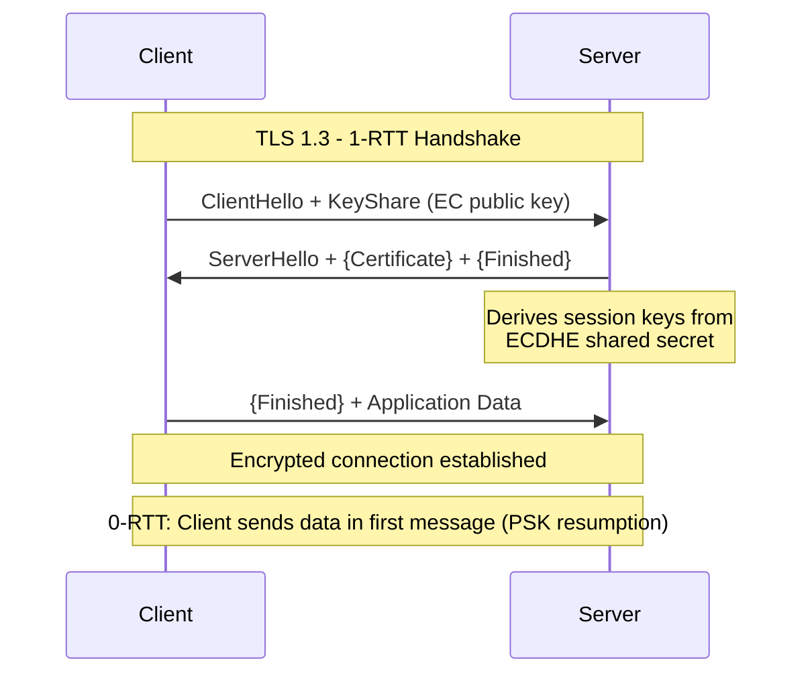

⚡ TL;DR - TLS 1.3 (RFC 8446, 2018) makes TLS faster, simpler, and
more secure than TLS 1.2. Key improvements: 1-RTT handshake (vs 2-RTT
for TLS 1.2), 0-RTT session resumption (with replay risks), all
cipher suites provide Perfect Forward Secrecy (PFS), removed all
weak/legacy algorithms (RSA key exchange, static DH, RC4, 3DES, SHA-1,
MD5), encrypted handshake metadata. Migration approach: enable TLS 1.3
alongside TLS 1.2 (not instead of) - modern clients negotiate TLS 1.3,
legacy clients fall back to TLS 1.2. Set a sunset date for TLS 1.2 after
confirming < 1% of traffic uses TLS 1.2.

---

| #081 | Category: Security | Difficulty: ★★★ |
|:---|:---|:---|
| **Depends on:** | OWASP Top 10, Authentication, Session Management, Secrets Management, IAM, TLS Configuration, OAuth 2.0 Security, Auth Migration | |
| **Used by:** | TLS Protocol Attacks, TLS 1.3 Protocol Design, OAuth + OIDC Specification Design, Security Protocol Design Trade-offs | |
| **Related:** | TLS Configuration, OAuth 2.0 Security, Auth Migration, TLS Protocol Attacks, TLS 1.3 Design, Security Protocol Design | |

---

### 🔥 The Problem This Solves

**WHY TLS 1.2 NEEDS TO BE REPLACED:**

```
TLS 1.2 VULNERABILITIES AND WEAKNESSES:

  1. NEGOTIABLE WEAK CIPHER SUITES
     TLS 1.2 supports cipher suites with known weaknesses:
     
     Weak key exchange (no Forward Secrecy):
       TLS_RSA_WITH_AES_128_CBC_SHA
       TLS_RSA_WITH_AES_256_CBC_SHA256
       → RSA key exchange: if private key ever leaked,
         ALL past recorded sessions can be decrypted.
       → No PFS (Perfect Forward Secrecy).
     
     Weak or broken symmetric ciphers:
       TLS_RSA_WITH_RC4_128_MD5     (RC4 broken - RC4 NOMORE attack)
       TLS_RSA_WITH_3DES_EDE_CBC_SHA (3DES: SWEET32 attack - birthday bound)
     
     Weak hash functions:
       SHA-1 in MAC: SLOTH attack
       MD5: completely broken
     
     Without explicit configuration: TLS 1.2 may negotiate these weak suites.

  2. 2-RTT HANDSHAKE (PERFORMANCE)
     TLS 1.2 handshake requires 2 round trips before data flows:
       Client → Server: ClientHello
       Server → Client: ServerHello + Certificate + ServerHelloDone
       Client → Server: ClientKeyExchange + ChangeCipherSpec + Finished
       Server → Client: ChangeCipherSpec + Finished
       → 2 full round trips (2-RTT) before first application data byte.
     
     At 100ms RTT (e.g., EU to US): TLS setup adds 200ms latency.
     TLS 1.3: 1-RTT (one fewer round trip). 0-RTT for session resumption.

  3. COMPLEX NEGOTIATION SURFACE
     TLS 1.2 negotiates: protocol version, key exchange algorithm,
     cipher, MAC algorithm separately.
     Many combinations → many potential downgrade attacks.
     POODLE: client forced to downgrade to SSL 3.0 via protocol alert.
     BEAST: CBC cipher attack.
     CRIME/BREACH: compression oracle.
     (Mitigated by good configuration, but the surface exists.)

TLS 1.3 IMPROVEMENTS:

  1. MANDATORY PFS: All cipher suites use ephemeral keys.
     Only 3 cipher suites allowed (all modern, all secure):
       TLS_AES_128_GCM_SHA256
       TLS_AES_256_GCM_SHA384
       TLS_CHACHA20_POLY1305_SHA256
     
  2. 1-RTT HANDSHAKE:
     Client → Server: ClientHello + KeyShare
     Server → Client: ServerHello + Certificate + Finished (encrypted)
     Client → Server: Finished + Application Data
     → Just 1 round trip. Client can start sending data in first RTT.
  
  3. 0-RTT RESUMPTION (with caveats):
     Reconnecting client sends early data in the FIRST message.
     No additional round trip needed for TLS handshake.
     Caveat: replay attack risk (see Failure Modes section).
  
  4. ENCRYPTED HANDSHAKE:
     Certificate is sent encrypted (in TLS 1.2: certificate is sent
     in plaintext, revealing server identity to passive observers).
     In TLS 1.3: certificate encrypted, providing better privacy.
  
  5. REMOVED WEAK ALGORITHMS:
     Removed: RSA key exchange, DH static, DSA, RC4, 3DES, MD5, SHA-1.
     No more negotiation of weak suites → no downgrade path.
```

---

### 📘 Textbook Definition

**TLS 1.3 (RFC 8446):** The fourth version of the Transport Layer Security
protocol, standardized in August 2018. Redesigned for security and speed:
mandatory ephemeral key exchange (PFS), reduced to 3 cipher suites (all
secure), 1-RTT handshake (down from 2-RTT in TLS 1.2), 0-RTT session
resumption, and encrypted handshake metadata.

**Perfect Forward Secrecy (PFS):** A property of key exchange protocols
ensuring that the compromise of long-term private keys does not enable
decryption of past recorded sessions. Achieved via ephemeral Diffie-Hellman
key exchange (ECDHE): a new ephemeral key pair is generated per session,
never stored. TLS 1.3 mandates PFS for all connections. TLS 1.2 only if
an ECDHE/DHE cipher suite is specifically selected.

**0-RTT session resumption:** TLS 1.3 feature allowing a reconnecting
client to send application data in the very first message (no handshake
round trip required). Uses a Pre-Shared Key (PSK) from the previous
session. Trade-off: replay vulnerability - early data could be replayed
by an active network attacker.

**ECDHE (Elliptic Curve Diffie-Hellman Ephemeral):** The key exchange
algorithm used in TLS 1.3 handshakes. Provides PFS via ephemeral EC key
pairs. Common groups: X25519 (Curve25519, modern), P-256 (NIST, widely
supported), P-384 (NIST, higher security).

---

### ⏱️ Understand It in 30 Seconds

**One line:**
TLS 1.3 removes all weak cryptography from TLS 1.2, requires
Perfect Forward Secrecy for every connection, and is 1 round trip
faster - while being fully backward compatible (clients negotiate
the best version both sides support).

**One analogy:**
> TLS 1.2 is like a hotel with optional room locks:
> Most rooms have good modern locks, but some rooms still
> have old, easily-picked locks (weak cipher suites).
> You have to explicitly request a good room.
> Plus: checking in requires two trips to the front desk (2-RTT).
>
> TLS 1.3 is the same hotel after renovation:
> - All rooms have the same new high-security locks. No weak option.
> - Checking in requires only one trip to the front desk (1-RTT).
> - Returning guests can go straight to their room (0-RTT resumption).
> - The building's internal corridors are now private (encrypted handshake).
>
> Migration strategy: TLS 1.3 and 1.2 rooms coexist in the hotel.
> Modern guests automatically get TLS 1.3 rooms.
> Legacy guests still use TLS 1.2 rooms.
> After all legacy guests are gone: convert TLS 1.2 rooms too.

---

### 🔩 First Principles Explanation

**TLS 1.3 handshake vs TLS 1.2:**

```
TLS 1.2 HANDSHAKE (2-RTT):

  Client                              Server
    │                                    │
    │──── ClientHello ─────────────────→│
    │     (supported versions, ciphers)  │
    │                                    │
    │←─── ServerHello + Certificate ────│
    │←─── ServerHelloDone ──────────────│
    │                                    │
    │──── ClientKeyExchange ───────────→│
    │──── ChangeCipherSpec ────────────→│
    │──── Finished ────────────────────→│
    │                                    │
    │←─── ChangeCipherSpec ─────────────│
    │←─── Finished ─────────────────────│
    │                                    │
    │──── Application Data ────────────→│
    │                                    │
    2 full round trips before data flows

TLS 1.3 HANDSHAKE (1-RTT):

  Client                              Server
    │                                    │
    │──── ClientHello + KeyShare ──────→│
    │     (version, ciphers, EC key)     │
    │                                    │
    │←─── ServerHello + KeyShare ───────│
    │←─── {Certificate + Verify} ───────│ (encrypted)
    │←─── {Finished} ───────────────────│
    │                                    │
    │──── {Finished} ──────────────────→│
    │──── Application Data ────────────→│
    │                                    │
    1 round trip before data flows.
    {} = encrypted with derived session keys.

TLS 1.3 0-RTT RESUMPTION:

  Client                              Server
    │                                    │
    │──── ClientHello + Early Data ────→│
    │     (PSK from previous session)    │
    │                                    │
    │←─── ServerHello + Finished ───────│
    │                                    │
    │──── Application Data ────────────→│
    │                                    │
    0 round trips for resumption!
    But: early data has REPLAY RISK.
    Only safe for idempotent, non-sensitive requests (GET, not POST).
```

**Server configuration for TLS 1.3 (Nginx):**

```nginx
# nginx.conf - TLS 1.3 + TLS 1.2 (migration phase)
server {
    listen 443 ssl;
    
    ssl_certificate /etc/ssl/certs/server.crt;
    ssl_certificate_key /etc/ssl/private/server.key;
    
    # TLS versions: allow both 1.2 and 1.3 during migration
    ssl_protocols TLSv1.2 TLSv1.3;
    
    # TLS 1.2 cipher suites: only ECDHE (for PFS) - no RSA key exchange
    ssl_ciphers 'ECDHE-ECDSA-AES256-GCM-SHA384:'
                'ECDHE-RSA-AES256-GCM-SHA384:'
                'ECDHE-ECDSA-AES128-GCM-SHA256:'
                'ECDHE-RSA-AES128-GCM-SHA256:'
                'ECDHE-ECDSA-CHACHA20-POLY1305:'
                'ECDHE-RSA-CHACHA20-POLY1305';
    ssl_prefer_server_ciphers on;
    
    # TLS 1.3 cipher suites are separate (not ssl_ciphers):
    ssl_conf_command Ciphersuites TLS_AES_256_GCM_SHA384:TLS_AES_128_GCM_SHA256:TLS_CHACHA20_POLY1305_SHA256;
    
    # ECDH curve: X25519 preferred (fast, modern), then P-256
    ssl_ecdh_curve X25519:prime256v1;
    
    # Session resumption (TLS 1.2 session cache, TLS 1.3 uses tickets):
    ssl_session_cache shared:SSL:10m;
    ssl_session_timeout 10m;
    ssl_session_tickets off;  # Disable for better PFS (key rotation complexity)
    
    # HSTS: tell browsers to always use HTTPS (max-age 2 years)
    add_header Strict-Transport-Security 
        "max-age=63072000; includeSubDomains; preload" always;
}

# After migration: enforce TLS 1.3 only
# ssl_protocols TLSv1.3;
# (Remove TLSv1.2 once <1% of traffic uses it)
```

---

### 🧪 Thought Experiment

**SCENARIO: Enterprise API migration from TLS 1.2 to TLS 1.3:**

```
SYSTEM: B2B REST API
  Clients: mobile apps (iOS/Android), web browsers, B2B partner systems.
  Current TLS: 1.2 with ECDHE cipher suites (already PFS-compliant).
  Goal: enable TLS 1.3, eventually sunset TLS 1.2.

CHALLENGES:
  1. B2B partner systems may use older libraries (Java 8 default TLS = 1.2).
     Java 8: TLS 1.3 only with JDK 8u261+ (2020). Many don't update.
  2. Enterprise proxies/firewalls may not support TLS 1.3 yet.
     Some deep-packet inspection (DPI) systems: TLS 1.3 = opaque (encrypted
     handshake), some enterprise DPI tools reject or break TLS 1.3.
  3. Load balancers: AWS ALB supports TLS 1.3 (Security Policy ELBSecurityPolicy-TLS13-1-2-2021-06).

MIGRATION PLAN:

  Phase 1 (Week 1-2): Monitor current TLS version distribution.
    Check AWS ALB access logs for tls_cipher and ssl_protocol fields.
    
    grep "ssl_protocol" /var/log/nginx/access.log | \
      awk '{print $NF}' | sort | uniq -c
    
    Or query AWS CloudWatch:
      SELECT ssl_protocol, COUNT(*) as requests
      FROM alb_access_logs
      WHERE time > NOW() - INTERVAL 7 DAYS
      GROUP BY ssl_protocol
      ORDER BY requests DESC;
    
    Example output:
      TLSv1.2: 94,230 (95%)
      TLSv1.3: 4,820 (5%)
      TLSv1: 150 (<0.1%)  <- these should be blocked already
    
  Phase 2 (Week 3): Enable TLS 1.3 alongside TLS 1.2.
    AWS ALB: change security policy to TLS13-ELBSecurityPolicy-TLS13-1-2-2021-06.
    This enables TLS 1.3 while keeping TLS 1.2 as fallback.
    
    Monitor: TLS 1.3 adoption rate (check weekly).
    Target: 80%+ within 4 weeks (modern clients auto-negotiate 1.3).
    
  Phase 3 (Month 2): Notify B2B partners.
    "We are sunsetting TLS 1.2 on [date]. Please ensure your systems
    support TLS 1.3 (OpenSSL 1.1.1+, Java 11+, Python 3.4+)."
    
    Provide testing endpoint: api.example.com/health (force TLS 1.3 only on staging).
    Partners can test their integration against staging.
    
  Phase 4 (Month 3-4): Remove TLS 1.2.
    AWS ALB: change to ELBSecurityPolicy-TLS13-1-3-2021-06 (TLS 1.3 only).
    Monitor: are there any TLS failures? Alert if any 5xx spikes after change.
    
    If 5xx spike: re-enable TLS 1.2 immediately. Investigate which client.

MEASURING SUCCESS:
  TLS 1.3 adoption rate: metric available in AWS ALB, CloudFront, Nginx logs.
  Target before TLS 1.2 removal: >99% of requests using TLS 1.3.
  Error rate after TLS 1.2 removal: should be < 0.1% (vs pre-removal baseline).
```

---

### 🧠 Mental Model / Analogy

> TLS 1.2 → 1.3 migration is like retiring old floppy disk drives
> from computers while USB already exists.
>
> Modern computers (modern clients): already use USB (TLS 1.3).
> Old systems (legacy clients): still bring floppy disks (TLS 1.2).
>
> Migration phase: computer supports BOTH floppy and USB.
> Modern users: use USB automatically (TLS 1.3 negotiated).
> Old users: still use floppy if they need to (TLS 1.2 fallback).
>
> After all old users have upgraded: remove the floppy drive.
> (Disable TLS 1.2 support.)
>
> The key: don't remove the floppy drive while people still need it.
> Monitor who's actually using floppies (TLS version in access logs).
> When nobody uses floppies for 30 days: safe to remove.

---

### 📶 Gradual Depth - Five Levels

**Level 1 - What it is (anyone can understand):**
TLS 1.3 is the latest version of the encryption that secures HTTPS connections. It's faster (requires fewer back-and-forth messages to establish) and more secure (removes all weak encryption options) than TLS 1.2. Modern browsers and apps already support it. Migration: enable TLS 1.3 on servers alongside TLS 1.2, then disable TLS 1.2 once you confirm all clients support 1.3.

**Level 2 - How to use it (junior developer):**
Enable TLS 1.3 in nginx: `ssl_protocols TLSv1.2 TLSv1.3;`. Both versions enabled - modern clients negotiate 1.3, old clients fall back to 1.2. Monitor TLS version distribution in access logs (nginx: `$ssl_protocol` variable, ALB: `ssl_protocol` field). When TLS 1.2 traffic < 1%: change to `ssl_protocols TLSv1.3;`. Also: disable TLS 1.2 cipher suites without PFS (`ssl_ciphers` - exclude RSA key exchange, only ECDHE suites).

**Level 3 - How it works (mid-level engineer):**
TLS 1.3 key improvements: (1) 1-RTT vs 2-RTT handshake (client sends KeyShare in ClientHello, server can respond with ServerHello+Certificate+Finished in one message), (2) 0-RTT resumption (PSK from previous session, but with replay risks), (3) all 3 cipher suites require ECDHE (PFS mandatory), (4) removed: RSA key exchange, DH static, RC4, 3DES, MD5, SHA-1, (5) certificate encrypted during handshake (better privacy). Backward compatibility: TLS negotiation is version-negotiated - client advertises max supported version, server selects the best mutual version. TLS 1.3 and 1.2 can coexist on the same port.

**Level 4 - Why it was designed this way (senior/staff):**
TLS 1.2's weak cipher suite problem: RFC 5246 defined TLS 1.2 with extensibility (add new cipher suites, deprecate old ones via standards process). In practice, implementers left decades of legacy suites enabled for "compatibility" - resulting in POODLE, BEAST, CRIME attacks exploiting these negotiable weaknesses. TLS 1.3 (RFC 8446) took a radical approach: remove negotiation of weak algorithms entirely. The 3 TLS 1.3 cipher suites are all modern AEAD (Authenticated Encryption with Associated Data) ciphers. No CBC mode (BEAST/LUCKY13 risk). No MAC-then-Encrypt (padding oracle risk). The handshake redesign: separated key exchange (ECDHE KeyShare) from authentication (certificate) to achieve 1-RTT. 0-RTT is an optional feature with explicit replay caveats in the spec.

**Level 5 - Mastery (distinguished engineer):**
Advanced TLS 1.3 topics: ESNI/ECH (Encrypted Client Hello) - TLS 1.3 encrypts the certificate, but the SNI (Server Name Indication) field in ClientHello was still plaintext, leaking which hostname the client is connecting to. ECH (RFC draft) encrypts the entire ClientHello using the server's published ECH public key (in DNS). Post-quantum TLS: NIST PQC standardization (ML-KEM/Kyber, ML-DSA/Dilithium) being integrated into TLS 1.3 via hybrid key exchange (X25519+Kyber for transition period). 0-RTT replay mitigations in practice: application must check the early data indicator and treat early data as potentially replayed. Server should maintain a replay cache (bloom filter per session ticket) to detect replays within the anti-replay window. Connection fingerprinting: JA3/JA4 TLS fingerprinting used by security tools to identify clients by their TLS ClientHello parameters (cipher suites, extensions, curves). Useful for bot detection but creates privacy concerns.

---

### ⚙️ How It Works (Mechanism)

```
TLS 1.3 CIPHER SUITE COMPARISON:

  Removed in TLS 1.3          | Reason
  ────────────────────────────┼────────────────────────────────
  RSA key exchange            | No PFS - historical sessions exposed
  DH static key exchange      | No PFS
  RC4                         | RC4 NOMORE attack (2015)
  3DES (CBC)                  | SWEET32 birthday attack
  SHA-1 MAC                   | Collision vulnerability
  MD5 MAC                     | Completely broken
  CBC cipher mode             | Padding oracle attacks (POODLE, BEAST)
  
  Remaining in TLS 1.3:
    TLS_AES_128_GCM_SHA256    | AEAD, fast, widely supported
    TLS_AES_256_GCM_SHA384    | AEAD, higher security margin
    TLS_CHACHA20_POLY1305_SHA256 | AEAD, fast on mobile (no AES HW)
```



---

### 💻 Code Example

**Java - force TLS 1.3 for REST client, with 1.2 fallback:**

```java
// HttpClientConfig.java - TLS 1.3 preferred, 1.2 fallback
@Configuration
public class HttpClientConfig {
    
    @Bean
    public RestTemplate restTemplate() throws Exception {
        SSLContext sslContext = SSLContextBuilder.create()
            // Supported protocols: TLS 1.3 preferred, 1.2 fallback
            .setProtocol("TLS")
            .loadTrustMaterial(null, new TrustAllStrategy())
            .build();
        
        SSLConnectionSocketFactory socketFactory =
            new SSLConnectionSocketFactory(
                sslContext,
                new String[]{"TLSv1.3", "TLSv1.2"},  // Preferred first
                null,  // Cipher suites: null = use JVM defaults (TLS 1.3 ONLY)
                SSLConnectionSocketFactory.getDefaultHostnameVerifier()
            );
        
        HttpClient httpClient = HttpClients.custom()
            .setSSLSocketFactory(socketFactory)
            .build();
        
        HttpComponentsClientHttpRequestFactory factory =
            new HttpComponentsClientHttpRequestFactory(httpClient);
        factory.setConnectTimeout(5000);
        
        return new RestTemplate(factory);
    }
}

// Verify TLS version in use (integration test):
@Test
void verifyTls13Negotiated() {
    SSLSocket socket = (SSLSocket) SSLSocketFactory.getDefault()
        .createSocket("api.example.com", 443);
    socket.startHandshake();
    String protocol = socket.getSession().getProtocol();
    assertThat(protocol).isEqualTo("TLSv1.3");
    socket.close();
}

// Check TLS version in nginx access logs:
// log_format combined '$remote_addr - $remote_user [$time_local] '
//                     '"$request" $status $body_bytes_sent '
//                     '"$http_referer" "$http_user_agent" '
//                     '$ssl_protocol $ssl_cipher';
// Monitor: percentage of requests on TLS 1.3 vs TLS 1.2.
// When TLS 1.2 < 1%: safe to disable TLS 1.2.
```

---

### ⚖️ Comparison Table

| Feature | TLS 1.2 | TLS 1.3 |
|:---|:---|:---|
| **Handshake** | 2-RTT | 1-RTT |
| **Session resumption** | Session ID / ticket (1-RTT) | 0-RTT (PSK, with replay risk) |
| **PFS** | Optional (ECDHE only) | Mandatory (all suites) |
| **Cipher suites** | 37+ (many weak) | 3 (all secure, all AEAD) |
| **Certificate** | Plaintext in handshake | Encrypted |
| **Downgrade attacks** | Possible (POODLE on SSL3 fallback) | Impossible (version negotiation hardened) |
| **Algorithm negotiation** | Version, cipher, MAC, compression | Version + 3 preset cipher suites |

---

### ⚠️ Common Misconceptions

| Misconception | Reality |
|:---|:---|
| "TLS 1.3 breaks backward compatibility with TLS 1.2 clients." | TLS negotiation is designed for backward compatibility. When a TLS 1.3 server receives a connection from a TLS 1.2-only client, they negotiate TLS 1.2 automatically. The client sends the highest version it supports in ClientHello. The server responds with the best mutual version. TLS 1.3 servers can support both TLS 1.3 and TLS 1.2 simultaneously on the same port (this is the recommended migration configuration). Disabling TLS 1.2 entirely on the server is what breaks backward compatibility - not enabling TLS 1.3. |
| "0-RTT is always safe for performance optimization." | 0-RTT data can be REPLAYED by a network attacker. The PSK (Pre-Shared Key) from the previous session is used to encrypt early data, but the server cannot distinguish a legitimate early data message from a replay of that same message. Practical consequence: only SAFE for idempotent, non-sensitive requests (GET with no side effects). NEVER use 0-RTT for: state-changing requests (POST, PUT, DELETE), authentication requests, payment or financial transactions, any request that should execute exactly once. The RFC 8446 spec is explicit about this risk. By default, applications should not enable 0-RTT unless they have verified all early data paths are replay-safe. |

---

### 🚨 Failure Modes & Diagnosis

**TLS 1.3 migration failures:**

```
PROBLEM 1: Enterprise proxy/firewall rejects TLS 1.3

  Symptom: After enabling TLS 1.3, B2B partner reports connection failures.
  Client reports: "SSL handshake failed: unexpected message."
  
  Diagnosis:
    Partner uses enterprise proxy with TLS inspection (DPI).
    DPI system (Palo Alto, Zscaler, etc.) does not support TLS 1.3.
    DPI intercepts TLS and re-encrypts: not valid for TLS 1.3 encrypted
    handshake (server certificate encryption breaks DPI interception).
    
  Fix:
    Keep TLS 1.2 supported for legacy partners (dual TLS support).
    Provide partner with: "Update your proxy software to support TLS 1.3.
    We support TLS 1.3 and TLS 1.2. Your proxy should negotiate 1.2
    as a fallback if it doesn't support 1.3."
    
    To verify: test from partner environment with:
      openssl s_client -connect api.example.com:443 -tls1_2
      (Should connect with TLS 1.2 even after TLS 1.3 is enabled.)

PROBLEM 2: Java client fails after TLS 1.3 migration

  Symptom: Java 8 client application fails with:
    "javax.net.ssl.SSLHandshakeException: No appropriate protocol"
  
  Diagnosis:
    Java 8 (pre-JDK 8u261, 2020) does not support TLS 1.3.
    If server requires TLS 1.3 ONLY (TLS 1.2 disabled): Java 8 fails.
    If server supports TLS 1.3 + TLS 1.2: Java 8 should negotiate 1.2.
    
  Fix (keep both TLS versions in server config):
    ssl_protocols TLSv1.2 TLSv1.3;
    
  Fix (client side):
    Upgrade to Java 11+ (built-in TLS 1.3 support).
    Or: update to JDK 8u261+ for TLS 1.3 support.
    Or: for older Java: add Conscrypt or BouncyCastle as security provider.

PROBLEM 3: HSTS + TLS misconfiguration prevents access

  Symptom: Browser reports "ERR_SSL_PROTOCOL_ERROR" after TLS 1.2 disabled.
  User cannot access the site. Previously used TLS 1.2 (old browser).
  
  Diagnosis:
    Browser cached HSTS policy: always use HTTPS.
    Old browser does not support TLS 1.3.
    Server disabled TLS 1.2 (TLS 1.3 only).
    Browser cannot establish TLS 1.3 connection.
    HSTS prevents fallback to HTTP.
    User is locked out.
    
  Prevention:
    Monitor TLS version distribution in access logs BEFORE disabling TLS 1.2.
    Wait until TLS 1.2 traffic < 1% over 30 days before disabling.
    Browser support for TLS 1.3: Chrome 63+ (2017), Firefox 61+ (2018).
    Extremely old browsers are edge cases for modern web apps.
    Check analytics for your specific user base browser version distribution.
```

---

### 🔗 Related Keywords

**Prerequisites:**
- `TLS Configuration Best Practices` - TLS 1.2 setup baseline
- `Secrets Management` - certificate and key management
- `Auth Mechanism Migration` - migration strategy patterns

**Builds on this:**
- `TLS Protocol Attacks` - attacks on older TLS
- `TLS 1.3 Protocol Design Rationale` - why TLS 1.3 was designed this way
- `Security Protocol Design Trade-offs` - protocol design principles

---

### 📌 Quick Reference Card

```
┌──────────────────────────────────────────────────────────┐
│ TLS 1.3      │ 1-RTT (vs 2-RTT for 1.2)                 │
│ IMPROVEMENTS │ Mandatory PFS (ECDHE for all suites)      │
│              │ 3 cipher suites only (all AEAD)           │
│              │ Encrypted certificate in handshake        │
├──────────────┼───────────────────────────────────────────┤
│ MIGRATION    │ Enable TLS 1.3 + TLS 1.2 together first  │
│ STRATEGY     │ Monitor version distribution (access logs)│
│              │ Disable TLS 1.2 only when < 1% of traffic│
├──────────────┼───────────────────────────────────────────┤
│ 0-RTT        │ NEVER for POST/PUT/DELETE/auth requests   │
│ WARNING      │ Only safe for idempotent GET (replay risk) │
├──────────────┼───────────────────────────────────────────┤
│ NGINX CONFIG │ ssl_protocols TLSv1.2 TLSv1.3;            │
│              │ ssl_ciphers ECDHE-*-GCM-*                 │
└──────────────────────────────────────────────────────────┘
```

---

### 💎 Transferable Wisdom

**Reusable Engineering Principle:**
"Protocol versioning is always backward-compatible downward, never upward."
TLS version negotiation: client advertises maximum supported version.
Server responds with the best mutual version. This is downward compatible.
HTTP/2: clients send Upgrade or ALPN extension. HTTP/1.1 fallback available.
gRPC (HTTP/2 based): falls back to HTTP/1.1 REST if HTTP/2 not supported.
The pattern: design protocols to negotiate the best mutual capability,
while falling back to lesser capabilities for legacy clients.
This is the correct approach for any protocol migration.
The engineering discipline: never REQUIRE the new version from day one
(breaks all old clients). Enable the new version and let clients negotiate.
Monitor usage. Deprecate old version when usage is negligible.
This pattern applies to: TLS version, HTTP version, API version (v1/v2/v3),
gRPC vs REST, message serialization format (JSON vs Protobuf),
cipher suite selection, and algorithm selection.
The meta-principle: new secure protocols should be able to COEXIST with
old protocols during transition, not REPLACE them overnight. Security
improvements that cannot be incrementally deployed will NOT be deployed.
TLS 1.3 was designed with explicit backward compatibility precisely because
the working group knew that "deploy instantly" is not operationally viable.

---

### 💡 The Surprising Truth

TLS 1.3 was specified by RFC 8446 in 2018. It was effectively designed
and implemented earlier: Chrome began shipping experimental TLS 1.3 in
2016, and Facebook deployed TLS 1.3 in production in 2017 before
the RFC was finalized.

But here's the surprising part: initial deployments of TLS 1.3 broke
many networks. Why?

Some middleboxes (enterprise firewalls, load balancers, DPI appliances)
implemented TLS 1.2 inspection by parsing the TLS record structure.
When TLS 1.3 changed the handshake structure (and encrypted more of it),
these middleboxes didn't just fail gracefully - they CLOSED THE CONNECTION.

The IETF's response was remarkable: TLS 1.3 includes a compatibility layer.
In the ClientHello, TLS 1.3 PRETENDS to be TLS 1.2 in some fields
to pass through middlebox inspection! The session_id field is populated
with random bytes (TLS 1.3 doesn't actually use session IDs). The record
version field is set to TLS 1.2 values. The actual TLS 1.3 negotiation
happens in extensions that middleboxes typically ignore.

This is "protocol ossification" - the internet's installed base of
middleboxes became so entrenched that even a security-enhancing protocol
upgrade had to disguise itself as the old protocol to get through the network.

The lesson: real-world protocol deployment is constrained not just by
server and client support, but by every network device in between.
Security improvements must navigate not just technical, but operational
ecosystem constraints.

---

### ✅ Mastery Checklist

**You've mastered this when you can:**
1. **EXPLAIN** TLS 1.3's key improvements: 1-RTT handshake, mandatory PFS
   (ECDHE), 3 cipher suites (all AEAD), encrypted certificate, removed weak algos.
2. **CONFIGURE** nginx/Apache for TLS 1.3 + TLS 1.2 dual support during migration,
   and ECDHE-only cipher suites for TLS 1.2 (no RSA key exchange).
3. **PLAN** a TLS migration: enable dual support, monitor version distribution
   in access logs, set threshold (< 1% TLS 1.2) before disabling TLS 1.2.
4. **EXPLAIN** 0-RTT replay risk: early data can be replayed by a network
   attacker, safe ONLY for idempotent requests, never for state-changing operations.

---

### 🎯 Interview Deep-Dive

**Q: What are the main improvements in TLS 1.3 over TLS 1.2,
and how would you migrate an existing service to TLS 1.3?**

*Why they ask:* Tests depth in TLS knowledge and operational migration experience.

*Strong answer covers:*
- TLS 1.3 improvements: 1-RTT handshake (1 round trip vs 2), 0-RTT session
  resumption (PSK, but replay risk), mandatory PFS (all suites ECDHE, no RSA key
  exchange), only 3 cipher suites (all AEAD: AES-GCM, ChaCha20-Poly1305),
  removed weak algorithms (RSA key exchange, 3DES, RC4, MD5, SHA-1, CBC ciphers),
  encrypted handshake metadata (certificate encrypted).
- Performance improvement: 1-RTT saves one full round trip per connection.
  At 100ms RTT (cross-continental), TLS 1.3 is 100ms faster than TLS 1.2 per new connection.
- Migration strategy: enable TLS 1.3 alongside TLS 1.2 (not instead of).
  TLS negotiation is version-negotiated: modern clients get TLS 1.3,
  legacy clients fall back to TLS 1.2 automatically.
  Monitor: nginx `$ssl_protocol` log variable, ALB `ssl_protocol` field.
  When TLS 1.2 < 1% over 30 days: disable TLS 1.2.
- 0-RTT caveat: only safe for idempotent requests. Network attacker can replay
  early data. Never use for POST, auth, or financial transactions.
- Enterprise concern: some middleboxes (DPI, firewalls) break TLS 1.3.
  Keep TLS 1.2 available for legacy partners. Notify B2B partners before disabling.
- Nginx config: `ssl_protocols TLSv1.2 TLSv1.3;` for migration phase.
  After migration complete: `ssl_protocols TLSv1.3;`