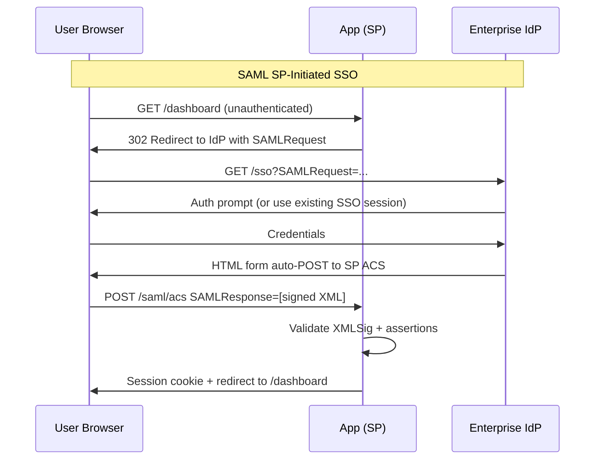

⚡ TL;DR - OAuth 2.0 and SAML 2.0 are complementary, not competing.
SAML is an authentication AND identity federation protocol designed for
enterprise SSO (XML-based, browser-driven POST bindings, mature in
enterprises). OAuth 2.0 is an authorization delegation protocol (with
OIDC for authentication) designed for API access and modern web/mobile
apps (JWT/JSON-based, lightweight). Decision rule: SAML for enterprise
SSO with existing IdPs (Azure AD SAML, Okta SAML, ADFS) when your users
are corporate employees. OAuth 2.0 + OIDC for consumer-facing apps, APIs,
mobile apps, and microservices. Both can coexist: an enterprise IdP may
support both (Okta, Azure AD), allowing SAML for desktop SSO and OIDC for API access.

---

| #082 | Category: Security | Difficulty: ★★★ |
|:---|:---|:---|
| **Depends on:** | OWASP Top 10, Authentication, Session Management, Secrets Management, IAM, TLS Configuration, OAuth 2.0 Security, Auth Migration | |
| **Used by:** | OAuth Implicit Flow Deprecation, DevSecOps Pipeline Design, Enterprise Security Architecture, SSDLC, OAuth + OIDC Specification Design | |
| **Related:** | Authentication, Session Management, IAM, TLS Configuration, OAuth 2.0 Security, Auth Migration, Enterprise Security Architecture | |

---

### 🔥 The Problem This Solves

**THE IDENTITY PROTOCOL LANDSCAPE:**

```
WHY TWO PROTOCOLS EXIST:

  SAML 2.0 (2005): designed for enterprise web SSO.
    World in 2005: desktop browsers, enterprise VPNs, Active Directory.
    Use case: employee logs into corporate portal, accesses 20 SaaS apps
    without re-entering password. One IdP, many SPs (Service Providers).
    Technology: XML + XMLSig (digital signatures), browser form POST.
    Typical environment: Ping Federate, ADFS, Shibboleth, Oracle SSO.
    
  OAuth 2.0 (2012) + OIDC (2014): designed for API authorization.
    World in 2012: mobile apps, REST APIs, third-party integrations.
    Use case: mobile app needs to access user's Google Calendar.
    User grants permission to the app without sharing password.
    Technology: HTTP redirects, JSON, JWT.
    Typical environment: Google, GitHub, Facebook, Okta, Auth0.

THE DECISION PROBLEM:
  When should you use SAML for SSO vs OAuth 2.0 + OIDC?
  
  Engineering teams building new applications must decide:
    - New B2B SaaS app: should we support SAML or OIDC for customer SSO?
    - Enterprise integration: customer says "we use Azure AD." SAML or OIDC?
    - Consumer app: users log in with Google/Facebook. Which protocol?
    - Mobile app: needs API access + authentication. Which protocol?
    - Microservices: service-to-service auth. Which protocol?
  
  Wrong choice consequences:
    - Implement OIDC → enterprise customer's IT team says
      "we only support SAML assertions." Integration project stalled.
    - Implement SAML → mobile app needs JWT for API calls.
      SAML assertions are XML, not JWT. Friction.
    - Implement both → complex codebase, double maintenance.

COMMON REAL-WORLD SCENARIO (B2B SaaS):
  Company builds B2B SaaS product. Target customers: Fortune 500 enterprises.
  Customer requirement: "Our employees use Okta. We need SSO integration."
  
  Enterprise IT options:
    Okta supports BOTH SAML 2.0 and OIDC.
    Many enterprise procurement checklist: "Do you support SAML?"
    Legacy enterprise SSO infrastructure: often SAML-only (ADFS, older Okta).
    
  Decision for B2B SaaS provider: support SAML for enterprise SSO.
  (OIDC is fine too, but SAML is the enterprise-safe choice for
  Fortune 500 procurement. You may need both.)
```

---

### 📘 Textbook Definition

**SAML 2.0 (Security Assertion Markup Language 2.0):** An XML-based open
standard for exchanging authentication and authorization data between
an Identity Provider (IdP) and a Service Provider (SP). Designed for
enterprise web-based SSO. Key artifact: SAML Assertion (XML document
containing user attributes, signed by IdP private key). Browser-based
bindings: HTTP POST (form submission) and HTTP Redirect.

**OAuth 2.0:** An authorization framework (RFC 6749) enabling delegated
access. An application can obtain limited access to user resources at
another service on behalf of the user, without the user sharing their
password. OAuth 2.0 itself does not define authentication; it defines
authorization delegation. Flows: Authorization Code (+ PKCE), Client
Credentials (service-to-service), Device Code.

**OIDC (OpenID Connect):** An authentication layer built on top of
OAuth 2.0 (using the Authorization Code flow). Adds: ID Token (JWT with
user identity claims), UserInfo endpoint, standardized claims (sub, email,
name, iss, aud, exp). Used for: "Login with Google/GitHub/Okta" scenarios.
Think of it as: OAuth 2.0 = authorization. OIDC = authentication via OAuth 2.0.

**IdP (Identity Provider):** The system that authenticates users and asserts
their identity. Examples: Active Directory + ADFS (on-prem), Azure AD, Okta,
Google Workspace, Auth0, PingFederate. Trusted by Service Providers (apps).

**SP-initiated vs IdP-initiated SSO:** SP-initiated: user tries to access
the app (SP), is redirected to IdP to authenticate, redirected back.
IdP-initiated: user logs into IdP (corporate portal), clicks link to app,
IdP pushes a SAML assertion to the app. Both patterns exist in enterprise.

---

### ⏱️ Understand It in 30 Seconds

**One line:**
SAML 2.0 is the enterprise SSO standard (XML, XML signatures, built for
browsers + Active Directory integration); OAuth 2.0 + OIDC is the modern
API/mobile standard (JSON, JWT, built for APIs and mobile apps). Use SAML
for enterprise customers; use OIDC for consumer apps, APIs, and microservices.

**One analogy:**
> SAML is like a notarized paper letter of introduction.
> A corporation gives you a signed, sealed letter from their lawyer (IdP)
> to show at each business partner office (SP).
> The letter is formal, legally recognized (XML + XMLSig),
> and works at every corporate office that recognizes the law firm.
>
> OAuth 2.0 + OIDC is like a digital keycard.
> A modern building (IdP) issues you a digital keycard with an RFID chip (JWT).
> You tap the keycard at any door (API) you're authorized for.
> Fast, lightweight, works for mobile access, APIs, and modern apps.
>
> A large enterprise needs both:
> - Paper letters for formal B2B agreements (SAML for enterprise SSO)
> - Keycards for building access (OIDC/OAuth for app and API access)
>
> Most modern IdPs (Okta, Azure AD, Google) support both.

---

### 🔩 First Principles Explanation

**SAML 2.0 SP-initiated SSO flow:**

```
SAML 2.0 SP-INITIATED SSO (browser-based):

  1. User accesses: https://app.saas.com/dashboard
     (Not authenticated yet)
  
  2. SP (app.saas.com) detects unauthenticated request.
     SP creates SAMLRequest (XML, compressed, base64-encoded).
     SP redirects user to IdP:
       HTTP 302 → https://idp.company.com/sso?SAMLRequest=...&RelayState=...
     RelayState: URL the user was trying to access (to redirect back after auth).
  
  3. IdP receives SAMLRequest.
     IdP authenticates user (via existing corporate session, or prompt for creds).
     IdP creates SAML Assertion:
       <samlp:Response>
         <saml:Assertion>
           <saml:Issuer>https://idp.company.com</saml:Issuer>
           <saml:Subject>
             <saml:NameID>john.doe@company.com</saml:NameID>
           </saml:Subject>
           <saml:AttributeStatement>
             <saml:Attribute Name="email">
               <saml:AttributeValue>john@company.com</saml:AttributeValue>
             </saml:Attribute>
             <saml:Attribute Name="role">
               <saml:AttributeValue>admin</saml:AttributeValue>
             </saml:Attribute>
           </saml:AttributeStatement>
           <saml:Conditions>
             NotBefore="2024-01-01T10:00:00Z"
             NotOnOrAfter="2024-01-01T10:10:00Z"
           </saml:Conditions>
         </saml:Assertion>
         <!-- Signed with IdP private key (XMLSig) -->
         <Signature>...</Signature>
       </samlp:Response>
     
     IdP responds with HTML form that auto-submits to SP:
       <form method="POST" action="https://app.saas.com/saml/acs">
         <input name="SAMLResponse" value="[base64 XML]" />
         <input name="RelayState" value="/dashboard" />
       </form>
       <script>document.forms[0].submit();</script>
  
  4. Browser auto-submits SAML Response to SP's ACS (Assertion Consumer Service).
     SP: verifies XMLSig using IdP's public certificate.
     SP: validates assertion (Conditions: NotBefore, NotOnOrAfter, Audience).
     SP: extracts user identity (NameID: john.doe@company.com).
     SP: creates application session. Redirects user to /dashboard.

OIDC AUTHORIZATION CODE FLOW (comparison):

  1. User accesses: https://app.example.com/dashboard
  
  2. App redirects to IdP:
     https://idp.example.com/oauth/authorize?
       response_type=code&
       client_id=app123&
       redirect_uri=https://app.example.com/callback&
       scope=openid email profile&
       state=random_nonce&
       code_challenge=...  (PKCE)
  
  3. IdP authenticates user, redirects back:
     https://app.example.com/callback?
       code=AUTH_CODE&
       state=random_nonce
  
  4. App exchanges code for tokens (server-to-server):
     POST /oauth/token
     Body: code=AUTH_CODE, grant_type=authorization_code, ...
     Response: {
       "access_token": "JWT...",
       "id_token": "JWT...",   ← OIDC addition: user identity
       "expires_in": 3600
     }
  
  5. App validates id_token (JWT), extracts user identity.
     App uses access_token for API calls.
```

---

### 🧪 Thought Experiment

**SCENARIO: Building SSO for a B2B SaaS that must support Fortune 500 customers:**

```
PRODUCT: Project management SaaS (competitors: Jira, Asana).
TARGET CUSTOMERS: Enterprise companies (5,000+ employees).
REQUIREMENT: Enterprise SSO. Customer admins can provision users automatically.
CUSTOMER ENVIRONMENTS: Varied (Okta, Azure AD, ADFS, Ping Federate, OneLogin).

DECISION ANALYSIS:

  SAML 2.0 consideration:
  + Universally supported by all enterprise IdPs (Okta, Azure AD, ADFS, Ping).
  + Required by many enterprise procurement checklists.
  + Supports Just-In-Time (JIT) provisioning: auto-create user on first SSO.
  + SCIM can be added alongside for directory sync.
  - XML complexity: parsing, signature validation, XML injection risks.
  - No mobile-native flow (browser redirect-based).
  - Stateful: harder to use for API calls.

  OIDC consideration:
  + JSON/JWT: developer-friendly, lightweight.
  + Modern enterprise IdPs support OIDC (Okta, Azure AD, Ping, Auth0).
  + Works for mobile apps natively (PKCE flow).
  + ID token for auth + access token for APIs (same protocol).
  - Some legacy enterprise environments: SAML only (older ADFS, some Ping Federate).
  - Procurement team may check "SAML support?" (less likely for OIDC-first companies).

  DECISION: Support BOTH SAML 2.0 AND OIDC.
  
    For enterprise (B2B SaaS) product:
    - Implement SAML 2.0 for enterprise SSO (broader compatibility guarantee).
    - Implement OIDC for modern integrations and mobile app.
    - Use a library for both: Spring Security (SAML2 + OAuth2 client),
      or use a managed platform (Auth0, Okta, WorkOS) that handles both.
    
    WorkOS / Sentry / Linear approach:
    - Use WorkOS API as SAML/OIDC abstraction layer.
    - Customer configures their IdP with WorkOS.
    - Your app receives a standardized user profile from WorkOS.
    - WorkOS handles SAML assertion parsing, signature validation.
    - Your app gets: { "id": "...", "email": "...", "organization_id": "..." }
    - Works with: Okta SAML, Azure AD SAML, Google SAML, Ping, ADFS, GitHub.

  FOR A CONSUMER APP (not B2B enterprise):
    OIDC only is correct. Consumer users don't have enterprise IdPs.
    "Login with Google," "Login with GitHub" = OIDC.
    No need for SAML.
```

---

### 🧠 Mental Model / Analogy

> Choosing OAuth/OIDC vs SAML is like choosing between formats for
> an international ID document.
>
> Passport (SAML): the international standard for formal identification.
> Required by most countries for border crossing (enterprise procurement).
> XML-based, lots of metadata, specific binding rules (physical document format).
> Every country (enterprise IdP) knows how to read and trust a passport.
> Downside: bulky, can't be used as a doorbell keycode.
>
> Digital ID (OIDC/OAuth): modern, lightweight, works on phones.
> Great for app-based access, quick API calls, mobile authentication.
> Used by consumer services (Google, GitHub) universally.
> Not universally accepted by conservative institutions (some SAML-only enterprises).
>
> A global company needs employees to:
> - Cross borders (enterprise SSO) → passport (SAML)
> - Access the building via phone (API + mobile auth) → digital ID (OIDC)
>
> Modern IdPs (Okta, Azure AD) are like an embassy that issues BOTH.
> Your app can accept both - one identity authority, two formats.

---

### 📶 Gradual Depth - Five Levels

**Level 1 - What it is (anyone can understand):**
Both SAML and OAuth/OIDC let users log into your app without creating a new password - they use their existing corporate or social identity. SAML is the enterprise standard (used in companies' IT systems for 20 years), and OAuth/OIDC is the modern web and mobile standard (used by Google, GitHub, Facebook login). For enterprise B2B products, support SAML. For consumer apps, use OAuth/OIDC.

**Level 2 - How to use it (junior developer):**
SAML flow: browser redirect from SP to IdP, IdP returns signed XML assertion via browser form POST to SP's ACS endpoint. SP validates XMLSig, extracts NameID + attributes. OIDC flow: browser redirect to IdP with authorization code request, IdP redirects back with code, app exchanges code for access_token + id_token server-side. Both flows involve browser redirects, but OIDC uses JSON/JWT while SAML uses XML/XMLSig.

**Level 3 - How it works (mid-level engineer):**
SAML uses XML Signature (XMLSig) - the IdP signs the SAML Response with its private key, SP verifies with IdP's X.509 certificate. OIDC uses JWT (RSA or ECDSA signature), standard JWT validation libraries. SAML has SP-initiated and IdP-initiated flows; OIDC has Authorization Code + PKCE, Client Credentials, Device Code. SCIM (System for Cross-domain Identity Management) is often paired with SAML for automatic user provisioning (not part of SAML itself). SAML NameID format matters: Persistent (stable opaque ID) vs Email (changes if email changes, but easier to map). OIDC sub claim: always stable opaque ID (use this as the primary identifier, not email).

**Level 4 - Why it was designed this way (senior/staff):**
SAML was designed in 2005 when enterprise web apps were server-side rendered, mobile apps didn't exist, and enterprise IdPs were Active Directory + ADFS. The browser POST binding (HTML form auto-submit) was a pragmatic choice for cross-domain identity in an era before CORS existed. XML and XMLSig were the enterprise integration standards of the era. OAuth 2.0 + OIDC was designed in 2012-2014 for the REST/JSON/mobile era. Lightweight tokens (JWT), standard HTTP redirects, and JSON-based endpoints align with modern API design. The key insight: SAML is better for enterprise SSO because enterprise IT teams have SAML infrastructure and SAML-trained administrators. OAuth/OIDC is better for API access because APIs speak JSON, not XML. This is why major enterprise IdPs (Okta, Azure AD) support BOTH protocols - different enterprise use cases need both.

**Level 5 - Mastery (distinguished engineer):**
Advanced SAML security: XML signature wrapping attacks (where an attacker manipulates unsigned portions of the SAML Response XML to inject forged attributes while preserving the signature). Mitigation: always validate the reference within the Signature element points to the Response root, not a sub-element. SAML attribute injection: if SP trusts any attribute in the SAML Response without validating its source or allowed values, IdP-level compromise could inject elevated roles. SAML replay: SAML assertions have NotBefore/NotOnOrAfter timestamps but no single-use guarantee by default; SPs should maintain an assertion replay cache. OIDC at enterprise scale: JWKS rotation (auth server publishes new public keys via JWKS endpoint, services must re-fetch), token introspection for opaque tokens (RFC 7662), token binding for high-security environments. Federated identity across multiple IdPs: attribute normalization (different IdPs call the same attribute different names - email vs mail vs emailAddress), role mapping from external assertions to internal application roles.

---

### ⚙️ How It Works (Mechanism)

```
PROTOCOL COMPARISON:

  Feature             | SAML 2.0              | OAuth 2.0 + OIDC
  ────────────────────┼───────────────────────┼──────────────────────────
  Year standardized   | 2005                  | 2012 (OAuth), 2014 (OIDC)
  Token format        | XML (signed, verbose)  | JWT (JSON, compact)
  Transport           | Browser form POST     | HTTP redirect + API call
  Primary use case    | Enterprise web SSO    | API auth + user identity
  Mobile support      | Poor (browser needed) | Excellent (PKCE + native)
  API access          | Complex (XML → token) | Native (access_token is JWT)
  Enterprise adoption | Universal             | Modern enterprises
  Legacy IdP support  | ADFS, older Ping      | Okta, Auth0, Azure AD
  Provisioning        | JIT + SCIM (separate) | SCIM (separate)
  Logout              | Single Logout (SLO)   | Token revocation
  Complexity          | High (XML, XMLSig)    | Medium (JWT, OAuth flows)
```



---

### 💻 Code Example

**Spring Boot: SAML 2.0 SP configuration (Spring Security 6):**

```java
// SecurityConfig.java - SAML 2.0 + OIDC dual support
@Configuration
@EnableWebSecurity
public class SecurityConfig {

    @Bean
    public SecurityFilterChain filterChain(HttpSecurity http) throws Exception {
        http
            .authorizeHttpRequests(auth -> auth
                .requestMatchers("/public/**").permitAll()
                .anyRequest().authenticated()
            )
            // OIDC login (for modern integrations):
            .oauth2Login(oauth -> oauth
                .loginPage("/login")
                .defaultSuccessUrl("/dashboard", true)
            )
            // SAML 2.0 login (for enterprise customers):
            .saml2Login(saml -> saml
                .loginPage("/login")
                .defaultSuccessUrl("/dashboard", true)
                // ACS endpoint: /login/saml2/sso/{registrationId}
            )
            .logout(logout -> logout
                // SAML Single Logout (SLO) support:
                .logoutUrl("/logout")
                .addLogoutHandler(new Saml2RelyingPartyInitiatedLogoutSuccessHandler())
            );
        return http.build();
    }

    // SAML SP registration per enterprise customer:
    @Bean
    public RelyingPartyRegistrationRepository relyingPartyRegistrationRepository() {
        RelyingPartyRegistration registration =
            RelyingPartyRegistrations
                // Load IdP metadata from URL (Okta, Azure AD all publish this):
                .fromMetadataLocation(
                    "https://idp.company.com/app/sso/saml/metadata")
                .registrationId("company-saml")
                // SP entity ID (must match what's registered in IdP):
                .entityId("https://app.saas.com/saml/sp")
                // ACS URL: where IdP posts the SAML Response:
                .assertionConsumerServiceLocation(
                    "https://app.saas.com/login/saml2/sso/company-saml")
                // SP signing credential (for signing AuthnRequests):
                .signingX509Credentials(c -> c.add(spSigningCredential()))
                .build();
        return new InMemoryRelyingPartyRegistrationRepository(registration);
    }
}

// application.yml - OIDC configuration for modern IdP:
// spring:
//   security:
//     oauth2:
//       client:
//         registration:
//           okta:
//             client-id: ${OKTA_CLIENT_ID}
//             client-secret: ${OKTA_CLIENT_SECRET}
//             scope: openid, email, profile
//         provider:
//           okta:
//             issuer-uri: https://company.okta.com
//             # Discovery document at: /.well-known/openid-configuration
```

---

### ⚖️ Comparison Table

| Use Case | Recommended Protocol | Reasoning |
|:---|:---|:---|
| **Enterprise B2B SSO** | SAML 2.0 (+ OIDC option) | Universal enterprise IdP support, procurement checklist |
| **Consumer "Login with Google"** | OIDC | No enterprise IdP, Google/GitHub/Facebook use OIDC |
| **Mobile app auth** | OAuth 2.0 + OIDC (PKCE) | SAML browser-dependent, PKCE native mobile flow |
| **Service-to-service API** | OAuth 2.0 Client Credentials | No user involved; JWT access token for API |
| **Legacy enterprise with ADFS** | SAML 2.0 | ADFS primarily SAML, limited OIDC (older versions) |
| **Modern cloud IdP (Okta, Azure AD)** | Either (both supported) | Preference: OIDC for new integrations |

---

### ⚠️ Common Misconceptions

| Misconception | Reality |
|:---|:---|
| "OAuth 2.0 is the newer/better replacement for SAML - just use OAuth." | OAuth 2.0 + OIDC and SAML 2.0 serve different primary use cases and have different deployment contexts. SAML 2.0 is deeply integrated into enterprise IT infrastructure (Active Directory, ADFS, enterprise Okta/Ping configurations). Many enterprise procurement requirements explicitly ask for SAML support. For a B2B SaaS product targeting Fortune 500 companies, not supporting SAML can be a deal-blocker. For consumer applications, OIDC is almost always the right choice. The decision is contextual, not "OIDC is always better." |
| "SAML is being replaced everywhere - it's legacy technology." | As of 2024, SAML 2.0 is still widely deployed in enterprise environments and actively supported. Major IdPs (Okta, Azure AD, Ping, ADFS) continue to invest in SAML support because enterprise customers have large SAML-based SSO configurations that cannot be migrated overnight. SAML's longevity comes from being deeply integrated into enterprise identity infrastructure, not from technical superiority. The practical reality: most enterprise-facing SaaS products (Salesforce, Jira, Workday, ServiceNow) support SAML 2.0 for enterprise SSO, alongside OIDC for modern integrations. "Legacy" does not mean "going away soon" in enterprise software. |

---

### 🚨 Failure Modes & Diagnosis

**Common SAML integration failures:**

```
PROBLEM 1: XML Signature validation fails intermittently

  Symptom: SAML SSO works for most users but fails for some.
  Error: "Signature verification failed" in SP logs.
  Pattern: certain IdP configurations cause failures.
  
  Diagnosis:
    Some IdPs send the SAML Response with the Signature covering
    only the Assertion (not the Response wrapper).
    SP validates Response-level signature but IdP only signed Assertion.
    OR: clock skew between IdP and SP servers.
    SAML NotBefore/NotOnOrAfter: 5-minute window.
    If clocks differ by >5 minutes: assertions appear expired.
  
  Fix:
    1. Check Signature element placement (Response vs Assertion level).
       Spring Security handles both automatically.
    2. Enable NTP on both SP and IdP servers.
    3. Allow small clock skew tolerance: SP should accept ±5 minutes.

PROBLEM 2: SAML RelayState lost - user redirected to wrong page

  Symptom: After SSO, user always lands on /dashboard instead of
  the page they were trying to access.
  
  Diagnosis:
    RelayState parameter: SP includes the target URL when creating
    SAMLRequest. IdP passes RelayState back with SAMLResponse.
    SP should redirect to RelayState URL after successful SSO.
    
    Bug: SP ignores RelayState, always redirects to default URL.
    
  Fix:
    In Spring Security: configure defaultSuccessUrl with alwaysUse=false.
    Spring Security SAML2 automatically honors RelayState.
    If using custom ACS handler: extract RelayState from request,
    redirect to it after successful assertion processing.

PROBLEM 3: OIDC sub claim changes across IdP migrations

  Symptom: Users can log in with OIDC but their data is gone.
  Error: "User not found" after customer migrated from Okta to Azure AD.
  
  Diagnosis:
    OIDC sub claim: IdP-specific opaque identifier.
    Okta sub: "00u12345abcdef"
    Azure AD sub: "b64encoded-uuid-different-value"
    
    SP stored user identity by sub claim (okta sub).
    New IdP issues different sub value.
    SP cannot find user by new sub.
  
  Fix:
    Prefer email as SECONDARY identifier for user matching
    (email is more stable across IdP migrations than sub).
    But: email can change. Primary key should be internal user.id.
    Migration procedure: update user.oidc_sub when customer migrates IdP.
    Store both: old_sub and new_sub during migration window.
    
    Better design: internal user.id as primary key everywhere.
    sub and email: authentication lookup only, not FK in other tables.
```

---

### 🔗 Related Keywords

**Prerequisites:**
- `Authentication` - underlying identity concepts
- `Session Management` - session after SSO
- `OAuth 2.0 Security` - OAuth protocol details

**Builds on this:**
- `OAuth Implicit Flow Deprecation` - specific OAuth migration
- `Enterprise Security Architecture` - enterprise identity architecture
- `OAuth + OIDC Specification Design` - protocol design rationale

---

### 📌 Quick Reference Card

```
┌──────────────────────────────────────────────────────────┐
│ USE SAML     │ Enterprise B2B SSO, corporate IdP         │
│ WHEN         │ (Azure AD, Okta, ADFS, Ping Federate)     │
│              │ Enterprise procurement requires SAML       │
├──────────────┼───────────────────────────────────────────┤
│ USE OIDC     │ Consumer auth ("Login with Google")       │
│ WHEN         │ Mobile apps, API access, modern IdPs      │
│              │ Service-to-service: Client Credentials     │
├──────────────┼───────────────────────────────────────────┤
│ BEST OPTION  │ Support BOTH for B2B SaaS                 │
│ FOR B2B SaaS │ Libraries: Spring Security SAML2 + OAuth2 │
│              │ Or: WorkOS, Auth0, Okta for managed SSO   │
├──────────────┼───────────────────────────────────────────┤
│ NEVER        │ Use sub claim as FK in other tables       │
│              │ (use internal user.id instead)             │
└──────────────────────────────────────────────────────────┘
```

---

### 💎 Transferable Wisdom

**Reusable Engineering Principle:**
"Existing ecosystem constraints determine protocol choice more than technical merit."
SAML is technically more complex than OIDC. OIDC is technically superior for most use cases.
But for B2B enterprise SSO: SAML is often the correct choice because that's what
enterprise IT infrastructure supports and what enterprise procurement teams verify.
Technical merit matters less than ecosystem compatibility in integrations.
The principle: when building integrations, optimize for adoption in YOUR target ecosystem,
not for technical elegance. A technically superior solution that doesn't integrate with
existing customer infrastructure is worthless in enterprise sales.
The corollary: understand your customers' technical ecosystem before choosing protocols.
A startup targeting Fortune 500 companies: survey what IdPs their prospects use.
If 80% use Okta/Azure AD (both support OIDC and SAML): start with OIDC, add SAML later.
If some prospects use legacy ADFS (SAML only): prioritize SAML.
Protocol decisions in B2B products are not purely technical - they are commercial decisions
with technical constraints. The correct protocol is the one that unblocks sales
to your target customer segment with acceptable implementation complexity.

---

### 💡 The Surprising Truth

SAML 2.0 has a critical design flaw that took 15 years to be widely understood:
XML Signature Wrapping (XSW) attacks.

SAML assertions are XML documents signed with XMLSig. The signature covers
a specific XML element identified by its ID attribute. An attacker can:
1. Obtain a legitimate SAML Response with a valid signature.
2. Modify the unsigned portions of the XML (add a new element with elevated roles).
3. The modified XML still has a VALID signature - it just signs a different element
   (the attacker kept the original signed element in the document).
4. A vulnerable SP processes the UNSIGNED, MODIFIED assertion content.

Multiple high-profile SAML implementations were vulnerable to XSW attacks,
including GitHub's SAML SSO (2012), various enterprise platforms, and XML parsers
that did not correctly resolve ID references within the signature.

The fix is technically simple: when validating the SAML Response, ensure the
Reference URI in the Signature points to the root element of the document being
validated, and that you're using the REFERENCED element for attribute extraction
(not any other element in the document with the same ID attribute).

The lesson: XML's extensibility and complexity creates attack surfaces that
are not present in JSON-based protocols (JWT). This is one concrete technical
advantage of OIDC over SAML - JSON and JWT have a much simpler and smaller
attack surface for signature validation than XML + XMLSig.

Despite this, SAML remains essential for enterprise SSO. The security lesson:
use well-tested, maintained SAML libraries (Spring Security SAML2, OneLogin
SAML toolkits) rather than implementing SAML parsing yourself. The XSW
vulnerability is well-known and mitigated in modern libraries.

---

### ✅ Mastery Checklist

**You've mastered this when you can:**
1. **CHOOSE** the right protocol for a given scenario: SAML for enterprise SSO
   with corporate IdPs, OIDC for consumer apps/mobile/APIs, both for B2B SaaS.
2. **EXPLAIN** the SAML SP-initiated flow: SAMLRequest → IdP authentication →
   signed SAMLResponse → SP ACS validation → session creation.
3. **CONFIGURE** Spring Security for SAML 2.0 SP registration (metadata URL,
   ACS location, signing credentials) and OIDC client registration.
4. **IDENTIFY** the SAML vs OIDC failure modes: XSW attack risk, clock skew,
   sub claim changes across IdP migrations, RelayState handling.

---

### 🎯 Interview Deep-Dive

**Q: When would you choose SAML over OAuth 2.0 + OIDC for single sign-on?
What are the key differences?**

*Why they ask:* Tests understanding of enterprise identity protocols and
the ability to make contextual protocol decisions.

*Strong answer covers:*
- SAML 2.0 (2005): XML-based, designed for enterprise browser-based SSO.
  Supported by all enterprise IdPs (Okta, Azure AD, ADFS, Ping Federate).
  Used in corporate environments. Procurement teams check for SAML support.
- OAuth 2.0 + OIDC (2012/2014): JSON/JWT, designed for API auth + user identity.
  Used by consumer services (Google, GitHub). Works natively on mobile (PKCE).
  Modern enterprise IdPs (Okta, Azure AD) also support OIDC.
- Decision: B2B SaaS targeting enterprise → support SAML (often mandatory).
  Consumer app / mobile → OIDC only. B2B SaaS best practice: support both.
- SAML flow: SP redirects to IdP with SAMLRequest, IdP returns signed XML
  assertion via browser form POST to SP's ACS endpoint. SP validates XMLSig.
- OIDC flow: redirect to IdP, exchange code for JWT id_token server-side.
  No XML. JWT validation is simpler and safer than XMLSig.
- SAML security concern: XML Signature Wrapping (XSW) attacks.
  Always use a well-tested SAML library, never parse SAML XML manually.
- OIDC security concern: sub claim stability across IdP changes.
  Use internal user.id as FK, not OIDC sub claim.
- For Spring Boot: Spring Security has first-class support for both
  SAML 2.0 (saml2Login) and OIDC (oauth2Login) in the same application.