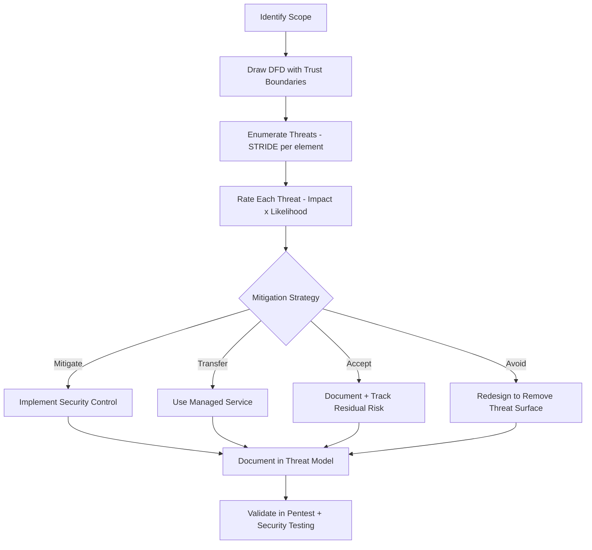

⚡ TL;DR - Threat modeling is the structured analysis of what can go
wrong with a system, who would want it to go wrong, and what you can
do about it. The standard engineering approach: STRIDE (Spoofing,
Tampering, Repudiation, Information Disclosure, Denial of Service,
Elevation of Privilege) applied to a Data Flow Diagram (DFD). Run as
a workshop with developers, architects, and security engineers. Output:
a list of threats with risk ratings and mitigations assigned to the
team. The OWASP Threat Modeling Process and Microsoft Threat Modeling
Tool are the standard references. Threat modeling is most valuable at
the design/architecture stage - before code is written.

---

| #083 | Category: Security | Difficulty: ★★★ |
|:---|:---|:---|
| **Depends on:** | OWASP Top 10, Authentication, Session Management, Secrets Management, IAM, TLS Configuration, SAST, Security Testing in CI/CD, Pentest Methodology | |
| **Used on:** | Red/Blue/Purple Team, DevSecOps Pipeline Design, Enterprise Security Architecture, Security ADR Workshop, SSDLC, Trust Boundary Analysis, Threat Modeling as Universal Risk Analysis | |
| **Related:** | OWASP Top 10, Authentication, Session Management, IAM, TLS Configuration, Pentest Methodology, Enterprise Security Architecture, Trust Boundary Analysis | |

---

### 🔥 The Problem This Solves

**WHY SECURITY REVIEWS ALONE ARE INSUFFICIENT:**

```
THE DISCOVERY-TIMING PROBLEM IN SECURITY:

  Traditional security review timeline:
    Month 1-3: Architecture design (no security input)
    Month 4-8: Development (no security input)
    Month 9: Security review requested
    Month 9: Security team finds: broken authentication design,
              missing authorization model, over-privileged service accounts,
              data flows that cross trust boundaries without validation.
    Month 9: Fix cost is high - fundamental architecture issues.
    Month 10: Security review findings addressed (partially).
    Month 11: Launch.
  
  Threat modeling timeline (correct):
    Month 1: Architecture design → THREAT MODELING WORKSHOP (with security team)
    Finding: "This architecture sends user PII across a trust boundary without
    encryption. The database service has direct internet exposure by design."
    Fix: change the design before a single line of code is written.
    Cost of fix: 1 whiteboard session + architecture revision.
    
    Cost comparison:
      Fix in architecture: hours
      Fix after code is written: days-weeks
      Fix after deployment: weeks-months
      Fix after breach: months + regulatory + reputation
  
WHAT THREAT MODELING FINDS (that code review and pentest miss):

  1. TRUST BOUNDARY VIOLATIONS (design-level):
     "Service A calls Service B across a network boundary with no auth."
     Invisible in code review (each service looks fine in isolation).
     Only visible at the system design level.
  
  2. PRIVILEGE MODEL DESIGN FLAWS:
     "The payment processor has read/write access to the user profile DB
      because the DB credentials are shared."
     A pentest might find this, but a threat model during design prevents it.
  
  3. DATA CLASSIFICATION GAPS:
     "This design stores user GPS location in the same table as session tokens.
      No data retention policy for location data."
     Not a code bug - a design decision that creates privacy liability.
  
  4. MISSING SECURITY CONTROLS:
     "The admin API has no rate limiting, audit logging, or MFA requirement."
     Design-level gap that would require post-hoc remediation if not caught early.

WHEN TO RUN THREAT MODELING:
  - New feature: significant new data flows, new trust boundaries, new integrations
  - Architecture change: moving from monolith to microservices, adding external API
  - Security review before launch: last chance before production
  - Annual review: has the threat landscape changed? new attack techniques?
  
  Who participates:
    - Lead developer (knows what the code actually does)
    - Architect (understands the system design)
    - Product manager (understands business logic and data sensitivity)
    - Security engineer (knows threat techniques and mitigations)
    - DevOps/platform engineer (understands deployment environment)
```

---

### 📘 Textbook Definition

**Threat modeling:** A structured security analysis technique used to
identify, enumerate, and prioritize security threats against a system
or application. The output is a prioritized list of threats with
corresponding mitigations.

**STRIDE:** A threat classification model developed by Microsoft.
Six categories: Spoofing, Tampering, Repudiation, Information Disclosure,
Denial of Service, Elevation of Privilege. Used to systematically
enumerate threats against each element of a Data Flow Diagram.

**DFD (Data Flow Diagram):** A diagram showing how data flows through
a system: data stores, processes, external entities, and data flows
between them. Used in threat modeling to identify where security
controls are needed. Trust boundaries (dashed lines) mark where data
moves between different trust levels (internet to DMZ, DMZ to internal).

**Attack surface:** The sum of different points (attack vectors) where
an unauthorized user can try to enter data to, extract data from, or
exert control over a system. Threat modeling explicitly enumerates
the attack surface.

**PASTA (Process for Attack Simulation and Threat Analysis):** A risk-centric
threat modeling methodology with 7 stages, used for complex enterprise systems.
More thorough than STRIDE, involves business impact analysis.

**LINDDUN:** A threat modeling methodology focused on privacy threats.
Stands for: Linkability, Identifiability, Non-repudiation, Detectability,
Disclosure, Unawareness, Non-compliance. Complements STRIDE for
privacy-critical systems (GDPR, healthcare).

---

### ⏱️ Understand It in 30 Seconds

**One line:**
Threat modeling is a structured workshop where the team asks:
"What could an attacker do to our system? How? What's the impact?
What do we do about it?" - run at design time to find and fix
architectural security issues before code is written.

**One analogy:**
> Threat modeling is like a building security audit run BEFORE
> the building is constructed.
>
> Before designing the floor plan:
> "Where does the cash get stored? (crown jewel identification)"
> "Who can access the server room? (trust boundaries)"
> "What if someone claims to be a delivery person? (spoofing threat)"
> "What if someone steals the building directory? (information disclosure)"
> "What if someone blocks the main entrance? (denial of service)"
>
> Findings during design:
> - "Server room next to public lobby is a poor design. Relocate it."
> - "The building needs two-person access for the vault area."
> These fixes cost nothing to make on a blueprint.
>
> Discovering the same issues AFTER construction:
> - "Server room needs to move" = demolition + reconstruction.
> - "Vault needs 2-person access" = new access control hardware + rewiring.
>
> Threat modeling: audit the blueprint, not the building.

---

### 🔩 First Principles Explanation

**STRIDE methodology applied to a web application:**

```
STRIDE CATEGORIES AND EXAMPLES:

  S - Spoofing Identity
    Definition: Attacker pretends to be another entity.
    Examples:
      - Forging authentication tokens (stolen session cookie)
      - IP address spoofing for rate limit bypass
      - CSRF: attacker triggers requests as authenticated victim
      - Email domain spoofing (SPF/DKIM bypass)
    
    Mitigations:
      - Authentication: verify identity with credentials
      - Input validation: verify source of requests
      - CSRF tokens (synchronizer token pattern)
      - Email: SPF + DKIM + DMARC
  
  T - Tampering with Data
    Definition: Attacker modifies data in transit or at rest.
    Examples:
      - SQL injection: modify database contents
      - MITM: alter API request/response in transit
      - Unauthorized write to file system
      - Modifying signed JWT (without valid signature)
    
    Mitigations:
      - Integrity checks: MAC, digital signatures, checksums
      - Authorization: write access controls
      - Encryption in transit: TLS
      - Parameterized queries (SQL injection prevention)
  
  R - Repudiation
    Definition: Attacker performs an action they can later deny.
    Examples:
      - User deletes own activity logs
      - API call with no logging → "I never made that request"
      - Shared credentials: can't attribute action to specific user
    
    Mitigations:
      - Audit logging: immutable, timestamped, attributed to user
      - Non-repudiation: digital signatures on transactions
      - Separate audit log from application log (different access)
      - Log retention policy + integrity checks on logs
  
  I - Information Disclosure
    Definition: Attacker accesses information they should not.
    Examples:
      - Verbose error messages (stack traces, SQL errors)
      - API endpoint returns more data than requested
      - Unencrypted data at rest
      - Directory listing enabled on web server
      - AWS S3 bucket public-read
    
    Mitigations:
      - Least privilege: return only what's needed
      - Encryption at rest
      - Input validation: no data leakage in error messages
      - API design: field-level authorization
  
  D - Denial of Service
    Definition: Attacker disrupts system availability.
    Examples:
      - DDoS: flood with requests to overwhelm capacity
      - Resource exhaustion: upload 10GB files to fill disk
      - ReDoS: catastrophic regex consuming CPU
      - Hash collision attacks on hash map (Java HashTable pre-2012)
    
    Mitigations:
      - Rate limiting: limit requests per IP/user
      - Input validation: max file size, max string length
      - Resource limits: timeouts, connection pools, circuit breakers
      - AWS Shield / CloudFront WAF for DDoS mitigation
  
  E - Elevation of Privilege
    Definition: Attacker gains more access than intended.
    Examples:
      - SQL injection grants DB admin access
      - Container escape to host system
      - IDOR: user accesses another user's data
      - Horizontal: user A accesses user B's resources
      - Vertical: regular user gains admin access
    
    Mitigations:
      - Principle of least privilege
      - Authorization checks at every data access
      - Sandbox/container security (no privileged mode)
      - Input validation (injection prevention)

DATA FLOW DIAGRAM (DFD) ELEMENTS:

  Element        | Notation    | Description
  ───────────────┼─────────────┼────────────────────────────────
  External entity| Rectangle   | Outside your control (browser, IdP)
  Process        | Circle      | Your code / application logic
  Data store     | Parallel    | Database, file system, cache
  Data flow      | Arrow       | Data movement between elements
  Trust boundary | Dashed line | Where trust changes (internet to app)
  
  Trust boundaries are where most threats occur.
  STRIDE is applied to each element systematically.
```

**Threat modeling DFD example (e-commerce checkout):**

```
THREAT MODELING: E-COMMERCE CHECKOUT FLOW

  DFD:
  
    [Browser] ──→ (Checkout API) ──→ (Payment Service) ──→ [Stripe]
                       │                     │
                       ▼                     ▼
                  [Order DB]           [Payment Log]
  
  Trust boundaries:
    --- Internet boundary: between Browser and Checkout API
    --- Internal boundary: between Checkout API and Payment Service
    --- External boundary: between Payment Service and Stripe

  STRIDE analysis per element:

  Checkout API (Process):
    S: Could attacker submit orders as another user?
       → Verify session token validates order belongs to requester.
    T: Could attacker modify order price (quantity=-1)?
       → Validate price server-side, never trust client-submitted price.
    R: Is every order action logged with user_id?
       → Audit log: order created, payment attempted, order fulfilled.
    I: Does the API return other users' orders?
       → Authorization: orders/123 - verify belongs to requesting user (IDOR check).
    D: Could attacker submit 10,000 checkout requests/minute?
       → Rate limiting: 10 checkout attempts per user per hour.
    E: Could attacker submit orders as admin (elevated role)?
       → JWT role validation: checkout only accepts user role, not admin.

  Output: threat list with severity and mitigation owner.
  
  Example finding:
    THREAT: T-001 - Price tampering in checkout
    STRIDE category: Tampering
    Component: Checkout API → Order DB
    Severity: High
    Description: Client sends order with price included in request body.
      Server trusts the client-submitted price. Attacker can change
      price to $0.01 for any item.
    Mitigation: Server fetches product price from catalog DB on checkout.
      Never trust client-submitted price. Validate total = sum(item_price × qty).
    Owner: Backend team
    Due date: Before launch
```

---

### 🧪 Thought Experiment

**SCENARIO: Threat modeling a new payment microservice:**

```
SYSTEM: New payment processing microservice for a SaaS platform.
STAKEHOLDERS: CTO (sponsor), backend team (implementers), security engineer (facilitator).
DURATION: 2-hour workshop.

WORKSHOP AGENDA:

  0:00-0:15 - Whiteboard the DFD:
    What components exist? Where does data flow?
    Draw trust boundaries.
    
    [Mobile App] ──→ (API Gateway) ──→ (Payment Service) ──→ [Stripe]
                           │                  │
                           ▼                  ▼
                     [Auth Service]      [Payment DB]
                                              │
                                              ▼
                                        [Audit Log Service]
    
    Trust boundaries:
      - Internet / App: between Mobile App and API Gateway
      - External: between Payment Service and Stripe

  0:15-1:30 - STRIDE brainstorm:
    Facilitator: "Let's go through each element. Starting with the API Gateway."
    
    S - Spoofing:
      "Can someone forge API Gateway authentication?"
      → JWT validates at API Gateway. Are all endpoints protected?
      Finding: /health endpoint returns service version (information disclosure).
    
    T - Tampering:
      "Can attacker modify the payment amount in transit?"
      → TLS between client and API Gateway? YES.
      → Between services: is mTLS configured? NO - internal HTTP only.
      Finding: Inter-service calls use plaintext HTTP.
      Mitigation: implement mTLS for internal service communication.
    
    R - Repudiation:
      "If a payment is disputed, can we prove what happened?"
      → Audit Log Service captures all payment events.
      → Are audit logs write-protected? Who can delete audit logs?
      Finding: Audit logs are in same DB as application data. App can delete them.
      Mitigation: Separate audit log to append-only storage (S3 Object Lock).
    
    I - Information Disclosure:
      "What happens if Payment DB is breached?"
      → Full card numbers stored? NO - Stripe tokenization.
      → Last 4 digits and brand stored? YES (necessary for UI).
      → Are payment records encrypted at rest? DB encryption at rest: YES (RDS).
      Finding: Acceptable risk given tokenization + encryption.
    
    D - Denial of Service:
      "Can attacker exhaust Stripe API rate limits?"
      → If attacker can trigger unlimited payment attempts: yes.
      Finding: No per-user rate limit on payment attempts.
      Mitigation: Rate limit payment attempts: 10/minute per user.
    
    E - Elevation of Privilege:
      "Can a user access another user's payment history?"
      → /api/payments/{paymentId}: does it check ownership?
      Finding: Endpoint currently trusts paymentId from URL without ownership check.
      Mitigation: Verify payment.user_id == authenticated_user_id (IDOR fix).

  1:30-2:00 - Prioritize and assign:
    Critical (fix before launch):
      T-001: Inter-service plaintext HTTP → mTLS. Owner: Platform team. Due: 2 weeks.
      E-001: IDOR in payment history → ownership check. Owner: Backend team. Due: 1 week.
      D-001: No rate limit on payment attempts. Owner: Backend team. Due: 1 week.
    
    High (fix within 30 days):
      R-001: Audit logs in shared DB → S3 Object Lock. Owner: Platform team. Due: 30 days.
    
    Low:
      I-001: /health endpoint returns version. Owner: Backend team. Due: next sprint.
    
    TOTAL: 5 findings in 2 hours. Before a single line of code was written for the new endpoints.
```

---

### 🧠 Mental Model / Analogy

> Threat modeling is like a pre-flight safety check for aircraft.
>
> Before every flight: the pilot and engineer run through a checklist.
> Not because the aircraft is broken, but because:
> - Have all possible failure modes been considered?
> - Are all safety systems functioning?
> - Is there anything that could go wrong during this flight?
>
> The checklist is structured (not improvised): STRIDE is the security checklist.
> The DFD is the aircraft blueprint being reviewed.
> The workshop participants are the crew checking the aircraft together.
>
> A threat model doesn't certify the system as "secure."
> It certifies that the team has systematically considered the known threat categories
> and addressed them appropriately.
>
> "We reviewed our design against STRIDE and found 8 threats.
>  We've mitigated 6 and accepted 2 with documented rationale."
> = Evidence-based security decision-making, not "I think it's secure."

---

### 📶 Gradual Depth - Five Levels

**Level 1 - What it is (anyone can understand):**
Threat modeling is a team workshop where you draw your system on a whiteboard and ask: "If I were an attacker, what would I target? What could go wrong?" The output: a list of security risks and how to fix them, ideally found at design time (when they're cheapest to fix).

**Level 2 - How to use it (junior developer):**
Run a STRIDE workshop: draw a DFD showing your system's components and data flows. For each element, ask six questions: Can someone fake identity here? Can data be tampered? Can actions be denied? Can private data leak? Can availability be disrupted? Can privileges be escalated? Each "yes" is a threat. Assign severity (CVSS or risk rating) and an owner/deadline for each mitigation.

**Level 3 - How it works (mid-level engineer):**
The structured process: (1) decompose the system into a DFD (external entities, processes, data stores, data flows, trust boundaries), (2) identify threats per element using STRIDE, (3) rate each threat (impact × likelihood), (4) identify mitigations (technical controls that reduce likelihood or impact), (5) produce a threat model document that becomes part of the security architecture record. Trust boundaries are the highest-value focus: threats are most likely where data crosses trust levels. Tools: Microsoft Threat Modeling Tool (free, STRIDE + DFD), OWASP Threat Dragon (web-based, open-source), draw.io with STRIDE annotations.

**Level 4 - Why it was designed this way (senior/staff):**
STRIDE was designed by Microsoft in the 1990s as a systematic way to enumerate threats for software systems. The six categories cover the full CIA+AAA security model: Spoofing (authentication), Tampering (integrity), Repudiation (non-repudiation), Information Disclosure (confidentiality), Denial of Service (availability), Elevation of Privilege (authorization). The DFD provides the structural decomposition needed to apply STRIDE systematically - without a diagram, threat modeling becomes an unstructured brainstorm that misses components. The workshop format is important: no single person knows the full system well enough to identify all threats. Developers know what the code does; architects know the system structure; security engineers know the threat techniques; product managers know the business context. Cross-functional collaboration finds threats that any single perspective would miss.

**Level 5 - Mastery (distinguished engineer):**
Advanced threat modeling: attack trees (hierarchical representation of attack paths with AND/OR nodes representing combinations of conditions), MITRE ATT&CK framework integration (map identified threats to specific TTPs used by real threat actors), risk quantification (FAIR model: Factor Analysis of Information Risk - translate threats into monetary expected loss for business-level prioritization). At enterprise scale: threat model as living documentation (updated as system evolves, version-controlled in git alongside architecture diagrams), threat model review gates in CI/CD (enforce that threat model was updated when significant architectural changes are merged). Automated threat modeling: Microsoft Threat Modeling Tool generates threats from DFD automatically. pytm (Python library) generates DFD programmatically from code and outputs STRIDE analysis. Threat modeling limitations: effectiveness depends heavily on facilitator skill and participant domain knowledge; cannot discover threats the team isn't aware exist; must be complemented by automated scanning and external security review.

---

### ⚙️ How It Works (Mechanism)

```
THREAT MODELING PROCESS:

  1. SCOPE: What system, what session duration, who participates?
  
  2. DIAGRAM: Draw the DFD on whiteboard or Miro.
     - External entities (rectangles): browser, mobile app, IdP, Stripe
     - Processes (circles): API services, background jobs
     - Data stores (parallel lines): DB, cache, S3
     - Data flows (arrows): API calls, DB queries
     - Trust boundaries (dashed): internet/internal, internal/external
  
  3. IDENTIFY THREATS:
     For each element: apply STRIDE.
     Per threat: describe the attack scenario.
     Rate each threat: Low/Medium/High/Critical.
  
  4. MITIGATE:
     For each threat: choose mitigation strategy.
     - Mitigate: implement a security control
     - Transfer: use a service that handles it (Stripe for PCI)
     - Accept: documented, with rationale and residual risk
     - Avoid: redesign to remove the threat surface
     Assign owner and due date.
  
  5. DOCUMENT: Threat model document.
     Store in version control. Update when system changes.
  
  6. VALIDATE: Pentest and security testing verify mitigations work.
```



---

### 💻 Code Example

**Threat model document template (Markdown for git storage):**

```markdown
# Threat Model: Payment Service v1.0

**Date:** 2024-01-15
**Participants:** Jane (Backend Lead), Bob (Architect), 
                  Alice (Security), Carol (PM)
**Scope:** New payment processing microservice

## System Overview

Payment Service handles checkout and payment processing.
Integrates with Stripe for card processing.
Internal service, accessible via API Gateway only.

## Data Flow Diagram

[DFD diagram here - link to draw.io or embedded Mermaid]

## Trust Boundaries

- TB-1: Internet / API Gateway (internet traffic enters here)
- TB-2: API Gateway / Internal Services (internal microservice boundary)
- TB-3: Payment Service / Stripe (external payment processor)

## Threat Register

| ID | STRIDE | Threat | Component | Risk | Mitigation | Owner | Status |
|----|--------|--------|-----------|------|-----------|-------|--------|
| T-001 | E | IDOR: user can access other user's payments | GET /payments/{id} | High | Add ownership check: payment.user_id == auth_user_id | Backend | Mitigated |
| T-002 | T | Plaintext HTTP between internal services | Checkout API→Payment | High | Implement mTLS for service-to-service calls | Platform | In Progress |
| T-003 | D | No rate limit on payment attempts → DoS | Checkout API | High | Rate limit: 10 payment attempts/min/user | Backend | Mitigated |
| T-004 | R | Audit logs deletable by application | Audit Log DB | Medium | Move audit logs to S3 Object Lock | Platform | Planned |
| T-005 | I | /health endpoint exposes service version | API Gateway | Low | Remove version from health response | Backend | Accepted (low risk, internal-only) |

## Residual Risk

T-005 accepted: /health endpoint version exposure.
Rationale: endpoint only accessible from internal network.
Risk: attacker with internal access learns service version.
Accepted because: internal network is monitored; version disclosure
provides minimal attack advantage. Reviewed by: Alice (Security).
```

---

### ⚖️ Comparison Table

| Methodology | Focus | Complexity | Best For |
|:---|:---|:---|:---|
| **STRIDE** | Threat categories (6) | Low-Medium | Feature/service threat modeling, developer-friendly |
| **PASTA** | Risk-centric (7 stages) | High | Enterprise, complex systems, business impact analysis |
| **LINDDUN** | Privacy threats | Medium | GDPR-sensitive systems, health data, personal data |
| **Attack Trees** | Attack path analysis | Medium | Specific high-value assets, red team planning |
| **MITRE ATT&CK** | Real-world TTPs | High | Mature security programs, detection engineering |

---

### ⚠️ Common Misconceptions

| Misconception | Reality |
|:---|:---|
| "Threat modeling is a security team activity, not a developer activity." | Developers are the most important participants in a threat modeling workshop because they know what the code actually does. A security engineer knows threat patterns and attack techniques but doesn't know the application's specific data flows, edge cases, and implementation choices. A developer knows the implementation but may not know the threat patterns. Threat modeling is most effective as a cross-functional workshop. In many high-security organizations (Google, Amazon, Microsoft), threat modeling is a developer responsibility: developers produce the threat model, security engineers review it. The security team CANNOT threat model systems they didn't build - they don't have enough context. |
| "We need a complete, perfect DFD before starting threat modeling." | The DFD does not need to be perfect or complete to start threat modeling. A rough whiteboard sketch with the major components and data flows is sufficient to begin. Starting with a perfect DFD is a form of analysis paralysis. Better approach: draw what you know, start STRIDE analysis, update the DFD as you discover gaps. The DFD and threat analysis are iterative. The goal is not a perfect diagram - it's a working list of threats and mitigations. Many teams effectively threat model on a whiteboard with no formal DFD tool. |

---

### 🚨 Failure Modes & Diagnosis

**Threat modeling anti-patterns:**

```
ANTI-PATTERN 1: Threat model as security theater

  Symptom: Threat model produced (PDF attached to Jira epic).
  No findings tracked. No mitigations implemented.
  2 years later: pentest finds the exact threats identified in the model.
  
  Diagnosis: Threat model done to satisfy process requirement.
  No follow-through.
  
  Fix:
    - Findings → Jira tickets with P1 priority and owner.
    - Security gate: no launch without Critical/High findings closed
      or formally risk-accepted.
    - Threat model review at launch readiness.
    - Track: "percent of threat model findings addressed" as a metric.

ANTI-PATTERN 2: Threat model run too late

  Symptom: "We need to run a threat model before launch."
  System is 90% built. Code is written.
  Threat model finds: fundamental authentication design flaw.
  
  Diagnosis: Threat model at end of development = code review, not design review.
  Fundamental design issues require architecture changes = significant rework.
  
  Fix:
    - Define "security review gate" at the design stage.
    - Requirement: threat model for any new service/significant feature
      must be completed before coding begins.
    - Output of threat model = input to sprint planning (security tickets created).

ANTI-PATTERN 3: Threat model without trust boundaries

  Symptom: Threat model lists OWASP Top 10 threats generically.
  Not specific to THIS system's design.
  Misses system-specific threats.
  
  Diagnosis: STRIDE applied without DFD. Generic threat list,
  not system-specific analysis.
  
  Fix:
    - Always start with the DFD.
    - Explicitly draw trust boundaries.
    - Apply STRIDE to each specific element and data flow.
    - The goal: threats that are specific to this system's design,
      not a generic OWASP checklist.
    - Good signal: "Would this threat apply to a different system?" 
      If yes: too generic. Dig deeper into this system's specifics.
```

---

### 🔗 Related Keywords

**Prerequisites:**
- `OWASP Top 10` - common web threat categories
- `Authentication` - spoofing threats context
- `IAM` - privilege escalation context

**Builds on this:**
- `Red/Blue/Purple Team` - executing identified threats
- `Security ADR Workshop` - documenting security decisions
- `Trust Boundary Analysis` - deep trust boundary analysis
- `Threat Modeling as Universal Risk Analysis` - applying TM to broader contexts

---

### 📌 Quick Reference Card

```
┌──────────────────────────────────────────────────────────┐
│ STRIDE       │ S-Spoofing T-Tampering R-Repudiation      │
│              │ I-Info Disclosure D-DoS E-Elevation       │
├──────────────┼───────────────────────────────────────────┤
│ DFD ELEMENTS │ External entity, Process, Data store,     │
│              │ Data flow, Trust boundary (dashed line)   │
├──────────────┼───────────────────────────────────────────┤
│ WHEN TO RUN  │ Design stage (before coding) - highest ROI│
│              │ New service, new integration, pre-launch  │
├──────────────┼───────────────────────────────────────────┤
│ PARTICIPANTS │ Developer + Architect + Security + PM     │
│ DURATION     │ 2-4 hours for typical service             │
├──────────────┼───────────────────────────────────────────┤
│ OUTPUT       │ Threat register: ID, STRIDE, threat,      │
│              │ component, risk, mitigation, owner, status│
└──────────────────────────────────────────────────────────┘
```

---

### 💎 Transferable Wisdom

**Reusable Engineering Principle:**
"Structured enumeration beats creative brainstorming for finding security issues."
The value of STRIDE is not that it finds threats better than intuition.
The value is that it finds threats systematically - without relying on
any individual's creative inspiration.
Without structure: the team identifies threats they already know to worry about.
Threats in their blind spots remain undiscovered.
With STRIDE: every element is analyzed against all six categories.
When the team reaches "R - Repudiation" for the audit log service:
"Wait - can the application delete its own audit logs? That's a repudiation risk."
This specific question is unlikely to arise in an unstructured brainstorm.
It's easy to overlook because the application writing audit logs seems normal.
The STRIDE framework surfaces it by asking: "What happens if actions can be denied?"
The principle: checklists and structured frameworks catch what intuition misses.
Aviation: pre-flight checklists catch the "obvious" steps that experienced pilots skip
under cognitive load.
Medicine: surgical safety checklists reduced wrong-site surgeries.
Security: STRIDE catches the security considerations that developers, while focused
on building features, naturally deprioritize.
Use structured frameworks not as a substitute for thinking, but as a tool
for disciplined, complete thinking. "Did we ask the question?" is more important
than "Do we intuitively feel comfortable?"

---

### 💡 The Surprising Truth

STRIDE was developed by Microsoft in 1999, inside their Security team.
It was used internally for years before it became the industry standard.

Why it became influential: Microsoft Security Response Center studied what
types of vulnerabilities were being discovered in Microsoft products.
The data showed that vulnerabilities fell into consistent, repeatable categories
- exactly the six categories that STRIDE names.

The surprising truth: STRIDE is an empirical framework based on what
attacks actually happen, not a theoretical model of what could theoretically happen.

The modern validation: OWASP Top 10 maps closely to STRIDE categories.
MITRE ATT&CK tactics map to STRIDE categories.
CVE vulnerability categories map to STRIDE categories.

Spoofing: OWASP Broken Authentication (A07)
Tampering: OWASP Injection (A03), Security Misconfiguration (A05)
Information Disclosure: OWASP Cryptographic Failures (A02), IDOR (A01)
Denial of Service: OWASP (security-focused DoS patterns)
Elevation of Privilege: OWASP Broken Access Control (A01)

The fact that a 1999 threat classification framework still accurately describes
2024 vulnerability patterns tells you something important: the fundamental
categories of what attackers want to do to software systems have not changed.
The specific techniques evolve (SQL injection → NoSQL injection → deserialization).
The categories remain stable.
Threat modeling frameworks that stand the test of 25 years are worth learning deeply.

---

### ✅ Mastery Checklist

**You've mastered this when you can:**
1. **LEAD** a STRIDE threat modeling workshop: draw a DFD, apply STRIDE to
   each element, identify threats, rate severity, assign mitigations and owners.
2. **IDENTIFY** the trust boundaries in a system diagram and explain why
   they're the highest-risk points for STRIDE analysis.
3. **PRODUCE** a threat register with all required fields: ID, STRIDE category,
   threat description, affected component, risk rating, mitigation, owner, status.
4. **DISTINGUISH** between Spoofing (identity), Tampering (integrity),
   Repudiation (non-repudiation), Information Disclosure (confidentiality),
   DoS (availability), and Elevation of Privilege (authorization) threats.

---

### 🎯 Interview Deep-Dive

**Q: Explain STRIDE threat modeling. How would you run a threat
modeling session for a new microservice?**

*Why they ask:* Tests whether candidate knows structured security analysis beyond
reactive vulnerability scanning. Important for senior/lead roles.

*Strong answer covers:*
- STRIDE categories with examples:
  Spoofing (fake identity - CSRF, token forgery, IP spoofing)
  Tampering (modify data - SQL injection, MITM, unauthorized writes)
  Repudiation (deny actions - missing audit logs, shared credentials)
  Information Disclosure (data leak - verbose errors, IDOR, S3 public bucket)
  Denial of Service (disrupt availability - DDoS, resource exhaustion, ReDoS)
  Elevation of Privilege (gain more access - IDOR, privilege escalation, container escape)
- DFD: draw external entities, processes, data stores, data flows, trust boundaries.
  Trust boundaries are where most threats occur.
- Workshop process: 2-4 hours. Participants: developer, architect, security engineer, PM.
  Step 1: draw DFD (15 min).
  Step 2: STRIDE analysis per element (60-90 min).
  Step 3: rate threats + assign mitigations + owners (30-45 min).
  Output: threat register in git with owner and deadline per finding.
- When to run: design stage (before coding). Cost of fix at design: hours.
  After coding: days-weeks. After deployment: weeks-months.
- Tools: Microsoft Threat Modeling Tool (free), OWASP Threat Dragon, draw.io.
  Or just a whiteboard - don't let tool selection block running the session.
- Anti-pattern: threat model done once at launch, never updated.
  Best practice: update threat model when significant architectural changes occur.
  Store alongside architecture diagrams in version control.