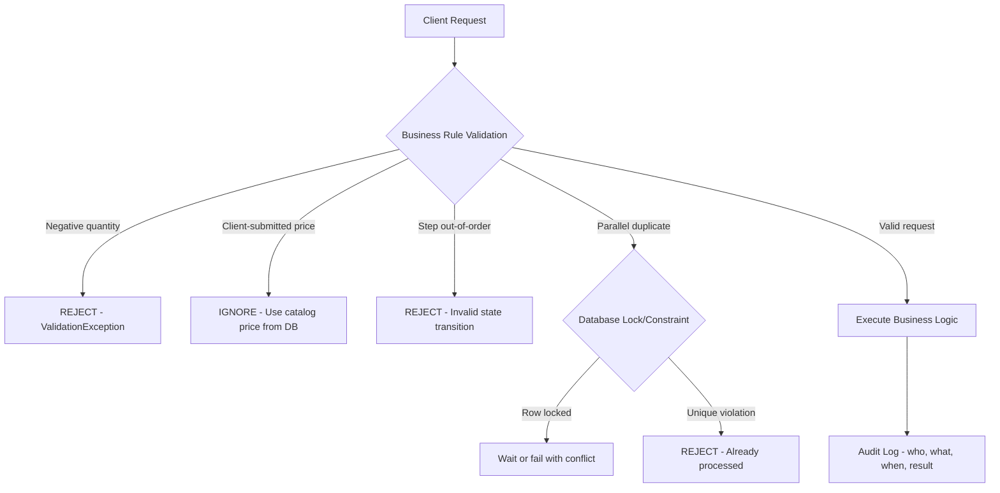

⚡ TL;DR - Business logic vulnerabilities are security flaws in the
application's logic and workflow design - not in syntax, injection, or
standard vulnerability patterns. They cannot be detected by SAST tools
or generic scanners because they require understanding of what the
application is SUPPOSED to do. Classic examples: negative quantities in
shopping carts (earn money), price manipulation (trust client-submitted
price), workflow bypass (skip payment step), parallel request races
(double-spend), referral abuse (self-referral), and multi-account exploitation
(same user creates multiple accounts to bypass limits). Found through:
manual penetration testing, abuse case analysis during design, and business-aware
security review.

---

| #084 | Category: Security | Difficulty: ★★★ |
|:---|:---|:---|
| **Depends on:** | OWASP Top 10, Authentication, Session Management, Secrets Management, IAM, TLS Configuration, SAST, Pentest Methodology, Threat Modeling | |
| **Used by:** | Insufficient Logging Anti-Pattern, Responsible Disclosure + Bug Bounty, DevSecOps Pipeline Design, SSDLC | |
| **Related:** | OWASP Top 10, Authentication, Session Management, IAM, Pentest Methodology, Threat Modeling, Insufficient Logging Anti-Pattern, Responsible Disclosure | |

---

### 🔥 The Problem This Solves

**WHY AUTOMATED SECURITY TOOLS MISS BUSINESS LOGIC BUGS:**

```
THE SEMANTIC GAP PROBLEM:

  SAST tool (Semgrep/CodeQL) can find:
    "This function calls executeQuery() with a string that may contain
     user input without parameterization → possible SQL injection."
    
    The tool understands SYNTAX and PATTERNS. It knows what a SQL injection
    looks like in code.
  
  SAST tool CANNOT find:
    "The checkout API accepts quantity=-100 in the request body.
     This causes a negative subtotal, which is applied as a credit
     to the user's account, effectively paying the user to buy items."
    
    The tool does not know that quantity should be positive.
    The tool does not know that negative subtotals are unexpected.
    The code is syntactically correct. No SQL injection. No XSS.
    The bug is semantic - about what the code means, not how it's written.
  
AUTOMATED SECURITY TOOLS VS BUSINESS LOGIC:

  Tool                | Finds technical flaws | Finds logic flaws
  ─────────────────────┼──────────────────────┼──────────────────
  SAST (Semgrep)       | Yes                  | No
  SCA (Snyk)          | Yes (CVE only)        | No
  DAST (OWASP ZAP)    | Partially            | No
  Pentest (manual)     | Yes                  | Yes (best option)
  Abuse case analysis  | N/A                  | Yes (at design time)
  
BUSINESS LOGIC BUG IMPACT (real world):

  E-commerce negative quantity (multiple reports in bug bounties):
    - Buy item with quantity=-1: receive refund for an item not purchased.
    - Multiply by large number: arbitrary credit accumulation.
    - Impact: unlimited financial loss for the merchant.
  
  Coupon code stacking (common in e-commerce):
    - Apply 50% off coupon. Apply another 50% off coupon.
    - Expected: "Only one coupon allowed." Actually: both apply sequentially.
    - $100 item → $50 (first coupon) → $25 (second coupon).
    - Intent: one coupon per order. Bug: no enforcement in business logic.
  
  Account verification bypass (seen in multiple platforms):
    - Register account with email A.
    - Change email to B before verifying.
    - Now verify the email change (verification for B).
    - Result: account exists with verified email B. Email A never verified.
    - But: attacker registered with email A (which they don't own),
      bypassing ownership verification.
  
  Password reset race condition:
    - Request two password reset tokens simultaneously.
    - Both tokens are valid (no single-use enforcement race).
    - Attacker intercepts one reset email, uses both tokens.
    - Or: legitimate user uses token 1, attacker uses token 2 before it expires.
    
  Referral program abuse:
    - Referral program: "Refer a friend, get $10."
    - Attacker creates 1000 fake accounts, refers them all from one master account.
    - Earns $10,000 in referral credit without any legitimate referrals.
    - Enforcement failed: no IP deduplication, no email domain checks.
```

---

### 📘 Textbook Definition

**Business logic vulnerability:** A security flaw that allows an attacker
to misuse an application by exploiting legitimate but improperly restricted
functionality. The code itself may function "correctly" according to its
implementation - but the business rules and constraints are not properly
enforced. Unlike injection vulnerabilities, business logic flaws require
understanding of the intended system behavior to identify and exploit.

**Abuse case:** The counterpart to a use case. A use case describes what
a legitimate user does. An abuse case describes what a malicious user
does - an intentional misuse of the system. Abuse cases are the foundation
of business logic security testing.

**State machine bypass:** An attack where an attacker skips or reorders
workflow steps that are intended to execute in a specific sequence.
Example: checkout workflow requires addToCart → enterPayment → confirm.
Attacker calls confirm directly without enterPayment step.

**Workflow bypass:** Accessing functionality intended to be available only
after completing prerequisite steps. Related to state machine bypass.
Example: accessing a paid feature without completing the payment step.

**Race condition (TOCTOU in business logic):** Multiple concurrent requests
that exploit a time window between a check and an action. Example:
check account balance (sufficient) → credit is processed by both concurrent
requests before either debit is committed → double spend.

---

### ⏱️ Understand It in 30 Seconds

**One line:**
Business logic vulnerabilities are when the code does exactly what
it was programmed to do - but the programmer didn't think about
what a creative attacker would do with perfectly valid inputs.

**One analogy:**
> A bank's ATM security policy: "Maximum $500 withdrawal per transaction."
>
> Technical implementation: single transaction limit enforced correctly.
> Business logic bug: no limit on NUMBER of transactions per minute.
>
> Attack: make 1000 transactions of $500 each in 10 minutes.
> The ATM policy says max $500 per transaction. Technically correct.
> But the business intent was max $500 per day, not per transaction.
>
> The code has no bug. The SQL has no injection. The crypto is correct.
> The business rule was never implemented.
>
> The ATM perfectly executes 1000 transactions. The bank loses $500,000.
> Business logic vulnerability: the system did exactly what it was told.
> What it was told was wrong.

---

### 🔩 First Principles Explanation

**Categories of business logic vulnerabilities:**

```
CATEGORY 1: INSUFFICIENT INPUT VALIDATION (BUSINESS RULES)

  BAD - trusting client-submitted values without business validation:
    
    // Shopping cart checkout:
    POST /api/checkout
    {
      "items": [
        {"product_id": "PROD-123", "quantity": -100, "unit_price": 49.99}
      ]
    }
    
    // Server code:
    BigDecimal total = items.stream()
        .map(item -> item.getUnitPrice()
            .multiply(BigDecimal.valueOf(item.getQuantity())))
        .reduce(BigDecimal.ZERO, BigDecimal::add);
    // total = 49.99 × (-100) = -$4,999.00
    // "Charge" -$4,999.00 → credit $4,999 to user's account!
  
  GOOD - enforce business rules server-side:
    
    // Validate each item:
    for (OrderItem item : items) {
        if (item.getQuantity() <= 0) {
            throw new ValidationException(
                "Quantity must be positive: " + item.getQuantity());
        }
        if (item.getQuantity() > 999) {
            throw new ValidationException("Quantity exceeds maximum: 999");
        }
        // NEVER trust client-submitted price:
        BigDecimal catalogPrice = productCatalog.getPrice(item.getProductId());
        item.setUnitPrice(catalogPrice);  // Always use server-side price
    }

CATEGORY 2: WORKFLOW/STATE MACHINE BYPASS

  BAD - no state validation in workflow:
    
    // Premium feature:
    @PostMapping("/api/premium/feature")
    public Response usePremiumFeature(@AuthPrincipal User user) {
        // BUG: only checks if user has premium_feature in session.
        // No check that payment was actually completed.
        if (user.hasFeature("premium_feature")) {
            return executePremiumFeature(user);
        }
        throw new UnauthorizedException();
    }
    
    // Attack: manipulate session to add premium_feature flag without paying.
    // Or: the session flag is set BEFORE payment confirmation is received.

  GOOD - verify payment status from authoritative source:
    
    @PostMapping("/api/premium/feature")
    public Response usePremiumFeature(@AuthPrincipal User user) {
        // Check subscription from database (source of truth),
        // not session flag:
        Subscription subscription =
            subscriptionRepository.findActiveByUserId(user.getId());
        
        if (subscription == null || subscription.isExpired()) {
            throw new PaymentRequiredException("Active subscription required");
        }
        return executePremiumFeature(user);
    }

CATEGORY 3: RACE CONDITIONS IN BUSINESS LOGIC

  BAD - check-then-act without atomicity:
    
    // Redeem referral credit:
    @Transactional
    public void redeemCredit(UUID userId, BigDecimal amount) {
        User user = userRepo.findById(userId);
        if (user.getCredit().compareTo(amount) < 0) {
            throw new InsufficientCreditException();
        }
        // RACE CONDITION: another thread can pass the check concurrently
        user.setCredit(user.getCredit().subtract(amount));
        userRepo.save(user);
    }
    // Two concurrent requests both pass the balance check, both deduct.
    // Balance goes negative (double spend).
  
  GOOD - use database-level atomic operations:
    
    @Transactional(isolation = Isolation.SERIALIZABLE)
    public void redeemCredit(UUID userId, BigDecimal amount) {
        // Atomic SELECT FOR UPDATE prevents concurrent reads:
        User user = userRepo.findByIdForUpdate(userId);  // SELECT FOR UPDATE
        // SELECT * FROM users WHERE id=? FOR UPDATE
        // Other transactions wait until this one completes.
        
        if (user.getCredit().compareTo(amount) < 0) {
            throw new InsufficientCreditException();
        }
        user.setCredit(user.getCredit().subtract(amount));
        userRepo.save(user);
    }
    // Or: use database-level atomic UPDATE:
    // UPDATE users SET credit = credit - ? WHERE id = ? AND credit >= ?
    // Check rows_affected == 1. If 0: insufficient credit.

CATEGORY 4: COUPON/DISCOUNT ABUSE

  BAD - no proper state tracking for one-time codes:
    
    // Apply coupon:
    @Transactional
    public BigDecimal applyCoupon(UUID orderId, String code) {
        Coupon coupon = couponRepo.findByCode(code);
        if (coupon == null || coupon.isExpired()) {
            throw new InvalidCouponException();
        }
        // BUG: no check if coupon already applied to THIS order,
        //      or if user has used a coupon before.
        return calculateDiscount(coupon, orderTotal);
    }
    
    // Attack: call applyCoupon multiple times in parallel → 
    // coupon applied multiple times (race condition + logic flaw).
  
  GOOD - enforce uniqueness constraints:
    
    @Transactional(isolation = Isolation.SERIALIZABLE)
    public BigDecimal applyCoupon(UUID orderId, String code, UUID userId) {
        // 1. Validate coupon:
        Coupon coupon = couponRepo.findByCode(code);
        if (coupon == null || coupon.isExpired()) {
            throw new InvalidCouponException();
        }
        // 2. Check per-user usage limit:
        int usageCount = couponUsageRepo.countByUserAndCoupon(userId, coupon.getId());
        if (usageCount >= coupon.getMaxUsagePerUser()) {
            throw new CouponAlreadyUsedException();
        }
        // 3. Record usage BEFORE applying (atomic):
        try {
            couponUsageRepo.save(new CouponUsage(userId, coupon.getId(), orderId));
            // UNIQUE constraint on (user_id, coupon_id) prevents parallel inserts.
        } catch (DataIntegrityViolationException e) {
            throw new CouponAlreadyUsedException();
        }
        return calculateDiscount(coupon, orderTotal);
    }
```

---

### 🧪 Thought Experiment

**SCENARIO: Bug bounty finds in a typical e-commerce platform:**

```
SCENARIO: Bug bounty program open for 30 days. Platform: marketplace SaaS.

BUG BOUNTY FINDINGS (top submissions by impact):

  CRITICAL - Free premium subscriptions via plan downgrade race:
    Report: User subscribes to Pro plan ($99/month).
    Immediately cancels and subscribes to Free plan.
    Pro features: still accessible (session cache not invalidated).
    On next request: session re-fetches from DB → Free features only.
    
    Race window: 2-5 seconds after plan downgrade.
    Attack: subscribe → cancel → access Pro feature in race window.
    Or: share account session cookies between two devices:
    Device 1: downgrade to Free (database updated).
    Device 2: still has Pro session (not invalidated).
    
    Fix: subscription-sensitive features re-validate from DB on each request.
    DO NOT rely on session cache for subscription status.
    Invalidate all sessions immediately on subscription change.

  HIGH - Negative refund via credit note manipulation:
    Report: User buys $50 item. Returns it → receives $50 credit.
    User finds: credit can be applied as negative to another order.
    POST /api/orders/{id}/apply-credit {"amount": -50}
    Result: $50 is ADDED to the order (negative credit application).
    User applies "-$50 credit" to a $0 test order → $50 balance increase.
    
    Fix: Validate credit amount is positive. Apply business rule server-side.

  MEDIUM - Account takeover via email change without verification:
    Report: User changes email address. New email receives verification link.
    Before clicking verification: log in with old email (still works).
    Change email again (to attacker-controlled email).
    Use old session to verify the attacker's email.
    Now email on account = attacker's email. Password reset goes to attacker.
    
    Fix: Email change flow must:
    1. Mark account as "pending_email_change."
    2. Send verification to NEW email.
    3. If not verified within 24 hours: revert to old email.
    4. Do NOT allow a second email change while verification is pending.
    5. Invalidate all sessions when email changes.

PATTERN: These findings have NO syntax errors. No SQL injection. No XSS.
All code functions "correctly" according to its implementation.
The bugs are in the business rules that were never implemented.
```

---

### 🧠 Mental Model / Analogy

> Business logic vulnerabilities are the security equivalent of loopholes
> in legal contracts.
>
> A contract says: "Employee cannot work for a competitor for 2 years."
> The loophole: the contract didn't say anything about founding a competitor.
> The contract is "correct" - it does exactly what it says.
> The business intent (prevent competitive exploitation) was not fully captured.
>
> Software analogy:
> Code says: "User can apply one coupon per order."
> Loophole: code checks coupon count BEFORE the parallel request adds the record.
> Code is "correct" - it checks the count and applies the coupon if count < 1.
> Business intent (one coupon per order) not fully captured (race condition gap).
>
> Legal fix: hire a careful lawyer to close loopholes.
> Software fix: hire security engineers and run abuse case analysis.
>
> The defense: think like an adversarial user, not a cooperative user.
> "How would I exploit this if I were trying to?" rather than
> "Does this work as expected for normal users?"

---

### 📶 Gradual Depth - Five Levels

**Level 1 - What it is (anyone can understand):**
Business logic vulnerabilities are when users discover they can do things the system wasn't designed to allow - not by hacking the code, but by using the features in unexpected ways. Like a bank that lets you set a payment date in the past (technically valid) but never checks if that creates a free transaction window.

**Level 2 - How to use it (junior developer):**
Always validate business rules SERVER-SIDE, never trust client-submitted business-critical values: quantity must be positive, price must match the catalog, order must be in a valid state for the requested operation. Use database-level constraints (UNIQUE, CHECK constraints) for rules that must hold atomically. For multi-step workflows: verify state transitions are valid (can't skip payment step to reach paid state).

**Level 3 - How it works (mid-level engineer):**
Business logic vulnerabilities require domain knowledge to find - you must understand what the application is supposed to do before you can recognize what it's being misused for. Testing approach: abuse case analysis (for every use case, write the abuse case: negative quantity, skipped step, parallel requests). Race conditions in business logic: check-then-act sequences require atomic database operations (SELECT FOR UPDATE, pessimistic locking, or conditional UPDATE). Workflow bypass: state machine validation at every step (don't allow final step without validating all prerequisite steps completed in the database).

**Level 4 - Why it was designed this way (senior/staff):**
Business logic bugs are architectural security failures: they stem from missing validation, missing state management, and missing threat modeling. Developers naturally write code for the happy path (how legitimate users use the system). Abuse cases require deliberate effort to think adversarially. The lack of automation: automated tools can detect injection patterns because injection follows syntactic patterns. Business logic flaws are semantic - they require understanding what a value MEANS (quantity should be positive means something because we know items can't be negative) not just what its type is (int is a valid type for negative numbers). This is why manual security testing (pentest, bug bounty) is irreplaceable for business logic security.

**Level 5 - Mastery (distinguished engineer):**
Advanced business logic defense: formal state machine implementation (encode all valid state transitions in a state machine, enforce transitions only via state machine methods, impossible states are architecturally prevented). Financial transaction integrity: event sourcing for financial events (append-only event log, balance computed from events, idempotency keys prevent duplicate processing). For race conditions at scale: database-level optimistic concurrency (version field, compare-and-swap), or use CRDT (Conflict-free Replicated Data Types) for distributed systems where strict serialization is impractical. Abuse detection: behavioral analysis (ML-based anomaly detection) on transaction patterns catches logic abuse that rule-based systems miss. Referral abuse: velocity limits, social graph analysis (are all referrals from the same IP subnet?), device fingerprinting, SMS/phone verification to limit fake accounts.

---

### ⚙️ How It Works (Mechanism)

```
BUSINESS LOGIC VULNERABILITY TAXONOMY:

  Vulnerability Type      | Example              | Prevention
  ────────────────────────┼──────────────────────┼──────────────────────────
  Negative values         | quantity=-100        | Server-side min/max check
  Price manipulation      | price=$0.01          | Always use catalog price
  Workflow bypass         | skip payment step    | State machine validation
  Coupon abuse            | apply N times        | DB unique constraint + lock
  Race condition          | double spend         | SELECT FOR UPDATE / atomic
  Referral abuse          | self-referral        | Email/IP dedup + limits
  Account limit bypass    | multiple accounts    | Device/email/IP limits
  Privilege escalation    | admin via user input | Role from server, not input
  Step sequence bypass    | out-of-order steps   | State verification per step
```



---

### 💻 Code Example

**Atomic discount application preventing race condition:**

```java
// DiscountService.java - preventing coupon race condition abuse
@Service
@Transactional
public class DiscountService {
    
    // BAD: check-then-act without atomicity
    // (susceptible to concurrent abuse)
    public void applyCouponBad(UUID userId, String couponCode, UUID orderId) {
        Coupon coupon = couponRepo.findByCode(couponCode);
        
        // BUG: this check and the insert below are NOT atomic
        int usageCount = couponUsageRepo.countByUserAndCoupon(userId, coupon.getId());
        if (usageCount >= 1) {
            throw new CouponAlreadyUsedException();
        }
        // Two parallel requests can BOTH pass this check
        couponUsageRepo.save(new CouponUsage(userId, coupon.getId(), orderId));
        // Both inserts succeed → coupon applied twice
    }
    
    // GOOD: use database UNIQUE constraint as the last line of defense
    public void applyCoupon(UUID userId, String couponCode, UUID orderId) {
        Coupon coupon = couponRepo.findByCode(couponCode)
            .orElseThrow(() -> new InvalidCouponException("Code not found"));
        
        // Validate: coupon not expired:
        if (coupon.getExpiresAt().isBefore(Instant.now())) {
            throw new InvalidCouponException("Coupon expired");
        }
        
        // Atomic insert: unique constraint (user_id, coupon_id) at DB level
        // If two parallel requests both try to insert: second fails with
        // DataIntegrityViolationException (duplicate key).
        CouponUsage usage = new CouponUsage(userId, coupon.getId(), orderId,
                                             Instant.now());
        try {
            couponUsageRepo.save(usage);
            // If we reach here: we are the first (and only) insert.
        } catch (DataIntegrityViolationException e) {
            // Another concurrent request already inserted this record.
            throw new CouponAlreadyUsedException(
                "Coupon already applied to this order");
        }
        
        // Now safe to apply the discount (unique constraint ensures exclusivity)
        BigDecimal discount = calculateDiscount(coupon, getOrderTotal(orderId));
        orderRepo.applyDiscount(orderId, discount);
    }
}

// Database schema:
// CREATE TABLE coupon_usages (
//   id UUID PRIMARY KEY,
//   user_id UUID NOT NULL,
//   coupon_id UUID NOT NULL,
//   order_id UUID NOT NULL,
//   used_at TIMESTAMP NOT NULL,
//   UNIQUE (user_id, coupon_id)  -- enforces one coupon per user at DB level
// );
```

---

### ⚖️ Comparison Table

| Vulnerability Type | SAST Detection | DAST Detection | Pentest Detection | Abuse Case Analysis |
|:---|:---|:---|:---|:---|
| **SQL Injection** | Yes | Yes | Yes | Partial |
| **XSS** | Yes | Yes | Yes | Partial |
| **Business Logic (price)** | No | No | Yes | Yes (at design) |
| **Race condition** | No | No | Partial | Yes |
| **Workflow bypass** | No | Partial | Yes | Yes |
| **Negative values** | No | Partial | Yes | Yes |

---

### ⚠️ Common Misconceptions

| Misconception | Reality |
|:---|:---|
| "If SAST and DAST pass, the application is secure." | SAST and DAST cover well-defined vulnerability categories (injection, misconfiguration, known CVEs). Business logic vulnerabilities require understanding the application's intended behavior and testing what happens when users violate business assumptions (negative quantities, workflow bypasses, concurrent requests). These tests can only be written by someone who understands the business domain. The most financially impactful vulnerabilities in e-commerce, fintech, and SaaS are frequently business logic flaws, not SQL injection. Automated tools are necessary but not sufficient for security - particularly for application-specific logic. |
| "Rate limiting and authentication will prevent business logic attacks." | Authentication verifies who you are. Rate limiting limits how often you can act. Neither prevents a malicious AUTHENTICATED user from submitting a valid request with quantity=-1000. A logged-in, rate-limited user is still able to submit perfectly valid HTTP requests with business-rule-violating values. Business logic controls must be in the business logic itself (validation, state machine enforcement, atomic operations), not just in the surrounding security infrastructure. An authenticated attacker exploiting a business logic flaw is a legitimate user exploiting the system. Authentication and rate limiting don't help. |

---

### 🚨 Failure Modes & Diagnosis

**How business logic vulnerabilities appear in production:**

```
PROBLEM 1: Negative balance / negative total
  
  Symptom: Revenue anomalies in financial reports.
  Some customer accounts show negative balance (owe nothing, actually credited).
  
  Diagnosis:
    Log analysis: filter for order.total < 0 or order.quantity < 0.
    SELECT order_id, user_id, total FROM orders WHERE total < 0;
    Backtrack: how was this order created? What request was submitted?
    Access logs: find the API request that created the negative order.
    
  Immediate response:
    1. Implement input validation: reject quantity <= 0.
    2. Implement server-side price: never trust client-submitted price.
    3. Add DB CHECK constraint: CHECK (quantity > 0), CHECK (total > 0).
    4. Cancel negative orders created during exploitation window.
    5. Assess financial impact.

PROBLEM 2: Coupon applied multiple times (detected via analytics)
  
  Symptom: Revenue analysis shows some orders with 100% discount.
  Coupon should provide max 50% discount.
  
  Diagnosis:
    SELECT order_id, SUM(discount) FROM order_discounts
    WHERE order_id IN (SELECT order_id FROM orders WHERE discount_total > order_total * 0.5)
    GROUP BY order_id HAVING COUNT(*) > 1;
    
    Result: some orders have coupon applied 3 times (race condition exploit).
  
  Fix:
    Add UNIQUE constraint (order_id, coupon_id) to order_discounts table.
    Existing duplicate records: cancel excess discounts, notify affected users.
    Future: add DB-level constraint + application-level SELECT FOR UPDATE.

PROBLEM 3: Workflow bypass - premium feature without payment
  
  Symptom: Support tickets: "User X is using premium features but has Free account."
  Revenue anomaly: premium feature usage > premium account count.
  
  Diagnosis:
    Feature access logs: which user IDs accessed premium endpoints?
    JOIN with subscription table: which have Free plan?
    Result: N users with Free plan accessed premium features.
    
    Root cause: subscription check uses session cache.
    User subscribes → trial expires → session not invalidated.
    Session still has "premium" flag. Feature accessed for free.
    
  Fix:
    Check subscription from DB on every premium feature request.
    Add subscription.expires_at check.
    Revoke all active sessions when subscription status changes.
    Add monitoring: alert when premium feature usage/subscription count ratio > 1.1.
```

---

### 🔗 Related Keywords

**Prerequisites:**
- `OWASP Top 10` - broken access control, injection context
- `Authentication` - who is making the request
- `Threat Modeling Workshop` - designing abuse cases upfront

**Builds on this:**
- `Insufficient Logging Anti-Pattern` - detecting logic abuse via logs
- `Responsible Disclosure + Bug Bounty` - where business logic bugs are found
- `SSDLC` - integrating abuse case analysis into development lifecycle

---

### 📌 Quick Reference Card

```
┌──────────────────────────────────────────────────────────┐
│ NEVER TRUST  │ Client-submitted: price, quantity, role,  │
│              │ discount, total, coupon count              │
├──────────────┼───────────────────────────────────────────┤
│ ATOMIC OPS   │ Use SELECT FOR UPDATE or UNIQUE constraint │
│              │ for race condition prevention              │
├──────────────┼───────────────────────────────────────────┤
│ WORKFLOW     │ Validate state in DB at each step         │
│              │ (not session, not client-submitted)        │
├──────────────┼───────────────────────────────────────────┤
│ ABUSE CASE   │ For every use case: write the abuse case  │
│ ANALYSIS     │ "What if a user tries to exploit this?"   │
├──────────────┼───────────────────────────────────────────┤
│ TESTING      │ SAST/DAST miss logic bugs                 │
│              │ Manual pentest + abuse cases required      │
└──────────────────────────────────────────────────────────┘
```

---

### 💎 Transferable Wisdom

**Reusable Engineering Principle:**
"Never trust the client to enforce business rules."
The client (browser, mobile app) is entirely under the attacker's control.
Any business rule enforced only client-side is no enforcement at all:
- JavaScript validation that blocks negative quantities in the UI:
  bypassed by sending the API request directly with curl.
- Client-side price calculation:
  bypassed by submitting a modified price in the request body.
- Client-side coupon count check:
  bypassed by sending parallel requests before count updates.
- Client-side workflow state:
  bypassed by calling final-step API directly.
The rule: every business rule that has security implications must be enforced
on the SERVER, at the point where data enters or modifies state.
Client-side validation is for UX (fast feedback to legitimate users).
Server-side validation is for security (enforcing rules regardless of client behavior).
Both are needed. Only server-side is security-relevant.
This principle applies across domains:
APIs: never trust parameters in the URL/body for authorization decisions.
Financial systems: never trust client-submitted prices, quantities, or amounts.
Workflows: never trust client-reported state transitions.
Authorization: never trust client-submitted role or permission claims.
All business-critical values: validate against the authoritative server-side source.

---

### 💡 The Surprising Truth

Business logic vulnerabilities are the most common type of vulnerability
found in bug bounty programs - and the highest-paid.

HackerOne's 2023 report: "Business Logic Errors" (OWASP Broken Access Control,
improper input validation) are consistently in the top 3 vulnerability categories
by bounty payout value. Financial and e-commerce platforms regularly pay
$10,000-$100,000 for business logic vulnerabilities that allow financial manipulation.

The surprising gap: organizations invest heavily in SAST, DAST, and SCA tools
that are nearly useless for finding business logic vulnerabilities. The ROI for
automated scanning is high for SQL injection and XSS because the patterns are
syntactically detectable. The ROI for business logic is near zero.

The correct investment: manual security testing (in-house security engineers
or pentest engagements), bug bounty programs, and abuse case analysis
integrated into the development process.

Many startups launch products that have passed SAST/DAST with zero findings
and have critical business logic vulnerabilities in their payment flow, discount
system, or subscription logic. The green scan results provide false confidence.

The meta-insight: the absence of tool findings is not evidence of security.
It's evidence that the tool-detectable vulnerabilities were addressed.
Business logic security requires human judgment - specifically, the judgment
of someone who thinks adversarially and understands the business domain.

---

### ✅ Mastery Checklist

**You've mastered this when you can:**
1. **IDENTIFY** business logic vulnerabilities in code: client-trusted prices,
   missing state validation, check-then-act race conditions, coupon stacking.
2. **WRITE** abuse cases for a checkout flow: negative quantity, price manipulation,
   coupon stacking, parallel redemption, workflow bypass.
3. **IMPLEMENT** atomic database operations to prevent race condition exploits:
   SELECT FOR UPDATE, UNIQUE constraints, optimistic locking (version field).
4. **EXPLAIN** why SAST/DAST cannot detect business logic vulnerabilities and
   what manual testing approaches find them instead.

---

### 🎯 Interview Deep-Dive

**Q: What are business logic vulnerabilities? Give examples
and explain how to prevent them.**

*Why they ask:* Tests whether candidate understands application-specific
security beyond the standard OWASP checklist. Important for fintech/e-commerce.

*Strong answer covers:*
- Definition: security flaws in application logic that cannot be detected
  by automated tools because they require understanding intended behavior.
  Code is syntactically correct but business rules are not enforced.
- Examples: negative quantity in cart (earn money to buy), client-submitted price
  ($0.01 for $500 item), coupon stacking (apply same code multiple times),
  workflow bypass (access premium feature without payment), race condition
  (double-spend by concurrent parallel requests).
- Why automated tools miss them: SAST/DAST detect syntactic patterns (SQL injection,
  XSS, missing headers). Business logic flaws are semantic - require understanding
  what quantity=-1 MEANS, not just that it's a valid integer.
- Prevention: server-side validation of all business-critical values (price from catalog,
  not request body). State machine enforcement for multi-step workflows (validate
  state transition from DB, not session). Atomic operations for concurrent scenarios
  (SELECT FOR UPDATE, UNIQUE constraints). Abuse case analysis at design time.
- Testing: manual pentest (think adversarially), bug bounty programs.
  SAST/DAST alone are insufficient.
- Database defense: CHECK constraints (quantity > 0), UNIQUE constraints
  (user_id + coupon_id), foreign keys for workflow state validation.
- Specific code pattern: SELECT FOR UPDATE (pessimistic lock) or
  UPDATE ... WHERE balance >= amount AND rows_affected == 1 (optimistic).
  Never check balance in application, then update - use atomic DB operation.