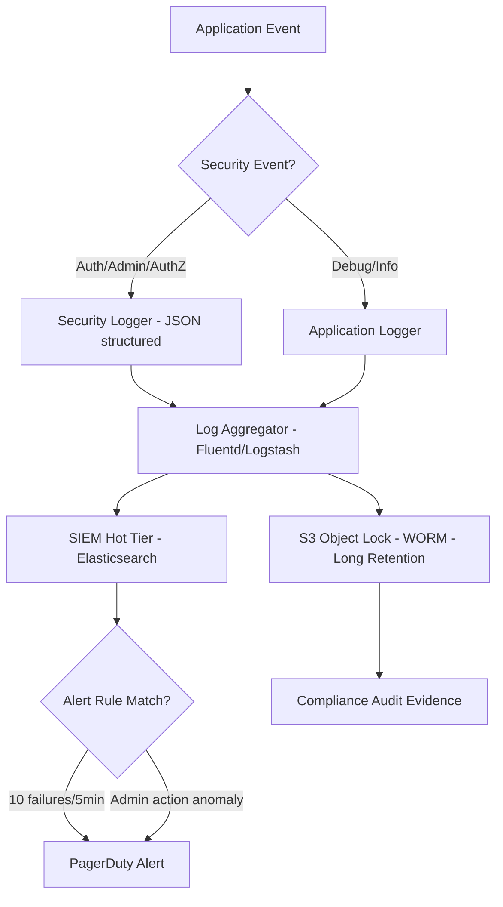

⚡ TL;DR - OWASP A09:2021 - Security Logging and Monitoring Failures.
Applications that don't log security-relevant events (authentication failures,
admin actions, authorization decisions) cannot detect attacks in progress.
The anti-pattern has two dimensions: (1) logging TOO LITTLE - missing auth
failures, missing data access, missing admin actions; (2) logging TOO MUCH -
logging passwords, tokens, PII, card numbers (creates liability). Correct
approach: structured JSON security events for auth + admin + data access,
with correlation IDs; shipped to SIEM (Splunk, Elastic, CloudWatch Logs).
Critical rule: security log must be separate from application log and
append-only (attackers cover tracks by deleting logs). Log injection
(CRLF injection via user-supplied strings in log messages) is a separate
attack vector that must be sanitized.

---

| #085 | Category: Security | Difficulty: ★★★ |
|:---|:---|:---|
| **Depends on:** | OWASP Top 10, Authentication, Session Management, Secrets Management, IAM, TLS Configuration, SAST, Security Logging and Monitoring, Security Testing in CI/CD, Threat Modeling, Business Logic Vulnerabilities | |
| **Used by:** | Responsible Disclosure + Bug Bounty, IR Process, Security Observability + SIEM, DevSecOps Pipeline Design, CSIRT Design, SIEM Architecture Design, SSDLC | |
| **Related:** | OWASP Top 10, Authentication, Session Management, IAM, TLS Configuration, Security Logging and Monitoring, Security Testing in CI/CD, Threat Modeling, Business Logic Vulnerabilities, IR Process, SIEM | |

---

### 🔥 The Problem This Solves

**WHY MISSING LOGS MEANS MISSING EVIDENCE:**

```
THE BREACH DISCOVERY PROBLEM:

  Industry average: 204 days to identify a breach (IBM Cost of a Data Breach 2023).
  Why so long?
  
  A: Because most applications don't log the events that would reveal the breach.
  
  TYPICAL BREACH TIMELINE WITHOUT PROPER LOGGING:
  
    Day 0: Attacker exploits authentication bypass.
    Day 0-180: Attacker enumerates users, downloads data, escalates privilege.
    Day 181: Customer reports fraudulent activity.
    Day 181: Company investigates. Asks: "What user accounts were accessed?"
    Answer: No log of user account access (only logged successful logins).
    Day 181: Asks: "When did the attacker first authenticate?"
    Answer: No log of failed authentication attempts. 
            "Did not log authentication failures" → cannot trace attack start.
    Day 181: Asks: "What data was exported?"
    Answer: No log of data access patterns. Cannot quantify breach scope.
    
    GDPR Article 33: breach notification within 72 hours of discovery.
    If you can't answer "what was accessed and when" within 72 hours:
    you're in violation of GDPR AND you can't notify affected users.
  
  THE IRONY: The attacker knows exactly what they took.
  The company doesn't. The company is blind.

COMMON LOGGING ANTI-PATTERNS AND THEIR CONSEQUENCES:

  Anti-pattern 1: Log successful logins only (not failed logins)
    Consequence: Brute force attack invisible. 10,000 failed attempts?
    Not logged. The eventual successful attempt after 9,999 failures?
    Logged. Result: one "login" event, no indication of brute force.
  
  Anti-pattern 2: Log application errors only (not security events)
    Consequence: Business logic exploits, IDOR attacks, price manipulation
    are application behavior (no errors thrown). Zero log entries.
    Detection: impossible until financial damage accumulates.
  
  Anti-pattern 3: Log to application database (attacker deletes logs)
    Consequence: Attacker with DB write access deletes their own activity.
    When investigated: clean log history. No evidence of breach.
    Covering tracks takes 10 seconds after the attacker gets DB access.
  
  Anti-pattern 4: Log passwords / tokens in debug output
    Consequence: Any engineer with log access has user credentials.
    Log aggregation systems (Splunk, CloudWatch) store these credentials.
    Log forwarding to SIEM: credentials now in multiple systems.
    Log backup to S3: credentials in long-term storage.
    A single misconfigured log exposure = bulk credential theft.
  
  Anti-pattern 5: Log as plain text with user-supplied input unescaped
    Consequence: Log injection. User submits:
    "username=admin\n2024-01-15 INFO: Admin granted superuser access to user X"
    The malicious string creates a fake log entry.
    Log analysis sees legitimate-looking admin action that never happened.
    CRLF injection in logs can also inject malicious JavaScript
    if logs are displayed in a web-based log viewer.
```

---

### 📘 Textbook Definition

**Security logging and monitoring failures (OWASP A09:2021):** A security
failure where an application does not generate sufficient logs of security-
relevant events, or the logs generated are not monitored and alerted on.
Without adequate logging and monitoring, attacks cannot be detected and
the scope of a breach cannot be determined after the fact.

**Security log:** A log specifically containing security-relevant events
(authentication, authorization, admin actions, security-relevant data access).
Distinguished from application logs (errors, performance, debugging).
Should be append-only, tamper-resistant, and retained according to policy
(typically 1-7 years for compliance frameworks).

**Audit trail:** An immutable record of who performed what action on what
data at what time. Provides non-repudiation. Required by PCI-DSS, GDPR,
SOC 2, HIPAA. Must be write-protected from the application (application
should only be able to append, not delete or modify audit entries).

**Log injection:** An attack where a user supplies input containing
newline characters (CRLF: \r\n or \n) that, when logged, creates additional
log entries. Used to forge log entries, create false audit records, or
(in web-based log viewers) inject HTML/JavaScript.

**Structured logging:** Logging in a machine-readable format (JSON) rather
than plain text, with consistent field names. Required for effective SIEM
integration and log querying (search by user_id, severity, event_type).

---

### ⏱️ Understand It in 30 Seconds

**One line:**
If you didn't log it, you can't detect it, investigate it, or prove it
in court. Insufficient logging means attackers can operate freely for months
with no alarm, and investigations yield "we don't know what happened."

**One analogy:**
> A bank with no security cameras.
>
> Customers walk in and out. Tellers serve them. Money moves.
> Everything works normally for 200 days.
> Day 201: $2M is missing.
> Investigation: "Who took it? When? Which accounts were accessed?"
> Answer: we have no cameras. We have no record of who entered.
> We have the final balances (the current state).
> We have no record of the transactions that created those balances.
>
> "We know we're missing $2M. We don't know who took it, when, or how."
>
> Security cameras = security logs.
> Knowing the balance changed = monitoring.
> Knowing who changed it, when, from which terminal = audit trail.
>
> A bank without cameras would not pass its first regulatory audit.
> An application without security logs also fails its first security audit.
> Both are missing the same thing: the record of what happened.

---

### 🔩 First Principles Explanation

**What MUST be logged (security events):**

```
MANDATORY SECURITY LOG EVENTS:

  Authentication:
    - Login success: {user_id, source_ip, user_agent, timestamp}
    - Login failure: {attempted_username, source_ip, user_agent, timestamp, reason}
    - Logout: {user_id, session_id, timestamp}
    - MFA success/failure: {user_id, mfa_method, timestamp}
    - Session expired: {user_id, session_id, timestamp}
    - Password change: {user_id, timestamp, source_ip}
    - Account locked: {user_id, reason (X failed attempts), timestamp}
  
  Authorization:
    - Authorization failure (403): {user_id, resource, action, timestamp}
    - Privileged action: {user_id, action, target, timestamp}
    - Role change: {user_id, old_role, new_role, performed_by, timestamp}
    - IDOR detection (accessing other user's resources): logged as auth failure
  
  Admin actions:
    - User creation/deletion: {admin_user_id, target_user_id, timestamp}
    - Permission grant/revoke: {admin_user_id, target, permission, timestamp}
    - Configuration change: {admin_user_id, setting, old_value, new_value, timestamp}
    - Data export: {user_id, dataset, record_count, timestamp}
  
  Security-relevant:
    - Certificate validation failure
    - Input validation failure (potential attack): {source_ip, input_summary}
    - Rate limit exceeded: {source_ip, endpoint, limit, window, timestamp}
    - Secret access: {service_id, secret_name, timestamp} (not secret value)

WHAT MUST NEVER BE LOGGED:

  - Passwords (even failed password attempts - log "wrong password" not the password)
  - Session tokens / JWT tokens / API keys
  - PII in full: full SSN, full card number (log last 4 only), full DOB
  - Cryptographic keys or seeds
  - Secret answers to security questions
  - Credit card CVV (never store, never log)
  
  WHY: Log systems are less secure than the application itself.
  Logs are accessed by more people (DevOps, SRE, support, security).
  Logs are backed up and retained long-term.
  Logs are forwarded to multiple systems (SIEM, S3, monitoring).
  Anything in logs is effectively shared with everyone with log access.
```

**Log injection prevention:**

```java
// LogSanitizer.java

// BAD: user input in log message without sanitization
public class AuthControllerBad {
    
    private static final Logger log = LoggerFactory.getLogger(AuthControllerBad.class);
    
    @PostMapping("/login")
    public ResponseEntity<Void> login(@RequestBody LoginRequest req) {
        // BAD: logs raw username from request body!
        // Attacker submits username = "admin\n2024-01-15 INFO: Admin granted superuser"
        // This creates a FAKE log entry that didn't happen.
        log.warn("Login failed for user: {}", req.getUsername());
        //                                        ^^^^^^^^^^^^^^^^^^^
        //             User-controlled input goes directly into log message.
        //             CRLF injection creates fake log lines.
        return ResponseEntity.status(401).build();
    }
}

// GOOD: sanitize user-supplied input before logging
public class AuthController {
    
    private static final Logger log = LoggerFactory.getLogger(AuthController.class);
    
    // Sanitize function: remove newlines + limit length
    private String sanitizeForLog(String input) {
        if (input == null) return "[null]";
        // Remove CRLF characters that could inject fake log lines:
        String sanitized = input.replaceAll("[\\r\\n\\t]", "_");
        // Limit length to prevent log flooding:
        if (sanitized.length() > 100) {
            sanitized = sanitized.substring(0, 100) + "...[TRUNCATED]";
        }
        return sanitized;
    }
    
    @PostMapping("/login")
    public ResponseEntity<Void> login(@RequestBody LoginRequest req) {
        // GOOD: sanitized username, structured logging:
        log.warn("AUTH_FAILURE attempted_user={} source_ip={} reason=INVALID_CREDENTIALS",
                 sanitizeForLog(req.getUsername()),
                 sanitizeForLog(getClientIp()));
        return ResponseEntity.status(401).build();
    }
}
```

**Structured security audit logging:**

```java
// SecurityAuditLogger.java

@Component
public class SecurityAuditLogger {
    
    // Dedicated security logger - separate from app log:
    private static final Logger SECURITY_LOG =
        LoggerFactory.getLogger("SECURITY_AUDIT");
    
    // Structured JSON security event:
    public void logAuthSuccess(UUID userId, String sourceIp,
                                String userAgent) {
        Map<String, Object> event = new LinkedHashMap<>();
        event.put("event_type", "AUTH_SUCCESS");
        event.put("user_id", userId);           // NOT username (PII)
        event.put("source_ip", sourceIp);
        event.put("user_agent", sanitize(userAgent));
        event.put("timestamp", Instant.now().toString());
        event.put("correlation_id", MDC.get("requestId"));
        SECURITY_LOG.info(toJson(event));
    }
    
    public void logAuthFailure(String attemptedUser, String sourceIp,
                                String reason) {
        Map<String, Object> event = new LinkedHashMap<>();
        event.put("event_type", "AUTH_FAILURE");
        // NEVER log the password - only the sanitized attempted username:
        event.put("attempted_user", sanitize(attemptedUser));
        event.put("source_ip", sourceIp);
        event.put("reason", reason);            // "INVALID_CREDENTIALS", "LOCKED"
        event.put("timestamp", Instant.now().toString());
        SECURITY_LOG.warn(toJson(event));
    }
    
    public void logAdminAction(UUID adminId, String action,
                                String targetDescription) {
        Map<String, Object> event = new LinkedHashMap<>();
        event.put("event_type", "ADMIN_ACTION");
        event.put("admin_user_id", adminId);
        event.put("action", action);           // "USER_DELETED", "ROLE_GRANTED"
        event.put("target", sanitize(targetDescription));
        event.put("timestamp", Instant.now().toString());
        SECURITY_LOG.warn(toJson(event));
    }
    
    private String sanitize(String input) {
        if (input == null) return "[null]";
        return input.replaceAll("[\\r\\n\\t]", "_")
                    .substring(0, Math.min(input.length(), 200));
    }
}
```

---

### 🧪 Thought Experiment

**SCENARIO: Security audit reveals insufficient logging:**

```
COMPANY: FinTech SaaS. 50K users. Annual SOC 2 audit.

AUDITOR QUESTION 1: "Show me the authentication failure log for
  the last 30 days. How many failed login attempts per day?"

ENGINEERING RESPONSE: "We log successful logins. We don't currently
  log failed login attempts."

AUDITOR: "So if an attacker tried 10,000 passwords against your 
  admin account yesterday, you would not know?"

ENGINEERING: "Correct."

AUDITOR: SOC 2 CC7.2 finding - "Insufficient authentication event logging."

AUDITOR QUESTION 2: "Show me the data access log for sensitive financial records.
  Who accessed account ID 12345 in the past 6 months?"

ENGINEERING: "We log API errors. We don't log data access."

AUDITOR: "If a rogue employee accessed and exported all customer financial
  data last month, you would not know?"

ENGINEERING: "We would not know from logs. We might notice data volume changes."

AUDITOR: SOC 2 CC6.6 finding - "Insufficient monitoring of data access."

AUDITOR QUESTION 3: "Show me your incident response exercise. What happened 
  when you had a potential breach last year?"

ENGINEERING: "We noticed unusual query patterns in the DB. We couldn't determine
  who was responsible or what data was accessed. Investigation closed as inconclusive."

AUDITOR: "Without audit logs, you cannot close a security incident as 'no breach.'
  You can only close it as 'we don't know.'"
  
  → SOC 2 audit outcome: qualified opinion. Not clean. Two material findings.

REMEDIATION IMPLEMENTED:
  1. Auth events: log all login attempts (success and failure) to security log.
  2. Data access: log read of financial records with user_id, record_id, timestamp.
  3. Admin actions: log all admin operations.
  4. Security log: separate log file, append-only, shipped to immutable S3.
  5. SIEM alert: >10 failed logins from same IP within 5 minutes → alert.
  
  Next audit: clean opinion. Evidence of 30-day auth event history provided.
```

---

### 🧠 Mental Model / Analogy

> The Three Zones of Security Logging:
>
> Zone 1 - MUST LOG (security events):
> Authentication (success AND failure), authorization failures,
> admin actions, data export, security-relevant config changes.
> These are the events that reveal attacks, enable investigations,
> satisfy compliance auditors, and provide non-repudiation.
>
> Zone 2 - MUST NOT LOG (sensitive data):
> Passwords, tokens, API keys, full card numbers, SSN, encryption keys.
> Logging these creates a new attack surface that is harder to secure
> than the original system. Every person with log access has these values.
>
> Zone 3 - LOG WITH CARE (application behavior):
> Business logic decisions, performance metrics, user behavior.
> These are useful for debugging but must be evaluated for PII and
> sensitivity before inclusion.
>
> The anti-pattern: Zone 3 is fully logged (all SQL queries,
> all API requests, all request bodies including passwords).
> Zone 1 is not logged (no auth events).
> Zone 2 is accidentally captured in Zone 3 (passwords in request bodies).
> Result: lots of logs, no security logs, plus a credential leak.

---

### 📶 Gradual Depth - Five Levels

**Level 1 - What it is (anyone can understand):**
If your application doesn't record what users are doing (especially suspicious things like failed logins), you have no way to know when you're being attacked, and no evidence to investigate after something goes wrong. Equally bad: if you record too much (like passwords or credit card numbers in logs), you've created a new security problem.

**Level 2 - How to use it (junior developer):**
Log security events with structured JSON (not plain text): authentication success/failure, authorization failures, admin actions. Never log passwords, tokens, or card numbers. Sanitize user input before logging (prevent CRLF injection). Use a dedicated security logger separate from the application logger. Ship security logs to a SIEM or append-only storage.

**Level 3 - How it works (mid-level engineer):**
Security logging has two consumers: SIEM (real-time alerts during incident) and forensics (after-the-fact investigation). Both need structured data: JSON fields with consistent schema (event_type, user_id, source_ip, timestamp, correlation_id). Correlation ID (request ID propagated via MDC) ties all logs for a single request together across services - critical for distributed tracing in microservices. Security log must be append-only and separate from application log: attacker who compromises DB can delete application logs; S3 Object Lock with Compliance mode prevents deletion even by root. Log retention policy: PCI-DSS requires 12 months (3 months immediate access), SOC 2 requires alignment with audit period, GDPR requires no longer than necessary.

**Level 4 - Why it was designed this way (senior/staff):**
Security logs serve multiple use cases with different latency requirements: real-time (SIEM alert on 10 failed logins in 5 minutes - requires streaming), short-term investigation (what happened in the past 24 hours - requires searchable index), long-term audit (SOC 2 annual evidence - requires retention). This is why enterprise logging architecture separates concerns: application log → log aggregator (Fluentd/Logstash) → SIEM hot tier (Elasticsearch) for search, cold tier (S3) for retention. Security log integrity: WORM (Write Once Read Many) storage prevents retroactive modification. Cryptographic log signing (hash chain) allows detection of tampering even in non-WORM storage.

**Level 5 - Mastery (distinguished engineer):**
Advanced logging: log sampling strategy for high-volume events (can't log every API request at 100K RPS - sample at 1% with 100% sampling on security events). Correlation: MDC (Mapped Diagnostic Context) for Java propagates request ID across threads and async calls; W3C Trace Context header (traceparent) propagates across service boundaries in distributed systems. Behavioral analytics (UEBA: User and Entity Behavior Analytics): ML-based anomaly detection on log patterns (user logs in from US at 9am, then from China at 9:05am - impossible travel alert). Log as threat intelligence: correlated across your system, auth failures reveal attack campaigns before they succeed. OCSF (Open Cybersecurity Schema Framework, AWS/Splunk/IBM initiative): standardized JSON schema for security events - enables cross-vendor SIEM queries without field mapping.

---

### ⚙️ How It Works (Mechanism)

```
SECURITY LOGGING ARCHITECTURE:

  Application
      │
      │ security events (JSON, structured)
      ▼
  Security Logger (separate from app logger)
      │
      │ async write (non-blocking)
      ▼
  Log Aggregator (Fluentd / Logstash / AWS FireLens)
      │
      ├──→ SIEM Hot Tier (Elasticsearch / Splunk):
      │       Real-time search, alerting, dashboards.
      │       Retention: 30-90 days (fast query).
      │
      └──→ Long-Term Storage (S3 with Object Lock):
              S3 Object Lock Compliance mode.
              Not deletable even by root.
              Retention: 1-7 years (compliance).
              Accessible for incident investigation.

  SIEM Alert Rules:
    Rule: >10 AUTH_FAILURE events from same source_ip in 5 min
    → Alert: PagerDuty/Slack → Security team
    
    Rule: AUTH_SUCCESS for account after 50+ AUTH_FAILURE events
    → Alert: Potential successful brute force
    
    Rule: ADMIN_ACTION by user_id not in admin group
    → Alert: Privilege escalation attempt
```



---

### 💻 Code Example

**Spring Boot security event logging with brute force detection:**

```java
// SecurityEventFilter.java

@Component
@Order(Ordered.HIGHEST_PRECEDENCE)
public class SecurityEventFilter extends OncePerRequestFilter {
    
    private static final Logger SEC_LOG =
        LoggerFactory.getLogger("SECURITY");
    private final BruteForceDetector bruteForce;
    
    @Override
    protected void doFilterInternal(HttpServletRequest req,
                                    HttpServletResponse res,
                                    FilterChain chain)
            throws ServletException, IOException {
        
        // Add correlation ID to all log entries for this request:
        String requestId = UUID.randomUUID().toString();
        MDC.put("requestId", requestId);
        MDC.put("sourceIp", getClientIp(req));
        
        try {
            chain.doFilter(req, res);
            
            // Log authorization failures (403):
            if (res.getStatus() == 403) {
                Authentication auth =
                    SecurityContextHolder.getContext().getAuthentication();
                String userId = auth != null ? auth.getName() : "anonymous";
                
                Map<String, Object> evt = Map.of(
                    "event_type", "AUTHZ_FAILURE",
                    "user_id", sanitize(userId),
                    "path", sanitize(req.getRequestURI()),
                    "method", req.getMethod(),
                    "source_ip", getClientIp(req),
                    "timestamp", Instant.now().toString()
                );
                SEC_LOG.warn(toJson(evt));
            }
        } finally {
            MDC.clear();
        }
    }
    
    private String sanitize(String input) {
        if (input == null) return "[null]";
        // Remove CRLF to prevent log injection:
        return input.replaceAll("[\\r\\n\\t]", "_")
                    .substring(0, Math.min(input.length(), 200));
    }
}

// AuthenticationEventListener.java

@Component
public class AuthenticationEventListener {
    
    private static final Logger SEC_LOG =
        LoggerFactory.getLogger("SECURITY");
    private final BruteForceDetector bruteForce;
    
    @EventListener
    public void onAuthSuccess(AuthenticationSuccessEvent evt) {
        String userId = evt.getAuthentication().getName();
        
        // BAD: do NOT log the password even on success.
        // BAD: do NOT log the session token here.
        // GOOD: log only the identity and context:
        Map<String, Object> event = new LinkedHashMap<>();
        event.put("event_type", "AUTH_SUCCESS");
        event.put("user_id", userId);
        event.put("source_ip", MDC.get("sourceIp"));
        event.put("timestamp", Instant.now().toString());
        event.put("request_id", MDC.get("requestId"));
        SEC_LOG.info(toJson(event));
        
        // Reset brute force counter on success:
        bruteForce.reset(MDC.get("sourceIp"));
    }
    
    @EventListener
    public void onAuthFailure(AbstractAuthenticationFailureEvent evt) {
        String attempted = evt.getAuthentication().getName();
        String ip = MDC.get("sourceIp");
        
        // BAD: do NOT log: evt.getAuthentication().getCredentials()
        // That would log the password! Only log that credentials were invalid.
        Map<String, Object> event = new LinkedHashMap<>();
        event.put("event_type", "AUTH_FAILURE");
        // Sanitize: user-controlled input goes into log
        event.put("attempted_user", sanitize(attempted));
        event.put("source_ip", ip);
        event.put("reason", evt.getException().getClass().getSimpleName());
        event.put("timestamp", Instant.now().toString());
        SEC_LOG.warn(toJson(event));
        
        // Brute force detection:
        int failCount = bruteForce.increment(ip);
        if (failCount >= 10) {
            Map<String, Object> alert = Map.of(
                "event_type", "BRUTE_FORCE_DETECTED",
                "source_ip", ip,
                "failure_count", failCount,
                "window_minutes", 5,
                "timestamp", Instant.now().toString()
            );
            SEC_LOG.error(toJson(alert));
            // Also: trigger rate limit / CAPTCHA for this IP
        }
    }
    
    private String sanitize(String input) {
        if (input == null) return "[null]";
        return input.replaceAll("[\\r\\n\\t]", "_")
                    .substring(0, Math.min(input.length(), 100));
    }
}
```

---

### ⚖️ Comparison Table

| Log Type | Content | Retention | Access | Storage |
|:---|:---|:---|:---|:---|
| **Security/Audit log** | Auth, admin, authz failures | 1-7 years | Security team, auditors | Append-only, WORM (S3 Object Lock) |
| **Application log** | Errors, performance, debug | 30-90 days | Dev, Ops, SRE | Standard (Elasticsearch, CloudWatch) |
| **Access log** | HTTP requests (no body) | 30-90 days | Dev, Ops | Standard |

---

### ⚠️ Common Misconceptions

| Misconception | Reality |
|:---|:---|
| "Logging more is always better for security." | Logging too much creates as many security problems as logging too little. Logging user passwords ("for debugging") creates a credential store accessible to everyone with log access. Logging full request bodies may capture credit card numbers, SSN, or API keys in query parameters. Logging PII creates GDPR data retention obligations for log data that is often difficult to satisfy. The correct principle: log security events explicitly, never log credentials or sensitive values, evaluate each additional log statement for sensitivity. More bytes in logs ≠ better security posture. |
| "Application logs and security logs are the same thing." | Application logs are designed for developers debugging issues (exception stack traces, SQL query times, request routing). Security logs are designed for security investigation (who authenticated, what resources were accessed, what admin actions were taken). These have different audiences (devs vs security team), different retention (weeks vs years), different integrity requirements (standard vs append-only), and different access patterns (searched by error type vs searched by user_id and IP). Mixing them means developers have access to security evidence, application errors pollute security audit trails, and retention policies conflict. Separate loggers, separate destinations, separate access controls. |

---

### 🚨 Failure Modes & Diagnosis

**Insufficient logging diagnosis checklist:**

```
SECURITY LOGGING HEALTH CHECK:

  TEST 1: Are authentication failures logged?
    Action: Submit wrong password for a valid account 10 times.
    Expected: 10 AUTH_FAILURE log entries with source_ip and timestamp.
    Fail: No log entries. Or: only the final 403 HTTP log entry.
    
    grep "AUTH_FAILURE" /var/log/security.log | wc -l
    
  TEST 2: Are authorization failures logged?
    Action: Authenticated as user A, request resource belonging to user B.
    Expected: AUTHZ_FAILURE log entry with user_id, resource, timestamp.
    Fail: No log entry (only 403 HTTP response code with no security event).
  
  TEST 3: Are admin actions logged?
    Action: Admin user deletes another user's account.
    Expected: ADMIN_ACTION log entry with admin_id, action, target, timestamp.
    Fail: No log entry.
  
  TEST 4: Are passwords or tokens in logs? (BAD)
    grep -i "password\|token\|secret\|key" /var/log/app.log | head -20
    If output shows actual values: CRITICAL finding. 
    Immediately: rotate all secrets found. Fix logging. Purge log files.
    
  TEST 5: Is log injection possible?
    Submit username: "user\n2024-01-15 INFO: Admin created superuser"
    Check log file: does the fake log line appear?
    Fail: fake line appears. Log injection possible.
    Fix: sanitize user input before logging (remove \r \n \t).
  
  TEST 6: Are security logs in append-only storage?
    Attempt to delete a log entry as application service account.
    Expected: permission denied.
    Fail: deletion succeeds. Application can cover its own tracks.
    Fix: S3 Object Lock, separate write-only log shipper, no delete permission.
  
  SIEM RULE VALIDATION:
    Submit 11 failed login attempts from same IP in 5 minutes.
    Expected: SIEM alert fires within 2 minutes.
    Fail: no alert. Check: is SIEM receiving logs? Are alert rules configured?
```

---

### 🔗 Related Keywords

**Prerequisites:**
- `Security Logging and Monitoring Best Practices` (SEC-073) - what to build
- `Security Testing in CI/CD` (SEC-077) - automated log coverage verification

**Builds on this:**
- `IR Process` (SEC-101) - logs are the primary evidence during incidents
- `Security Observability + SIEM` (SEC-106) - log analysis and alerting
- `SIEM Architecture Design` (SEC-128) - log pipeline architecture

---

### 📌 Quick Reference Card

```
┌──────────────────────────────────────────────────────────┐
│ MUST LOG     │ Auth success/fail, authz fail, admin      │
│              │ actions, data export, rate limit exceeded  │
├──────────────┼───────────────────────────────────────────┤
│ NEVER LOG    │ Passwords, tokens, API keys, full PAN,    │
│              │ SSN, encryption keys, CVV                  │
├──────────────┼───────────────────────────────────────────┤
│ LOG FORMAT   │ Structured JSON: event_type, user_id,     │
│              │ source_ip, timestamp, correlation_id       │
├──────────────┼───────────────────────────────────────────┤
│ LOG STORAGE  │ Append-only, WORM (S3 Object Lock)        │
│              │ Separate from app DB and application       │
├──────────────┼───────────────────────────────────────────┤
│ LOG INJ FIX  │ sanitize(input).replaceAll("[\\r\\n]","_")│
└──────────────────────────────────────────────────────────┘
```

---

### 💎 Transferable Wisdom

**Reusable Engineering Principle:**
"Log intent, not mechanism. Log what happened, not how."
Security logs are read by people investigating events months later.
They need to understand WHAT happened in business terms, not technical details.
BAD security log: "SQL query: SELECT * FROM users WHERE id=42 AND active=1"
This describes a database mechanism. It's not a security event.
GOOD security log: {event_type: AUTH_SUCCESS, user_id: 42, source_ip: "1.2.3.4"}
This describes a business event: a user authenticated successfully.
The mechanism (SQL query, session token, JWT) is irrelevant to the investigation.
The business event (authentication, authorization, admin action) is what matters.
Principle applied to code review: when reviewing a log statement, ask:
1. Is this a security event? (AUTH, AUTHZ, ADMIN, DATA_EXPORT)
   If yes: it must be logged in the security logger.
2. Does this log contain credentials or sensitive values?
   If yes: it must be removed or sanitized.
3. Could this log contain user-supplied input?
   If yes: sanitize before logging (CRLF injection prevention).
4. Will the SIEM understand this log entry?
   If not structured JSON: restructure it.
These four questions, applied consistently during code review, eliminate
the majority of logging anti-patterns before they reach production.

---

### 💡 The Surprising Truth

The Equifax 2017 breach illustrates why logging anti-patterns are catastrophic.

Apache Struts vulnerability (CVE-2017-5638) was exploited from May 13 to July 30, 2017
- 78 days of continuous data exfiltration.

How was the breach active for 78 days undetected?
Equifax had deployed SSL inspection to analyze encrypted traffic.
But the SSL inspection certificate EXPIRED in January 2017.
Equifax did not notice for 19 months.
SSL inspection was running but silently failing - not inspecting traffic.

For 78 days, malicious traffic went through unmonitored SSL connections.
Equifax had network monitoring. The monitoring was broken and undetected.

The logging failure:
- No alert when SSL certificate expired (monitoring the monitoring)
- No anomaly detection on outbound data volume (147M records exported)
- No alert on repeated error responses from the Struts endpoint (attack traffic)

The monitoring existed. The monitoring was broken. Nobody noticed.

The lesson: monitoring and logging are only as good as their own monitoring.
Two requirements often missed:
1. Monitor your security controls (is the WAF processing traffic? Is SIEM receiving events?)
2. Test your alert rules regularly (does the brute force alert fire? Verify it monthly.)
A silent SIEM failure looks identical to "no threats detected" - until it's too late.

---

### ✅ Mastery Checklist

**You've mastered this when you can:**
1. **IDENTIFY** insufficient logging in a code review: missing auth failure logging,
   missing authz failure logging, missing admin action logging.
2. **IDENTIFY** excessive/dangerous logging: passwords in debug logs, tokens in
   request body logs, full PAN in payment logs.
3. **IMPLEMENT** structured security logging with sanitized user input:
   JSON format, CRLF injection prevention, MDC correlation IDs.
4. **DESIGN** a secure log storage architecture: separate security logger,
   append-only shipping, S3 Object Lock, SIEM integration.

---

### 🎯 Interview Deep-Dive

**Q: What is OWASP A09 - Security Logging and Monitoring Failures?
What should and shouldn't be logged, and what is log injection?**

*Why they ask:* Tests security logging awareness. Often under-appreciated
until an incident occurs. Relevant for any backend role.

*Strong answer covers:*
- OWASP A09:2021: applications that don't log security events cannot
  detect attacks or investigate incidents. Both "too little" and "too much"
  logging are anti-patterns.
- What to log: authentication success/failure (with source_ip), authorization
  failures (who tried to access what), admin actions (who changed what),
  data export events. Structured JSON, not plain text.
- What NOT to log: passwords (even failed - "invalid credentials" not the password),
  session tokens, API keys, JWT content, full PAN (credit card), SSN.
  Reason: logs are widely accessible and long-retained.
- Log injection: user submits newline characters in input → when logged,
  creates additional fake log lines. Example: "admin\n2024-01-15 WARN: Password bypassed".
  Fix: sanitize by replacing \r\n\t with "_" before logging user input.
- Structured logging: JSON format with consistent fields (event_type, user_id,
  source_ip, timestamp, correlation_id) - needed for SIEM integration.
- Log storage: security log must be separate from application log.
  Append-only (S3 Object Lock Compliance mode) prevents attackers from
  deleting their own activity after gaining DB access.
- Monitoring: SIEM alert rules for brute force (10 failures/5 min from same IP),
  impossible travel, privilege escalation attempts.
- Key insight: IBM 2023 report - average 204 days to detect a breach.
  Proper security logging reduces this from months to hours.