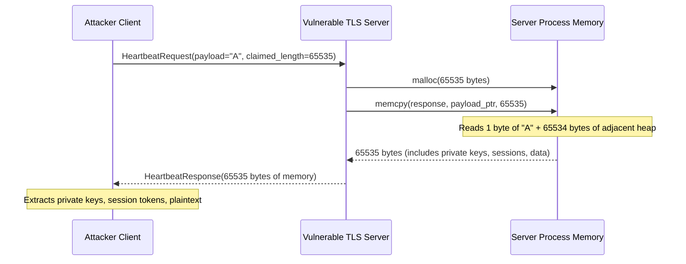

⚡ TL;DR - CVE-2014-0160, April 2014. A buffer over-read in OpenSSL's
TLS heartbeat extension allowed any client to read up to 64KB of server
process memory per request, with no authentication required, leaving no
trace in server logs. Memory contents included private SSL keys, session
tokens, passwords, and plaintext data. Affected OpenSSL 1.0.1 through
1.0.1f (released March 2012 to January 2014). Estimated 17-21% of all
HTTPS servers worldwide. Impact: 500,000+ certificates required revocation.
Root cause: missing bounds check in a 10-line extension added by a single
contributor. Fix: OpenSSL 1.0.1g (April 7, 2014). Lasting lesson: memory
safety cannot be achieved by code review alone in C - it requires memory-safe
languages (Rust, Go) for security-critical protocol implementations.

---

| #086 | Category: Security | Difficulty: ★★★★ |
|:---|:---|:---|
| **Depends on:** | OWASP Top 10, TLS/HTTPS, X.509 Certificates, Authentication, Session Management, Secrets Management, IAM, TLS Configuration, SAST, Security Logging | |
| **Used by:** | Log4Shell 2021, SolarWinds 2020, Equifax 2017, TLS Protocol Attacks, CVE + NVD, SLSA Framework, CVE Research | |
| **Related:** | OWASP Top 10, TLS/HTTPS, X.509 Certificates, Authentication, Session Management, IAM, TLS Configuration, Log4Shell, SolarWinds, Equifax, TLS Protocol Attacks, CVE + NVD | |

---

### 🔥 The Problem This Solves

**WHY HEARTBLEED WAS UNIQUELY CATASTROPHIC:**

```
THE ANATOMY OF A WORST-CASE VULNERABILITY:

  Most vulnerabilities have ONE of these properties:
    - Require authentication to exploit
    - Leave traces in logs
    - Require specific configurations
    - Affect limited scope of systems
    - Expose specific, limited data
  
  Heartbleed had NONE of these mitigating properties:
  
  Property          | Heartbleed
  ──────────────────┼───────────────────────────────────────────
  Auth required?    | NO - exploitable by any TCP connection
  Log traces?       | NO - heartbeat requests not logged by default
  Config dependent? | NO - heartbeat extension enabled by default
  Scope             | ALL servers using OpenSSL 1.0.1-1.0.1f (17-21% of internet)
  Data exposed      | ANYTHING in server process memory:
                    │   private SSL keys, passwords, session tokens,
                    │   customer data, cryptographic material
  
  WHAT "17% OF THE INTERNET" MEANS:
  
    April 2014 estimates:
    - 66% of web servers ran Apache or nginx
    - Most Apache/nginx installations on Linux used OpenSSL
    - OpenSSL 1.0.1+ had shipped since March 2012 (2 years)
    - Major affected systems confirmed:
        Yahoo! (700M+ users at the time)
        AWS Elastic Load Balancer
        GitHub
        DropBox
        LastPass
        Tumblr
        SoundCloud
        Multiple banks and financial institutions
    - Akamai (serving ~30% of internet traffic): affected
    - Multiple VPN vendors: affected (allows VPN key theft → MITM)
    
  WHAT AN ATTACKER COULD EXTRACT:
  
    Primary key material (most valuable):
      - Server's private SSL/TLS key
      - Impact: decrypt any TLS traffic recorded previously
                (retroactive decryption of recorded HTTPS traffic)
        
    Active session material:
      - Session cookies: log in as any active user
      - OAuth tokens: access third-party services as any user
      - Authentication tokens: bypasses authentication entirely
    
    Live credentials:
      - Usernames and passwords in memory (from active requests)
      - Database connection strings in application memory
      - API keys loaded in environment variables
    
    Plaintext data:
      - Request and response bodies in memory from other active connections
      - This means: one connection can read data from OTHER users' connections
        (whatever happens to be in the server's memory at that moment)
```

---

### 📘 Textbook Definition

**Heartbleed (CVE-2014-0160):** A buffer over-read vulnerability in the
OpenSSL cryptographic library's implementation of the TLS heartbeat extension
(RFC 6520). The vulnerability allowed a remote attacker to read up to 64KB
of process memory per request by exploiting a missing bounds check when
processing HeartbeatRequest messages. The bug existed in OpenSSL 1.0.1
through 1.0.1f (inclusive), released from March 14, 2012, until January 6, 2014.

**Buffer over-read:** A vulnerability where a program reads data beyond
the end of an allocated buffer. Unlike buffer overflow (which writes beyond
the buffer and can lead to code execution), buffer over-read exposes adjacent
memory contents. The attacker specifies a length claim larger than the actual
data sent; the program reads the claimed length of bytes, which extends
beyond the user-supplied data into whatever memory happens to be adjacent.

**TLS heartbeat extension (RFC 6520):** A mechanism allowing TLS peers
to verify that the other end of a TLS connection is still alive without
renegotiating the session. Client sends a HeartbeatRequest with a payload
and claimed payload length. Server sends back a HeartbeatResponse with
the same payload (echo) at the claimed length.

**Memory disclosure:** A class of vulnerabilities where process memory
contents are exposed to an attacker. Particularly severe in TLS libraries
because the same process memory may contain private keys, session data
from multiple users, and plaintext data.

---

### ⏱️ Understand It in 30 Seconds

**One line:**
Heartbleed: client tells server "I'm sending you a 64,000-byte heartbeat."
Sends 1 byte. Server reads back 64,000 bytes of its own memory - including
private keys, passwords, and other users' data - and sends them to the attacker.

**One analogy:**
> You're at a library. A visitor asks the librarian:
> "Can you read back to me the note I just handed you? It's 100 words long."
> The visitor actually handed a note with 1 word.
>
> Vulnerable librarian: reads the 1-word note, then keeps reading
> 99 more words from other notes on the desk (from other patrons,
> from the library's administrative files, from confidential records).
>
> Reads all 100 words aloud, exposing other patrons' private information.
>
> The visitor lied about the length. The librarian never verified the claim.
>
> Heartbleed: the "length" claim is the payload_length field in the heartbeat message.
> The library desk memory = server process memory (private keys, passwords, sessions).
> No library card required to exploit. No record of the visit in the log book.

---

### 🔩 First Principles Explanation

**The vulnerable code (OpenSSL heartbeat handler):**

```c
// OpenSSL 1.0.1f - ssl/d1_both.c (simplified)
// The actual vulnerable code (14 lines that affected 17% of the internet)

int dtls1_process_heartbeat(SSL *s) {
    unsigned char *p = &s->s3->rrec.data[0];
    
    // Step 1: Read the type byte:
    hbtype = *p++;
    
    // Step 2: Read the claimed payload length from the request:
    n2s(p, payload);
    //  ^^^^ n2s reads 2 bytes as a 16-bit integer
    //  payload = 0xFFFF = 65535 bytes claimed
    //  But actual data sent might be 1 byte.
    //
    //  THE MISSING CHECK:
    //  There is NO validation that:
    //  payload <= actual_received_data_length
    //  This 1 line of validation was never written.
    
    // Step 3: Pointer to actual payload data (1 byte actually sent):
    pl = p;
    
    // Step 4: Allocate response buffer (attacker-controlled size!):
    unsigned char *buffer = OPENSSL_malloc(1 + 2 + payload + padding);
    //                                               ^^^^^^^
    //                           malloc(65535 + overhead) = 65KB buffer
    
    // Step 5: Copy payload from request → response.
    //         memcpy uses payload=65535. pl points to 1 actual byte.
    //         Reads 65535 bytes starting from pl.
    //         65534 bytes are FROM ADJACENT MEMORY (not from request).
    memcpy(bp, pl, payload);
    //          ^^  ^^^^^^^
    //          |   65535 bytes (but only 1 was sent!)
    //          pointer to attacker's 1-byte "payload"
    //          + 65534 bytes of process memory after it
    
    // Step 6: Send the response:
    OPENSSL_free(buffer);
    return 0;
    // Response contains: 1 real byte + 65534 bytes of server memory.
    // Attacker receives up to 64KB of process memory.
}

// THE FIX (OpenSSL 1.0.1g - the one line that was missing):

int dtls1_process_heartbeat(SSL *s) {
    // ... same code until the critical check:
    n2s(p, payload);
    
    // ADDED: bounds check (this is the entire fix):
    if (1 + 2 + payload + 16 > s->s3->rrec.length) {
        return 0; // Silently discard malformed heartbeat
    }
    // If claimed length > actual received length: reject.
    // No memory is read beyond what was sent.
    
    // ... rest of handler
}
```

**How exploitation works in practice:**

```
HEARTBLEED EXPLOITATION SEQUENCE:

  1. Attacker opens TCP connection to server on port 443.
  2. Attacker completes TLS handshake (no client cert required).
  3. Attacker sends malformed HeartbeatRequest:
     - hbtype: 1 (REQUEST)
     - payload_length: 0xFFFF (= 65535 claimed)
     - payload: "A" (1 actual byte)
  4. Server processes the heartbeat (dtls1_process_heartbeat).
  5. Server allocates 65535-byte response buffer.
  6. Server copies 65535 bytes from memory starting at the 1-byte payload.
     This reads 65534 bytes of adjacent process memory.
  7. Server sends the 65535-byte HeartbeatResponse to the attacker.
  8. Attacker receives up to 64KB of server process memory.
  
  THE LOOP: Steps 3-8 can be repeated indefinitely.
  Each request retrieves a different slice of memory
  (memory allocator returns different addresses each request).
  With enough requests: significant coverage of process memory space.
  
  LOG ABSENCE: TLS heartbeat messages are NOT logged by Apache, nginx,
  or most TLS implementations. The attack leaves no trace.
  
  AUTOMATION: Exploit code was trivially simple. Within days of disclosure,
  automated scanning tools could detect and exploit Heartbleed.
  
  CVSSv3 Score: 7.5 (High)
  Attack Vector: Network / Authentication: None / Complexity: Low
  Confidentiality: High (arbitrary memory disclosure)
  
  PRACTICAL EXTRACTION (reported by researchers):
    Google Security team: extracted Yahoo's private key in 2 hours.
    (Yahoo! confirmed and patched within hours of disclosure)
    CloudFlare challenge: offered $10,000 to anyone who extracted their key.
    Multiple researchers claimed the prize within 24 hours.
```

---

### 🧪 Thought Experiment

**SCENARIO: You are an incident responder in April 2014:**

```
TIMELINE:
  April 7, 2014, 17:15 UTC: Heartbleed publicly disclosed.
  Simultaneously: CVE-2014-0160 assigned, OpenSSL 1.0.1g released.
  April 7, 2014, 17:15 UTC: your pager goes off.

  YOUR CHALLENGE: Is your system affected? What do you do in the next 4 hours?

STEP 1: Determine exposure (first 30 minutes)
  
  What version of OpenSSL are you running?
    openssl version
    → OpenSSL 1.0.1e (Linux package manager version)
    → Affected. (1.0.1 through 1.0.1f are all affected)
  
  Is the heartbeat extension enabled?
    # If you compiled OpenSSL yourself, you might have disabled it:
    openssl s_client -connect localhost:443 | grep "Heartbeating"
    # Or test remotely: heartbleed test tools immediately appeared online.
  
  Conclusion: You are vulnerable.

STEP 2: Patch (next 30 minutes)
  
  Upgrade OpenSSL:
    apt-get update && apt-get install libssl1.0.0
    # On RHEL/CentOS: yum update openssl
  
  Restart all services using OpenSSL (critical: a running service keeps
  the old library loaded in memory even after package update):
    service nginx restart
    service apache2 restart
    service tomcat restart
    # All services using libssl must restart to load the patched library.
  
  Verify:
    openssl version → OpenSSL 1.0.1g (or distribution-patched version)

STEP 3: Assume private key is compromised (next 2 hours)
  
  Even after patching: if the server was vulnerable for any period,
  assume the private key was extracted.
  
  Action:
    1. Generate new private key and CSR.
    2. Revoke existing certificate (contact CA, initiate emergency revocation).
    3. Request new certificate.
    4. Deploy new certificate and key.
    5. Update all systems using the old certificate.
  
  Why key rotation is mandatory:
    - Attacker may have extracted key BEFORE you patched.
    - Attacker can use extracted key to: decrypt previously recorded traffic,
      impersonate your server (MITM), sign malicious content.
    - UNLESS you rotate the key: the attacker's extracted copy remains valid.

STEP 4: Invalidate sessions (next 30 minutes)
  
  Session tokens were readable from memory.
  Any active sessions may be compromised.
  Invalidate ALL active sessions: force re-authentication for all users.
  
STEP 5: Notify (ongoing)
  
  GDPR (not in effect until 2018, but analogous obligations):
  If user data was in memory → potential data breach → notification required.
  
  ACTUAL RESPONSE (2014 practice): most companies notified users to change passwords.
  Some disclosed specifics, others did not.
```

---

### 🧠 Mental Model / Analogy

> The library card catalog vulnerability.
>
> A library has card catalog drawers. Each drawer is labeled with
> a range (Aa-Al, Am-Az). A patron submits a request: 
> "Copy me the card for 'Aaron Smith' - I'm claiming it's 500 cards long."
>
> Vulnerable librarian (no bounds check):
>   Opens the Aaron Smith card (1 card).
>   "The patron claimed 500 cards. I'll copy 500 cards."
>   Copies 499 more cards from adjacent drawers (other patrons' private requests,
>   librarian's administrative notes, financial records in adjacent drawers).
>   Hands 500 cards to the patron.
>
> The patron gets: Aaron Smith's card + 499 cards of random private library data.
>
> Heartbleed: the "500" is the payload_length field.
> The "1 card" is the actual payload sent.
> The "499 additional cards" is the 64KB of server process memory.
> "Other patrons' private requests" = other users' session tokens, data in flight.
> "Librarian's administrative notes" = server's private TLS key.
>
> The fix: verify the patron's claim before copying.
> "You claimed 500 cards. I see 1 card. I'll copy only 1."

---

### 📶 Gradual Depth - Five Levels

**Level 1 - What it is (anyone can understand):**
Heartbleed was a bug in the software that encrypts web traffic (OpenSSL). Any website visitor could secretly read chunks of the server's memory - including the master passwords and keys that protect everything. 17% of all encrypted websites were affected. Attackers could do this with no login and leave no trace.

**Level 2 - How to use it (junior developer):**
Heartbleed is a buffer over-read: the server believed a client-supplied "length" claim without verifying it. The attacker claimed the heartbeat payload was 65,535 bytes long, sent 1 byte, and received back 65,534 bytes of whatever was in adjacent server memory. Lesson for developers: never trust user-supplied length claims without validation against the actual received data length.

**Level 3 - How it works (mid-level engineer):**
OpenSSL's heartbeat handler read the `payload_length` field from the incoming message and called `memcpy(response, payload, payload_length)` without checking that `payload_length <= actual_received_length`. The malloc'd response buffer was `payload_length` bytes, copied from wherever `payload` pointer pointed. Since `payload_length` could be 65535 and the actual payload was 1 byte, memcpy read 65534 bytes of adjacent heap memory. The heap in an OpenSSL server process contains: other TLS connection data, private keys (loaded at startup), session tickets, processed plaintext, application data. Attack tool: simple socket client sending a crafted TLS heartbeat. No log trace, no authentication required, exploitable in a loop.

**Level 4 - Why it was designed this way (senior/staff):**
The heartbeat extension was added to OpenSSL in December 2011 by Robin Seggelmann (PhD student), reviewed by Stephen Henson (OpenSSL core team). The review missed the missing bounds check. The heartbeat extension had a legitimate purpose: keep TLS connections alive in NAT environments without full TLS renegotiation. The design (client sends payload, server echoes it) is fundamentally sound. The implementation had a 1-line missing validation. The OpenSSL codebase is C: no automatic bounds checking, no memory safety, no type safety for array operations. The same class of bug (missing bounds check on user-supplied length) has been the root cause of dozens of critical CVEs across C codebases over 30 years. This is why modern protocol implementations increasingly use Rust (TLS 1.3 implementation in rustls) or Go.

**Level 5 - Mastery (distinguished engineer):**
Heartbleed's architectural implications: (1) Memory safety languages - Rustls (Rust TLS library) cannot have Heartbleed because Rust's ownership model makes buffer over-read a compile-time error. The Rust memory model requires bounds checking at the language level. (2) Certificate transparency - post-Heartbleed, CT logs (RFC 6962) became mandatory for publicly trusted certificates, making it possible to audit all issued certificates and detect unauthorized issuance after key compromise. (3) OCSP stapling - Heartbleed's key compromise risk highlighted the importance of rapid certificate revocation; OCSP stapling allows servers to cache and present revocation status, reducing reliance on CA OCSP responders. (4) Forward secrecy - TLS cipher suites without PFS (like RSA key exchange) meant that adversaries who recorded encrypted traffic in 2012-2014 could retroactively decrypt it using the extracted private key. PFS (ECDHE) ensures session keys are ephemeral - even with the private key, recorded sessions cannot be decrypted. TLS 1.3 mandates PFS for all cipher suites. (5) FIPS 140-2 validation: OpenSSL's FIPS-validated module was separate and not affected - but the incident raised questions about whether FIPS certification prevents implementation bugs (it validates the algorithm correctness, not memory safety).

---

### ⚙️ How It Works (Mechanism)

```
TLS HEARTBEAT EXTENSION - NORMAL OPERATION:

  Client sends HeartbeatRequest:
    hbtype     = 1 (REQUEST)
    payload_length = 8 (actual data length)
    payload    = "PINGPING" (8 bytes)
    padding    = (16 bytes, random)

  Server sends HeartbeatResponse:
    hbtype     = 2 (RESPONSE)
    payload_length = 8 (same as request)
    payload    = "PINGPING" (echoed from request)
    padding    = (16 bytes, random)

HEARTBLEED ATTACK:

  Client sends malformed HeartbeatRequest:
    hbtype     = 1 (REQUEST)
    payload_length = 65535 (CLAIMED: 65,535 bytes)
    payload    = "A" (ACTUAL: 1 byte sent)
    
  Vulnerable server:
    1. Reads payload_length = 65535
    2. malloc(65535 + overhead) → allocates 65KB response buffer
    3. Sets pl = pointer to "A" (1 actual byte)
    4. memcpy(response_buffer, pl, 65535)
       → copies "A" + 65534 bytes of process memory after "A"
    5. Sends 65535-byte response
    
  Client receives:
    payload = "A" + [65534 bytes of server memory]
```



---

### 💻 Code Example

**Detection: testing if your server is vulnerable (read-only diagnostic):**

```python
#!/usr/bin/env python3
# heartbleed_check.py - Heartbleed detection only (no exploitation)
# Tests if a server responds to an oversized heartbeat request.
# Output: VULNERABLE or SAFE.

import socket
import struct
import ssl

def check_heartbleed(hostname, port=443):
    """
    Send a malformed TLS heartbeat and check if server
    returns more data than was sent.
    Returns True if server appears vulnerable.
    """
    try:
        sock = socket.socket(socket.AF_INET, socket.SOCK_STREAM)
        sock.settimeout(5)
        sock.connect((hostname, port))
        
        # TLS ClientHello (SSLv3/TLS 1.0 compatible):
        client_hello = bytes.fromhex(
            "16 03 02 00 dc 01 00 00 d8 03 02 53 43 5b 90".replace(" ","")
            # ... (abbreviated - actual client hello bytes)
        )
        sock.send(client_hello)
        
        # Malformed heartbeat: claimed length 65535, actual payload 1 byte
        # Format: TLS record header + HeartbeatRequest
        heartbeat = struct.pack(
            ">BHHBHB",
            0x18,   # Content type: Heartbeat
            0x0301, # TLS version 1.0
            3,      # Record length: 3 bytes
            0x01,   # HeartbeatMessageType: REQUEST
            0xFFFF, # payload_length: CLAIMED 65535
            0x41    # actual payload: 'A' (1 byte)
        )
        sock.send(heartbeat)
        
        # Receive response:
        response = sock.recv(65536)
        
        # Vulnerable: server returns significantly more than 3 bytes:
        if len(response) > 100:
            print(f"VULNERABLE: {hostname}:{port}")
            print(f"Received {len(response)} bytes (expected <10)")
            return True
        else:
            print(f"SAFE: {hostname}:{port}")
            return False
            
    except Exception as e:
        print(f"ERROR: {e}")
        return False
    finally:
        sock.close()

# Defensive programming lesson from Heartbleed:
# In C: ALWAYS validate user-supplied length claims.
# Equivalent in Java/Python: ALWAYS validate before using user input
# as a size, length, index, or offset.

# Example of the correct check in Java:
"""
// CORRECT: validate length before use
int claimedLength = buf.getShort() & 0xFFFF;
int actualDataLength = buf.remaining();

if (claimedLength > actualDataLength) {
    // Reject: claimed length exceeds actual data
    throw new IllegalArgumentException(
        "Heartbeat: claimed " + claimedLength +
        " bytes but only " + actualDataLength + " received");
}

// Safe to use claimedLength now:
byte[] payload = new byte[claimedLength];
buf.get(payload);
"""
```

---

### ⚖️ Comparison Table

| Attribute | Heartbleed (CVE-2014-0160) | Log4Shell (CVE-2021-44228) | Shellshock (CVE-2014-6271) |
|:---|:---|:---|:---|
| **Root cause** | Missing bounds check (C) | JNDI lookup in log strings | Bash function parsing bug |
| **Impact** | Memory disclosure (64KB/req) | Remote code execution | Remote code execution |
| **Auth required** | No | No (if input reaches logger) | No (in some configs) |
| **Log trace** | No | Yes | Yes |
| **CVSSv3** | 7.5 | 10.0 | 9.8 |
| **Patch timing** | Same day as disclosure | Same day (2.17.1) | Same day |
| **Lesson** | Memory safety, bounds checks | Input sanitization, JNDI | Shell escape in CGI context |

---

### ⚠️ Common Misconceptions

| Misconception | Reality |
|:---|:---|
| "Patching OpenSSL was enough to fix Heartbleed." | Patching stops future exploitation but does not address the window when the server was vulnerable. If the server ran vulnerable OpenSSL 1.0.1-1.0.1f for any period since 2012 (up to 2 years for some systems), the private key may already have been extracted. The complete remediation required: (1) patch OpenSSL, (2) RESTART all services (critical - old library stays in memory after package update), (3) generate a new private key, (4) revoke the old certificate with the CA, (5) install a new certificate, (6) invalidate all active user sessions. Many organizations patched but did not rotate certificates, leaving themselves vulnerable to attackers who had previously extracted the private key. |
| "Forward secrecy would have fully protected against Heartbleed." | Forward secrecy (ECDHE cipher suites) prevents retrospective decryption of recorded session traffic using an extracted private key. But Heartbleed exposed MORE than just the private key: active session tokens, passwords in memory, data from concurrent connections, and the private key itself. Forward secrecy protects historical session confidentiality (cannot decrypt recorded TLS traffic even with the key), but does NOT prevent a Heartbleed attacker from reading active session tokens and immediately using them to authenticate as legitimate users during the attack window. Heartbleed requires forward secrecy PLUS session invalidation PLUS certificate rotation for complete remediation. |

---

### 🚨 Failure Modes & Diagnosis

**Post-Heartbleed incident response:**

```
DIAGNOSIS: Am I still exposed to a Heartbleed-class vulnerability?

  1. Check library versions on all servers:
     openssl version -a
     # Look for: OpenSSL 1.0.1 (any letter a-f) → VULNERABLE
     # Safe: OpenSSL 1.0.1g+, 1.0.2+, 1.1.0+, 3.x
  
  2. Check if services restarted after patching:
     # A patched library on disk does not help if the old version is loaded:
     # Linux: check if a process has old file descriptors to libssl:
     lsof -p $(pidof nginx) | grep libssl
     # Shows which libssl.so version nginx has open.
     # If shows old version path: needs restart.
  
  3. Check certificate revocation status:
     openssl s_client -connect hostname:443 -status
     # Look for OCSP response indicating certificate is not revoked.
     # If certificate was issued before April 7, 2014 and not since rotated:
     # must be considered potentially compromised.
  
  4. External test (historical - test tools existed):
     # Filippo Valsorda's original test tool was available at:
     # filippo.io/Heartbleed/ (checking your own domain)
     
BROADER LESSON: Memory safety checks in code review
  
  Before modern memory-safe languages, C/C++ code review checklist:
    - Is every user-supplied length validated before use as size/index?
    - Is every buffer allocation bounded?
    - Is every memcpy/memset given a size that is validated?
    - Are return values from malloc checked for NULL?
    
  In modern practice: use Rust for new protocol implementations.
  Rust's borrow checker makes buffer over-read a compile-time error.
  rustls (Rust TLS library) cannot have Heartbleed class bugs.
  Google has adopted Rust for Android and Chrome security-critical code.
  The NSA recommends transitioning from C/C++ to memory-safe languages.
```

---

### 🔗 Related Keywords

**Prerequisites:**
- `TLS/HTTPS` (SEC-005) - how TLS works, why keys matter
- `X.509 Certificates` (SEC-006) - certificate revocation, PKI
- `Security Logging and Monitoring` (SEC-073) - why no log trace was critical

**Builds on this:**
- `Log4Shell 2021` (SEC-087) - next major library vulnerability case study
- `TLS Protocol Attacks` (SEC-095) - broader TLS attack surface
- `CVE + NVD` (SEC-099) - CVE scoring and disclosure process

---

### 📌 Quick Reference Card

```
┌──────────────────────────────────────────────────────────┐
│ CVE          │ CVE-2014-0160 (April 7, 2014)            │
│ CVSS         │ 7.5 (High)                                │
├──────────────┼───────────────────────────────────────────┤
│ AFFECTED     │ OpenSSL 1.0.1 through 1.0.1f             │
│ SAFE         │ OpenSSL 1.0.1g+ (patched same day)       │
├──────────────┼───────────────────────────────────────────┤
│ ROOT CAUSE   │ Missing bounds check: payload_length not  │
│              │ validated vs actual received data length   │
├──────────────┼───────────────────────────────────────────┤
│ IMPACT       │ 64KB server memory per request: private   │
│              │ keys, sessions, passwords, plaintext      │
│              │ No auth required. No log trace.           │
├──────────────┼───────────────────────────────────────────┤
│ REMEDIATION  │ 1) Patch OpenSSL 2) Restart services      │
│ (4 steps)    │ 3) Rotate cert+key 4) Invalidate sessions │
├──────────────┼───────────────────────────────────────────┤
│ LESSON       │ Memory safety (use Rust/Go for crypto)    │
│              │ Validate ALL user-supplied length claims  │
└──────────────────────────────────────────────────────────┘
```

---

### 💎 Transferable Wisdom

**Reusable Engineering Principle:**
"Never use user-supplied data as a size, length, index, or offset
without validating it against known bounds."
Heartbleed's root cause is a universal programming error in C/C++.
The modern expression of this principle:
- In C: validate `user_length <= actual_buffer_size` before memcpy.
- In Java: validate `index >= 0 && index < array.length` before array access.
  (Java's JVM does this automatically: ArrayIndexOutOfBoundsException
   prevents exploitation, but the exception itself may be a DoS vector.)
- In protocol design: never design a "client claims length, server uses it" pattern
  without independent server-side length calculation.
  If the server has the data, the server calculates the length.
  Client-claimed lengths are always suspect.
- In Rust: this class of bug is impossible. The Rust type system requires
  all slice indexing to be bounds-checked at compile time or explicitly
  unsafe code that signals manual bounds management responsibility.
The engineering pattern: treat any user-supplied numeric value that will be
used as a size, index, offset, or count as untrusted input requiring validation.
This applies to: HTTP Content-Length header, JSON array indices, protobuf field
lengths, binary protocol length fields, WebSocket frame length, multipart form
boundary sizes, image dimension claims (width × height overflow).
Heartbleed was not an exotic vulnerability.
It was the oldest class of C vulnerability (missing bounds check)
applied to the most sensitive software component (TLS library)
with the most damaging possible outcome (private key exposure).
The lesson is not specific to OpenSSL. It is universal.

---

### 💡 The Surprising Truth

Heartbleed was in OpenSSL for 27 months before it was discovered
(December 2011 commit → April 2014 disclosure).

During those 27 months: multiple security researchers, penetration testers,
NSA (later alleged, never confirmed), and security-focused organizations had
access to the same OpenSSL source code that was publicly available.
Nobody found it for 27 months.

The vulnerability was simultaneously discovered by Neel Mehta (Google Security)
and a team at Codenomicon (Finnish security company). Both independently
reported to OpenSSL maintainers around the same time. The coordinated disclosure
with the catchy name ("Heartbleed"), dedicated logo, and dedicated website
(heartbleed.com) was the first major example of "branded vulnerability disclosure."
The branding strategy was deliberate: make the vulnerability memorable
enough that system administrators and non-security-engineers would understand
the urgency and apply the patch.

The NSA allegations: Bloomberg reported in 2014 that the NSA had been
aware of Heartbleed for two years and exploited it. NSA denied this.
The allegation was never proven. The implication: if a nation-state had
known about and quietly exploited Heartbleed since 2012, they had a 2-year
window to extract private keys from millions of servers worldwide.

The irreducibility of the problem: the NSA's alleged knowledge (or any
attacker's knowledge prior to disclosure) means that servers might have
had their keys extracted long before organizations ever knew to check.
Certificate transparency logs (deployed post-Heartbleed) address the
"undetected key misuse" problem by making certificate issuance auditable.
But for the 2-year pre-disclosure window: no detective controls existed.
This is why forward secrecy is now a baseline requirement, not an option.

---

### ✅ Mastery Checklist

**You've mastered this when you can:**
1. **EXPLAIN** the Heartbleed vulnerability mechanism: payload_length field
   not validated vs actual received data, memcpy reads server process memory,
   attacker receives up to 64KB per request, no authentication, no log trace.
2. **DESCRIBE** complete remediation: patch → restart services (critical!) →
   new private key → certificate revocation → new certificate → session invalidation.
3. **ARTICULATE** why forward secrecy mitigates some (not all) Heartbleed impact:
   protects recorded sessions, does not protect active session tokens or real-time data.
4. **EXPLAIN** the memory safety lesson: Rust prevents this class of bug at compile time.
   The principle: never use user-supplied lengths/indices without bounds validation.

---

### 🎯 Interview Deep-Dive

**Q: What was Heartbleed? Explain the vulnerability, its impact,
and what remediation was required.**

*Why they ask:* Classic security knowledge test. Reveals whether candidate
understands CVEs at a technical level beyond "it was bad."

*Strong answer covers:*
- CVE-2014-0160, April 2014, OpenSSL 1.0.1 through 1.0.1f.
- Root cause: missing bounds check in TLS heartbeat handler.
  Client sent payload_length = 65535 with 1 actual byte.
  Server called memcpy(response, payload, 65535) without checking
  that 65535 <= actual_received_length.
  Result: 65534 bytes of server process memory included in response.
- What was in memory: private SSL/TLS keys, active session tokens, credentials,
  plaintext data from concurrent connections.
- No authentication required. No log trace. Repeatable in a loop.
- Impact: ~17% of HTTPS servers worldwide. 500,000+ certificates revoked.
  Major affected: Yahoo, AWS ELB, GitHub, Dropbox, LastPass.
- Remediation (4 steps - all 4 required):
  1. Patch OpenSSL to 1.0.1g.
  2. RESTART all services using libssl (old library stays in memory otherwise).
  3. Generate new private key and revoke old certificate.
  4. Invalidate all active user sessions.
- Why forward secrecy doesn't fully protect: FS prevents decryption of
  recorded sessions using extracted key, but doesn't prevent attacker from
  using extracted SESSION TOKENS to authenticate right now.
- Lesson: C's memory model allows this class of bug. Rust prevents buffer
  over-read at compile time. TLS 1.3 is implemented in rustls (Rust library).
  Validate all user-supplied lengths/indices before use.