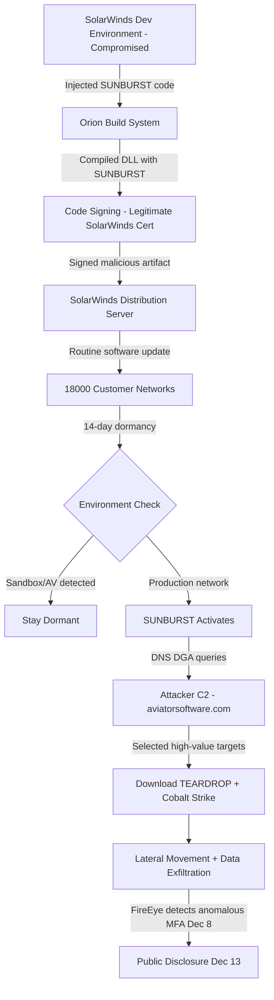

⚡ TL;DR - Discovered December 2020. Nation-state attack attributed to
SVR (Russian Foreign Intelligence Service). Attackers compromised the
SolarWinds Orion software build pipeline and injected the SUNBURST
backdoor into legitimate, signed software updates. Approximately 18,000
organizations installed the malicious Orion update (build 2019.4 through
2020.2.1). Confirmed victims: US Treasury, Commerce, Homeland Security,
State, Justice Departments, FireEye, Microsoft, Intel, Cisco, ~100 private
companies. The backdoor was dormant for 14 days after installation before
activating to blend with normal SolarWinds traffic. Discovered by FireEye
(December 8, 2020) when they noticed stolen red team tools. Lesson: supply
chain attacks targeting build pipelines can compromise any number of downstream
customers via legitimate, signed distribution channels - requiring SLSA
framework, build reproducibility, and code signing verification.

---

| #088 | Category: Security | Difficulty: ★★★★ |
|:---|:---|:---|
| **Depends on:** | OWASP Top 10, Authentication, Session Management, Secrets Management, IAM, TLS Configuration, Security Logging, Security Testing in CI/CD, Heartbleed 2014, Log4Shell 2021 | |
| **Used by:** | Equifax 2017, CVE + NVD, Responsible Disclosure, SAST in CI/CD, DevSecOps Pipeline Design, Enterprise Security Architecture, SLSA Framework, Platform Security Engineering, CVE Research | |
| **Related:** | OWASP Top 10, Authentication, IAM, Security Logging, Heartbleed, Log4Shell, Equifax, CVE + NVD, Responsible Disclosure, SLSA Framework, Platform Security Engineering | |

---

### 🔥 The Problem This Solves

**WHY SUPPLY CHAIN ATTACKS BYPASS ALL STANDARD SECURITY CONTROLS:**

```
THE TRUSTED UPDATE PROBLEM:

  Standard enterprise security model:
    - Software from known vendors: TRUSTED
    - Vendor code-signed: TRUSTED
    - Distributed through official channels: TRUSTED
    - Installed by authorized administrators: TRUSTED
    - Antivirus scanned: PASS
    - Firewall: allows (authorized software calling home is normal)
    - EDR (Endpoint Detection and Response): no anomalies detected
    
    RESULT: SolarWinds Orion installed on 18,000 networks.
    RESULT: SUNBURST backdoor installed on 18,000 networks.
    RESULT: All security controls passed.
  
  THIS IS THE SUPPLY CHAIN ATTACK THREAT MODEL:
    
    Traditional attacks: attacker → target (direct, blocked by perimeter)
    Supply chain attack: attacker → software vendor → target
    
    The vendor is the breach point.
    The software update is the delivery mechanism.
    The victim installs the malware themselves, voluntarily.
    The malware is signed with the vendor's legitimate code signing certificate.
    The malware calls the same domains as the legitimate software.
    
  WHAT WAS COMPROMISED:
    SolarWinds was NOT a poorly secured startup.
    2020 revenue: $938M. Thousands of enterprise customers.
    Their IT monitoring product (Orion) was used to manage
    networks at thousands of organizations.
    
    The attackers compromised:
    - SolarWinds' software development environment (Orion build pipeline)
    - Injected malicious code (SUNBURST) into Orion DLL before compilation
    - The infected DLL was compiled by SolarWinds' own build system
    - Signed with SolarWinds' own code signing certificate
    - Distributed via SolarWinds' own update servers
    - Installed by IT administrators as a routine update
    
    The attack bypassed ALL of these controls:
      Certificate verification: certificate is legitimate → pass
      Antivirus signature scan: malware was novel → pass
      Network monitoring: traffic mimicked legitimate Orion traffic → pass
      Firewall rules: Orion is allowed to call home → pass
      Endpoint detection: dormancy period avoided behavioral detection → pass

SCOPE AND IMPACT:
  
  18,000 organizations installed the malicious update.
  Of those: attackers selectively activated SUNBURST on ~100 high-value targets.
  (Not all 18,000 were exploited - attackers were surgical, not destructive)
  
  Confirmed breach victims:
  - US Treasury Department: email system compromised
  - US Commerce Department (NTIA): email system compromised
  - US Homeland Security: Secretary's email compromised
  - US State Department, Justice Department, Pentagon (DISA)
  - FireEye: red team tools stolen (FireEye's discovery led to public disclosure)
  - Microsoft: source code accessed (Bing, Cortana, Azure components)
  - Intel, Cisco, Nvidia, Belkin
  
  Dwell time: 8-9 months from initial compromise to discovery.
  During those 9 months: adversaries had persistent, privileged access
  to the most sensitive US government networks.
```

---

### 📘 Textbook Definition

**Supply chain attack:** A cyberattack that targets a less-secure element
in the supply chain to compromise a downstream organization. Rather than
attacking the final target directly, the attacker compromises software,
hardware, or services used by the target. The target then installs or
uses the compromised component, believing it is legitimate and trusted.

**SUNBURST:** The specific backdoor malware inserted into SolarWinds Orion.
A DLL (SolarWinds.Orion.Core.BusinessLayer.dll) was modified to include
SUNBURST code that executed during normal Orion operation. SUNBURST used
a domain generation algorithm (DGA) for C2 communication, disguised as
normal Orion traffic to aviatorsoftware.com subdomain queries.

**Build pipeline compromise:** An attack targeting the software build and
distribution pipeline rather than the source code repository. Even if source
code is clean, a compromised build system can inject malicious code into
compiled artifacts before signing and distribution.

**SLSA (Supply Chain Levels for Software Artifacts):** A security framework
(Google origin, now CNCF project) providing a tiered system of requirements
for software supply chain security. Levels 0-3 address source integrity,
build integrity, and provenance. Directly motivated by attacks like SolarWinds.

**Code signing:** Using a private key to cryptographically sign compiled
software artifacts. Consumers verify the signature using the corresponding
public key/certificate to confirm the artifact came from the expected vendor
and was not tampered with. Note: code signing only proves the artifact
was signed by the certificate holder - if the build pipeline is compromised,
the malicious artifact gets signed by the legitimate certificate.

**Provenance:** Verifiable metadata describing how an artifact was built:
what source code, what build system, what tools, what configuration. Goes
beyond code signing - proves not just WHO signed the artifact but WHAT
process produced it. Required by SLSA Level 2+.

---

### ⏱️ Understand It in 30 Seconds

**One line:**
SolarWinds: attackers broke into the software vendor's build system
(not the customer's system), added a backdoor to the software before
it was compiled and signed, then let SolarWinds distribute it to 18,000
customers as a legitimate, digitally signed software update.

**One analogy:**
> A food manufacturer ships sealed, inspected cans to supermarkets.
> Customers trust sealed cans from a known brand.
>
> Supply chain attack:
> Attackers don't target the supermarkets (too many, too hard).
> Attackers don't poison the cans in transit (tracking exists).
> Attackers compromise the manufacturing facility's sealing machine.
> The sealing machine now adds a small amount of poison to each can
> before the official quality seal is applied.
>
> Result:
> - Quality inspector seals all cans: PASS (poison added before inspection)
> - Cans are inspected and labeled "QUALITY CERTIFIED": PASS
> - Supermarkets receive and sell legitimate-looking certified cans: PASS
> - Customers buy and consume sealed, certified poison
>
> The attack didn't need to defeat any of the downstream security controls.
> The attack defeated the manufacturing security.
> Once the factory is compromised: all downstream security is worthless.
>
> SolarWinds: the factory = SolarWinds build environment.
> The sealing machine = their build system/MSBuild.
> The quality seal = SolarWinds code signing certificate.
> The supermarkets = 18,000 enterprise customers.

---

### 🔩 First Principles Explanation

**How SUNBURST was injected and operated:**

```
PHASE 1: INITIAL COMPROMISE OF SOLARWINDS (February 2020)
  
  Method: Not fully disclosed. Suspected paths:
    - Compromised developer credentials (password spray or phishing)
    - Exploitation of SolarWinds internal infrastructure
    - Third-party software used in SolarWinds development environment
    
  Attacker access: SolarWinds' development environment.
  Specifically: the build system for Orion (network monitoring platform).

PHASE 2: BUILD PIPELINE INJECTION
  
  Target: SolarWinds.Orion.Core.BusinessLayer.dll
  This DLL is a core component of Orion, loaded by the main application.
  
  Injection method:
    The attackers modified the source code OR modified the build pipeline
    to inject SUNBURST code into this DLL.
    
    The SUNBURST DLL modification was surgical:
    - Existing class: SolarWinds.Orion.Core.BusinessLayer.BackgroundInventory
    - Existing method: RefreshInternal() (legitimate business method)
    - SUNBURST code added to the class: OrionImprovementBusinessLayer
    - SUNBURST initialized: when RefreshInventory() was called, 
      it triggered SUNBURST via OrionImprovementBusinessLayer.Initialize()
    
    DELIBERATE OBFUSCATION:
    - Class and method names: designed to look like legitimate Orion code
    - "OrionImprovementBusinessLayer" sounds like a real business layer class
    - Code structure: matches SolarWinds coding conventions
    
  IMPORTANT: This was NOT source code injection in the repository.
  Mandiant (FireEye's IR team) analysis suggested the attackers modified
  the build process itself or had deep enough access to modify artifacts
  post-compilation, before signing. The source code in the SCM may have
  been clean while the build artifacts were malicious.

PHASE 3: SIGNING WITH LEGITIMATE CERTIFICATE
  
  SolarWinds' normal build process:
    Compile → Sign with SolarWinds code signing cert → Distribute
    
  With SUNBURST:
    Compile (includes SUNBURST DLL) → Sign (SolarWinds cert signs malicious DLL)
    → Distribute via SolarWinds update infrastructure
    
  Certificate validation: the signature is valid (SolarWinds' own cert signed it).
  There is NO cryptographic proof that the signed artifact matches
  a specific clean source code commit. (This is what SLSA provenance addresses.)

PHASE 4: DISTRIBUTION AS LEGITIMATE UPDATE
  
  Orion build versions containing SUNBURST:
    Orion Platform 2019.4 HF 5 (build 2019.4.5200.9083)
    Orion Platform 2020.2 (build 2020.2.100.12219)
    Orion Platform 2020.2.1 (build 2020.2.1.6020)
    
  Distribution: through SolarWinds' official software portal.
  IT administrators installed these as routine security/feature updates.
  Approx 18,000 organizations installed at least one malicious build.

PHASE 5: DORMANCY (14 days)
  
  SUNBURST did NOT activate immediately after installation.
  
  Dormancy period: 12-14 days.
  Reason: allow the artifact to pass through post-deployment monitoring.
  
  During dormancy:
    - EDR behavioral baselines don't flag (software just installed, normal behavior period)
    - Security analysts don't investigate newly installed vendor updates
    - No network callbacks to attacker infrastructure
    
  After dormancy:
    - SUNBURST checks: is it running in a sandbox? (domain name checks, process checks)
    - SUNBURST checks: certain security tools running? (if AV in list → stay dormant)
    - If environment looks like a production network: activates

PHASE 6: C2 COMMUNICATION (AVOIDANCE)
  
  SUNBURST used a Domain Generation Algorithm (DGA).
  C2 domain: subdomains of aviatorsoftware.com
  
  Why aviatorsoftware.com:
    - SolarWinds Orion already made DNS queries to aviatorsoftware.com
      as part of legitimate operation (or similar-looking subdomain patterns)
    - SUNBURST C2 traffic looked like normal Orion DNS queries to network monitors
    
  Encoded data in DNS subdomain:
    - Victim organization's AD domain (encoded)
    - SUNBURST version info
    - Current activity state
    
  DNS-based C2: harder to detect than HTTP-based (DNS traffic is typically
  less scrutinized than HTTP, and encrypted DNS was not common in 2020).

PHASE 7: SELECTIVE ACTIVATION
  
  Of ~18,000 installations:
    Attackers selectively escalated access on ~100-150 high-value targets.
    (FireEye, US Treasury, US Commerce, State, Justice, Defense, Microsoft, etc.)
    
    Not all 18,000 were exploited aggressively:
    The attackers were intelligence-focused, not destructive.
    They chose specific targets of intelligence value.
    
    For selected targets:
    - SUNBURST fetched and loaded additional malware payloads (TEARDROP, RAINDROP)
    - TEARDROP was a memory-only loader (no file on disk)
    - Loaded Cobalt Strike Beacon (commercial pentest framework)
    - Used for lateral movement, credential harvesting, data exfiltration

PHASE 8: DISCOVERY (December 8, 2020)
  
  FireEye noticed that someone had used their credentials to register
  a new MFA device from an unusual location.
  This was a human analyst noticing an anomalous MFA registration.
  
  FireEye investigated: found SUNBURST. Notified Microsoft and US government.
  December 13, 2020: public disclosure.
  FireEye published indicators of compromise immediately.
  CISA issued Emergency Directive 21-01: disconnect or power off SolarWinds Orion.
  
  Note: SUNBURST had been active in production environments since
  approximately March 2020 (8-9 months of active compromise before detection).
```

---

### 🧪 Thought Experiment

**SCENARIO: Designing a build pipeline that resists SolarWinds-class attacks:**

```
PROBLEM: How do you prove that a software artifact was built from
the source code you expect, with no tampering?

Current state (pre-SLSA):
  Developer: pushes code to git
  CI/CD: clones repo, runs build, produces artifact
  Security: artifact is code-signed → distributed to customers
  
  Weakness: the CI/CD system itself is trusted implicitly.
  If CI/CD is compromised: malicious artifact gets signed and shipped.
  Nothing proves the artifact matches what was in git.

SLSA SOLUTION (Supply Chain Levels for Software Artifacts):

  SLSA Level 1: Basic provenance
    - Build system generates provenance document
    - "This artifact was produced by build #1234 at timestamp T 
       from commit abc123 of repo X"
    - Provenance document is signed by the build system
    - Consumer can verify: provenance document exists
    
  SLSA Level 2: Hosted build service
    - Build runs on a hosted service (GitHub Actions, Cloud Build)
    - Source is fetched from a version control system
    - Provenance is generated by the hosted service (not by developer)
    - Developer CANNOT modify the provenance (it comes from the service)
    
  SLSA Level 3: Build service hardening
    - Build runs on ephemeral, isolated environments
    - No persistent access to build workers between builds
    - Source integrity verified (no code modifications during build)
    - Build is reproducible: same source → same binary (binary reproducibility)
    
  SLSA Level 4 (aspirational): Hermetic builds
    - All build inputs are captured and verified
    - Builds are reproducible by any party from source
    - Two independent build systems produce identical artifacts
    - Mathematical proof: artifact X corresponds exactly to source code commit Y
    
  HOW SLSA WOULD HAVE HELPED WITH SOLARWINDS:
  
    With SLSA Level 2:
      Build provenance: "artifact X was built from commit abc123 in repo Y 
      on GitHub Actions runner #12345 at timestamp T"
      
      Customer verification: "does the provenance of Orion DLL X 
      match a known-clean commit in SolarWinds' repo?"
      
      If attackers modified the build artifact AFTER compilation:
        → provenance still references the correct commit
        → artifact hash in provenance would NOT match modified DLL
        → cryptographic mismatch → detected
      
      If attackers modified the build system to inject code at compile time:
        → the modified DLL would be built from a modified process
        → with hermetic builds, the artifact would differ from
          an independent build from the same source
        → discrepancy reveals injection
    
  COMPLEMENTARY CONTROLS:
    - Binary reproducibility: multiple independent parties build from source
      and verify identical hash → any tampering detected
    - Dependency pinning: all dependencies use hash-pinned versions,
      not semver ranges (supply chain attack via dependency confusion)
    - Code signing with transparency logs: like Certificate Transparency
      for binaries → all signed artifacts recorded publicly
    - SBOM generation: mandatory, signed, attested to all customers
      (enables rapid response to Log4Shell/Heartbleed class issues)
```

---

### 🧠 Mental Model / Analogy

> Two-factor verification for software:
>
> Traditional: "This software is signed with SolarWinds' key." → Trust.
>
> SLSA: "This software is signed with SolarWinds' key AND
>        I can verify that this exact binary was produced from
>        commit abc123 in this specific repository, on this specific
>        build system, at this specific time."
>
> The first gives authenticity (comes from SolarWinds).
> The second gives PROVENANCE (came from this specific clean source).
>
> Heartbleed comparison:
> Code signing = knowing who baked the bread.
> SLSA provenance = knowing which wheat field, which mill, which recipe,
>                   which oven, which baker, at what temperature.
>
> SolarWinds had code signing. The bread was signed "SolarWinds."
> But the recipe was modified by an attacker at the factory.
> SLSA provenance would have made the factory modification detectable.

---

### 📶 Gradual Depth - Five Levels

**Level 1 - What it is (anyone can understand):**
SolarWinds attackers (Russian intelligence) didn't hack the victims directly. They hacked SolarWinds' software factory - the system that builds their IT monitoring product. They secretly added a backdoor to the product before it was finalized and distributed. 18,000 organizations then installed the sabotaged version as a normal update. The customers did nothing wrong - they trusted a legitimate vendor.

**Level 2 - How to use it (junior developer):**
The attack vector: compromised build pipeline. The lesson for developers: code review and penetration testing of your application are insufficient if your build system, dependency pipeline, or developer machines can be compromised. Defenses: SLSA framework for build integrity, SBOM (Software Bill of Materials) for dependency inventory, code signing with provenance, reproducible builds.

**Level 3 - How it works (mid-level engineer):**
SUNBURST was injected into `SolarWinds.Orion.Core.BusinessLayer.dll` during the build process. The DLL was signed with SolarWinds' legitimate certificate - the signature validates, antivirus passes, enterprise security approves. SUNBURST: dormant 14 days → checks environment for sandbox/AV → activates → DNS-based C2 using subdomains of aviatorsoftware.com → selected victims: downloads additional payloads (TEARDROP) → Cobalt Strike for lateral movement → credential harvesting and data exfiltration. Eight months dwell time. Detected only because FireEye noticed anomalous MFA registration.

**Level 4 - Why it was designed this way (senior/staff):**
SolarWinds was a sophisticated, targeted, persistent threat (APT) operation. The attackers invested months to understand SolarWinds' development process and build system before injecting SUNBURST. The choice of DNS for C2: DNS traffic is ubiquitous, rarely blocked, and less monitored than HTTP/HTTPS. DNS subdomains can encode small amounts of data per query. SUNBURST used the victim's AD domain name as a data channel (each beacon included the encoded domain). The 14-day dormancy: modern EDR products build behavioral baselines during the first weeks of installation. Dormancy lets baselines form without anomalous activity, then activation happens within "normal" behavior context. Selective activation: intelligence-gathering (not ransomware/destruction) - only activating on high-value targets minimizes exposure risk for the broader operation.

**Level 5 - Mastery (distinguished engineer):**
SUNBURST technical sophistication: the malware was written to resist analysis. The DGA used a custom encoding algorithm that embedded the victim's domain name in DNS queries as an identifier - the attacker could track active infections across 18,000 customers without maintaining a database. The C2 protocol: DNS TXT responses contained encoded commands (dormant, active, uninstall, execute). No HTTP callback = harder to detect. Defender perspective: detecting SUNBURST required: (1) DNS query analysis (unusual subdomain patterns to aviatorsoftware.com), (2) DLL hash comparison against known-good builds (possible with SLSA provenance), (3) behavioral monitoring of the specific DLL (TEARDROP was memory-only, leaving no file system evidence). The broader implications: US intelligence community has since acknowledged that nation-state supply chain attacks are a persistent, systemic threat. CISA, NSA, and NIST have all issued guidance mandating supply chain security controls (SBOM, SLSA, zero trust) for critical infrastructure software.

---

### ⚙️ How It Works (Mechanism)

```
SOLARWINDS ATTACK TIMELINE:

  Oct 2019:    Attackers test injection in SolarWinds build pipeline
               (early SUNBURST test code detected in later forensics)
  Mar 2020:    SUNBURST-infected Orion 2019.4 HF 5 released
  Mar-Jun 2020: SUNBURST installed on ~18,000 networks
  Jun-Jul 2020: Attackers selectively activate SUNBURST on high-value targets
  Aug 2020:    SUNBURST infrastructure starts using more covert C2
  Oct-Nov 2020: Attackers access FireEye's red team tool vault
  Dec 8, 2020:  FireEye notices anomalous MFA registration
  Dec 13, 2020: SolarWinds, FireEye, Microsoft public disclosure
  Dec 13, 2020: CISA Emergency Directive 21-01 (disconnect Orion)
  
  Total dwell time: ~8 months from first infections to discovery
```



---

### 💻 Code Example

**SLSA provenance verification (defensive implementation):**

```yaml
# .github/workflows/build-with-slsa.yml
# GitHub Actions workflow implementing SLSA Level 2 provenance

name: Build with SLSA Provenance

on:
  push:
    branches: [main]
  release:
    types: [published]

jobs:
  build:
    name: Build and Attest
    runs-on: ubuntu-latest
    permissions:
      id-token: write   # Required for OIDC token (provenance signing)
      contents: read
      attestations: write
    
    steps:
      - name: Checkout source
        uses: actions/checkout@v4
        with:
          # Pin to specific commit hash (not branch/tag):
          # This ensures we build from exactly this source.
          ref: ${{ github.sha }}
      
      - name: Build artifact
        run: |
          mvn package -DskipTests
          # Produces: target/my-app-1.0.0.jar
      
      - name: Calculate artifact hash
        id: hash
        run: |
          SHA256=$(sha256sum target/my-app-1.0.0.jar | cut -d' ' -f1)
          echo "sha256=$SHA256" >> $GITHUB_OUTPUT
      
      # Generate SLSA provenance attestation:
      # This creates a signed statement: "artifact with hash X was produced
      # from commit Y in repository Z at time T by this workflow run"
      - name: Generate SLSA provenance
        uses: actions/attest-build-provenance@v1
        with:
          subject-path: target/my-app-1.0.0.jar
      
      # Publish with attestation:
      - name: Upload to registry with attestation
        run: |
          # Consumer can verify:
          # gh attestation verify my-app-1.0.0.jar \
          #   --repo myorg/my-app \
          #   --signer-workflow .github/workflows/build-with-slsa.yml

# CONSUMER VERIFICATION:
# Before installing/deploying my-app-1.0.0.jar:
#
# 1. Verify the artifact was built from the expected source:
#    gh attestation verify my-app-1.0.0.jar \
#      --repo myorg/my-app \
#      --signer-workflow .github/workflows/build-with-slsa.yml
#
# 2. Verify the provenance references the expected commit:
#    gh attestation inspect my-app-1.0.0.jar
#    → Shows: repo, workflow, commit SHA, timestamp
#
# If SolarWinds had used SLSA:
#   Attacker injected code into build system → modified DLL
#   Provenance: "built from commit abc123"
#   Artifact hash: does NOT match provenance (DLL was modified)
#   Customer verification: FAIL → artifact rejected
```

---

### ⚖️ Comparison Table

| Attribute | SolarWinds/SUNBURST | NotPetya (2017) | XZ Utils Backdoor (2024) |
|:---|:---|:---|:---|
| **Target** | IT monitoring customers | Ukrainian organizations | Linux SSH daemon users |
| **Method** | Build pipeline injection | Software update mechanism | Open source project social engineering |
| **Attribution** | SVR (Russia) | GRU (Russia) | Unattributed (JiaT75) |
| **Goal** | Espionage (intelligence) | Destructive (disk wipe) | Backdoor (credential exfiltration) |
| **Dwell time** | 8-9 months | Days (destructive) | 2+ years (maintainer grooming) |
| **Discovery** | FireEye IR anomaly | Network spread pattern | Performance regression in SSH |
| **SLSA prevents** | Partial (provenance) | N/A | Partial (build integrity) |

---

### ⚠️ Common Misconceptions

| Misconception | Reality |
|:---|:---|
| "Code signing proves the software is safe." | Code signing proves the artifact was signed by the entity holding the private key. It does NOT prove the artifact was produced from clean source code or a secure build process. In SolarWinds, the malicious artifact was signed with SolarWinds' legitimate certificate because SolarWinds' build system produced and signed it. The certificate was valid. The software was malicious. Code signing is necessary (prevents drive-by tampering in transit) but insufficient as a security guarantee. SLSA provenance goes further: it proves what source code, what build system, and what process produced the artifact - creating an auditable chain of custody from source to signed artifact. |
| "Only huge companies are targets for supply chain attacks." | Supply chain attacks target the organizations that are TRUSTED by their eventual victims. SolarWinds itself was not the ultimate target - the US government and Fortune 500 companies were. SolarWinds was a vector. Any software vendor, library author, or infrastructure provider who has trusted relationships with valuable targets is a potential supply chain attack vector. npm package poisoning attacks have targeted small, highly-depended-upon packages maintained by individual developers. The XZ Utils backdoor targeted a single maintainer of a core Linux utility. Scale of the vendor is irrelevant; what matters is: how many downstream organizations trust and install this software? |

---

### 🚨 Failure Modes & Diagnosis

**Detecting supply chain attacks and implementing defenses:**

```
DETECTION: IDENTIFYING SUPPLY CHAIN COMPROMISE
  
  1. Artifact hash verification (basic):
     # Before deploying any software:
     # Compare artifact hash against hash published at a separate location.
     sha256sum SolarWinds-Orion-Platform-2020.2.1.exe
     # Compare with hash published on SolarWinds security advisory page.
     # If hashes differ: artifact tampered in transit or at source.
     # Problem: if source is compromised, published hash is also compromised.
  
  2. SLSA provenance verification (stronger):
     # Verify artifact was built from expected source by expected process:
     gh attestation verify artifact.jar --repo vendor/product
     # Checks: signature, source commit, build workflow, timestamp
     # Even if vendor is compromised: provenance shows WHICH commit produced it.
     # Security team can diff that commit against last-known-clean.
  
  3. Behavioral analysis of installed software:
     # Monitor for unexpected network connections from installed software:
     # Orion calling DNS queries to unusual subdomains → alert.
     
     # DNS query logging (AWS VPC DNS logs):
     aws logs filter-log-events \
       --log-group-name /aws/route53 \
       --filter-pattern "aviatorsoftware.com"
     
     # Or: network firewall DNS logging
     # Alert: known monitoring software querying unusual domains.
  
  4. Binary comparison against known-good builds:
     # If you have a previous known-good installation:
     md5sum /opt/solarwinds/orion/SolarWinds.Orion.Core.BusinessLayer.dll
     # Compare against: hash of previous version, vendor-published hash.
  
  PREVENTION: REDUCING SUPPLY CHAIN ATTACK SURFACE
  
    1. Software inventory and approval process:
       - Maintain approved software list with pinned versions
       - Require security review before adding new dependencies
       - SBOM for all production software
    
    2. Network egress controls:
       - Allowlist outbound connections for each application
       - Production systems: no outbound internet except to known endpoints
       - DNS: monitor for unusual query patterns from internal systems
    
    3. Minimal privilege for installed software:
       - Don't run Orion (or any monitoring tool) as SYSTEM/domain admin
       - Use dedicated service accounts with minimal required permissions
       - The Orion service account had administrative rights on customer networks
         → this enabled lateral movement after SUNBURST activated
    
    4. Network segmentation:
       - Orion should not have direct access to domain controllers
       - Monitoring systems should not have privileged access to
         the systems they monitor (read-only where possible)
       - Compromise of monitoring tool = limited blast radius
```

---

### 🔗 Related Keywords

**Prerequisites:**
- `Security Logging and Monitoring` (SEC-073) - SUNBURST used DNS as covert C2
- `SLSA Framework` (SEC-123) - the direct defense against SolarWinds-class attacks

**Builds on this:**
- `Equifax 2017` (SEC-089) - complementary major breach case study
- `SLSA Framework` (SEC-123) - provenance and build integrity
- `Platform Security Engineering` (SEC-124) - build pipeline hardening

---

### 📌 Quick Reference Card

```
┌──────────────────────────────────────────────────────────┐
│ ATTACK TYPE  │ Supply chain - build pipeline compromise  │
│ ATTRIBUTION  │ SVR (Russia), Cozy Bear / APT29           │
├──────────────┼───────────────────────────────────────────┤
│ AFFECTED     │ ~18,000 installed; ~100 actively exploited│
│ DWELL TIME   │ ~8 months (March to December 2020)        │
├──────────────┼───────────────────────────────────────────┤
│ TECHNIQUE    │ DLL injection in build pipeline           │
│ C2           │ DNS subdomains (DGA) of aviatorsoftware.com│
├──────────────┼───────────────────────────────────────────┤
│ DETECTED BY  │ FireEye: anomalous MFA device registration│
├──────────────┼───────────────────────────────────────────┤
│ KEY LESSON   │ Code signing != safe software             │
│              │ SLSA provenance proves build chain        │
│ DEFENSES     │ SLSA, SBOM, egress control, least priv,  │
│              │ segment monitoring tools, binary signing  │
└──────────────────────────────────────────────────────────┘
```

---

### 💎 Transferable Wisdom

**Reusable Engineering Principle:**
"Trust in software must extend to the process that produced it, not just
the entity that signed it."
Pre-SolarWinds security model: "Is this signed by a trusted vendor? Yes. Trust it."
Post-SolarWinds security model: "Is this signed by a trusted vendor AND can I
verify the build process, source code, and build environment that produced it?"
SLSA (Supply Chain Levels for Software Artifacts) operationalizes this principle:
Level 1: provenance exists (who claims to have built it).
Level 2: provenance from a trusted build service (GitHub Actions, Cloud Build).
Level 3: tamper-resistant build environment, isolated builds.
Level 4: hermetic, reproducible builds (independent verification possible).
The practical application for engineering teams:
Internal software: implement SLSA Level 2 for your own CI/CD pipelines.
GitHub Actions attestation: one workflow addition enables provenance generation.
External dependencies: prefer packages with SLSA attestations when available.
SBOM: generate and publish a signed SBOM for every release.
This principle extends beyond software:
Infrastructure as Code: verify that deployed infrastructure matches
  the exact Terraform/Helm configuration in your approved source.
Container images: image digest pinning (sha256 hash, not tag name).
  Tags can be overwritten. Digests are immutable.
npm packages: lock files (package-lock.json) + checksum verification.
  A dependency with a matching package name but tampered code =
  dependency confusion attack (another supply chain vector).
The lesson from SolarWinds: the attacker who can compromise your build system
does not need to attack your application code. Build system compromise =
compromise of every artifact your build system produces.

---

### 💡 The Surprising Truth

The SolarWinds breach was discovered accidentally by a human, not by a security tool.

FireEye's IT security team noticed that an employee had registered a new
Multi-Factor Authentication (MFA) device. The security team's standard practice:
verify any new MFA device registration with the account owner by phone.

The employee: "I didn't register a new MFA device."

That anomaly led to the discovery of SUNBURST, which led to the entire
SolarWinds investigation, which revealed the largest known espionage
operation in US government history.

What this means:
- 8 months of active compromise: not detected by any automated tool.
- Detected by: a security analyst asking "did you register this device?"
- The detective control that worked: anomaly alert on MFA registration
  + human follow-through to verify with the account owner.

The attacker had obtained valid credentials (and presumably MFA bypass
or session tokens) to move laterally after deploying SUNBURST.
They registered a new MFA device to establish persistent access to FireEye systems.
This specific action - an unusual MFA device registration - was the one behavioral
anomaly that triggered human investigation.

The lesson for detection engineers: not every attack pattern can be
automatically detected. The most sophisticated attacks blend into
legitimate behavior. The controls that catch sophisticated attacks often
involve: (1) monitoring for access pattern anomalies (new MFA device, new device,
login from new location), (2) having an escalation path where anomalies
reach a human analyst who is empowered to ask "did you do this?", and
(3) employees who know to say "no, that wasn't me" when asked.
The SUNBURST detection required all three.

---

### ✅ Mastery Checklist

**You've mastered this when you can:**
1. **EXPLAIN** the supply chain attack model: why compromising the build
   pipeline lets attackers deliver malware through legitimate, signed distribution
   channels to all downstream customers.
2. **DESCRIBE** SUNBURST's evasion techniques: 14-day dormancy, DNS-based C2
   mimicking legitimate traffic, selective activation on high-value targets.
3. **ARTICULATE** why code signing is necessary but insufficient: signing proves
   who signed, not what process produced the artifact. SLSA provenance adds
   build process verification.
4. **OUTLINE** SLSA framework levels and how Level 2 provenance would have
   made build tampering detectable in the SolarWinds case.

---

### 🎯 Interview Deep-Dive

**Q: What was the SolarWinds SUNBURST attack? What type of attack
was it and what defenses would have helped?**

*Why they ask:* Tests knowledge of supply chain security - an emerging
and critical area. Shows awareness of sophisticated attack patterns beyond
application security.

*Strong answer covers:*
- Type: supply chain attack. Attackers compromised SolarWinds' build pipeline,
  injected SUNBURST backdoor into Orion DLL, which was then signed with
  SolarWinds' legitimate certificate and distributed to 18,000 customers.
- Evasion: 14-day dormancy (evades post-install behavioral analysis),
  DNS-based C2 mimicking legitimate traffic, sandbox/AV detection before activating.
- Selective: only ~100 of 18,000 installations were actively exploited (intelligence op).
- Dwell time: 8 months before detection. Detected by FireEye via anomalous MFA registration.
- Victims: US government (Treasury, Commerce, DHS, State, Justice), FireEye, Microsoft.
- Why standard controls failed: signed with legitimate cert (code signing passed),
  DNS traffic mimicked legitimate Orion traffic (network monitoring passed),
  dormancy period (EDR behavioral baselines formed without anomaly).
- Defenses:
  1. SLSA provenance: verify artifact was built from specific clean source commit.
     Build tampering would produce provenance mismatch.
  2. Binary reproducibility: independent build → compare hashes.
  3. Network egress filtering: block outbound DNS queries to unexpected domains.
  4. Least privilege: Orion service account should not have domain admin rights.
     Limits blast radius if monitoring tool is compromised.
  5. Network segmentation: monitoring tools read-only access.
  6. SBOM: know exactly what software versions are deployed where.
- Code signing lesson: signing proves WHO signed, not WHAT produced it.
  SLSA provenance links artifact to source code commit + build process.
- Detection lesson: automated tools failed for 8 months. Detection
  came from human analyst noticing MFA anomaly.