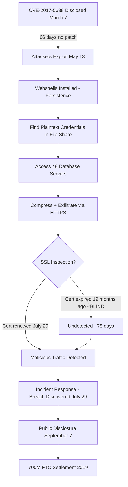

⚡ TL;DR - July 2017. The Equifax data breach exposed the personal
information of 147 million Americans via an unpatched Apache Struts 2
Remote Code Execution vulnerability (CVE-2017-5638). The patch was
available since March 2017. Equifax's failure to apply it within the
standard patching window allowed attackers to exploit it from May 13
through July 30, 2017 (78 days). The breach exposed SSNs, birth dates,
addresses, driver's license numbers, and 209,000 credit card numbers.
Contributing factors: the SSL/TLS inspection certificate had expired
19 months prior, making encrypted malicious traffic invisible to network
monitors. Total settlement: $700M (FTC, 2019). Lesson: critical vulnerability
patch SLA (CVSSv3 9+ = 24-72 hours), network monitoring certificate hygiene,
and patching is not optional for production systems with public CVEs.

---

| #089 | Category: Security | Difficulty: ★★★★ |
|:---|:---|:---|
| **Depends on:** | OWASP Top 10, Authentication, Session Management, Secrets Management, IAM, TLS Configuration, Security Logging, Security Testing in CI/CD, Heartbleed 2014, Log4Shell 2021, SolarWinds 2020 | |
| **Used by:** | CVE + NVD, Responsible Disclosure, IR Process, Digital Forensics Basics, Security Observability + SIEM, DevSecOps Pipeline Design, Enterprise Security Architecture | |
| **Related:** | OWASP Top 10, Authentication, IAM, Security Logging, Heartbleed, Log4Shell, SolarWinds, CVE + NVD, IR Process, Digital Forensics | |

---

### 🔥 The Problem This Solves

**WHY PATCH MANAGEMENT IS A SECURITY-CRITICAL PROCESS:**

```
THE PUBLIC CVE WINDOW PROBLEM:

  When a CVE is publicly disclosed:
    - The vulnerability is PUBLIC KNOWLEDGE
    - Proof-of-concept exploit code: often published within 24-48 hours
    - Automated exploit toolkits (Metasploit modules): within 1-7 days
    - Automated scanning and exploitation: within days to weeks
    
  For every unpatched system with a known CVE:
    The organization is in a race against every attacker who reads CVE feeds.
    
  EQUIFAX TIMELINE:
    
    March 7, 2017: Apache Struts CVE-2017-5638 disclosed.
      - CVSSv3 Score: 10.0 (CRITICAL, maximum)
      - Patch: Apache Struts 2.3.32 / 2.5.10.1 released same day
      - PoC: public exploit code published within days
      
    March 9, 2017: Equifax internal security team receives alert.
      - "Critical: Apache Struts vulnerability CVE-2017-5638. Patch within 48 hours."
    
    March 9 - May 12, 2017: Equifax does NOT patch the vulnerable system.
      Why? Multiple contributing factors:
        - Patch communication breakdown: email sent to wrong team
        - Asset inventory: 300+ internet-facing Struts apps, 
          which one was running vulnerable version?
        - Change management process: patching requires tickets, approvals,
          change windows (scheduled for next maintenance window)
        - The specific system was not identified in the asset inventory
          (it was legacy/forgotten)
    
    May 13, 2017: Attackers begin exploiting CVE-2017-5638 against Equifax.
      - 66 days after public disclosure, 64 days after patch was available.
    
    May 13 - July 29, 2017: 78 days of undetected exploitation.
      - Attackers exfiltrate data from 51 databases
      - 147 million Americans' PII
      - Tools: webshells, data compression, exfiltration scripts
      - Traffic was encrypted: Equifax's SSL inspection cert expired 19 months earlier.
        Network monitoring: blind to encrypted malicious traffic for 19 months.
        This specific expired cert was the reason the breach went undetected for 78 days.
    
    July 29, 2017: Expired SSL cert FINALLY renewed. Traffic inspection resumes.
      Within hours: malicious traffic detected.
      
    July 29, 2017: Equifax discovers the breach.
    
    September 7, 2017: Public disclosure (72 days after discovery - GDPR-equivalent
      notification window barely met, disclosed after stockpiling concerns arose).
    
  THE 78 DAYS:
    78 days of active, undetected data exfiltration.
    An expired certificate is what prevented detection for 78 days.
    A known-critical vulnerability unpatched for 66 days is what enabled the breach.
    Both failures were organizational/process failures, not technical impossibilities.
```

---

### 📘 Textbook Definition

**Apache Struts 2 (CVE-2017-5638):** A Remote Code Execution vulnerability
in Apache Struts 2 web framework (Java). When a request contains a malformed
Content-Type header, the Struts 2 framework passes the header value to the
OGNL (Object Graph Navigation Language) expression evaluator without sanitization.
An attacker can inject arbitrary OGNL expressions, which Struts 2 evaluates
in the context of the JVM, resulting in remote code execution.

**Vulnerability management / patch management:** The organizational process
of identifying, classifying, remediating, and verifying security vulnerabilities
in IT assets. Requires: asset inventory (know what you have), vulnerability scanning
(know what's vulnerable), patch SLA (how quickly to patch by severity), and
verification (confirm patches applied).

**MTTR (Mean Time to Remediate) for vulnerabilities:** The average time from
vulnerability disclosure to patch applied to all affected systems. Industry
benchmark for critical CVEs: 24-72 hours for external/internet-facing systems.
Equifax's MTTR for CVE-2017-5638: 66 days (before breach) / never on the
affected system (breach occurred because system was never patched).

**SSL inspection / HTTPS inspection:** A security control where an enterprise
security appliance (firewall, proxy) terminates TLS connections, inspects the
decrypted traffic for threats, then re-encrypts to the destination. Uses a
corporate CA certificate that clients trust. If the inspection certificate
expires: the appliance may silently pass traffic through without inspection,
creating a security blind spot while appearing to function normally.

**GDPR Article 33 / breach notification:** GDPR requires notification of
personal data breaches to the supervisory authority within 72 hours of discovery
(when the breach is likely to result in risk to individuals). US equivalents:
FTC Act Section 5, state breach notification laws (all 50 states).

---

### ⏱️ Understand It in 30 Seconds

**One line:**
Equifax exposed 147 million Americans' credit data by failing to patch
a publicly known, max-severity vulnerability for 66 days - then failed
to detect the 78-day breach because a security monitoring certificate
had been expired for 19 months without anyone noticing.

**One analogy:**
> A bank receives a security alert: "The lock on your vault door
> has a known defect. Any locksmith can open it without a key.
> Here is the replacement lock. You must install it within 48 hours."
>
> The bank: receives the alert. Files a change management ticket.
> Schedules the lock replacement for next month's maintenance window.
>
> 66 days later: a thief uses the known defect to open the vault.
> The bank doesn't notice because the security camera batteries
> died 19 months ago and no one checked.
>
> The thief removes files for 78 days.
>
> A security guard finally replaces the camera batteries.
> First thing seen: the thief, mid-theft. Thief is removed.
>
> Two distinct failures:
> 1. Known defect → replacement available → never installed. (Patch management failure)
> 2. Security camera with dead batteries → called "functioning." (Monitoring hygiene failure)
>
> Either failure alone is serious.
> Together: 78 days of undetected theft of 147 million records.

---

### 🔩 First Principles Explanation

**CVE-2017-5638 (Apache Struts 2 RCE) mechanism:**

```
VULNERABILITY: Apache Struts 2 OGNL injection via Content-Type header

  NORMAL REQUEST:
    POST /login HTTP/1.1
    Content-Type: application/x-www-form-urlencoded
    
    → Struts 2 parses Content-Type header normally.
    → No issue.
  
  MALICIOUS REQUEST:
    POST /login HTTP/1.1
    Content-Type: %{(#_='multipart/form-data').
      (#dm=@ognl.OgnlContext@DEFAULT_MEMBER_ACCESS).
      (#_memberAccess?(#_memberAccess=#dm):
      ((#container=#context['com.opensymphony.xwork2.ActionContext.container']).
      (#ognlUtil=#container.getInstance(@com.opensymphony.xwork2.ognl.OgnlUtil@class)).
      (#ognlUtil.getExcludedPackageNames().clear()).
      (#ognlUtil.getExcludedClasses().clear()).
      (#context.setMemberAccess(#dm)))).
      (#cmd='id').
      (#iswin=(@java.lang.System@getProperty('os.name').toLowerCase().contains('win'))).
      (#cmds=(#iswin?{'cmd.exe','/c',#cmd}:{'/bin/sh','-c',#cmd})).
      (#p=new java.lang.ProcessBuilder(#cmds)).
      (#p.redirectErrorStream(true)).
      (#process=#p.start()).
      (#ros=(@org.apache.commons.io.IOUtils@toString(#process.getInputStream()))).
      (@org.apache.commons.lang3.StringUtils@join(#ros,''))}
    
    → Struts 2 parses malformed Content-Type.
    → When Content-Type parsing fails, Struts 2 uses the error handler.
    → Error handler evaluates the Content-Type value as an OGNL expression.
    → OGNL evaluates the expression: #cmd='id' → executes 'id' command.
    → Server returns command output in HTTP response.
    
    WHAT THE ATTACKER CAN DO:
    - Run any shell command as the web server user (often root or www-data)
    - Create webshells (upload a PHP/JSP file for persistent access)
    - Read files (database configs, credentials)
    - Exfiltrate data (compress, then HTTP POST to attacker server)
    - Create reverse shell (persistent interactive access)

SPECIFIC EQUIFAX EXPLOITATION:
  
  The attackers (attributed to China's PLA Unit 54938):
  
  Step 1 (May 13): Exploit CVE-2017-5638 to gain initial access.
    → Equifax's ACIS (Automated Consumer Interview System) portal.
    → Portal accepted disputed credit information from consumers.
    → Portal ran Apache Struts 2 (older unpatched version).
  
  Step 2: Deploy webshells for persistence.
    → Multiple webshells across multiple servers.
    → Webshells: small scripts that accept commands via HTTP.
    → Provided persistent access without re-exploitation.
  
  Step 3: Lateral movement.
    → Discovered unencrypted credentials in plaintext (flat files, config files).
    → Used credentials to access 48 additional database servers.
    → Admin credentials stored in plaintext in a shared file server directory.
      (Second major failure: credentials not in a secrets manager)
  
  Step 4: Data exfiltration (78 days).
    → Queried databases containing credit bureau PII.
    → Compressed data: Equifax used WinZip/gzip.
    → Exfiltrated via HTTPS.
    → Network monitoring (SSL inspection): BLIND (certificate expired 19 months prior).
    → 51 databases, 147 million Americans, 209,000 credit card numbers.
    
  Step 5 (July 29, 2017): Detection.
    → Expired SSL cert renewed.
    → Network traffic inspection resumes.
    → Malicious encrypted traffic now visible.
    → Incident response team engaged.
```

---

### 🧪 Thought Experiment

**SCENARIO: Equifax had GOOD patch management - counterfactual:**

```
WHAT IF EQUIFAX HAD PATCHED CVE-2017-5638 WITHIN 24 HOURS?

  March 7, 2017: CVE-2017-5638 disclosed. Patch released.
  
  Equifax security operations (hypothetical best practice):
  
    HOUR 1: Automated vulnerability scanner (Qualys/Tenable) receives
            CVE feed. Automatically queries asset inventory for
            all systems running Apache Struts 2.
    
    HOUR 2: Scan results: 47 internet-facing systems running Struts 2.
            3 of those: vulnerable versions (2.3.31 and below).
    
    HOUR 2-4: P0 security ticket automatically created.
              Assigned to system owners with 24-hour SLA.
              Security team escalation if not acknowledged in 4 hours.
    
    HOUR 8: All 3 vulnerable systems: patches tested in staging.
    
    HOUR 16: Emergency change request approved.
             Patches deployed to all 3 systems.
    
    HOUR 24: Vulnerability scanner confirms: 0 systems running vulnerable version.
    
    May 13, 2017: Attackers attempt CVE-2017-5638 exploit against Equifax.
    Result: Struts 2 version is 2.3.32 (patched). Exploit fails. No breach.
  
  WHAT ABOUT THE SSL INSPECTION CERT?
  
    Best practice: certificate expiration alerts.
    
    SSL inspection certificate: expires in 18 months.
    Alert: 90 days before expiration → security team notified.
    Alert: 30 days before expiration → escalated.
    Alert: 7 days before expiration → critical alert.
    
    Certificate renewed 30 days before expiration.
    Zero days of blind traffic inspection.
    
    The 78-day breach would not have been possible because:
    a) Vulnerable system would have been patched (no initial access)
    b) SSL inspection would have detected malicious traffic patterns
       if somehow initial access was obtained through another vector
  
TOTAL COST OF GOOD PATCH MANAGEMENT:
  Engineering time to patch 3 systems: ~16 hours
  Downtime for patching: 2-4 hours per system (maintenance window)
  
TOTAL COST OF NOT PATCHING:
  Settlement: $700M
  Stock price drop: ~35% (market cap loss: ~$3B)
  CEO, CTO, CSO: all resigned
  2019 consent order: Federal Trade Commission oversight for 20 years
  Class action settlements: ongoing
  Reputational damage: permanent
```

---

### 🧠 Mental Model / Analogy

> Equifax is the standard definition of "Technical debt can be existential."
>
> In 2017, Equifax had three critical technical failures that were each
> individually negligent:
>
> 1. No automated asset inventory:
>    "We had 300 Apache Struts applications. We didn't know which ones
>     were running vulnerable versions."
>    This is the same as a hospital not knowing which patients
>    have peanut allergies. The information is critical.
>    Not having it is not acceptable.
>
> 2. No enforced patch SLA with verification:
>    "We sent an email about the critical patch. The email went to the wrong team."
>    A P0 security patch cannot be an email.
>    It must be a tracked, verified, deadline-enforced process.
>    "The email was sent" is not "the patch was applied."
>
> 3. No certificate lifecycle management:
>    "Our SSL inspection certificate expired 19 months ago.
>     Traffic inspection silently failed. We didn't know."
>    Security controls that fail silently are not security controls.
>    They are false assurance.
>    An expired cert should have triggered an alert on day 1.
>
> Each of these failures has a known, inexpensive solution:
>   Asset inventory: vulnerability scanners (Qualys, Tenable, Snyk).
>   Patch SLA enforcement: ticketing system + SLA metrics + escalation.
>   Certificate lifecycle: cert expiration monitoring (Datadog, AWS Certificate Manager).
>
> The total cost of implementing these three controls: $500K/year in tools and time.
> The cost of NOT implementing them: $700M settlement + existential reputation damage.
>
> Security is not expensive. The absence of security is expensive.

---

### 📶 Gradual Depth - Five Levels

**Level 1 - What it is (anyone can understand):**
Equifax had a known vulnerability in their website software. The patch was available and 66 days passed without applying it. Attackers exploited it and stole data on 147 million Americans over 78 days. The breach wasn't discovered for 78 days because a security monitoring tool had been broken for 19 months (expired certificate). The total cost: $700M settlement, leadership fired, permanent reputational damage.

**Level 2 - How to use it (junior developer):**
Critical vulnerabilities (CVSSv3 9.0+) require emergency patching within 24-72 hours on internet-facing systems. Patch management process: automated asset inventory + vulnerability scanning → automatic P0 ticket on critical CVE → 24-hour SLA + verification. Security controls must have their own health monitoring (certificate expiration alerts, heartbeat checks). "I sent an email" is not patch verification.

**Level 3 - How it works (mid-level engineer):**
CVE-2017-5638: Struts 2 evaluated the Content-Type header as an OGNL expression when parsing failed. Attacker injects OGNL expression in Content-Type → server executes arbitrary Java/OS commands → initial foothold → webshells → lateral movement (plaintext credentials in file shares) → 48 databases queried → data compressed and exfiltrated over HTTPS. SSL inspection was the detective control that should have caught the exfiltration - but the certificate expired in November 2015 (19 months before the breach). The appliance silently stopped inspecting traffic. No alert was generated.

**Level 4 - Why it was designed this way (senior/staff):**
Equifax had a vulnerability management program. It failed because of cascading process failures: (1) the security alert email was not tracked to completion; (2) the asset inventory was incomplete (legacy systems not catalogued); (3) the change management process was optimized for stability, not security response speed (security patches require same approval process as feature deployments); (4) certificate lifecycle was not monitored with automated alerts. These are organizational/process failures that technology addresses only partially. The CISO role requires both technical controls AND process governance: patch management SLAs, exception tracking, control health monitoring. Equifax's board-level failures: no board-level security committee, CISO reported to CIO (not C-suite directly), security was a line item in IT budget rather than a risk management function.

**Level 5 - Mastery (distinguished engineer):**
Equifax's patch management failure type: "patching theater." Many organizations have vulnerability management processes that generate reports but lack enforcement: scanner finds CVE, ticket created, ticket sits in backlog, CVE is acknowledged in next quarter's report. True patch management requires: SLA definitions (critical = 24h, high = 7 days, medium = 30 days) + automated enforcement (systems not patched by SLA = automatically quarantined or service degraded) + verification (re-scan after patching, confirm CVE not present). The SSL inspection cert failure is a class of "control failure without detection" - the security architecture assumed the control was functioning, but it was silently broken. Every security control must have a mechanism to detect its own failure: health checks, test transactions, certificate expiration monitoring. Regulatory aftermath: Equifax consent order (FTC 2019) requires a dedicated board-level information security committee, independent security assessments every two years, and an information security program overseen by the FTC. This operationalized into SEC guidance (2023) requiring public companies to disclose material cybersecurity incidents within 4 business days of determining materiality.

---

### ⚙️ How It Works (Mechanism)

```
EQUIFAX BREACH KILL CHAIN:

  CVE-2017-5638  →  Initial Access  →  Persistence (webshells)
       ↓
  Lateral Movement (plaintext creds)
       ↓
  Discovery (48 database servers)
       ↓
  Collection + Exfiltration (HTTPS, compressed)
       ↓
  Detection (SSL cert renewed → traffic inspected → breach found)
  
  CONTRIBUTING FACTORS:
    - No asset inventory (vulnerable system not identified)
    - No patch SLA enforcement (alert sent but not tracked)
    - Plaintext credentials in shared file servers (lateral movement)
    - Expired SSL inspection cert (78 days blind)
    - No anomaly detection on database query volume
    - Network segmentation gaps (one entry point → 48 databases)
```



---

### 💻 Code Example

**Implementing patch management SLA with automated enforcement:**

```yaml
# .github/workflows/vulnerability-scan.yml
# Automated vulnerability scanning with SLA enforcement

name: Vulnerability Scan - SLA Enforcement

on:
  schedule:
    - cron: '0 */6 * * *'  # Every 6 hours
  push:
    branches: [main]

jobs:
  scan:
    runs-on: ubuntu-latest
    steps:
      - uses: actions/checkout@v4
      
      - name: Scan dependencies for CVEs
        uses: snyk/actions/maven@master
        env:
          SNYK_TOKEN: ${{ secrets.SNYK_TOKEN }}
        with:
          args: >
            --severity-threshold=high
            --fail-on=all
        # Fails CI if HIGH or CRITICAL CVE found without exception
      
      - name: Check container image CVEs
        run: |
          # Trivy scan with CRITICAL SLA enforcement:
          trivy image --exit-code 1 \
            --severity CRITICAL \
            --ignore-unfixed \
            myapp:latest
          # exit-code 1: CI fails on CRITICAL unfixed CVEs
          # Equivalent: "you cannot deploy until CRITICAL CVEs are patched"

# CERTIFICATE EXPIRATION MONITORING:
# Python script to check cert expiration and alert if within 30 days:
#
# import ssl, socket, datetime
# def check_cert_expiry(hostname, port=443):
#     ctx = ssl.create_default_context()
#     conn = ctx.wrap_socket(socket.socket(), server_hostname=hostname)
#     conn.connect((hostname, port))
#     cert = conn.getpeercert()
#     expiry = datetime.datetime.strptime(
#         cert['notAfter'], "%b %d %H:%M:%S %Y %Z")
#     days_remaining = (expiry - datetime.datetime.utcnow()).days
#     if days_remaining < 30:
#         send_pagerduty_alert(f"CERT EXPIRING IN {days_remaining} DAYS: {hostname}")
#     return days_remaining
#
# Run this daily for ALL certificates: SSL inspection certs,
# service certs, mTLS certs, code signing certs.
# Equifax's expired cert would have been caught on day 1 of expiration.

# PATCH SLA TRACKING:
# Jira/ServiceNow SLA for vulnerability tickets:
#
# CRITICAL (CVSSv3 9.0+, internet-facing): 24 hours to patch + verify
# HIGH (CVSSv3 7.0-8.9):                  7 calendar days
# MEDIUM (CVSSv3 4.0-6.9):               30 calendar days
# LOW (CVSSv3 < 4.0):                     90 calendar days
#
# Automation:
# - Security scanner creates ticket automatically on CVE detection
# - Ticket SLA timer starts at creation
# - Ticket breaches SLA → escalated to CISO
# - Ticket NOT patched after 2x SLA → system auto-quarantined from production
```

---

### ⚖️ Comparison Table

| Breach | Year | Root Cause | Patch Available? | Dwell Time | Records | Cost |
|:---|:---|:---|:---|:---|:---|:---|
| **Equifax** | 2017 | Unpatched Struts 2 RCE | Yes (66 days) | 78 days | 147M | $700M |
| **Target** | 2013 | HVAC vendor credential | N/A (3rd party) | ~3 weeks | 40M cards | $290M |
| **Marriott** | 2018 | Starwood legacy DB | N/A (unknown) | 4 years | 500M | $124M |
| **Colonial Pipeline** | 2021 | Legacy VPN credentials | N/A (reused pw) | Days | N/A (ransomware) | $4.4M ransom |

---

### ⚠️ Common Misconceptions

| Misconception | Reality |
|:---|:---|
| "Equifax was a sophisticated, zero-day attack that anyone could have fallen victim to." | CVE-2017-5638 was a known, publicly disclosed vulnerability with a CVSSv3 score of 10.0 (maximum) and a publicly available patch on the day of disclosure. Attackers did not develop a novel technique. They used a publicly documented exploit against a system that had been unpatched for 66 days. The "sophistication" was in the post-compromise lateral movement and exfiltration, not the initial entry. Any organization with a functional critical patch SLA (24-72 hours for CVSSv3 9+) applied to internet-facing systems would not have been breached. This is the industry standard. The Equifax breach is not a case of "impossible to prevent" - it is a case of "failed to execute basic security hygiene." |
| "The GDPR-equivalent 72-hour disclosure window was met." | Equifax discovered the breach July 29, 2017. Public disclosure was September 7, 2017 - 40 days after discovery. Under GDPR Article 33 (in effect since May 2018 - not yet applicable in 2017), notification must occur within 72 hours. Under US state breach notification laws (applicable in 2017), most states required notification "without unreasonable delay" (typically interpreted as 30-60 days). The 40-day delay was criticized extensively. The delay allowed Equifax executives to sell stock before the breach was public (three executives sold stock in August - DOJ investigated, found no insider trading charges). |

---

### 🚨 Failure Modes & Diagnosis

**Vulnerability management program health check:**

```
PATCH MANAGEMENT ASSESSMENT QUESTIONS:

  1. Do you have a complete inventory of software versions on 
     all internet-facing systems?
     
     Test: Run a CVE scanner against your external IP range.
     Expected: scanner results match your asset inventory exactly.
     Failure: scanner finds software versions not in your inventory.
     (Equifax failure: the Struts system was not in their inventory.)

  2. What is your SLA for applying patches to CRITICAL (CVSSv3 9+) CVEs 
     on internet-facing systems?
     
     Expected answer: 24-72 hours.
     Failure answer: "We patch in our monthly maintenance window."
     (A new critical CVE must be patched immediately, not next month.)

  3. How do you VERIFY that patches have been applied?
     
     Expected: automated re-scan after patching, confirmation ticket closed
     with scan verification attached.
     Failure: "We trust that the team applied it." 
     (Trust is not verification. Equifax trusted the email was acted on.)

  4. Are all your security controls actively monitored for failures?
     
     Test: Check certificate expiration dates for all certificates:
       SSL inspection certs, mTLS certs, code signing certs, HTTPS certs.
     Expected: expiration alerts configured at 90/30/7 days.
     Failure: ANY certificate expires without prior alert.
     (Equifax's SSL inspection cert expired 19 months before they noticed.)

  5. What is the blast radius if an attacker gains access to a 
     single internet-facing application server?
     
     Expected: only the resources that server needs to operate.
     Failure: "The server has read access to all databases."
     (Equifax failure: one Struts app with access to 48 databases via 
     plaintext credentials found in shared files.)
     Correct: network segmentation, least privilege, no plaintext credentials.
```

---

### 🔗 Related Keywords

**Prerequisites:**
- `Security Logging and Monitoring` (SEC-073) - SSL inspection failure = blind monitoring
- `SAST in CI/CD` (SEC-105) - automated vulnerability detection

**Builds on this:**
- `CVE + NVD` (SEC-099) - CVE scoring and patch prioritization
- `IR Process` (SEC-101) - incident response once breach is detected
- `Digital Forensics Basics` (SEC-102) - post-breach forensic investigation

---

### 📌 Quick Reference Card

```
┌──────────────────────────────────────────────────────────┐
│ BREACH DATE  │ May 13 - July 29, 2017 (78 days)         │
│ CVE          │ CVE-2017-5638 Apache Struts 2 (CVSS 10.0)│
├──────────────┼───────────────────────────────────────────┤
│ RECORDS      │ 147M Americans: SSN, DOB, address, DL#    │
│              │ 209K credit card numbers                  │
├──────────────┼───────────────────────────────────────────┤
│ FAILURE 1    │ Patch available 66 days before breach.    │
│              │ Not applied. (Alert email, wrong team)    │
├──────────────┼───────────────────────────────────────────┤
│ FAILURE 2    │ SSL inspection cert expired 19 months.    │
│              │ Traffic invisible to monitors for 78 days.│
├──────────────┼───────────────────────────────────────────┤
│ FAILURE 3    │ Plaintext DB credentials in shared files. │
│              │ Enabled lateral movement to 48 databases. │
├──────────────┼───────────────────────────────────────────┤
│ COST         │ $700M FTC settlement, 3 executives fired  │
├──────────────┼───────────────────────────────────────────┤
│ LESSONS      │ CRITICAL CVE SLA: 24-72h for internet sys │
│              │ Monitor cert expiration. No plaintext creds│
│              │ Segment: one entry ≠ 48 databases        │
└──────────────────────────────────────────────────────────┘
```

---

### 💎 Transferable Wisdom

**Reusable Engineering Principle:**
"Security controls that fail silently provide no security."
Three security controls failed silently in the Equifax breach:
1. Patch management: the alert email was sent and appeared "done."
   The patch was not applied. No automated verification detected the gap.
2. SSL inspection: the certificate expired. The appliance continued operating
   but silently stopped inspecting traffic. No alert on certificate expiry.
3. Network monitoring: the system reported "all clear" for 78 days.
   It was blind. It reported clear because it saw nothing (seeing nothing ≠ nothing to see).
Every security control needs a control health check:
- Patch management: automated re-scan after patching → confirm CVE absent.
- Certificate lifecycle: expiration monitoring with alert chains (90/30/7 days).
- Network monitoring: test alerts (fire a known-bad traffic pattern monthly,
  verify the alert fires within SLA).
- WAF rules: test known-bad payloads against your own WAF, verify they're blocked.
- IDS/IPS: run red team exercises, verify detections fire.
The meta-principle: assume every security control will fail at some point.
Design for detection of control failures. Monitor your monitors.
An expired certificate, a misconfigured alert rule, a silently failed
security agent - these are all controls that provide false assurance.
The worst security posture: assuming you are protected because you have
security tools deployed, without verifying that those tools are actually working.
The correct posture: routinely test and verify every security control.
"Trust but verify" for security controls means "test them regularly."

---

### 💡 The Surprising Truth

The Equifax CISO, who had a music education background (not a cybersecurity background),
became a convenient scapegoat after the breach. She resigned.

But the Senate's investigation identified a more systemic problem:
Equifax's patching process was dependent on a single email thread.
The security team sent an email to the owners of all Apache Struts applications.
The specific vulnerable application's owners did not respond.
No follow-up. No escalation. No verification. No automated detection.

The email thread that failed to deliver the critical patch became a symbol
of what happens when organizations confuse security theater with security.
A security team that sends an email and considers its obligation fulfilled
is not a security team - it is a notification service.

The contrast: organizations with mature vulnerability management:
  - Vulnerability scanner detects CVE-2017-5638 on a system.
  - Ticket auto-created and assigned to system owner.
  - 24-hour SLA starts. Email AND Slack AND PagerDuty notify.
  - If not acknowledged in 4 hours: escalated to team lead.
  - If not patched in 24 hours: escalated to CISO.
  - If not patched in 48 hours: system quarantined from production.
  - Patch applied: automated re-scan confirms CVE absent. Ticket closed.
  
This is achievable with Jira + Qualys + automation.
The technology is not exotic. The organizational discipline is.

Equifax had all the tools. They lacked the process discipline.
That's what cost them $700M and 147 million people's personal data.

---

### ✅ Mastery Checklist

**You've mastered this when you can:**
1. **EXPLAIN** CVE-2017-5638: Apache Struts 2 OGNL injection via Content-Type header,
   patch available day 1, Equifax unpatched for 66 days, RCE enabling initial access.
2. **ARTICULATE** the three distinct failures: unpatched CVE (patch management),
   expired SSL inspection cert (monitoring hygiene), plaintext credentials (secrets management).
3. **DEFINE** a critical vulnerability patch SLA: CVSSv3 9+ = 24-72 hours for internet-facing,
   with automated verification (re-scan) and enforcement (escalation, quarantine).
4. **EXPLAIN** "silent control failure": an expired SSL cert appears operational
   but provides no security. Every control needs a health check.

---

### 🎯 Interview Deep-Dive

**Q: What was the Equifax breach? What were the root causes
and what would you implement to prevent a similar breach?**

*Why they ask:* Classic case study for security engineering interviews.
Tests patch management knowledge, security process maturity, and
depth of security thinking.

*Strong answer covers:*
- CVE-2017-5638: Apache Struts 2 OGNL injection via Content-Type header.
  CVSSv3 10.0. Patch available March 7, 2017.
  Equifax didn't patch for 66 days. Breach started May 13, 2017.
- 78 days undetected: SSL inspection certificate expired 19 months prior.
  Traffic monitoring was blind. Certificate expiration generated no alert.
- Lateral movement: plaintext credentials in shared file servers.
  Enabled access to 48 databases from one entry point.
- Exposure: 147M Americans (SSN, DOB, address, DL#), 209K card numbers.
- Settlement: $700M (FTC 2019). CEO, CTO, CSO resigned.
- Prevention: three distinct controls:
  1. Patch management SLA: CRITICAL CVE (CVSSv3 9+) = 24h on internet-facing.
     Automated asset inventory + scanner creates P0 ticket. Auto-escalation.
     Verify with re-scan. If unpatched by SLA: auto-quarantine.
  2. Certificate lifecycle monitoring: alert at 90/30/7 days before expiry.
     For ALL certs: SSL inspection, mTLS, code signing, HTTPS.
     Run daily check. Every cert expiry generates alert.
  3. Secrets management: no plaintext credentials in file systems.
     Vault/AWS Secrets Manager for all credentials.
     Limits lateral movement blast radius.
  4. Network segmentation: one web app server should not reach 48 databases.
     Least privilege database access. Separate network segments.
- Key insight: Equifax had security tools. Process discipline was the failure.
  "Email sent" ≠ "patch applied." Verification closes the loop.
  Security controls that fail silently (expired cert, unverified patch)
  provide false assurance. Monitor your monitors.