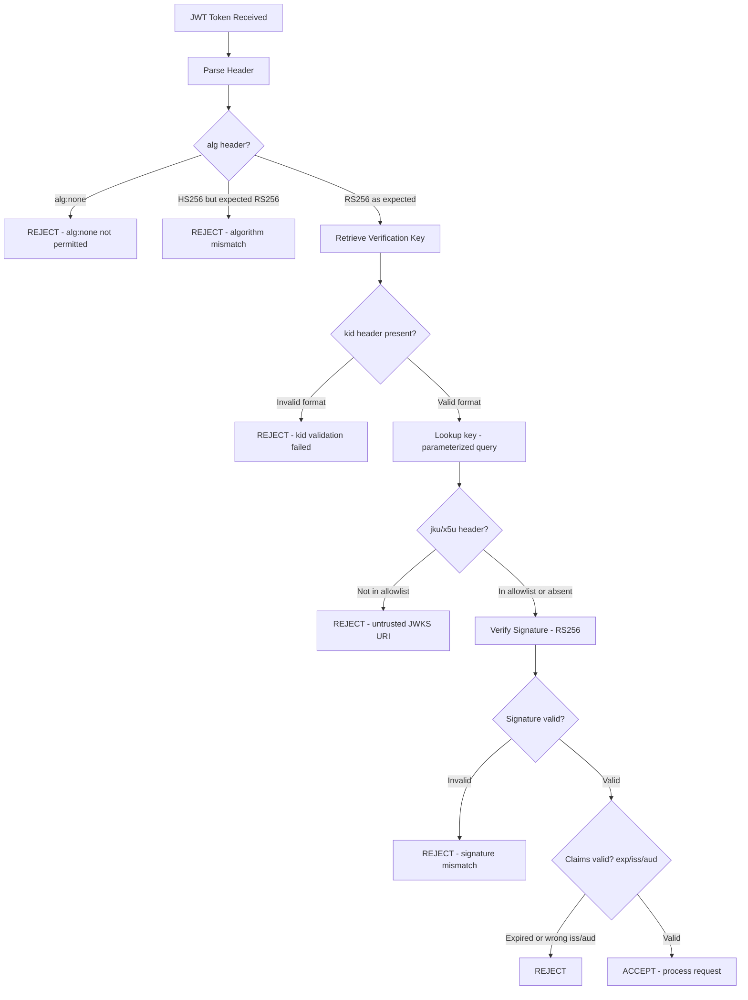

⚡ TL;DR - Advanced JWT attacks exploit vulnerabilities in how libraries
validate JWT signatures and headers, not in the JWT specification itself.
Six major attack classes: (1) alg:none - set algorithm to "none", signature
validation is skipped; (2) Algorithm confusion (RS256→HS256) - attacker
uses the server's PUBLIC key as the HMAC secret; (3) kid parameter injection -
the kid header value is used in a SQL query or file path without sanitization;
(4) JWKS URL injection - attacker supplies their own JWKS URL in jku/x5u header;
(5) Weak secret brute force - HS256 with short/technical-mastery secret cracked offline;
(6) Expired token acceptance - exp claim not validated. All require: explicit
algorithm allowlist, validate alg before accepting, strong HS256 secrets (256-bit+),
short TTL (15-60 min), reject tokens with attacker-controlled jku/x5u headers.

---

| #090 | Category: Security | Difficulty: ★★★★ |
|:---|:---|:---|
| **Depends on:** | OWASP Top 10, Authentication, Session Management, Secrets Management, IAM, TLS Configuration, OAuth 2.0 Security Best Practices, Authentication Mechanism Migration, OAuth 2.0 vs SAML Decision, Heartbleed 2014, Log4Shell 2021 | |
| **Used by:** | Advanced XSS, SSRF to Internal Exploitation, TLS Protocol Attacks, Responsible Disclosure, IR Process, AWS Security Services, DevSecOps Pipeline Design, SSDLC | |
| **Related:** | OWASP Top 10, Authentication, Session Management, IAM, TLS Configuration, OAuth 2.0 Security Best Practices, Auth Migration, OAuth vs SAML, Advanced XSS, SSRF, TLS Protocol Attacks, Responsible Disclosure | |

---

### 🔥 The Problem This Solves

**WHY JWT VALIDATION IS A SECURITY MINEFIELD:**

```
THE "FLEXIBLE STANDARD" PROBLEM:

  JWT (RFC 7519) is a flexible standard by design.
  It supports multiple algorithms. It defines a rich header structure.
  Flexibility is a feature for the standard. Flexibility is a vulnerability
  surface for implementations.
  
  JWT SECURITY IS NOT IN THE SPEC - IT'S IN THE IMPLEMENTATION:
  
  Attack 1: Algorithm confusion
    Spec: "The alg header indicates the algorithm used."
    Vulnerable library: "I'll use whatever algorithm the alg header says."
    Attack: change alg from RS256 to HS256.
    Effect: library tries to verify HS256 signature using RS256 public key
    as the HMAC secret. Attacker knows the public key (it's public!).
    Attacker signs a token with the public key as HMAC secret. Library: valid.
  
  Attack 2: alg:none
    Spec: "alg:none means no signature is required."
    Spec intent: for use in secured transport contexts.
    Vulnerable library: accepts alg:none tokens in authentication contexts.
    Attack: remove signature, set alg:none. Library: valid (no check needed).
  
  Attack 3: kid injection
    Spec: "kid header is a hint for key selection."
    Spec: "kid interpretation is application-defined."
    Vulnerable implementation: uses kid as a SQL parameter or file path.
    Attack: kid=sql_injection_payload or kid=../../etc/passwd
    Effect: SQL injection in token validation, or reads arbitrary file as key.
  
  THE INDUSTRY IMPACT (real vulnerabilities in popular libraries):
    
    CVE-2015-9235: jsonwebtoken (Node.js) - algorithm confusion (RSA/HMAC)
    CVE-2016-5431: python-jose - alg:none accepted in wrong contexts
    CVE-2016-10555: jwt-simple (Node.js) - alg:none bypass
    Auth0 report (2015): algorithm confusion in multiple JWT libraries
    PortSwigger research: kid injection practical demonstrations
    
  The root cause in all cases: libraries trusted user-controlled header values
  without input validation or algorithm allowlisting.
```

---

### 📘 Textbook Definition

**JWT (JSON Web Token, RFC 7519):** A compact, URL-safe token format consisting
of three Base64URL-encoded parts: header (algorithm + type), payload (claims),
and signature. Used for authentication and authorization. The signature is computed
over header+payload using the key and algorithm specified in the header.

**Algorithm confusion attack (CVE-2015-9235 class):** An attack where the
attacker changes the alg header from an asymmetric algorithm (RS256: RSA+SHA256)
to a symmetric algorithm (HS256: HMAC-SHA256). A vulnerable server that uses its
RSA public key as the HS256 verification key will then accept a token signed with
the public key as the HMAC secret - which the attacker can compute since the
public key is public.

**alg:none attack:** A JWT attack where the attacker changes the alg header
to "none" and removes the signature. Vulnerable JWT libraries that accept
alg:none skip signature validation entirely, accepting the unsigned token as valid.

**kid (Key ID) injection:** The kid (Key ID) header parameter specifies
which key to use for verification. If a vulnerable implementation uses the
kid value directly in a SQL query or file path, an attacker can inject
SQL or path traversal payloads to manipulate which key is retrieved.

**JWK Set (JWKS) URL injection:** The jku (JWK Set URL) header parameter
specifies a URL from which the verification keys should be fetched. If a
vulnerable server fetches keys from an attacker-controlled URL (via the jku
header), the attacker can supply their own keys and forge valid tokens.

**JWT brute force:** HS256-signed JWTs where the HMAC secret is short or
low-entropy can be cracked offline by computing signatures for candidate secrets
and comparing against the token's signature. Tool: Hashcat, jwt_tool.

---

### ⏱️ Understand It in 30 Seconds

**One line:**
JWT attacks don't break RSA or HMAC cryptography - they exploit
vulnerable library implementations that trust attacker-controlled header values
(alg, kid, jku) without validation, or use weak HMAC secrets that can be brute forced.

**One analogy:**
> A bank verifies signatures on checks.
> The verification procedure: look at the "signature type" field on the check.
>
> Attack 1 (alg:none):
> Attacker writes "signature type: NONE" on their check.
> Vulnerable bank: "OK, signature type is none, no verification needed." - ACCEPTED.
>
> Attack 2 (algorithm confusion):
> Normal check: verified with customer's PRIVATE key (bank holds matching PUBLIC key).
> Attacker changes "signature type" to "verified with PUBLIC key."
> Attacker signs the check with the PUBLIC key (which they know, because it's public).
> Vulnerable bank: uses the PUBLIC key for verification, check passes. - ACCEPTED.
>
> Attack 3 (JWKS injection):
> Attacker writes "verify my signature using the key at myserver.com/keys."
> Vulnerable bank: fetches key from myserver.com. Attacker's key. Check passes. - ACCEPTED.
>
> All three attacks: the check is fraudulent. The bank's verification is broken
> because it trusted the check itself to define how it should be verified.

---

### 🔩 First Principles Explanation

**Attack class 1: alg:none bypass:**

```
ATTACK: alg:none

  Normal JWT (RS256):
    Header: {"alg": "RS256", "typ": "JWT"}
    Payload: {"sub": "user123", "role": "user", "exp": 1735689600}
    Signature: [RSA signature of header.payload using private key]
    
    Token: base64(header).base64(payload).base64(signature)
  
  Attack:
    Modified header: {"alg": "none", "typ": "JWT"}
    Payload: {"sub": "admin", "role": "admin", "exp": 9999999999}
    Signature: [EMPTY - or just remove the third part]
    
    Token: base64(header).base64(payload).   (trailing dot, empty signature)
    
  Vulnerable library behavior:
    jwt.verify(token, publicKey):
      alg = header.alg  // reads "none" from attacker-controlled header
      if alg == "none":
          return payload  // no signature verification!
      // Attacker receives: valid admin JWT with no signature.
  
  HOW TO PREVENT:
    // CORRECT: explicit algorithm allowlist
    jwt.verify(token, publicKey, { algorithms: ["RS256"] });
    //                               ^^^^^^^^^^^^^^^^^^^^^^^^
    //                    Only RS256 is accepted. alg:none throws error.
    
    // NEVER: accept algorithm from token header without restriction
    // jwt.verify(token, publicKey); // BAD: uses whatever alg header says

ATTACK: algorithm confusion (RS256 → HS256)

  Setup:
    Server uses RS256: signs with RSA private key, verifies with RSA public key.
    RSA public key is publicly known (e.g., from /.well-known/jwks.json).
    
  Attack:
    Attacker knows the RSA public key (public by design):
    public_key_pem = "-----BEGIN PUBLIC KEY-----\nMIIBIjANBgkqhkiG9w0..."
    
    Attacker creates a fake HS256 token:
    header = {"alg": "HS256"}  // changed from RS256
    payload = {"sub": "admin", "role": "admin"}
    
    // HMAC secret = RSA public key bytes (attacker can compute this!):
    signature = HMAC-SHA256(header.payload, RSA_PUBLIC_KEY_BYTES)
    
    token = base64(header).base64(payload).base64(signature)
    
  Vulnerable server:
    jwt.verify(token, rsaPublicKey):
      alg = header.alg  // reads "HS256" from attacker's header
      // Server thinks: "HS256, I need an HMAC key. Use rsaPublicKey."
      if alg == "HS256":
          return verify_hmac(token, rsaPublicKey)
          // Attacker computed HMAC with same key. VALID.
    
  Result: Attacker forges an admin JWT with no private key.
  
  HOW TO PREVENT:
    // CORRECT: reject tokens that specify a different algorithm than expected
    const key = getVerificationKey(keyId);
    const expectedAlg = key.algorithm;  // "RS256" for RSA keys
    
    if (jwtHeader.alg !== expectedAlg) {
        throw new Error("Algorithm mismatch: expected " + expectedAlg);
    }
    
    jwt.verify(token, key, { algorithms: [expectedAlg] });
```

**Attack class 2: kid injection:**

```java
// VULNERABLE: kid parameter used in SQL query directly

// This is the WRONG approach:
public PublicKey getKeyFromDatabase_BAD(String kid) throws Exception {
    // BAD: kid is from JWT header (attacker-controlled!)
    // SQL injection: kid = "none' UNION SELECT 'attackerkey"
    String sql = "SELECT key_data FROM jwt_keys WHERE key_id = '" + kid + "'";
    //                                                             ^^^^^^^^^^^
    //                                                    DIRECT STRING CONCAT!
    //                                              Classic SQL injection vector.
    ResultSet rs = statement.executeQuery(sql);
    return parsePublicKey(rs.getString("key_data"));
    
    // Attack: if attacker can control what key is returned from DB,
    // they can return their own key and sign tokens with it.
    // Or: read other tables via UNION SELECT.
}

// CORRECT: parameterized query + strict kid validation
public PublicKey getKeyFromDatabase_GOOD(String kid) throws Exception {
    // 1. Validate kid format (allowlist: only alphanumeric + hyphens):
    if (!kid.matches("[a-zA-Z0-9\\-]{1,64}")) {
        throw new InvalidTokenException("Invalid key ID format: " + kid);
    }
    
    // 2. Parameterized query (SQL injection prevention):
    PreparedStatement ps = conn.prepareStatement(
        "SELECT key_data FROM jwt_keys WHERE key_id = ?");
    ps.setString(1, kid);  // parameterized: no injection possible
    ResultSet rs = ps.executeQuery();
    
    if (!rs.next()) {
        throw new InvalidTokenException("Unknown key ID: " + kid);
    }
    return parsePublicKey(rs.getString("key_data"));
}

// ALSO VULNERABLE: kid used as file path (path traversal)
public PublicKey getKeyFromFile_BAD(String kid) throws Exception {
    // BAD: kid = "../../etc/passwd" → reads /etc/passwd as key
    File keyFile = new File("/etc/jwt/keys/" + kid + ".pem");
    //                                           ^^^^^^^^^^^
    //                                    kid from attacker = path traversal
    return parsePublicKey(keyFile);
}

// CORRECT: resolve path and verify it's within expected directory
public PublicKey getKeyFromFile_GOOD(String kid) throws Exception {
    // Validate kid is safe for use as filename:
    if (!kid.matches("[a-zA-Z0-9\\-]{1,64}")) {
        throw new InvalidTokenException("Invalid key ID format");
    }
    
    File keysDir = new File("/etc/jwt/keys/").getCanonicalFile();
    File keyFile = new File(keysDir, kid + ".pem").getCanonicalFile();
    
    // Verify the resolved path is within the keys directory:
    if (!keyFile.getPath().startsWith(keysDir.getPath())) {
        throw new InvalidTokenException("Path traversal detected");
    }
    
    return parsePublicKey(keyFile);
}
```

**Attack class 3: JWKS URL injection:**

```java
// VULNERABLE: fetching JWKS from attacker-supplied URL (jku header)

// BAD: trusting jku header from the JWT itself
public PublicKey getKeyFromJku_BAD(String jku, String kid) throws Exception {
    // jku is from the JWT header (ATTACKER CONTROLLED!)
    // Attack: jku = "http://attacker.com/keys.json"
    // Server fetches attacker's keys → attacker can forge valid tokens.
    
    URL url = new URL(jku);  // jku from attacker!
    JWKSet jwkSet = JWKSet.load(url);
    JWK jwk = jwkSet.getKeyByKeyId(kid);
    return jwk.toRSAKey().toPublicKey();
}

// CORRECT: use only pre-configured JWKS URIs, never from token header
@Configuration
public class JwtConfig {
    
    // HARDCODED: only these JWKS URIs are trusted
    private static final Set<String> TRUSTED_JWKS_URIS = Set.of(
        "https://auth.mycompany.com/.well-known/jwks.json",
        "https://accounts.google.com/.well-known/openid-configuration"
    );
    
    public PublicKey getVerificationKey(String kid, String jku) throws Exception {
        // 1. If jku header present: validate against allowlist
        if (jku != null) {
            if (!TRUSTED_JWKS_URIS.contains(jku)) {
                throw new SecurityException(
                    "Untrusted JWKS URI in token: " + jku);
            }
        }
        
        // 2. Fetch from configured (trusted) JWKS URI only:
        String trustedJwksUri = getTrustedJwksUri();
        JWKSet jwkSet = JWKSet.load(new URL(trustedJwksUri));
        JWK jwk = jwkSet.getKeyByKeyId(kid);
        
        if (jwk == null) {
            throw new SecurityException("Unknown key ID: " + kid);
        }
        return jwk.toRSAKey().toPublicKey();
    }
}
```

---

### 🧪 Thought Experiment

**SCENARIO: Security testing a JWT implementation:**

```
PENETRATION TEST: JWT implementation in a Spring Boot API.

  TARGET: POST /api/admin/users (requires admin JWT)
  SETUP: Create a regular user account, obtain a valid JWT.

  TEST 1: alg:none attack
  
    Current JWT (decoded):
      Header: {"alg": "RS256", "typ": "JWT", "kid": "key-2024"}
      Payload: {"sub": "user123", "role": "USER", "exp": 1735689600}
    
    Modified header: {"alg": "none", "typ": "JWT"}
    Modified payload: {"sub": "user123", "role": "ADMIN", "exp": 9999999999}
    Modified signature: [empty]
    
    Send: base64(modified_header).base64(modified_payload).
    
    Result A (VULNERABLE): 200 OK, returns admin data.
    → Report: CRITICAL, alg:none bypass
    
    Result B (CORRECT): 401/400, "Invalid token algorithm"
    → Control working.

  TEST 2: Algorithm confusion (RS256 → HS256)
  
    Fetch public key from /.well-known/jwks.json.
    Create HS256 token using public key as HMAC secret.
    (Use jwt_tool or Burp JWT Editor to automate this.)
    
    Modified header: {"alg": "HS256", "kid": "key-2024"}
    Modified payload: {"sub": "admin", "role": "ADMIN"}
    Signature: HMAC-SHA256(header.payload, rsa_public_key_der)
    
    Result A (VULNERABLE): 200 OK.
    → Report: CRITICAL, algorithm confusion attack
    
    Result B (CORRECT): 400, "Algorithm mismatch"
    → Control working.

  TEST 3: kid injection
  
    Modify kid header to: "' OR '1'='1"
    
    Result A (VULNERABLE): Server executes SQL, returns some key, validates.
    Or: SQL error returned (500 error with stack trace) → confirms injection.
    
    Result B (CORRECT): 400, "Invalid key ID format" (validation rejects non-alphanumeric)
    → Control working.

  TEST 4: JWKS URL injection (jku header)
  
    Modify token header to add: "jku": "https://attacker.com/jwks.json"
    Create a token signed with attacker's key.
    Set kid in token to match attacker's key ID.
    
    Result A (VULNERABLE): Server fetches keys from attacker.com, validates.
    → Report: CRITICAL, JWKS URL injection
    
    Result B (CORRECT): 400, "Untrusted JWKS URI"
    → Control working.

  TEST 5: HS256 brute force
  
    If server uses HS256 instead of RS256:
    Extract JWT, attempt offline brute force:
    
    # Using hashcat:
    hashcat -a 0 -m 16500 jwt_token.txt wordlist.txt
    # -m 16500: JWT HMAC-SHA256 mode
    
    If secret = "secret" or "password" or application name → CRACKED.
    
    Result A (WEAK SECRET): hashcat finds match in <1 hour.
    → Report: HIGH, weak JWT secret
    
    Result B (STRONG SECRET): exhausted wordlist without match.
    → Use HS256 with 256-bit random secret generated at startup.
    → Or: switch to RS256 (asymmetric, no brute force risk for private key).
```

---

### 🧠 Mental Model / Analogy

> JWT attacks = lock picking the LABEL, not the lock.
>
> A safe has a combination lock. The lock is strong.
> The label on the safe says: "COMBINATION TYPE: 3-digit numeric."
> The actual combination: a 256-bit random key.
>
> Attack 1 (alg:none): Change label to "COMBINATION TYPE: NONE."
> Vulnerable guard reads label: "no combination required." Opens safe.
>
> Attack 2 (algorithm confusion): Change label from "RSA LOCK" to "COMBINATION LOCK."
> Normal: guard verifies with RSA private key (secret, held by manufacturer).
> After change: guard uses the same key for combination lock verification.
> Attacker knows the manufacturer's PUBLIC key (public by design).
> Uses public key as the combination. Guard computes hash with public key.
> Matches attacker's hash. Opens safe.
>
> Attack 3 (kid injection): Label says "COMBINATION IS IN DRAWER #kid."
> kid = "'; DROP TABLE combinations; --"
> Guard looks up kid in the combination database. SQL injection.
>
> The lock (RSA/HMAC cryptography) is not broken.
> The guard (JWT validation logic) is broken.
> The guard blindly trusts the label (header) that anyone can write.
>
> Correct guard behavior:
> "I only accept COMBINATION TYPE: RSA-256. Nothing else."
> "I only look up combination IDs that match [a-z0-9-]{1,64}."
> "I only fetch combination keys from THIS trusted server, not from the label."

---

### 📶 Gradual Depth - Five Levels

**Level 1 - What it is (anyone can understand):**
JWT attacks trick the server's token validation code into accepting fake tokens. The most common methods: (1) tell the server "this token needs no signature" (alg:none), (2) confuse the server about what type of signature to check (algorithm confusion), (3) inject malicious SQL into the key ID field (kid injection), or (4) tell the server to fetch the verification keys from the attacker's own server (JWKS injection).

**Level 2 - How to use it (junior developer):**
Always specify an algorithm allowlist when validating JWTs (only accept the specific algorithm you expect). Never accept alg:none in production. Never use alg header value to determine how to validate - use the known algorithm for the expected key type. Validate kid header with alphanumeric-only regex before using in any query. Never fetch JWKS from a URL specified in the token header - use a hardcoded, trusted JWKS URI.

**Level 3 - How it works (mid-level engineer):**
JWT algorithm confusion: server has RSA public key, expects RS256. Attacker changes alg to HS256. Server code: `verify(token, rsaPublicKey, algorithms: any)` - treats rsaPublicKey bytes as HMAC secret. Attacker knows the public key (it's public), computes valid HS256 signature. Library accepts it. Prevention: `algorithms: ["RS256"]` - explicit allowlist. kid injection: if kid goes into `WHERE key_id = '${kid}'` (unparameterized), attacker injects SQL. Prevention: `kid.matches("[a-zA-Z0-9-]{1,64}")` + parameterized query. jku injection: `JWKSet.load(new URL(token.header.jku))` - fetches from attacker server. Prevention: only use pre-configured JWKS URIs, never from token header.

**Level 4 - Why it was designed this way (senior/staff):**
The JWT spec (RFC 7519) deliberately supports multiple algorithms and flexible key identification to enable a wide range of use cases. The spec's flexibility creates implementation burden: every implementation must correctly handle the cases where the header specifies invalid/unexpected algorithms, untrusted key sources, or malformed key IDs. The JOSE (JSON Object Signing and Encryption) standards (RFC 7515-7520) provide a rich but complex set of header parameters (alg, kid, jku, x5u, x5c, crit) - each one is a potential attack surface if not validated. The security principle: "Be conservative in what you accept" (Postel's law applied to security). A JWT validator should accept exactly the tokens it was designed for (specific algorithm, specific key, specific issuer/audience) and reject everything else. The more flexible the acceptance policy, the larger the attack surface.

**Level 5 - Mastery (distinguished engineer):**
Advanced JWT attack surface: the `crit` header parameter (RFC 7515 Section 4.1.11) - lists header parameters that the implementation MUST understand and process. If a critical extension is in `crit` but not implemented: the token MUST be rejected. A vulnerable implementation that ignores `crit` and processes only known parameters may accept tokens that claim to use security-enhancing but unimplemented extensions. JWT compression: JWE (encrypted JWT) supports payload compression. Zip-then-encrypt enables CRIME/BEAST-style compression oracle attacks: if an attacker can partially control plaintext and observe ciphertext size, they can extract secrets via oracle (analogous to HTTP compression oracles). JWT revocation gap: stateless JWTs cannot be revoked before expiry. Solutions: (1) short TTL (15-60 min), (2) jti (JWT ID) claim + revocation list (database lookup on each request), (3) token binding (RFC 8471). The tradeoff: statefulness for revocability. Side-channel in JWT validation: constant-time comparison for HMAC signatures (timing attack prevention). Using `MessageDigest.isEqual()` vs `Arrays.equals()` - the former is constant-time, the latter may short-circuit (timing difference reveals how many bytes match).

---

### ⚙️ How It Works (Mechanism)

```
JWT ATTACK SURFACE OVERVIEW:

  JWT Header Fields (attacker-controlled):
  
    alg         Algorithm field:
                - alg:none → skip signature verification
                - alg confusion (RS256→HS256) → sign with public key
                DEFENSE: explicit algorithm allowlist
    
    kid         Key ID field:
                - SQL injection → manipulate key lookup
                - Path traversal → arbitrary file as key
                DEFENSE: alphanumeric-only validation
    
    jku         JWK Set URL:
                - JWKS URL injection → attacker supplies verification keys
                DEFENSE: reject jku header / allowlist only
    
    x5u/x5c     X.509 certificate URL/chain:
                - Similar to jku: attacker supplies cert
                DEFENSE: reject x5u header / allowlist only
  
  JWT Payload (signature-protected when correctly validated):
    exp         Expiration claim:
                - Not validating exp → expired tokens accepted forever
                DEFENSE: always validate exp
    
    iss/aud     Issuer/Audience:
                - Not validating → tokens from other systems accepted
                DEFENSE: always validate iss and aud

  HS256 HMAC Secret:
    - Short/low-entropy secret → brute force offline
    DEFENSE: 256-bit cryptographically random secret
```



---

### 💻 Code Example

**Secure JWT validation (Java Spring Boot - all defenses applied):**

```java
// SecureJwtValidator.java
// Implements all defenses against JWT attacks discussed above.

@Component
public class SecureJwtValidator {
    
    // DEFENSE 1: explicit algorithm allowlist
    private static final List<String> ALLOWED_ALGORITHMS = List.of("RS256");
    
    // DEFENSE 2: hardcoded JWKS URI (never from token header)
    private static final String TRUSTED_JWKS_URI =
        "https://auth.mycompany.com/.well-known/jwks.json";
    
    // DEFENSE 3: expected issuer and audience (validated claims)
    private static final String EXPECTED_ISSUER = "https://auth.mycompany.com";
    private static final String EXPECTED_AUDIENCE = "api.mycompany.com";
    
    private JWKSet jwkSet;
    
    public Claims validateToken(String token) {
        // STEP 1: Parse header WITHOUT verifying (just for key selection)
        DecodedJWT unverified = JWT.decode(token);
        
        // DEFENSE: check alg header against allowlist FIRST:
        String alg = unverified.getAlgorithm();
        if (!ALLOWED_ALGORITHMS.contains(alg)) {
            throw new JwtValidationException(
                "Algorithm not permitted: " + alg +
                ". Expected one of: " + ALLOWED_ALGORITHMS);
        }
        
        // DEFENSE: validate kid format before using (prevent injection):
        String kid = unverified.getKeyId();
        if (kid != null && !kid.matches("[a-zA-Z0-9\\-]{1,64}")) {
            throw new JwtValidationException(
                "Invalid key ID format: " + kid);
        }
        
        // DEFENSE: NEVER use jku/x5u from token header.
        // Always use pre-configured TRUSTED_JWKS_URI.
        
        // STEP 2: Fetch public key from TRUSTED source only:
        RSAPublicKey publicKey = getPublicKey(kid);
        
        // STEP 3: Verify signature with EXPLICIT algorithm:
        Algorithm algorithm = Algorithm.RSA256(publicKey, null);
        JWTVerifier verifier = JWT.require(algorithm)
            .withIssuer(EXPECTED_ISSUER)       // DEFENSE: validate iss
            .withAudience(EXPECTED_AUDIENCE)   // DEFENSE: validate aud
            .build();
        
        // Verification: throws JWTVerificationException if:
        // - Signature invalid
        // - Algorithm mismatch (library enforces RS256)
        // - Expired (exp claim validated automatically)
        // - Wrong issuer or audience
        DecodedJWT verified = verifier.verify(token);
        
        return extractClaims(verified);
    }
    
    private RSAPublicKey getPublicKey(String kid) {
        // NEVER: RSAPublicKey getPublicKey(String jku, String kid)
        // Using jku from token = JWKS injection vulnerability.
        
        try {
            if (jwkSet == null) {
                // HARDCODED trusted URI - never from token:
                jwkSet = JWKSet.load(new URL(TRUSTED_JWKS_URI));
            }
            
            JWK jwk = jwkSet.getKeyByKeyId(kid);
            if (jwk == null) {
                throw new JwtValidationException(
                    "Unknown key ID: " + kid);
            }
            return jwk.toRSAKey().toPublicKey();
        } catch (Exception e) {
            throw new JwtValidationException(
                "Failed to retrieve public key", e);
        }
    }
}
```

---

### ⚖️ Comparison Table

| Attack | CVSSv3 | What Attacker Gets | Root Cause | Defense |
|:---|:---|:---|:---|:---|
| **alg:none** | 9.8 | Full token forgery | No algorithm allowlist | `algorithms: ["RS256"]` |
| **Algorithm confusion** | 9.8 | Full token forgery | Algorithm derived from header | Allowlist + key type check |
| **kid SQL injection** | 9.8 | Token forgery + SQL injection | Unparameterized kid query | Alphanumeric validation + prepared stmt |
| **JWKS URL injection** | 9.8 | Full token forgery | Trust jku from header | Hardcoded JWKS URI only |
| **Brute force HS256** | 7.5 | Full token forgery | Weak secret | 256-bit random secret |
| **Expired token** | 5.0 | Reuse stale session | No exp validation | Always validate exp |

---

### ⚠️ Common Misconceptions

| Misconception | Reality |
|:---|:---|
| "JWT is signed so it can't be tampered with." | JWT is tamper-proof only when the signature is correctly validated. The signature is computed over the header+payload. If an attacker can change the header to use a different algorithm (alg:none, algorithm confusion), the original signature is irrelevant - the server validates using the new algorithm against the attacker's new signature. Tamper-resistance is a property of correct JWT validation, not of JWT tokens themselves. The specification is correct; vulnerable implementations break the guarantees. The signing key and algorithm must be determined server-side from trusted configuration, never from the token header. |
| "RS256 is safe because the private key is not exposed." | RS256 (RSA+SHA256) is correctly used and safe against signature forgery when: (1) the server explicitly requires RS256 (algorithm allowlist), (2) the server does not accept alg:none or HS256 in place of RS256. However: even with RS256, a server that uses the RSA public key as the HS256 HMAC secret (algorithm confusion) is vulnerable. The private key is not needed by the attacker - only the public key, which is designed to be public. The defense is not in the key confidentiality (public key is public by design) but in refusing to accept HS256 when RS256 is expected. RS256 is correctly safe when the validator explicitly specifies `algorithms: ["RS256"]` and rejects anything else. |

---

### 🚨 Failure Modes & Diagnosis

**JWT security testing checklist:**

```
TESTING JWT SECURITY:

  TOOL: jwt_tool (Python), Burp Suite JWT Editor extension
  
  Test 1: alg:none
    jwt_tool <token> -T  # Tamper mode
    # Set alg to none, remove signature
    # Expected: 401 "Invalid algorithm"
    # Vulnerable: 200 (authenticated as original user)
  
  Test 2: Algorithm confusion (RS256 → HS256)
    # Requires: RSA public key from server JWKS endpoint
    jwt_tool <token> -X a  # Algorithm confusion attack
    # Fetches public key, signs HS256 token using it
    # Expected: 401 "Algorithm mismatch"
    # Vulnerable: 200
  
  Test 3: kid SQL injection
    # Modify kid to: ' OR '1'='1
    # Or: 1' UNION SELECT 'attackerkey' --
    # Expected: 400 "Invalid key ID format"
    # Vulnerable: 500 SQL error, or 200 if injection succeeds
  
  Test 4: JWKS URL injection
    # Add jku header pointing to your own server with a fake key
    # Sign token with your private key, set kid to match jku JWKS
    # Expected: 400 "Untrusted JWKS URI"
    # Vulnerable: 200 (server fetched your key and trusted it)
  
  Test 5: Secret brute force (only if HS256)
    hashcat -a 0 -m 16500 <token> /path/to/wordlist.txt
    # If secret cracked in < 24 hours: WEAK SECRET
    # Expected: no crack (256-bit random secret)
  
  Test 6: Expired token acceptance
    # Use a token that expired 24 hours ago
    # Expected: 401 "Token expired"
    # Vulnerable: 200 (exp claim not validated)
  
  RESULT ANALYSIS:
    If any test returns 200: CRITICAL finding.
    JWT authentication provides no security if any of these bypass.
    Full authentication bypass possible.
```

---

### 🔗 Related Keywords

**Prerequisites:**
- `OAuth 2.0 Security Best Practices` (SEC-074) - JWT in OAuth context
- `Authentication Mechanism Migration` (SEC-080) - JWT migration security
- `OAuth 2.0 vs SAML Decision Framework` (SEC-082) - when to use JWT

**Builds on this:**
- `Advanced XSS` (SEC-091) - stealing JWT tokens via XSS
- `SSRF to Internal Exploitation` (SEC-093) - JWKS URL injection enabling SSRF
- `TLS Protocol Attacks` (SEC-095) - token interception via TLS weaknesses

---

### 📌 Quick Reference Card

```
┌──────────────────────────────────────────────────────────┐
│ ALG:NONE     │ Set algorithms: ["RS256"]. Never none.    │
│ ALGO CONF    │ Explicit algorithm allowlist. Never trust  │
│              │ alg header to choose validation algorithm  │
├──────────────┼───────────────────────────────────────────┤
│ KID INJECT   │ Validate: kid.matches("[a-zA-Z0-9-]{1,64}")│
│              │ Use parameterized queries for kid lookup   │
├──────────────┼───────────────────────────────────────────┤
│ JWKS INJECT  │ NEVER use jku/x5u from token header.      │
│              │ Hardcode trusted JWKS URI in config.       │
├──────────────┼───────────────────────────────────────────┤
│ BRUTE FORCE  │ HS256: use 256-bit random secret.         │
│              │ Better: RS256 (private key not guessable)  │
├──────────────┼───────────────────────────────────────────┤
│ EXPIRY       │ Always validate exp. Short TTL: 15-60 min.│
├──────────────┼───────────────────────────────────────────┤
│ VALIDATE     │ iss (issuer) + aud (audience) + exp + alg │
└──────────────────────────────────────────────────────────┘
```

---

### 💎 Transferable Wisdom

**Reusable Engineering Principle:**
"Never use attacker-supplied data to determine how to validate attacker-supplied data."
JWT's alg header: the attacker supplied this. It specifies how to validate the signature.
If the server uses the attacker's alg value to choose the validation method:
the attacker controls the validation method. Security collapses.
The principle: validation parameters must come from the validator's trusted configuration,
not from the input being validated.
This principle applies broadly:
- SQL: the query structure must come from the application, not from user input.
  (Parameterized queries enforce this: user input → data values, not query structure)
- XML: schema must come from trusted source, not from the XML document.
  (XXE attacks exploit XML documents that define their own external entities)
- YAML/JSON: deserializer type information must come from application context,
  not from the serialized data. (Deserialization RCE exploits type information in data)
- HTML templating: template logic must be in the template (trusted), 
  not in user input. (Server-side template injection: input goes into template → code execution)
- Cryptography: the algorithm to use for verification must be in the
  application configuration, not in the token being verified.
In all these cases: the security boundary is between "data" (user-supplied)
and "code/structure/parameters" (application-defined).
When user-supplied data is allowed to specify structure/parameters/algorithms:
the attacker is writing part of the program's logic. This is the common thread
running through injection attacks of all types.

---

### 💡 The Surprising Truth

Auth0's 2015 blog post "Critical vulnerabilities in JSON Web Token libraries"
documented algorithm confusion attacks affecting virtually every major
JWT library at the time.

The vulnerable pattern was identical across libraries in different languages:
  Node.js (jsonwebtoken), Python (PyJWT), PHP (JWT-PHP), Ruby (ruby-jwt).
All had the same flaw: `verify(token, key)` used the alg header
to determine the algorithm. Attacker changes alg from RS256 to HS256.
Library uses the same RSA public key as HMAC secret. Attack succeeds.

The root cause was architectural: the JWT standard says "alg header identifies
the algorithm." Library authors implemented this as "use alg header to determine
verification algorithm." This is literally what the spec says - but it creates
a catastrophic security vulnerability in practice.

The spec was correct but incomplete. The spec does not say:
"implementations MUST validate that the alg header matches the expected algorithm."
That requirement was implicit (obvious to cryptographers, not obvious to
library implementers building a general-purpose library).

The fix was to add an explicit `algorithms` parameter to every JWT verification
call: `verify(token, key, { algorithms: ["RS256"] })`.
This parameter became a required argument (not optional) in secure API designs.

The meta-lesson: cryptography specifications describe what the algorithms ARE.
They do not always describe all the ways implementations can break them.
Reading a crypto spec and implementing it correctly requires security expertise
beyond the spec text. A general-purpose JWT library is a security-critical
component that requires adversarial review, not just spec compliance review.
"The library does what the spec says" is not the same as "the library is secure."

---

### ✅ Mastery Checklist

**You've mastered this when you can:**
1. **EXPLAIN** algorithm confusion: changing alg from RS256 to HS256 causes
   a vulnerable server to use its RSA public key as the HMAC secret -
   which the attacker knows since public keys are public.
2. **DEMONSTRATE** the alg:none defense: `algorithms: ["RS256"]` allowlist
   prevents both alg:none and algorithm confusion in a single control.
3. **IDENTIFY** kid injection risk: any JWT library code that uses kid
   in a string-formatted query or file path is vulnerable; fix: regex validation
   + parameterized queries.
4. **ARTICULATE** the JWKS URL injection rule: never fetch JWKS from a URL
   specified in the token header (jku/x5u); hardcode trusted JWKS URI.

---

### 🎯 Interview Deep-Dive

**Q: What are common JWT attacks and how do you defend against them?
Explain algorithm confusion specifically.**

*Why they ask:* Tests JWT security depth. Common in security engineering,
backend, and senior developer roles. JWT is ubiquitous - secure implementation matters.

*Strong answer covers:*
- alg:none: change alg header to "none", remove signature. Vulnerable library skips verification.
  Defense: explicit `algorithms: ["RS256"]` parameter - never trust alg from header.
- Algorithm confusion (RS256→HS256): change alg to HS256, sign with RSA public key as HMAC secret.
  Server uses RSA public key as HS256 verification key. Public key = known to attacker.
  Defense: algorithm allowlist - only accept HS256 if server is configured for HS256,
  only accept RS256 if server has RSA keys. Match algorithm to expected key type.
- kid injection: kid header used in SQL query without parameterization → SQL injection.
  Or used as file path → path traversal.
  Defense: validate kid with regex `[a-zA-Z0-9-]{1,64}` + parameterized queries.
- JWKS URL injection: jku header points to attacker's key server.
  Defense: ignore jku from token; use hardcoded, trusted JWKS URI from config.
- Brute force: HS256 with weak secret cracked offline by Hashcat.
  Defense: 256-bit random secret; or use RS256 (private key is never guessable).
- Expired token: exp claim not validated → stale tokens accepted.
  Defense: always validate exp. Short TTL (15-60 min).
- Universal rule: "Never use attacker-supplied data to determine how to validate
  attacker-supplied data." Algorithm, key source, validation parameters must come
  from trusted server configuration, not from the token header.