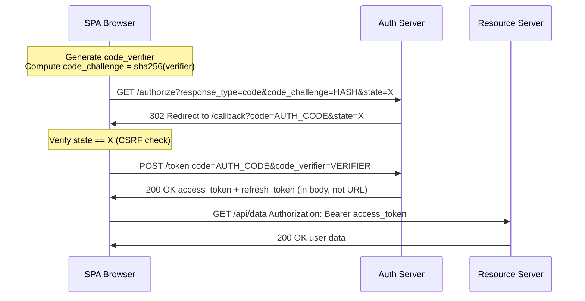

⚡ TL;DR - The OAuth 2.0 Implicit Flow (response_type=token) was deprecated in
OAuth 2.0 Security Best Current Practice (RFC 9700, 2025) and is no longer
recommended. The fundamental problem: the access token is returned in the URL
fragment (https://app.com/callback#access_token=...) which leaks into browser
history, server logs (via Referer header), and third-party scripts on the page.
The replacement: Authorization Code Flow + PKCE (Proof Key for Code Exchange,
RFC 7636). PKCE is now the recommended flow for ALL clients including SPAs
and mobile apps, not just confidential server-side clients. Key difference:
PKCE replaces the client secret with a cryptographic challenge (code_verifier +
code_challenge) that is generated per-authorization-request. The authorization
code in the URL is useless without the code_verifier known only to the client.
Token is exchanged server-to-server (no fragment exposure).

---

| #094 | Category: Security | Difficulty: ★★★ |
|:---|:---|:---|
| **Depends on:** | OWASP Top 10, Authentication, Session Management, Secrets Management, IAM, TLS Configuration, OAuth 2.0 Security, Auth Migration, OAuth vs SAML, Advanced JWT, Advanced XSS, CORS Misconfiguration | |
| **Used by:** | TLS Protocol Attacks, Responsible Disclosure, AWS Security Services, DevSecOps Pipeline Design, SSDLC, OAuth OIDC Specification Design | |
| **Related:** | OWASP Top 10, Authentication, Session Management, IAM, TLS Configuration, OAuth 2.0 Security, Auth Migration, OAuth vs SAML, Advanced JWT, Advanced XSS, TLS Protocol Attacks, OAuth OIDC Specification Design | |

---

### 🔥 The Problem This Solves

**WHY THE IMPLICIT FLOW WAS DESIGNED AND WHY IT BECAME DANGEROUS:**

```
THE ORIGINAL PROBLEM (2007-2012):

  GOAL: Allow JavaScript SPAs to use OAuth.
  
  Server-side apps (Authorization Code Flow):
    Browser → Authorization server → code → client server backend → token exchange.
    The client server backend: can make server-to-server requests.
    Token exchange: happens backend-to-backend, never exposed to browser.
    
  SPA apps in 2010:
    No server backend.
    All JavaScript, all in the browser.
    Problem: how does the JavaScript app get a token from the authorization server?
    
  The Implicit Flow solution (2012, RFC 6749 Section 4.2):
    Step 1: Browser redirects to authorization server.
    Step 2: Authorization server redirects back to the app WITH the access token.
    
    Redirect URL: https://app.com/callback#access_token=TOKEN&token_type=bearer
    //                                     ^^^^^^^^^^^^^^^^^^^^^^^^^^^^^^^^^^^
    //                                     Fragment: visible to JavaScript
    //                                     NOT sent to server (HTTP spec)
    
    The fragment (#) was chosen deliberately: the fragment is not sent to the server.
    So the token is only in the browser, not in server logs.
    
  THE PROBLEMS (discovered 2017-2020):
  
  Problem 1: Token in browser history
    The URL including fragment is stored in browser history.
    If user navigates to another site and back: browser history visible.
    Shared computers: browser history exposes tokens.
    
  Problem 2: Token in Referer header
    JavaScript on the page may load third-party resources (analytics, CDN, ads).
    Browser sends Referer header with the FULL URL including fragment... in some cases.
    Some implementations exposed the token via Referer.
    
  Problem 3: Token accessible to XSS
    Token is in the URL fragment → JavaScript can read location.hash.
    If XSS exists on the page: attacker reads location.hash → steals token.
    Access Code Flow: even if XSS exists, the code in the URL is one-time use
    AND requires a code_verifier to exchange → much harder to exploit.
    
  Problem 4: Token not rotatable
    Access tokens from implicit flow are used directly.
    No refresh token (implicit flow spec disallows refresh tokens for security).
    Short-lived tokens mean frequent re-authentication.
    
  Problem 5: JavaScript origin vs browser redirect
    SPA "server-to-server" doesn't exist: the token exchange is client-side.
    This is inherently less secure than backend-to-backend exchange.

THE DEPRECATION:
  RFC 9700 (OAuth 2.0 Security Best Current Practice, 2025):
  Section 2.1.2: "The Implicit grant MUST NOT be used."
  
  All OAuth implementations should use:
  Authorization Code + PKCE (for SPAs, mobile, and server-side clients).
```

---

### 📘 Textbook Definition

**Implicit Flow (OAuth 2.0, RFC 6749 Section 4.2):** An OAuth 2.0 authorization
flow where the access token is returned directly in the URL fragment after
user authorization, without an intermediate authorization code exchange.
Designed for public clients (SPAs, mobile apps) that cannot securely store a
client secret. Deprecated by RFC 9700 (2025).

**Authorization Code Flow (OAuth 2.0, RFC 6749 Section 4.1):** An OAuth 2.0
flow where the authorization server issues an authorization code, which the client
exchanges for an access token via a direct backend-to-authorization-server request.
The token never appears in the browser URL. Requires a client secret (confidential
clients) or PKCE (public clients).

**PKCE (Proof Key for Code Exchange, RFC 7636):** An extension to the Authorization
Code Flow for public clients. The client generates a cryptographic secret
(`code_verifier`), hashes it (`code_challenge = SHA256(code_verifier)`),
and sends the hash with the authorization request. When exchanging the code
for a token, the client sends the original `code_verifier`. The authorization
server verifies that SHA256(code_verifier) matches the stored code_challenge.
This prevents authorization code interception attacks: a stolen code is useless
without the code_verifier.

**code_verifier:** A cryptographically random 43-128 character string generated
per-authorization-request. Never sent in the URL. Sent only in the token exchange
(POST body, server-to-server).

**code_challenge:** SHA256(code_verifier), Base64URL-encoded. Sent with the
authorization request. The authorization server stores this and verifies it
when the code is exchanged.

**Access token leakage:** When an access token appears in a URL (fragment,
query parameter), it may be logged by proxies, stored in browser history,
sent in Referer headers, or read by XSS. URL exposure of tokens is a token
leakage vector.

---

### ⏱️ Understand It in 30 Seconds

**One line:**
The Implicit Flow returned OAuth tokens directly in the URL (where they leak
into browser history, logs, and XSS), so it was replaced by Authorization Code
+ PKCE which keeps tokens server-side and uses a one-time cryptographic challenge
to prevent code theft.

**One analogy:**
> IMPLICIT FLOW: Bank gives you your account number AND PIN on a billboard
> outside the bank. You can read it from the street. So can everyone else.
>
> AUTHORIZATION CODE FLOW: Bank gives you a ONE-TIME voucher number on the billboard.
> To get your PIN, you must go INSIDE the bank with the voucher AND a password you
> memorized before you came. The billboard number is useless without your private password.
>
> PKCE makes it even better:
> You invented the private password JUST FOR THIS VISIT (code_verifier).
> You wrote a fingerprint of the password on the voucher request (code_challenge).
> Even if someone steals your billboard voucher: they can't get in without
> your private password, which you've never written down anywhere publicly.
>
> The key insight: the authorization code in the URL is a VOUCHER, not the SECRET.
> The secret (code_verifier) was generated locally and never leaves your app.
> A stolen voucher is useless without the secret.
> A stolen token IS the secret. That's why implicit flow is dangerous.

---

### 🔩 First Principles Explanation

**Authorization Code + PKCE flow in detail:**

```
PKCE AUTHORIZATION FLOW:

  Step 1: Client generates PKCE parameters (client-side, per-request)
  
    // JavaScript SPA:
    const codeVerifier = generateRandom(43-128 chars, alphanumeric + -._~);
    // Example: "dBjftJeZ4CVP-mB92K27uhbUJU1p1r_wW1gFWFOEjXk"
    
    const codeChallenge = base64url(sha256(codeVerifier));
    // SHA256 of verifier, Base64URL-encoded
    // Example: "E9Melhoa2OwvFrEMTJguCHaoeK1t8URWbuGJSstw-cM"
    
    // Store code_verifier in sessionStorage (only this tab/session)
    sessionStorage.setItem('pkce_verifier', codeVerifier);
  
  Step 2: Authorization request (browser redirect)
  
    GET https://auth.provider.com/oauth/authorize
      ?response_type=code
      &client_id=MY_APP_ID
      &redirect_uri=https://app.com/callback
      &scope=openid profile email
      &state=RANDOM_STATE_VALUE         (CSRF protection)
      &code_challenge=E9Melhoa2Ow...   (SHA256 of verifier)
      &code_challenge_method=S256
    
    URL contains: code_challenge (hash of verifier) - SAFE to expose.
    URL does NOT contain: code_verifier - private to the client.
  
  Step 3: User authorizes, authorization server redirects back
  
    https://app.com/callback
      ?code=AUTHORIZATION_CODE          (one-time code)
      &state=RANDOM_STATE_VALUE         (verify CSRF state)
    
    URL contains: code (ONE-TIME USE, useless without verifier).
    URL does NOT contain: access_token (unlike implicit flow!).
    
    STOLEN CODE ATTACK: attacker intercepts code.
    Can they use it? No: they must also provide code_verifier in the token exchange.
    They don't know code_verifier (it's in the SPA's sessionStorage).
  
  Step 4: Token exchange (code → token)
  
    POST https://auth.provider.com/oauth/token
    Content-Type: application/x-www-form-urlencoded
    
    grant_type=authorization_code
    &code=AUTHORIZATION_CODE
    &redirect_uri=https://app.com/callback
    &client_id=MY_APP_ID
    &code_verifier=dBjftJeZ4CVP-mB92K27...   ← private verifier sent here
    
    Authorization server:
    1. Validates that SHA256(code_verifier) == stored code_challenge. OK.
    2. Validates that code is valid and not already used. OK.
    3. Returns: {"access_token": "...", "refresh_token": "...", "id_token": "..."}
    
    Token is returned in response BODY (not URL). Not logged. Not in history.
    JavaScript stores access_token in memory (not localStorage - XSS risk).
  
  COMPARISON: Implicit Flow (DEPRECATED)
  
    Step 2 response to SPA:
    https://app.com/callback#access_token=TOKEN&token_type=bearer
    //                       ^^^^^^^^^^^^^^^^^^^^^^^^^^^^^^^^^^^^^^^^
    //                       TOKEN IS IN THE URL FRAGMENT!
    //                       In browser history: YES.
    //                       XSS reads location.hash: TOKEN STOLEN.
    //                       No code_verifier protection: no second factor.
    //                       One URL = permanent credential (until expiry).
```

---

### 🧪 Thought Experiment

**SCENARIO: Migrating an SPA from Implicit Flow to PKCE:**

```
CURRENT STATE: React SPA using Implicit Flow with Auth0

  Current authorization URL:
  /authorize?response_type=token&client_id=...&redirect_uri=...
  
  Current callback handler:
  // Reads token from URL fragment:
  const hash = window.location.hash;
  const params = new URLSearchParams(hash.substring(1));
  const accessToken = params.get('access_token');
  // Store token: localStorage.setItem('token', accessToken);
  
  PROBLEMS:
  - localStorage: accessible to XSS (any script on page reads all localStorage)
  - Token in URL: browser history, Referer header leakage
  - No refresh token (implicit flow disallows it)
  - Requires full re-auth when token expires (bad UX)

MIGRATION PLAN (Implicit → PKCE):

  Step 1: Switch authorization server config (if Auth0, Okta, etc.):
    - Enable PKCE for the SPA application
    - Disable Implicit Flow for the SPA application
    - Enable refresh tokens (now safe with PKCE + rotating refresh tokens)
  
  Step 2: Update frontend authorization request:
  
    BEFORE (implicit):
    const authUrl = `${domain}/authorize?response_type=token&...`
    
    AFTER (PKCE):
    // Generate PKCE pair:
    const codeVerifier = generateCodeVerifier();  // 64 random chars
    const codeChallenge = await sha256base64url(codeVerifier);
    
    // Store verifier (session only):
    sessionStorage.setItem('pkce_verifier', codeVerifier);
    
    const authUrl = `${domain}/authorize?response_type=code`
      + `&code_challenge=${codeChallenge}`
      + `&code_challenge_method=S256`
      + `&state=${generateState()}`  // CSRF protection
      + `&...`;
    window.location.href = authUrl;
  
  Step 3: Update callback handler:
  
    BEFORE (implicit):
    const token = new URLSearchParams(location.hash.slice(1)).get('access_token');
    localStorage.setItem('token', token);  // BAD: localStorage + implicit flow
    
    AFTER (PKCE):
    const code = new URLSearchParams(location.search).get('code');
    const state = new URLSearchParams(location.search).get('state');
    
    // CSRF check:
    if (state !== sessionStorage.getItem('pkce_state')) {
        throw new Error('State mismatch - possible CSRF');
    }
    
    const verifier = sessionStorage.getItem('pkce_verifier');
    sessionStorage.removeItem('pkce_verifier');  // Use only once
    
    // Exchange code for token (via fetch - no redirect):
    const response = await fetch(`${domain}/oauth/token`, {
        method: 'POST',
        headers: {'Content-Type': 'application/x-www-form-urlencoded'},
        body: new URLSearchParams({
            grant_type: 'authorization_code',
            code,
            redirect_uri: REDIRECT_URI,
            client_id: CLIENT_ID,
            code_verifier: verifier  // Proves we started this flow
        })
    });
    const { access_token, refresh_token } = await response.json();
    
    // Store in memory (not localStorage):
    // Use a closure or React context, not browser storage.
    setToken(access_token);
    // Refresh token: httpOnly cookie (set by auth server) is safer.
  
  Step 4: Token storage (most debated question):
  
    OPTION A: In-memory (JavaScript variable)
    Pros: not accessible to XSS (if script is isolated)
    Cons: lost on page refresh; cannot persist across tabs
    
    OPTION B: httpOnly cookie (set by auth server)
    Pros: inaccessible to JavaScript (XSS can't read it)
    Cons: CSRF risk (mitigate with SameSite=Strict)
    
    OPTION C: localStorage (AVOID for access tokens)
    Cons: readable by any JavaScript on the page (XSS risk)
    
    RECOMMENDED: access token in memory + refresh token in httpOnly cookie.
    On page refresh: use refresh token (httpOnly) to get new access token.
```

---

### 🧠 Mental Model / Analogy

> PKCE is like two-factor authentication for the OAuth code exchange.
>
> Normally: one piece of information (authorization code) → get token.
> PKCE: two pieces (authorization code + code_verifier) → get token.
>
> Code_verifier: only the legitimate app knows it.
> Generated randomly, stored in sessionStorage, sent only via POST body.
> Never appears in URLs. Never in browser history. Never in Referer header.
>
> Authorization code: appears in the callback URL.
> One-time use. Useless without code_verifier.
>
> An attacker who intercepts the callback URL gets the code.
> Without code_verifier: the authorization server rejects the exchange.
> The attacker is stuck with a useless, one-time code.
>
> This is the fundamental security model improvement:
> Implicit flow: one credential (the token) in one URL → one interception = full compromise.
> PKCE: the URL credential (code) requires a SECOND, non-URL credential (verifier).
> An attacker who compromises the URL channel gains nothing without the verifier.
> The verifier is ONLY in the app's memory (not the URL channel).
> Two separate channels: compromising one is not enough.

---

### 📶 Gradual Depth - Five Levels

**Level 1 - What it is (anyone can understand):**
The old way (Implicit Flow) put your login token directly in the website URL after login. This is dangerous because URLs end up in browser history, server logs, and can be read by malicious scripts. The new way (Authorization Code + PKCE) keeps the actual token out of the URL entirely - only a one-time code appears in the URL, and that code is useless without a secret that never leaves your app.

**Level 2 - How to use it (junior developer):**
If building an SPA with OAuth: use `response_type=code` (not `response_type=token`). Add PKCE: generate a random `code_verifier`, hash it to get `code_challenge`, send the challenge with the authorization request, send the verifier during token exchange. Use an OAuth library (Auth0 SPA SDK, oidc-client-ts) that handles PKCE automatically. Store access tokens in memory, not localStorage.

**Level 3 - How it works (mid-level engineer):**
PKCE works by adding a cryptographic secret known only to the initiating client: `code_verifier` (random, 43-128 chars). Client sends `code_challenge = base64url(sha256(code_verifier))` in the authorization request. Server stores code_challenge. Client sends code_verifier in token exchange. Server verifies sha256(code_verifier) == stored code_challenge. Attack: steal authorization code from URL. But without code_verifier (which never appears in URLs): token exchange fails. PKCE defeats authorization code interception. Implicit flow: access_token in URL → intercepted URL → immediate token use. No second factor. No interception protection.

**Level 4 - Why it was designed this way (senior/staff):**
PKCE (RFC 7636, 2015) was designed specifically for mobile apps where a native app redirect_uri is interceptable by other apps on the device. On Android/iOS: multiple apps can register the same custom URL scheme (`myapp://callback`). A malicious app registers the same scheme, intercepts the callback. PKCE makes the intercepted code useless: the malicious app doesn't have the code_verifier generated by the legitimate app. The same attack applies to SPAs: a browser redirect to `?code=...` is visible to scripts on the page if XSS exists. PKCE protects the code exchange even if the code is intercepted. RFC 9700 extended PKCE as the universal recommendation for ALL clients (not just mobile) because the code interception threat exists in all environments.

**Level 5 - Mastery (distinguished engineer):**
Authorization code injection attack: attacker obtains a valid authorization code (by initiating their own OAuth flow), then injects that code into the victim's browser (CSRF against the callback endpoint). Victim's app completes the exchange: now the victim is logged into the attacker's account in the victim's browser. PKCE prevents this: the attacker's code_verifier doesn't match the victim's code_challenge. The server rejects the exchange. `state` parameter: additional CSRF protection. State generated per-authorization-request, stored in sessionStorage, verified in callback. Different from PKCE (PKCE prevents code injection, state prevents CSRF login). Both are required. Form Post Response Mode: alternative to fragment - authorization server POSTs the code to the redirect_uri. Avoids URL exposure entirely. Supported by some providers. Nonce (OIDC): one-time random value embedded in the ID token, verified by the client. Prevents ID token replay across sessions.

---

### ⚙️ How It Works (Mechanism)

```
IMPLICIT FLOW VS PKCE - SIDE-BY-SIDE:

  Implicit Flow (DEPRECATED):
  
    1. App → AuthServer: GET /authorize?response_type=token
    2. User authorizes
    3. AuthServer → App: REDIRECT https://app.com/callback#access_token=TOKEN
    4. App reads location.hash → access_token
    
    TOKEN IN URL → browser history, logs, Referer, XSS accessible.
  
  Authorization Code + PKCE:
  
    1. App generates: code_verifier (random), code_challenge = sha256(verifier)
    2. App stores code_verifier in sessionStorage
    3. App → AuthServer: GET /authorize?response_type=code
                          &code_challenge=HASH&code_challenge_method=S256
    4. User authorizes
    5. AuthServer → App: REDIRECT https://app.com/callback?code=CODE
    6. App reads location.search → code (not a token, one-time use)
    7. App → AuthServer: POST /token
                          code=CODE + code_verifier=VERIFIER
    8. AuthServer: sha256(VERIFIER) == stored HASH? YES
    9. AuthServer → App: {"access_token": "TOKEN", "refresh_token": "RT"}
    
    TOKEN IN RESPONSE BODY → not logged, not in history, not in URL.
```



---

### 💻 Code Example

**PKCE implementation (JavaScript SPA):**

```javascript
// pkce-auth.js
// Complete PKCE implementation for browser-based SPA.

// STEP 1: Generate PKCE code_verifier and code_challenge
async function generatePkce() {
    // code_verifier: 64 random bytes, Base64URL-encoded
    const array = new Uint8Array(64);
    crypto.getRandomValues(array);
    const codeVerifier = base64urlEncode(array);
    
    // code_challenge: SHA-256 of code_verifier, Base64URL-encoded
    const encoder = new TextEncoder();
    const data = encoder.encode(codeVerifier);
    const digest = await crypto.subtle.digest('SHA-256', data);
    const codeChallenge = base64urlEncode(new Uint8Array(digest));
    
    return { codeVerifier, codeChallenge };
}

function base64urlEncode(bytes) {
    // Base64URL encoding (no +, /, or = characters)
    return btoa(String.fromCharCode(...bytes))
        .replace(/\+/g, '-')
        .replace(/\//g, '_')
        .replace(/=/g, '');
}

// STEP 2: Initiate authorization (user login redirect)
async function initiateLogin() {
    const { codeVerifier, codeChallenge } = await generatePkce();
    
    // Generate random state (CSRF protection):
    const state = base64urlEncode(
        crypto.getRandomValues(new Uint8Array(32)));
    
    // Store verifier and state for callback:
    sessionStorage.setItem('pkce_verifier', codeVerifier);
    sessionStorage.setItem('pkce_state', state);
    
    const params = new URLSearchParams({
        response_type: 'code',
        client_id: AUTH_CONFIG.clientId,
        redirect_uri: AUTH_CONFIG.redirectUri,
        scope: 'openid profile email',
        state: state,
        code_challenge: codeChallenge,
        code_challenge_method: 'S256',
    });
    
    window.location.href = `${AUTH_CONFIG.authorizationEndpoint}?${params}`;
}

// STEP 3: Handle callback (exchange code for token)
async function handleCallback() {
    const params = new URLSearchParams(window.location.search);
    const code = params.get('code');
    const state = params.get('state');
    const error = params.get('error');
    
    if (error) {
        throw new Error(`Authorization error: ${error}`);
    }
    
    // CSRF check: state must match what we stored:
    const storedState = sessionStorage.getItem('pkce_state');
    if (state !== storedState) {
        throw new Error('State mismatch - possible CSRF attack');
    }
    
    const verifier = sessionStorage.getItem('pkce_verifier');
    
    // Clean up sessionStorage (verifier is one-time use):
    sessionStorage.removeItem('pkce_verifier');
    sessionStorage.removeItem('pkce_state');
    
    // Exchange code for token:
    const response = await fetch(AUTH_CONFIG.tokenEndpoint, {
        method: 'POST',
        headers: {
            'Content-Type': 'application/x-www-form-urlencoded',
        },
        body: new URLSearchParams({
            grant_type: 'authorization_code',
            code: code,
            redirect_uri: AUTH_CONFIG.redirectUri,
            client_id: AUTH_CONFIG.clientId,
            code_verifier: verifier,  // Critical: proves we started this flow
        }),
    });
    
    if (!response.ok) {
        const err = await response.json();
        throw new Error(`Token exchange failed: ${err.error_description}`);
    }
    
    const tokens = await response.json();
    
    // Store access_token IN MEMORY (not localStorage):
    // - localStorage: accessible to XSS scripts
    // - sessionStorage: accessible to XSS scripts (same tab only)
    // - Memory (module-level var): not accessible outside this module
    // - httpOnly cookie: completely inaccessible to JavaScript
    
    // Option: return tokens to be stored in React state/context:
    return {
        accessToken: tokens.access_token,
        refreshToken: tokens.refresh_token,  // Store in httpOnly cookie ideally
        idToken: tokens.id_token,
        expiresIn: tokens.expires_in,
    };
}
```

---

### ⚖️ Comparison Table

| | Implicit Flow (Deprecated) | Auth Code + PKCE (Recommended) |
|:---|:---|:---|
| **Token in URL** | Yes (#fragment) | No (in response body) |
| **Browser history risk** | High | None |
| **XSS token theft** | High (location.hash) | Low (body, expires quickly) |
| **Code interception** | N/A (direct token) | Mitigated (code useless without verifier) |
| **Refresh tokens** | Not allowed by spec | Supported |
| **Client secret needed** | No | No (PKCE replaces it) |
| **RFC status** | Deprecated (RFC 9700) | Recommended for all clients |
| **Use case** | SPAs (legacy) | SPAs, mobile, native apps |

---

### ⚠️ Common Misconceptions

| Misconception | Reality |
|:---|:---|
| "PKCE is only needed for mobile apps." | PKCE was introduced in RFC 7636 specifically for mobile apps (where redirect_uri can be intercepted by another app on the device). But RFC 9700 (2025) mandates PKCE for ALL public clients - including SPAs. The reasons: (1) Authorization code injection attacks apply to SPAs as well. (2) Even in browsers, a URL-visible code can be read by browser extensions, malicious redirects, or XSS. (3) PKCE is simple to implement and has no meaningful downside. PKCE is now the universal standard for public OAuth clients regardless of platform. |
| "Storing tokens in localStorage is acceptable for SPAs." | localStorage is accessible to any JavaScript running on the page - including injected scripts (XSS). Any XSS vulnerability on the page can steal tokens from localStorage. The recommended alternatives: (1) In-memory storage (JavaScript variable/React state) - not persisted, lost on page refresh, but inaccessible to other scripts. (2) httpOnly cookies set by the auth server - completely inaccessible to JavaScript. The tradeoff: in-memory tokens require refresh on page load (use refresh token in httpOnly cookie to get new access token). This is acceptable UX compared to the security risk of localStorage. OAuth 2.0 for Browser-Based Apps (RFC 8252 equivalent for browsers) explicitly discourages localStorage for access tokens. |

---

### 🚨 Failure Modes & Diagnosis

**Identifying Implicit Flow in production and migration risks:**

```
DETECTING IMPLICIT FLOW IN USE:

  Check authorization requests in browser Network tab:
  
  IMPLICIT FLOW INDICATOR:
    GET /authorize?response_type=token&...   ← "token" not "code"
    
    Callback URL:
    https://app.com/callback#access_token=TOKEN&token_type=bearer
    //                       ^^^^^^^^^^^^^^^^^ URL FRAGMENT - DANGEROUS
  
  PKCE INDICATOR:
    GET /authorize?response_type=code&code_challenge=...&code_challenge_method=S256
    
    Callback URL:
    https://app.com/callback?code=CODE   ← no token, just a one-time code
  
  CHECK LIBRARY VERSIONS:
    oidc-client: v1.x → implicit flow default; v2.x (oidc-client-ts) → PKCE default
    Auth0 SPA SDK: @auth0/auth0-spa-js → PKCE by default
    Keycloak JS adapter: v18+ → PKCE supported; check config
  
  MIGRATION RISKS:
  
    Risk 1: Authorization server not supporting PKCE
    Some legacy OAuth servers (OAuth 2.0 without PKCE extension) don't support
    code_challenge parameter. They may silently ignore it (STILL INSECURE).
    Check: does server REQUIRE code_challenge (reject requests without it)?
    Fix: upgrade authorization server or use a proxy that enforces PKCE.
    
    Risk 2: Redirect URI mismatch after migration
    Implicit flow callback reads from fragment (#): client-side only.
    PKCE callback reads from query string (?code=...): same URL pattern.
    Verify redirect_uri registration matches the callback path.
    
    Risk 3: Refresh tokens not properly rotated
    Enable refresh token rotation on authorization server:
    each refresh token use → new refresh token issued, old invalidated.
    Prevents refresh token reuse attacks.
```

---

### 🔗 Related Keywords

**Prerequisites:**
- `OAuth 2.0 Security Best Practices` (SEC-074) - broader OAuth security context
- `OAuth 2.0 vs SAML Decision Framework` (SEC-082) - when to use each

**Builds on this:**
- `TLS Protocol Attacks` (SEC-095) - TLS attacks can expose implicit flow tokens
- `OAuth + OIDC Specification Design Decisions` (SEC-131) - deep spec analysis

---

### 📌 Quick Reference Card

```
┌──────────────────────────────────────────────────────────┐
│ DEPRECATED    │ response_type=token (Implicit Flow)      │
│               │ RFC 9700: MUST NOT be used               │
├───────────────┼──────────────────────────────────────────┤
│ REPLACEMENT   │ response_type=code + PKCE                │
│               │ Works for SPA, mobile, native, server    │
├───────────────┼──────────────────────────────────────────┤
│ PKCE PARAMS   │ code_verifier: random 64+ chars          │
│               │ code_challenge: base64url(sha256(verif)) │
│               │ code_challenge_method: S256              │
├───────────────┼──────────────────────────────────────────┤
│ FLOW          │ 1. Generate verifier+challenge           │
│               │ 2. Send challenge in /authorize          │
│               │ 3. Receive code in callback URL          │
│               │ 4. POST code+verifier to /token          │
│               │ 5. Receive token in response BODY        │
├───────────────┼──────────────────────────────────────────┤
│ TOKEN STORAGE │ Access: in-memory (React state)          │
│               │ Refresh: httpOnly cookie (best)          │
│               │ NEVER: localStorage (XSS risk)           │
└──────────────────────────────────────────────────────────┘
```

---

### 💎 Transferable Wisdom

**Reusable Engineering Principle:**
"Security tokens should never appear in URL parameters - URLs are not a secure channel."
URLs are widely and routinely logged and stored:
- Web server access logs: every request URL with query parameters.
- Browser history: every navigation URL.
- Referer headers: page's URL sent to every resource it loads.
- Proxy and CDN logs: full URL captured.
- Analytics tools: page URL captured for navigation tracking.
- Browser extensions: some extensions read all URLs.
- Crash reporting tools: URL captured in error reports.
URL fragments (#) were chosen for Implicit Flow specifically because the fragment
is NOT sent to the server (HTTP spec). Fragment is only in browser history and
accessible to JavaScript on the page.
But: "not sent to server" is not the same as "secure."
Fragment is still in browser history. Still accessible to XSS. Still in some
analytics tools. The fragment-is-safe assumption was incorrect.
Lesson: any time a security-critical value (token, secret, API key, password reset link)
appears in a URL - whether in path, query parameter, or fragment:
it WILL end up in logs somewhere, in history somewhere, in a Referer header somewhere.
This is not a theoretical risk - it's inevitable in any real deployment.
The correct model: sensitive tokens should travel in POST body, response body,
or httpOnly cookies. Never in URLs. This applies to:
- OAuth tokens (Implicit Flow deprecated for this reason).
- Password reset tokens (if in URL: any proxy has it).
- Magic link tokens (if in URL: logged by email click-tracking services).
- Session tokens (if in URL: logged by every proxy between client and server).
Architecture rule: if the data must be kept confidential,
it must not be in the URL.

---

### 💡 The Surprising Truth

PKCE was standardized in RFC 7636 (2015) specifically for mobile apps.
The browser SPA community debated for years: "Is PKCE needed for SPAs?"

The argument against: "SPAs can't be intercepted like mobile redirects.
The redirect_uri is a browser redirect, not a custom scheme another app can register."

The argument for: "Authorization code injection exists for SPAs too.
And any XSS can read the code from the callback URL."

The turning point: OAuth 2.0 for Browser-Based Apps (RFC 8252 equivalent for browsers,
community working group 2018-2021) concluded: PKCE is appropriate for SPAs.
Even if the redirect_uri isn't intercepted by another app, PKCE prevents:
1. Authorization code injection (attacker's code can't be used in victim's session).
2. Makes XSS-based code theft much harder (code is short-lived and requires verifier).

The final answer came from RFC 9700 (2025): PKCE for ALL public clients.
No more debate: SPAs use PKCE.

The interesting engineering lesson: the security community spent 7 years debating
a security control (PKCE) that has:
- Zero performance cost (it's just hashing).
- Minimal implementation complexity (SHA-256 + random number generation).
- No backward-incompatible changes for existing authorization servers.
- Already recommended by Auth0, Okta, and Google for years.

The inertia was not technical. It was organizational:
existing code using Implicit Flow "works" and migration requires testing.
This is the general pattern of security debt:
the insecure approach works (no visible failures until a breach).
Migration has real engineering cost (even when the new approach is simple).
Therefore: migration is deferred until a forcing function (regulation, breach, deprecation).
RFC 9700's "MUST NOT use Implicit Flow" is the forcing function for the SPA ecosystem.

---

### ✅ Mastery Checklist

**You've mastered this when you can:**
1. **EXPLAIN** why Implicit Flow is deprecated: access token in URL fragment → browser
   history, XSS reads location.hash, Referer header leakage. Token = immediate credential,
   no second factor preventing use after interception.
2. **DESCRIBE** PKCE protection: code_verifier generated per-request, only in sessionStorage.
   code_challenge (hash) sent in authorization request. Attacker who intercepts the code
   in the callback URL cannot exchange it without the verifier. Verifier never in URL.
3. **IMPLEMENT** PKCE: generate code_verifier (crypto.getRandomValues), compute
   code_challenge (SHA-256 + base64url), send with `code_challenge_method=S256`,
   store verifier in sessionStorage, send in POST /token exchange.
4. **STATE** the storage recommendation: access tokens in memory (not localStorage),
   refresh tokens in httpOnly cookies (inaccessible to JavaScript).

---

### 🎯 Interview Deep-Dive

**Q: Why was the OAuth Implicit Flow deprecated? What is PKCE and how does it
fix the Implicit Flow's security problems?**

*Why they ask:* Tests OAuth depth, browser security, and modern security standards knowledge.
Common in fullstack, frontend, security, and backend roles.

*Strong answer covers:*
- Implicit Flow: `response_type=token` → access token returned in URL fragment after authorization.
  Problem: URL fragment in browser history, accessible to XSS via location.hash,
  potential Referer header leakage, no refresh tokens by spec.
  RFC 9700 (2025): Implicit Flow MUST NOT be used.
- PKCE (RFC 7636): replaces Implicit Flow for public clients (SPAs, mobile apps).
  Works with Authorization Code Flow. No client secret needed.
  Security mechanism: code_verifier (random 64+ chars, generated per-authorization-request,
  stored in sessionStorage). code_challenge = base64url(sha256(code_verifier)) sent in
  authorization request. Authorization code returned in callback URL (one-time, expires quickly).
  Token exchange: POST /token with code + code_verifier. Server verifies
  sha256(code_verifier) == stored code_challenge → token issued.
  Token in response BODY (not URL). Attacker who intercepts code has no code_verifier → exchange fails.
- Token storage: access token in memory (not localStorage - XSS risk).
  Refresh token in httpOnly cookie (inaccessible to JavaScript).
- state parameter: CSRF protection (verify state in callback matches stored state).
- Migration: change response_type=token → response_type=code, add PKCE parameters,
  update callback handler to exchange code for token via POST.