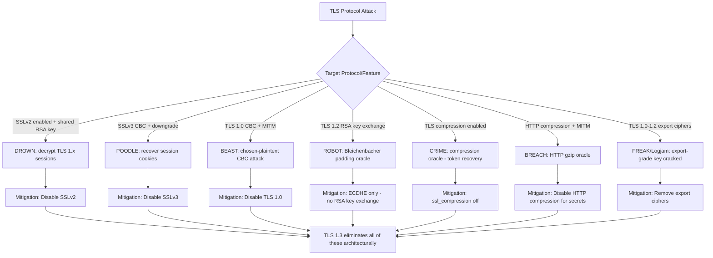

⚡ TL;DR - TLS protocol attacks exploit cryptographic weaknesses in specific TLS
versions and cipher suites, not the TLS implementation code. Key attacks:
BEAST (CBC + chosen-plaintext in TLS 1.0), POODLE (CBC padding oracle in SSLv3),
DROWN (SSLv2 cross-protocol → decrypt TLS 1.x traffic), ROBOT (RSA PKCS#1
padding oracle - revived Bleichenbacher 1998 attack), CRIME/BREACH (TLS
compression enables compression oracle to recover session tokens),
FREAK/Logjam (export-grade crypto downgrade). All are defeated by: disabling
SSLv2, SSLv3, TLS 1.0, TLS 1.1; using TLS 1.2+ with PFS cipher suites only
(ECDHE, not static RSA key exchange); disabling TLS compression; using
TLS 1.3 where possible (removes CBC and static RSA exchange entirely).
Modern guidance: TLS 1.3 + TLS 1.2 with PFS = safe. Everything older = deprecated.

---

| #095 | Category: Security | Difficulty: ★★★★ |
|:---|:---|:---|
| **Depends on:** | OWASP Top 10, Authentication, Session Management, Secrets Management, IAM, TLS Configuration, OAuth 2.0 Security, Auth Migration, OAuth vs SAML, TLS 1.2 to TLS 1.3 Migration, Heartbleed, Advanced JWT, Advanced XSS, CORS Misconfiguration, SSRF, OAuth Implicit Flow | |
| **Used by:** | Certificate Transparency, HSTS, Responsible Disclosure, IR Process, AWS Security Services, TLS 1.3 Protocol Design, Web Security Model, Security Protocol Design Trade-offs | |
| **Related:** | OWASP Top 10, TLS Configuration, OAuth Security, TLS Migration, Heartbleed, Advanced JWT, Certificate Transparency, HSTS, TLS 1.3 Design, Web Security Model, Security Protocol Trade-offs | |

---

### 🔥 The Problem This Solves

**WHY TLS PROTOCOL ATTACKS EXIST:**

```
THE CRYPTOGRAPHIC LEGACY PROBLEM:

  TLS history: SSL 1.0 (1994) → SSL 2.0 (1995) → SSL 3.0 (1996) →
               TLS 1.0 (1999) → TLS 1.1 (2006) → TLS 1.2 (2008) →
               TLS 1.3 (2018)
  
  Each version was designed with the cryptographic knowledge of its time.
  Each was found to have weaknesses as cryptographic research advanced.
  
  THE BACKWARD COMPATIBILITY TRAP:
  
  TLS 1.0 was the internet standard from 1999-2008 (9 years).
  Every major website and browser supported TLS 1.0.
  When TLS 1.2 was released: servers kept TLS 1.0 enabled for compatibility.
  
  Browser/server negotiation: "I'll use the highest version we both support."
  Downgrade attack: MITM attacker interferes with the handshake.
  Makes server think client only supports TLS 1.0.
  Forces negotiation to TLS 1.0 → enables TLS 1.0-specific attacks.
  
  THE CIPHER SUITE LEGACY TRAP:
  
  RSA key exchange (TLS 1.0-1.2 option): server has RSA key pair.
  Client encrypts premaster secret with server's RSA public key.
  If attacker records traffic AND gets server's RSA private key later:
  CAN DECRYPT ALL PAST TRAFFIC. No forward secrecy.
  
  "Export-grade" crypto: US law (pre-2000) restricted key lengths for export.
  RSA-512, DH-512 were the "export" versions.
  Browsers kept export cipher support for compatibility with old servers.
  FREAK/Logjam: force the export-grade cipher in handshake → crack the key.
  
  TLS 1.3 DESIGN RESPONSE:
  Removed all deprecated features: no static RSA, no CBC ciphers, no compression,
  no export ciphers, no MD5/SHA-1, no renegotiation.
  TLS 1.3 is a clean-slate secure design. But backward compat still matters.
  
  THE ATTACK TAXONOMY:
  
    Attack        | Protocol | Attack Type   | Critical?
    ──────────────┼──────────┼───────────────┼──────────
    BEAST         | TLS 1.0  | CBC oracle    | No (mitigated, old)
    POODLE        | SSLv3    | CBC padding   | Medium (downgrade needed)
    DROWN         | SSLv2    | Cross-proto   | HIGH (decrypt TLS 1.x)
    ROBOT         | TLS 1.2  | RSA padding   | HIGH (key exchange)
    CRIME         | TLS 1.2  | Compression   | Medium (needs injection)
    BREACH        | HTTP     | HTTP compress | Medium (needs injection)
    FREAK         | TLS 1.2  | Export RSA    | Medium (MITM needed)
    Logjam        | TLS 1.2  | Export DH-512 | Medium (MITM needed)
    Renegotiation | TLS 1.0  | Protocol flaw | High (patched 2009)
```

---

### 📘 Textbook Definition

**BEAST (Browser Exploit Against SSL/TLS, 2011):** An attack against TLS 1.0
using CBC (Cipher Block Chaining) mode. Exploits a chosen-plaintext vulnerability:
an attacker who can inject data before a secret value (e.g., a session cookie)
can use the CBC initialization vector (IV) predictability in TLS 1.0 to recover
the secret byte-by-byte. Mitigated by: TLS 1.1+ (random IV per record),
RC4 cipher (now also broken), or 1/n-1 record splitting.

**POODLE (Padding Oracle On Downgraded Legacy Encryption, 2014):** An attack
against SSLv3 that exploits how SSLv3 handles CBC padding. The attacker (via
downgrade) forces SSLv3 use, then exploits the padding oracle to decrypt one
byte per 256 requests. Used to steal session cookies. Defense: disable SSLv3.

**DROWN (Decrypting RSA with Obsolete and Weakened eNcryption, 2016):** A
cross-protocol attack using SSLv2 to attack TLS 1.x. If a server supports SSLv2
AND uses the same RSA key pair as its TLS server, an attacker can use SSLv2
sessions as a cryptographic oracle to decrypt recorded TLS sessions. ~33% of
HTTPS servers were vulnerable at discovery.

**ROBOT (Return Of Bleichenbacher's Oracle Threat, 2017):** A revival of
Bleichenbacher's 1998 RSA padding oracle attack. Found in multiple TLS libraries
(F5, Citrix, Cisco, Radware, Bouncy Castle, OpenSSL) that improperly handled
PKCS#1 v1.5 RSA padding errors. Allows decryption of RSA key exchange messages.
Defense: use ECDHE instead of RSA key exchange, or constant-time padding checking.

**CRIME (Compression Ratio Info-leak Made Easy, 2012):** Exploits TLS-level
compression. If an attacker can inject data before a secret and observe the
compressed+encrypted ciphertext SIZE, they can use compression oracle to recover
the secret (compression reduces size when injected guess matches secret prefix).
Defense: disable TLS compression (now default in all modern TLS stacks).

**BREACH (Browser Reconnaissance and Exfiltration via Adaptive Compression of
Hypertext, 2013):** Like CRIME, but at the HTTP level (HTTP response compression,
e.g., gzip). Even with TLS compression disabled, if the server compresses HTTP
responses and the attacker can inject content into the response, the compressed
size reveals information. Defense: disable HTTP compression for pages containing
secrets, or use random padding (CSRF token changes on each response).

**Forward Secrecy (PFS - Perfect Forward Secrecy):** A property of key exchange
where the session keys cannot be derived from the server's long-term private key.
Uses ephemeral Diffie-Hellman (ECDHE/DHE). If the server's private key is
compromised later: past sessions cannot be decrypted. Static RSA key exchange
(no PFS): server's private key decrypts all past and future sessions.

---

### ⏱️ Understand It in 30 Seconds

**One line:**
TLS protocol attacks exploit specific cryptographic weaknesses in old TLS versions
and cipher suites (CBC padding oracles, compression leaks, weak key exchange,
cross-protocol attacks) - all defeated by using only TLS 1.2 with PFS ciphers,
or TLS 1.3 (which eliminates these cipher classes entirely).

**One analogy:**
> Imagine TLS as a series of security lock upgrades on a safe.
> Lock v1 (SSL 2.0, 1995): had a design flaw - the key material could be used
>   to attack OTHER locks (cross-protocol = DROWN).
> Lock v2 (SSL 3.0, 1996): CBC padding was predictable (POODLE).
> Lock v3 (TLS 1.0, 1999): IV was predictable in CBC mode (BEAST).
> Lock v4 (TLS 1.2, 2008): fixed IV issue, but some old key exchange mechanisms
>   (RSA PKCS#1) had padding oracles (ROBOT), some used compression (CRIME).
> Lock v5 (TLS 1.3, 2018): redesigned from scratch.
>   Removed: CBC, static RSA key exchange, compression, export ciphers.
>   Everything that was ever exploited: gone.
>
> The attacks all have the same shape:
> 1. Force the server to use an old, vulnerable lock version (downgrade attack).
> 2. Exploit the specific weakness in that old lock.
> 3. Recover the encryption key or plaintext.
>
> The defense: refuse to use old locks.
> Only accept Lock v4 with forward-secrecy key exchange, or Lock v5.
> Disable downgrade (lock version negotiation cannot go below your minimum).

---

### 🔩 First Principles Explanation

**POODLE attack mechanics:**

```
POODLE: Padding Oracle On Downgraded Legacy Encryption

  CONTEXT: SSLv3 CBC mode encryption.
  
  CBC ENCRYPTION:
    Block cipher operates on fixed-size blocks (16 bytes for AES).
    CBC: each plaintext block is XORed with previous ciphertext block before encryption.
    Decryption: decrypt block, XOR with previous ciphertext block.
    
  PADDING:
    If plaintext is not a multiple of block size: pad to fill the last block.
    SSLv3 padding: last N bytes all have value N-1.
    Example: need 3 bytes of padding → pad with [2, 2, 2].
    
  PADDING ORACLE:
    Server decrypts ciphertext, checks padding validity.
    If padding INVALID: server returns an error.
    If padding VALID: server continues processing.
    Error vs no-error = ORACLE: leaks one bit of information.
    
  POODLE ATTACK:
    MITM attacker can:
    1. Force SSLv3 use (downgrade from TLS).
    2. Observe encrypted traffic (e.g., session cookie in HTTPS request).
    3. Manipulate ciphertext blocks (MITM can modify ciphertext).
    4. Observe if server returns padding error or not.
    
    Recovering 1 byte of the session cookie:
    - Last byte of plaintext block C[15] = decrypt(block) XOR C_prev[15]
    - Attacker copies the block containing C[15] to the last block position.
    - Adjusts C_prev[15] to try all 256 values.
    - When server returns no padding error: found value where decrypt(block) XOR C_prev[15] = 0x00
    - Back-calculate: decrypt(block) = 0x00 XOR C_prev[15] = C_prev[15]
    - Then: original byte = decrypt(block) XOR original_C_prev[15]
    
    256 requests per byte × 16 bytes per block × N blocks = recovers session cookie.
    
  DEFENSE:
    Disable SSLv3. No SSLv3 = no POODLE.
    Even if TLS is used: if server supports SSLv3, MITM can force downgrade.
    Browser fix: refuse to attempt SSLv3 (Chrome 2014, Firefox 2014).

DROWN: CROSS-PROTOCOL ATTACK:

  SITUATION (2016):
    Many servers: TLS 1.x on port 443 (modern, secure cipher suite).
    SAME servers: SSLv2 on SMTP port 25 (old protocol, not updated).
    SAME RSA key pair: shared between the two server configurations.
    
  ATTACK:
    Attacker records TLS 1.x RSA key exchange sessions (no PFS):
    ClientKeyExchange: RSA-encrypted premaster secret with server's RSA public key.
    
    Attacker connects to SSLv2 port:
    SSLv2 has export-grade RSA key exchange (RSA-512).
    Attacker uses SSLv2 as a cryptographic oracle:
    Submit RSA ciphertext (from TLS recording) to SSLv2 decryption oracle.
    SSLv2 leaks whether padding is valid (similar to Bleichenbacher oracle).
    With enough queries: recover the premaster secret.
    
    Use recovered premaster secret to decrypt recorded TLS sessions.
    
  AFFECTED (~33% of HTTPS servers, 2016):
    Any server sharing RSA key between TLS and SSLv2.
    
  DEFENSE:
    Disable SSLv2 completely.
    Use different RSA keys for each protocol (or disable SSLv2 entirely - preferred).
    Use ECDHE/DHE (forward secrecy): even if key exchange recovered, past sessions
    not recoverable (ephemeral session key was different each time).
```

---

### 🧪 Thought Experiment

**SCENARIO: Security audit of a legacy HTTPS server:**

```
AUDIT SUBJECT: Financial services API server, TLS configuration.
TOOL: testssl.sh, sslyze, or SSL Labs (ssllabs.com/ssltest)
      Run: testssl.sh https://api.financeapp.com

OUTPUT ANALYSIS:

  Protocols:
    TLSv1.3:  ENABLED  ✓
    TLSv1.2:  ENABLED  ✓
    TLSv1.1:  ENABLED  ✗ (deprecated, remove)
    TLSv1.0:  ENABLED  ✗ (BEAST, POODLE-TLS risk, remove)
    SSLv3:    ENABLED  ✗ (POODLE, CRITICAL, remove immediately)
    SSLv2:    ENABLED  ✗ (DROWN, CRITICAL, remove immediately)
  
  Cipher Suites (TLS 1.2):
    ECDHE-RSA-AES256-GCM-SHA384:  ENABLED  ✓ (PFS, AEAD)
    ECDHE-RSA-AES128-GCM-SHA128:  ENABLED  ✓ (PFS, AEAD)
    AES256-SHA256 (no ECDHE):     ENABLED  ✗ (no PFS, ROBOT risk if RSA used)
    DES-CBC3-SHA:                 ENABLED  ✗ (weak cipher, remove)
    RC4-SHA:                      ENABLED  ✗ (RC4 broken, remove)
    
  TLS Compression:
    COMPRESSION: ENABLED  ✗ (CRIME risk, disable)
  
  ROBOT test:
    RSA key exchange: server supports PKCS#1 v1.5.
    Padding oracle test: potentially vulnerable → VERIFY LIBRARY VERSION.
  
  FINDINGS SUMMARY:
    CRITICAL:
    - SSLv2 enabled: DROWN attack (decrypt TLS sessions using SSLv2 oracle)
    - SSLv3 enabled: POODLE attack (decrypt session cookies via downgrade)
    
    HIGH:
    - TLS 1.0/1.1 enabled: BEAST, POODLE-TLS, downgrade attack vector
    - Weak ciphers: RC4 broken, 3DES weak (Sweet32 attack at 64-bit blocks)
    - No PFS on all cipher suites: recorded traffic decryptable if key compromised
    
    MEDIUM:
    - TLS compression enabled: CRIME attack vector
    - RSA key exchange (no PFS): verify not vulnerable to ROBOT
  
  REMEDIATION (nginx configuration):
  
    # nginx.conf - secure TLS configuration:
    
    ssl_protocols TLSv1.2 TLSv1.3;
    # TLS 1.2 + TLS 1.3 only. Everything older: disabled.
    
    ssl_ciphers ECDHE-ECDSA-AES128-GCM-SHA256:ECDHE-RSA-AES128-GCM-SHA256
                :ECDHE-ECDSA-AES256-GCM-SHA384:ECDHE-RSA-AES256-GCM-SHA384
                :ECDHE-ECDSA-CHACHA20-POLY1305:ECDHE-RSA-CHACHA20-POLY1305;
    # ECDHE only (PFS). GCM/CHACHA20 (AEAD, no padding oracle).
    # All CBC, RSA key exchange, and weak ciphers: removed.
    
    ssl_prefer_server_ciphers on;
    ssl_compression off;  # Disable TLS compression (CRIME)
    
    # HSTS: tell browsers to always use HTTPS:
    add_header Strict-Transport-Security "max-age=31536000; includeSubDomains" always;
    
    # Session tickets: key rotation (forward secrecy for session resumption)
    ssl_session_tickets off;  # Or: use ticket key rotation with hourly keys
```

---

### 🧠 Mental Model / Analogy

> TLS protocol attacks = testing the security of a combination lock by probing
> how it responds differently to correct and incorrect combinations.
>
> PADDING ORACLE (POODLE, BEAST, ROBOT):
> The lock responds differently to "almost correct" vs "completely wrong."
> "Almost correct" (valid padding but wrong content): click sound.
> "Completely wrong": thud.
> Attacker tries combinations and listens to the response.
> 256 guesses per digit → extracts the secret digit-by-digit.
>
> COMPRESSION ORACLE (CRIME, BREACH):
> The lock is sealed in a box. Box size reflects whether your guess matches.
> Correct guess → compression reduces box size.
> Wrong guess → no compression → larger box.
> Attacker measures box size for each guess → finds the correct combination.
>
> CROSS-PROTOCOL (DROWN):
> Two buildings share the same master key.
> Building A (TLS 1.x): has a modern high-security lock.
> Building B (SSLv2): has an old, weak lock.
> Attacker can't pick Building A's lock.
> But: uses Building B's weak lock as a tool to reveal the master key.
> With the master key: can open Building A.
>
> DOWNGRADE (FREAK, Logjam, POODLE TLS):
> The guard (TLS negotiation) can be intimidated: "I demand we use your old,
> weaker lock from 1996." Guard complies.
> Attacker now faces a weak 1996-era lock instead of the 2018 model.
>
> THE FIX: TLS 1.3 removed all the weak locks.
> There are no CBC locks, no RSA-only locks, no compression, no export locks.
> No downgrade possible to weak modes (TLS 1.3 doesn't negotiate them).

---

### 📶 Gradual Depth - Five Levels

**Level 1 - What it is (anyone can understand):**
TLS protocol attacks are techniques that exploit specific weaknesses in older SSL/TLS versions. The attacks mostly require being able to intercept network traffic (man-in-the-middle), and then they trick old encryption methods into revealing secret information. The defense is simply: don't use old TLS versions (disable SSL 2.0, SSL 3.0, TLS 1.0, TLS 1.1).

**Level 2 - How to use it (junior developer):**
Configure your servers to use only TLS 1.2 and TLS 1.3. Use ECDHE cipher suites (forward secrecy). Disable TLS compression. Use AEAD ciphers (GCM, CHACHA20-POLY1305) instead of CBC. Test with ssllabs.com/ssltest or testssl.sh. A+ grade means no major known vulnerabilities in your TLS configuration.

**Level 3 - How it works (mid-level engineer):**
Padding oracle attacks (POODLE, BEAST, ROBOT): the server's different response to valid vs invalid padding leaks one bit per request. Accumulate enough bits → recover plaintext. Requires ~256 requests per byte. Compression oracle (CRIME, BREACH): compressed ciphertext size differs based on whether injected guess matches the secret. Observe size → binary search → recover secret. Cross-protocol (DROWN): SSLv2's RSA key exchange oracle used to decrypt separately-recorded TLS 1.x sessions. Requires: shared RSA key + SSLv2 still enabled + no PFS. Downgrade attacks: MITM modifies ClientHello to remove modern TLS versions → server offers old version → weak cipher negotiated. Prevention: TLS 1.2 `ssl_min_version` setting or `ssl_protocols TLSv1.2 TLSv1.3`.

**Level 4 - Why it was designed this way (senior/staff):**
All these attacks share a pattern: the attacker uses the server as a cryptographic oracle. An oracle takes an input and reveals partial information about the correct output. Each oracle query reveals 1 bit (or a few bits) of information. With enough queries: full plaintext recovery. The cryptographic lesson: decryption functions that BEHAVE DIFFERENTLY based on whether plaintext structure is valid are oracles. You must NEVER reveal whether decryption succeeded except by delivering the correct result. Constant-time operations: TLS PKCS#1 v1.5 decryption must take the same time regardless of whether padding is valid (to prevent timing-based oracles). Constant-time comparison functions are mandatory in cryptographic code paths. TLS 1.3 removed RSA key exchange entirely: ECDHE-only. No PKCS#1 v1.5 means no Bleichenbacher oracle class attacks.

**Level 5 - Mastery (distinguished engineer):**
The Bleichenbacher 1998 attack is foundational: published 26 years ago, it spawned ROBOT (2017) and multiple other oracle attacks because PKCS#1 v1.5 RSA decryption was never fully purged from TLS implementations. The oracle attack requires thousands to millions of queries (depending on RSA key size). For 2048-bit RSA: requires ~2^15 to 2^17 queries. Automated in ~1 hour against real servers in ROBOT research. TLS 1.3 premaster secret: ECDHE generates a shared secret from ephemeral keys. No RSA decryption involved. Bleichenbacher is architecturally impossible in TLS 1.3. Sweet32 (2016): 3DES and Blowfish use 64-bit blocks. Birthday bound for 64-bit block ciphers: after 2^32 blocks (~32GB), collision probability becomes significant. Collision → CBC mode XOR oracle → plaintext recovery. Fix: use 128-bit block ciphers (AES). Side-channel timing attacks on AES: cache-timing attacks on AES-128 (T-table implementation). Mitigated by AES-NI hardware instructions (constant-time by design). Lucky Thirteen (2013): timing attack on TLS CBC MAC-then-encrypt (extra processing for valid CBC → timing difference → padding oracle). Mitigated by MAC-then-encrypt → AEAD (authenticated encryption). TLS 1.3: AEAD only. No MAC-then-encrypt. Lucky Thirteen is architecturally eliminated.

---

### ⚙️ How It Works (Mechanism)

```
TLS ATTACK MAP:

  SSLv2:
    DROWN (cross-protocol oracle → decrypt TLS 1.x RSA key exchange)
    → FIX: Disable SSLv2 completely.
  
  SSLv3:
    POODLE (CBC padding oracle → recover session cookies)
    → FIX: Disable SSLv3 completely.
  
  TLS 1.0:
    BEAST (CBC IV predictability → chosen-plaintext attack)
    POODLE-TLS (TLS CBC padding less strict, similar oracle)
    → FIX: Disable TLS 1.0. Use TLS 1.2+ with AES-GCM (AEAD, not CBC).
  
  TLS 1.2 with RSA key exchange:
    ROBOT (RSA PKCS#1 v1.5 padding oracle → decrypt premaster secret)
    → FIX: Use ECDHE (no RSA key exchange). Or: patch library + constant-time.
  
  TLS 1.2 with compression:
    CRIME (TLS compression oracle → recover session tokens)
    → FIX: Disable TLS compression (ssl_compression off; in nginx).
  
  HTTP with response compression:
    BREACH (HTTP gzip oracle → recover secrets in HTTP response body)
    → FIX: Disable HTTP gzip for pages with secrets, or use random CSRF tokens.
  
  TLS 1.0/1.2 with export ciphers:
    FREAK (RSA-512 forced → 512-bit RSA cracked in ~7.5 hours at 2015 compute)
    Logjam (DH-512 forced → Logjam 512-bit DH precomputed attack)
    → FIX: Remove export ciphers from server. Browsers removed export cipher support.
  
  TLS 1.3:
    Removes CBC, static RSA, compression, export ciphers, RC4.
    ECDHE-only, AEAD-only.
    All attacks above: architecturally eliminated.
```



---

### 💻 Code Example

**Hardened TLS configuration (nginx and Java):**

```nginx
# nginx.conf - TLS hardening against all known protocol attacks

server {
    listen 443 ssl http2;
    server_name api.myapp.com;
    
    ssl_certificate /etc/ssl/certs/myapp.crt;
    ssl_certificate_key /etc/ssl/private/myapp.key;
    
    # Protocols: TLS 1.2 + TLS 1.3 ONLY
    # Disables: SSLv2 (DROWN), SSLv3 (POODLE), TLS 1.0 (BEAST, POODLE-TLS),
    # TLS 1.1 (deprecated)
    ssl_protocols TLSv1.2 TLSv1.3;
    
    # Cipher suites: ECDHE only (PFS), AEAD only (no padding oracle)
    # No CBC (BEAST/POODLE/Lucky13), No RC4 (broken), No 3DES (Sweet32)
    # No RSA key exchange (ROBOT/DROWN), No export ciphers (FREAK/Logjam)
    ssl_ciphers ECDHE-ECDSA-AES128-GCM-SHA256
               :ECDHE-RSA-AES128-GCM-SHA256
               :ECDHE-ECDSA-AES256-GCM-SHA384
               :ECDHE-RSA-AES256-GCM-SHA384
               :ECDHE-ECDSA-CHACHA20-POLY1305
               :ECDHE-RSA-CHACHA20-POLY1305;
    
    ssl_prefer_server_ciphers on;
    
    # DISABLE TLS compression: prevents CRIME attack
    ssl_compression off;
    
    # DH parameters: 2048-bit minimum (Logjam mitigation)
    ssl_dhparam /etc/ssl/dhparam.pem;
    # Generate: openssl dhparam -out /etc/ssl/dhparam.pem 2048
    
    # Elliptic curves: modern, secure curves only
    ssl_ecdh_curve X25519:secp521r1:secp384r1;
    
    # Session cache and tickets (performance with security)
    ssl_session_cache shared:SSL:10m;
    ssl_session_timeout 10m;
    # Session ticket key rotation (maintain PFS for resumed sessions):
    # Rotate ssl_session_ticket_key every 24h
    
    # HSTS: browsers only connect via HTTPS (prevents protocol downgrade)
    add_header Strict-Transport-Security
        "max-age=31536000; includeSubDomains; preload" always;
    
    # Security headers
    add_header X-Content-Type-Options "nosniff" always;
    add_header X-Frame-Options "DENY" always;
}
```

```java
// Java: Hardening HTTPS connections (outbound SSL socket factory)

import javax.net.ssl.*;
import java.security.*;

public class TlsHardenedHttpClient {
    
    public static SSLContext createHardenedSslContext() throws Exception {
        // Use TLS (picks best available - TLS 1.3 if JVM supports it):
        SSLContext context = SSLContext.getInstance("TLS");
        context.init(null, null, new SecureRandom());
        return context;
    }
    
    // Configure OkHttp (or similar) with hardened TLS:
    public OkHttpClient buildHardenedClient() throws Exception {
        SSLContext sslContext = createHardenedSslContext();
        
        // Connection spec: TLS 1.2 + TLS 1.3 only, PFS ciphers only
        ConnectionSpec spec = new ConnectionSpec.Builder(ConnectionSpec.MODERN_TLS)
            .tlsVersions(TlsVersion.TLS_1_3, TlsVersion.TLS_1_2)
            .cipherSuites(
                // PFS + AEAD only (ECDHE-GCM and CHACHA20-POLY1305):
                CipherSuite.TLS_AES_256_GCM_SHA384,           // TLS 1.3
                CipherSuite.TLS_CHACHA20_POLY1305_SHA256,     // TLS 1.3
                CipherSuite.TLS_AES_128_GCM_SHA256,           // TLS 1.3
                CipherSuite.TLS_ECDHE_RSA_WITH_AES_256_GCM_SHA384,  // TLS 1.2
                CipherSuite.TLS_ECDHE_RSA_WITH_AES_128_GCM_SHA256,  // TLS 1.2
                CipherSuite.TLS_ECDHE_RSA_WITH_CHACHA20_POLY1305_SHA256 // TLS 1.2
            )
            .build();
        
        return new OkHttpClient.Builder()
            .sslSocketFactory(sslContext.getSocketFactory(),
                (X509TrustManager) TrustManagerFactory
                    .getInstance(TrustManagerFactory.getDefaultAlgorithm())
                    .getTrustManagers()[0])
            .connectionSpecs(List.of(spec))
            // No HTTPS fallback to HTTP:
            .followSslRedirects(false)
            .build();
    }
}

// Spring Boot application.properties:
// server.ssl.enabled-protocols=TLSv1.2,TLSv1.3
// server.ssl.ciphers=TLS_AES_256_GCM_SHA384,TLS_CHACHA20_POLY1305_SHA256,...
// (Use SSL Labs to verify: https://ssllabs.com/ssltest)
```

---

### ⚖️ Comparison Table

| Attack | Year | Target | Mechanism | CVSS | Mitigated By |
|:---|:---|:---|:---|:---|:---|
| **BEAST** | 2011 | TLS 1.0 CBC | Predictable IV chosen-plaintext | 6.8 | Disable TLS 1.0; use AEAD |
| **CRIME** | 2012 | TLS compression | Compression oracle | 7.3 | Disable TLS compression |
| **BREACH** | 2013 | HTTP gzip | Compression oracle | 7.3 | Disable HTTP compress for secrets |
| **POODLE** | 2014 | SSLv3 CBC | Padding oracle | 3.4 | Disable SSLv3 |
| **FREAK** | 2015 | Export RSA | 512-bit RSA crackable | 5.9 | Remove export ciphers |
| **Logjam** | 2015 | Export DH | 512-bit DH precomputed | 5.9 | Use 2048-bit DH minimum |
| **DROWN** | 2016 | SSLv2 + TLS | Cross-protocol oracle | 8.1 | Disable SSLv2 |
| **ROBOT** | 2017 | RSA key exchange | Bleichenbacher oracle | 5.9 | Use ECDHE; no RSA key exchange |

---

### ⚠️ Common Misconceptions

| Misconception | Reality |
|:---|:---|
| "TLS 1.2 is secure if configured correctly." | TLS 1.2 CAN be secure if configured correctly: ECDHE cipher suites only (no RSA key exchange), AEAD ciphers only (no CBC), no compression, 2048-bit DH minimum. However: "configured correctly" is a continuous requirement. ROBOT (2017) affected correctly-deployed TLS 1.2 servers (F5, Citrix, Cisco) because the LIBRARY implementation had a PKCS#1 padding oracle. The server was "configured correctly" (TLS 1.2, proper ciphers) but the library underneath was vulnerable. The defense: regular testing with ssllabs.com/ssltest, keep TLS libraries patched, and prefer TLS 1.3 (which eliminates RSA key exchange entirely). TLS 1.2 is acceptable for compatibility but TLS 1.3 has a fundamentally cleaner security model. |
| "HTTPS prevents all these attacks." | HTTPS (TLS) prevents passive eavesdropping on the network. Protocol attacks often additionally require: (1) A man-in-the-middle position (can intercept and modify traffic), (2) The ability to make the victim's browser send many requests (e.g., BEAST, POODLE), (3) An active network attacker who can force downgrade. These requirements are harder to meet than simple eavesdropping, but they're not theoretical. Coffee shop Wi-Fi, BGP hijacking, and MITM in enterprise proxy environments can all create the required conditions. The threat model for protocol attacks: corporate networks with SSL inspection proxies, captive portal networks, and targeted nation-state attackers. |

---

### 🚨 Failure Modes & Diagnosis

**Testing TLS configuration:**

```
TLS SECURITY TESTING:

  ONLINE TOOLS:
    ssllabs.com/ssltest - most comprehensive, grades A through F
    testssl.sh - command-line, can test non-public servers
    
  COMMAND LINE (testssl.sh):
    # Download testssl.sh (https://testssl.sh):
    chmod +x testssl.sh
    
    # Full test:
    ./testssl.sh https://api.myapp.com
    
    # Check specific attacks:
    ./testssl.sh --beast --poodle --drown --robot \
                 --crime --breach https://api.myapp.com
    
    # Check protocols only:
    ./testssl.sh --protocols https://api.myapp.com
  
  OPENSSL QUICK CHECKS:
    # Check if SSLv3 is enabled (should fail with secure server):
    openssl s_client -ssl3 -connect api.myapp.com:443
    # "handshake failure" → SSLv3 disabled (good)
    # "Connected" → SSLv3 enabled (POODLE risk)
    
    # Check if TLS 1.0 is enabled:
    openssl s_client -tls1 -connect api.myapp.com:443
    # Should fail for secure servers.
    
    # Check TLS 1.2:
    openssl s_client -tls1_2 -connect api.myapp.com:443
    # Should succeed.
    
    # Check TLS 1.3:
    openssl s_client -tls1_3 -connect api.myapp.com:443
    # Should succeed on modern servers.
    
    # Check if server accepts weak ciphers:
    openssl s_client -cipher RC4-SHA -connect api.myapp.com:443
    # Should fail ("no cipher list").
  
  EXPECTED RESULTS (secure configuration):
    SSLv2: DISABLED
    SSLv3: DISABLED
    TLS 1.0: DISABLED
    TLS 1.1: DISABLED
    TLS 1.2: ENABLED (with PFS+AEAD ciphers only)
    TLS 1.3: ENABLED
    Compression: DISABLED
    Export ciphers: NONE
    RC4: DISABLED
    3DES: DISABLED
    RSA key exchange: DISABLED (ECDHE only)
    Forward Secrecy: YES (all sessions)
    
  SSL LABS GRADE REQUIREMENTS:
    A+: HSTS preload, no TLS 1.0/1.1, no weak ciphers, PFS
    A:  TLS 1.2+, no known vulnerabilities
    B:  TLS 1.0 or weak ciphers but no critical vulns
    C/F: Active known vulnerabilities
```

---

### 🔗 Related Keywords

**Prerequisites:**
- `TLS Configuration` (SEC-041) - TLS setup basics
- `TLS 1.2 to TLS 1.3 Migration` (SEC-081) - practical migration guide

**Builds on this:**
- `Certificate Transparency Logs` (SEC-096) - certificate trust alongside TLS protocol security
- `HSTS` (SEC-097) - prevents TLS downgrade at HTTP level
- `TLS 1.3 Protocol Design Rationale` (SEC-130) - why TLS 1.3 eliminates these attacks

---

### 📌 Quick Reference Card

```
┌──────────────────────────────────────────────────────────┐
│ DISABLE       │ SSLv2 (DROWN), SSLv3 (POODLE)           │
│               │ TLS 1.0 (BEAST), TLS 1.1 (deprecated)   │
├───────────────┼──────────────────────────────────────────┤
│ CIPHER SUITE  │ ECDHE only (PFS) + AES-GCM/CHACHA20     │
│               │ No CBC, no RC4, no 3DES, no export       │
├───────────────┼──────────────────────────────────────────┤
│ COMPRESSION   │ ssl_compression off (CRIME)              │
│               │ Disable HTTP gzip for secrets (BREACH)   │
├───────────────┼──────────────────────────────────────────┤
│ KEY EXCHANGE  │ ECDHE only. No static RSA (ROBOT/DROWN)  │
│               │ DH minimum 2048-bit (Logjam)             │
├───────────────┼──────────────────────────────────────────┤
│ BEST CHOICE   │ TLS 1.3 + TLS 1.2 with ECDHE+AEAD      │
│               │ All attacks in this entry: eliminated    │
├───────────────┼──────────────────────────────────────────┤
│ TEST TOOL     │ ssllabs.com/ssltest, testssl.sh          │
│               │ Target grade: A+                         │
└──────────────────────────────────────────────────────────┘
```

---

### 💎 Transferable Wisdom

**Reusable Engineering Principle:**
"Oracles are the fundamental class of cryptographic vulnerability."
An oracle is a function that answers questions - specifically, yes/no questions
that reveal information about a secret.
Every practical attack in this entry exploits an oracle:
- Padding oracle (POODLE, BEAST, ROBOT): "Is this padding valid?" (yes/no)
- Compression oracle (CRIME, BREACH): "Does size decrease?" (yes/no per guess)
- Timing oracle (Lucky Thirteen): "Did processing take longer?" (yes/no)
- Error oracle (DROWN): "Did this SSLv2 session succeed?" (yes/no)
The principle: any function that behaves DIFFERENTLY depending on secret-related
properties of its input is an oracle. Oracles enable systematic secret recovery
through repeated queries.
Cryptographic defense against oracle attacks:
1. Constant-time execution: padding check must take the same time regardless of validity.
   Different timing = timing oracle. Use `MessageDigest.isEqual()` not `Arrays.equals()`.
2. No error distinction: decryption failure should look identical to decryption success
   from the outside. Don't return "invalid padding" - return "invalid MAC" for everything.
3. Authenticated Encryption (AEAD): MAC-then-encrypt allows padding oracle.
   Encrypt-then-MAC (AEAD) checks authenticity before decryption attempt.
   If MAC fails: reject immediately, no decryption. No oracle.
   TLS 1.3 mandate of AEAD: eliminates all padding oracle attacks architecturally.
The transfer: this oracle pattern recognition applies to:
- Database error messages: "Row not found" vs "Wrong password" → username oracle.
- Timing in login: comparing hash takes different time → timing oracle.
- Error detail in JWT: "Invalid token" vs "Token expired" → claim oracle.
- XML parsing errors: detailed error vs generic → XXE/SSRF oracle.
Whenever error/timing/size DIFFERS based on secret-related input: oracle exists.
Flatten the response: same error, same time, same size. Eliminate the oracle.

---

### 💡 The Surprising Truth

ROBOT (2017) - Return Of Bleichenbacher's Oracle Threat - found the same
cryptographic vulnerability (RSA PKCS#1 v1.5 padding oracle) that Daniel
Bleichenbacher published in 1998... in F5, Citrix, Cisco ASA, Radware,
Bouncy Castle, and OpenSSL. 19 years after the original paper.

Bleichenbacher's 1998 paper was widely read. PKCS#1 v1.5 was known to be
problematic since 1998. The IETF deprecated RSA key exchange in TLS 1.3 (2018)
partly because of Bleichenbacher.

Despite 19 years of awareness:
- 11 separate implementations had the vulnerability.
- Some had it because they tried to implement the "blinding" defense and got it wrong.
- Some had it because of edge cases in error handling.
- Some had it in hardware TLS offload (not patched for years, firmware constraints).

The lesson: knowing a vulnerability exists is not the same as correctly implementing
the defense. The Bleichenbacher defense requires constant-time RSA decryption +
constant-time error response + careful blinding of internal error states.
Every deviation from constant-time behavior re-introduces the oracle.

This is why TLS 1.3 removed RSA key exchange entirely instead of trying to defend it.
"It's too hard to implement correctly" is a valid reason to remove a feature from
a security-critical protocol. The lesson for API designers: if a feature has a
history of being implemented insecurely across multiple implementations,
consider architectural elimination instead of requiring each implementation
to get a subtle defense correct.

---

### ✅ Mastery Checklist

**You've mastered this when you can:**
1. **NAME** the three major SSL/TLS disables: SSLv2 (DROWN), SSLv3 (POODLE),
   TLS 1.0/1.1 (BEAST, old protocol).
2. **EXPLAIN** why DROWN is a cross-protocol attack: SSLv2 and TLS 1.x share
   RSA key pair. SSLv2 RSA oracle used to decrypt recorded TLS sessions.
   Defense: disable SSLv2 OR use ECDHE (no RSA key exchange).
3. **STATE** the cipher suite requirements: ECDHE (PFS), AEAD (GCM/CHACHA20),
   no CBC, no export, no RC4, no 3DES. TLS 1.3: all attacks architecturally eliminated.
4. **DESCRIBE** what an oracle attack is: server behaves differently based on
   secret-related input → attacker queries repeatedly → recovers secret.

---

### 🎯 Interview Deep-Dive

**Q: What are POODLE and DROWN attacks? What does "forward secrecy" mean
and why does it matter for these attacks?**

*Why they ask:* Tests cryptographic knowledge depth and ability to connect
protocol-level attacks to practical configuration decisions. Common in security
engineering and senior backend roles.

*Strong answer covers:*
- POODLE: SSLv3 CBC padding oracle. MITM attacker forces SSLv3 via downgrade.
  Exploits CBC padding validation oracle (server responds differently to valid/invalid padding).
  256 requests to recover 1 byte of session cookie. Defense: disable SSLv3.
- DROWN: SSLv2 cross-protocol attack. Server runs TLS 1.x on 443 and SSLv2 on 25 (SMTP),
  sharing RSA key. Attacker records TLS 1.x RSA key exchange. Uses SSLv2 as Bleichenbacher
  oracle to recover premaster secret. Decrypts recorded TLS session. 33% of HTTPS servers
  affected (2016). Defense: disable SSLv2 completely.
- Forward Secrecy: session keys derived from ephemeral ECDHE parameters, not from RSA private key.
  If RSA private key stolen later: past sessions cannot be decrypted (ephemeral keys discarded).
  DROWN requires: no PFS (static RSA key exchange). If server uses ECDHE: even if SSLv2 oracle
  recovers RSA material, ephemeral ECDHE session keys are different → DROWN fails.
  Forward secrecy protects against both retrospective decryption and DROWN.
- Practical config: `ssl_protocols TLSv1.2 TLSv1.3; ssl_ciphers ECDHE-...-GCM-...;`
  Only ECDHE, AEAD ciphers. Test: `./testssl.sh --poodle --drown https://server`.
- TLS 1.3: removes static RSA, CBC, compression. POODLE, DROWN, BEAST, ROBOT:
  all architecturally eliminated in TLS 1.3.