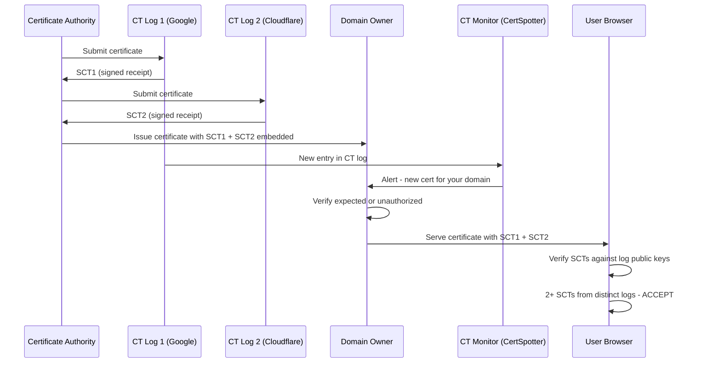

⚡ TL;DR - Certificate Transparency (CT, RFC 6962) is a framework requiring all
publicly trusted TLS certificates to be logged in append-only, publicly auditable
Merkle tree logs before browsers will accept them. Chrome enforced CT logging for
all certificates since April 2018 - a certificate not in a CT log gets a browser
warning. CT solves the rogue certificate problem: a certificate authority (CA)
issuing a certificate for your domain without your knowledge is detectable within
hours by monitoring CT logs. CT does NOT prevent issuance of unauthorized
certificates - it makes issuance publicly auditable and detectable.
Use crt.sh to monitor CT logs for your domains. Defense-in-depth: CT monitoring
+ CAA DNS records (restrict which CAs can issue for your domain) + certificate
pinning (for high-value apps). Attackers use crt.sh to discover subdomains and
new services - monitor your own domains before attackers do.

---

| #096 | Category: Security | Difficulty: ★★★ |
|:---|:---|:---|
| **Depends on:** | OWASP Top 10, Session Management, IAM, TLS Configuration, OAuth 2.0 Security, Auth Migration, OAuth vs SAML, Heartbleed, Advanced JWT, TLS Protocol Attacks | |
| **Used by:** | HSTS, Responsible Disclosure, IR Process, AWS Security Services, Security Governance, TLS 1.3 Protocol Design, Web Security Model | |
| **Related:** | OWASP Top 10, TLS Configuration, OAuth Security, Auth Migration, Heartbleed, Advanced JWT, TLS Protocol Attacks, HSTS, Responsible Disclosure, TLS 1.3 Design, Web Security Model | |

---

### 🔥 The Problem This Solves

**THE ROGUE CERTIFICATE PROBLEM:**

```
THE CA TRUST MODEL AND ITS FAILURE MODE:

  HOW TLS CERTIFICATE TRUST WORKS:
  
    Browser trusts ~150 root Certificate Authorities (CAs).
    If ANY of these CAs signs a certificate for mybank.com:
    Browser accepts the certificate as valid.
    
    This is the intended model: CAs verify domain ownership before issuing.
    
  THE CATASTROPHIC FAILURE CASE:
  
    What if a CA misbehaves?
    
    Scenario 1: CA is compromised.
    Attack: Hacker compromises DigiNotar CA (2011 attack).
    Hacker issues certificates for google.com, gmail.com, many others.
    Used for MITM attacks against ~300,000 Iranian users.
    Intercepted traffic TO Google: decryptable with the rogue cert.
    
    Scenario 2: CA issues certificate without proper domain verification.
    
    Scenario 3: Nation-state pressure on domestic CA.
    Government tells a domestic CA: "Issue us a cert for gmail.com."
    CA complies. Government performs MITM on citizens.
    
    THE DETECTION PROBLEM:
    Without Certificate Transparency:
    - The rogue certificate is used in the wild.
    - A user gets a browser warning ONLY if cert doesn't chain to a trusted CA.
    - If cert chains to a trusted CA (compromised): no warning.
    - Detection: only when a researcher or victim happens to compare certificates.
    - DigiNotar: discovered when a user noticed an unusual certificate.
    
    SCALE OF THE PROBLEM:
    Google detected its rogue certificate (DigiNotar attack) 18 days late.
    Only because a user in Iran reported an unusual certificate in Chrome.
    300,000+ MITM sessions had already occurred.
    
  CT SOLUTION: MAKE CERTIFICATE ISSUANCE PUBLIC AND AUDITABLE
  
    Certificate Transparency (RFC 6962, 2013; enforced by Chrome 2018):
    
    Every publicly trusted certificate MUST be logged in a CT log.
    CT logs are public, append-only, and cryptographically verifiable.
    
    Domain owner monitors CT logs for their domain.
    Unauthorized certificate issuance: detectable within minutes to hours.
    
    CT doesn't prevent issuance. It makes issuance visible.
    "You can't hide the certificate anymore."
    
    Analogy: Bank transaction monitoring.
    CT doesn't prevent fraud. It makes every transaction visible in a ledger.
    Domain owner is the account holder, checking the ledger for unknown transactions.
```

---

### 📘 Textbook Definition

**Certificate Transparency (RFC 6962, RFC 9162):** A framework requiring all
publicly trusted X.509 TLS certificates to be submitted to and accepted by a
Certificate Transparency log before browsers will accept the certificate.
CT logs are publicly accessible, append-only, and use Merkle tree data structures
for cryptographic verification. Anyone can query CT logs to see all certificates
issued for any domain.

**Merkle tree:** A binary tree where every leaf node is the hash of a certificate,
and every non-leaf node is the hash of its two children. The Merkle tree root
provides a compact commitment to the entire log contents. Appending entries changes
the root hash in a verifiable way. No entry can be deleted or modified without
changing the root hash (which would be detected by auditors).

**Signed Certificate Timestamp (SCT):** A cryptographic signature from a CT log
server, embedded in the TLS certificate (or delivered in the TLS handshake or via
OCSP stapling). The SCT proves that the certificate was submitted to a CT log at a
specific time. Browsers require one or more valid SCTs from distinct CT logs before
accepting a certificate (Chrome policy: 2+ SCTs from distinct logs for long-lived certs).

**crt.sh:** A public web interface and API for querying Certificate Transparency logs.
`crt.sh/?q=%.mycompany.com` returns all certificates issued for mycompany.com and
all subdomains. Used by security teams to monitor for unauthorized certificate
issuance and by attackers to enumerate subdomains.

**CAA (Certification Authority Authorization) DNS record:** A DNS record type that
specifies which certificate authorities are authorized to issue certificates for a
domain. Example: `mycompany.com. CAA 0 issue "letsencrypt.org"` - only Let's Encrypt
may issue certificates for mycompany.com. CAs must check CAA records before issuing
(required by CA/Browser Forum since 2017). CAA + CT = detection AND prevention.

**Append-only log:** A data structure that can only add new entries, never modify or
delete existing ones. CT logs are append-only and use Merkle tree proofs to guarantee
no removal of past entries. This property is critical: a CA cannot retroactively
hide a rogue certificate by removing it from the log.

---

### ⏱️ Understand It in 30 Seconds

**One line:**
Certificate Transparency makes every publicly trusted TLS certificate publicly
visible in append-only audit logs, so if any CA issues an unauthorized certificate
for your domain, you (or automated monitoring) can detect it within hours - not
after 18 days and 300,000 intercepted sessions.

**One analogy:**
> Imagine a city where any notary can certify that "Alice lives at 123 Main Street."
> 150 notaries exist, all trusted by the city.
> Problem: if one notary is corrupted, they can certify "Bob lives at 123 Main Street."
> Bob can now legally access Alice's property.
>
> Without CT: the city has no way to know a fraudulent certification exists
> until someone checks the specific notary's records manually.
>
> With CT (Certificate Transparency):
> EVERY certification must be registered in a public city ledger.
> The ledger is append-only - nothing can be erased.
> Anyone can query: "Show me all certifications for 123 Main Street."
>
> Alice (or an automated agent working for Alice) monitors the ledger.
> Unexpected entry: "Bob certified to live at 123 Main Street."
> Alice is alerted within minutes.
>
> CT doesn't stop the fraudulent notary from certifying.
> CT makes the certification VISIBLE within minutes of issuance.
> Rapid detection enables rapid response (revocation, investigation).
>
> crt.sh is the "city ledger" query tool.
> SCTs (Signed Certificate Timestamps) are the ledger receipts embedded in certs.
> Chrome's CT enforcement: "Show me your ledger receipt or I reject the cert."

---

### 🔩 First Principles Explanation

**CT log structure and verification:**

```
CERTIFICATE TRANSPARENCY LOG INTERNALS:

  STRUCTURE: Append-only Merkle tree of certificate entries.
  
  Each log entry: a submitted certificate (DER-encoded).
  Leaf hash: SHA-256(log_entry)
  
  Merkle tree:
  
  Level 0 (leaves):
    H(cert1) H(cert2) H(cert3) H(cert4) H(cert5) H(cert6) H(cert7) H(cert8)
  
  Level 1:
    H(H1+H2)    H(H3+H4)    H(H5+H6)    H(H7+H8)
  
  Level 2:
    H(H12+H34)               H(H56+H78)
  
  Level 3 (root):
    H(H1234+H5678)  = tree_head
  
  The tree_head is signed by the CT log: STH (Signed Tree Head).
  
  PROPERTIES:
  1. Append-only: adding cert9 changes the tree_head.
     Auditors compare STH over time: tree grows, never shrinks.
     
  2. Inclusion proof: for cert3, the proof is [H(cert4), H(H1+H2), H(H56+H78)].
     Verify: combine proof hashes to reconstruct tree_head.
     If matches known STH: cert3 is in the log.
     
  3. Consistency proof: prove the log at tree size N is a prefix of log at size M.
     Auditors check: log only grows, entries never removed or modified.

SIGNED CERTIFICATE TIMESTAMP (SCT):

  CA submits certificate to CT log (before issuance to domain owner):
  
    POST https://ct.googleapis.com/logs/argon2024/ct/v1/add-chain
    Body: base64(DER-encoded certificate chain)
    
  CT log responds immediately with SCT:
  
    {
      "sct_version": 0,
      "id": "base64(log_id)",
      "timestamp": 1735689600000,  // milliseconds since epoch
      "extensions": "",
      "signature": "base64(RSA or ECDSA signature over timestamp + cert)"
    }
  
  SCT is then embedded in the certificate (X.509 extension: 1.3.6.1.4.1.11129.2.4.2).
  
  Browser verification (simplified):
  1. Browser receives TLS certificate.
  2. Browser checks: does the cert have SCT extensions?
  3. Browser verifies each SCT signature against the CT log's public key.
  4. Browser checks: are there enough SCTs from distinct CT logs?
     (Chrome policy: 2+ for certificates valid > 15 months)
  5. If insufficient SCTs: show certificate error "CT requirements not met."
  6. Browser (async, post-connection): submits cert to Gossip protocol to
     check that SCT is on an actual CT log, not a fake CT log response.

CHROME CT ENFORCEMENT (2018):
  Chrome 68 (July 2018): CT enforcement for ALL publicly trusted certificates.
  Certificate without valid SCTs from approved CT logs → ERR_CERTIFICATE_TRANSPARENCY_REQUIRED.
  
  Apple Safari (2021): similar enforcement.
  Firefox: no enforcement (trust the browser's own HTTPS certificate reporting).
```

---

### 🧪 Thought Experiment

**SCENARIO: Rogue certificate detection via CT monitoring:**

```
SETUP:
  mycompany.com runs a critical API.
  Security team sets up CT monitoring for mycompany.com and all subdomains.

ATTACK SCENARIO:
  Attacker compromises a less-secure domain: oldproject.mycompany.com.
  Attacker uses ACME protocol against Let's Encrypt:
  Demonstrates control of oldproject.mycompany.com → Let's Encrypt issues cert.
  
  But: attacker actually wants a cert for api.mycompany.com (the main API).
  
  Attack: misdocumented SAN (Subject Alternative Name) in certificate request.
  Cert request for oldproject.mycompany.com with SAN: api.mycompany.com.
  
  [In reality, Let's Encrypt validates each SAN. This requires separate validation.
   But: historical CAs have issued unauthorized SANs. CT would detect this.]

CT MONITORING ALERT:
  
  Monitoring tool (certspotter, ct-exposer, or custom) watches CT logs.
  New cert appears in CT log for *.mycompany.com or api.mycompany.com.
  
  Alert:
    NEW CERTIFICATE DETECTED
    Domain: api.mycompany.com (also: oldproject.mycompany.com)
    Issuer: Let's Encrypt
    Logged at: 2024-01-15T10:23:45Z
    SCT from: Google Argon2024, Cloudflare Nimbus2024
    
    Was this certificate expected? [YES | NO]
    
  Security team investigates:
  Was a certificate for api.mycompany.com requested through normal channels?
  No → UNAUTHORIZED CERTIFICATE DETECTED.
  
  RESPONSE:
  1. Verify the certificate is being used (or attempted to be used).
  2. Contact Let's Encrypt: report unauthorized issuance.
  3. Revoke the certificate via Let's Encrypt API.
  4. Investigate how attacker controlled oldproject.mycompany.com.
  5. Deploy CAA record: mycompany.com. CAA 0 issue "letsencrypt.org"
     (only Let's Encrypt may issue; alerts if any other CA tries).
     
  ALTERNATIVE WITHOUT CT (DigiNotar scenario):
  Cert is used for MITM on API users.
  Discovered 18 days later by a user noticing a certificate anomaly.
  Impact: 18 days of intercepted API traffic.

ATTACKER USE OF CT:
  The same crt.sh tool attackers use for reconnaissance:
  
  $ curl 'https://crt.sh/?q=%.mycompany.com&output=json' | \
    jq '.[].name_value' | sort -u
  
  Output: all subdomains with SSL certificates EVER ISSUED.
  Reveals: staging environments, internal APIs accidentally exposed,
           old forgotten services (dev.mycompany.com from 2019).
  
  Security implication: check your own domains before attackers do.
  crt.sh is often how attackers find attack surface that you've forgotten about.
```

---

### 🧠 Mental Model / Analogy

> CT logs are like a public blockchain for TLS certificates.
>
> Properties shared with blockchain:
> - Append-only: nothing is ever deleted.
> - Cryptographically linked: changing any entry invalidates all subsequent hashes.
> - Publicly auditable: anyone can query the entire log.
> - Multiple independent logs: Google, Cloudflare, DigiCert, etc. - 
>   collusion required to corrupt multiple independent logs simultaneously.
>
> The Merkle tree is the data structure making these properties efficient:
> - Inclusion proof: prove a certificate is in the log in O(log N) hashes.
> - Consistency proof: prove log at time T1 is a subset of log at time T2.
>   No entries have been removed between T1 and T2.
>
> SCTs (Signed Certificate Timestamps) = receipts from the public ledger.
> Browser asks: "Show me your receipts from at least 2 different CT logs."
> No receipts = browser doesn't trust the cert.
>
> This is a trust-but-verify model:
> CAs are still trusted to issue certificates.
> But: every issued certificate is now publicly visible.
> "You can issue whatever you want - but we'll all see it."
>
> The monitoring closes the loop: seeing it → detecting unauthorized → revoking.
> CT is only effective if domain owners actually MONITOR the logs for their domains.
> CT without monitoring = a ledger no one reads.
> CT with monitoring = automated fraud detection.

---

### 📶 Gradual Depth - Five Levels

**Level 1 - What it is (anyone can understand):**
Certificate Transparency is a system where every SSL/TLS certificate issued for a website must be recorded in a public, tamper-proof log. If someone secretly issues a fake SSL certificate for your website, the CT log will record it, and monitoring tools will alert you within minutes.

**Level 2 - How to use it (junior developer):**
Check if your organization's domains have unexpected certificates: go to crt.sh and search `%.yourdomain.com`. Set up automated monitoring (CertSpotter by SSLMate, or crt.sh API alerts). Add CAA DNS records to restrict which CAs can issue certificates for your domain: `yourdomain.com. CAA 0 issue "letsencrypt.org"`. Verify your own certificates have SCTs (Signed Certificate Timestamps) - they should if issued by a modern CA.

**Level 3 - How it works (mid-level engineer):**
CA submits certificate to CT log before issuance. CT log returns SCT (Signed Certificate Timestamp) - a signed receipt. SCT is embedded in the certificate (or delivered via OCSP or TLS extension). Browser verifies: certificate has 2+ SCTs from distinct CT logs in approved log list. If not: `ERR_CERTIFICATE_TRANSPARENCY_REQUIRED` error. CT log structure: append-only Merkle tree. Log periodically publishes STH (Signed Tree Head) - a signed commitment to log state. Auditors verify: STH grows monotonically, log is consistent (no removals). crt.sh queries multiple CT logs and provides a search UI for domain owners (and attackers).

**Level 4 - Why it was designed this way (senior/staff):**
The Merkle tree design satisfies two properties simultaneously: O(log N) inclusion proofs (efficient) and append-only consistency proofs (tamper-evident). An alternative (simple hash-chaining) wouldn't allow efficient random-access inclusion proofs. A third-party auditor can verify the log without downloading the entire log: just the path from a specific leaf to the root (Merkle proof). The "at least 2 distinct CT logs" requirement (Chrome policy): if one CT log is compromised or colludes with a CA, the second independent log still provides detection. Trust in CT logs is distributed across multiple operators. CT log operators are vetted by browsers (Chrome's CT Log Policy, Apple's CT policy). A CT log that violates the append-only property gets delisted - certificates with SCTs from that log are no longer accepted.

**Level 5 - Mastery (distinguished engineer):**
CT and phishing: attackers register look-alike domains (mycompany-login.com) and get CT-logged certificates. The CT log reveals their phishing certificate before the attack begins. Domain monitoring (including look-alikes) via CT is a proactive phishing defense. OCSP (Online Certificate Status Protocol) and CT: OCSP provides revocation information. OCSP stapling: server includes OCSP response in TLS handshake (reduces latency). OCSP hardstaple + CT: certificate, OCSP response, and SCTs all provided in TLS handshake. Chrome Certificate Policy: chrome maintains an allowlist of CT logs. A new CT log must go through a vetting process (6+ months of operation, independent audits). Certificate pinning vs CT: HPKP (HTTP Public Key Pinning) was deprecated. CT + CAA provides most of the benefit without the risks of pinning (site lockout). Chrome deprecated HPKP in Chrome 67 (2018). CT is now the preferred certificate tracking mechanism. RFC 9162 (CT v2): supersedes RFC 6962. Adds support for "TLS leaf" logging (the end-entity cert only, without chain). Improves efficiency for large-scale CT log operations.

---

### ⚙️ How It Works (Mechanism)

```
CERTIFICATE TRANSPARENCY FLOW:

  1. CA generates certificate for domain.com.
  
  2. CA submits certificate to CT logs (before issuance):
     POST https://ct.googleapis.com/logs/argon2024/ct/v1/add-chain
     → Receives SCT (Signed Certificate Timestamp).
     POST https://ct.cloudflare.com/logs/nimbus2024/ct/v1/add-chain
     → Receives SCT from Cloudflare.
  
  3. CA embeds SCTs in certificate or serves via TLS extension.
  
  4. CA issues certificate to domain owner.
  
  5. Domain owner deploys certificate.
  
  6. User visits domain.com:
     a. Server sends certificate with embedded SCTs.
     b. Browser verifies SCT signatures against CT log public keys.
     c. Browser checks: 2+ SCTs from distinct approved logs? YES → proceed.
     d. No SCTs or insufficient SCTs: browser error.
  
  7. CT monitoring tool (crt.sh, CertSpotter) watches CT logs.
     Domain owner receives alert: "New cert issued for domain.com."
     Owner verifies: expected cert (from normal deployment) or unauthorized.
```



---

### 💻 Code Example

**CT log monitoring with crt.sh API (Python):**

```python
# ct_monitor.py
# Monitor Certificate Transparency logs for unauthorized certificate issuance.

import requests
import json
from datetime import datetime, timedelta
from typing import Optional

CRTSH_API = "https://crt.sh/?q={domain}&output=json"

def query_ct_logs(domain: str, days_back: int = 7) -> list[dict]:
    """Query crt.sh for recent certificates issued for a domain."""
    
    # %.domain.com queries all subdomains (% = SQL wildcard on crt.sh)
    url = CRTSH_API.format(domain=f"%.{domain}")
    
    response = requests.get(url, timeout=30)
    if response.status_code != 200:
        raise RuntimeError(f"crt.sh query failed: {response.status_code}")
    
    certs = response.json()
    
    # Filter to recently issued certificates:
    cutoff = datetime.utcnow() - timedelta(days=days_back)
    recent_certs = []
    
    for cert in certs:
        issued_at_str = cert.get("not_before", "")
        if not issued_at_str:
            continue
        
        try:
            issued_at = datetime.strptime(
                issued_at_str, "%Y-%m-%dT%H:%M:%S")
        except ValueError:
            continue
        
        if issued_at >= cutoff:
            recent_certs.append({
                "id": cert.get("id"),
                "name": cert.get("name_value", "").replace("\\n", "\n"),
                "issuer": cert.get("issuer_name", ""),
                "issued_at": issued_at_str,
                "serial_number": cert.get("serial_number", ""),
                "cert_link": f"https://crt.sh/?id={cert.get('id')}",
            })
    
    return recent_certs

def detect_suspicious_certs(
        domain: str,
        expected_issuers: Optional[list[str]] = None,
        days_back: int = 7) -> list[dict]:
    """
    Detect certificates that:
    - Were issued by unexpected CAs (if expected_issuers is provided)
    - Cover wildcard domains (*.domain.com)
    """
    
    certs = query_ct_logs(domain, days_back)
    suspicious = []
    
    for cert in certs:
        flags = []
        
        # Check issuer against allowlist:
        if expected_issuers:
            issuer = cert.get("issuer", "").lower()
            if not any(
                    exp.lower() in issuer for exp in expected_issuers):
                flags.append(
                    f"Unexpected issuer: {cert.get('issuer')}")
        
        # Flag wildcard certificates:
        names = cert.get("name", "")
        if "*." in names:
            flags.append(f"Wildcard cert: {names}")
        
        if flags:
            cert["flags"] = flags
            suspicious.append(cert)
    
    return suspicious

# Usage:
if __name__ == "__main__":
    domain = "mycompany.com"
    expected_issuers = ["Let's Encrypt", "DigiCert"]
    
    suspicious = detect_suspicious_certs(
        domain,
        expected_issuers=expected_issuers,
        days_back=1
    )
    
    if suspicious:
        print(f"ALERT: {len(suspicious)} suspicious certificate(s):")
        for cert in suspicious:
            print(f"  Domain: {cert['name']}")
            print(f"  Issuer: {cert['issuer']}")
            print(f"  Issued: {cert['issued_at']}")
            print(f"  Link: {cert['cert_link']}")
            for flag in cert.get('flags', []):
                print(f"  FLAG: {flag}")
            print()
    else:
        print(f"No suspicious certificates found for {domain}.")

# QUICK MANUAL QUERIES:
# All certs for a domain:
# https://crt.sh/?q=%.mycompany.com
#
# Recent certs in JSON:
# curl 'https://crt.sh/?q=%.mycompany.com&output=json' | jq '.[].name_value'
#
# Certificates issued in last 24h:
# curl 'https://crt.sh/?q=%.mycompany.com&output=json' | \
#   jq '[.[] | select(.not_before > "2024-01-15")]'

# CAA DNS RECORD (restrict which CAs can issue):
# Add to DNS zone for mycompany.com:
# mycompany.com. 300 IN CAA 0 issue "letsencrypt.org"
# mycompany.com. 300 IN CAA 0 issue "digicert.com"
# mycompany.com. 300 IN CAA 0 issuewild ";" (no wildcard certs allowed)
# mycompany.com. 300 IN CAA 0 iodef "mailto:security@mycompany.com"
#   (report unauthorized issuance attempts to security team)
```

---

### ⚖️ Comparison Table

| Mechanism | What It Does | Prevents Issuance? | Detects Issuance? | Monitoring Needed? |
|:---|:---|:---|:---|:---|
| **CT Logs** | Append-only public audit log | No | Yes (within minutes of logging) | Yes (crt.sh/CertSpotter) |
| **CAA DNS Records** | Restricts which CAs may issue | Yes (if CA checks) | No | No |
| **HPKP (deprecated)** | Pins expected cert in browser | No | Yes (via browser) | Browser-reported |
| **Certificate Pinning** | App rejects unexpected certs | No | Yes (per-app) | App update needed |
| **Browser CT enforcement** | Requires SCTs for acceptance | No (post-issuance) | Yes (user sees error) | Passive |

---

### ⚠️ Common Misconceptions

| Misconception | Reality |
|:---|:---|
| "CT prevents unauthorized certificates from being issued." | CT does NOT prevent issuance. Any CA can still issue a certificate for any domain. CT makes issuance PUBLIC and DETECTABLE after the fact. The CT framework requires that the certificate be logged BEFORE it can be trusted by browsers. But the logging happens at issuance time - the certificate is already issued when it appears in the CT log. The correct defense for prevention is CAA DNS records (CAs MUST check CAA before issuance since 2017). CAA restricts WHICH CAs can issue. CT detects IF an unauthorized certificate was issued (even by an authorized CA that made an error). CT + CAA together: CAA reduces the chance of unauthorized issuance, CT provides detection if CAA is circumvented or a CA misbehaves. |
| "My certificates are already in CT logs, so I'm protected." | CT provides protection only if you MONITOR the CT logs for your domain. Having your legitimate certificates in CT logs is a requirement for browser acceptance, not a security benefit in itself. The security benefit of CT comes from: domain owners querying CT logs (via crt.sh or monitoring services) for UNEXPECTED certificates that appear for their domain. Without monitoring: CT logs contain the evidence of unauthorized certificate issuance, but no one is looking at it. "CT without monitoring" = a security camera that records but no one ever watches the footage. Set up automated CT monitoring (CertSpotter, SSLMate, or custom crt.sh queries) as a continuous security control. |

---

### 🚨 Failure Modes & Diagnosis

**CT monitoring gaps and detection:**

```
DETECTING CT-RELATED SECURITY ISSUES:

  1. VERIFY YOUR CERTS ARE IN CT LOGS:
    
    # Check a specific certificate's SCTs:
    openssl s_client -connect mycompany.com:443 | \
      openssl x509 -noout -text | grep -A 10 "CT Precertificate"
    
    Should see: CT Precertificate Signed Certificate Timestamp
    If absent: cert may not be in CT logs → older cert or non-public CA.
    
    Online check: sslshopper.com, badssl.com/dashboard/ct
  
  2. MONITOR FOR UNAUTHORIZED CERTS:
    
    # crt.sh API (free, covers major CT logs):
    curl 'https://crt.sh/?q=%.mycompany.com&output=json' | \
      jq '.[] | select(.not_before > "2024-01-01") | {name: .name_value, issuer: .issuer_name}'
    
    # CertSpotter (SSLMate): free tier, email alerts for new certs:
    # sslmate.com/certspotter - set up domain monitoring
    
    # Facebook Certificate Transparency Monitoring:
    # developers.facebook.com/tools/ct/ (webhook notifications)
  
  3. VERIFY CAA RECORDS:
    
    # Check existing CAA records:
    dig CAA mycompany.com
    
    # Example good CAA:
    mycompany.com. 300 IN CAA 0 issue "letsencrypt.org"
    mycompany.com. 300 IN CAA 0 iodef "mailto:security@mycompany.com"
    
    # If no CAA record: any CA can issue. Add CAA to restrict.
  
  4. ATTACKER RECON VIA CT (understand what attackers see):
    
    # Enumerate all subdomains via CT:
    curl 'https://crt.sh/?q=%.mycompany.com&output=json' | \
      jq '.[].name_value' | tr ',' '\n' | sort -u | \
      grep -v "^\\*"  # exclude wildcard entries
    
    # Review: are any unexpected subdomains revealed?
    # dev.mycompany.com, staging.mycompany.com, old-admin.mycompany.com
    # Attackers will check these first.
  
  5. INCIDENT RESPONSE - UNAUTHORIZED CERT FOUND:
    
    [ ] Verify cert is/was active (check CT log entry time)
    [ ] Determine if cert was used (DNS lookup, traffic analysis)
    [ ] Contact CA: report unauthorized issuance, request revocation
    [ ] Add CAA record to prevent recurrence
    [ ] Investigate how the unauthorized issuance occurred
    [ ] Check if MITM attacks occurred (correlate with access logs)
    [ ] Report to CA/Browser Forum if CA violated policy
```

---

### 🔗 Related Keywords

**Prerequisites:**
- `TLS Configuration` (SEC-041) - TLS certificates, basics of PKI
- `TLS Protocol Attacks` (SEC-095) - historical context (DigiNotar motivated CT)

**Builds on this:**
- `HSTS` (SEC-097) - HSTS preloading complements CT monitoring
- `TLS 1.3 Protocol Design Rationale` (SEC-130) - TLS security architecture

---

### 📌 Quick Reference Card

```
┌──────────────────────────────────────────────────────────┐
│ CT LOGS       │ Public, append-only Merkle tree logs     │
│               │ Every public cert must be logged         │
│               │ Chrome requires 2+ SCTs since 2018       │
├───────────────┼──────────────────────────────────────────┤
│ SCT           │ Signed receipt from CT log               │
│               │ Embedded in cert or via TLS/OCSP         │
│               │ Browser rejects cert without valid SCTs  │
├───────────────┼──────────────────────────────────────────┤
│ MONITORING    │ crt.sh: search %.yourdomain.com          │
│               │ CertSpotter: automated email alerts      │
│               │ Facebook CT API: webhook notifications   │
├───────────────┼──────────────────────────────────────────┤
│ CAA           │ DNS record: restrict which CAs may issue │
│               │ CAA 0 issue "letsencrypt.org"            │
│               │ CAA 0 iodef "mailto:security@..."        │
├───────────────┼──────────────────────────────────────────┤
│ CT vs PREVENT │ CT detects unauthorized issuance         │
│               │ CAA DNS prevents it (CAs must check)     │
│               │ Both needed together                     │
└──────────────────────────────────────────────────────────┘
```

---

### 💎 Transferable Wisdom

**Reusable Engineering Principle:**
"If you can't prevent a bad action, make the bad action maximally visible."
CT is an application of the principle: auditability as a security control.
When prevention is not fully achievable (CAs will sometimes misbehave, be compromised,
or make mistakes), auditability is the next-best control.
Auditability requirements:
1. Every action must be recorded: CT logs every certificate issuance.
2. The record must be tamper-evident: Merkle tree makes deletion detectable.
3. The record must be publicly accessible: anyone can query CT logs.
4. The record must be monitored: domain owners set up CT monitoring.
Without #4: auditability is a passive control. With #4: it's an active detection system.
This pattern applies broadly in security engineering:
- Database audit logging: every query logged. Who accessed what data?
- API access logs: every API call logged. Unusual patterns detectable.
- Cloud CloudTrail / audit logs: every AWS API call recorded.
  Detect: "Who deleted those S3 objects?" "Who created that IAM user at 3am?"
- Code change tracking (git): every code change recorded with author and timestamp.
  Detect: "Who added this backdoor? When?"
The common thread: make all actions visible to authorized auditors,
make the audit trail tamper-evident, and monitor it continuously.
Auditability is how you detect the insider threat, the compromised account,
and the misbehaving third party when prevention has failed.
The practical implication for system design:
"Log everything security-relevant. Make logs append-only and off-machine.
Alert on anomalies. Treat logging infrastructure as a security-critical component."

---

### 💡 The Surprising Truth

The motivating incident for Certificate Transparency: DigiNotar (2011).
DigiNotar was a Dutch CA. The company was hacked. The attacker issued
a wildcard certificate for *.google.com. This certificate was used for MITM
attacks against ~300,000 Iranian users trying to access Google.

Google detected it: only because Chrome had a feature where Google's own domains
were hardcoded as "expected" certificates. A user in Iran got a Chrome warning
because the certificate wasn't the hardcoded Google one. The user reported it.

Google engineers investigated: 531 rogue certificates had been issued, for:
Google, Yahoo, Mozilla, Microsoft, Skype, CIA, MI6, and others.

The certificates had been in use for 36+ days before discovery.

The response: DigiNotar was removed from all browser trusted root stores.
DigiNotar went bankrupt weeks later. The Dutch government had to take over
all DigiNotar certificate management for government websites.

The aftermath led directly to the Certificate Transparency design:
"We need to know about certificate issuance in MINUTES, not 36 days."

The engineering insight: the gap from "CA issues cert" to "anyone knows about it"
was the vulnerability. CT closes that gap to minutes. The delay from issuance
to CT log appearance: typically < 5 minutes. The delay from log appearance
to monitoring alert: typically < 1 hour with automated monitoring.

36 days → < 1 hour. That's the security improvement CT delivers.
The implementation cost: CAs submit to CT logs (already automated).
Domain owners set up monitoring (one-time setup).
Browsers enforce SCT requirements (already deployed).

CT is an example of a security improvement that provides significant benefit
with minimal ongoing operational cost. The insight it embodies:
visibility is as powerful as prevention when detection is fast enough
to enable rapid response before damage occurs.

---

### ✅ Mastery Checklist

**You've mastered this when you can:**
1. **EXPLAIN** what CT prevents vs what it detects: CT does NOT prevent unauthorized
   certificate issuance. It makes issuance publicly visible within minutes,
   enabling rapid detection if domain owners monitor CT logs.
2. **DESCRIBE** the Merkle tree property: append-only, tamper-evident.
   Adding entries changes the root hash. Removing entries changes the root hash.
   Consistency proofs verify the log only grows, never shrinks.
3. **USE** crt.sh: `curl 'https://crt.sh/?q=%.mycompany.com&output=json'` to query
   all certificates ever issued for a domain and subdomains.
4. **DIFFERENTIATE** CT (detect unauthorized issuance) from CAA records
   (prevent unauthorized issuance by restricting which CAs may issue).

---

### 🎯 Interview Deep-Dive

**Q: What is Certificate Transparency? Why was it introduced? What does it
detect and what doesn't it prevent?**

*Why they ask:* Tests PKI/TLS security depth and understanding of the CA trust model.
Relevant for security, infrastructure, and senior backend roles.

*Strong answer covers:*
- Problem: any of ~150 trusted root CAs can issue a cert for any domain.
  A compromised or misbehaving CA can issue unauthorized certs. DigiNotar 2011:
  531 rogue certs for Google, Yahoo, etc. Used for MITM against 300,000 users.
  Discovered 36 days later only because Chrome hardcoded Google's expected cert.
- CT (RFC 6962, 2013): every publicly trusted cert must be submitted to a CT log.
  CT logs: append-only Merkle tree structure. Tamper-evident.
  SCT (Signed Certificate Timestamp): receipt from CT log, embedded in cert.
  Chrome enforces 2+ SCTs from distinct CT logs since 2018.
  Browser rejects cert without valid SCTs: `ERR_CERTIFICATE_TRANSPARENCY_REQUIRED`.
- CT detects: unauthorized certificate issuance (domain owners monitor CT logs).
  Detection speed: < 1 hour with automated monitoring (vs 36 days without CT).
- CT does NOT prevent: a CA can still issue an unauthorized cert. The cert is logged.
  Prevention: CAA DNS records restrict which CAs may issue for your domain.
- Attacker use: crt.sh to enumerate all subdomains (every cert = subdomain revealed).
  Security teams should query crt.sh for their own domains regularly.
- Practical monitoring: CertSpotter (sslmate.com), Facebook CT API, crt.sh API.
  Automated query: `curl 'https://crt.sh/?q=%.domain.com&output=json'`.
- CAA DNS + CT together: CAA prevents unauthorized issuance,
  CT detects if CAA is bypassed or a CA makes an error.